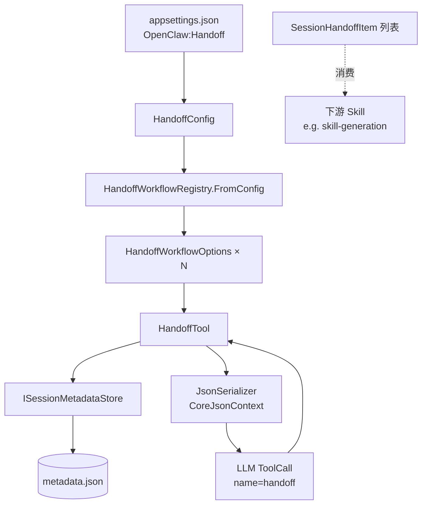
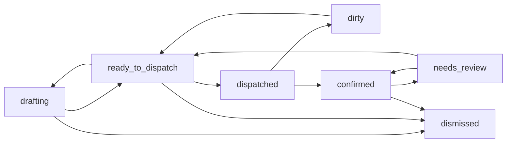
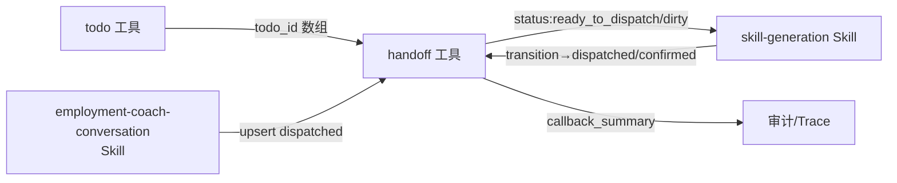

# Handoff 工具（handoff）

> 整合主文档：会话级工作流移交（handoff）工具的契约、状态机、并发与配置。
> 对应源码权威：[HandoffTool.cs](file:///e:/gitee/kingcrab/src/OpenClaw.Gateway/Tools/HandoffTool.cs) · [HandoffWorkflowOptions.cs](file:///e:/gitee/kingcrab/src/OpenClaw.Gateway/Tools/HandoffWorkflowOptions.cs) · [KingcrabHandoffModels.cs](file:///e:/gitee/kingcrab/src/OpenClaw.Core/Models/KingcrabHandoffModels.cs)
> 关联文档：[Todo 工具.md](Todo%20%E5%B7%A5%E5%85%B7.md) · [技能系统.md](../技能系统/技能系统.md)

> ⚠️ **同名歧义**：repowiki 别处出现的 `fractal_memory_handoff_create` 是分形记忆移交工具（`src/OpenClaw.Agent/Tools/FractalMemoryTools.cs`），与本文 `handoff` 工具**不是同一个**。本文档专指 `OpenClaw.Gateway.Tools.HandoffTool`。

---

## 1. 简介

`handoff` 是会话级**工作流移交工具**：把"待 Skill 派发的工单"以条目（`SessionHandoffItem`）形式持久化在会话 metadata 中，沿着配置好的状态机推进，最终供下游 Skill（如 employment-coach 的 `skill-generation`）批量消费。它的核心能力比 [Todo 工具](Todo%20%E5%B7%A5%E5%85%B7.md) 重得多：

* **多工作流**：同一会话内可同时持有多个 `workflow_id`，每个工作流独立配置阶段、目标 Skill、状态机和 ID 前缀。
* **状态机驱动**：所有 status 变更必须满足 `HandoffWorkflowOptions.CanTransition`。
* **乐观并发**：`patch` / `transition` 支持 `expected_revision` 校验，避免并发覆盖。
* **指纹去重**：同一 workflow 内 `fingerprint` 唯一，`upsert` 命中重复 fingerprint 时改写既有条目而非新建。
* **payload 深合并**：嵌套对象按 key 递归 merge，标量按 patch 覆盖。

---

## 2. 模块边界



| 层 | 文件 | 职责 |
| --- | --- | --- |
| 工具实现 | [HandoffTool.cs](file:///e:/gitee/kingcrab/src/OpenClaw.Gateway/Tools/HandoffTool.cs)（591 行） | actions 路由、CRUD、状态机校验、payload merge |
| 工作流元配置 | [HandoffWorkflowOptions.cs](file:///e:/gitee/kingcrab/src/OpenClaw.Gateway/Tools/HandoffWorkflowOptions.cs)（100 行） | `HandoffWorkflowRegistry` + 单个 `HandoffWorkflowOptions` |
| 数据模型 | [KingcrabHandoffModels.cs](file:///e:/gitee/kingcrab/src/OpenClaw.Core/Models/KingcrabHandoffModels.cs)（145 行） | `HandoffConfig` / `SessionHandoffItem` / 3 个 Response 类型 |
| 持久化 | [`ISessionMetadataStore`](file:///e:/gitee/kingcrab/src/OpenClaw.Core/Abstractions/ISessionMetadataStore.cs) | 按 `Session.Id` 读写 metadata.HandoffItems |
| 测试契约 | [HandoffToolTests.cs](file:///e:/gitee/kingcrab/src/OpenClaw.Tests/HandoffToolTests.cs)（416 行） | 含 employment-coach 与 research-workflow 双工作流装载 |
| 典型消费者 | [`employment-coach-conversation` / `skill-generation`](file:///e:/gitee/kingcrab/src/OpenClaw.Plugins.EmploymentCoachWorkflow/skills/skill-generation/SKILL.md) | 接收 `kind:handoff_todo, target_skill:skill-generation, status:ready_to_dispatch/dirty` 工单 |

---

## 3. 工具契约

### 3.1 元信息

| 字段 | 值 | 源码 |
| --- | --- | --- |
| `Name` | `"handoff"` | [HandoffTool.cs#L51](file:///e:/gitee/kingcrab/src/OpenClaw.Gateway/Tools/HandoffTool.cs#L51) |
| `Description` | `Manage session-scoped workflow handoff items. Supports list, upsert, patch, transition, and remove via an action parameter.` | [HandoffTool.cs#L53](file:///e:/gitee/kingcrab/src/OpenClaw.Gateway/Tools/HandoffTool.cs#L53) |
| 接口 | `IToolWithContext` | [HandoffTool.cs#L7](file:///e:/gitee/kingcrab/src/OpenClaw.Gateway/Tools/HandoffTool.cs#L7) |

无上下文调用直接返回 `Error: handoff requires execution context.`（[#L85-L86](file:///e:/gitee/kingcrab/src/OpenClaw.Gateway/Tools/HandoffTool.cs#L85-L86)）。

### 3.2 ParameterSchema

源码：[HandoffTool.cs#L55-L83](file:///e:/gitee/kingcrab/src/OpenClaw.Gateway/Tools/HandoffTool.cs#L55-L83)。

```json
{
  "type": "object",
  "properties": {
    "action":            {"type": "string", "enum": ["list","upsert","patch","transition","remove"], "default": "list"},
    "workflow_id":       {"type": "string"},
    "handoff_id":        {"type": "string"},
    "title":             {"type": "string"},
    "kind":              {"type": "string"},
    "stage":             {"type": "string"},
    "target_skill":      {"type": "string"},
    "intent":            {"type": "string"},
    "category":          {"type": "string"},
    "payload":           {"type": "object"},
    "source":            {"type": "string"},
    "acceptance":        {"type": "string"},
    "status":            {"type": "string"},
    "fingerprint":       {"type": "string"},
    "related_todos":     {"type": "array", "items": {"type": "string"}},
    "related_files":     {"type": "array", "items": {"type": "string"}},
    "patch":             {"type": "object"},
    "expected_revision": {"type": "integer"},
    "dispatch_id":       {"type": "string"},
    "callback_summary":  {"type": "string"},
    "reason":            {"type": "string"}
  },
  "required": ["action"]
}
```

### 3.3 actions 路由

源码：[HandoffTool.cs#L97-L105](file:///e:/gitee/kingcrab/src/OpenClaw.Gateway/Tools/HandoffTool.cs#L97-L105)

| action | 必填 | 必传字段（除 `action`） | 行为 |
| --- | --- | --- | --- |
| `list`（默认） | — | 可选 5 维过滤 | 返回当前 workflow 下匹配条目 |
| `upsert` | ✅ | `fingerprint`，新建另需 `title/stage/target_skill/payload` | 同 fingerprint 改写、否则新建 |
| `patch` | ✅ | `handoff_id`、`patch`（对象） | 字段级补丁 + 状态机 + 乐观并发 |
| `transition` | ✅ | `handoff_id`、`status` | 仅状态变更（其它字段不动） |
| `remove` | ✅ | `handoff_id`、`reason` | 物理删除 + 必填理由 |

任何 action 都先经 `TryResolveWorkflow` 解析 `workflow_id`（缺省走 `DefaultWorkflowId`），未注册则返回 `Error: workflow_id '<id>' is not registered.`（[#L413-L424](file:///e:/gitee/kingcrab/src/OpenClaw.Gateway/Tools/HandoffTool.cs#L413-L424)）。

---

## 4. 工作流配置：HandoffWorkflowOptions

### 4.1 字段表

源码：[HandoffWorkflowOptions.cs#L29-L99](file:///e:/gitee/kingcrab/src/OpenClaw.Gateway/Tools/HandoffWorkflowOptions.cs#L29-L99)

| 属性 | 类型 | 默认 | 用途 |
| --- | --- | --- | --- |
| `WorkflowId` | `string` required | — | 工作流唯一标识 |
| `Kind` | `string` | `"handoff_todo"` | 强制校验 `SessionHandoffItem.Kind == workflow.Kind` |
| `DefaultStatus` | `string` | `"drafting"` | 新建条目未指定 status 时的默认值 |
| `NewItemStatuses` | `string[]` | `["drafting","ready_to_dispatch"]` | 新建条目允许的初始 status 白名单 |
| `Stages` | `string[]` | `[]` | 合法 stage 白名单 |
| `TargetSkills` | `string[]` | `[]` | 合法 target_skill 白名单 |
| `Statuses` | `string[]` | `[]` | 合法 status 全集（含中间态/终态） |
| `Transitions` | `IReadOnlyDictionary<string,string[]>` | `{}` | 状态机：`{ from: [allowed_to ...] }` |
| `IdPrefixes` | `IReadOnlyDictionary<string,string>` | `{}` | 按 stage 决定 `handoff_id` 前缀（缺省 `"h"`） |

校验方法：`IsValidStage` / `IsValidTargetSkill` / `IsValidStatus` / `IsValidNewItemStatus` / `CanTransition` / `GetIdPrefix`（[#L41-L58](file:///e:/gitee/kingcrab/src/OpenClaw.Gateway/Tools/HandoffWorkflowOptions.cs#L41-L58)）。

### 4.2 注册器：HandoffWorkflowRegistry

源码：[HandoffWorkflowOptions.cs#L5-L27](file:///e:/gitee/kingcrab/src/OpenClaw.Gateway/Tools/HandoffWorkflowOptions.cs#L5-L27)

* `FromConfig(HandoffConfig)` 把 `appsettings` 中的 `OpenClaw:Handoff:Workflows:<id>:*` 字典转换为 `HandoffWorkflowOptions[]`。
* `DefaultWorkflowId` 缺省时取数组首项。
* `NormalizeArray` / `NormalizeDictionary` / `NormalizeTransitions` 自动 trim、去空、去重，配置侧无需小心。

### 4.3 配置示例（appsettings.json）

来自 `HandoffToolTests.cs#L316-L352` 的 employment-coach 工作流（最权威）：

```jsonc
{
  "OpenClaw": {
    "Handoff": {
      "DefaultWorkflowId": "employment-coach",
      "Workflows": {
        "employment-coach": {
          "Kind": "handoff_todo",
          "DefaultStatus": "drafting",
          "NewItemStatuses": ["drafting", "ready_to_dispatch"],
          "Stages":          ["material", "skill", "external", "cross_stage"],
          "TargetSkills":    ["ontology-extraction", "skill-generation", "external-config"],
          "Statuses":        ["drafting", "ready_to_dispatch", "dispatched", "dirty",
                              "confirmed", "needs_review", "dismissed"],
          "Transitions": {
            "drafting":           ["ready_to_dispatch", "dismissed"],
            "ready_to_dispatch":  ["drafting", "dispatched", "dismissed"],
            "dispatched":         ["dirty", "confirmed"],
            "dirty":              ["ready_to_dispatch"],
            "confirmed":          ["needs_review", "dismissed"],
            "needs_review":       ["confirmed", "ready_to_dispatch"]
          },
          "IdPrefixes": { "material": "m", "skill": "s", "external": "e" }
        }
      }
    }
  }
}
```

> 同一 `OpenClaw:Handoff:Workflows` 节点下可同时声明多个工作流（如测试中的 `research-workflow`），由 `workflow_id` 入参选择。

---

## 5. 数据模型：SessionHandoffItem

源码：[KingcrabHandoffModels.cs#L32-L96](file:///e:/gitee/kingcrab/src/OpenClaw.Core/Models/KingcrabHandoffModels.cs#L32-L96)（17 字段，全部带 `JsonPropertyName`）

| JSON 字段 | 类型 | 默认 | 说明 |
| --- | --- | --- | --- |
| `session_id` | `string` required | — | 会话 ID（由工具自动注入） |
| `workflow_id` | `string` | `"employment-coach"` | 选定工作流 |
| `handoff_id` | `string` required | — | `<prefix>_<guid>`，前缀来自 `IdPrefixes[stage]` |
| `title` | `string` | `""` | 显示标题（`upsert` 新建必填） |
| `kind` | `string` | `"handoff_todo"` | 必须等于 `workflow.Kind` |
| `stage` | `string` | `""` | 必须在 `workflow.Stages` |
| `target_skill` | `string` | `""` | 必须在 `workflow.TargetSkills` |
| `intent` | `string?` | — | 自由文本意图描述 |
| `category` | `string?` | — | 业务分类标签 |
| `payload` | `JsonElement` | `{}` | 业务负载，**深合并** |
| `source` | `string?` | — | 数据来源标记 |
| `acceptance` | `string?` | — | 验收标准 |
| `status` | `string` | `"drafting"` | 必须在 `workflow.Statuses` |
| `fingerprint` | `string` | `""` | 同 workflow 内唯一去重键 |
| `related_todos` | `string[]` | `[]` | 关联的 [todo_id](Todo%20%E5%B7%A5%E5%85%B7.md) |
| `related_files` | `string[]` | `[]` | 关联文件路径 |
| `revision` | `int` | `1` | 每次写入 +1，乐观并发依据 |
| `created_at` / `updated_at` | `DateTimeOffset` | UTC now | 时间戳 |
| `dispatch_id` | `string?` | — | 派发轮次 ID |
| `callback_summary` | `string?` | — | 下游回写摘要 |

`HandoffId` 生成：`$"{prefix}_{Guid:N}"[..18]`（[#L576-L580](file:///e:/gitee/kingcrab/src/OpenClaw.Gateway/Tools/HandoffTool.cs#L576-L580)），即 `<prefix>` + `_` + 16 位 Guid。

---

## 6. action 流程详解

### 6.1 `list`

源码：[#L110-L127](file:///e:/gitee/kingcrab/src/OpenClaw.Gateway/Tools/HandoffTool.cs#L110-L127)。在 `metadata.HandoffItems` 中先按 `workflow_id` 过滤（`IsWorkflowItem`），再支持 5 维 AND 过滤：`kind` / `stage` / `target_skill` / `status` / `fingerprint`，过滤逻辑见 `MatchesFilter`（[#L443-L447](file:///e:/gitee/kingcrab/src/OpenClaw.Gateway/Tools/HandoffTool.cs#L443-L447)，缺省/空值不参与过滤）。返回 `SessionHandoffListResponse`。

### 6.2 `upsert`

源码：[#L129-L233](file:///e:/gitee/kingcrab/src/OpenClaw.Gateway/Tools/HandoffTool.cs#L129-L233)

1. **必校验**：`fingerprint` 必填（[#L131-L133](file:///e:/gitee/kingcrab/src/OpenClaw.Gateway/Tools/HandoffTool.cs#L131-L133)）。
2. **去重命中**：同 workflow 内已存在相同 fingerprint → 走"改写"分支：
   * 先 `ValidateHandoffShape`（kind/stage/target_skill/status 4 项白名单）
   * 再 `workflow.CanTransition(existing.Status, status)`，违反返回 `InvalidTransition`
   * 字段缺省 fallback existing；payload 走 `MergePayload`
   * `Revision = existing.Revision + 1`
3. **新建分支**：
   * 必填：`title` / `stage` / `target_skill` / `payload`
   * `kind` 缺省 = `workflow.Kind`；`status` 缺省 = `workflow.DefaultStatus`，且必须满足 `IsValidNewItemStatus`（即在 `NewItemStatuses` 内）
   * `handoff_id` 由 `CreateHandoffId(workflow, stage)` 生成

### 6.3 `patch`

源码：[#L235-L307](file:///e:/gitee/kingcrab/src/OpenClaw.Gateway/Tools/HandoffTool.cs#L235-L307)

* 必填 `handoff_id` + `patch`（对象）。
* **乐观并发**：可选 `expected_revision`，若提供且与当前 `Revision` 不等 → `RevisionMismatch`（[#L465-L466](file:///e:/gitee/kingcrab/src/OpenClaw.Gateway/Tools/HandoffTool.cs#L465-L466)）。
* **指纹冲突检测**：若 patch 改写 `fingerprint`，且新指纹被同 workflow 其它条目占用 → 报错（[#L272-L273](file:///e:/gitee/kingcrab/src/OpenClaw.Gateway/Tools/HandoffTool.cs#L272-L273)）。
* `payload` 走深合并（见 §8）；其它字段缺省 fallback existing。
* 写入后 `Revision++`。

### 6.4 `transition`

源码：[#L309-L362](file:///e:/gitee/kingcrab/src/OpenClaw.Gateway/Tools/HandoffTool.cs#L309-L362)

* 必填 `handoff_id` + `status`，`status` 必须在 `workflow.Statuses`。
* 同样支持 `expected_revision` 乐观并发。
* **只动 status / dispatch_id / callback_summary / updated_at / revision**——业务字段（title/stage/payload 等）不变。
* 适合纯流程推进场景（如下游 Skill 处理完后回写 `dispatched → confirmed`）。

### 6.5 `remove`

源码：[#L364-L392](file:///e:/gitee/kingcrab/src/OpenClaw.Gateway/Tools/HandoffTool.cs#L364-L392)

* 必填 `handoff_id` + **`reason`**（合规审计要求）。
* 物理删除（不是状态切换为 `dismissed`，注意区分）。
* 返回 `SessionHandoffRemoveResponse`，含剩余条目列表。

> 软删除请用 `transition` → `dismissed`；`remove` 仅用于真正的脏数据/误建条目清理。

---

## 7. 状态机示例（employment-coach）



校验入口 `CanTransition`（[HandoffWorkflowOptions.cs#L53-L55](file:///e:/gitee/kingcrab/src/OpenClaw.Gateway/Tools/HandoffWorkflowOptions.cs#L53-L55)）：相同状态视为合法（幂等）；否则需在 `Transitions[from]` 内才允许。

---

## 8. payload 深合并语义

源码：[#L516-L561](file:///e:/gitee/kingcrab/src/OpenClaw.Gateway/Tools/HandoffTool.cs#L516-L561)

* 双方都是 `JsonValueKind.Object` → 递归 merge：
  * 同 key 都是 object → 递归
  * 同 key 任一为标量/数组 → patch 覆盖 existing
  * patch 独有 key → 追加
* 任一不是 object → 直接以 patch 整体替换。
* 数组**整体替换**（不做 union/append）。

注意：`upsert` 命中已有 fingerprint 时，**只有传了 `payload` 字段才 merge**；否则走 `ClonePayload(existing.Payload)` 保留原值（[#L169](file:///e:/gitee/kingcrab/src/OpenClaw.Gateway/Tools/HandoffTool.cs#L169)）。这意味着 `upsert` 不会"无意中清空" payload。

---

## 9. 调用示例（LLM 视角）

```jsonc
// 1. 新建（emp-coach 默认 workflow）
{
  "action": "upsert",
  "title": "Draft skill: 退款申请进度查询",
  "stage": "skill",
  "target_skill": "skill-generation",
  "fingerprint": "skill:refund_progress_init",
  "payload": {"skills": [{"skill_name": "Refund progress lookup"}]},
  "related_todos": ["todo_4f9a1b8c7d6e5"]
}

// 2. 同 fingerprint 二次 upsert → 改写并 +revision
{
  "action": "upsert",
  "stage": "skill",
  "target_skill": "skill-generation",
  "fingerprint": "skill:refund_progress_init",
  "payload": {"skills": [{"acceptance": "返回订单 ID 和退款状态"}]}  // 深合并到既有 skills 数组
}

// 3. 状态推进（带乐观并发）
{
  "action": "transition",
  "handoff_id": "s_4f9a1b8c7d6e5a8b",
  "status": "ready_to_dispatch",
  "expected_revision": 2
}

// 4. 字段补丁
{
  "action": "patch",
  "handoff_id": "s_4f9a1b8c7d6e5a8b",
  "expected_revision": 3,
  "patch": {"acceptance": "包含金额和到账时间"}
}

// 5. 列表 + 过滤
{"action": "list", "stage": "skill", "status": "ready_to_dispatch"}

// 6. 物理删除（必传 reason）
{"action": "remove", "handoff_id": "s_4f9a1b8c7d6e5a8b", "reason": "duplicate"}
```

---

## 10. 注册与可见性 ⚠️

| 维度 | 状态 | 说明 |
| --- | --- | --- |
| 主工具集（Gateway 默认 built-in） | ⚠️ **开关默认关闭** | `RuntimeFactories.cs` 里通过 `if (config.Tooling.EnableHandoffTool) tools.Add(new HandoffTool(services.SessionMetadataStore, config.Handoff))` 条件注册，[ToolingConfig.EnableHandoffTool](file:///e:/gitee/kingcrab/src/OpenClaw.Core/Models/GatewayConfig.cs) 默认 `false` |
| 启用方式 | ✅ | 在 `appsettings.json` 或环境变量中设 `Tooling:EnableHandoffTool=true`，同时配置 `Handoff` 节（参见 §4） |
| 测试装载 | ✅ | [HandoffToolTests.cs#L289-L298](file:///e:/gitee/kingcrab/src/OpenClaw.Tests/HandoffToolTests.cs#L289-L298) 直接 `new HandoffTool(metadataStore, config)` |
| 业务消费 | ✅ | `OpenClaw.Plugins.EmploymentCoachWorkflow` 的 `skill-generation` 期望从 metadata 读取 handoff 工单（参见其 [SKILL.md](file:///e:/gitee/kingcrab/src/OpenClaw.Plugins.EmploymentCoachWorkflow/skills/skill-generation/SKILL.md)） |

**含义**：当前 HandoffTool 走「默认禁用」路线——必须显式设置 `ToolingConfig.EnableHandoffTool=true` 才会进入 Gateway built-in 工具集。另外插件/Plugin 也可在启动时显式构造同名工具（传入 `HandoffConfig` 或一组 `HandoffWorkflowOptions`）。源码留有 4 个构造函数重载（[#L13-L49](file:///e:/gitee/kingcrab/src/OpenClaw.Gateway/Tools/HandoffTool.cs#L13-L49)）支持单 workflow 注入、批量注入、配置驱动注入三种姿态。

> 这是与 [Todo 工具](Todo%20%E5%B7%A5%E5%85%B7.md) 类似的开关机制：两者均默认禁用，需在 `appsettings.json` 中分别启用 `Tooling:EnableTodoTool` / `Tooling:EnableHandoffTool`。

---

## 11. 错误码速查

| 触发场景 | 返回字符串前缀 | 源码 |
| --- | --- | --- |
| 缺执行上下文 | `Error: handoff requires execution context.` | [#L86](file:///e:/gitee/kingcrab/src/OpenClaw.Gateway/Tools/HandoffTool.cs#L86) |
| `workflow_id` 未注册 | `Error: workflow_id '<id>' is not registered.` | [#L422](file:///e:/gitee/kingcrab/src/OpenClaw.Gateway/Tools/HandoffTool.cs#L422) |
| 未知 action | `Error: Unknown action.` | [#L104](file:///e:/gitee/kingcrab/src/OpenClaw.Gateway/Tools/HandoffTool.cs#L104) |
| `fingerprint` 缺失 | `Error: fingerprint is required.` | [#L133](file:///e:/gitee/kingcrab/src/OpenClaw.Gateway/Tools/HandoffTool.cs#L133), [#L271](file:///e:/gitee/kingcrab/src/OpenClaw.Gateway/Tools/HandoffTool.cs#L271) |
| 新建缺 title/stage/target_skill/payload | `Error: <field> is required.` | [#L186-L196](file:///e:/gitee/kingcrab/src/OpenClaw.Gateway/Tools/HandoffTool.cs#L186-L196) |
| 4 项白名单越界 | `Error: kind/stage/target_skill/status ... is not valid for workflow '<id>'.` | [#L449-L460](file:///e:/gitee/kingcrab/src/OpenClaw.Gateway/Tools/HandoffTool.cs#L449-L460) |
| 新建 status 不在 `NewItemStatuses` | `Error: new handoff status must be one of: ...` | [#L203-L204](file:///e:/gitee/kingcrab/src/OpenClaw.Gateway/Tools/HandoffTool.cs#L203-L204) |
| 状态机违规 | `Error: handoff '<id>' cannot transition from '<from>' to '<to>'.` | [#L462-L463](file:///e:/gitee/kingcrab/src/OpenClaw.Gateway/Tools/HandoffTool.cs#L462-L463) |
| `expected_revision` 不匹配 | `Error: expected_revision mismatch ... Current revision is X, but expected Y.` | [#L465-L466](file:///e:/gitee/kingcrab/src/OpenClaw.Gateway/Tools/HandoffTool.cs#L465-L466) |
| 跨条目 fingerprint 冲突（patch） | `Error: fingerprint '<fp>' already belongs to another handoff item ...` | [#L272-L273](file:///e:/gitee/kingcrab/src/OpenClaw.Gateway/Tools/HandoffTool.cs#L272-L273) |
| `remove` 缺 reason | `Error: reason is required.` | [#L370-L371](file:///e:/gitee/kingcrab/src/OpenClaw.Gateway/Tools/HandoffTool.cs#L370-L371) |
| `handoff_id` 找不到 | `Error: handoff '<id>' was not found.` | [#L255](file:///e:/gitee/kingcrab/src/OpenClaw.Gateway/Tools/HandoffTool.cs#L255), [#L328](file:///e:/gitee/kingcrab/src/OpenClaw.Gateway/Tools/HandoffTool.cs#L328), [#L377](file:///e:/gitee/kingcrab/src/OpenClaw.Gateway/Tools/HandoffTool.cs#L377) |

---

## 12. 当前实现状态

| 维度 | 状态 |
| --- | --- |
| 单 workflow 配置 | ✅ |
| 多 workflow 同会话并存 | ✅（按 `workflow_id` 入参选择，测试覆盖 employment-coach + research-workflow） |
| 状态机校验 | ✅ |
| 乐观并发（`expected_revision`） | ✅（patch / transition） |
| `fingerprint` 去重（含跨条目冲突检测） | ✅ |
| payload 深合并 | ✅ |
| 主工具集默认注册 | ⚠️ 由 `ToolingConfig.EnableHandoffTool` 开关控制（默认 false）；开启后走 `RuntimeFactories.CreateBuiltInTools` 条件注册分支 |
| 跨会话查询 / 全局视图 | ❌（设计如此，会话隔离） |
| 软删除（dismissed）vs 物理删除（remove）分离 | ✅ |
| 输出格式 | JSON（`SessionHandoff{List,Mutation,Remove}Response`，源生成于 `CoreJsonContext`） |

---

## 13. 与上下游的协作



* 上游（如 employment-coach 阶段二 dispatch）通过 `upsert` 写入 `kind:handoff_todo, target_skill:skill-generation, status:ready_to_dispatch`。
* 下游 Skill（如 [skill-generation](file:///e:/gitee/kingcrab/src/OpenClaw.Plugins.EmploymentCoachWorkflow/skills/skill-generation/SKILL.md)）按合约只消费 `status ∈ {ready_to_dispatch, dirty}` 的工单，处理后回写 `transition → dispatched`，再视结果转 `confirmed` / `dirty`。
* 失败/复议路径：进入 `needs_review` 或 `dismissed`。

---

## 14. 扩展阅读

* 同目录工具：[Todo 工具](Todo%20%E5%B7%A5%E5%85%B7.md)
* 工具系统总览：[工具系统/](../工具系统/)
* 技能系统主文档：[技能系统.md](../技能系统/技能系统.md)
* 业务参考：`src/OpenClaw.Plugins.EmploymentCoachWorkflow/skills/employment-coach-conversation/references/handoff-tools.md`
* 源码：
  * [HandoffTool.cs](file:///e:/gitee/kingcrab/src/OpenClaw.Gateway/Tools/HandoffTool.cs)（591 行）
  * [HandoffWorkflowOptions.cs](file:///e:/gitee/kingcrab/src/OpenClaw.Gateway/Tools/HandoffWorkflowOptions.cs)（100 行）
  * [KingcrabHandoffModels.cs](file:///e:/gitee/kingcrab/src/OpenClaw.Core/Models/KingcrabHandoffModels.cs)（145 行）
  * [HandoffToolTests.cs](file:///e:/gitee/kingcrab/src/OpenClaw.Tests/HandoffToolTests.cs)（416 行）
