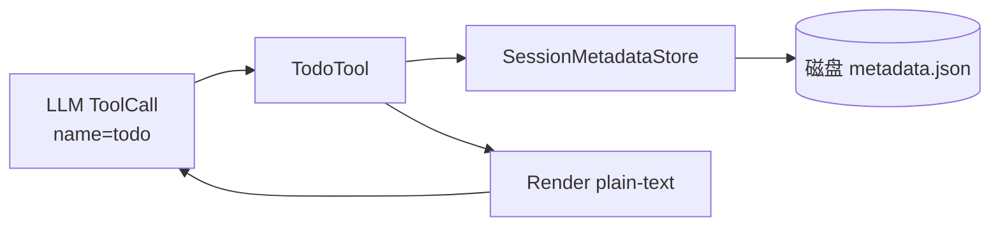

# Todo 工具（todo）

> 整合主文档：会话级待办（todo）工具的契约、实现与扩展点。
> 对应源码权威：[TodoTool.cs](file:///e:/gitee/kingcrab/src/OpenClaw.Gateway/Tools/TodoTool.cs)
> 关联文档：[Handoff 工具.md](Handoff%20%E5%B7%A5%E5%85%B7.md) · [技能系统.md](../技能系统/技能系统.md)

---

## 1. 简介

`todo` 是注册到 Gateway 默认工具集的**会话级待办列表工具**，让 LLM 在一次会话生命周期内增删改查 TODO 项。它专注于"工作记忆/便签"语义——条目仅与单个 `Session.Id` 绑定，由 `SessionMetadataStore` 持久化到磁盘，供同一会话后续轮次回读。

与 [Handoff 工具](Handoff%20%E5%B7%A5%E5%85%B7.md) 的关系：handoff 条目通过 `related_todos` 字段引用本工具产生的 `todo_id`，把"我需要做的事"升级为"我要派给下一个 Skill 处理的工单"，本工具是 handoff 工具的轻量前置。

---

## 2. 模块边界



| 层 | 文件 | 职责 |
| --- | --- | --- |
| 工具实现 | [TodoTool.cs](file:///e:/gitee/kingcrab/src/OpenClaw.Gateway/Tools/TodoTool.cs) | 解析参数、CRUD、渲染输出 |
| 数据模型 | [SessionTodoItem](file:///e:/gitee/kingcrab/src/OpenClaw.Core/Models/OperatorApiModels.cs#L600-L608) | 7 字段的 sealed class |
| 持久化 | [SessionMetadataStore](file:///e:/gitee/kingcrab/src/OpenClaw.Gateway/SessionMetadataStore.cs) | 按 `Session.Id` 读写整段 metadata |
| 注册接线 | [RuntimeInitializationExtensions.RuntimeFactories.cs#L126](file:///e:/gitee/kingcrab/src/OpenClaw.Gateway/Composition/RuntimeInitializationExtensions.RuntimeFactories.cs#L126) | `new TodoTool(services.SessionMetadataStore)` 加入 built-in tools |

---

## 3. 工具契约

### 3.1 元信息

| 字段 | 值 | 源码 |
| --- | --- | --- |
| `Name` | `"todo"` | [TodoTool.cs#L17](file:///e:/gitee/kingcrab/src/OpenClaw.Gateway/Tools/TodoTool.cs#L17) |
| `Description` | `Manage a session-scoped todo list. Supports list, add, update, complete, remove, and clear.` | [TodoTool.cs#L18](file:///e:/gitee/kingcrab/src/OpenClaw.Gateway/Tools/TodoTool.cs#L18) |
| 接口 | `IToolWithContext`（依赖 `ToolExecutionContext.Session.Id`） | [TodoTool.cs#L8](file:///e:/gitee/kingcrab/src/OpenClaw.Gateway/Tools/TodoTool.cs#L8) |

无上下文调用 `ExecuteAsync(string, CancellationToken)` 直接返回 `Error: todo requires execution context.`（[L32-L33](file:///e:/gitee/kingcrab/src/OpenClaw.Gateway/Tools/TodoTool.cs#L32-L33)），强制 LLM 必须经会话路径调用。

### 3.2 ParameterSchema

源码：[TodoTool.cs#L19-L30](file:///e:/gitee/kingcrab/src/OpenClaw.Gateway/Tools/TodoTool.cs#L19-L30)

```json
{
  "type": "object",
  "properties": {
    "action": {"type": "string", "enum": ["list", "add", "update", "complete", "remove", "clear"], "default": "list"},
    "id":     {"type": "string"},
    "text":   {"type": "string"},
    "notes":  {"type": "string"}
  },
  "required": ["action"]
}
```

### 3.3 actions 行为表

| action | 必填字段 | 行为 | 错误码 | 源码 |
| --- | --- | --- | --- | --- |
| `list`（默认） | — | 返回当前 todo 列表 | — | [#L46-L47](file:///e:/gitee/kingcrab/src/OpenClaw.Gateway/Tools/TodoTool.cs#L46-L47) |
| `add` | `text` | 新增条目，自动生成 `todo_<guid17>` | `Error: text is required.` | [#L48-L64](file:///e:/gitee/kingcrab/src/OpenClaw.Gateway/Tools/TodoTool.cs#L48-L64) |
| `update` | `id`（+ 任意 `text`/`notes`） | 替换字段，刷新 `UpdatedAtUtc` | 缺 id / 找不到 id | [#L65-L93](file:///e:/gitee/kingcrab/src/OpenClaw.Gateway/Tools/TodoTool.cs#L65-L93) |
| `complete` | `id` | 标记 `Completed=true`（不可撤销） | 缺 id / 找不到 id | [#L65-L93](file:///e:/gitee/kingcrab/src/OpenClaw.Gateway/Tools/TodoTool.cs#L65-L93) |
| `remove` | `id` | 物理删除该条目 | 缺 id / 找不到 id | [#L77-L81](file:///e:/gitee/kingcrab/src/OpenClaw.Gateway/Tools/TodoTool.cs#L77-L81) |
| `clear` | — | 清空整张列表 | — | [#L94-L96](file:///e:/gitee/kingcrab/src/OpenClaw.Gateway/Tools/TodoTool.cs#L94-L96) |
| 其他 | — | 直接返回错误字符串 | `Error: Unknown action.` | [#L97-L98](file:///e:/gitee/kingcrab/src/OpenClaw.Gateway/Tools/TodoTool.cs#L97-L98) |

注意：`complete` 是**单向**的——`Completed = action == "complete" || existing.Completed`（[#L88](file:///e:/gitee/kingcrab/src/OpenClaw.Gateway/Tools/TodoTool.cs#L88)），即使后续 `update` 也无法把 `Completed` 改回 `false`。如需重新打开，请 `remove` 后 `add`。

---

## 4. 调用示例（LLM 视角）

```jsonc
// 1. 新增
{"action":"add", "text":"准备月度技能仪表盘", "notes":"deadline: Friday"}

// 2. 列表（默认 action）
{"action":"list"}

// 3. 改文案
{"action":"update", "id":"todo_4f9a1b8c7d6e5", "text":"准备 Q3 技能仪表盘"}

// 4. 标记完成
{"action":"complete", "id":"todo_4f9a1b8c7d6e5"}

// 5. 物理删除
{"action":"remove", "id":"todo_4f9a1b8c7d6e5"}

// 6. 清空
{"action":"clear"}
```

---

## 5. 数据模型：SessionTodoItem

源码：[OperatorApiModels.cs#L600-L608](file:///e:/gitee/kingcrab/src/OpenClaw.Core/Models/OperatorApiModels.cs#L600-L608)

| 字段 | 类型 | 默认 / 来源 |
| --- | --- | --- |
| `Id` | `string`（required） | `todo_<guid17>`，前缀 + Guid.N 取前 17 字符 |
| `Text` | `string` | trim 后的 `text` 入参 |
| `Completed` | `bool` | 仅 `complete` 动作设 true |
| `Notes` | `string?` | 可选自由文本 |
| `CreatedAtUtc` | `DateTimeOffset` | UTC `add` 时刻 |
| `UpdatedAtUtc` | `DateTimeOffset` | 任何修改都刷新；`add` 与 `CreatedAtUtc` 相同 |

> Id 长度 17 字符的依据：`$"todo_{Guid.NewGuid():N}"[..17]`（[#L56](file:///e:/gitee/kingcrab/src/OpenClaw.Gateway/Tools/TodoTool.cs#L56)），即 `"todo_"`(5) + 12 位 Guid 字符。无校验唯一性，但 Guid 冲突概率可忽略。

---

## 6. 持久化与会话隔离

* **作用域**：所有读写都按 `context.Session.Id` 索引（[#L41](file:///e:/gitee/kingcrab/src/OpenClaw.Gateway/Tools/TodoTool.cs#L41)、[#L101](file:///e:/gitee/kingcrab/src/OpenClaw.Gateway/Tools/TodoTool.cs#L101)）。不同会话彼此完全隔离。
* **整段写**：`Set` 调用传入完整 `SessionMetadataUpdateRequest`，把 `ActivePresetId / Starred / Tags / TodoItems` 一起写回（[#L101-L107](file:///e:/gitee/kingcrab/src/OpenClaw.Gateway/Tools/TodoTool.cs#L101-L107)）。本工具**不感知** `HandoffItems`、`PresetId` 等字段——这些字段由 `SessionMetadataStore` 自身在内部 merge。
* **持久层**：`SessionMetadataStore` 把同一会话的全部 metadata 序列化为单文件 JSON。

---

## 7. 渲染契约

ToolCall 的返回字符串采用极简文本格式（**非 JSON**），由 `Render` 方法生成（[#L112-L121](file:///e:/gitee/kingcrab/src/OpenClaw.Gateway/Tools/TodoTool.cs#L112-L121)）：

```
todo_4f9a1b8c7d6e5 [open] 准备 Q3 技能仪表盘
todo_5a8b3c2e1f0d4 [open] 联系客户复盘
todo_3c2d1e0f9a8b7 [done] 整理上周会议纪要
```

排序规则：先按 `Completed` 升序（未完成在前），再按 `CreatedAtUtc` 升序。空列表返回字面字符串 `"No todo items."`（[#L114-L115](file:///e:/gitee/kingcrab/src/OpenClaw.Gateway/Tools/TodoTool.cs#L114-L115)）。

> LLM 解析时无需 JSON 解码，但要识别 `[open]`/`[done]` 标记与 17 字符 ID。

---

## 8. 与 Handoff 工具的关系

| 维度 | `todo` | `handoff` |
| --- | --- | --- |
| 目的 | 个人/会话便签 | 跨 Skill / 跨阶段工单 |
| 状态 | 仅 `open`/`done` 二态（且 done 单向） | 多状态机（drafting/ready_to_dispatch/dispatched/dirty/confirmed/needs_review/dismissed） |
| 并发 | 无版本号 | `revision` 乐观并发 + `fingerprint` 去重 |
| 工作流 | 无 | 多 `workflow_id` 注册（`HandoffWorkflowRegistry`） |
| 注册 | ✅ 默认 built-in 工具 | ⚠️ 当前主工具集**未默认注册**（详见 [Handoff 工具.md §10](Handoff%20%E5%B7%A5%E5%85%B7.md)） |
| 引用方向 | 被 handoff 引用 | `SessionHandoffItem.RelatedTodos` 持 `todo_id` 数组 |

典型协作模式：LLM 先 `todo add` 列出粗粒度待办，确认范围后用 `handoff upsert` 把可派发项升级为带状态机的工单，并把对应的 `todo_id` 写入 `related_todos` 维持双向引用。

---

## 9. 当前实现状态

| 维度 | 状态 |
| --- | --- |
| Tool 注册 | ✅ 默认加入 Gateway built-in 工具集 ([RuntimeFactories.cs#L126](file:///e:/gitee/kingcrab/src/OpenClaw.Gateway/Composition/RuntimeInitializationExtensions.RuntimeFactories.cs#L126)) |
| 测试覆盖 | ✅ [TodoToolTests.cs](file:///e:/gitee/kingcrab/src/OpenClaw.Tests/TodoToolTests.cs) |
| 接口稳定性 | ✅ 7 字段模型 + 6 actions，跨版本未破坏 |
| 输出格式 | 文本（非 JSON），与 handoff 的 JSON 输出形成对比 |
| `complete` 撤回 | ❌ 不支持（只能 remove + add） |
| 跨会话共享 | ❌ 不支持（设计如此，跨会话用 `handoff` 或 memory 工具） |
| 批量操作 | ❌ 不支持 batch add（一次只处理一个 action） |

---

## 10. 扩展阅读

* 同目录工具：[Handoff 工具](Handoff%20%E5%B7%A5%E5%85%B7.md)
* 工具系统总览：[工具系统/](../工具系统/)
* 会话与记忆：[会话和记忆管理/](../会话和记忆管理/)
* 源码：
  * [TodoTool.cs](file:///e:/gitee/kingcrab/src/OpenClaw.Gateway/Tools/TodoTool.cs)（128 行）
  * [SessionTodoItem](file:///e:/gitee/kingcrab/src/OpenClaw.Core/Models/OperatorApiModels.cs#L600-L608)
  * [SessionMetadataStore](file:///e:/gitee/kingcrab/src/OpenClaw.Gateway/SessionMetadataStore.cs)
  * [TodoToolTests.cs](file:///e:/gitee/kingcrab/src/OpenClaw.Tests/TodoToolTests.cs)
