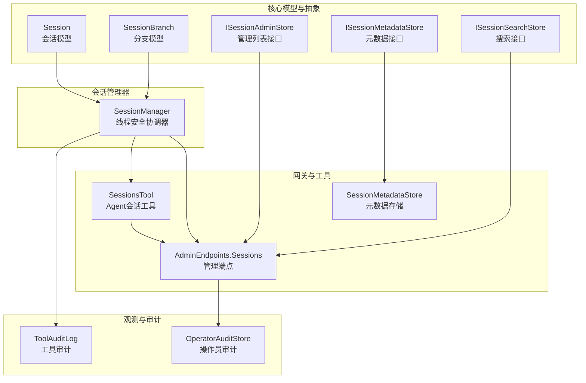
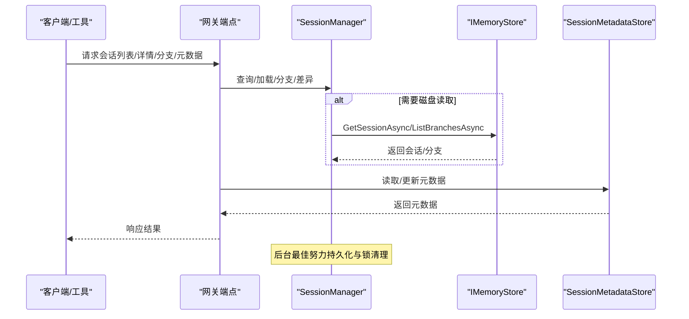
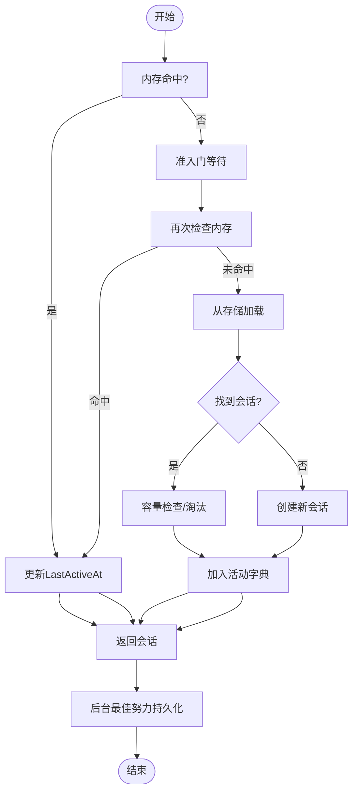
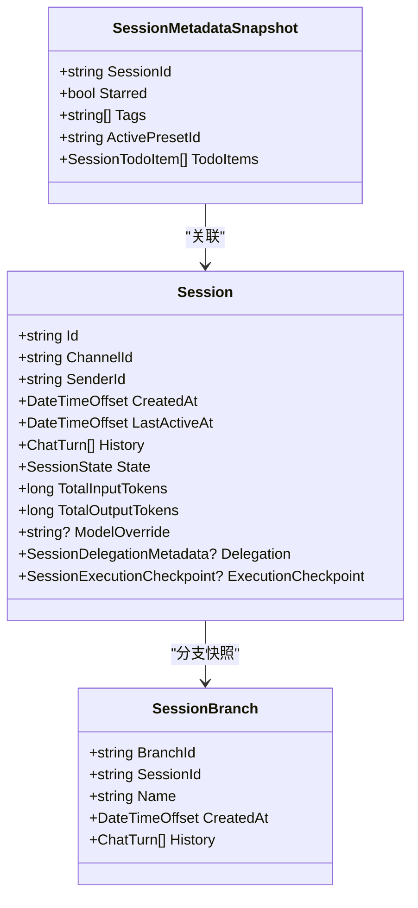
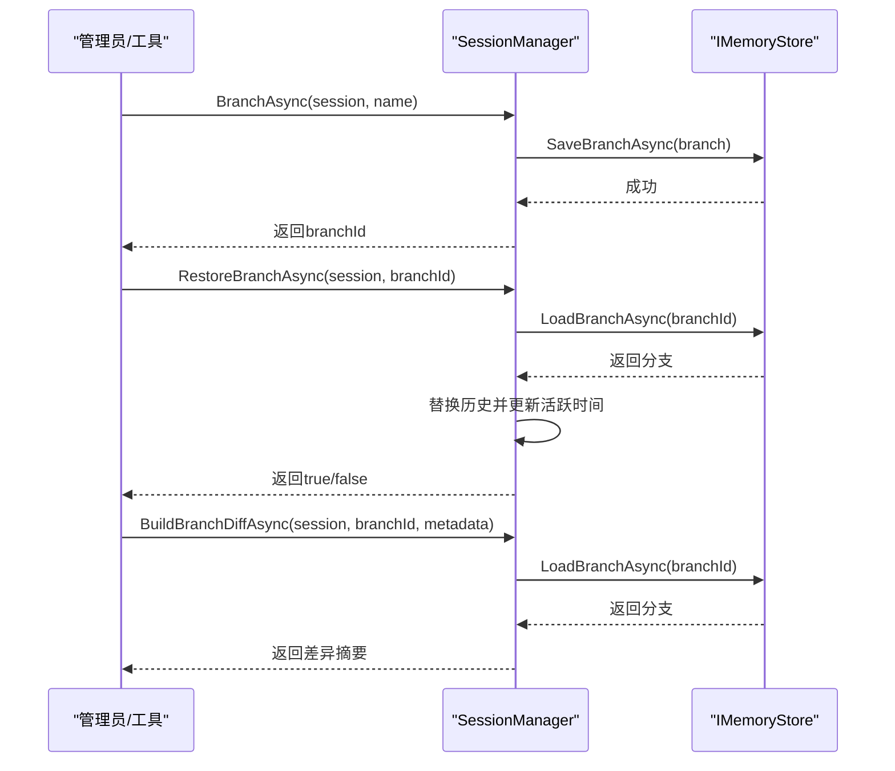
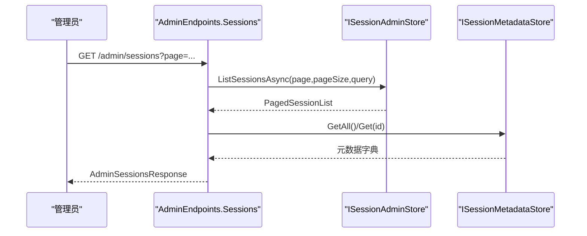
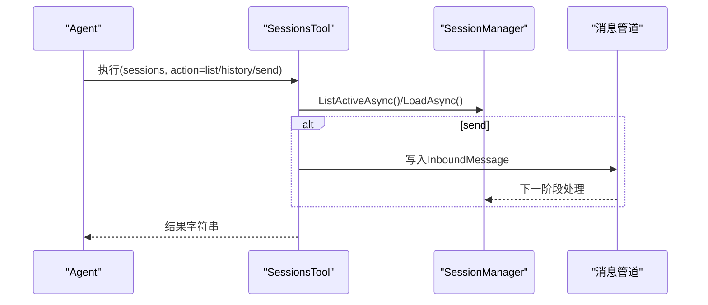
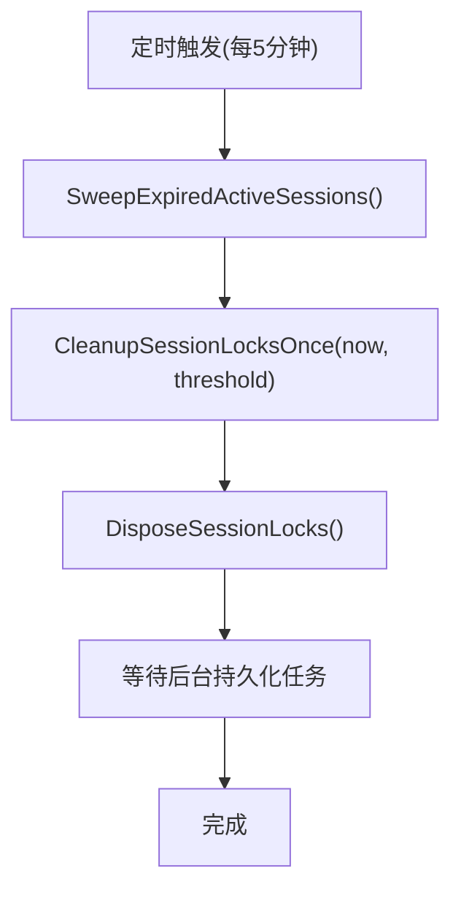
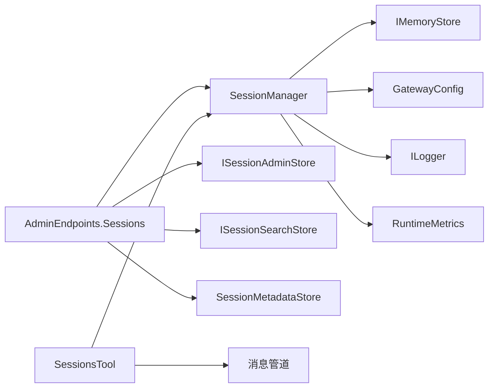

# 会话管理

<cite>
**本文引用的文件**
- [SessionManager.cs](file://src/OpenClaw.Core/Sessions/SessionManager.cs)
- [Session.cs](file://src/OpenClaw.Core/Models/Session.cs)
- [SessionBranch.cs](file://src/OpenClaw.Core/Models/SessionBranch.cs)
- [ISessionAdminStore.cs](file://src/OpenClaw.Core/Abstractions/ISessionAdminStore.cs)
- [ISessionMetadataStore.cs](file://src/OpenClaw.Core/Abstractions/ISessionMetadataStore.cs)
- [ISessionSearchStore.cs](file://src/OpenClaw.Core/Abstractions/ISessionSearchStore.cs)
- [SessionMetadataStore.cs](file://src/OpenClaw.Gateway/SessionMetadataStore.cs)
- [AdminEndpoints.Sessions.cs](file://src/OpenClaw.Gateway/Endpoints/AdminEndpoints.Sessions.cs)
- [SessionsTool.cs](file://src/OpenClaw.Agent/Tools/SessionsTool.cs)
- [SessionAdminModels.cs](file://src/OpenClaw.Core/Models/SessionAdminModels.cs)
- [SessionSearchModels.cs](file://src/OpenClaw.Core/Models/SessionSearchModels.cs)
- [OpenClaw-Session-Management.md](file://docs/OpenClaw-Session-Management.md)
- [GatewaySessionCleanupWorker.cs](file://src/OpenClaw.Gateway/Extensions/GatewaySessionCleanupWorker.cs)
- [ToolAuditLog.cs](file://src/OpenClaw.Core/Observability/ToolAuditLog.cs)
- [OperatorAuditStore.cs](file://src/OpenClaw.Gateway/OperatorAuditStore.cs)
</cite>

## 目录
1. [简介](#简介)
2. [项目结构](#项目结构)
3. [核心组件](#核心组件)
4. [架构总览](#架构总览)
5. [详细组件分析](#详细组件分析)
6. [依赖关系分析](#依赖关系分析)
7. [性能考量](#性能考量)
8. [故障排查指南](#故障排查指南)
9. [结论](#结论)
10. [附录](#附录)

## 简介
本文件系统化梳理会话管理系统的设计与实现，围绕会话生命周期管理、状态跟踪、分支合并、数据结构与元数据管理、持久化策略、超时与自动清理、并发控制与性能优化、安全与审计等主题展开。文档既适合开发者深入理解实现细节，也适合运维人员掌握配置与排障要点。

## 项目结构
会话管理相关代码主要分布在以下模块：
- 核心模型与抽象：会话模型、分支模型、管理接口
- 会话管理器：集中式线程安全协调器，负责创建、加载、持久化、分支、过期清理与并发控制
- 网关端点与工具：提供会话查询、分支恢复、元数据更新、跨会话通信等能力
- 观测与审计：工具执行审计、操作员审计日志
- 文档：官方会话管理设计文档

图表来源
- [Session.cs:15-135](file://src/OpenClaw.Core/Models/Session.cs#L15-L135)
- [SessionBranch.cs:8-15](file://src/OpenClaw.Core/Models/SessionBranch.cs#L8-L15)
- [ISessionAdminStore.cs:5-8](file://src/OpenClaw.Core/Abstractions/ISessionAdminStore.cs#L5-L8)
- [ISessionMetadataStore.cs:5-10](file://src/OpenClaw.Core/Abstractions/ISessionMetadataStore.cs#L5-L10)
- [ISessionSearchStore.cs:5-8](file://src/OpenClaw.Core/Abstractions/ISessionSearchStore.cs#L5-L8)
- [SessionManager.cs:13-36](file://src/OpenClaw.Core/Sessions/SessionManager.cs#L13-L36)
- [AdminEndpoints.Sessions.cs:30-93](file://src/OpenClaw.Gateway/Endpoints/AdminEndpoints.Sessions.cs#L30-L93)
- [SessionsTool.cs:17-46](file://src/OpenClaw.Agent/Tools/SessionsTool.cs#L17-L46)
- [SessionMetadataStore.cs:7-24](file://src/OpenClaw.Gateway/SessionMetadataStore.cs#L7-L24)
- [ToolAuditLog.cs:39-70](file://src/OpenClaw.Core/Observability/ToolAuditLog.cs#L39-L70)
- [OperatorAuditStore.cs:10-31](file://src/OpenClaw.Gateway/OperatorAuditStore.cs#L10-L31)

章节来源
- [OpenClaw-Session-Management.md:1-278](file://docs/OpenClaw-Session-Management.md#L1-L278)

## 核心组件
- 会话模型（Session）
  - 包含会话标识、渠道与发送者、创建与活跃时间、历史轮次、状态、令牌用量、模型配置、委托元数据、执行检查点等字段，采用互斥计数器保障并发安全。
- 会话分支（SessionBranch）
  - 保存指定时间点的历史快照，用于分支探索与后续恢复。
- 会话管理器（SessionManager）
  - 内存权威：维护活动会话字典、按会话粒度的信号量锁、后台持久化队列、容量与过期控制。
  - 提供获取/创建、持久化、分支、恢复、差异比较、活动会话列举、按条件查找、移除、过期清扫、锁清理等能力。
- 管理与搜索接口
  - ISessionAdminStore：分页列出会话
  - ISessionMetadataStore：会话元数据增删改查
  - ISessionSearchStore：全文检索会话历史
- 网关端点与工具
  - 管理端点：会话列表、详情、分支列表、恢复、导出、差异、元数据更新、批量导出
  - Agent工具：跨会话列表、历史读取、消息投递
- 元数据存储
  - 独立JSON文件存储星标、标签、活动预设、待办事项，支持原子写入与缓存
- 观测与审计
  - 工具审计：记录工具执行耗时、失败、治理决策等，避免敏感载荷落盘
  - 操作员审计：记录管理员操作链路，支持导出归档

章节来源
- [Session.cs:15-135](file://src/OpenClaw.Core/Models/Session.cs#L15-L135)
- [SessionBranch.cs:8-15](file://src/OpenClaw.Core/Models/SessionBranch.cs#L8-L15)
- [SessionManager.cs:13-36](file://src/OpenClaw.Core/Sessions/SessionManager.cs#L13-L36)
- [ISessionAdminStore.cs:5-8](file://src/OpenClaw.Core/Abstractions/ISessionAdminStore.cs#L5-L8)
- [ISessionMetadataStore.cs:5-10](file://src/OpenClaw.Core/Abstractions/ISessionMetadataStore.cs#L5-L10)
- [ISessionSearchStore.cs:5-8](file://src/OpenClaw.Core/Abstractions/ISessionSearchStore.cs#L5-L8)
- [AdminEndpoints.Sessions.cs:30-93](file://src/OpenClaw.Gateway/Endpoints/AdminEndpoints.Sessions.cs#L30-L93)
- [SessionsTool.cs:17-46](file://src/OpenClaw.Agent/Tools/SessionsTool.cs#L17-L46)
- [SessionMetadataStore.cs:7-24](file://src/OpenClaw.Gateway/SessionMetadataStore.cs#L7-L24)
- [ToolAuditLog.cs:39-70](file://src/OpenClaw.Core/Observability/ToolAuditLog.cs#L39-L70)
- [OperatorAuditStore.cs:10-31](file://src/OpenClaw.Gateway/OperatorAuditStore.cs#L10-L31)

## 架构总览
会话管理贯穿消息入口、会话管理器、持久化层与网关端点，形成“内存权威 + 后端持久化”的双层架构。管理器负责并发控制、容量与过期策略；端点与工具提供查询、分支、元数据与跨会话编排能力；观测与审计保障安全与合规。

图表来源
- [AdminEndpoints.Sessions.cs:30-93](file://src/OpenClaw.Gateway/Endpoints/AdminEndpoints.Sessions.cs#L30-L93)
- [SessionManager.cs:132-172](file://src/OpenClaw.Core/Sessions/SessionManager.cs#L132-L172)
- [SessionMetadataStore.cs:26-84](file://src/OpenClaw.Gateway/SessionMetadataStore.cs#L26-L84)

## 详细组件分析

### 会话生命周期与状态管理
- 创建与键解析
  - 标准路径：基于 channelId:senderId 确定性键
  - 显式路径：接受自定义 sessionId，便于定时任务与 webhook
  - 准入门（并发度1的信号量）+ 双重检查，命中则仅更新活跃时间
- 活动会话与持久化
  - 内存字典存放活动会话，退出时后台最佳努力持久化
  - 持久化带重试与指数退避，避免瞬时故障导致丢失
- 状态跟踪
  - SessionState：Active/Paused/Expired
  - LastActiveAt：用于过期判定与LRU淘汰
- 过期与清理
  - 外部定时器定期扫描过期会话并移除
  - 孤立信号量清理：检测长时间未使用的会话锁并释放/销毁

图表来源
- [SessionManager.cs:45-130](file://src/OpenClaw.Core/Sessions/SessionManager.cs#L45-L130)
- [SessionManager.cs:338-359](file://src/OpenClaw.Core/Sessions/SessionManager.cs#L338-L359)
- [SessionManager.cs:485-530](file://src/OpenClaw.Core/Sessions/SessionManager.cs#L485-L530)

章节来源
- [SessionManager.cs:45-130](file://src/OpenClaw.Core/Sessions/SessionManager.cs#L45-L130)
- [SessionManager.cs:338-359](file://src/OpenClaw.Core/Sessions/SessionManager.cs#L338-L359)
- [SessionManager.cs:485-530](file://src/OpenClaw.Core/Sessions/SessionManager.cs#L485-L530)

### 会话数据结构与元数据管理
- 会话模型
  - 历史轮次、令牌用量、模型配置、委托元数据、执行检查点等
  - 互斥计数器保障并发累加
- 分支模型
  - 保存历史快照与创建时间
- 元数据存储
  - 独立JSON文件，支持原子读写、缓存、部分更新
  - 待办事项标准化：去空白、去重、排序、自动生成ID

图表来源
- [Session.cs:15-135](file://src/OpenClaw.Core/Models/Session.cs#L15-L135)
- [SessionBranch.cs:8-15](file://src/OpenClaw.Core/Models/SessionBranch.cs#L8-L15)
- [SessionMetadataStore.cs:26-84](file://src/OpenClaw.Gateway/SessionMetadataStore.cs#L26-L84)

章节来源
- [Session.cs:15-135](file://src/OpenClaw.Core/Models/Session.cs#L15-L135)
- [SessionBranch.cs:8-15](file://src/OpenClaw.Core/Models/SessionBranch.cs#L8-L15)
- [SessionMetadataStore.cs:26-134](file://src/OpenClaw.Gateway/SessionMetadataStore.cs#L26-L134)

### 分支创建、合并与差异分析
- 分支创建（BranchAsync）
  - 生成唯一分支ID，深拷贝历史，持久化分支
- 分支恢复（RestoreBranchAsync）
  - 原子替换会话历史，更新活跃时间
- 差异分析（BuildBranchDiffAsync）
  - 计算共享前缀，返回两侧差异摘要，便于可视化展示

图表来源
- [SessionManager.cs:180-250](file://src/OpenClaw.Core/Sessions/SessionManager.cs#L180-L250)
- [SessionManager.cs:174-195](file://src/OpenClaw.Core/Sessions/SessionManager.cs#L174-L195)
- [SessionManager.cs:200-214](file://src/OpenClaw.Core/Sessions/SessionManager.cs#L200-L214)
- [SessionManager.cs:222-250](file://src/OpenClaw.Core/Sessions/SessionManager.cs#L222-L250)

章节来源
- [SessionManager.cs:180-250](file://src/OpenClaw.Core/Sessions/SessionManager.cs#L180-L250)

### 会话查询、列表与搜索
- 管理列表（ISessionAdminStore）
  - 分页查询，支持渠道、发送者、时间范围、状态、星标、标签过滤
  - 当使用元数据过滤时，需先加载全部持久化页面再做内存匹配
- 全文搜索（ISessionSearchStore）
  - 跨历史检索，返回评分与摘要
- 网关端点
  - 提供会话列表、详情、分支列表、差异、导出、元数据更新等REST接口

图表来源
- [AdminEndpoints.Sessions.cs:40-93](file://src/OpenClaw.Gateway/Endpoints/AdminEndpoints.Sessions.cs#L40-L93)
- [ISessionAdminStore.cs:5-8](file://src/OpenClaw.Core/Abstractions/ISessionAdminStore.cs#L5-L8)
- [SessionAdminModels.cs:20-39](file://src/OpenClaw.Core/Models/SessionAdminModels.cs#L20-L39)
- [SessionSearchModels.cs:3-29](file://src/OpenClaw.Core/Models/SessionSearchModels.cs#L3-L29)

章节来源
- [AdminEndpoints.Sessions.cs:40-93](file://src/OpenClaw.Gateway/Endpoints/AdminEndpoints.Sessions.cs#L40-L93)
- [ISessionAdminStore.cs:5-8](file://src/OpenClaw.Core/Abstractions/ISessionAdminStore.cs#L5-L8)
- [SessionAdminModels.cs:20-39](file://src/OpenClaw.Core/Models/SessionAdminModels.cs#L20-L39)
- [SessionSearchModels.cs:3-29](file://src/OpenClaw.Core/Models/SessionSearchModels.cs#L3-L29)

### Agent跨会话编排与工具
- SessionsTool
  - 列出活动会话、读取历史、向目标会话投递消息
  - 通过消息管道注入系统消息，实现Agent间通信
- 管理端点
  - sessions_spawn、sessions_send、sessions_yield、session_status、sessions_history、session_search 等

图表来源
- [SessionsTool.cs:50-118](file://src/OpenClaw.Agent/Tools/SessionsTool.cs#L50-L118)
- [SessionManager.cs:255-303](file://src/OpenClaw.Core/Sessions/SessionManager.cs#L255-L303)

章节来源
- [SessionsTool.cs:50-118](file://src/OpenClaw.Agent/Tools/SessionsTool.cs#L50-L118)
- [SessionManager.cs:255-303](file://src/OpenClaw.Core/Sessions/SessionManager.cs#L255-L303)

### 超时处理、自动清理与资源回收
- 过期扫描
  - 定时器每5分钟触发一次，扫描并移除过期会话，更新状态并后台持久化
- 锁清理
  - 检测孤儿信号量（非活动会话且长时间未使用），释放并销毁
- 资源回收
  - 释放所有会话锁、关闭存储适配器、等待后台持久化任务完成

图表来源
- [GatewaySessionCleanupWorker.cs:9-33](file://src/OpenClaw.Gateway/Extensions/GatewaySessionCleanupWorker.cs#L9-L33)
- [SessionManager.cs:338-359](file://src/OpenClaw.Core/Sessions/SessionManager.cs#L338-L359)
- [SessionManager.cs:485-550](file://src/OpenClaw.Core/Sessions/SessionManager.cs#L485-L550)

章节来源
- [GatewaySessionCleanupWorker.cs:9-33](file://src/OpenClaw.Gateway/Extensions/GatewaySessionCleanupWorker.cs#L9-L33)
- [SessionManager.cs:338-359](file://src/OpenClaw.Core/Sessions/SessionManager.cs#L338-L359)
- [SessionManager.cs:485-550](file://src/OpenClaw.Core/Sessions/SessionManager.cs#L485-L550)

### 并发控制与性能优化
- 并发控制
  - 准入门（并发度1）：统一处理新会话创建路径
  - 按会话信号量：串行化分支、持久化、历史追加等状态变更
  - Admission Gate + Session Locks 解耦不同用途的串行化
- 性能优化
  - 内存优先：活动会话驻留内存，减少磁盘IO
  - 最佳努力持久化：后台任务，避免阻塞请求
  - 指数退避重试：降低存储抖动影响
  - LRU淘汰：当达到最大并发时，按最后活跃时间淘汰
  - TODO：大规模并发场景建议使用优先队列优化淘汰复杂度

章节来源
- [SessionManager.cs:24-36](file://src/OpenClaw.Core/Sessions/SessionManager.cs#L24-L36)
- [SessionManager.cs:474-483](file://src/OpenClaw.Core/Sessions/SessionManager.cs#L474-L483)
- [SessionManager.cs:443-460](file://src/OpenClaw.Core/Sessions/SessionManager.cs#L443-L460)
- [OpenClaw-Session-Management.md:79-79](file://docs/OpenClaw-Session-Management.md#L79-L79)

### 安全、访问控制与审计
- 访问控制
  - 管理端点均需授权校验，限定操作范围
- 工具审计
  - 记录工具执行耗时、失败、治理决策等，避免敏感载荷落盘
- 操作员审计
  - 记录管理员操作链路，支持导出归档，具备序列号与哈希链

章节来源
- [AdminEndpoints.Sessions.cs:40-93](file://src/OpenClaw.Gateway/Endpoints/AdminEndpoints.Sessions.cs#L40-L93)
- [ToolAuditLog.cs:39-124](file://src/OpenClaw.Core/Observability/ToolAuditLog.cs#L39-L124)
- [OperatorAuditStore.cs:10-41](file://src/OpenClaw.Gateway/OperatorAuditStore.cs#L10-L41)

## 依赖关系分析
- SessionManager 依赖
  - IMemoryStore：会话与分支持久化
  - ILogger/RuntimeMetrics：日志与指标
  - GatewayConfig：会话超时与并发上限
- 网关端点依赖
  - SessionManager：会话查询与分支操作
  - ISessionAdminStore/ISessionSearchStore：列表与搜索
  - SessionMetadataStore：元数据读写
- Agent工具依赖
  - SessionManager：跨会话编排
  - 消息管道：投递消息

图表来源
- [SessionManager.cs:29-36](file://src/OpenClaw.Core/Sessions/SessionManager.cs#L29-L36)
- [AdminEndpoints.Sessions.cs:30-40](file://src/OpenClaw.Gateway/Endpoints/AdminEndpoints.Sessions.cs#L30-L40)
- [SessionsTool.cs:19-46](file://src/OpenClaw.Agent/Tools/SessionsTool.cs#L19-L46)

章节来源
- [SessionManager.cs:29-36](file://src/OpenClaw.Core/Sessions/SessionManager.cs#L29-L36)
- [AdminEndpoints.Sessions.cs:30-40](file://src/OpenClaw.Gateway/Endpoints/AdminEndpoints.Sessions.cs#L30-L40)
- [SessionsTool.cs:19-46](file://src/OpenClaw.Agent/Tools/SessionsTool.cs#L19-L46)

## 性能考量
- 内存与磁盘权衡：活动会话驻内存，分支与历史持久化，降低延迟
- 并发路径优化：准入门与按会话锁分离，避免热点竞争
- 扫描与淘汰：过期扫描与LRU淘汰按固定频率执行，避免持续开销
- I/O退避：持久化重试采用指数退避，缓解存储压力
- 建议：在高并发部署中，关注LRU淘汰的O(n)扫描，必要时评估优先队列优化

## 故障排查指南
- 会话未命中
  - 检查是否已过期被清理，或是否使用了错误的sessionId
  - 使用 TryGetActive/TryGetActiveById/LoadAsync 定位
- 分支恢复失败
  - 确认branchId归属的sessionId一致，分支是否存在
- 元数据更新异常
  - 检查JSON文件写入权限与原子写入错误
- 并发上限触发
  - 查看容量拒绝指标，调整MaxConcurrentSessions或清理过期会话
- 锁泄漏
  - 定期确认锁清理任务是否正常，检查孤儿信号量

章节来源
- [SessionManager.cs:264-321](file://src/OpenClaw.Core/Sessions/SessionManager.cs#L264-L321)
- [SessionManager.cs:200-214](file://src/OpenClaw.Core/Sessions/SessionManager.cs#L200-L214)
- [SessionMetadataStore.cs:103-112](file://src/OpenClaw.Gateway/SessionMetadataStore.cs#L103-L112)
- [GatewaySessionCleanupWorker.cs:9-33](file://src/OpenClaw.Gateway/Extensions/GatewaySessionCleanupWorker.cs#L9-L33)

## 结论
会话管理系统以SessionManager为核心，结合内存权威与后端持久化，提供完整的生命周期管理、分支与差异分析、元数据与搜索、跨会话编排、超时清理与并发控制。通过工具与端点，系统在安全性与可观测性方面也提供了完善的审计与日志能力。生产部署中应重点关注容量与过期策略、锁清理与持久化重试的平衡，以获得稳定与高性能的会话体验。

## 附录

### 配置参考
- SessionTimeoutMinutes：会话空闲过期时间（分钟）
- MaxConcurrentSessions：活动会话并发上限（0表示不限制）

章节来源
- [OpenClaw-Session-Management.md:233-238](file://docs/OpenClaw-Session-Management.md#L233-L238)