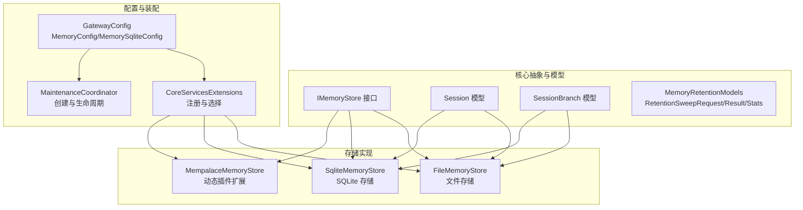
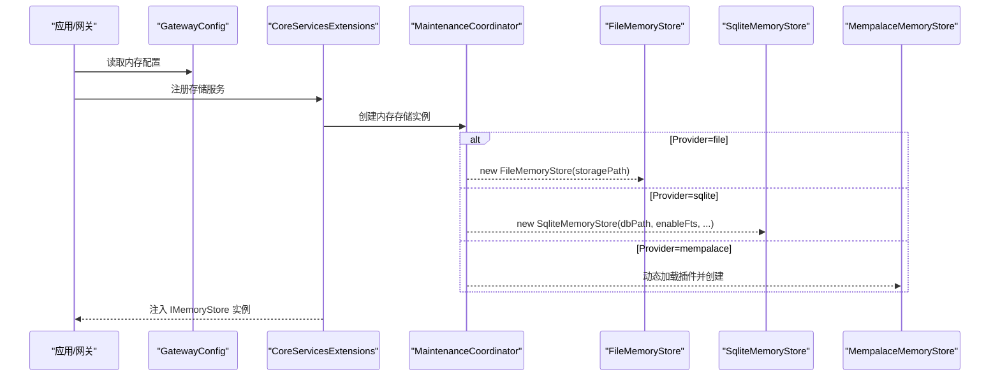
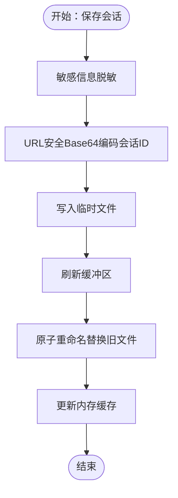
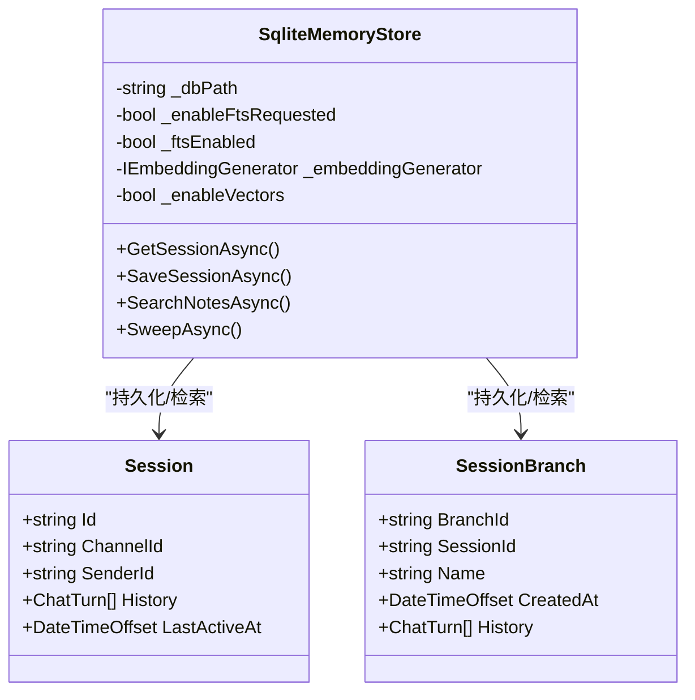
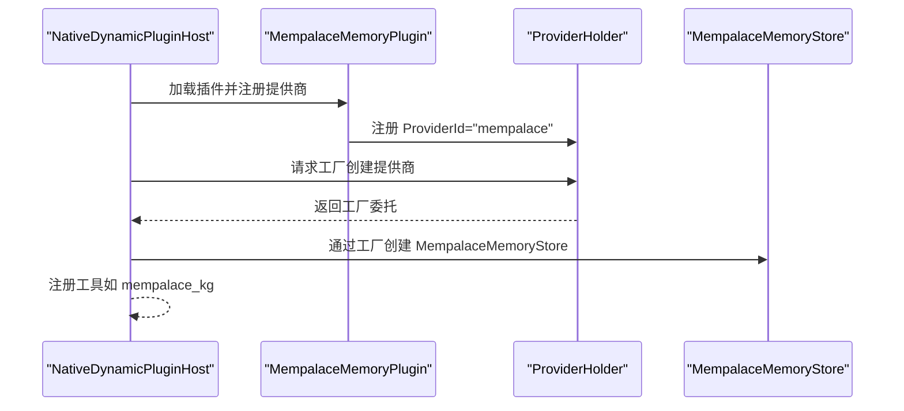
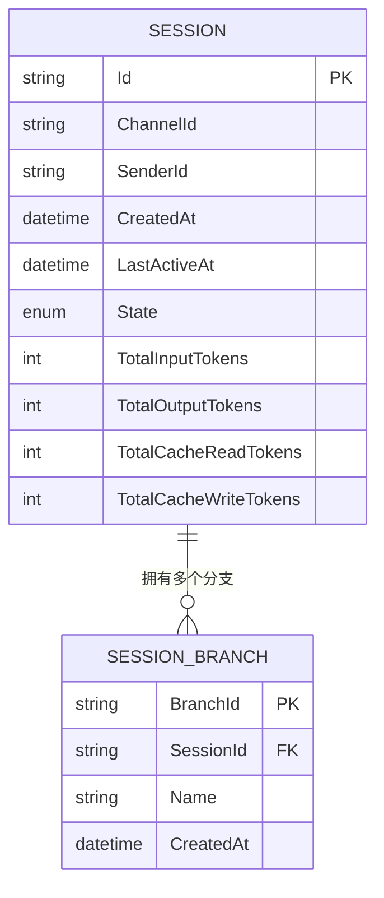
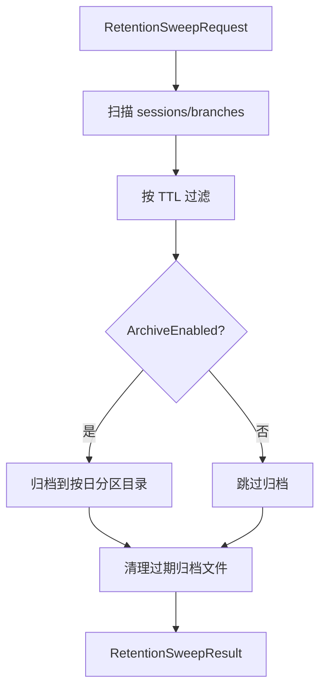
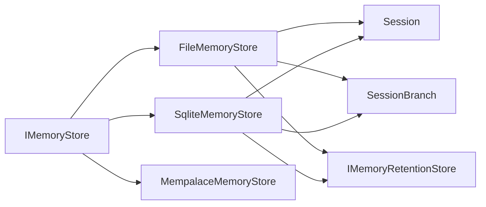

# 内存存储架构

<cite>
**本文引用的文件**
- [FileMemoryStore.cs](file://src/OpenClaw.Core/Memory/FileMemoryStore.cs)
- [SqliteMemoryStore.cs](file://src/OpenClaw.Core/Memory/SqliteMemoryStore.cs)
- [IMemoryStore.cs](file://src/OpenClaw.Core/Abstractions/IMemoryStore.cs)
- [Session.cs](file://src/OpenClaw.Core/Models/Session.cs)
- [SessionBranch.cs](file://src/OpenClaw.Core/Models/SessionBranch.cs)
- [MemoryRetentionModels.cs](file://src/OpenClaw.Core/Models/MemoryRetentionModels.cs)
- [MemoryRetentionArchive.cs](file://src/OpenClaw.Core/Memory/MemoryRetentionArchive.cs)
- [GatewayConfig.cs](file://src/OpenClaw.Core/Models/GatewayConfig.cs)
- [CoreServicesExtensions.cs](file://src/OpenClaw.Gateway/Composition/CoreServicesExtensions.cs)
- [MaintenanceCoordinator.cs](file://src/OpenClaw.Core/Setup/MaintenanceCoordinator.cs)
- [MempalaceMemoryStore.cs](file://src/OpenClaw.Plugins.Mempalace/MempalaceMemoryStore.cs)
- [MempalaceMemoryPlugin.cs](file://src/OpenClaw.Plugins.Mempalace/MempalaceMemoryPlugin.cs)
- [openclaw.native-plugin.json](file://src/OpenClaw.Plugins.Mempalace/openclaw.native-plugin.json)
- [openclaw-memory-recall-and-retention.md](file://docs/openclaw-memory-recall-and-retention.md)
</cite>

## 目录
1. [简介](#简介)
2. [项目结构](#项目结构)
3. [核心组件](#核心组件)
4. [架构总览](#架构总览)
5. [详细组件分析](#详细组件分析)
6. [依赖关系分析](#依赖关系分析)
7. [性能考量](#性能考量)
8. [故障排除指南](#故障排除指南)
9. [结论](#结论)
10. [附录](#附录)

## 简介
本文件系统性阐述内存存储架构的设计与实现，覆盖文件存储与 SQLite 存储两种后端，包括数据模型、序列化格式、索引与查询优化、容量规划、性能基准与扩展策略、配置参数与选择策略、一致性与并发控制、事务处理以及迁移与故障排除方法。目标读者既包括需要快速上手的工程师，也包括希望深入理解实现细节的架构师。

## 项目结构
内存存储相关代码主要分布在以下模块：
- 核心抽象与模型：定义内存接口、会话与分支模型、保留策略模型等
- 文件存储实现：基于本地文件系统的纯内存存储，具备缓存与索引能力
- SQLite 存储实现：基于 SQLite 的持久化存储，支持全文检索与向量嵌入
- 动态插件扩展：MemPalace 提供原生动态插件扩展，作为“mempalace”提供商
- 网关装配与配置：根据配置选择存储后端，并注入到服务容器

**图表来源**
- [IMemoryStore.cs:9-24](file://src/OpenClaw.Core/Abstractions/IMemoryStore.cs#L9-L24)
- [Session.cs:15-135](file://src/OpenClaw.Core/Models/Session.cs#L15-L135)
- [SessionBranch.cs:8-16](file://src/OpenClaw.Core/Models/SessionBranch.cs#L8-L16)
- [MemoryRetentionModels.cs:7-61](file://src/OpenClaw.Core/Models/MemoryRetentionModels.cs#L7-L61)
- [FileMemoryStore.cs:32-76](file://src/OpenClaw.Core/Memory/FileMemoryStore.cs#L32-L76)
- [SqliteMemoryStore.cs:12-45](file://src/OpenClaw.Core/Memory/SqliteMemoryStore.cs#L12-L45)
- [MempalaceMemoryStore.cs:15-32](file://src/OpenClaw.Plugins.Mempalace/MempalaceMemoryStore.cs#L15-L32)
- [GatewayConfig.cs:175-225](file://src/OpenClaw.Core/Models/GatewayConfig.cs#L175-L225)
- [CoreServicesExtensions.cs:295-310](file://src/OpenClaw.Gateway/Composition/CoreServicesExtensions.cs#L295-L310)
- [MaintenanceCoordinator.cs:769-780](file://src/OpenClaw.Core/Setup/MaintenanceCoordinator.cs#L769-L780)

**章节来源**
- [GatewayConfig.cs:175-225](file://src/OpenClaw.Core/Models/GatewayConfig.cs#L175-L225)
- [CoreServicesExtensions.cs:295-310](file://src/OpenClaw.Gateway/Composition/CoreServicesExtensions.cs#L295-L310)
- [MaintenanceCoordinator.cs:769-780](file://src/OpenClaw.Core/Setup/MaintenanceCoordinator.cs#L769-L780)

## 核心组件
- IMemoryStore 抽象：定义会话与笔记的持久化与检索接口，支持会话分支管理
- FileMemoryStore：文件系统存储，采用 URL 安全 Base64 编码的文件名，内置内存缓存与并发控制
- SqliteMemoryStore：SQLite 存储，支持 WAL 模式、FTS5 全文检索、可选向量嵌入
- MempalaceMemoryStore：原生动态插件扩展，提供知识图谱与增强检索能力
- 模型与保留策略：Session、SessionBranch、RetentionSweepRequest/Result/Stats、MemoryRetentionArchive

**章节来源**
- [IMemoryStore.cs:9-24](file://src/OpenClaw.Core/Abstractions/IMemoryStore.cs#L9-L24)
- [FileMemoryStore.cs:32-76](file://src/OpenClaw.Core/Memory/FileMemoryStore.cs#L32-L76)
- [SqliteMemoryStore.cs:12-45](file://src/OpenClaw.Core/Memory/SqliteMemoryStore.cs#L12-L45)
- [MempalaceMemoryStore.cs:15-32](file://src/OpenClaw.Plugins.Mempalace/MempalaceMemoryStore.cs#L15-L32)
- [Session.cs:15-135](file://src/OpenClaw.Core/Models/Session.cs#L15-L135)
- [SessionBranch.cs:8-16](file://src/OpenClaw.Core/Models/SessionBranch.cs#L8-L16)
- [MemoryRetentionModels.cs:7-61](file://src/OpenClaw.Core/Models/MemoryRetentionModels.cs#L7-L61)
- [MemoryRetentionArchive.cs:7-77](file://src/OpenClaw.Core/Memory/MemoryRetentionArchive.cs#L7-L77)

## 架构总览
内存存储架构围绕“统一接口 + 多后端实现”的模式构建，通过配置选择具体后端，并在网关启动阶段完成实例化与注入。SQLite 后端提供更强的检索与统计能力；文件后端适合本地开发与轻量部署；MemPalace 作为原生扩展提供高级检索与知识图谱能力。

**图表来源**
- [GatewayConfig.cs:175-225](file://src/OpenClaw.Core/Models/GatewayConfig.cs#L175-L225)
- [CoreServicesExtensions.cs:295-310](file://src/OpenClaw.Gateway/Composition/CoreServicesExtensions.cs#L295-L310)
- [MaintenanceCoordinator.cs:769-780](file://src/OpenClaw.Core/Setup/MaintenanceCoordinator.cs#L769-L780)
- [FileMemoryStore.cs:32-76](file://src/OpenClaw.Core/Memory/FileMemoryStore.cs#L32-L76)
- [SqliteMemoryStore.cs:12-45](file://src/OpenClaw.Core/Memory/SqliteMemoryStore.cs#L12-L45)
- [MempalaceMemoryStore.cs:15-32](file://src/OpenClaw.Plugins.Mempalace/MempalaceMemoryStore.cs#L15-L32)

## 详细组件分析

### 文件存储实现（FileMemoryStore）
- 数据模型与序列化
  - 会话与分支以 JSON 序列化保存，使用源生成上下文确保零分配序列化
  - 笔记以 Markdown 文本保存，配套 key 文件记录原始键
- 并发与缓存
  - 使用内存缓存存储最近访问的会话，命中率高、延迟低
  - 通过分段信号量（stripe）降低并发加载同一会话的争用
- 索引与查询
  - 笔记索引采用并发字典，支持前缀匹配与评分排序
  - 支持基于前缀的列表与全文检索（通过内容评分）
- 保留与归档
  - 支持保留扫描，按 TTL 清理过期会话与分支
  - 清理前先归档，归档采用日期分区与哈希命名，便于审计与恢复
- 错误处理
  - 对损坏文件进行隔离与错误报告，避免影响其他数据

**图表来源**
- [FileMemoryStore.cs:225-262](file://src/OpenClaw.Core/Memory/FileMemoryStore.cs#L225-L262)

**章节来源**
- [FileMemoryStore.cs:32-76](file://src/OpenClaw.Core/Memory/FileMemoryStore.cs#L32-L76)
- [FileMemoryStore.cs:225-262](file://src/OpenClaw.Core/Memory/FileMemoryStore.cs#L225-L262)
- [FileMemoryStore.cs:356-405](file://src/OpenClaw.Core/Memory/FileMemoryStore.cs#L356-L405)
- [FileMemoryStore.cs:570-623](file://src/OpenClaw.Core/Memory/FileMemoryStore.cs#L570-L623)
- [FileMemoryStore.cs:625-735](file://src/OpenClaw.Core/Memory/FileMemoryStore.cs#L625-L735)
- [FileMemoryStore.cs:191-223](file://src/OpenClaw.Core/Memory/FileMemoryStore.cs#L191-L223)

### SQLite 存储实现（SqliteMemoryStore）
- 初始化与表结构
  - WAL 模式、正常同步级别、外键约束开启
  - sessions、notes、branches 三张表，带更新时间索引
- 全文检索（FTS5）
  - 可选启用 FTS5 虚拟表，自动触发器维护索引
  - 支持会话对话检索与笔记检索，返回 BM25 排序分数
- 向量嵌入（可选）
  - 在启用向量时为 notes 表添加 embedding 列
  - 结合 FTS 与向量相似度进行混合打分
- 会话与分支管理
  - 会话与分支的增删改查均通过参数化 SQL 执行，避免注入风险
- 保留与归档
  - 与文件后端一致的保留扫描与归档流程

**图表来源**
- [SqliteMemoryStore.cs:12-45](file://src/OpenClaw.Core/Memory/SqliteMemoryStore.cs#L12-L45)
- [Session.cs:15-135](file://src/OpenClaw.Core/Models/Session.cs#L15-L135)
- [SessionBranch.cs:8-16](file://src/OpenClaw.Core/Models/SessionBranch.cs#L8-L16)

**章节来源**
- [SqliteMemoryStore.cs:54-148](file://src/OpenClaw.Core/Memory/SqliteMemoryStore.cs#L54-L148)
- [SqliteMemoryStore.cs:150-207](file://src/OpenClaw.Core/Memory/SqliteMemoryStore.cs#L150-L207)
- [SqliteMemoryStore.cs:319-490](file://src/OpenClaw.Core/Memory/SqliteMemoryStore.cs#L319-L490)
- [SqliteMemoryStore.cs:654-732](file://src/OpenClaw.Core/Memory/SqliteMemoryStore.cs#L654-L732)

### 动态插件扩展（MemPalace）
- 提供“mempalace”内存提供商，需启用动态原生插件
- 通过原生插件注册内存提供者与工具，支持知识图谱查询
- 内部复用 SQLite 会话存储，结合 MemPalace 后端与嵌入器实现增强检索

**图表来源**
- [MempalaceMemoryPlugin.cs:8-19](file://src/OpenClaw.Plugins.Mempalace/MempalaceMemoryPlugin.cs#L8-L19)
- [MempalaceMemoryStore.cs:26-31](file://src/OpenClaw.Plugins.Mempalace/MempalaceMemoryStore.cs#L26-L31)
- [openclaw.native-plugin.json:1-9](file://src/OpenClaw.Plugins.Mempalace/openclaw.native-plugin.json#L1-L9)

**章节来源**
- [MempalaceMemoryPlugin.cs:8-19](file://src/OpenClaw.Plugins.Mempalace/MempalaceMemoryPlugin.cs#L8-L19)
- [MempalaceMemoryStore.cs:15-32](file://src/OpenClaw.Plugins.Mempalace/MempalaceMemoryStore.cs#L15-L32)
- [openclaw.native-plugin.json:1-9](file://src/OpenClaw.Plugins.Mempalace/openclaw.native-plugin.json#L1-L9)

### 数据模型与序列化
- Session：包含会话标识、渠道、发送方、历史消息、状态、令牌用量、执行检查点等字段
- SessionBranch：会话分支快照，包含分支标识、会话标识、名称、创建时间与历史消息
- 源生成上下文：所有核心模型均纳入 JsonSerializable，确保高性能序列化

**图表来源**
- [Session.cs:15-135](file://src/OpenClaw.Core/Models/Session.cs#L15-L135)
- [SessionBranch.cs:8-16](file://src/OpenClaw.Core/Models/SessionBranch.cs#L8-L16)

**章节来源**
- [Session.cs:15-135](file://src/OpenClaw.Core/Models/Session.cs#L15-L135)
- [SessionBranch.cs:8-16](file://src/OpenClaw.Core/Models/SessionBranch.cs#L8-L16)

### 保留策略与归档
- RetentionSweepRequest：定义扫描时间点、TTL 截止、最大处理数量、归档路径与保留天数、DryRun 等
- RetentionSweepResult：记录扫描结果、删除/归档数量、跳过项、错误列表
- RetentionStoreStats：后端统计（会话/分支数量）
- MemoryRetentionArchive：按日期分区归档，文件名包含哈希与时间戳，支持过期清理

**图表来源**
- [MemoryRetentionModels.cs:7-61](file://src/OpenClaw.Core/Models/MemoryRetentionModels.cs#L7-L61)
- [MemoryRetentionArchive.cs:7-77](file://src/OpenClaw.Core/Memory/MemoryRetentionArchive.cs#L7-L77)
- [FileMemoryStore.cs:570-623](file://src/OpenClaw.Core/Memory/FileMemoryStore.cs#L570-L623)
- [SqliteMemoryStore.cs:654-732](file://src/OpenClaw.Core/Memory/SqliteMemoryStore.cs#L654-L732)

**章节来源**
- [MemoryRetentionModels.cs:7-61](file://src/OpenClaw.Core/Models/MemoryRetentionModels.cs#L7-L61)
- [MemoryRetentionArchive.cs:7-77](file://src/OpenClaw.Core/Memory/MemoryRetentionArchive.cs#L7-L77)
- [FileMemoryStore.cs:570-623](file://src/OpenClaw.Core/Memory/FileMemoryStore.cs#L570-L623)
- [SqliteMemoryStore.cs:654-732](file://src/OpenClaw.Core/Memory/SqliteMemoryStore.cs#L654-L732)

## 依赖关系分析
- 组件耦合
  - FileMemoryStore 与 SqliteMemoryStore 均实现 IMemoryStore，解耦上层调用
  - 保留策略通过 IMemoryRetentionStore 接口注入，保持后端无关性
- 外部依赖
  - SQLite：Microsoft.Data.Sqlite
  - JSON：System.Text.Json + 源生成上下文
  - 日志与指标：ILogger、RuntimeMetrics
- 循环依赖
  - 未发现循环依赖；各模块职责清晰，接口分离良好

**图表来源**
- [IMemoryStore.cs:9-24](file://src/OpenClaw.Core/Abstractions/IMemoryStore.cs#L9-L24)
- [FileMemoryStore.cs:32-76](file://src/OpenClaw.Core/Memory/FileMemoryStore.cs#L32-L76)
- [SqliteMemoryStore.cs:12-45](file://src/OpenClaw.Core/Memory/SqliteMemoryStore.cs#L12-L45)
- [MempalaceMemoryStore.cs:15-32](file://src/OpenClaw.Plugins.Mempalace/MempalaceMemoryStore.cs#L15-L32)
- [Session.cs:15-135](file://src/OpenClaw.Core/Models/Session.cs#L15-L135)
- [SessionBranch.cs:8-16](file://src/OpenClaw.Core/Models/SessionBranch.cs#L8-L16)

**章节来源**
- [IMemoryStore.cs:9-24](file://src/OpenClaw.Core/Abstractions/IMemoryStore.cs#L9-L24)
- [FileMemoryStore.cs:32-76](file://src/OpenClaw.Core/Memory/FileMemoryStore.cs#L32-L76)
- [SqliteMemoryStore.cs:12-45](file://src/OpenClaw.Core/Memory/SqliteMemoryStore.cs#L12-L45)
- [MempalaceMemoryStore.cs:15-32](file://src/OpenClaw.Plugins.Mempalace/MempalaceMemoryStore.cs#L15-L32)

## 性能考量
- 文件存储
  - 优势：零外部依赖、本地开发友好、原子写入保障一致性
  - 限制：无内置全文检索、大体量场景下文件系统压力较大
  - 优化：内存缓存命中、分段并发加载、异步 IO、前缀索引
- SQLite 存储
  - 优势：内置索引、WAL 模式提升并发、FTS5 支持全文检索、可选向量嵌入
  - 限制：单机文件锁、磁盘 IO 成本
  - 优化：参数化查询、触发器维护 FTS、BM25 排序、向量与 FTS 混合打分
- MemPalace 扩展
  - 优势：原生 JIT 支持、知识图谱与高级检索
  - 限制：仅动态原生插件可用，部署复杂度较高

[本节为通用性能讨论，无需特定文件引用]

## 故障排除指南
- 常见问题
  - 存储路径不可写：检查环境变量或配置项，确认目录权限
  - 会话/笔记损坏：文件存储会将损坏文件移动至 .corrupt-*；SQLite 会抛出异常并记录
  - FTS5 初始化失败：回退到文本匹配模式
  - 归档清理失败：查看错误列表与日志，确认磁盘空间与权限
- 排查步骤
  - 启用诊断日志，定位异常堆栈
  - 使用 DryRun 模式预演保留扫描，验证阈值设置
  - 检查保留统计与运行状态，确认后端支持情况

**章节来源**
- [FileMemoryStore.cs:191-223](file://src/OpenClaw.Core/Memory/FileMemoryStore.cs#L191-L223)
- [SqliteMemoryStore.cs:170-178](file://src/OpenClaw.Core/Memory/SqliteMemoryStore.cs#L170-L178)
- [SqliteMemoryStore.cs:454-458](file://src/OpenClaw.Core/Memory/SqliteMemoryStore.cs#L454-L458)
- [MemoryRetentionArchive.cs:79-166](file://src/OpenClaw.Core/Memory/MemoryRetentionArchive.cs#L79-L166)

## 结论
内存存储架构通过统一接口与多后端实现，兼顾易用性与扩展性。文件存储适合本地开发与轻量部署，SQLite 提供更强的检索与统计能力，MemPalace 作为原生扩展满足高级检索需求。配合完善的保留策略与归档机制，可在不同规模与场景下稳定运行。

[本节为总结性内容，无需特定文件引用]

## 附录

### 存储后端选择策略
- 开发与测试：优先 file，简单可靠
- 生产与检索密集：优先 sqlite，启用 FTS5 与向量（可选）
- 高级检索与知识图谱：启用 mempalace 动态插件
- 迁移：从 file 到 sqlite 时，注意会话/分支的 JSON 结构与索引差异

**章节来源**
- [GatewayConfig.cs:175-225](file://src/OpenClaw.Core/Models/GatewayConfig.cs#L175-L225)
- [CoreServicesExtensions.cs:295-310](file://src/OpenClaw.Gateway/Composition/CoreServicesExtensions.cs#L295-L310)
- [MaintenanceCoordinator.cs:769-780](file://src/OpenClaw.Core/Setup/MaintenanceCoordinator.cs#L769-L780)

### 配置参数与示例
- 基础配置
  - memory.provider：file/sqlite/mempalace
  - memory.storagePath：存储根目录
  - memory.maxHistoryTurns：最大历史轮次
  - memory.enableCompaction：启用压缩
  - memory.compactionThreshold/keepRecent：压缩阈值与保留最近轮次
  - memory.projectId：项目级内存作用域
- SQLite 配置
  - memory.sqlite.dbPath：数据库文件路径
  - memory.sqlite.enableFts：启用 FTS5
  - memory.sqlite.enableVectors：启用向量
  - memory.sqlite.embeddingModel/embeddingDimensions：嵌入模型与维度
- 回忆与保留配置
  - 参考官方文档中的完整配置示例与参数说明

**章节来源**
- [GatewayConfig.cs:175-225](file://src/OpenClaw.Core/Models/GatewayConfig.cs#L175-L225)
- [openclaw-memory-recall-and-retention.md:199-234](file://docs/openclaw-memory-recall-and-retention.md#L199-L234)

### 查询优化与索引
- 文件存储
  - 前缀索引与评分排序，限制候选集大小
  - 异步 IO 与内存缓存减少延迟
- SQLite
  - FTS5 虚拟表 + 触发器维护
  - BM25 排序 + 向量余弦相似度混合打分
  - 更新时间索引加速扫描与清理

**章节来源**
- [FileMemoryStore.cs:356-405](file://src/OpenClaw.Core/Memory/FileMemoryStore.cs#L356-L405)
- [SqliteMemoryStore.cs:319-490](file://src/OpenClaw.Core/Memory/SqliteMemoryStore.cs#L319-L490)

### 容量规划与扩展策略
- 文件存储
  - 控制会话与分支数量，合理设置 maxHistoryTurns
  - 使用保留策略定期清理，避免文件系统膨胀
- SQLite
  - 监控 WAL 日志大小与磁盘空间
  - 合理设置 FTS5 与向量开销
- MemPalace
  - 关注原生插件资源占用与 JIT 编译成本

**章节来源**
- [FileMemoryStore.cs:570-623](file://src/OpenClaw.Core/Memory/FileMemoryStore.cs#L570-L623)
- [SqliteMemoryStore.cs:654-732](file://src/OpenClaw.Core/Memory/SqliteMemoryStore.cs#L654-L732)

### 数据一致性、并发控制与事务
- 一致性
  - 文件存储：原子写入（临时文件 + 重命名），损坏隔离
  - SQLite：WAL 模式 + 参数化查询，避免竞态
- 并发
  - 文件存储：分段信号量降低并发加载争用
  - SQLite：连接池与行级锁
- 事务
  - SQLite 支持事务语义；文件存储通过原子写入保障单对象一致性

**章节来源**
- [FileMemoryStore.cs:225-262](file://src/OpenClaw.Core/Memory/FileMemoryStore.cs#L225-L262)
- [SqliteMemoryStore.cs:54-148](file://src/OpenClaw.Core/Memory/SqliteMemoryStore.cs#L54-L148)

### 迁移指南
- file → sqlite
  - 备份现有 sessions/notes/branches 目录
  - 配置 sqlite.dbPath，启动后自动初始化表结构
  - 如需 FTS5 与向量，逐步启用并回填索引
- mempalace
  - 启用动态原生插件，加载插件并设置 provider=mempalace
  - 注意 JIT 环境要求与资源消耗

**章节来源**
- [CoreServicesExtensions.cs:295-310](file://src/OpenClaw.Gateway/Composition/CoreServicesExtensions.cs#L295-L310)
- [MempalaceMemoryPlugin.cs:8-19](file://src/OpenClaw.Plugins.Mempalace/MempalaceMemoryPlugin.cs#L8-L19)