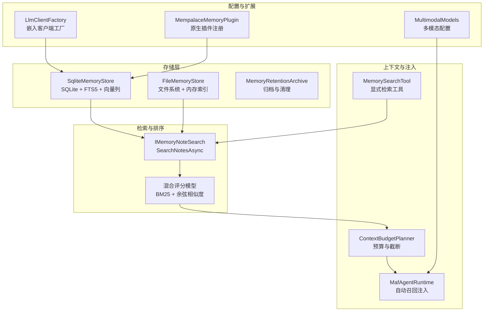
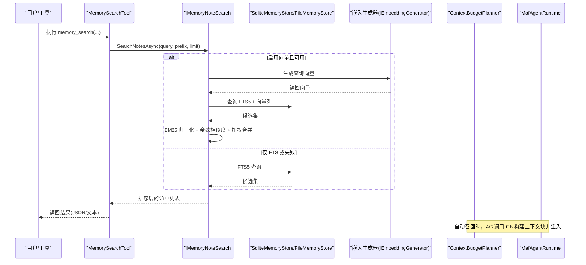
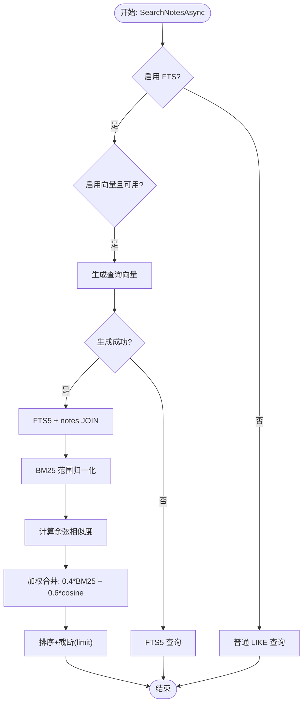
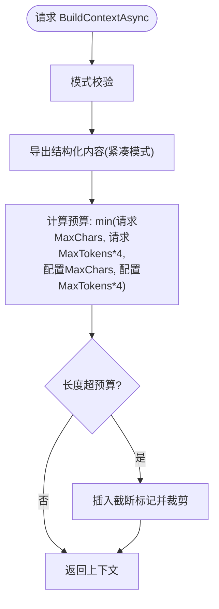
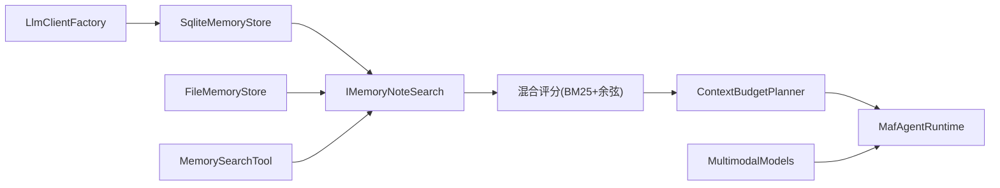

# 内存检索算法

<cite>
**本文引用的文件**
- [SqliteMemoryStore.cs](file://src/OpenClaw.Core/Memory/SqliteMemoryStore.cs)
- [ContextBudgetPlanner.cs](file://src/OpenClaw.Core/Memory/ContextBudgetPlanner.cs)
- [FileMemoryStore.cs](file://src/OpenClaw.Core/Memory/FileMemoryStore.cs)
- [MemoryRetentionArchive.cs](file://src/OpenClaw.Core/Memory/MemoryRetentionArchive.cs)
- [StructuredMemoryModels.cs](file://src/OpenClaw.Core/Models/StructuredMemoryModels.cs)
- [SessionSearchModels.cs](file://src/OpenClaw.Core/Models/SessionSearchModels.cs)
- [openclaw-memory-recall-and-retention.md](file://docs/openclaw-memory-recall-and-retention.md)
- [VectorMemorySearchTests.cs](file://src/OpenClaw.Tests/VectorMemorySearchTests.cs)
- [LlmClientFactory.cs](file://src/OpenClaw.Gateway/Extensions/LlmClientFactory.cs)
- [MempalaceMemoryStore.cs](file://src/OpenClaw.Plugins.Mempalace/MempalaceMemoryStore.cs)
- [MempalaceMemoryPlugin.cs](file://src/OpenClaw.Plugins.Mempalace/MempalaceMemoryPlugin.cs)
- [MafAgentRuntime.cs](file://src/OpenClaw.Agent/MafAgentRuntime.cs)
- [MemorySearchTool.cs](file://src/OpenClaw.Agent/Tools/MemorySearchTool.cs)
- [MultimodalModels.cs](file://src/OpenClaw.Core/Models/MultimodalModels.cs)
- [VideoFrameExtractionService.cs](file://src/OpenClaw.Gateway/VideoFrameExtractionService.cs)
</cite>

## 目录
1. [简介](#简介)
2. [项目结构](#项目结构)
3. [核心组件](#核心组件)
4. [架构总览](#架构总览)
5. [详细组件分析](#详细组件分析)
6. [依赖关系分析](#依赖关系分析)
7. [性能考量](#性能考量)
8. [故障排查指南](#故障排查指南)
9. [结论](#结论)
10. [附录](#附录)

## 简介
本文件面向内存检索算法的技术文档，聚焦于向量检索、语义搜索与全文检索的融合实现，系统阐述检索优化策略、相关性评分与结果排序机制，以及上下文预算规划、token 使用控制与性能优化技术。文档还覆盖检索精度评估、召回率分析与用户体验优化建议，并提供检索配置参数、调优指南与性能基准测试思路。最后，讨论多模态检索、实时搜索与增量索引更新机制。

## 项目结构
围绕“记忆”子系统的检索能力，核心代码位于 OpenClaw.Core 的 Memory 命名空间，配合 Gateway 的嵌入客户端工厂与 Agent 的自动召回机制，形成从数据存储、检索、排序、注入到配置与可观测性的完整闭环。

**图表来源**
- [SqliteMemoryStore.cs](file://src/OpenClaw.Core/Memory/SqliteMemoryStore.cs)
- [FileMemoryStore.cs](file://src/OpenClaw.Core/Memory/FileMemoryStore.cs)
- [ContextBudgetPlanner.cs](file://src/OpenClaw.Core/Memory/ContextBudgetPlanner.cs)
- [MafAgentRuntime.cs](file://src/OpenClaw.Agent/MafAgentRuntime.cs)
- [MemorySearchTool.cs](file://src/OpenClaw.Agent/Tools/MemorySearchTool.cs)
- [LlmClientFactory.cs](file://src/OpenClaw.Gateway/Extensions/LlmClientFactory.cs)
- [MempalaceMemoryPlugin.cs](file://src/OpenClaw.Plugins.Mempalace/MempalaceMemoryPlugin.cs)
- [MultimodalModels.cs](file://src/OpenClaw.Core/Models/MultimodalModels.cs)

**章节来源**
- [openclaw-memory-recall-and-retention.md](file://docs/openclaw-memory-recall-and-retention.md)

## 核心组件
- 存储后端
  - SqliteMemoryStore：支持 FTS5 全文检索与可选向量嵌入列，提供混合检索与排序。
  - FileMemoryStore：基于文件系统，维护内存索引，提供关键词搜索与前缀过滤。
- 检索与排序
  - IMemoryNoteSearch 接口的实现（SqliteMemoryStore/FileMemoryStore）负责 SearchNotesAsync。
  - 混合评分模型：当启用向量时，BM25 与余弦相似度加权组合；否则仅用 BM25。
- 上下文预算与注入
  - ContextBudgetPlanner：根据字符与 token 预算构建上下文块，支持截断标记。
  - MafAgentRuntime：自动召回机制将相关记忆注入到对话上下文中。
- 配置与扩展
  - LlmClientFactory：按提供商创建嵌入客户端，驱动向量生成。
  - MempalaceMemoryPlugin：原生插件注册与知识图谱工具集成。
  - MultimodalModels：多模态配置，支撑视频帧抽取等预处理。

**章节来源**
- [SqliteMemoryStore.cs](file://src/OpenClaw.Core/Memory/SqliteMemoryStore.cs)
- [FileMemoryStore.cs](file://src/OpenClaw.Core/Memory/FileMemoryStore.cs)
- [ContextBudgetPlanner.cs](file://src/OpenClaw.Core/Memory/ContextBudgetPlanner.cs)
- [MafAgentRuntime.cs](file://src/OpenClaw.Agent/MafAgentRuntime.cs)
- [LlmClientFactory.cs](file://src/OpenClaw.Gateway/Extensions/LlmClientFactory.cs)
- [MempalaceMemoryPlugin.cs](file://src/OpenClaw.Plugins.Mempalace/MempalaceMemoryPlugin.cs)
- [MultimodalModels.cs](file://src/OpenClaw.Core/Models/MultimodalModels.cs)

## 架构总览
检索链路从请求进入，经由工具或自动召回触发，选择合适的存储后端与检索策略，结合上下文预算与注入策略，最终返回给 LLM 使用。

**图表来源**
- [MemorySearchTool.cs](file://src/OpenClaw.Agent/Tools/MemorySearchTool.cs)
- [SqliteMemoryStore.cs](file://src/OpenClaw.Core/Memory/SqliteMemoryStore.cs)
- [FileMemoryStore.cs](file://src/OpenClaw.Core/Memory/FileMemoryStore.cs)
- [ContextBudgetPlanner.cs](file://src/OpenClaw.Core/Memory/ContextBudgetPlanner.cs)
- [MafAgentRuntime.cs](file://src/OpenClaw.Agent/MafAgentRuntime.cs)

## 详细组件分析

### 组件A：SqliteMemoryStore 检索与排序
- FTS5 全文检索
  - notes_fts 与 session_turns_fts 虚拟表，自动触发器同步 notes/content。
  - 支持 MATCH 查询与 bm25 排序，结合 updated_at 二次排序。
- 向量检索与混合评分
  - 当启用 enableVectors 且存在 IEmbeddingGenerator 时，生成查询向量与候选向量。
  - BM25 范围归一化（负值越小越好），与余弦相似度加权（默认 BM25:40%，余弦:60%）。
  - 无嵌入的候选仅用 BM25 归一化评分。
- 性能与稳定性
  - WAL 模式 + synchronous=NORMAL 平衡持久性与吞吐。
  - 异常捕获：FTS5 语法错误返回空集；嵌入生成异常记录日志但不中断。
- 增量索引与回填
  - 启动时尽力回填 notes_fts；支持 BackfillEmbeddingsAsync 批量补全向量列。

**图表来源**
- [SqliteMemoryStore.cs](file://src/OpenClaw.Core/Memory/SqliteMemoryStore.cs)

**章节来源**
- [SqliteMemoryStore.cs](file://src/OpenClaw.Core/Memory/SqliteMemoryStore.cs)
- [VectorMemorySearchTests.cs](file://src/OpenClaw.Tests/VectorMemorySearchTests.cs)

### 组件B：FileMemoryStore 搜索与排序
- 内存 TF 索引
  - 维护 NoteIndexEntry 字典，基于前缀过滤与查询词分词，计算得分并按时间倒序与键排序。
- 性能特性
  - 64 条带信号量控制并发加载会话，LRU 内存缓存提升热点命中。
  - 原子写入（.tmp -> rename）保障一致性。

**章节来源**
- [FileMemoryStore.cs](file://src/OpenClaw.Core/Memory/FileMemoryStore.cs)

### 组件C：ContextBudgetPlanner 上下文预算与截断
- 预算来源
  - 请求参数 MaxChars/MaxTokens 与全局配置 Min(MaxChars, Min(MaxTokens*4, 配置Token上限)) 取最小值。
- 截断策略
  - 超限时插入截断标记，保留上下文结构标签。
- 自动模式
  - 支持 manual/auto/pulse/off，严格校验配置与请求模式一致性。

**图表来源**
- [ContextBudgetPlanner.cs](file://src/OpenClaw.Core/Memory/ContextBudgetPlanner.cs)
- [StructuredMemoryModels.cs](file://src/OpenClaw.Core/Models/StructuredMemoryModels.cs)

**章节来源**
- [ContextBudgetPlanner.cs](file://src/OpenClaw.Core/Memory/ContextBudgetPlanner.cs)
- [StructuredMemoryModels.cs](file://src/OpenClaw.Core/Models/StructuredMemoryModels.cs)

### 组件D：MafAgentRuntime 自动召回注入
- 触发时机
  - 在推理阶段尝试注入相关记忆，优先项目作用域（前缀），再回退全局。
- 注入策略
  - 作为用户消息注入到位置 1，限制最大字符与条目数量，内容截断。
  - 明确标注“不可信数据”，避免将记忆当作可执行指令。

**章节来源**
- [MafAgentRuntime.cs](file://src/OpenClaw.Agent/MafAgentRuntime.cs)

### 组件E：MemorySearchTool 显式检索工具
- 参数
  - query、prefix、limit、format（text/json）。
- 输出
  - 文本或结构化 JSON 列表，便于下游处理。

**章节来源**
- [MemorySearchTool.cs](file://src/OpenClaw.Agent/Tools/MemorySearchTool.cs)

### 组件F：嵌入生成与多模态预处理
- 嵌入客户端
  - LlmClientFactory 根据提供商创建 IEmbeddingGenerator，驱动向量检索。
- 多模态
  - MultimodalModels 定义音频/视频/语音等配置；VideoFrameExtractionService 将视频转为有序图像帧供检索或分析使用。

**章节来源**
- [LlmClientFactory.cs](file://src/OpenClaw.Gateway/Extensions/LlmClientFactory.cs)
- [MultimodalModels.cs](file://src/OpenClaw.Core/Models/MultimodalModels.cs)
- [VideoFrameExtractionService.cs](file://src/OpenClaw.Gateway/VideoFrameExtractionService.cs)

## 依赖关系分析
- 存储层
  - SqliteMemoryStore 依赖 FTS5 与向量列；FileMemoryStore 依赖内存索引与文件系统。
- 检索层
  - IMemoryNoteSearch 实现类共享相同的排序与截断逻辑。
- 上下文层
  - ContextBudgetPlanner 依赖 IStructuredMemoryProvider（抽象结构化记忆导出）。
- 注入层
  - MafAgentRuntime 依赖 IMemoryStore 与 IMemoryNoteSearch，结合 recall 配置。
- 配置层
  - LlmClientFactory 与 MultimodalModels 为检索与多模态提供运行时能力。

**图表来源**
- [SqliteMemoryStore.cs](file://src/OpenClaw.Core/Memory/SqliteMemoryStore.cs)
- [FileMemoryStore.cs](file://src/OpenClaw.Core/Memory/FileMemoryStore.cs)
- [ContextBudgetPlanner.cs](file://src/OpenClaw.Core/Memory/ContextBudgetPlanner.cs)
- [MafAgentRuntime.cs](file://src/OpenClaw.Agent/MafAgentRuntime.cs)
- [MemorySearchTool.cs](file://src/OpenClaw.Agent/Tools/MemorySearchTool.cs)
- [LlmClientFactory.cs](file://src/OpenClaw.Gateway/Extensions/LlmClientFactory.cs)
- [MultimodalModels.cs](file://src/OpenClaw.Core/Models/MultimodalModels.cs)

**章节来源**
- [SqliteMemoryStore.cs](file://src/OpenClaw.Core/Memory/SqliteMemoryStore.cs)
- [FileMemoryStore.cs](file://src/OpenClaw.Core/Memory/FileMemoryStore.cs)
- [ContextBudgetPlanner.cs](file://src/OpenClaw.Core/Memory/ContextBudgetPlanner.cs)
- [MafAgentRuntime.cs](file://src/OpenClaw.Agent/MafAgentRuntime.cs)
- [MemorySearchTool.cs](file://src/OpenClaw.Agent/Tools/MemorySearchTool.cs)
- [LlmClientFactory.cs](file://src/OpenClaw.Gateway/Extensions/LlmClientFactory.cs)
- [MultimodalModels.cs](file://src/OpenClaw.Core/Models/MultimodalModels.cs)

## 性能考量
- 存储与索引
  - SQLite WAL + synchronous=NORMAL 提升写入吞吐；FTS5 虚拟表与触发器保障内容同步。
  - 向量列采用零拷贝序列化（float[] 原始字节），减少 GC 压力。
- 检索效率
  - FTS5 查询 + bm25 排序，候选集先扩大再截断（如 limit*5），降低漏检概率。
  - 向量生成失败时自动降级为纯 FTS 检索。
- 并发与缓存
  - FileMemoryStore 使用 64 条带信号量与 LRU 缓存，缓解高并发下的 IO 压力。
- 上下文预算
  - 字符与 token 双预算约束，避免上下文溢出；截断标记保持结构完整性。
- 归档与保留
  - MemoryRetentionArchive 按日期分区归档，支持保留期清理，降低存储与查询压力。

[本节为通用性能指导，无需具体文件分析]

## 故障排查指南
- FTS5 查询异常
  - 现象：FTS5 语法错误导致无匹配。
  - 处理：捕获 SqliteException 并返回空集；检查查询语法与停用词。
- 嵌入生成失败
  - 现象：向量检索降级为纯 FTS。
  - 处理：记录警告日志；确认嵌入客户端可用与网络连通。
- 记忆召回注入问题
  - 现象：召回内容过多或过少。
  - 处理：调整 recall.maxNotes 与 recall.maxChars；检查前缀过滤是否正确。
- 归档清理异常
  - 现象：归档文件未清理或报错。
  - 处理：检查 archivePath 权限与磁盘空间；查看错误列表定位具体文件。

**章节来源**
- [SqliteMemoryStore.cs](file://src/OpenClaw.Core/Memory/SqliteMemoryStore.cs)
- [ContextBudgetPlanner.cs](file://src/OpenClaw.Core/Memory/ContextBudgetPlanner.cs)
- [MemoryRetentionArchive.cs](file://src/OpenClaw.Core/Memory/MemoryRetentionArchive.cs)

## 结论
本检索体系通过 SQLite FTS5 与可选向量嵌入的混合策略，在保证检索质量的同时兼顾性能与可靠性。结合上下文预算与自动召回机制，有效控制 token 使用并提升用户体验。通过配置与扩展点（嵌入客户端、多模态预处理、原生插件），系统具备良好的可演进性与工程落地能力。

[本节为总结性内容，无需具体文件分析]

## 附录

### 检索配置参数与调优指南
- SQLite 向量检索
  - enableFts: 是否启用 FTS5
  - enableVectors: 是否启用向量列
  - embeddingModel/embeddingDimensions: 嵌入模型与维度
- 回忆注入
  - recall.enabled/maxNotes/maxChars: 控制召回数量与字符预算
- 保留与归档
  - retention.*: TTL、扫描间隔、归档路径与保留期
- 多模态
  - MultimodalConfig: 视频/音频/语音等配置

**章节来源**
- [openclaw-memory-recall-and-retention.md](file://docs/openclaw-memory-recall-and-retention.md)
- [MultimodalModels.cs](file://src/OpenClaw.Core/Models/MultimodalModels.cs)

### 评估与基准测试建议
- 精度与召回
  - 使用标准数据集划分训练/验证/测试集；计算准确率、召回率、F1 分数与 NDCG。
- 速度与资源
  - 测试不同 limit、前缀过滤与向量启用状态下的延迟与内存占用。
- 用户体验
  - 通过人工评估召回内容的相关性与可读性，结合用户反馈迭代排序权重。

[本节为通用评估方法，无需具体文件分析]

### 多模态检索、实时搜索与增量索引
- 多模态检索
  - 通过视频帧抽取与图像/音频嵌入生成，扩展检索内容形态。
- 实时搜索
  - FTS5 触发器保证新增/更新即时同步；向量列支持批量回填。
- 增量索引更新
  - BackfillEmbeddingsAsync 批量补全缺失向量；RetentionArchive 清理过期数据，释放索引压力。

**章节来源**
- [VideoFrameExtractionService.cs](file://src/OpenClaw.Gateway/VideoFrameExtractionService.cs)
- [SqliteMemoryStore.cs](file://src/OpenClaw.Core/Memory/SqliteMemoryStore.cs)
- [MemoryRetentionArchive.cs](file://src/OpenClaw.Core/Memory/MemoryRetentionArchive.cs)