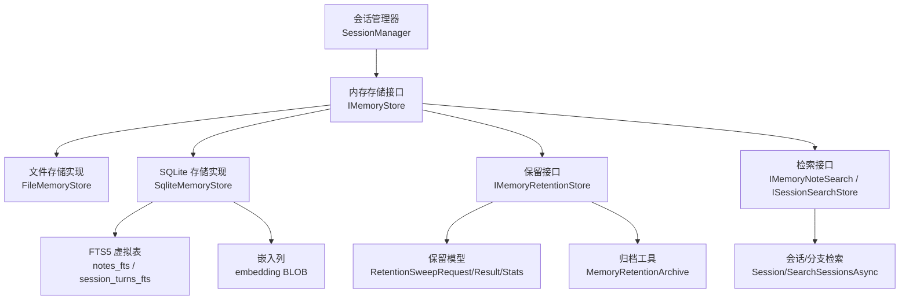
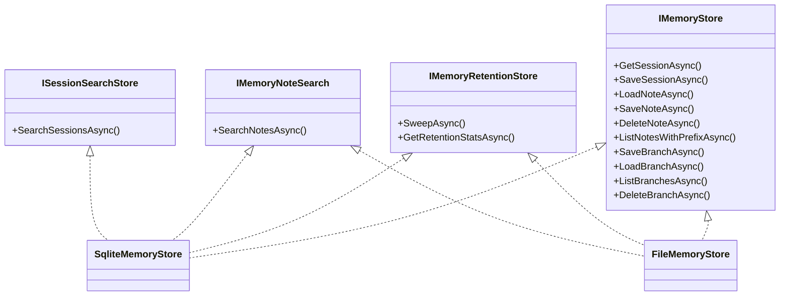
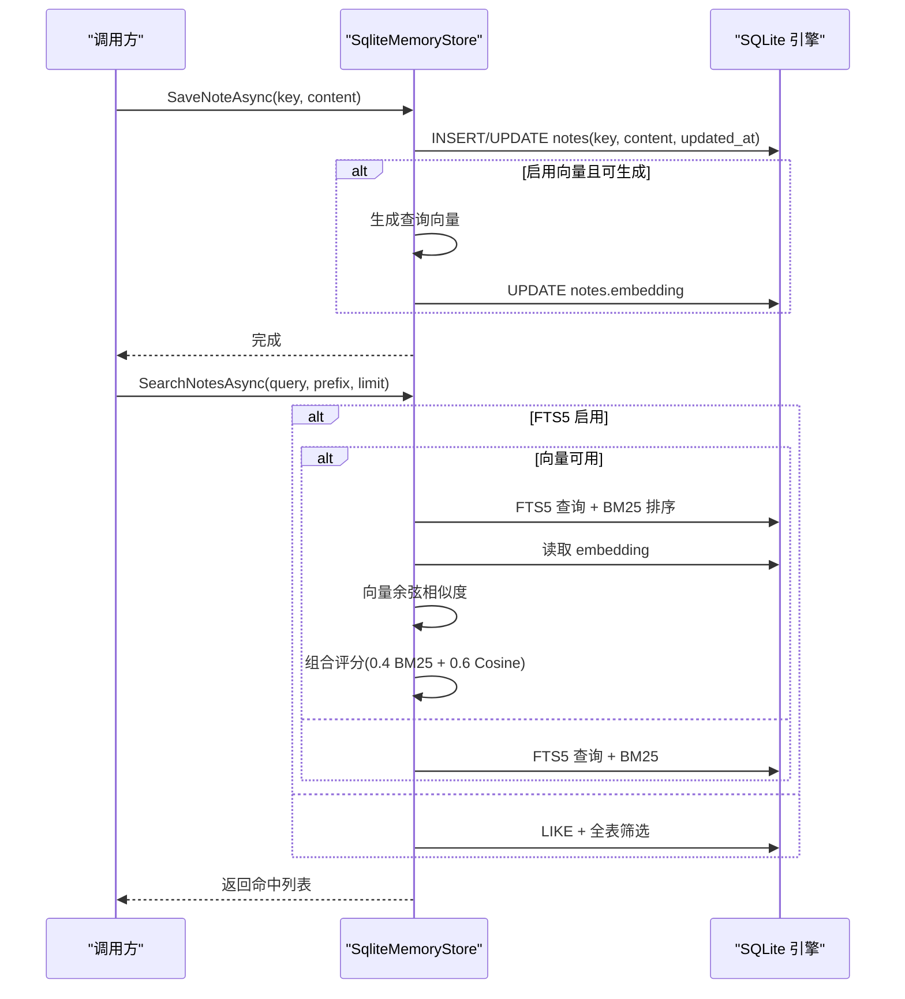
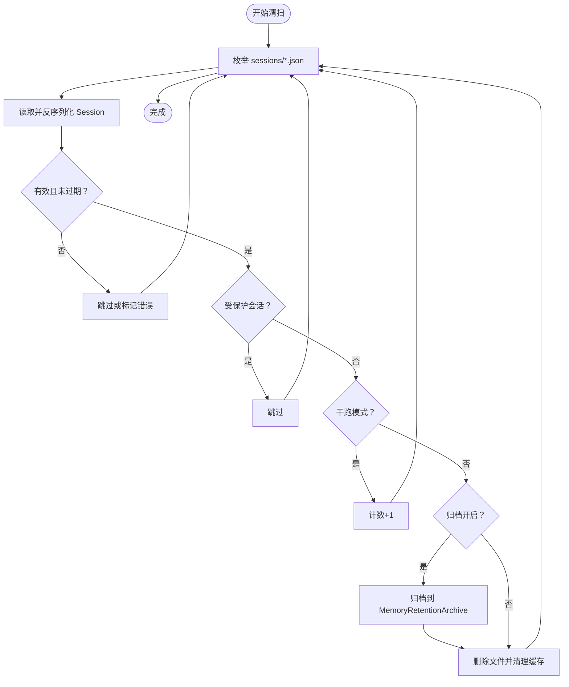
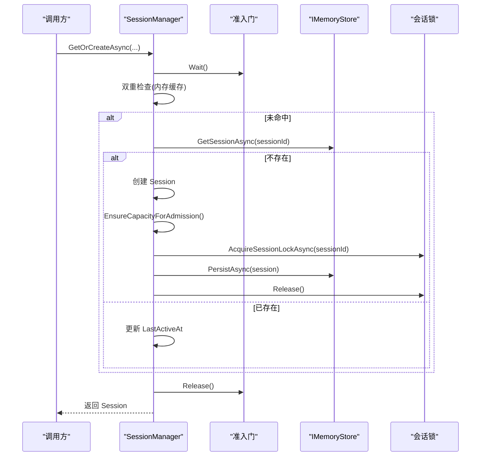
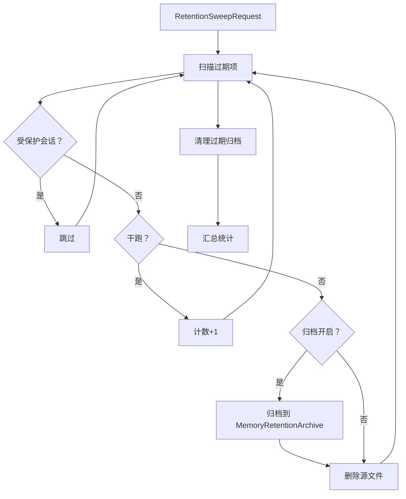
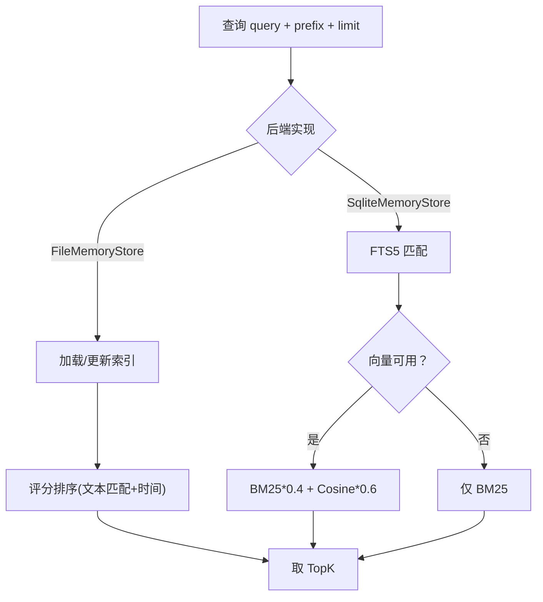
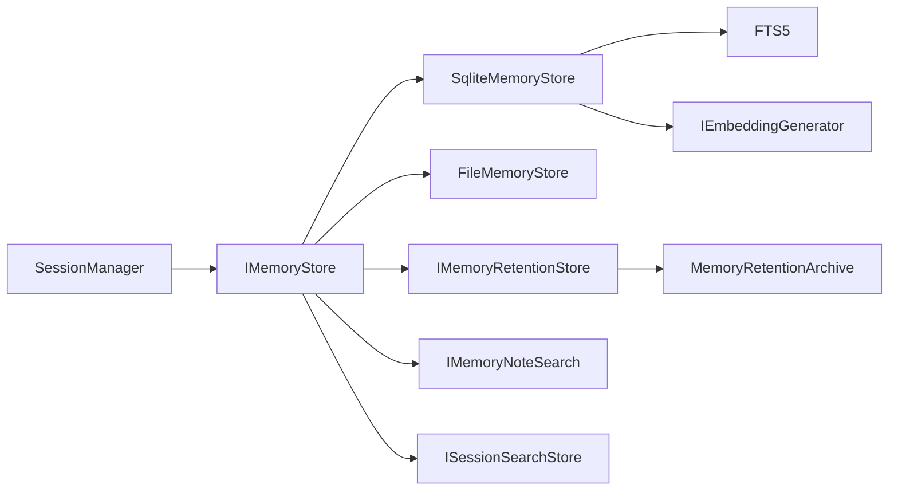

# 内存系统

<cite>
**本文引用的文件**
- [SqliteMemoryStore.cs](file://src/OpenClaw.Core/Memory/SqliteMemoryStore.cs)
- [FileMemoryStore.cs](file://src/OpenClaw.Core/Memory/FileMemoryStore.cs)
- [MemoryRetentionArchive.cs](file://src/OpenClaw.Core/Memory/MemoryRetentionArchive.cs)
- [IMemoryStore.cs](file://src/OpenClaw.Core/Abstractions/IMemoryStore.cs)
- [IMemoryRetentionStore.cs](file://src/OpenClaw.Core/Abstractions/IMemoryRetentionStore.cs)
- [IMemoryNoteSearch.cs](file://src/OpenClaw.Core/Abstractions/IMemoryNoteSearch.cs)
- [ISessionSearchStore.cs](file://src/OpenClaw.Core/Abstractions/ISessionSearchStore.cs)
- [MemoryRetentionModels.cs](file://src/OpenClaw.Core/Models/MemoryRetentionModels.cs)
- [Session.cs](file://src/OpenClaw.Core/Models/Session.cs)
- [SessionBranch.cs](file://src/OpenClaw.Core/Models/SessionBranch.cs)
- [SessionManager.cs](file://src/OpenClaw.Core/Sessions/SessionManager.cs)
- [openclaw-memory-recall-and-retention.md](file://docs/openclaw-memory-recall-and-retention.md)
- [OpenClaw-Session-Management.md](file://docs/OpenClaw-Session-Management.md)
- [VectorMemorySearchTests.cs](file://src/OpenClaw.Tests/VectorMemorySearchTests.cs)
- [MempalaceMemoryStore.cs](file://src/OpenClaw.Plugins.Mempalace/MempalaceMemoryStore.cs)
</cite>

## 目录
1. [简介](#简介)
2. [项目结构](#项目结构)
3. [核心组件](#核心组件)
4. [架构总览](#架构总览)
5. [详细组件分析](#详细组件分析)
6. [依赖关系分析](#依赖关系分析)
7. [性能考量](#性能考量)
8. [故障排除指南](#故障排除指南)
9. [结论](#结论)
10. [附录](#附录)

## 简介
本文件系统性阐述内存系统的架构与实现，覆盖会话管理、数据持久化与检索、向量搜索与召回、数据保留与清理、以及配置与运维要点。系统提供两种存储后端：SQLite 与文件系统，并支持基于 FTS5 的全文检索与可选的向量嵌入混合排序；通过会话管理器实现线程安全的会话生命周期管理与持久化；通过保留服务实现自动清理与归档。

## 项目结构
内存系统主要位于 OpenClaw.Core 的 Memory 命名空间，围绕以下核心抽象展开：
- 存储接口与实现：IMemoryStore、SqliteMemoryStore、FileMemoryStore
- 保留能力：IMemoryRetentionStore、MemoryRetentionArchive、Retention* 模型
- 会话与分支：Session、SessionBranch、SessionManager
- 检索接口：IMemoryNoteSearch、ISessionSearchStore
- 文档与配置参考：openclaw-memory-recall-and-retention.md、OpenClaw-Session-Management.md

图示来源
- [SessionManager.cs:1-499](file://src/OpenClaw.Core/Sessions/SessionManager.cs#L1-L499)
- [IMemoryStore.cs:1-23](file://src/OpenClaw.Core/Abstractions/IMemoryStore.cs#L1-L23)
- [FileMemoryStore.cs:1-1263](file://src/OpenClaw.Core/Memory/FileMemoryStore.cs#L1-L1263)
- [SqliteMemoryStore.cs:1-1401](file://src/OpenClaw.Core/Memory/SqliteMemoryStore.cs#L1-L1401)
- [IMemoryRetentionStore.cs:1-17](file://src/OpenClaw.Core/Abstractions/IMemoryRetentionStore.cs#L1-L17)
- [MemoryRetentionModels.cs:1-83](file://src/OpenClaw.Core/Models/MemoryRetentionModels.cs#L1-L83)
- [MemoryRetentionArchive.cs:1-218](file://src/OpenClaw.Core/Memory/MemoryRetentionArchive.cs#L1-L218)
- [IMemoryNoteSearch.cs:1-28](file://src/OpenClaw.Core/Abstractions/IMemoryNoteSearch.cs#L1-L28)
- [ISessionSearchStore.cs:1-9](file://src/OpenClaw.Core/Abstractions/ISessionSearchStore.cs#L1-L9)

章节来源
- [SessionManager.cs:1-499](file://src/OpenClaw.Core/Sessions/SessionManager.cs#L1-L499)
- [IMemoryStore.cs:1-23](file://src/OpenClaw.Core/Abstractions/IMemoryStore.cs#L1-L23)
- [FileMemoryStore.cs:1-1263](file://src/OpenClaw.Core/Memory/FileMemoryStore.cs#L1-L1263)
- [SqliteMemoryStore.cs:1-1401](file://src/OpenClaw.Core/Memory/SqliteMemoryStore.cs#L1-L1401)
- [IMemoryRetentionStore.cs:1-17](file://src/OpenClaw.Core/Abstractions/IMemoryRetentionStore.cs#L1-L17)
- [MemoryRetentionModels.cs:1-83](file://src/OpenClaw.Core/Models/MemoryRetentionModels.cs#L1-L83)
- [MemoryRetentionArchive.cs:1-218](file://src/OpenClaw.Core/Memory/MemoryRetentionArchive.cs#L1-L218)
- [IMemoryNoteSearch.cs:1-28](file://src/OpenClaw.Core/Abstractions/IMemoryNoteSearch.cs#L1-L28)
- [ISessionSearchStore.cs:1-9](file://src/OpenClaw.Core/Abstractions/ISessionSearchStore.cs#L1-L9)

## 核心组件
- IMemoryStore：会话与笔记的持久化抽象，定义读写、分支与列表等能力。
- SqliteMemoryStore：基于 SQLite/WAL 的高性能实现，支持 FTS5 全文检索与可选向量嵌入。
- FileMemoryStore：文件系统实现，提供原子写入、损坏隔离、LRU 缓存与并发加载栅栏。
- IMemoryRetentionStore：保留能力接口，提供清理与归档。
- MemoryRetentionArchive：归档与过期清理工具，按日期分区存储并清理。
- Session/SessionBranch：会话与分支的数据模型，支持执行检查点与委托信息。
- SessionManager：会话权威协调器，负责创建、容量控制、持久化与锁管理。
- 检索接口：IMemoryNoteSearch、ISessionSearchStore，提供笔记检索与会话检索。

章节来源
- [IMemoryStore.cs:1-23](file://src/OpenClaw.Core/Abstractions/IMemoryStore.cs#L1-L23)
- [SqliteMemoryStore.cs:1-1401](file://src/OpenClaw.Core/Memory/SqliteMemoryStore.cs#L1-L1401)
- [FileMemoryStore.cs:1-1263](file://src/OpenClaw.Core/Memory/FileMemoryStore.cs#L1-L1263)
- [IMemoryRetentionStore.cs:1-17](file://src/OpenClaw.Core/Abstractions/IMemoryRetentionStore.cs#L1-L17)
- [MemoryRetentionArchive.cs:1-218](file://src/OpenClaw.Core/Memory/MemoryRetentionArchive.cs#L1-L218)
- [Session.cs:1-1109](file://src/OpenClaw.Core/Models/Session.cs#L1-L1109)
- [SessionBranch.cs:1-16](file://src/OpenClaw.Core/Models/SessionBranch.cs#L1-L16)
- [SessionManager.cs:1-499](file://src/OpenClaw.Core/Sessions/SessionManager.cs#L1-L499)
- [IMemoryNoteSearch.cs:1-28](file://src/OpenClaw.Core/Abstractions/IMemoryNoteSearch.cs#L1-L28)
- [ISessionSearchStore.cs:1-9](file://src/OpenClaw.Core/Abstractions/ISessionSearchStore.cs#L1-L9)

## 架构总览
内存系统采用“接口抽象 + 多后端实现”的分层设计：
- 抽象层：IMemoryStore、IMemoryRetentionStore、IMemoryNoteSearch、ISessionSearchStore
- 实现层：SqliteMemoryStore、FileMemoryStore
- 运维层：Retention 清扫与归档、SessionManager 生命周期与并发控制
- 检索层：FTS5 + 可选向量嵌入混合评分

图示来源
- [IMemoryStore.cs:1-23](file://src/OpenClaw.Core/Abstractions/IMemoryStore.cs#L1-L23)
- [IMemoryRetentionStore.cs:1-17](file://src/OpenClaw.Core/Abstractions/IMemoryRetentionStore.cs#L1-L17)
- [IMemoryNoteSearch.cs:1-28](file://src/OpenClaw.Core/Abstractions/IMemoryNoteSearch.cs#L1-L28)
- [ISessionSearchStore.cs:1-9](file://src/OpenClaw.Core/Abstractions/ISessionSearchStore.cs#L1-L9)
- [SqliteMemoryStore.cs:1-1401](file://src/OpenClaw.Core/Memory/SqliteMemoryStore.cs#L1-L1401)
- [FileMemoryStore.cs:1-1263](file://src/OpenClaw.Core/Memory/FileMemoryStore.cs#L1-L1263)

## 详细组件分析

### SQLite 存储实现（SqliteMemoryStore）
- 数据模型与索引
  - sessions：主键 id，JSON 载荷，updated_at 时间戳；索引 updated_at
  - notes：主键 key，content，updated_at；FTS5 notes_fts(key,content)
  - branches：主键 branch_id，外键 session_id，name，json，updated_at；索引 updated_at
- FTS5 与触发器
  - notes 表与 notes_fts 同步：INSERT/DELETE/AUTO 触发器
  - session_turns_fts 用于会话检索（初始化时创建）
- 向量搜索
  - notes 表新增 embedding BLOB 列
  - 搜索时优先生成查询向量，若可用则与 BM25 组合评分（BM25 占比 0.4，余弦 0.6）
  - 无嵌入时降级为纯 FTS5 BM25
- 持久化与一致性
  - WAL + synchronous=NORMAL 平衡吞吐与可靠性
  - 会话/分支保存使用 UPSERT，updated_at 更新
- 清扫与统计
  - SweepAsync：按 updated_at 扫描过期项，支持保护会话、归档开关、干跑模式
  - GetRetentionStats：统计 sessions/branches 数量

图示来源
- [SqliteMemoryStore.cs:1-1401](file://src/OpenClaw.Core/Memory/SqliteMemoryStore.cs#L1-L1401)

章节来源
- [SqliteMemoryStore.cs:1-1401](file://src/OpenClaw.Core/Memory/SqliteMemoryStore.cs#L1-L1401)

### 文件系统存储实现（FileMemoryStore）
- 目录布局
  - sessions/、notes/、branches/
- 安全与可靠性
  - 文件名 URL-safe base64 编码，防止路径遍历
  - 超长键经 SHA256 哈希，原始键保存于 .key 辅助文件
  - 会话写入采用临时文件 + 原子重命名，失败清理 .tmp
  - 损坏文件移动至带时间戳的 quarantine，保留取证
- 并发与缓存
  - 会话内存缓存（LRU），命中计数与未命中计数
  - 64 路会话加载栅栏，避免热点竞争
- 检索与索引
  - 笔记内容索引（NoteIndexEntry）按需加载，支持前缀过滤与评分
  - 搜索时对候选集进行评分排序，再按需读取正文
- 清扫与统计
  - SweepAsync：枚举 *.json，反序列化判断过期，支持归档与干跑
  - GetRetentionStats：统计各目录 JSON 数量

图示来源
- [FileMemoryStore.cs:570-735](file://src/OpenClaw.Core/Memory/FileMemoryStore.cs#L570-L735)
- [MemoryRetentionArchive.cs:1-218](file://src/OpenClaw.Core/Memory/MemoryRetentionArchive.cs#L1-L218)

章节来源
- [FileMemoryStore.cs:1-1263](file://src/OpenClaw.Core/Memory/FileMemoryStore.cs#L1-L1263)
- [MemoryRetentionArchive.cs:1-218](file://src/OpenClaw.Core/Memory/MemoryRetentionArchive.cs#L1-L218)

### 会话管理与持久化（SessionManager）
- 线程安全与准入控制
  - 单一准入门（SemaphoreSlim(1,1)）分流创建请求
  - 双重检查锁定：内存缓存 -> 门控检查 -> 存储查找 -> 创建
- 容量控制与 LRU
  - EnsureCapacityForAdmission：扫描过期 -> LRU 淘汰 -> 超限时拒绝
  - MaxConcurrentSessions 控制上限
- 持久化重试
  - 三次指数退避（100ms/200ms/400ms）保障写入可靠性
- 会话锁
  - 按会话粒度的独占锁，用于分支、持久化与历史追加的串行化
  - 定期清理孤儿锁

图示来源
- [SessionManager.cs:1-499](file://src/OpenClaw.Core/Sessions/SessionManager.cs#L1-L499)
- [OpenClaw-Session-Management.md:27-77](file://docs/OpenClaw-Session-Management.md#L27-L77)

章节来源
- [SessionManager.cs:1-499](file://src/OpenClaw.Core/Sessions/SessionManager.cs#L1-L499)
- [OpenClaw-Session-Management.md:27-77](file://docs/OpenClaw-Session-Management.md#L27-L77)

### 数据保留与归档（Retention）
- 请求与结果模型
  - RetentionSweepRequest：截止时间、归档开关、路径、保留天数、最大项数、干跑
  - RetentionSweepResult：统计计数、错误列表、耗时
  - RetentionStoreStats：后端类型与计数
- 清扫流程
  - 会话：按 updated_at 升序扫描，判定过期、保护、归档与删除
  - 分支：按创建时间判定过期
  - 干跑：仅统计不修改
- 归档格式
  - 按年/月/日/类别分区，文件名含 ID 哈希与时间戳，封装元数据与 payload
  - 过期清理：按 sweptAtUtc 或最后写入时间判断

图示来源
- [IMemoryRetentionStore.cs:1-17](file://src/OpenClaw.Core/Abstractions/IMemoryRetentionStore.cs#L1-L17)
- [MemoryRetentionModels.cs:1-83](file://src/OpenClaw.Core/Models/MemoryRetentionModels.cs#L1-L83)
- [MemoryRetentionArchive.cs:79-166](file://src/OpenClaw.Core/Memory/MemoryRetentionArchive.cs#L79-L166)

章节来源
- [IMemoryRetentionStore.cs:1-17](file://src/OpenClaw.Core/Abstractions/IMemoryRetentionStore.cs#L1-L17)
- [MemoryRetentionModels.cs:1-83](file://src/OpenClaw.Core/Models/MemoryRetentionModels.cs#L1-L83)
- [MemoryRetentionArchive.cs:1-218](file://src/OpenClaw.Core/Memory/MemoryRetentionArchive.cs#L1-L218)
- [openclaw-memory-recall-and-retention.md:159-237](file://docs/openclaw-memory-recall-and-retention.md#L159-L237)

### 检索与向量搜索
- 笔记检索
  - IMemoryNoteSearch.SearchNotesAsync 提供查询、前缀与限制
  - FileMemoryStore：内存索引 + 评分排序
  - SqliteMemoryStore：FTS5 + 可选向量混合评分
- 会话检索
  - ISessionSearchStore.SearchSessionsAsync 支持会话级检索（具体实现见相关模块）

图示来源
- [IMemoryNoteSearch.cs:1-28](file://src/OpenClaw.Core/Abstractions/IMemoryNoteSearch.cs#L1-L28)
- [FileMemoryStore.cs:356-405](file://src/OpenClaw.Core/Memory/FileMemoryStore.cs#L356-L405)
- [SqliteMemoryStore.cs:319-490](file://src/OpenClaw.Core/Memory/SqliteMemoryStore.cs#L319-L490)

章节来源
- [IMemoryNoteSearch.cs:1-28](file://src/OpenClaw.Core/Abstractions/IMemoryNoteSearch.cs#L1-L28)
- [FileMemoryStore.cs:356-405](file://src/OpenClaw.Core/Memory/FileMemoryStore.cs#L356-L405)
- [SqliteMemoryStore.cs:319-490](file://src/OpenClaw.Core/Memory/SqliteMemoryStore.cs#L319-L490)
- [VectorMemorySearchTests.cs:1-72](file://src/OpenClaw.Tests/VectorMemorySearchTests.cs#L1-L72)

### 会话与分支模型
- Session：包含会话标识、渠道与发送者、创建/活跃时间、历史记录、状态、令牌用量、执行检查点等
- SessionBranch：会话历史快照，支持分支探索与回溯

章节来源
- [Session.cs:1-1109](file://src/OpenClaw.Core/Models/Session.cs#L1-L1109)
- [SessionBranch.cs:1-16](file://src/OpenClaw.Core/Models/SessionBranch.cs#L1-L16)

## 依赖关系分析
- 组件耦合
  - SqliteMemoryStore 与 FileMemoryStore 均实现 IMemoryStore、IMemoryRetentionStore、IMemoryNoteSearch、ISessionSearchStore
  - SessionManager 依赖 IMemoryStore，负责并发与容量控制
  - Retention 清扫依赖 IMemoryRetentionStore 与 MemoryRetentionArchive
- 外部依赖
  - SQLite（Microsoft.Data.Sqlite）、FTS5、WAL
  - IEmbeddingGenerator（可选）用于向量嵌入
  - 文件系统与 JSON 序列化

图示来源
- [SessionManager.cs:1-499](file://src/OpenClaw.Core/Sessions/SessionManager.cs#L1-L499)
- [IMemoryStore.cs:1-23](file://src/OpenClaw.Core/Abstractions/IMemoryStore.cs#L1-L23)
- [SqliteMemoryStore.cs:1-1401](file://src/OpenClaw.Core/Memory/SqliteMemoryStore.cs#L1-L1401)
- [FileMemoryStore.cs:1-1263](file://src/OpenClaw.Core/Memory/FileMemoryStore.cs#L1-L1263)
- [IMemoryRetentionStore.cs:1-17](file://src/OpenClaw.Core/Abstractions/IMemoryRetentionStore.cs#L1-L17)
- [MemoryRetentionArchive.cs:1-218](file://src/OpenClaw.Core/Memory/MemoryRetentionArchive.cs#L1-L218)
- [IMemoryNoteSearch.cs:1-28](file://src/OpenClaw.Core/Abstractions/IMemoryNoteSearch.cs#L1-L28)
- [ISessionSearchStore.cs:1-9](file://src/OpenClaw.Core/Abstractions/ISessionSearchStore.cs#L1-L9)

## 性能考量
- SQLite 后端
  - WAL + synchronous=NORMAL 提升写入吞吐
  - FTS5 虚拟表 + 触发器保持同步，适合大文本检索
  - 向量混合评分在高维向量场景需关注计算成本，可调整权重或降采样
- 文件后端
  - 原子写入 + 缓存减少磁盘 IO
  - 加载栅栏降低热点竞争
  - 注意目录枚举与 JSON 反序列化的开销，建议合理限制扫描范围
- 检索优化
  - 限制返回数量（limit）与前缀过滤
  - 向量可用时优先，否则回退 BM25
- 清扫策略
  - 控制 MaxItemsPerSweep，避免一次性大量删除
  - 归档路径与保留天数需结合磁盘空间规划

## 故障排除指南
- 会话加载失败
  - FileMemoryStore：损坏文件会被隔离到 quarantine 文件，检查日志定位路径
  - SqliteMemoryStore：异常包装为 MemoryStoreCorruptionException，检查数据库文件与权限
- 清扫异常
  - RetentionSweepResult.Errors 中记录具体错误，优先排查磁盘权限与归档路径
  - 干跑模式可用于验证阈值与影响范围
- 向量搜索异常
  - IEmbeddingGenerator 未配置或不可用时，自动降级为纯 FTS 搜索
  - 嵌入维度与模型需匹配，测试用例可参考 VectorMemorySearchTests

章节来源
- [FileMemoryStore.cs:191-223](file://src/OpenClaw.Core/Memory/FileMemoryStore.cs#L191-L223)
- [SqliteMemoryStore.cs:170-178](file://src/OpenClaw.Core/Memory/SqliteMemoryStore.cs#L170-L178)
- [MemoryRetentionModels.cs:45-51](file://src/OpenClaw.Core/Models/MemoryRetentionModels.cs#L45-L51)
- [VectorMemorySearchTests.cs:1-72](file://src/OpenClaw.Tests/VectorMemorySearchTests.cs#L1-L72)

## 结论
内存系统通过清晰的接口分层与多后端实现，提供了可靠、可扩展的记忆存储能力。SQLite 后端在检索与向量混合方面具备优势，文件后端在本地开发与简单部署场景更友好。配合会话管理器与保留服务，系统实现了从会话生命周期到数据保留的全链路管理。

## 附录

### 配置示例与参数说明
- 常用配置项（摘自文档）
  - memory.retention.enabled：是否启用保留扫描
  - memory.retention.sessionTtlDays：会话非活跃保留天数
  - memory.retention.branchTtlDays：分支创建保留天数
  - memory.retention.archiveEnabled：删除前是否归档
  - memory.retention.archivePath：归档根目录
  - memory.retention.archiveRetentionDays：归档保留天数
  - memory.retention.maxItemsPerSweep：每次清扫最大处理项数
  - memory.sqlite.enableFts / enableVectors：FTS5 与向量开关
  - memory.sqlite.embeddingModel / embeddingDimensions：嵌入模型与维度
- 示例配置（摘自文档）
  - 完整 JSON 配置参考见文档末尾

章节来源
- [openclaw-memory-recall-and-retention.md:159-237](file://docs/openclaw-memory-recall-and-retention.md#L159-L237)

### 数据安全、备份与迁移
- 数据安全
  - 文件名编码与 .key 辅助文件保证键往返保真
  - 损坏文件隔离与日志记录便于审计
- 备份与恢复
  - 归档目录结构清晰，可直接复制归档进行备份
  - 恢复时可将归档文件还原到对应日期目录
- 迁移策略
  - FileMemoryStore 支持从旧版未编码文件名迁移至编码文件名
  - 向量维度变化时需重建索引或回填嵌入

章节来源
- [FileMemoryStore.cs:101-131](file://src/OpenClaw.Core/Memory/FileMemoryStore.cs#L101-L131)
- [MemoryRetentionArchive.cs:168-199](file://src/OpenClaw.Core/Memory/MemoryRetentionArchive.cs#L168-L199)