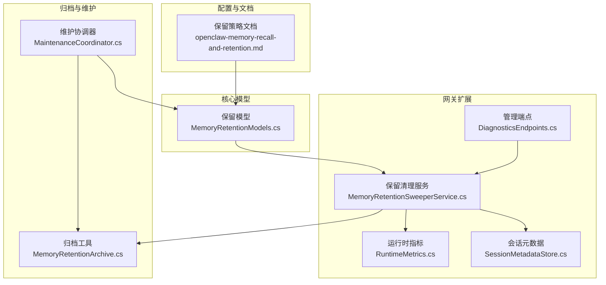
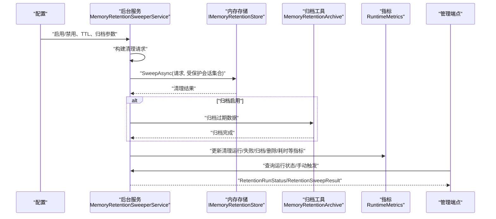
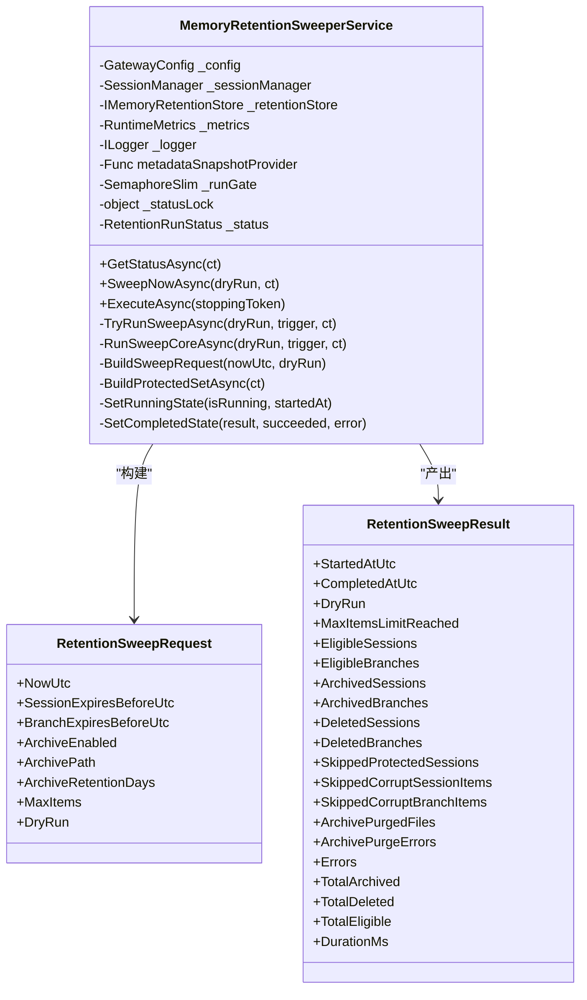
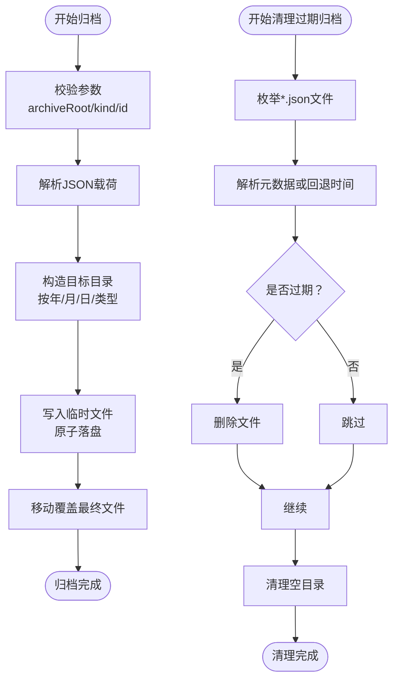
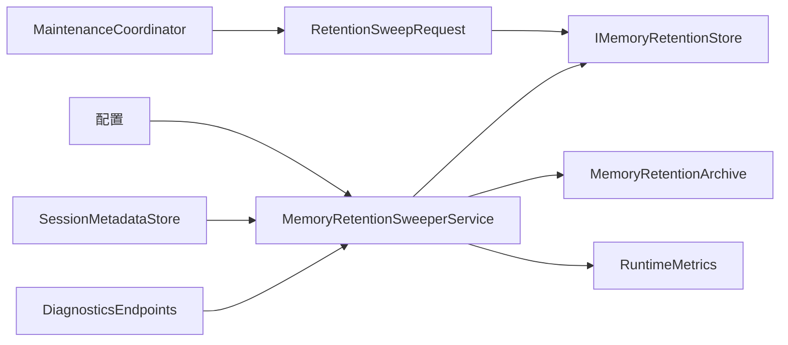

# 数据保留策略

<cite>
**本文引用的文件**
- [openclaw-memory-recall-and-retention.md](file://docs/openclaw-memory-recall-and-retention.md)
- [MemoryRetentionModels.cs](file://src/OpenClaw.Core/Models/MemoryRetentionModels.cs)
- [MemoryRetentionSweeperService.cs](file://src/OpenClaw.Gateway/Extensions/MemoryRetentionSweeperService.cs)
- [MemoryRetentionArchive.cs](file://src/OpenClaw.Core/Memory/MemoryRetentionArchive.cs)
- [MaintenanceCoordinator.cs](file://src/OpenClaw.Core/Setup/MaintenanceCoordinator.cs)
- [RuntimeMetrics.cs](file://src/OpenClaw.Core/Observability/RuntimeMetrics.cs)
- [SessionMetadataStore.cs](file://src/OpenClaw.Gateway/SessionMetadataStore.cs)
- [AdminEndpoints.Memory.cs](file://src/OpenClaw.Gateway/Endpoints/AdminEndpoints.Memory.cs)
- [DiagnosticsEndpoints.cs](file://src/OpenClaw.Gateway/Endpoints/DiagnosticsEndpoints.cs)
- [GovernanceLedgerService.cs](file://src/OpenClaw.Gateway/GovernanceLedgerService.cs)
- [FileMemoryStoreRetentionTests.cs](file://src/OpenClaw.Tests/FileMemoryStoreRetentionTests.cs)
- [SqliteMemoryStoreRetentionTests.cs](file://src/OpenClaw.Tests/SqliteMemoryStoreRetentionTests.cs)
- [MemoryRetentionSweeperServiceTests.cs](file://src/OpenClaw.Tests/MemoryRetentionSweeperServiceTests.cs)
</cite>

## 目录
1. [简介](#简介)
2. [项目结构](#项目结构)
3. [核心组件](#核心组件)
4. [架构总览](#架构总览)
5. [详细组件分析](#详细组件分析)
6. [依赖关系分析](#依赖关系分析)
7. [性能考量](#性能考量)
8. [故障排查指南](#故障排查指南)
9. [结论](#结论)
10. [附录](#附录)

## 简介
本文件面向数据保留策略的实施与运维，基于代码库中的“记忆保留”子系统，系统化阐述保留规则、归档机制、清理策略、自动清理服务的工作流程与触发条件、以及与监控、合规与备份恢复相关的实践建议。文档同时提供配置示例、监控指标与告警建议、生命周期管理、成本优化与性能影响评估。

## 项目结构
保留策略相关能力横跨文档说明、核心模型、网关扩展、归档工具、维护协调器与可观测性等模块，形成“配置-调度-执行-归档-统计-可观测”的闭环。

**图表来源**
- [openclaw-memory-recall-and-retention.md:137-181](file://docs/openclaw-memory-recall-and-retention.md#L137-L181)
- [MemoryRetentionModels.cs:7-51](file://src/OpenClaw.Core/Models/MemoryRetentionModels.cs#L7-L51)
- [MemoryRetentionSweeperService.cs:22-121](file://src/OpenClaw.Gateway/Extensions/MemoryRetentionSweeperService.cs#L22-L121)
- [MemoryRetentionArchive.cs:9-77](file://src/OpenClaw.Core/Memory/MemoryRetentionArchive.cs#L9-L77)
- [RuntimeMetrics.cs:40-50](file://src/OpenClaw.Core/Observability/RuntimeMetrics.cs#L40-L50)
- [SessionMetadataStore.cs:41-73](file://src/OpenClaw.Gateway/SessionMetadataStore.cs#L41-L73)
- [DiagnosticsEndpoints.cs:131-143](file://src/OpenClaw.Gateway/Endpoints/DiagnosticsEndpoints.cs#L131-L143)
- [MaintenanceCoordinator.cs:620-667](file://src/OpenClaw.Core/Setup/MaintenanceCoordinator.cs#L620-L667)

**章节来源**
- [openclaw-memory-recall-and-retention.md:1-242](file://docs/openclaw-memory-recall-and-retention.md#L1-L242)
- [MemoryRetentionModels.cs:1-83](file://src/OpenClaw.Core/Models/MemoryRetentionModels.cs#L1-L83)

## 核心组件
- 保留配置与规则
  - 支持启用/禁用、启动即扫、扫描间隔、会话与分支的TTL、归档开关与路径、归档保留天数、单次扫描最大项数等。
  - TTL阈值用于判定“过期”实体，DryRun模式用于预演清理影响。
- 清理请求与结果
  - 请求体包含当前UTC时间、会话/分支过期阈值、归档参数、最大项数与DryRun标记。
  - 结果体包含开始/结束时间、DryRun标记、合格项数、归档/删除数量、跳过受保护项数、归档清理文件数与错误数、错误列表及耗时。
- 运行时状态
  - 暴露功能启用、后端支持、是否运行、最近运行时间、成功与否、累计运行次数、累计错误数、累计归档/删除项数、最后结果与存储统计等。

**章节来源**
- [openclaw-memory-recall-and-retention.md:141-181](file://docs/openclaw-memory-recall-and-retention.md#L141-L181)
- [MemoryRetentionModels.cs:7-83](file://src/OpenClaw.Core/Models/MemoryRetentionModels.cs#L7-L83)

## 架构总览
保留策略的执行链路如下：配置驱动 -> 后台服务调度 -> 构建清理请求 -> 识别受保护会话 -> 调用存储后端执行清理 -> 可选归档 -> 更新指标与状态 -> 管理端点暴露状态。

**图表来源**
- [MemoryRetentionSweeperService.cs:98-121](file://src/OpenClaw.Gateway/Extensions/MemoryRetentionSweeperService.cs#L98-L121)
- [MemoryRetentionSweeperService.cs:143-199](file://src/OpenClaw.Gateway/Extensions/MemoryRetentionSweeperService.cs#L143-L199)
- [MemoryRetentionArchive.cs:9-77](file://src/OpenClaw.Core/Memory/MemoryRetentionArchive.cs#L9-L77)
- [RuntimeMetrics.cs:40-50](file://src/OpenClaw.Core/Observability/RuntimeMetrics.cs#L40-L50)
- [DiagnosticsEndpoints.cs:131-143](file://src/OpenClaw.Gateway/Endpoints/DiagnosticsEndpoints.cs#L131-L143)

## 详细组件分析

### 组件A：自动清理服务（MemoryRetentionSweeperService）
- 角色与职责
  - 基于配置周期性执行保留扫描；支持启动即扫；线程安全的并发控制；状态快照与错误追踪；指标上报。
- 触发条件
  - 启动即扫（可配置）、定时器周期触发（分钟级）、手动触发（管理端点）。
- 执行策略
  - 构建清理请求（含TTL阈值、归档参数、最大项数、DryRun）。
  - 识别受保护会话集合（活跃会话+星标/标签保护）。
  - 调用存储后端执行清理，更新指标与运行状态。
- 错误处理
  - 忽略重入运行；捕获异常并记录日志；更新失败计数与最后错误；优雅停止。
- 与管理端点集成
  - 管理端点可触发一次性扫描并返回结果；状态端点返回运行状态。

**图表来源**
- [MemoryRetentionSweeperService.cs:22-305](file://src/OpenClaw.Gateway/Extensions/MemoryRetentionSweeperService.cs#L22-L305)
- [MemoryRetentionModels.cs:7-51](file://src/OpenClaw.Core/Models/MemoryRetentionModels.cs#L7-L51)

**章节来源**
- [MemoryRetentionSweeperService.cs:98-199](file://src/OpenClaw.Gateway/Extensions/MemoryRetentionSweeperService.cs#L98-L199)
- [MemoryRetentionSweeperService.cs:221-241](file://src/OpenClaw.Gateway/Extensions/MemoryRetentionSweeperService.cs#L221-L241)
- [DiagnosticsEndpoints.cs:131-143](file://src/OpenClaw.Gateway/Endpoints/DiagnosticsEndpoints.cs#L131-L143)

### 组件B：归档机制（MemoryRetentionArchive）
- 设计要点
  - 按日期分区的目录结构（年/月/日/类型）；文件名包含会话ID哈希与扫描时间戳；JSON封装元数据（类型、ID、扫描时间、过期时间、源后端）与原始数据。
  - 原子落盘（临时文件+移动）；归档过期清理（按扫描时间或最后写入时间回退判断）；空目录清理。
- 归档格式
  - 元数据字段：kind、id、sweptAtUtc、expiresAtUtc、sourceBackend；payload为原始数据。
- 过期清理
  - 遍历归档目录，根据保留天数删除过期文件；记录错误与统计。

**图表来源**
- [MemoryRetentionArchive.cs:9-77](file://src/OpenClaw.Core/Memory/MemoryRetentionArchive.cs#L9-L77)
- [MemoryRetentionArchive.cs:79-166](file://src/OpenClaw.Core/Memory/MemoryRetentionArchive.cs#L79-L166)

**章节来源**
- [openclaw-memory-recall-and-retention.md:171-176](file://docs/openclaw-memory-recall-and-retention.md#L171-L176)
- [MemoryRetentionArchive.cs:9-166](file://src/OpenClaw.Core/Memory/MemoryRetentionArchive.cs#L9-L166)

### 组件C：维护与修复（MaintenanceCoordinator）
- 作用
  - 在维护模式下执行保留扫描（DryRun或实际清理），并汇总结果。
- 保护集合
  - 基于会话元数据（星标/标签）构建受保护会话集合。
- 请求构建
  - 依据配置计算TTL阈值、归档路径与保留天数、最大项数，DryRun标志。

**章节来源**
- [MaintenanceCoordinator.cs:620-667](file://src/OpenClaw.Core/Setup/MaintenanceCoordinator.cs#L620-L667)

### 组件D：受保护会话与优先级处理
- 保护集合来源
  - 活跃会话集合（运行中会话不会被清理）。
  - 会话元数据（星标或特定标签）。
- 标签白名单
  - keep、pinned、retain、retention-exempt等标签保护会话。
- 优先级处理
  - 受保护会话在清理过程中被跳过；清理结果包含跳过数量统计。

**章节来源**
- [MemoryRetentionSweeperService.cs:221-241](file://src/OpenClaw.Gateway/Extensions/MemoryRetentionSweeperService.cs#L221-L241)
- [SessionMetadataStore.cs:41-73](file://src/OpenClaw.Gateway/SessionMetadataStore.cs#L41-L73)

### 组件E：监控与可观测性
- 指标
  - 清理运行次数、失败次数、归档/删除项数、跳过受保护会话数、最近运行时间与耗时。
- 状态
  - RetentionRunStatus包含启用状态、后端支持、是否运行、最近运行时间、累计运行/错误、累计归档/删除、最后结果与存储统计。
- 管理端点
  - /diagnostics 提供手动触发清理与状态查询。

**章节来源**
- [RuntimeMetrics.cs:40-50](file://src/OpenClaw.Core/Observability/RuntimeMetrics.cs#L40-L50)
- [MemoryRetentionSweeperService.cs:65-86](file://src/OpenClaw.Gateway/Extensions/MemoryRetentionSweeperService.cs#L65-L86)
- [DiagnosticsEndpoints.cs:131-143](file://src/OpenClaw.Gateway/Endpoints/DiagnosticsEndpoints.cs#L131-L143)

## 依赖关系分析
- 组件耦合
  - Sweeper依赖配置、会话管理器、存储后端、指标与日志；与归档工具弱耦合（可选）。
  - 维护协调器复用清理请求构建逻辑，但独立于后台服务。
- 外部依赖
  - 文件系统（归档目录）、SQLite（可选，用于存储后端）。
- 循环依赖
  - 未见循环依赖迹象；各组件职责清晰。

**图表来源**
- [MemoryRetentionSweeperService.cs:42-55](file://src/OpenClaw.Gateway/Extensions/MemoryRetentionSweeperService.cs#L42-L55)
- [SessionMetadataStore.cs:41-73](file://src/OpenClaw.Gateway/SessionMetadataStore.cs#L41-L73)
- [DiagnosticsEndpoints.cs:131-143](file://src/OpenClaw.Gateway/Endpoints/DiagnosticsEndpoints.cs#L131-L143)
- [MaintenanceCoordinator.cs:620-667](file://src/OpenClaw.Core/Setup/MaintenanceCoordinator.cs#L620-L667)
- [MemoryRetentionModels.cs:7-17](file://src/OpenClaw.Core/Models/MemoryRetentionModels.cs#L7-L17)

**章节来源**
- [MemoryRetentionSweeperService.cs:42-63](file://src/OpenClaw.Gateway/Extensions/MemoryRetentionSweeperService.cs#L42-L63)
- [MaintenanceCoordinator.cs:620-667](file://src/OpenClaw.Core/Setup/MaintenanceCoordinator.cs#L620-L667)

## 性能考量
- 扫描频率与批大小
  - sweepIntervalMinutes与maxItemsPerSweep共同决定吞吐与资源占用；建议结合磁盘I/O与CPU负载调优。
- 归档写入
  - 原子落盘与日期分区目录结构有利于大体量归档的管理与清理。
- 指标与观测
  - 通过RuntimeMetrics与RetentionRunStatus持续监控清理耗时、错误率与归档/删除量，及时发现异常。
- 存储后端
  - SQLite后端具备WAL与同步策略权衡；文件系统后端简单可靠。选择应结合数据规模与查询需求。

[本节为通用性能讨论，不直接分析具体文件]

## 故障排查指南
- 常见问题
  - 重复运行：后台服务内置并发门控，避免重入；若出现“已在运行”，需等待上次任务结束。
  - 后端不支持：当前存储后端必须实现保留接口；否则无法执行清理。
  - 归档路径不可写：归档目录需具备写权限；启动失败报告会包含相关配置项。
  - 过期清理失败：归档清理会记录错误信息与文件列表，便于定位。
- 建议步骤
  - 使用DryRun模式验证TTL阈值与保护集合；检查RetentionRunStatus与错误信息。
  - 查看管理端点返回的RetentionSweepResult，核对合格/归档/删除/跳过数量。
  - 结合GovernanceLedger与审计导出，进行合规性追溯。

**章节来源**
- [MemoryRetentionSweeperService.cs:123-141](file://src/OpenClaw.Gateway/Extensions/MemoryRetentionSweeperService.cs#L123-L141)
- [StartupFailureReporterTests.cs:30-52](file://src/OpenClaw.Tests/StartupFailureReporterTests.cs#L30-L52)
- [MemoryRetentionArchive.cs:79-166](file://src/OpenClaw.Core/Memory/MemoryRetentionArchive.cs#L79-L166)
- [GovernanceLedgerService.cs:31-377](file://src/OpenClaw.Gateway/GovernanceLedgerService.cs#L31-L377)

## 结论
保留策略通过明确的配置、受保护集合、可选归档与全面的可观测性，实现了对会话与分支生命周期的可控管理。后台服务确保在低侵入的前提下稳定执行清理，DryRun与指标体系有助于在生产环境安全调优。结合合规与审计能力，可满足长期运营的数据治理需求。

[本节为总结性内容，不直接分析具体文件]

## 附录

### 保留策略配置示例
- 基础配置（来自文档）
  - 启用保留、启动即扫、扫描间隔、会话TTL、分支TTL、归档开关与路径、归档保留天数、单次最大项数。
- 完整配置参考（来自文档）
  - memory.provider、memory.storagePath、sqlite.dbPath、recall.enabled/maxNotes/maxChars、retention.*等。

**章节来源**
- [openclaw-memory-recall-and-retention.md:143-157](file://docs/openclaw-memory-recall-and-retention.md#L143-L157)
- [openclaw-memory-recall-and-retention.md:199-234](file://docs/openclaw-memory-recall-and-retention.md#L199-L234)

### 数据迁移与备份恢复
- 迁移与导入
  - 管理端点支持轨迹与知识包导入，可用于迁移场景下的数据整合。
- 备份与恢复
  - 归档目录可作为离线备份介质；结合归档保留策略与过期清理，平衡容量与恢复窗口。
- 合规性
  - GovernanceLedger记录治理事件，支持审计导出与合规追溯。

**章节来源**
- [AdminEndpoints.Memory.cs:733-760](file://src/OpenClaw.Gateway/Endpoints/AdminEndpoints.Memory.cs#L733-L760)
- [GovernanceLedgerService.cs:31-377](file://src/OpenClaw.Gateway/GovernanceLedgerService.cs#L31-L377)

### 监控指标与告警建议
- 指标
  - 清理运行次数、失败次数、归档/删除项数、跳过受保护会话数、最近运行耗时。
- 告警
  - 连续失败次数阈值、清理耗时超阈、归档清理错误数上升、存储空间接近上限等。

**章节来源**
- [RuntimeMetrics.cs:40-50](file://src/OpenClaw.Core/Observability/RuntimeMetrics.cs#L40-L50)
- [MemoryRetentionSweeperService.cs:160-164](file://src/OpenClaw.Gateway/Extensions/MemoryRetentionSweeperService.cs#L160-L164)

### 测试与验证
- 文件存储与SQLite存储的保留测试覆盖了过期会话/分支的清理与归档行为。
- Sweeper服务测试覆盖了状态更新、指标上报、保护集合与并发控制。

**章节来源**
- [FileMemoryStoreRetentionTests.cs:167-195](file://src/OpenClaw.Tests/FileMemoryStoreRetentionTests.cs#L167-L195)
- [SqliteMemoryStoreRetentionTests.cs:162-197](file://src/OpenClaw.Tests/SqliteMemoryStoreRetentionTests.cs#L162-L197)
- [MemoryRetentionSweeperServiceTests.cs:41-183](file://src/OpenClaw.Tests/MemoryRetentionSweeperServiceTests.cs#L41-L183)