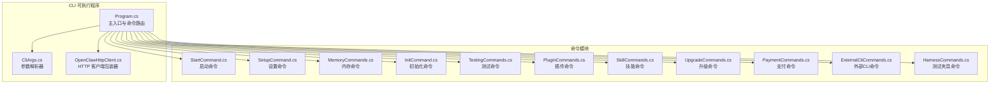
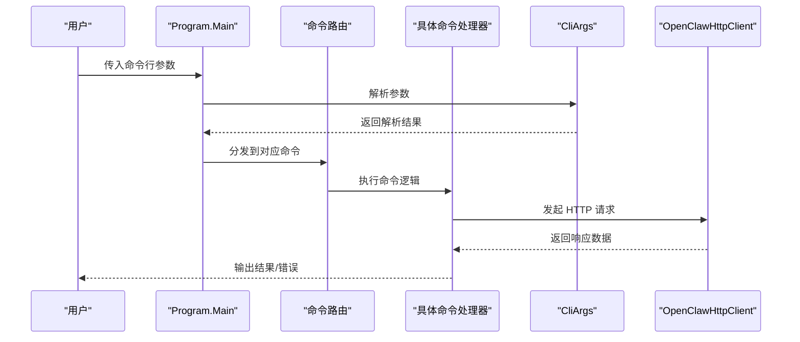
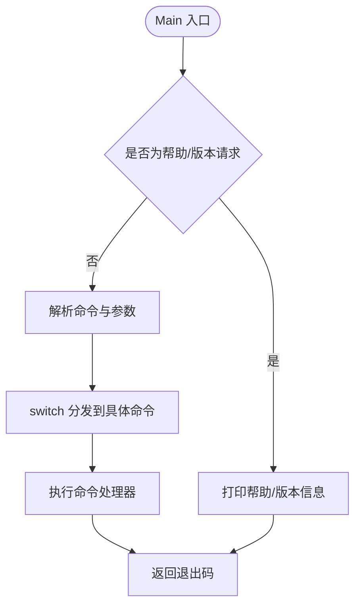
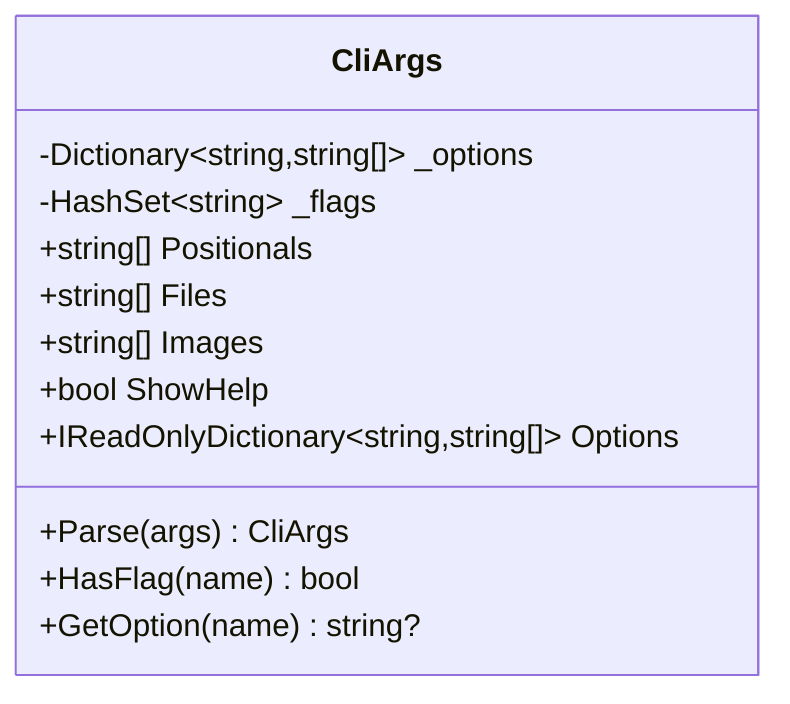
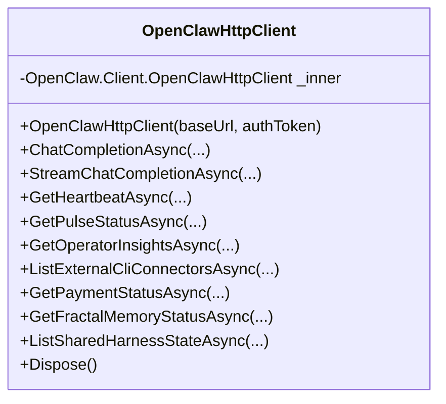
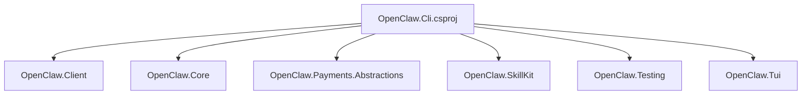

# CLI 架构设计

<cite>
**本文档引用的文件**
- [Program.cs](file://src/OpenClaw.Cli/Program.cs)
- [CliArgs.cs](file://src/OpenClaw.Cli/CliArgs.cs)
- [OpenClawHttpClient.cs](file://src/OpenClaw.Cli/OpenClawHttpClient.cs)
- [OpenClaw.Cli.csproj](file://src/OpenClaw.Cli/OpenClaw.Cli.csproj)
- [StartCommand.cs](file://src/OpenClaw.Cli/StartCommand.cs)
- [SetupCommand.cs](file://src/OpenClaw.Cli/SetupCommand.cs)
- [MemoryCommands.cs](file://src/OpenClaw.Cli/MemoryCommands.cs)
- [InitCommand.cs](file://src/OpenClaw.Cli/InitCommand.cs)
- [TestingCommands.cs](file://src/OpenClaw.Cli/TestingCommands.cs)
- [PluginCommands.cs](file://src/OpenClaw.Cli/PluginCommands.cs)
- [SkillCommands.cs](file://src/OpenClaw.Cli/SkillCommands.cs)
- [UpgradeCommands.cs](file://src/OpenClaw.Cli/UpgradeCommands.cs)
- [PaymentCommands.cs](file://src/OpenClaw.Cli/PaymentCommands.cs)
- [ExternalCliCommands.cs](file://src/OpenClaw.Cli/ExternalCliCommands.cs)
- [HarnessCommands.cs](file://src/OpenClaw.Cli/HarnessCommands.cs)
</cite>

## 目录
1. [简介](#简介)
2. [项目结构](#项目结构)
3. [核心组件](#核心组件)
4. [架构总览](#架构总览)
5. [详细组件分析](#详细组件分析)
6. [依赖关系分析](#依赖关系分析)
7. [性能考虑](#性能考虑)
8. [故障排除指南](#故障排除指南)
9. [结论](#结论)

## 简介
本文件面向 CLI 架构设计，系统性阐述 OpenClaw.NET 命令行工具的整体架构、命令分发机制、参数解析系统与 HTTP 客户端设计。重点覆盖 Program.cs 主入口点、命令路由逻辑、帮助系统实现与错误处理机制；文档化 CliArgs 参数解析类的设计模式、OpenClawHttpClient 的连接管理与认证令牌处理；并提供架构图表、组件交互流程与扩展点说明，辅以架构决策的技术背景、性能考量与可维护性设计原则。

## 项目结构
OpenClaw.Cli 是一个独立的可执行项目，负责命令行入口与子命令分发。其核心文件包括：
- Program.cs：主入口点与命令路由
- CliArgs.cs：轻量级参数解析器
- OpenClawHttpClient.cs：HTTP 客户端包装器
- 各类命令文件：按功能域划分（启动、设置、内存、测试、插件、技能、升级、支付、外部 CLI、测试夹具等）

**图表来源**
- [Program.cs:12-83](file://src/OpenClaw.Cli/Program.cs#L12-L83)
- [CliArgs.cs:14-73](file://src/OpenClaw.Cli/CliArgs.cs#L14-L73)
- [OpenClawHttpClient.cs:10-182](file://src/OpenClaw.Cli/OpenClawHttpClient.cs#L10-L182)

**章节来源**
- [OpenClaw.Cli.csproj:1-24](file://src/OpenClaw.Cli/OpenClaw.Cli.csproj#L1-L24)

## 核心组件

### 主入口点与命令路由（Program.cs）
- 入口函数 Main 接收命令行参数，支持帮助输出与版本查询。
- 使用 switch 表达式将第一个参数映射到具体命令处理器，涵盖 run/chat/live/tui/insights/setup/start/migrate/upgrade/maintenance/heartbeat/pulse/models/eval/accounts/backends/admin/compatibility/plugins/skill/skills/clawhub 等。
- 对未知命令返回非零退出码，并提示使用帮助。
- 统一捕获 OperationCanceledException（返回 130）与通用异常（打印错误并返回 1），保证健壮性。

**章节来源**
- [Program.cs:12-83](file://src/OpenClaw.Cli/Program.cs#L12-L83)
- [Program.cs:200-237](file://src/OpenClaw.Cli/Program.cs#L200-L237)

### 参数解析器（CliArgs.cs）
- 设计模式：单例式解析器，内部维护选项字典、标志集合与位置参数列表。
- 支持短横线选项（如 --url）、位置参数、重复出现的 --file/--image、以及 -- 标记后的剩余参数。
- 提供 HasFlag、GetOption、Parse 等便捷方法，满足大多数命令的参数读取需求。
- 通过内置标志集识别无值选项（如 --no-stream/--apply/--non-interactive 等）。

**章节来源**
- [CliArgs.cs:3-98](file://src/OpenClaw.Cli/CliArgs.cs#L3-L98)

### HTTP 客户端（OpenClawHttpClient.cs）
- 设计模式：适配器/包装器，内部持有 OpenClaw.Client.OpenClawHttpClient 实例。
- 暴露大量 API 方法（聊天、心跳、脉冲、安全态势、模型、外部 CLI、集成账户、后端会话、支付、记忆等），统一传递预设 ID、取消令牌与请求体。
- 资源释放：实现 IDisposable 并委托给内部客户端。

**章节来源**
- [OpenClawHttpClient.cs:6-182](file://src/OpenClaw.Cli/OpenClawHttpClient.cs#L6-L182)

### 命令模块概览
- 启动命令：封装配置路径解析、参数重写与启动/验证流程。
- 设置命令：引导式或非交互式生成配置、环境示例文件与后续指引。
- 内存命令：结构化记忆状态、搜索、打开、导出、最近条目、校验与索引刷新。
- 测试命令：场景初始化、回归运行、报告生成与质量门禁。
- 插件命令：从 npm/ClawHub 或本地安装、移除、列出、搜索插件。
- 技能命令：检查、安装、列出本地技能包。
- 升级命令：升级前检查、回滚快照保存与恢复。
- 支付命令：支付能力检查、资金来源列表、虚拟卡签发、机器支付执行与状态查询。
- 外部 CLI 命令：连接器清单、状态、命令列表、预览与执行。
- 测试夹具命令：回归测试、代码库映射与共享夹具状态查询。

**章节来源**
- [StartCommand.cs:5-111](file://src/OpenClaw.Cli/StartCommand.cs#L5-L111)
- [SetupCommand.cs:12-139](file://src/OpenClaw.Cli/SetupCommand.cs#L12-L139)
- [MemoryCommands.cs:7-264](file://src/OpenClaw.Cli/MemoryCommands.cs#L7-L264)
- [TestingCommands.cs:6-271](file://src/OpenClaw.Cli/TestingCommands.cs#L6-L271)
- [PluginCommands.cs:14-792](file://src/OpenClaw.Cli/PluginCommands.cs#L14-L792)
- [SkillCommands.cs:6-425](file://src/OpenClaw.Cli/SkillCommands.cs#L6-L425)
- [UpgradeCommands.cs:10-918](file://src/OpenClaw.Cli/UpgradeCommands.cs#L10-L918)
- [PaymentCommands.cs:6-206](file://src/OpenClaw.Cli/PaymentCommands.cs#L6-L206)
- [ExternalCliCommands.cs:8-269](file://src/OpenClaw.Cli/ExternalCliCommands.cs#L8-L269)
- [HarnessCommands.cs:8-450](file://src/OpenClaw.Cli/HarnessCommands.cs#L8-L450)

## 架构总览
下图展示 CLI 主入口与各命令模块之间的交互关系，以及参数解析与 HTTP 客户端在其中的作用。

**图表来源**
- [Program.cs:12-83](file://src/OpenClaw.Cli/Program.cs#L12-L83)
- [CliArgs.cs:14-73](file://src/OpenClaw.Cli/CliArgs.cs#L14-L73)
- [OpenClawHttpClient.cs:10-182](file://src/OpenClaw.Cli/OpenClawHttpClient.cs#L10-L182)

## 详细组件分析

### 主入口点与帮助系统（Program.cs）
- 帮助系统：内置多段帮助文本，覆盖 run/chat/live/tui/insights/setup/start/migrate/upgrade/maintenance/heartbeat/pulse/models/eval/accounts/backends/admin/compatibility/plugins/skill/skills/clawhub 等命令的用法与示例。
- 版本输出：通过反射读取程序集版本号并输出。
- 错误处理：捕获取消与异常，分别返回 130 与 1，确保 CLI 语义一致。

**图表来源**
- [Program.cs:12-83](file://src/OpenClaw.Cli/Program.cs#L12-L83)
- [Program.cs:85-237](file://src/OpenClaw.Cli/Program.cs#L85-L237)

**章节来源**
- [Program.cs:12-83](file://src/OpenClaw.Cli/Program.cs#L12-L83)
- [Program.cs:85-237](file://src/OpenClaw.Cli/Program.cs#L85-L237)

### 参数解析器设计（CliArgs.cs）
- 数据结构：内部使用字典存储键值对选项，集合存储标志，列表存储位置参数。
- 解析策略：顺序扫描，识别帮助标记、位置参数、标志与带值选项；遇到 --file/--image 特殊处理；-- 标记后将剩余参数全部作为位置参数。
- 查询接口：HasFlag、GetOption 返回最后出现的值；ShowHelp 标记用于触发帮助输出。

**图表来源**
- [CliArgs.cs:3-98](file://src/OpenClaw.Cli/CliArgs.cs#L3-L98)

**章节来源**
- [CliArgs.cs:3-98](file://src/OpenClaw.Cli/CliArgs.cs#L3-L98)

### HTTP 客户端包装器（OpenClawHttpClient.cs）
- 连接管理：构造时创建内部 OpenClaw.Client.OpenClawHttpClient 实例，统一承载认证与基础 URL。
- 认证令牌处理：优先使用构造参数，未提供时由上层命令解析环境变量或参数传入。
- 方法代理：覆盖大量 API 方法，透传预设 ID、取消令牌与请求体，保持调用一致性。
- 资源释放：实现 IDisposable，委托给内部实例。

**图表来源**
- [OpenClawHttpClient.cs:6-182](file://src/OpenClaw.Cli/OpenClawHttpClient.cs#L6-L182)

**章节来源**
- [OpenClawHttpClient.cs:6-182](file://src/OpenClaw.Cli/OpenClawHttpClient.cs#L6-L182)

### 启动命令（StartCommand.cs）
- 配置路径解析：根据 --config 或默认路径展开绝对路径。
- 参数重写：若未显式提供 --config，则自动注入 --config <路径>。
- 启动策略：若配置存在则直接启动并验证；否则先执行设置流程再启动。

**章节来源**
- [StartCommand.cs:5-111](file://src/OpenClaw.Cli/StartCommand.cs#L5-L111)

### 设置命令（SetupCommand.cs）
- 引导式与非交互式两种模式：根据 --non-interactive 与输入终端可用性决定。
- 配置构建：基于答案对象生成 GatewayConfig，应用后端配置（Docker/OpenSandbox/SSH）。
- 环境文件生成：生成 .env.example 与后续指引。
- 子命令：launch/service/status/verify/channel/provider/tailscale 等。

**章节来源**
- [SetupCommand.cs:12-139](file://src/OpenClaw.Cli/SetupCommand.cs#L12-L139)

### 内存命令（MemoryCommands.cs）
- 子命令：status/search/open/export/recent/validate/index refresh/handoff create。
- 参数解析：使用 CliArgs 获取 --url/--token/--json 与位置参数。
- 输出格式：支持 JSON 与人类可读文本两种输出。

**章节来源**
- [MemoryCommands.cs:7-264](file://src/OpenClaw.Cli/MemoryCommands.cs#L7-L264)

### 测试命令（TestingCommands.cs）
- 子命令：init/run/report/gates。
- 场景加载与回归：基于场景目录加载 JSON 场景，运行回归并生成报告。
- 质量门禁：根据失败级别决定退出码。

**章节来源**
- [TestingCommands.cs:6-271](file://src/OpenClaw.Cli/TestingCommands.cs#L6-L271)

### 插件命令（PluginCommands.cs）
- 安装：支持从 npm/ClawHub 或本地路径安装；支持 --dry-run 预检。
- 移除：删除扩展目录中对应插件。
- 列表：发现已安装插件并输出信任等级与声明表面。
- 搜索：调用 npm search 并解析结果。

**章节来源**
- [PluginCommands.cs:14-792](file://src/OpenClaw.Cli/PluginCommands.cs#L14-L792)

### 技能命令（SkillCommands.cs）
- 检查：解析本地或压缩包中的技能定义，输出信任度与要求摘要。
- 安装：支持 --dry-run、--managed 与 --workdir。
- 列表：枚举已安装技能并排序输出。

**章节来源**
- [SkillCommands.cs:6-425](file://src/OpenClaw.Cli/SkillCommands.cs#L6-L425)

### 升级命令（UpgradeCommands.cs）
- 升级前检查：验证配置、插件兼容性、技能兼容性、迁移影响与回滚快照。
- 回滚：恢复上次已知良好快照并重新验证。
- 结果聚合：综合多项检查得出总体状态并给出建议操作。

**章节来源**
- [UpgradeCommands.cs:10-918](file://src/OpenClaw.Cli/UpgradeCommands.cs#L10-L918)

### 支付命令（PaymentCommands.cs）
- 功能：支付能力检查、资金来源列表、虚拟卡签发、机器支付执行与状态查询。
- 环境控制：默认测试环境，需要 --yes 才允许线上支付。

**章节来源**
- [PaymentCommands.cs:6-206](file://src/OpenClaw.Cli/PaymentCommands.cs#L6-L206)

### 外部 CLI 命令（ExternalCliCommands.cs）
- 功能：连接器清单、状态、命令列表、预览与执行。
- 参数解析：支持 --param key=value 形式的键值对参数，自动判定 JSON 类型。
- 审批控制：高风险命令需 --yes 且预览指纹匹配。

**章节来源**
- [ExternalCliCommands.cs:8-269](file://src/OpenClaw.Cli/ExternalCliCommands.cs#L8-L269)

### 测试夹具命令（HarnessCommands.cs）
- 回归测试：运行回归并输出文本或 JSON 报告。
- 代码库映射：生成模块、端点、工具、通道、提供者等表面的静态映射。
- 共享夹具状态：查询列表、详情、按会话查询与冲突检测。

**章节来源**
- [HarnessCommands.cs:8-450](file://src/OpenClaw.Cli/HarnessCommands.cs#L8-L450)

## 依赖关系分析
- 项目引用：OpenClaw.Cli 依赖 OpenClaw.Client、OpenClaw.Core、Payments 抽象、SkillKit、Testing、Tui 等项目，形成清晰的分层与职责分离。
- 运行时特性：启用 AOT 发布、裁剪符号、优化体积，适合 CLI 工具分发。

**图表来源**
- [OpenClaw.Cli.csproj:14-21](file://src/OpenClaw.Cli/OpenClaw.Cli.csproj#L14-L21)

**章节来源**
- [OpenClaw.Cli.csproj:1-24](file://src/OpenClaw.Cli/OpenClaw.Cli.csproj#L1-L24)

## 性能考虑
- AOT 发布与体积优化：启用 PublishAot、StripSymbols、OptimizationPreference=Size，降低启动时间与二进制大小，适合 CLI 工具分发。
- I/O 与网络：命令模块普遍采用异步 I/O 与 HttpClient，避免阻塞；部分命令（如 tar/npm）依赖外部进程，注意超时与资源清理。
- 参数解析：CliArgs 使用简单线性扫描，时间复杂度 O(n)，空间复杂度 O(k)（k 为不同选项数量），满足 CLI 场景需求。
- HTTP 客户端：复用内部实例，减少连接开销；流式响应（如聊天）按需输出，避免一次性缓冲大文本。

[本节为通用指导，无需特定文件引用]

## 故障排除指南
- 帮助与版本：使用 --help/-h 或 --version/-v 快速确认命令与版本。
- 未知命令：当命令不在路由表中时，返回退出码 2 并提示使用帮助。
- 参数缺失：CliArgs 在缺少值时抛出异常，命令应捕获并提示正确用法。
- HTTP 错误：外部命令（如 harness/state）对 404 进行特殊处理，其余 HTTP 异常直接输出错误消息。
- 取消与异常：Ctrl+C 导致 OperationCanceledException 返回 130；其他异常返回 1 并输出错误信息。

**章节来源**
- [Program.cs:60-69](file://src/OpenClaw.Cli/Program.cs#L60-L69)
- [HarnessCommands.cs:183-192](file://src/OpenClaw.Cli/HarnessCommands.cs#L183-L192)

## 结论
OpenClaw.Cli 采用“主入口 + 轻量参数解析 + 命令模块化”的架构设计，具备良好的可扩展性与可维护性。通过统一的 HTTP 客户端包装器与清晰的命令边界，CLI 能够稳定地对接网关 API 并提供丰富的功能域支持。AOT 发布与体积优化进一步提升了 CLI 的部署效率与用户体验。未来可在以下方面持续演进：
- 命令注册与工厂模式：将命令注册抽象为接口，便于动态扩展。
- 参数解析增强：引入类型安全的参数绑定与验证链。
- HTTP 客户端中间件：统一鉴权、重试、日志与指标采集。
- 命令测试：为每个命令编写单元测试与集成测试，提升稳定性。