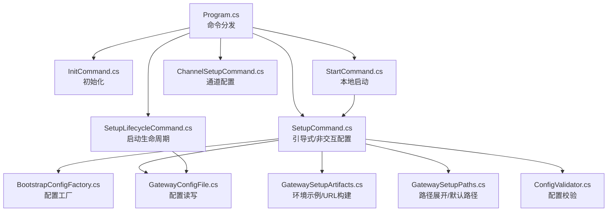
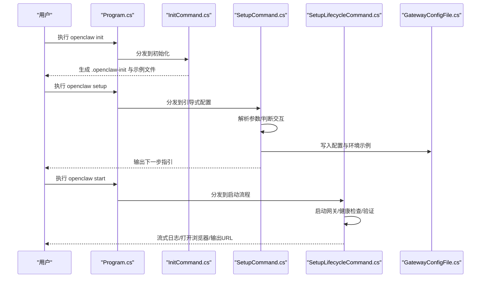
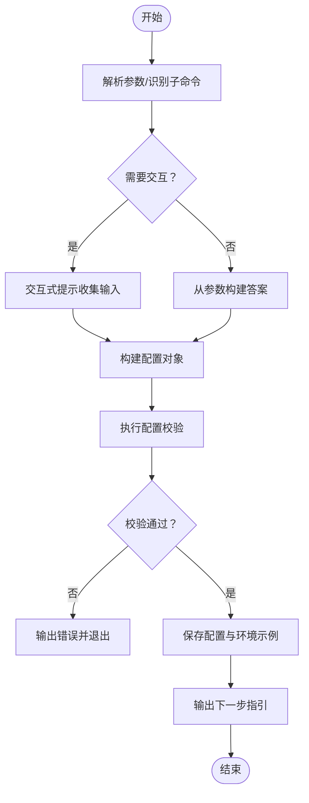
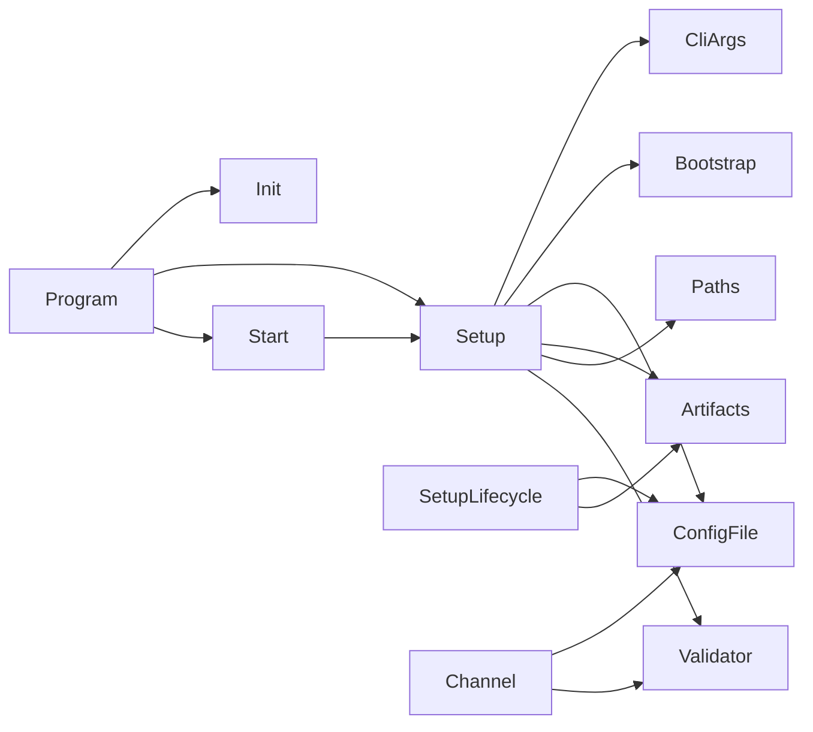

# 初始化和配置命令

<cite>
**本文档引用的文件**
- [Program.cs](file://src/OpenClaw.Cli/Program.cs)
- [InitCommand.cs](file://src/OpenClaw.Cli/InitCommand.cs)
- [SetupCommand.cs](file://src/OpenClaw.Cli/SetupCommand.cs)
- [StartCommand.cs](file://src/OpenClaw.Cli/StartCommand.cs)
- [SetupLifecycleCommand.cs](file://src/OpenClaw.Cli/SetupLifecycleCommand.cs)
- [ChannelSetupCommand.cs](file://src/OpenClaw.Cli/ChannelSetupCommand.cs)
- [CliArgs.cs](file://src/OpenClaw.Cli/CliArgs.cs)
- [BootstrapConfigFactory.cs](file://src/OpenClaw.Cli/BootstrapConfigFactory.cs)
- [GatewayConfig.cs](file://src/OpenClaw.Core/Models/GatewayConfig.cs)
- [GatewayConfigFile.cs](file://src/OpenClaw.Core/Setup/GatewayConfigFile.cs)
- [GatewaySetupArtifacts.cs](file://src/OpenClaw.Core/Setup/GatewaySetupArtifacts.cs)
- [GatewaySetupPaths.cs](file://src/OpenClaw.Core/Setup/GatewaySetupPaths.cs)
- [ConfigValidator.cs](file://src/OpenClaw.Core/Validation/ConfigValidator.cs)
</cite>

## 目录
1. [简介](#简介)
2. [项目结构](#项目结构)
3. [核心组件](#核心组件)
4. [架构总览](#架构总览)
5. [详细组件分析](#详细组件分析)
6. [依赖关系分析](#依赖关系分析)
7. [性能考虑](#性能考虑)
8. [故障排除指南](#故障排除指南)
9. [结论](#结论)
10. [附录](#附录)

## 简介
本指南聚焦于 OpenClaw.NET 的初始化与配置命令，系统性讲解以下内容：
- 初始化命令 openclaw init：生成引导文件与示例配置
- 配置命令 openclaw setup：引导式与非交互式配置、服务安装、通道配置、提供商设置
- 启动命令 openclaw start：一键启动与验证
- 关键参数详解：--profile、--non-interactive、--config、--workspace、--provider、--model 等
- 配置文件结构、环境变量使用、验证流程
- 常见场景最佳实践与故障排除

## 项目结构
OpenClaw.Cli 提供统一入口，各子命令按职责拆分：
- Program.cs：命令分发与帮助输出
- InitCommand.cs：生成初始化目录与示例文件
- SetupCommand.cs：引导式/非交互式配置、构建配置、写入配置与环境示例
- StartCommand.cs：本地启动入口，自动处理缺失配置时的引导
- SetupLifecycleCommand.cs：启动生命周期（启动网关、健康检查、验证、服务部署产物）
- ChannelSetupCommand.cs：通道配置（Telegram、Slack、Discord、Teams、WhatsApp）
- CliArgs.cs：通用参数解析
- BootstrapConfigFactory.cs：配置工厂桥接
- GatewayConfig*.cs：配置模型、文件读写、路径与环境工具
- ConfigValidator.cs：配置校验规则

图表来源
- [Program.cs:12-70](file://src/OpenClaw.Cli/Program.cs#L12-L70)
- [InitCommand.cs:9-72](file://src/OpenClaw.Cli/InitCommand.cs#L9-L72)
- [SetupCommand.cs:22-139](file://src/OpenClaw.Cli/SetupCommand.cs#L22-L139)
- [StartCommand.cs:9-47](file://src/OpenClaw.Cli/StartCommand.cs#L9-L47)
- [SetupLifecycleCommand.cs:102-218](file://src/OpenClaw.Cli/SetupLifecycleCommand.cs#L102-L218)
- [ChannelSetupCommand.cs:8-104](file://src/OpenClaw.Cli/ChannelSetupCommand.cs#L8-L104)
- [BootstrapConfigFactory.cs:8-33](file://src/OpenClaw.Cli/BootstrapConfigFactory.cs#L8-L33)
- [GatewayConfigFile.cs:9-43](file://src/OpenClaw.Core/Setup/GatewayConfigFile.cs#L9-L43)
- [GatewaySetupArtifacts.cs:7-49](file://src/OpenClaw.Core/Setup/GatewaySetupArtifacts.cs#L7-L49)
- [GatewaySetupPaths.cs:5-31](file://src/OpenClaw.Core/Setup/GatewaySetupPaths.cs#L5-L31)
- [ConfigValidator.cs:35-76](file://src/OpenClaw.Core/Validation/ConfigValidator.cs#L35-L76)

章节来源
- [Program.cs:85-396](file://src/OpenClaw.Cli/Program.cs#L85-L396)
- [InitCommand.cs:9-160](file://src/OpenClaw.Cli/InitCommand.cs#L9-L160)
- [SetupCommand.cs:22-139](file://src/OpenClaw.Cli/SetupCommand.cs#L22-L139)
- [StartCommand.cs:9-111](file://src/OpenClaw.Cli/StartCommand.cs#L9-L111)
- [SetupLifecycleCommand.cs:102-218](file://src/OpenClaw.Cli/SetupLifecycleCommand.cs#L102-L218)
- [ChannelSetupCommand.cs:8-288](file://src/OpenClaw.Cli/ChannelSetupCommand.cs#L8-L288)
- [CliArgs.cs:14-97](file://src/OpenClaw.Cli/CliArgs.cs#L14-L97)
- [BootstrapConfigFactory.cs:8-36](file://src/OpenClaw.Cli/BootstrapConfigFactory.cs#L8-L36)
- [GatewayConfig.cs:9-79](file://src/OpenClaw.Core/Models/GatewayConfig.cs#L9-L79)
- [GatewayConfigFile.cs:9-43](file://src/OpenClaw.Core/Setup/GatewayConfigFile.cs#L9-L43)
- [GatewaySetupArtifacts.cs:7-50](file://src/OpenClaw.Core/Setup/GatewaySetupArtifacts.cs#L7-L50)
- [GatewaySetupPaths.cs:5-31](file://src/OpenClaw.Core/Setup/GatewaySetupPaths.cs#L5-L31)
- [ConfigValidator.cs:35-76](file://src/OpenClaw.Core/Validation/ConfigValidator.cs#L35-L76)

## 核心组件
- 命令分发与帮助：Program.cs 统一注册命令与帮助输出，覆盖 setup、start、init 等
- 初始化：InitCommand 生成 .openclaw-init 目录、工作区、内存目录、示例环境文件与可选公共配置与部署样例
- 引导式配置：SetupCommand 解析参数、决定是否需要交互、构建配置、执行校验、写入配置与环境示例
- 启动流程：StartCommand 在无配置时触发 Setup，随后调用 SetupLifecycleCommand 启动网关、健康检查、验证与日志流
- 通道配置：ChannelSetupCommand 支持多平台通道，更新现有外部配置并进行二次校验
- 配置模型与工具：GatewayConfig 定义完整配置结构；GatewayConfigFile 负责读写；GatewaySetupArtifacts 构建环境示例与可达 URL；GatewaySetupPaths 处理路径展开与默认路径
- 校验规则：ConfigValidator 对端口、LLM、内存、会话、WebSocket、工具、沙箱等进行严格校验

章节来源
- [Program.cs:25-58](file://src/OpenClaw.Cli/Program.cs#L25-L58)
- [InitCommand.cs:9-72](file://src/OpenClaw.Cli/InitCommand.cs#L9-L72)
- [SetupCommand.cs:54-139](file://src/OpenClaw.Cli/SetupCommand.cs#L54-L139)
- [StartCommand.cs:18-47](file://src/OpenClaw.Cli/StartCommand.cs#L18-L47)
- [SetupLifecycleCommand.cs:102-218](file://src/OpenClaw.Cli/SetupLifecycleCommand.cs#L102-L218)
- [ChannelSetupCommand.cs:8-104](file://src/OpenClaw.Cli/ChannelSetupCommand.cs#L8-L104)
- [GatewayConfig.cs:9-79](file://src/OpenClaw.Core/Models/GatewayConfig.cs#L9-L79)
- [GatewayConfigFile.cs:9-43](file://src/OpenClaw.Core/Setup/GatewayConfigFile.cs#L9-L43)
- [GatewaySetupArtifacts.cs:7-50](file://src/OpenClaw.Core/Setup/GatewaySetupArtifacts.cs#L7-L50)
- [GatewaySetupPaths.cs:5-31](file://src/OpenClaw.Core/Setup/GatewaySetupPaths.cs#L5-L31)
- [ConfigValidator.cs:35-76](file://src/OpenClaw.Core/Validation/ConfigValidator.cs#L35-L76)

## 架构总览
下图展示 openclaw init、setup、start 的整体流程与交互：

图表来源
- [Program.cs:25-58](file://src/OpenClaw.Cli/Program.cs#L25-L58)
- [InitCommand.cs:9-72](file://src/OpenClaw.Cli/InitCommand.cs#L9-L72)
- [SetupCommand.cs:54-139](file://src/OpenClaw.Cli/SetupCommand.cs#L54-L139)
- [SetupLifecycleCommand.cs:102-218](file://src/OpenClaw.Cli/SetupLifecycleCommand.cs#L102-L218)
- [GatewayConfigFile.cs:26-43](file://src/OpenClaw.Core/Setup/GatewayConfigFile.cs#L26-L43)

## 详细组件分析

### 初始化命令 openclaw init
- 功能概述
  - 生成初始化目录（默认 ./.openclaw-init），包含 workspace、memory、deploy 子目录
  - 生成示例环境文件 .env.example，包含占位符与建议的 OPENCLAW_WORKSPACE
  - 可选生成本地/公共配置与部署样例（如 Caddyfile、docker-compose.override.sample）
- 关键参数
  - --preset：选择生成模板（local|public|both）
  - --output：指定输出目录
  - --force：强制覆盖非空输出目录
- 输出示例
  - 控制台打印生成路径与文件清单
- 典型用途
  - 快速搭建开发环境，准备 workspace 与 memory 目录
  - 生成公共部署样例以便后续容器化或反向代理

章节来源
- [InitCommand.cs:9-72](file://src/OpenClaw.Cli/InitCommand.cs#L9-L72)
- [InitCommand.cs:95-160](file://src/OpenClaw.Cli/InitCommand.cs#L95-L160)

### 配置命令 openclaw setup
- 功能概述
  - 引导式配置：在缺少必要输入时提示交互式输入
  - 非交互式配置：通过 --non-interactive 与显式参数完成自动化
  - 构建 GatewayConfig，执行 ConfigValidator 校验，写入配置文件与环境示例
  - 支持子命令：launch、service、status、verify、channel、provider、tailscale
- 关键参数
  - --profile：部署配置（local|public|tailscale-serve）
  - --non-interactive：禁止交互，要求所有必填项以参数形式提供
  - --config：目标配置文件路径（默认 ~/.openclaw/config/openclaw.settings.json）
  - --workspace：工作区路径
  - --provider：大模型提供商（如 openai、ollama、embedded、aperture 等）
  - --model：模型标识
  - --model-preset：模型预设（如 ollama-general）
  - --api-key：API 密钥或 env: 变量引用
  - --bind/--port：绑定地址与端口
  - --auth-token：认证令牌
  - --docker-image/--opensandbox-endpoint/--ssh-host 等：执行后端配置
- 交互逻辑
  - 若缺少必要参数且可交互，则逐项提示
  - 若缺少必要参数且不可交互，则报错并退出
- 输出
  - 成功时输出配置路径、工作区、提供商/模型、绑定地址与验证结果，并给出后续命令指引

图表来源
- [SetupCommand.cs:54-139](file://src/OpenClaw.Cli/SetupCommand.cs#L54-L139)
- [ConfigValidator.cs:35-76](file://src/OpenClaw.Core/Validation/ConfigValidator.cs#L35-L76)
- [GatewayConfigFile.cs:26-43](file://src/OpenClaw.Core/Setup/GatewayConfigFile.cs#L26-L43)

章节来源
- [SetupCommand.cs:22-139](file://src/OpenClaw.Cli/SetupCommand.cs#L22-L139)
- [CliArgs.cs:14-97](file://src/OpenClaw.Cli/CliArgs.cs#L14-L97)
- [BootstrapConfigFactory.cs:8-36](file://src/OpenClaw.Cli/BootstrapConfigFactory.cs#L8-L36)
- [GatewaySetupPaths.cs:5-31](file://src/OpenClaw.Core/Setup/GatewaySetupPaths.cs#L5-L31)
- [GatewaySetupArtifacts.cs:7-18](file://src/OpenClaw.Core/Setup/GatewaySetupArtifacts.cs#L7-L18)
- [ConfigValidator.cs:35-76](file://src/OpenClaw.Core/Validation/ConfigValidator.cs#L35-L76)

### 启动命令 openclaw start
- 功能概述
  - 作为本地主要入口：若配置存在则直接启动并验证；若不存在则先运行 setup 再启动
  - 支持 --with-companion、--open-browser、--skip-verify、--offline、--require-provider 等选项
- 行为细节
  - 自动解析 --config 并确保传给启动流程
  - 无配置时触发 SetupCommand.RunWithResultAsync，成功后再启动
  - 启动后输出可达 URL、认证方式与后续操作指引

章节来源
- [StartCommand.cs:9-111](file://src/OpenClaw.Cli/StartCommand.cs#L9-L111)
- [SetupLifecycleCommand.cs:102-218](file://src/OpenClaw.Cli/SetupLifecycleCommand.cs#L102-L218)

### 通道配置 openclaw setup channel
- 支持通道
  - telegram、slack、discord、teams、whatsapp
- 参数要点
  - --config：外部配置文件路径
  - --non-interactive：必须显式提供所需参数
  - 各通道特定参数（如机器人令牌、签名密钥、应用 ID、桥接 URL 等）
- 流程
  - 加载现有配置 → 更新对应通道配置 → 二次校验 → 保存配置 → 输出下一步指引与 Webhook 提示

章节来源
- [ChannelSetupCommand.cs:8-104](file://src/OpenClaw.Cli/ChannelSetupCommand.cs#L8-L104)
- [ChannelSetupCommand.cs:106-173](file://src/OpenClaw.Cli/ChannelSetupCommand.cs#L106-L173)

### 配置文件结构与环境变量
- 配置文件结构
  - 顶层包含 OpenClaw 节点，内部为 GatewayConfig 对象
  - 包含 LLM、内存、工具、沙箱、执行后端、通道、插件、技能、部署等子配置
- 环境变量
  - OPENCLAW_BASE_URL：基础 URL（优先级高于命令行 --url）
  - OPENCLAW_AUTH_TOKEN：认证令牌（优先级高于命令行 --token）
  - OPENCLAW_WORKSPACE：工作区路径
  - MODEL_PROVIDER_KEY 或自定义 env:*：提供商密钥引用
- 默认路径
  - 配置文件默认路径：~/.openclaw/config/openclaw.settings.json
  - 路径支持 ~ 展开与引号包裹（必要时）

章节来源
- [GatewayConfigFile.cs:9-43](file://src/OpenClaw.Core/Setup/GatewayConfigFile.cs#L9-L43)
- [GatewaySetupArtifacts.cs:7-18](file://src/OpenClaw.Core/Setup/GatewaySetupArtifacts.cs#L7-L18)
- [GatewaySetupPaths.cs:5-31](file://src/OpenClaw.Core/Setup/GatewaySetupPaths.cs#L5-L31)
- [Program.cs:490-491](file://src/OpenClaw.Cli/Program.cs#L490-L491)

## 依赖关系分析
- 模块耦合
  - Program.cs 仅负责分发，低耦合
  - SetupCommand 依赖 CliArgs、BootstrapConfigFactory、GatewayConfigFile、GatewaySetupArtifacts、GatewaySetupPaths、ConfigValidator
  - SetupLifecycleCommand 依赖 GatewayConfigFile、GatewaySetupArtifacts、路径解析与进程管理
  - ChannelSetupCommand 依赖 GatewayConfigFile 与 ConfigValidator
- 外部依赖
  - JSON 序列化/反序列化用于配置读写
  - 进程启动与健康检查用于启动流程
  - 文件系统用于生成初始化目录与部署产物

图表来源
- [Program.cs:25-58](file://src/OpenClaw.Cli/Program.cs#L25-L58)
- [SetupCommand.cs:54-139](file://src/OpenClaw.Cli/SetupCommand.cs#L54-L139)
- [StartCommand.cs:18-47](file://src/OpenClaw.Cli/StartCommand.cs#L18-L47)
- [SetupLifecycleCommand.cs:102-218](file://src/OpenClaw.Cli/SetupLifecycleCommand.cs#L102-L218)
- [ChannelSetupCommand.cs:8-104](file://src/OpenClaw.Cli/ChannelSetupCommand.cs#L8-L104)
- [CliArgs.cs:14-97](file://src/OpenClaw.Cli/CliArgs.cs#L14-L97)
- [BootstrapConfigFactory.cs:8-36](file://src/OpenClaw.Cli/BootstrapConfigFactory.cs#L8-L36)
- [GatewayConfigFile.cs:9-43](file://src/OpenClaw.Core/Setup/GatewayConfigFile.cs#L9-L43)
- [GatewaySetupArtifacts.cs:7-50](file://src/OpenClaw.Core/Setup/GatewaySetupArtifacts.cs#L7-L50)
- [GatewaySetupPaths.cs:5-31](file://src/OpenClaw.Core/Setup/GatewaySetupPaths.cs#L5-L31)
- [ConfigValidator.cs:35-76](file://src/OpenClaw.Core/Validation/ConfigValidator.cs#L35-L76)

章节来源
- [Program.cs:25-58](file://src/OpenClaw.Cli/Program.cs#L25-L58)
- [SetupCommand.cs:54-139](file://src/OpenClaw.Cli/SetupCommand.cs#L54-L139)
- [StartCommand.cs:18-47](file://src/OpenClaw.Cli/StartCommand.cs#L18-L47)
- [SetupLifecycleCommand.cs:102-218](file://src/OpenClaw.Cli/SetupLifecycleCommand.cs#L102-L218)
- [ChannelSetupCommand.cs:8-104](file://src/OpenClaw.Cli/ChannelSetupCommand.cs#L8-L104)

## 性能考虑
- 启动验证与健康检查
  - 启动后进行健康检查与验证，避免无效启动带来的资源浪费
- 配置校验
  - 在写入前执行严格校验，减少运行期错误与重试成本
- 进程管理
  - 启动流程中对进程输出进行流式处理，便于快速定位问题

## 故障排除指南
- 常见错误与解决
  - 缺少必要参数且不可交互：使用 --non-interactive 并显式提供 --profile、--workspace、--provider、--model、--api-key 等
  - 配置校验失败：根据错误列表修正端口、模型、提供商、内存路径、工具根路径等
  - 通道配置失败：确认 --config 指向有效配置，且通道参数完整
  - 启动超时：检查绑定地址与端口、反向代理、防火墙与认证设置
- 建议步骤
  - 使用 openclaw setup verify 检查配置
  - 使用 openclaw setup status 查看部署状态与建议
  - 使用 openclaw setup service 生成 systemd/launchd/Caddy 部署产物
  - 使用 openclaw setup tailscale serve 获取私有网络暴露指导

章节来源
- [SetupCommand.cs:79-86](file://src/OpenClaw.Cli/SetupCommand.cs#L79-L86)
- [SetupLifecycleCommand.cs:148-164](file://src/OpenClaw.Cli/SetupLifecycleCommand.cs#L148-L164)
- [ConfigValidator.cs:35-76](file://src/OpenClaw.Core/Validation/ConfigValidator.cs#L35-L76)

## 结论
openclaw init、setup、start 提供了从零到一的完整配置与启动体验。通过明确的参数体系、严格的配置校验与丰富的部署产物生成能力，用户可在本地或生产环境中快速建立安全、可维护的运行环境。建议在自动化场景中使用 --non-interactive 与显式参数，在生产环境结合反向代理与认证策略。

## 附录

### 命令参数速查表
- openclaw init
  - --preset：local|public|both
  - --output：输出目录
  - --force：强制覆盖
- openclaw setup
  - --profile：local|public|tailscale-serve
  - --non-interactive：禁用交互
  - --config：配置文件路径
  - --workspace：工作区路径
  - --provider：提供商
  - --model：模型标识
  - --model-preset：模型预设
  - --api-key：密钥或 env: 引用
  - --bind/--port：绑定地址与端口
  - --auth-token：认证令牌
  - --docker-image/--opensandbox-endpoint/--ssh-host 等：执行后端
- openclaw start
  - --config：配置文件路径
  - --with-companion：同时启动 Companion
  - --open-browser：启动后打开浏览器
  - --skip-verify：跳过验证
  - --offline：离线验证
  - --require-provider：要求提供商可用
  - --profile/--non-interactive/--workspace/--provider/--model 等：透传 setup 参数

章节来源
- [Program.cs:85-396](file://src/OpenClaw.Cli/Program.cs#L85-L396)
- [InitCommand.cs:74-87](file://src/OpenClaw.Cli/InitCommand.cs#L74-L87)
- [SetupCommand.cs:141-156](file://src/OpenClaw.Cli/SetupCommand.cs#L141-L156)
- [StartCommand.cs:49-68](file://src/OpenClaw.Cli/StartCommand.cs#L49-L68)