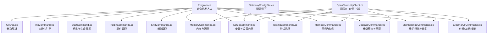
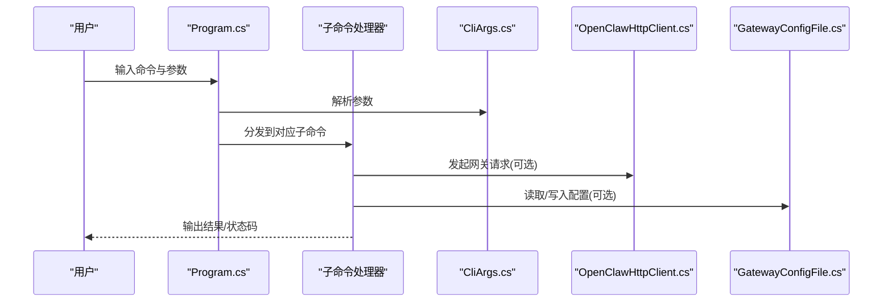
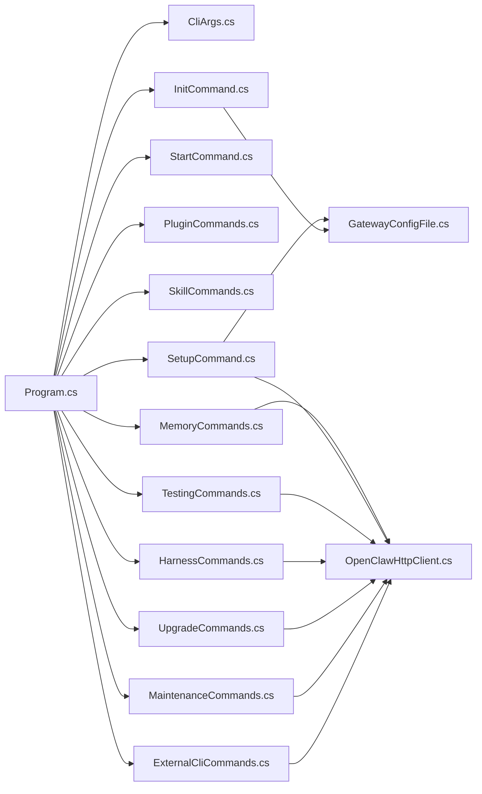

# 命令行工具

<cite>
**本文引用的文件**
- [Program.cs](file://src/OpenClaw.Cli/Program.cs)
- [CliArgs.cs](file://src/OpenClaw.Cli/CliArgs.cs)
- [InitCommand.cs](file://src/OpenClaw.Cli/InitCommand.cs)
- [StartCommand.cs](file://src/OpenClaw.Cli/StartCommand.cs)
- [PluginCommands.cs](file://src/OpenClaw.Cli/PluginCommands.cs)
- [SkillCommands.cs](file://src/OpenClaw.Cli/SkillCommands.cs)
- [MemoryCommands.cs](file://src/OpenClaw.Cli/MemoryCommands.cs)
- [GatewayConfigFile.cs](file://src/OpenClaw.Cli/GatewayConfigFile.cs)
- [OpenClawHttpClient.cs](file://src/OpenClaw.Cli/OpenClawHttpClient.cs)
- [SetupCommand.cs](file://src/OpenClaw.Cli/SetupCommand.cs)
- [TestingCommands.cs](file://src/OpenClaw.Cli/TestingCommands.cs)
- [HarnessCommands.cs](file://src/OpenClaw.Cli/HarnessCommands.cs)
- [UpgradeCommands.cs](file://src/OpenClaw.Cli/UpgradeCommands.cs)
- [MaintenanceCommands.cs](file://src/OpenClaw.Cli/MaintenanceCommands.cs)
- [ExternalCliCommands.cs](file://src/OpenClaw.Cli/ExternalCliCommands.cs)
</cite>

## 目录
1. [简介](#简介)
2. [项目结构](#项目结构)
3. [核心组件](#核心组件)
4. [架构总览](#架构总览)
5. [详细组件分析](#详细组件分析)
6. [依赖关系分析](#依赖关系分析)
7. [性能考虑](#性能考虑)
8. [故障排除指南](#故障排除指南)
9. [结论](#结论)
10. [附录](#附录)

## 简介
本文件为 OpenClaw.NET 命令行工具（openclaw）的全面技术文档，覆盖 CLI 架构设计、命令实现、配置管理与使用示例。重点说明以下方面：
- 聊天交互（run、chat、live、tui）
- 初始化与引导（init）
- 启动与生命周期（start、setup、upgrade、maintenance）
- 技能管理（skills、skill）
- 插件操作（plugins）
- 外部 CLI 连接器（external）
- 内存与洞察（memory、insights）
- 测试与回归（test、harness）
- 与网关服务的通信机制、认证方式、错误处理
- 常用使用场景、批处理脚本与自动化集成
- 命令参考手册、最佳实践与故障排除

## 项目结构
openclaw CLI 采用“主入口分发 + 子命令模块化”的组织方式：
- 主入口 Program.cs 解析命令与参数，分发到各子命令处理器
- 子命令按功能域拆分：InitCommand、StartCommand、PluginCommands、SkillCommands、MemoryCommands、SetupCommand、TestingCommands、HarnessCommands、UpgradeCommands、MaintenanceCommands、ExternalCliCommands
- 通用解析器 CliArgs.cs 提供统一的参数解析能力
- 配置读写通过 GatewayConfigFile.cs 封装
- 与网关通信封装在 OpenClawHttpClient.cs 中

图表来源
- [Program.cs:1-2129](file://src/OpenClaw.Cli/Program.cs#L1-L2129)
- [CliArgs.cs:1-98](file://src/OpenClaw.Cli/CliArgs.cs#L1-L98)
- [InitCommand.cs:1-160](file://src/OpenClaw.Cli/InitCommand.cs#L1-L160)
- [StartCommand.cs:1-111](file://src/OpenClaw.Cli/StartCommand.cs#L1-L111)
- [PluginCommands.cs:1-792](file://src/OpenClaw.Cli/PluginCommands.cs#L1-L792)
- [SkillCommands.cs:1-425](file://src/OpenClaw.Cli/SkillCommands.cs#L1-L425)
- [MemoryCommands.cs:1-264](file://src/OpenClaw.Cli/MemoryCommands.cs#L1-L264)
- [GatewayConfigFile.cs:1-19](file://src/OpenClaw.Cli/GatewayConfigFile.cs#L1-L19)
- [OpenClawHttpClient.cs:1-184](file://src/OpenClaw.Cli/OpenClawHttpClient.cs#L1-L184)
- [SetupCommand.cs:1-930](file://src/OpenClaw.Cli/SetupCommand.cs#L1-L930)
- [TestingCommands.cs:1-271](file://src/OpenClaw.Cli/TestingCommands.cs#L1-L271)
- [HarnessCommands.cs:1-450](file://src/OpenClaw.Cli/HarnessCommands.cs#L1-L450)
- [UpgradeCommands.cs:1-918](file://src/OpenClaw.Cli/UpgradeCommands.cs#L1-L918)
- [MaintenanceCommands.cs:1-113](file://src/OpenClaw.Cli/MaintenanceCommands.cs#L1-L113)
- [ExternalCliCommands.cs:1-269](file://src/OpenClaw.Cli/ExternalCliCommands.cs#L1-L269)

章节来源
- [Program.cs:1-2129](file://src/OpenClaw.Cli/Program.cs#L1-L2129)
- [CliArgs.cs:1-98](file://src/OpenClaw.Cli/CliArgs.cs#L1-L98)

## 核心组件
- 命令分发与帮助系统：Program.cs 统一解析命令、参数与帮助输出，支持版本查询、未知命令提示与异常捕获
- 参数解析器：CliArgs.cs 支持位置参数、选项、标志位、重复值与 -- 分隔
- 配置管理：GatewayConfigFile.cs 封装配置路径展开、加载与保存
- 网关客户端：OpenClawHttpClient.cs 对外暴露多种网关 API 的同步/异步调用封装
- 子命令模块：各功能域命令均以静态类实现 RunAsync/Run 或等价入口，并遵循统一的参数解析与帮助输出模式

章节来源
- [Program.cs:1-2129](file://src/OpenClaw.Cli/Program.cs#L1-L2129)
- [CliArgs.cs:1-98](file://src/OpenClaw.Cli/CliArgs.cs#L1-L98)
- [GatewayConfigFile.cs:1-19](file://src/OpenClaw.Cli/GatewayConfigFile.cs#L1-L19)
- [OpenClawHttpClient.cs:1-184](file://src/OpenClaw.Cli/OpenClawHttpClient.cs#L1-L184)

## 架构总览
openclaw CLI 通过 Program.cs 的命令分发，将用户输入路由到具体子命令；子命令内部：
- 使用 CliArgs 解析参数
- 通过 OpenClawHttpClient 访问网关服务（HTTP/JSON）
- 通过 GatewayConfigFile 读取/写入配置文件
- 在需要时调用 SetupCommand、StartCommand 等进行安装或启动流程

图表来源
- [Program.cs:1-2129](file://src/OpenClaw.Cli/Program.cs#L1-L2129)
- [CliArgs.cs:1-98](file://src/OpenClaw.Cli/CliArgs.cs#L1-L98)
- [OpenClawHttpClient.cs:1-184](file://src/OpenClaw.Cli/OpenClawHttpClient.cs#L1-L184)
- [GatewayConfigFile.cs:1-19](file://src/OpenClaw.Cli/GatewayConfigFile.cs#L1-L19)

## 详细组件分析

### 命令分发与帮助系统（Program.cs）
- 支持的命令包括：start、run、chat、live、tui、insights、setup、upgrade、maintenance、payment、external、memory、test、harness、regression、init、migrate、pulse、heartbeat、models、eval、accounts、backends、admin、compatibility、plugins、skill、skills、clawhub、version
- 常用选项：--url、--token、--model、--system、--preset、--file、--image、--no-stream、--temperature、--max-tokens 等
- 错误处理：捕获 OperationCanceledException 返回 130；捕获异常返回 1 并输出错误信息；未知命令返回 2

章节来源
- [Program.cs:1-2129](file://src/OpenClaw.Cli/Program.cs#L1-L2129)

### 参数解析器（CliArgs.cs）
- 支持：
  - 位置参数（非以 -- 开头）
  - 选项（--name value）
  - 标志位（--flag）
  - 重复值（如 --file、--image）
  - -- 分隔符用于透传剩余参数
- 提供 HasFlag、GetOption、Positionals 访问器

章节来源
- [CliArgs.cs:1-98](file://src/OpenClaw.Cli/CliArgs.cs#L1-L98)

### 初始化引导（InitCommand.cs）
- 功能：生成本地/公共配置模板、工作区目录、内存目录、部署样例与 .env.example
- 选项：--preset（local|public|both）、--output、--force
- 输出：生成文件清单与使用说明

章节来源
- [InitCommand.cs:1-160](file://src/OpenClaw.Cli/InitCommand.cs#L1-L160)

### 启动与生命周期（StartCommand.cs、SetupCommand.cs）
- start：优先使用现有配置启动；若无配置则进入 setup 流程后启动
- setup：交互式/非交互式引导，生成配置、环境示例文件，输出下一步建议
- 支持子命令：setup launch、setup service、setup status、setup verify、setup channel、setup provider、setup tailscale serve

章节来源
- [StartCommand.cs:1-111](file://src/OpenClaw.Cli/StartCommand.cs#L1-L111)
- [SetupCommand.cs:1-930](file://src/OpenClaw.Cli/SetupCommand.cs#L1-L930)

### 插件管理（PluginCommands.cs）
- 子命令：install、remove/uninstall、list/ls、search
- 支持从 npm/ClawHub 安装或从本地路径/压缩包安装
- 支持 --global 全局扩展目录与 --dry-run 预览安装
- 安装前进行兼容性检查与信任级别评估

章节来源
- [PluginCommands.cs:1-792](file://src/OpenClaw.Cli/PluginCommands.cs#L1-L792)

### 技能管理（SkillCommands.cs）
- 子命令：inspect、install、list/ls
- 支持从本地路径或压缩包安装技能，支持 --dry-run、--managed、--workdir
- 安装前进行技能解析与要求评估，输出信任级别与警告

章节来源
- [SkillCommands.cs:1-425](file://src/OpenClaw.Cli/SkillCommands.cs#L1-L425)

### 内存与洞察（MemoryCommands.cs）
- 子命令：memory fractal <status|search|open|export|recent|validate|index refresh|handoff create>
- 通过 OpenClawHttpClient 访问 Fractal Memory 接口，支持 JSON 文本两种输出格式
- 常用选项：--url、--token、--json、--limit、--scope、--depth、--view、--mode、--days

章节来源
- [MemoryCommands.cs:1-264](file://src/OpenClaw.Cli/MemoryCommands.cs#L1-L264)

### 外部 CLI 连接器（ExternalCliCommands.cs）
- 子命令：presets、list、status、commands、preview、execute
- 支持参数键值对传递（--param key=value），高风险/变更型命令需 --yes 确认
- 与网关的 External CLI 管理 API 交互

章节来源
- [ExternalCliCommands.cs:1-269](file://src/OpenClaw.Cli/ExternalCliCommands.cs#L1-L269)

### 测试与回归（TestingCommands.cs、HarnessCommands.cs）
- test：init、run、report、gates
- harness：test/regression、map、state list/show/session/conflicts
- 支持离线运行与严格模式，输出报告与摘要

章节来源
- [TestingCommands.cs:1-271](file://src/OpenClaw.Cli/TestingCommands.cs#L1-L271)
- [HarnessCommands.cs:1-450](file://src/OpenClaw.Cli/HarnessCommands.cs#L1-L450)

### 升级与维护（UpgradeCommands.cs、MaintenanceCommands.cs）
- upgrade：check、rollback，进行多维度预检并生成回滚快照
- maintenance：scan、fix，输出可靠性评分、存储与预算分析、漂移统计与修复建议

章节来源
- [UpgradeCommands.cs:1-918](file://src/OpenClaw.Cli/UpgradeCommands.cs#L1-L918)
- [MaintenanceCommands.cs:1-113](file://src/OpenClaw.Cli/MaintenanceCommands.cs#L1-L113)

### 聊天与实时会话（Program.cs）
- run：一次性对话，支持附件、图片、流式/非流式响应
- chat：交互式聊天，支持 /system、/model、/image 等命令
- live：Gemini Live 会话，支持音频/文本模态与中断命令
- tui：终端 UI（AOT 构建可能不可用）

章节来源
- [Program.cs:1-2129](file://src/OpenClaw.Cli/Program.cs#L1-L2129)

### 配置与环境变量（GatewayConfigFile.cs、Program.cs）
- 配置路径：~/.openclaw/config/openclaw.settings.json（可展开）
- 环境变量：
  - OPENCLAW_BASE_URL：默认网关地址
  - OPENCLAW_AUTH_TOKEN：认证令牌
  - OPENCLAW_WORKSPACE：工作区路径
- 命令行参数 --url、--token 可覆盖环境变量

章节来源
- [GatewayConfigFile.cs:1-19](file://src/OpenClaw.Cli/GatewayConfigFile.cs#L1-L19)
- [Program.cs:1-2129](file://src/OpenClaw.Cli/Program.cs#L1-L2129)

### 与网关通信机制（OpenClawHttpClient.cs）
- 封装了聊天、心跳、脉冲、安全态势、模型、外部 CLI、账户、后端、内存、共享工件箱状态、支付等 API
- 支持同步与流式响应（如聊天流式输出）
- 统一的基地址与令牌注入，便于各子命令复用

章节来源
- [OpenClawHttpClient.cs:1-184](file://src/OpenClaw.Cli/OpenClawHttpClient.cs#L1-L184)

## 依赖关系分析
- Program.cs 是全局入口，依赖所有子命令模块
- 子命令模块依赖 CliArgs.cs 进行参数解析
- 大多数子命令依赖 OpenClawHttpClient.cs 与 GatewayConfigFile.cs
- 特定子命令有额外依赖：
  - 插件与技能：依赖插件/技能解析与发现逻辑
  - 升级与维护：依赖 SetupCommand、SetupLifecycleCommand、PluginCommands、SkillCommands 等

图表来源
- [Program.cs:1-2129](file://src/OpenClaw.Cli/Program.cs#L1-L2129)
- [CliArgs.cs:1-98](file://src/OpenClaw.Cli/CliArgs.cs#L1-L98)
- [OpenClawHttpClient.cs:1-184](file://src/OpenClaw.Cli/OpenClawHttpClient.cs#L1-L184)
- [GatewayConfigFile.cs:1-19](file://src/OpenClaw.Cli/GatewayConfigFile.cs#L1-L19)
- [InitCommand.cs:1-160](file://src/OpenClaw.Cli/InitCommand.cs#L1-L160)
- [StartCommand.cs:1-111](file://src/OpenClaw.Cli/StartCommand.cs#L1-L111)
- [PluginCommands.cs:1-792](file://src/OpenClaw.Cli/PluginCommands.cs#L1-L792)
- [SkillCommands.cs:1-425](file://src/OpenClaw.Cli/SkillCommands.cs#L1-L425)
- [MemoryCommands.cs:1-264](file://src/OpenClaw.Cli/MemoryCommands.cs#L1-L264)
- [SetupCommand.cs:1-930](file://src/OpenClaw.Cli/SetupCommand.cs#L1-L930)
- [TestingCommands.cs:1-271](file://src/OpenClaw.Cli/TestingCommands.cs#L1-L271)
- [HarnessCommands.cs:1-450](file://src/OpenClaw.Cli/HarnessCommands.cs#L1-L450)
- [UpgradeCommands.cs:1-918](file://src/OpenClaw.Cli/UpgradeCommands.cs#L1-L918)
- [MaintenanceCommands.cs:1-113](file://src/OpenClaw.Cli/MaintenanceCommands.cs#L1-L113)
- [ExternalCliCommands.cs:1-269](file://src/OpenClaw.Cli/ExternalCliCommands.cs#L1-L269)

## 性能考虑
- 流式输出：run/chat/live 默认启用流式响应，减少等待时间
- 非交互批量：使用 --non-interactive 与明确参数，避免等待用户输入
- 离线检查：upgrade、harness test 支持离线模式，减少网络依赖
- 批量维护：maintenance scan/fix 支持 JSON 输出与干跑，便于自动化集成

## 故障排除指南
- 未知命令：返回 2，并提示使用 --help
- 参数缺失：抛出 ArgumentException，提示缺少必要参数
- 网络/权限问题：ExternalCliCommands、HarnessCommands、MemoryCommands 等在 HTTP 请求失败时输出错误信息
- TUI 不可用：AOT 构建下 TUI 可能不可用，提示使用非 AOT 构建或 Web UI
- 升级阻塞：upgrade check 返回失败时，先解决阻塞性问题再升级

章节来源
- [Program.cs:1-2129](file://src/OpenClaw.Cli/Program.cs#L1-L2129)
- [HarnessCommands.cs:1-450](file://src/OpenClaw.Cli/HarnessCommands.cs#L1-L450)
- [ExternalCliCommands.cs:1-269](file://src/OpenClaw.Cli/ExternalCliCommands.cs#L1-L269)
- [UpgradeCommands.cs:1-918](file://src/OpenClaw.Cli/UpgradeCommands.cs#L1-L918)

## 结论
openclaw CLI 以清晰的命令分发与模块化设计，覆盖从初始化、启动、配置管理到技能与插件治理、测试与回归、升级维护、外部 CLI 集成以及与网关的深度交互。通过统一的参数解析与 HTTP 客户端封装，既保证了易用性，也便于自动化与批处理集成。

## 附录

### 常用命令参考（节选）
- 启动与设置
  - openclaw start [--config <path>] [--with-companion] [--open-browser] ...
  - openclaw setup [--profile local|public|tailscale-serve] [--non-interactive] ...
  - openclaw init [--preset local|public|both] [--output <dir>] [--force]
- 聊天与实时
  - openclaw run "<prompt>" [--file <path>] [--image <path|url>] [--no-stream] [--temperature <n>] [--max-tokens <n>]
  - openclaw chat [--system <text>] [--model <id>] [--temperature <n>] [--max-tokens <n>]
  - openclaw live [--provider <id>] [--model <id>] [--system <text>] [--voice <name>] [--modality TEXT|AUDIO]
  - openclaw tui [--url <url>] [--token <token>]
- 技能与插件
  - openclaw skills <inspect|install|list> [--workdir <path>|--managed] [--dry-run]
  - openclaw skill <new|validate|generate|run|package|list>
  - openclaw plugins <install|remove|list|search> [--global] [--dry-run]
- 内存与洞察
  - openclaw memory fractal <status|search|open|export|recent|validate|index refresh|handoff create> [--url <url>] [--token <token>] [--json]
  - openclaw insights [--from <iso8601>] [--to <iso8601>] [--json]
- 测试与回归
  - openclaw test <init|run|report|gates> [--scenarios <path>] [--output <path>] [--fail-on high|any]
  - openclaw harness <test|regression|map|state> [--category <name>] [--json] [--offline] [--strict] [--proposal <id>] [--output <path>]
- 升级与维护
  - openclaw upgrade <check|rollback> [--config <path>] [--offline] [--require-provider]
  - openclaw maintenance <scan|fix> [--config <path>] [--json] [--dry-run] [--apply all|retention|metadata|artifacts]
- 外部 CLI
  - openclaw external <presets|list|status|commands|preview|execute> [--json] [--param key=value] [--yes] [--reason <text>]

### 环境变量与配置
- OPENCLAW_BASE_URL：网关基础地址（默认 http://127.0.0.1:18789）
- OPENCLAW_AUTH_TOKEN：认证令牌
- OPENCLAW_WORKSPACE：工作区路径
- 配置文件：~/.openclaw/config/openclaw.settings.json（可展开）

### 自动化与批处理建议
- 使用 --non-interactive 与明确参数，避免交互等待
- 使用 --json 输出便于解析
- 使用 --dry-run 预览变更（如 plugins install、skills install、maintenance fix）
- 将 OPENCLAW_BASE_URL 与 OPENCLAW_AUTH_TOKEN 注入 CI 环境变量