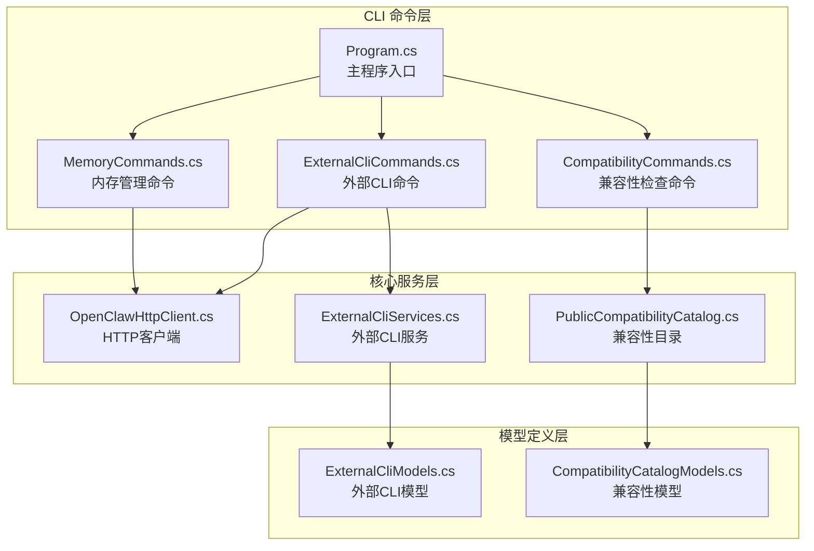
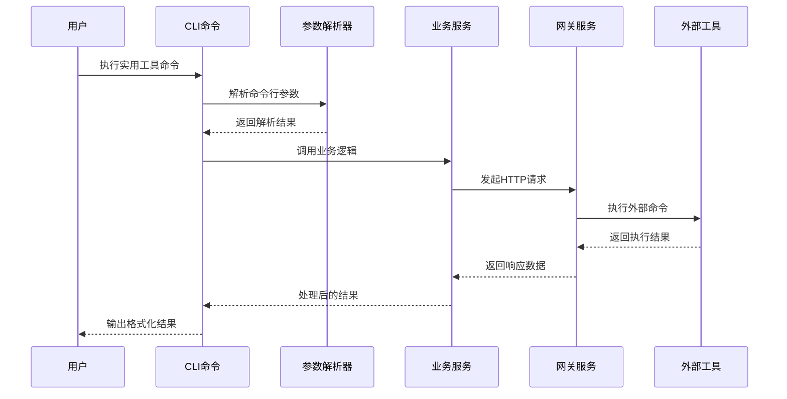
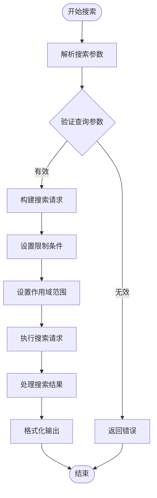
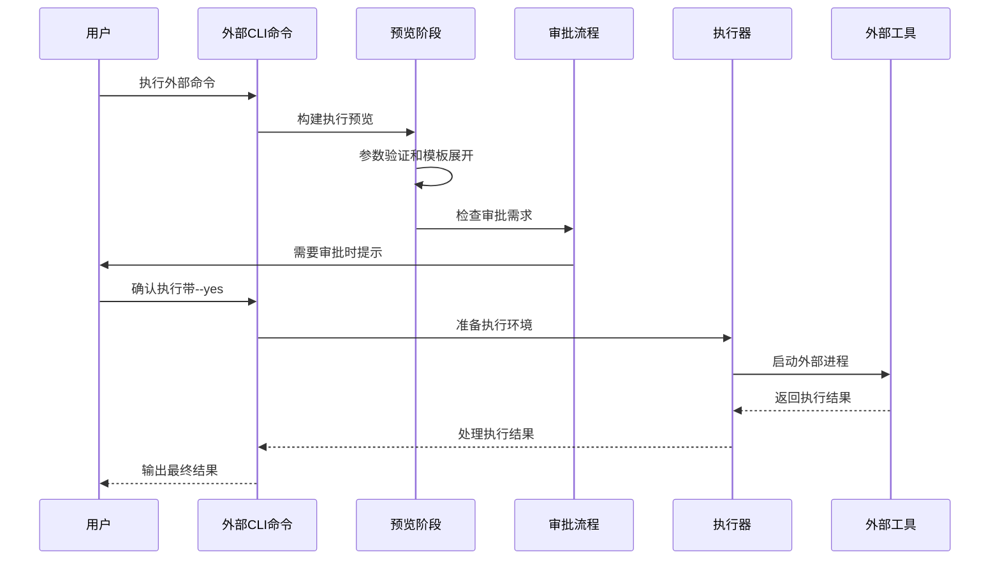
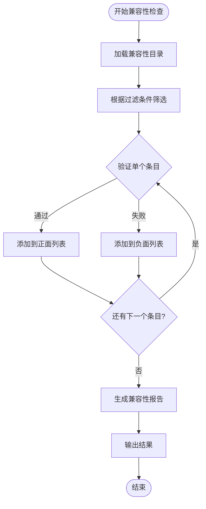
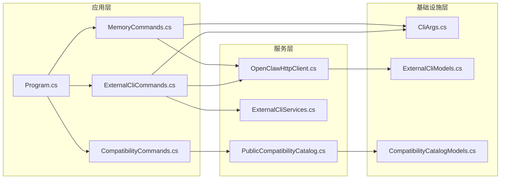

# 实用工具命令

<cite>
**本文档引用的文件**
- [Program.cs](file://src/OpenClaw.Cli/Program.cs)
- [MemoryCommands.cs](file://src/OpenClaw.Cli/MemoryCommands.cs)
- [ExternalCliCommands.cs](file://src/OpenClaw.Cli/ExternalCliCommands.cs)
- [CompatibilityCommands.cs](file://src/OpenClaw.Cli/CompatibilityCommands.cs)
- [OpenClawHttpClient.cs](file://src/OpenClaw.Cli/OpenClawHttpClient.cs)
- [CliArgs.cs](file://src/OpenClaw.Cli/CliArgs.cs)
- [ExternalCliServices.cs](file://src/OpenClaw.Core/ExternalCli/ExternalCliServices.cs)
- [ExternalCliPresetCatalog.cs](file://src/OpenClaw.Core/ExternalCli/ExternalCliPresetCatalog.cs)
- [ExternalCliModels.cs](file://src/OpenClaw.Core/Models/ExternalCliModels.cs)
- [PublicCompatibilityCatalog.cs](file://src/OpenClaw.Core/Compatibility/PublicCompatibilityCatalog.cs)
- [CompatibilityCatalogModels.cs](file://src/OpenClaw.Core/Models/CompatibilityCatalogModels.cs)
- [TOOLS_GUIDE.md](file://docs/TOOLS_GUIDE.md)
- [COMPATIBILITY.md](file://docs/COMPATIBILITY.md)
</cite>

## 目录
1. [简介](#简介)
2. [项目结构](#项目结构)
3. [核心组件](#核心组件)
4. [架构概览](#架构概览)
5. [详细组件分析](#详细组件分析)
6. [依赖关系分析](#依赖关系分析)
7. [性能考虑](#性能考虑)
8. [故障排除指南](#故障排除指南)
9. [结论](#结论)
10. [附录](#附录)

## 简介

OpenClaw.NET 提供了一套完整的实用工具命令，专注于内存管理、外部 CLI 集成和兼容性检查三大核心功能领域。这些工具命令为开发者和运维人员提供了强大的自动化能力，支持从本地开发到生产部署的全生命周期管理。

本文档深入解析 memory、external、compatibility 等辅助工具命令的功能实现机制，涵盖内存检索、外部工具桥接、版本兼容性验证等具体功能，并提供工具链集成方案、自动化脚本编写和系统集成的最佳实践指导。

## 项目结构

OpenClaw.NET 的实用工具命令主要分布在以下模块中：



**图表来源**
- [Program.cs:1-800](file://src/OpenClaw.Cli/Program.cs#L1-L800)
- [MemoryCommands.cs:1-264](file://src/OpenClaw.Cli/MemoryCommands.cs#L1-L264)
- [ExternalCliCommands.cs:1-269](file://src/OpenClaw.Cli/ExternalCliCommands.cs#L1-L269)
- [CompatibilityCommands.cs:1-107](file://src/OpenClaw.Cli/CompatibilityCommands.cs#L1-L107)

**章节来源**
- [Program.cs:1-800](file://src/OpenClaw.Cli/Program.cs#L1-L800)

## 核心组件

### 主程序入口与命令路由

主程序采用统一的命令分发机制，支持多种实用工具命令的调用：

- **memory 命令族**：提供 Fractal 内存系统的完整管理功能
- **external 命令族**：实现外部 CLI 工具的安全桥接和执行
- **compatibility 命令族**：提供版本兼容性检查和验证功能

每个命令都遵循统一的参数解析和错误处理模式，确保一致的用户体验。

**章节来源**
- [Program.cs:25-58](file://src/OpenClaw.Cli/Program.cs#L25-L58)
- [Program.cs:85-237](file://src/OpenClaw.Cli/Program.cs#L85-L237)

### 参数解析器设计

统一的参数解析器支持复杂的命令行参数处理：

- 支持位置参数和命名参数的混合使用
- 自动识别标志参数（如 --json、--yes）
- 文件和图片附件的特殊处理
- 错误参数的优雅降级处理

**章节来源**
- [CliArgs.cs:14-98](file://src/OpenClaw.Cli/CliArgs.cs#L14-L98)

## 架构概览

OpenClaw.NET 的实用工具命令采用分层架构设计，确保了良好的可维护性和扩展性：



**图表来源**
- [Program.cs:12-69](file://src/OpenClaw.Cli/Program.cs#L12-L69)
- [OpenClawHttpClient.cs:10-184](file://src/OpenClaw.Cli/OpenClawHttpClient.cs#L10-L184)

## 详细组件分析

### 内存管理命令（memory）

内存管理命令专注于 Fractal 内存系统的完整生命周期管理：

#### 核心功能特性

1. **状态查询**：实时监控内存系统的运行状态和配置信息
2. **内容检索**：基于关键词的智能搜索和内容浏览
3. **索引管理**：支持索引刷新和完整性验证
4. **导出功能**：多模式的数据导出和手稿生成

#### 命令参数详解

| 参数 | 类型 | 必需 | 描述 |
|------|------|------|------|
| --url | 字符串 | 否 | 网关服务地址，默认值为环境变量或本地回环 |
| --token | 字符串 | 否 | 认证令牌，优先使用环境变量 OPENCLAW_AUTH_TOKEN |
| --json | 标志 | 否 | 以JSON格式输出结果 |

#### 搜索功能实现



**图表来源**
- [MemoryCommands.cs:41-52](file://src/OpenClaw.Cli/MemoryCommands.cs#L41-L52)

**章节来源**
- [MemoryCommands.cs:13-107](file://src/OpenClaw.Cli/MemoryCommands.cs#L13-L107)

### 外部CLI集成命令（external）

外部CLI命令实现了安全的外部工具桥接机制，支持多种外部CLI工具的统一管理：

#### 连接器预设系统

系统内置了多个经过安全评估的连接器预设：

| 预设ID | 外部工具 | 功能范围 | 安全级别 |
|--------|----------|----------|----------|
| gh | GitHub CLI | 仓库、问题、拉取请求管理 | 中等 |
| az | Azure CLI | 账户和资源管理 | 低 |
| kubectl | Kubernetes CLI | 集群状态查看 | 低 |
| stripe | Stripe CLI | 支付处理（PII敏感） | 高 |
| lark | Lark CLI | 协作工具集成 | 中等 |
| github-copilot | GitHub Copilot CLI | AI辅助编程 | 高 |
| codex | Codex CLI | AI代理交互 | 高 |
| gemini | Gemini CLI | AI助手 | 高 |

#### 安全执行流程



**图表来源**
- [ExternalCliCommands.cs:77-106](file://src/OpenClaw.Cli/ExternalCliCommands.cs#L77-L106)
- [ExternalCliServices.cs:140-224](file://src/OpenClaw.Core/ExternalCli/ExternalCliServices.cs#L140-L224)

#### 参数处理机制

外部CLI命令支持灵活的参数传递机制：

1. **键值对参数**：通过 `--param key=value` 形式传递
2. **自动类型推断**：支持字符串、数字、布尔值的自动识别
3. **JSON格式支持**：复杂数据结构的JSON序列化处理
4. **参数验证**：基于预定义模式的严格参数验证

**章节来源**
- [ExternalCliCommands.cs:114-179](file://src/OpenClaw.Cli/ExternalCliCommands.cs#L114-L179)
- [ExternalCliServices.cs:312-367](file://src/OpenClaw.Core/ExternalCli/ExternalCliServices.cs#L312-L367)

### 兼容性检查命令（compatibility）

兼容性检查命令提供了全面的版本兼容性验证功能，确保插件和工具在目标环境中正常工作：

#### 公共兼容性目录

系统内置了经过严格测试的兼容性目录，包含以下类型的场景：

| 场景类型 | 描述 | 状态 |
|----------|------|------|
| pure-skill | 独立技能包安装验证 | 正面案例 |
| js-tool-plugin | JavaScript桥接插件加载验证 | 正面案例 |
| ts-jiti-plugin | TypeScript桥接插件（需要jiti） | 正面案例 |
| config-schema-plugin | 插件配置模式验证 | 负面案例 |
| unsupported-surface-plugin | 不支持的插件表面验证 | 负面案例 |

#### 兼容性验证流程



**图表来源**
- [CompatibilityCommands.cs:30-72](file://src/OpenClaw.Cli/CompatibilityCommands.cs#L30-L72)
- [PublicCompatibilityCatalog.cs:14-35](file://src/OpenClaw.Core/Compatibility/PublicCompatibilityCatalog.cs#L14-L35)

**章节来源**
- [CompatibilityCommands.cs:9-28](file://src/OpenClaw.Cli/CompatibilityCommands.cs#L9-L28)
- [PublicCompatibilityCatalog.cs:59-97](file://src/OpenClaw.Core/Compatibility/PublicCompatibilityCatalog.cs#L59-L97)

## 依赖关系分析

实用工具命令之间的依赖关系体现了清晰的分层架构：



**图表来源**
- [Program.cs:37-51](file://src/OpenClaw.Cli/Program.cs#L37-L51)
- [OpenClawHttpClient.cs:6-184](file://src/OpenClaw.Cli/OpenClawHttpClient.cs#L6-L184)

**章节来源**
- [Program.cs:1-800](file://src/OpenClaw.Cli/Program.cs#L1-L800)

## 性能考虑

### 内存管理优化

内存管理命令在设计时充分考虑了性能优化：

- **异步操作**：所有网络请求均采用异步模式，避免阻塞主线程
- **流式处理**：支持大文件的流式读取和处理
- **缓存策略**：合理利用HTTP缓存减少重复请求
- **超时控制**：为所有网络操作设置合理的超时时间

### 外部CLI执行优化

外部CLI命令在执行效率方面采用了多项优化措施：

- **进程池管理**：避免频繁创建和销毁进程
- **输出截断**：防止大量输出导致内存溢出
- **超时监控**：及时终止长时间运行的外部进程
- **资源清理**：确保异常情况下正确释放系统资源

### 兼容性检查优化

兼容性检查命令在处理大量数据时的性能优化：

- **延迟加载**：只在需要时加载兼容性目录数据
- **增量更新**：支持部分更新而非全量重新加载
- **并发处理**：利用多线程提高检查效率
- **结果缓存**：缓存最近的检查结果避免重复计算

## 故障排除指南

### 常见问题诊断

#### 内存管理命令故障

| 问题症状 | 可能原因 | 解决方案 |
|----------|----------|----------|
| 内存状态查询失败 | 网关服务不可达 | 检查 OPENCLAW_BASE_URL 环境变量 |
| 搜索无结果 | 查询参数不正确 | 验证 --limit 和 --scope 参数 |
| 导出失败 | 权限不足 | 检查文件系统权限和磁盘空间 |
| 索引刷新超时 | 索引过大 | 使用 --json 查看详细错误信息 |

#### 外部CLI命令故障

| 问题症状 | 可能原因 | 解决方案 |
|----------|----------|----------|
| 连接器状态显示未找到 | 外部工具未安装 | 确认外部CLI工具已正确安装 |
| 命令执行失败 | 参数验证失败 | 检查 --param 参数格式和值 |
| 需要审批 | 高风险命令 | 添加 --yes 参数并提供 --reason |
| 超时错误 | 外部工具响应慢 | 增加超时时间或优化外部工具 |

#### 兼容性检查故障

| 问题症状 | 可能原因 | 解决方案 |
|----------|----------|----------|
| 兼容性目录加载失败 | 网络连接问题 | 检查网络连接和防火墙设置 |
| 过滤条件无效 | 参数格式错误 | 验证 --status、--kind、--category 参数 |
| JSON输出格式错误 | 序列化失败 | 检查输出编码和格式化选项 |

**章节来源**
- [MemoryCommands.cs:147-240](file://src/OpenClaw.Cli/MemoryCommands.cs#L147-L240)
- [ExternalCliCommands.cs:207-246](file://src/OpenClaw.Cli/ExternalCliCommands.cs#L207-L246)
- [CompatibilityCommands.cs:92-105](file://src/OpenClaw.Cli/CompatibilityCommands.cs#L92-L105)

## 结论

OpenClaw.NET 的实用工具命令系统展现了现代DevOps工具链的设计理念，通过统一的接口、严格的安全控制和完善的错误处理机制，为用户提供了强大而可靠的自动化能力。

三个核心命令族各有特色：
- **memory 命令**专注于知识管理和内容检索
- **external 命令**实现了外部工具的安全桥接
- **compatibility 命令**提供了全面的兼容性验证

这些工具不仅满足了当前的使用需求，还为未来的扩展和集成预留了充足的空间。通过遵循本文档提供的最佳实践和集成方案，用户可以充分发挥这些工具的潜力，提升开发和运维效率。

## 附录

### 使用示例

#### 内存管理示例

```bash
# 查看内存状态
openclaw memory fractal status

# 搜索相关内容
openclaw memory fractal search "项目架构" --limit 10 --scope ./docs

# 导出指定路径的内容
openclaw memory fractal export "./README.md" --mode compact --json
```

#### 外部CLI示例

```bash
# 列出可用的连接器
openclaw external list

# 查看特定连接器的状态
openclaw external status gh

# 预览高风险命令
openclaw external preview gh issue_comment --param repo=openclaw/openclaw --param number=123 --param body="测试评论"

# 执行命令（需要审批）
openclaw external execute gh issue_comment --param repo=openclaw/openclaw --param number=123 --param body="测试评论" --yes --reason "自动化测试"
```

#### 兼容性检查示例

```bash
# 列出所有兼容性场景
openclaw compatibility catalog

# 过滤兼容性场景
openclaw compatibility catalog --status compatible --kind js-tool-plugin --json

# 获取特定场景的详细信息
openclaw compatibility catalog --category config-schema-plugin
```

### 集成最佳实践

#### CI/CD 集成

建议在CI/CD流水线中集成以下检查：

1. **兼容性验证**：在每次提交后运行兼容性检查
2. **内存健康检查**：定期验证内存系统的可用性
3. **外部工具可用性**：验证关键外部工具的可用性

#### 自动化脚本

```bash
#!/bin/bash
# 兼容性检查脚本示例

echo "开始兼容性检查..."
openclaw compatibility catalog --json > compatibility_report.json

# 分析报告并处理结果
if jq -e '.items[] | select(.compatibilityStatus=="incompatible")' compatibility_report.json; then
    echo "发现不兼容项，需要人工干预"
    exit 1
else
    echo "所有检查通过"
    exit 0
fi
```

#### 环境配置

建议使用以下环境变量进行配置：

- `OPENCLAW_BASE_URL`：网关服务的基础URL
- `OPENCLAW_AUTH_TOKEN`：认证令牌
- `OPENCLAW_WORKSPACE`：工作区路径
- `OPENCLAW_PROJECT`：项目标识符