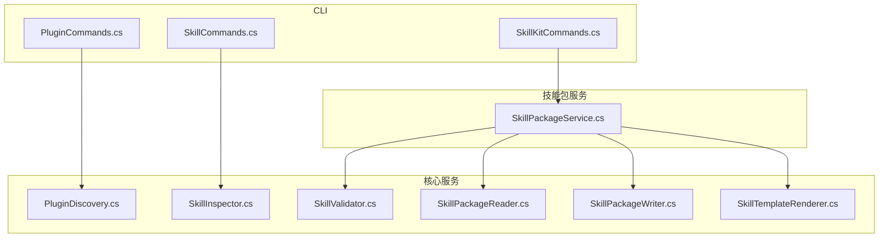
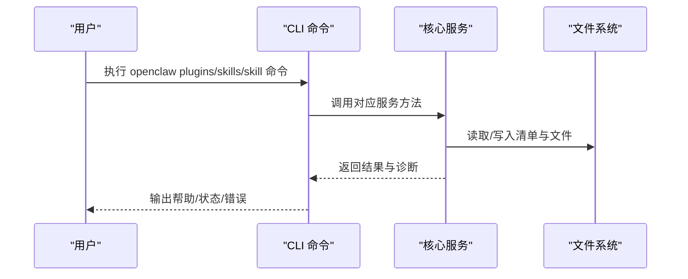
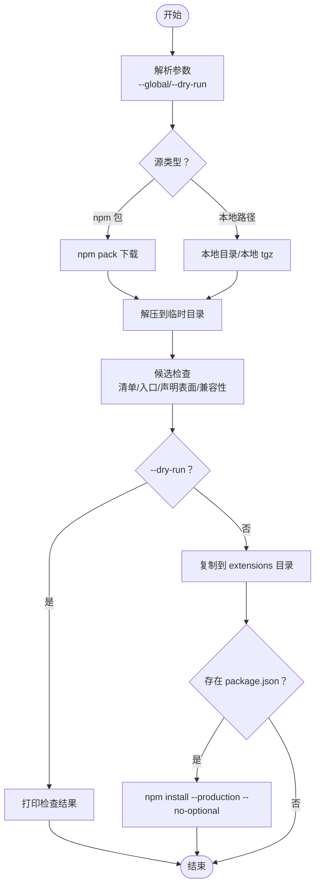
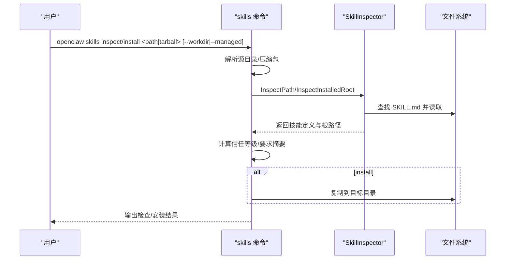
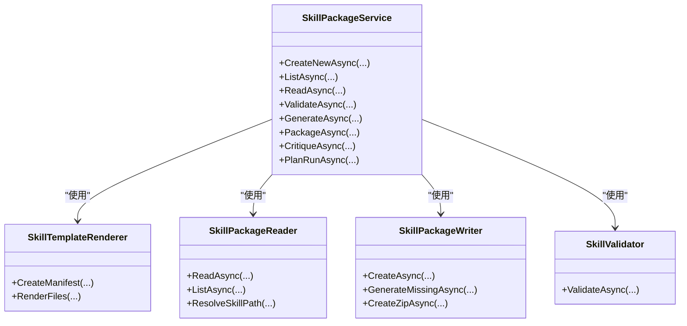
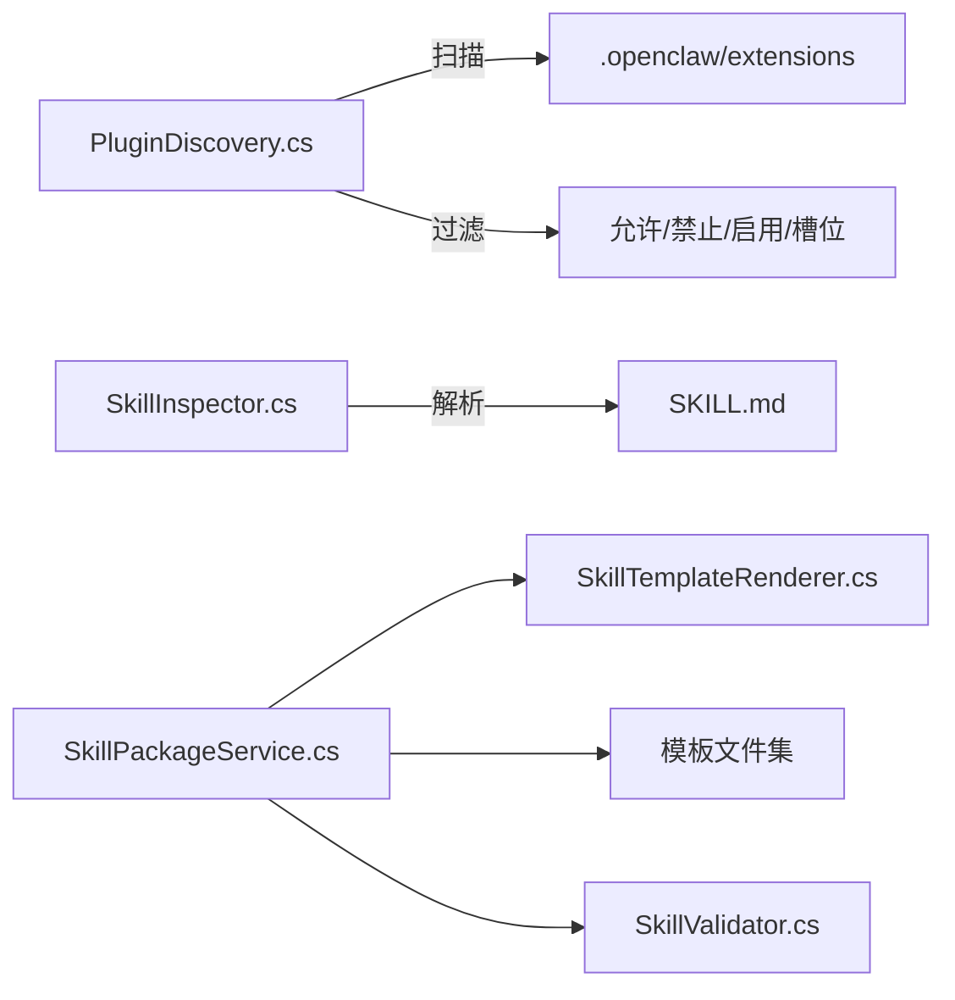

# 插件和技能命令

<cite>
**本文引用的文件**
- [PluginCommands.cs](file://src/OpenClaw.Cli/PluginCommands.cs)
- [SkillCommands.cs](file://src/OpenClaw.Cli/SkillCommands.cs)
- [SkillKitCommands.cs](file://src/OpenClaw.Cli/SkillKitCommands.cs)
- [SkillPackageService.cs](file://src/OpenClaw.SkillKit/SkillPackageService.cs)
- [SkillValidator.cs](file://src/OpenClaw.SkillKit/SkillValidator.cs)
- [SkillInspector.cs](file://src/OpenClaw.Core/Skills/SkillInspector.cs)
- [PluginDiscovery.cs](file://src/OpenClaw.Core/Plugins/PluginDiscovery.cs)
- [SkillTemplateRenderer.cs](file://src/OpenClaw.SkillKit/SkillTemplateRenderer.cs)
- [SkillPackageReader.cs](file://src/OpenClaw.SkillKit/SkillPackageReader.cs)
- [SkillPackageWriter.cs](file://src/OpenClaw.SkillKit/SkillPackageWriter.cs)
</cite>

## 目录
1. [简介](#简介)
2. [项目结构](#项目结构)
3. [核心组件](#核心组件)
4. [架构总览](#架构总览)
5. [详细组件分析](#详细组件分析)
6. [依赖关系分析](#依赖关系分析)
7. [性能考量](#性能考量)
8. [故障排查指南](#故障排查指南)
9. [结论](#结论)
10. [附录](#附录)

## 简介
本指南面向插件与技能的开发者与维护者，系统讲解 openclaw 命令行工具中与扩展生态相关的三大命令族：插件（plugins）、技能（skills）与技能包（skill kit）。内容覆盖安装/卸载/搜索/列举、技能包创建/校验/生成/打包/运行规划、插件清单与安全信任评估、以及工作流与最佳实践。读者可据此完成从本地开发到发布打包的完整闭环。

## 项目结构
围绕“插件”和“技能”的命令实现，主要涉及以下模块：
- CLI 层：负责解析用户输入、组织参数、调用具体子命令处理逻辑
- 核心服务层：提供插件发现与安装、技能包读写与校验、技能清单解析等能力
- 技能模板与规范：定义技能包的标准文件集与默认模板

图表来源
- [PluginCommands.cs](file://src/OpenClaw.Cli/PluginCommands.cs)
- [SkillCommands.cs](file://src/OpenClaw.Cli/SkillCommands.cs)
- [SkillKitCommands.cs](file://src/OpenClaw.Cli/SkillKitCommands.cs)
- [PluginDiscovery.cs](file://src/OpenClaw.Core/Plugins/PluginDiscovery.cs)
- [SkillInspector.cs](file://src/OpenClaw.Core/Skills/SkillInspector.cs)
- [SkillPackageService.cs](file://src/OpenClaw.SkillKit/SkillPackageService.cs)
- [SkillPackageReader.cs](file://src/OpenClaw.SkillKit/SkillPackageReader.cs)
- [SkillPackageWriter.cs](file://src/OpenClaw.SkillKit/SkillPackageWriter.cs)
- [SkillTemplateRenderer.cs](file://src/OpenClaw.SkillKit/SkillTemplateRenderer.cs)
- [SkillValidator.cs](file://src/OpenClaw.SkillKit/SkillValidator.cs)

章节来源
- [PluginCommands.cs](file://src/OpenClaw.Cli/PluginCommands.cs)
- [SkillCommands.cs](file://src/OpenClaw.Cli/SkillCommands.cs)
- [SkillKitCommands.cs](file://src/OpenClaw.Cli/SkillKitCommands.cs)
- [PluginDiscovery.cs](file://src/OpenClaw.Core/Plugins/PluginDiscovery.cs)
- [SkillInspector.cs](file://src/OpenClaw.Core/Skills/SkillInspector.cs)
- [SkillPackageService.cs](file://src/OpenClaw.SkillKit/SkillPackageService.cs)
- [SkillPackageReader.cs](file://src/OpenClaw.SkillKit/SkillPackageReader.cs)
- [SkillPackageWriter.cs](file://src/OpenClaw.SkillKit/SkillPackageWriter.cs)
- [SkillTemplateRenderer.cs](file://src/OpenClaw.SkillKit/SkillTemplateRenderer.cs)
- [SkillValidator.cs](file://src/OpenClaw.SkillKit/SkillValidator.cs)

## 核心组件
- 插件命令（plugins）
  - 支持安装、卸载、列表、搜索；支持从 npm/ClawHub 或本地路径安装；支持干运行检查
  - 安装前进行清单与兼容性检查，输出信任等级与诊断信息
- 技能命令（skills）
  - 支持检查、安装、列表；支持从目录或压缩包安装；支持干运行打印目标路径
  - 解析 SKILL.md 清单，输出信任等级与要求摘要
- 技能包命令（skill kit）
  - 提供新建、列出、校验、评审、生成缺失文件、打包、运行规划等能力
  - 默认输出目录为 .openclaw/skills，打包输出目录为 .openclaw/packages

章节来源
- [PluginCommands.cs](file://src/OpenClaw.Cli/PluginCommands.cs)
- [SkillCommands.cs](file://src/OpenClaw.Cli/SkillCommands.cs)
- [SkillKitCommands.cs](file://src/OpenClaw.Cli/SkillKitCommands.cs)

## 架构总览
下图展示 CLI 子命令如何驱动核心服务与模板渲染器，完成插件与技能包的生命周期管理。

图表来源
- [PluginCommands.cs](file://src/OpenClaw.Cli/PluginCommands.cs)
- [SkillCommands.cs](file://src/OpenClaw.Cli/SkillCommands.cs)
- [SkillKitCommands.cs](file://src/OpenClaw.Cli/SkillKitCommands.cs)
- [SkillPackageService.cs](file://src/OpenClaw.SkillKit/SkillPackageService.cs)

## 详细组件分析

### 插件命令（plugins）
- 功能概览
  - install：从 npm/ClawHub 或本地路径安装插件；支持 --global、--dry-run
  - remove/uninstall：卸载指定插件
  - list/ls：列出已安装插件，显示清单、信任等级与声明表面
  - search：在 npm 中搜索包含 openclaw-plugin 的包
- 关键流程
  - 安装流程（npm/本地 tarball/本地目录）均会先执行“候选检查”，解析清单、入口文件、声明表面，并进行兼容性诊断与信任评估
  - 干运行模式仅打印检查结果，不写入文件
  - 卸载后提示需要重启网关以生效
- 信任与兼容性
  - 信任等级：first-party（官方作用域）、upstream-compatible（声明表面且通过检查）、untrusted（仅入口发现）
  - 兼容性状态：errors/warnings/verified
- 目录解析
  - --global 使用 ~/.openclaw/extensions
  - 工作区优先使用 OPENCLAW_WORKSPACE 下的 .openclaw/extensions，否则回退到用户目录

图表来源
- [PluginCommands.cs](file://src/OpenClaw.Cli/PluginCommands.cs)

章节来源
- [PluginCommands.cs](file://src/OpenClaw.Cli/PluginCommands.cs)

### 技能命令（skills）
- 功能概览
  - inspect：检查本地或压缩包中的技能，输出信任等级、要求摘要与安装目标建议
  - install：安装技能（目录或压缩包），支持 --dry-run、--workdir、--managed
  - list：列出已安装技能，按名称排序
- 关键流程
  - 检查流程：定位 SKILL.md，解析技能定义，生成信任等级与警告
  - 安装流程：解析源（目录/压缩包），打印检查结果，干运行则直接返回；否则复制到目标目录
  - 目录安全：拒绝包含符号链接或重解析点的安装
- 目录解析
  - --managed 使用 ~/.openclaw/skills
  - --workdir 指定工作区下的 skills 目录
  - 未设置时抛出异常提示设置 OPENCLAW_WORKSPACE 或传入 --workdir/--managed

图表来源
- [SkillCommands.cs](file://src/OpenClaw.Cli/SkillCommands.cs)
- [SkillInspector.cs](file://src/OpenClaw.Core/Skills/SkillInspector.cs)

章节来源
- [SkillCommands.cs](file://src/OpenClaw.Cli/SkillCommands.cs)
- [SkillInspector.cs](file://src/OpenClaw.Core/Skills/SkillInspector.cs)

### 技能包命令（skill kit）
- 功能概览
  - new：基于模板创建新技能包，输出下一步建议
  - list：列出所有技能包清单
  - validate：校验技能包完整性与规范性（必填文件、清单一致性、策略冲突等）
  - critique：生成确定性评审报告
  - generate：生成缺失文件（可强制覆盖）
  - package：打包为 zip（可强制覆盖）
  - run：运行规划（当前为干运行，打印执行计划与输入问题）
- 服务编排
  - SkillPackageService 组合模板渲染器、读写器、校验器、评审提供者与运行规划器，统一对外暴露能力

图表来源
- [SkillPackageService.cs](file://src/OpenClaw.SkillKit/SkillPackageService.cs)
- [SkillTemplateRenderer.cs](file://src/OpenClaw.SkillKit/SkillTemplateRenderer.cs)
- [SkillPackageReader.cs](file://src/OpenClaw.SkillKit/SkillPackageReader.cs)
- [SkillPackageWriter.cs](file://src/OpenClaw.SkillKit/SkillPackageWriter.cs)
- [SkillValidator.cs](file://src/OpenClaw.SkillKit/SkillValidator.cs)

章节来源
- [SkillKitCommands.cs](file://src/OpenClaw.Cli/SkillKitCommands.cs)
- [SkillPackageService.cs](file://src/OpenClaw.SkillKit/SkillPackageService.cs)
- [SkillTemplateRenderer.cs](file://src/OpenClaw.SkillKit/SkillTemplateRenderer.cs)
- [SkillPackageReader.cs](file://src/OpenClaw.SkillKit/SkillPackageReader.cs)
- [SkillPackageWriter.cs](file://src/OpenClaw.SkillKit/SkillPackageWriter.cs)
- [SkillValidator.cs](file://src/OpenClaw.SkillKit/SkillValidator.cs)

## 依赖关系分析
- 插件生态
  - 插件发现遵循“配置路径 → 工作区 → 全局 → 内置”的优先级顺序，支持允许/禁止列表、启用状态与槽位独占过滤
  - 安全性保障：严格限制入口文件必须位于插件根内，防止符号链接逃逸；对重复 ID 进行去重报告
- 技能生态
  - 技能包采用标准文件集（清单、意图、期望、工作流、工具策略、守卫线、验证、示例、追踪等），通过模板渲染器生成
  - 校验器对清单字段、策略冲突、工作流步数、输入输出要求等进行检查

图表来源
- [PluginDiscovery.cs](file://src/OpenClaw.Core/Plugins/PluginDiscovery.cs)
- [SkillInspector.cs](file://src/OpenClaw.Core/Skills/SkillInspector.cs)
- [SkillPackageService.cs](file://src/OpenClaw.SkillKit/SkillPackageService.cs)
- [SkillTemplateRenderer.cs](file://src/OpenClaw.SkillKit/SkillTemplateRenderer.cs)
- [SkillValidator.cs](file://src/OpenClaw.SkillKit/SkillValidator.cs)

章节来源
- [PluginDiscovery.cs](file://src/OpenClaw.Core/Plugins/PluginDiscovery.cs)
- [SkillInspector.cs](file://src/OpenClaw.Core/Skills/SkillInspector.cs)
- [SkillPackageService.cs](file://src/OpenClaw.SkillKit/SkillPackageService.cs)
- [SkillTemplateRenderer.cs](file://src/OpenClaw.SkillKit/SkillTemplateRenderer.cs)
- [SkillValidator.cs](file://src/OpenClaw.SkillKit/SkillValidator.cs)

## 性能考量
- 插件安装
  - npm pack 与 tar 解压为 IO 密集操作；干运行避免磁盘写入，适合预检
  - 依赖安装仅在存在 package.json 时执行，减少不必要的 npm 调用
- 技能包
  - 列表与读取采用惰性枚举与异常降级，避免因单个包损坏影响整体
  - 打包使用最小压缩级别，平衡体积与时间
- 可靠性
  - 对符号链接与重解析点进行拒绝安装，避免潜在安全风险
  - 插件入口文件解析严格限定在插件根内，防止路径逃逸

## 故障排查指南
- 插件安装失败
  - 检查 npm 是否可用与网络连通性
  - 使用 --dry-run 获取详细诊断与信任等级，确认是否因清单缺失或声明表面不合规导致阻止安装
  - 若为本地路径，确保包含有效的 openclaw.plugin.json 或 package.json openclaw.extensions
- 技能安装失败
  - 确认 OPENCLAW_WORKSPACE 已设置，或显式传入 --workdir/--managed
  - 检查是否包含符号链接或重解析点，CLI 将拒绝此类安装
  - 使用 skills inspect 预览安装目标与信任等级
- 技能包校验失败
  - validate 输出将明确指出缺失文件、清单字段为空、策略冲突、工作流步数不足等问题
  - 使用 generate 生成缺失文件，或根据 critique 提示完善
- 运行规划
  - run 当前为干运行，用于查看执行计划与输入问题，后续将支持真实执行

章节来源
- [PluginCommands.cs](file://src/OpenClaw.Cli/PluginCommands.cs)
- [SkillCommands.cs](file://src/OpenClaw.Cli/SkillCommands.cs)
- [SkillKitCommands.cs](file://src/OpenClaw.Cli/SkillKitCommands.cs)
- [SkillValidator.cs](file://src/OpenClaw.SkillKit/SkillValidator.cs)

## 结论
通过插件与技能命令，OpenClaw 提供了从开发、校验、打包到发布的完整扩展生态工具链。插件侧强调清单与信任评估，技能侧强调标准化文件集与可审计性。结合 CLI 的干运行与详尽诊断，开发者可以高效地构建、验证与分发高质量的插件与技能包。

## 附录

### 命令速查与参数
- 插件（plugins）
  - openclaw plugins install <package|path|tarball> [--global] [--dry-run]
  - openclaw plugins remove <plugin-name> [--global]
  - openclaw plugins list [--global]
  - openclaw plugins search <query>
- 技能（skills）
  - openclaw skills inspect <path|tarball>
  - openclaw skills install <path|tarball> [--dry-run] [--workdir <path>|--managed]
  - openclaw skills list [--workdir <path>|--managed]
- 技能包（skill kit）
  - openclaw skill new <name> [--category <category>] [--template <template>] [--output <path>] [--force]
  - openclaw skill list [--output <path>]
  - openclaw skill validate <skill-id|path> [--output <path>]
  - openclaw skill critique <skill-id|path> [--output <path>]
  - openclaw skill generate <skill-id|path> [--output <path>] [--force]
  - openclaw skill package <skill-id|path> [--output <path>] [--package-output <path>] [--force]
  - openclaw skill run <skill-id|path> --input <path> [--dry-run] [--output <path>]

章节来源
- [PluginCommands.cs](file://src/OpenClaw.Cli/PluginCommands.cs)
- [SkillCommands.cs](file://src/OpenClaw.Cli/SkillCommands.cs)
- [SkillKitCommands.cs](file://src/OpenClaw.Cli/SkillKitCommands.cs)