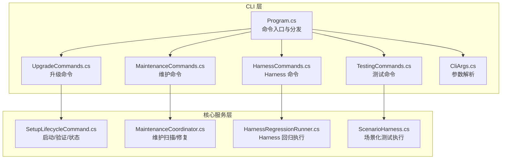
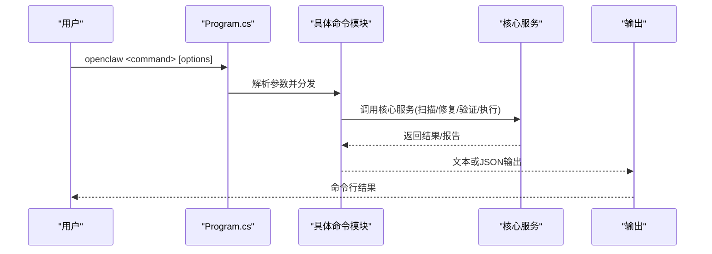
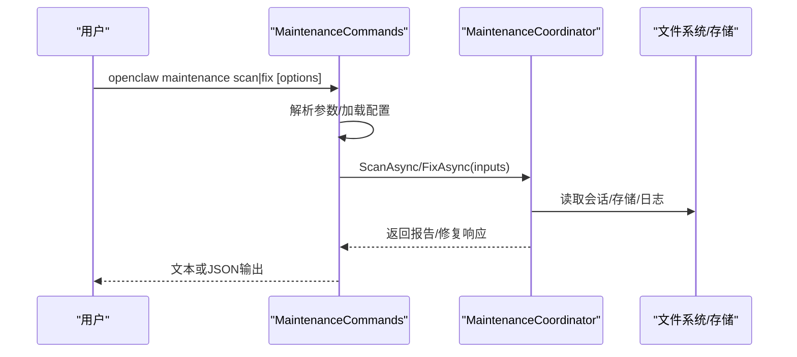
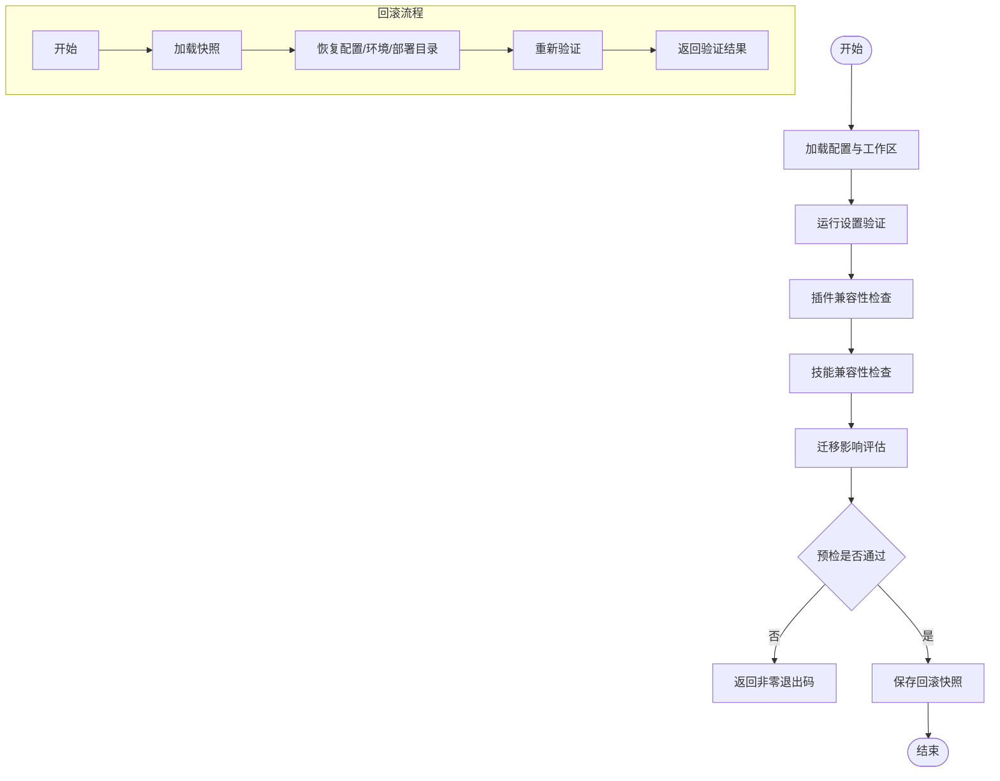
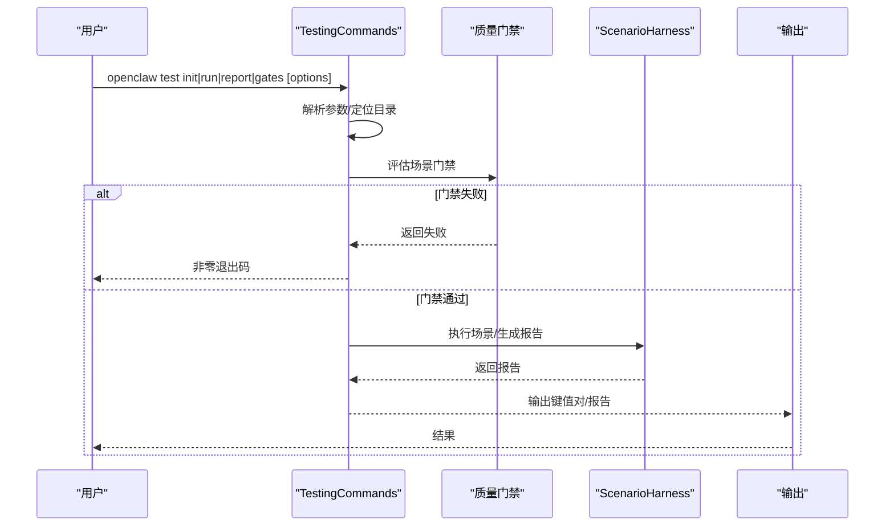
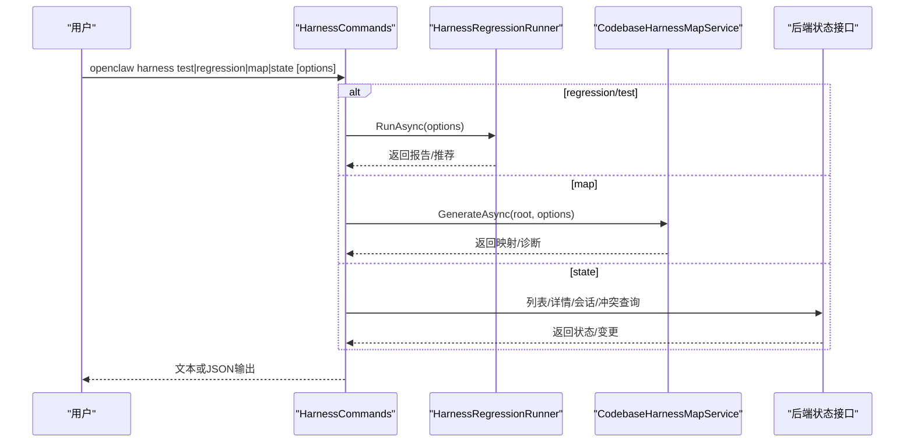
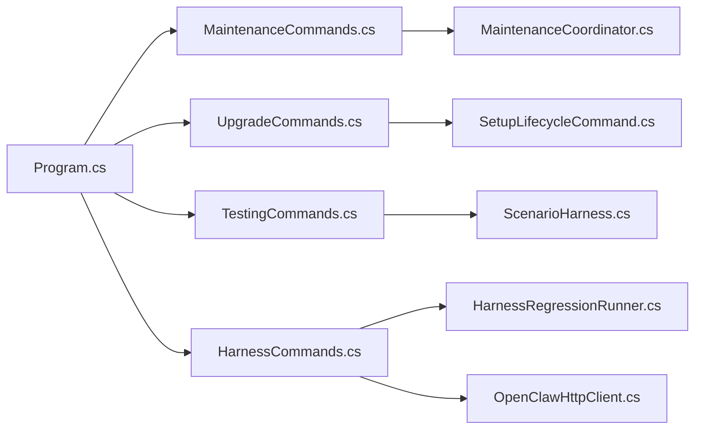

# 管理维护命令

<cite>
**本文档引用的文件**
- [Program.cs](file://src/OpenClaw.Cli/Program.cs)
- [MaintenanceCommands.cs](file://src/OpenClaw.Cli/MaintenanceCommands.cs)
- [UpgradeCommands.cs](file://src/OpenClaw.Cli/UpgradeCommands.cs)
- [TestingCommands.cs](file://src/OpenClaw.Cli/TestingCommands.cs)
- [HarnessCommands.cs](file://src/OpenClaw.Cli/HarnessCommands.cs)
- [SetupLifecycleCommand.cs](file://src/OpenClaw.Cli/SetupLifecycleCommand.cs)
- [MaintenanceCoordinator.cs](file://src/OpenClaw.Core/Setup/MaintenanceCoordinator.cs)
- [HarnessRegressionRunner.cs](file://src/OpenClaw.Testing/HarnessRegressionRunner.cs)
- [ScenarioHarness.cs](file://src/OpenClaw.Testing/ScenarioHarness.cs)
- [CliArgs.cs](file://src/OpenClaw.Cli/CliArgs.cs)
</cite>

## 目录
1. [简介](#简介)
2. [项目结构](#项目结构)
3. [核心组件](#核心组件)
4. [架构总览](#架构总览)
5. [详细组件分析](#详细组件分析)
6. [依赖关系分析](#依赖关系分析)
7. [性能考虑](#性能考虑)
8. [故障排除指南](#故障排除指南)
9. [结论](#结论)
10. [附录](#附录)

## 简介
本指南面向运维与平台工程团队，系统性阐述管理维护命令的使用方法与实现机制，覆盖以下四大类命令：
- 维护（maintenance）：维护扫描与修复，保障运行时可靠性与存储健康
- 升级（upgrade）：升级前预检与回滚保护，确保平滑演进
- 测试（test）：场景化回归测试与质量门禁，支撑自动化验证
- 驾 Harness（harness）：静态扫描、状态查询与回归测试，支持离线与严格模式

文档重点包括：命令参数、执行流程、输出格式、错误处理、系统健康检查、版本升级流程、自动化测试集成与质量门禁、最佳实践与监控集成建议。

## 项目结构
管理维护命令位于 CLI 层，通过 Program 分发到各子命令模块；核心逻辑在 Core 与 Testing 模块中实现，形成“CLI 参数解析 → 命令分发 → 核心服务执行 → 输出报告”的清晰分层。

**图表来源**
- [Program.cs:12-771](file://src/OpenClaw.Cli/Program.cs#L12-L771)
- [MaintenanceCommands.cs:10-63](file://src/OpenClaw.Cli/MaintenanceCommands.cs#L10-L63)
- [UpgradeCommands.cs:12-28](file://src/OpenClaw.Cli/UpgradeCommands.cs#L12-L28)
- [TestingCommands.cs:12-34](file://src/OpenClaw.Cli/TestingCommands.cs#L12-L34)
- [HarnessCommands.cs:14-46](file://src/OpenClaw.Cli/HarnessCommands.cs#L14-L46)
- [SetupLifecycleCommand.cs:17-35](file://src/OpenClaw.Cli/SetupLifecycleCommand.cs#L17-L35)
- [MaintenanceCoordinator.cs:40-100](file://src/OpenClaw.Core/Setup/MaintenanceCoordinator.cs#L40-L100)
- [HarnessRegressionRunner.cs:18-68](file://src/OpenClaw.Testing/HarnessRegressionRunner.cs#L18-L68)
- [ScenarioHarness.cs:129-171](file://src/OpenClaw.Testing/ScenarioHarness.cs#L129-L171)

**章节来源**
- [Program.cs:12-771](file://src/OpenClaw.Cli/Program.cs#L12-L771)

## 核心组件
- 命令入口与分发：Program 将 openclaw maintenance/upgrade/test/harness 等命令路由至对应模块
- 参数解析：CliArgs 提供统一的选项与位置参数解析，支持 --help、--json、--dry-run 等通用标志
- 维护命令：封装 scan/fix 子命令，调用 MaintenanceCoordinator 执行扫描与修复
- 升级命令：封装 check/rollback 子命令，组合配置验证、插件/技能兼容性、迁移影响评估与快照保存
- 测试命令：封装 init/run/report/gates 子命令，驱动场景化测试与质量门禁
- Harness 命令：封装 test/regression/map/state 子命令，支持离线/严格模式与输出控制

**章节来源**
- [Program.cs:25-58](file://src/OpenClaw.Cli/Program.cs#L25-L58)
- [CliArgs.cs:14-97](file://src/OpenClaw.Cli/CliArgs.cs#L14-L97)
- [MaintenanceCommands.cs:10-63](file://src/OpenClaw.Cli/MaintenanceCommands.cs#L10-L63)
- [UpgradeCommands.cs:12-28](file://src/OpenClaw.Cli/UpgradeCommands.cs#L12-L28)
- [TestingCommands.cs:12-34](file://src/OpenClaw.Cli/TestingCommands.cs#L12-L34)
- [HarnessCommands.cs:14-46](file://src/OpenClaw.Cli/HarnessCommands.cs#L14-L46)

## 架构总览
下图展示管理维护命令从 CLI 到核心服务的调用链路与数据流。

**图表来源**
- [Program.cs:25-58](file://src/OpenClaw.Cli/Program.cs#L25-L58)
- [MaintenanceCommands.cs:10-63](file://src/OpenClaw.Cli/MaintenanceCommands.cs#L10-L63)
- [UpgradeCommands.cs:12-28](file://src/OpenClaw.Cli/UpgradeCommands.cs#L12-L28)
- [TestingCommands.cs:12-34](file://src/OpenClaw.Cli/TestingCommands.cs#L12-L34)
- [HarnessCommands.cs:14-46](file://src/OpenClaw.Cli/HarnessCommands.cs#L14-L46)

## 详细组件分析

### 维护命令（maintenance）
- 功能概述
  - scan：对运行时进行健康扫描，生成可靠性评分与问题清单
  - fix：按类别执行清理与修复（保留策略、元数据清理、模型评估与缓存痕迹清理），支持 dry-run
- 关键流程
  - 读取配置与构建 SetupStatus
  - 调用 MaintenanceCoordinator.ScanAsync 生成报告
  - 可选：MaintenanceCoordinator.FixAsync 执行修复动作
- 输出格式
  - 文本：摘要、可靠性、存储、提示预算、漂移、发现项、推荐命令
  - JSON：通过 --json 输出完整结构
- 错误处理
  - 配置加载失败直接返回错误码
  - scan/fix 失败时根据严重度返回非零退出码
- 参数要点
  - --config：指定配置路径
  - --json：输出 JSON
  - --dry-run：仅预览不写入
  - --apply：选择修复范围（all/retention/metadata/artifacts）

**图表来源**
- [MaintenanceCommands.cs:10-63](file://src/OpenClaw.Cli/MaintenanceCommands.cs#L10-L63)
- [MaintenanceCoordinator.cs:40-100](file://src/OpenClaw.Core/Setup/MaintenanceCoordinator.cs#L40-L100)
- [MaintenanceCoordinator.cs:102-173](file://src/OpenClaw.Core/Setup/MaintenanceCoordinator.cs#L102-L173)

**章节来源**
- [MaintenanceCommands.cs:10-113](file://src/OpenClaw.Cli/MaintenanceCommands.cs#L10-L113)
- [MaintenanceCoordinator.cs:40-100](file://src/OpenClaw.Core/Setup/MaintenanceCoordinator.cs#L40-L100)
- [MaintenanceCoordinator.cs:102-173](file://src/OpenClaw.Core/Setup/MaintenanceCoordinator.cs#L102-L173)

### 升级命令（upgrade）
- 功能概述
  - check：升级前综合预检，包含配置与提供商就绪、插件兼容性、技能兼容性、迁移风险与回滚快照
  - rollback：恢复上一个已知良好快照，并重新执行验证
- 关键流程
  - 加载配置与工作区路径
  - 运行 SetupVerificationService 验证
  - 插件与技能兼容性检查
  - 迁移影响评估（运行模式/编排器/自定义路径等）
  - 生成并保存回滚快照（仅当预检通过）
  - rollback：校验快照、恢复文件、重新验证
- 输出格式
  - 文本：逐项检查结果、总体状态、推荐下一步
  - JSON：可扩展为未来输出
- 错误处理
  - 预检阻塞性问题返回非零退出码
  - 快照缺失/损坏时给出明确指引
- 参数要点
  - --config：指定配置路径
  - --offline：离线模式跳过提供商探针
  - --require-provider：强制要求提供商可用
  - --json：输出 JSON（在部分子命令中支持）

**图表来源**
- [UpgradeCommands.cs:30-106](file://src/OpenClaw.Cli/UpgradeCommands.cs#L30-L106)
- [UpgradeCommands.cs:108-162](file://src/OpenClaw.Cli/UpgradeCommands.cs#L108-L162)
- [SetupLifecycleCommand.cs:37-65](file://src/OpenClaw.Cli/SetupLifecycleCommand.cs#L37-L65)

**章节来源**
- [UpgradeCommands.cs:12-28](file://src/OpenClaw.Cli/UpgradeCommands.cs#L12-L28)
- [UpgradeCommands.cs:30-106](file://src/OpenClaw.Cli/UpgradeCommands.cs#L30-L106)
- [UpgradeCommands.cs:108-162](file://src/OpenClaw.Cli/UpgradeCommands.cs#L108-L162)
- [SetupLifecycleCommand.cs:37-65](file://src/OpenClaw.Cli/SetupLifecycleCommand.cs#L37-L65)

### 测试命令（test）
- 功能概述
  - init：初始化场景目录与文档目录，生成示例场景
  - run：加载场景、执行质量门禁、运行场景并生成追踪报告
  - report：基于最新追踪重建 Markdown 报告
  - gates：仅执行质量门禁，不运行场景
- 关键流程
  - 读取场景目录与输出根目录
  - 门禁评估（失败则终止）
  - 场景执行与结果汇总
  - 输出 run_id/results/report/summary
- 输出格式
  - 文本：键值对输出（如 results=...）
  - Markdown：report.md
  - JSON：可扩展为未来输出
- 错误处理
  - 无场景或门禁失败返回非零退出码
  - 未找到最新报告时提示
- 参数要点
  - --scenarios/--scenario-dir：场景目录
  - --output：输出根目录
  - --fail-on：any/high 控制失败判定

**图表来源**
- [TestingCommands.cs:12-34](file://src/OpenClaw.Cli/TestingCommands.cs#L12-L34)
- [TestingCommands.cs:60-82](file://src/OpenClaw.Cli/TestingCommands.cs#L60-L82)
- [TestingCommands.cs:84-99](file://src/OpenClaw.Cli/TestingCommands.cs#L84-L99)
- [TestingCommands.cs:101-114](file://src/OpenClaw.Cli/TestingCommands.cs#L101-L114)
- [ScenarioHarness.cs:129-171](file://src/OpenClaw.Testing/ScenarioHarness.cs#L129-L171)

**章节来源**
- [TestingCommands.cs:12-271](file://src/OpenClaw.Cli/TestingCommands.cs#L12-L271)
- [ScenarioHarness.cs:129-171](file://src/OpenClaw.Testing/ScenarioHarness.cs#L129-L171)

### Harness 命令（harness）
- 功能概述
  - test/regression：执行 Harness 回归场景，支持离线与严格模式
  - map：静态扫描代码库，生成模块/端点/工具/通道/配置等映射
  - state：查询共享 Harness 状态（列表/详情/会话/冲突检测）
- 关键流程
  - regression：构建上下文（配置/临时工作区）、选择场景、执行并汇总
  - map：生成代码库映射，支持 JSON/文本输出与诊断
  - state：通过 HTTP 客户端访问后端状态接口
- 输出格式
  - 文本/JSON：由 --json 控制
  - 严格模式：将警告/跳过视为失败
- 错误处理
  - 未知子命令打印帮助
  - HTTP 404 明确提示未找到
  - 网络异常输出错误信息
- 参数要点
  - --config/--category/--json/--offline/--strict/--proposal/--output
  - --url/--token：用于 state 查询

**图表来源**
- [HarnessCommands.cs:14-46](file://src/OpenClaw.Cli/HarnessCommands.cs#L14-L46)
- [HarnessCommands.cs:67-100](file://src/OpenClaw.Cli/HarnessCommands.cs#L67-L100)
- [HarnessCommands.cs:102-142](file://src/OpenClaw.Cli/HarnessCommands.cs#L102-L142)
- [HarnessCommands.cs:144-246](file://src/OpenClaw.Cli/HarnessCommands.cs#L144-L246)
- [HarnessRegressionRunner.cs:18-68](file://src/OpenClaw.Testing/HarnessRegressionRunner.cs#L18-L68)

**章节来源**
- [HarnessCommands.cs:8-450](file://src/OpenClaw.Cli/HarnessCommands.cs#L8-L450)
- [HarnessRegressionRunner.cs:18-68](file://src/OpenClaw.Testing/HarnessRegressionRunner.cs#L18-L68)

## 依赖关系分析
- 命令到核心服务的耦合
  - maintenance 依赖 MaintenanceCoordinator（扫描/修复）
  - upgrade 依赖 SetupLifecycleCommand（验证/状态）与 UpgradeRollbackSnapshotStore（快照）
  - test 依赖 ScenarioHarness（场景执行）与 ScenarioQualityGate（门禁）
  - harness 依赖 HarnessRegressionRunner（回归）与 OpenClawHttpClient（状态查询）
- 参数解析与通用标志
  - CliArgs 统一解析 --help、--json、--dry-run、--offline、--strict 等
- 外部依赖
  - 文件系统（配置/存储/日志）
  - HTTP 客户端（状态查询）
  - 临时工作区（Harness 回归）

**图表来源**
- [Program.cs:25-58](file://src/OpenClaw.Cli/Program.cs#L25-L58)
- [MaintenanceCommands.cs:10-63](file://src/OpenClaw.Cli/MaintenanceCommands.cs#L10-L63)
- [UpgradeCommands.cs:12-28](file://src/OpenClaw.Cli/UpgradeCommands.cs#L12-L28)
- [TestingCommands.cs:12-34](file://src/OpenClaw.Cli/TestingCommands.cs#L12-L34)
- [HarnessCommands.cs:14-46](file://src/OpenClaw.Cli/HarnessCommands.cs#L14-L46)
- [MaintenanceCoordinator.cs:40-100](file://src/OpenClaw.Core/Setup/MaintenanceCoordinator.cs#L40-L100)
- [HarnessRegressionRunner.cs:18-68](file://src/OpenClaw.Testing/HarnessRegressionRunner.cs#L18-L68)
- [ScenarioHarness.cs:129-171](file://src/OpenClaw.Testing/ScenarioHarness.cs#L129-L171)

**章节来源**
- [Program.cs:25-58](file://src/OpenClaw.Cli/Program.cs#L25-L58)

## 性能考虑
- 维护扫描
  - 扫描涉及目录遍历与统计，注意大存储空间下的 IO 开销；可通过合理配置内存存储路径与保留策略降低扫描成本
- 升级预检
  - 离线模式可避免网络探针带来的延迟；必要时启用 --offline
- 测试与回归
  - 场景执行可能较重，建议在隔离环境或 CI 中并行执行多个场景
  - 严格模式会放大失败判定，建议在发布前开启
- Harness map
  - 本地静态扫描，避免构建与执行仓库代码，适合快速概览

[本节为通用指导，无需特定文件引用]

## 故障排除指南
- 维护命令
  - 配置加载失败：检查 --config 指向的路径与权限
  - scan/fix 返回非零：根据输出中的发现项与推荐命令逐一修复
  - JSON 输出：使用 --json 获取完整结构便于自动化处理
- 升级命令
  - 预检失败：根据检查项与推荐下一步修复；必要时使用 --offline 或 --require-provider 调整策略
  - 回滚失败：检查快照完整性与目标路径权限；删除损坏快照后重新执行预检
- 测试命令
  - 无场景或门禁失败：确认场景目录存在且符合规范；修复门禁问题后再运行
  - 报告未生成：确认输出根目录可写
- Harness 命令
  - 未知子命令：查看帮助输出
  - HTTP 404：确认后端状态是否存在
  - 网络异常：检查 --url 与 --token 配置

**章节来源**
- [MaintenanceCommands.cs:10-113](file://src/OpenClaw.Cli/MaintenanceCommands.cs#L10-L113)
- [UpgradeCommands.cs:108-162](file://src/OpenClaw.Cli/UpgradeCommands.cs#L108-L162)
- [TestingCommands.cs:84-114](file://src/OpenClaw.Cli/TestingCommands.cs#L84-L114)
- [HarnessCommands.cs:144-246](file://src/OpenClaw.Cli/HarnessCommands.cs#L144-L246)

## 结论
管理维护命令提供了从运行时健康、升级演进、自动化测试到静态扫描的全栈运维能力。通过标准化的参数、一致的输出格式与严格的错误处理，这些命令能够有效支撑生产环境的稳定性与可演进性。建议在 CI/CD 中集成测试与回归命令，在发布前使用升级预检与回滚快照，定期运行维护扫描以保持系统健康。

[本节为总结性内容，无需特定文件引用]

## 附录

### 常用参数速查
- 通用标志
  - --help/-h：显示帮助
  - --json：输出 JSON
  - --dry-run：仅预览不写入
  - --offline：离线模式
  - --strict：严格模式（将警告/跳过视为失败）
- 维护命令
  - --config：配置路径
  - --apply：修复范围（all/retention/metadata/artifacts）
- 升级命令
  - --config：配置路径
  - --offline：离线模式
  - --require-provider：强制提供商可用
- 测试命令
  - --scenarios/--scenario-dir：场景目录
  - --output：输出根目录
  - --fail-on：any/high
- Harness 命令
  - --config/--category/--json/--offline/--strict/--proposal/--output
  - --url/--token：状态查询

**章节来源**
- [Program.cs:310-416](file://src/OpenClaw.Cli/Program.cs#L310-L416)
- [MaintenanceCommands.cs:35-63](file://src/OpenClaw.Cli/MaintenanceCommands.cs#L35-L63)
- [UpgradeCommands.cs:398-416](file://src/OpenClaw.Cli/UpgradeCommands.cs#L398-L416)
- [TestingCommands.cs:155-171](file://src/OpenClaw.Cli/TestingCommands.cs#L155-L171)
- [HarnessCommands.cs:384-448](file://src/OpenClaw.Cli/HarnessCommands.cs#L384-L448)