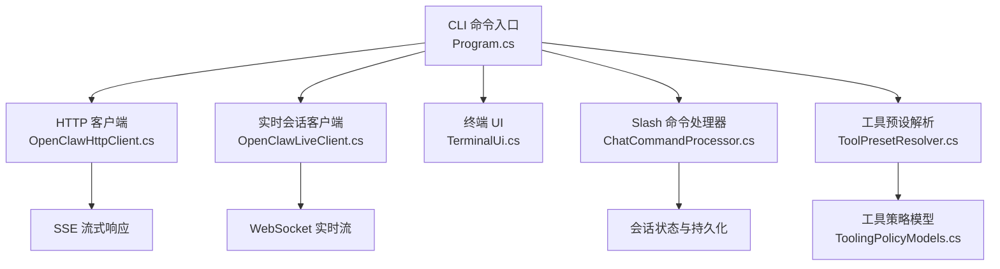
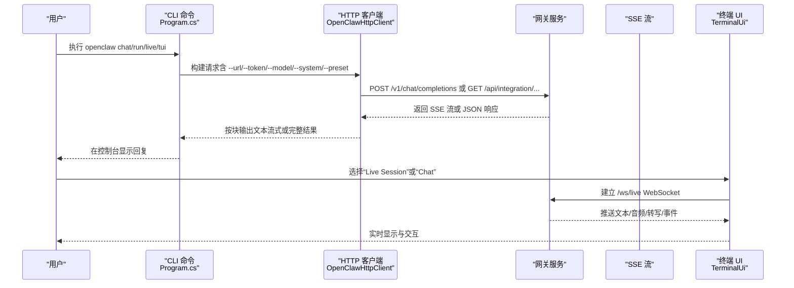
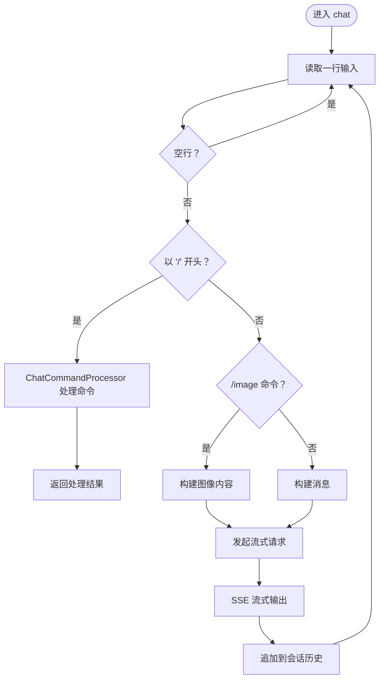
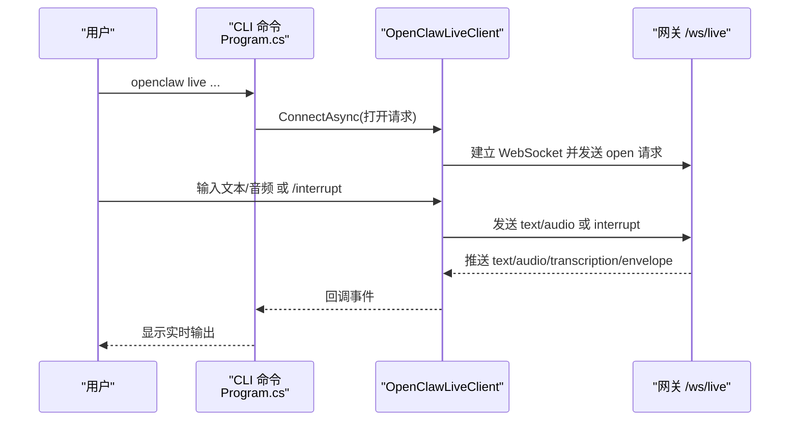
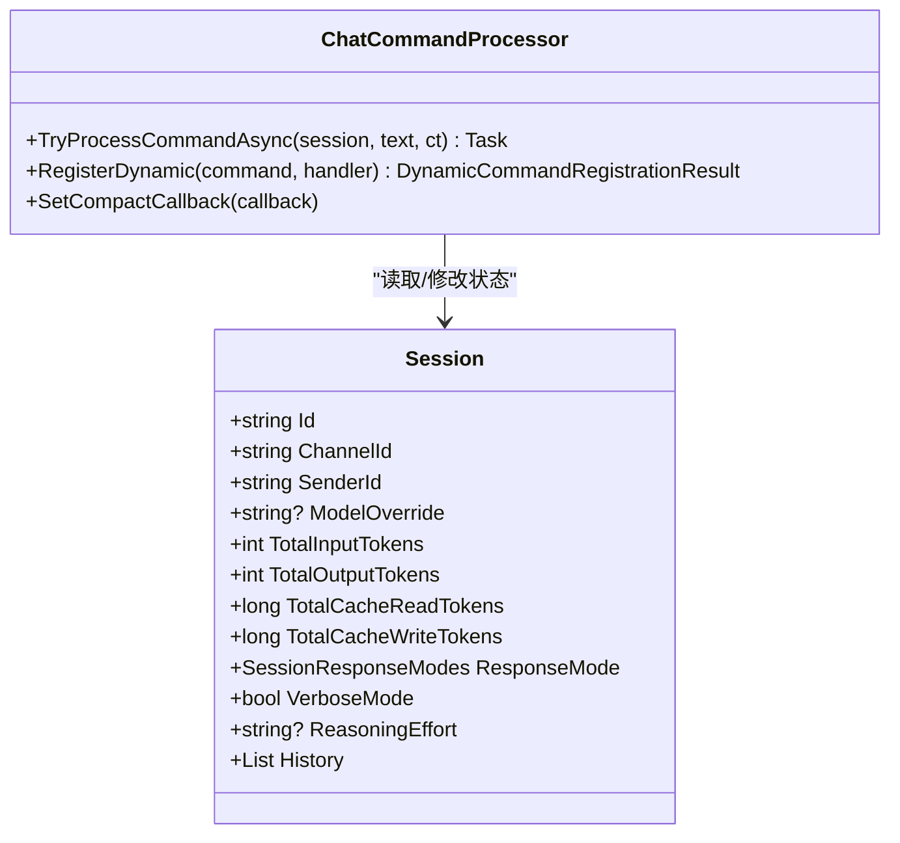
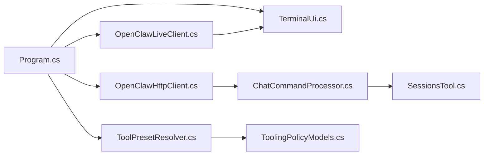

# 聊天交互命令

<cite>
**本文档引用的文件**
- [Program.cs](file://src/OpenClaw.Cli/Program.cs)
- [ChatCommandProcessor.cs](file://src/OpenClaw.Core/Pipeline/ChatCommandProcessor.cs)
- [OpenClawHttpClient.cs](file://src/OpenClaw.Client/OpenClawHttpClient.cs)
- [OpenClawLiveClient.cs](file://src/OpenClaw.Client/OpenClawLiveClient.cs)
- [TerminalUi.cs](file://src/OpenClaw.Tui/TerminalUi.cs)
- [SessionsTool.cs](file://src/OpenClaw.Agent/Tools/SessionsTool.cs)
- [LlmProviderRegistry.cs](file://src/OpenClaw.Gateway/LlmProviderRegistry.cs)
- [ToolPresetResolver.cs](file://src/OpenClaw.Gateway/ToolPresetResolver.cs)
- [ToolingPolicyModels.cs](file://src/OpenClaw.Core/Models/ToolingPolicyModels.cs)
- [ChatCommandProcessorTests.cs](file://src/OpenClaw.Tests/ChatCommandProcessorTests.cs)
- [EmbeddedLocalChatClientTests.cs](file://src/OpenClaw.Tests/EmbeddedLocalChatClientTests.cs)
</cite>

## 目录
1. [简介](#简介)
2. [项目结构](#项目结构)
3. [核心组件](#核心组件)
4. [架构总览](#架构总览)
5. [详细组件分析](#详细组件分析)
6. [依赖关系分析](#依赖关系分析)
7. [性能考量](#性能考量)
8. [故障排除指南](#故障排除指南)
9. [结论](#结论)
10. [附录](#附录)

## 简介
本文件面向使用者与开发者，系统性阐述聊天交互命令的使用方法与实现机制，覆盖以下主题：
- 命令功能与用法：chat、run、live、tui 及其参数（--url、--token、--model、--system、--preset 等）
- 交互式聊天会话机制与 Slash 命令系统
- 流式响应处理与多媒体支持（图像、音频等）
- 会话管理与工具预设策略
- 实际使用示例、快捷键与最佳实践、故障排除

## 项目结构
围绕聊天交互的核心模块分布于 CLI、客户端、网关与测试层：
- CLI 层：解析命令与参数，驱动 run、chat、live、tui 等子命令
- 客户端层：封装 HTTP 与 SSE 流式对话、WebSocket 实时会话
- 核心与网关层：会话状态、Slash 命令处理器、工具预设解析、LLM 提供商注册
- 测试层：验证 Slash 命令行为、流式响应与多媒体序列化

图表来源
- [Program.cs:541-611](file://src/OpenClaw.Cli/Program.cs#L541-L611)
- [OpenClawHttpClient.cs:204-260](file://src/OpenClaw.Client/OpenClawHttpClient.cs#L204-L260)
- [OpenClawLiveClient.cs:60-87](file://src/OpenClaw.Client/OpenClawLiveClient.cs#L60-L87)
- [TerminalUi.cs:9-80](file://src/OpenClaw.Tui/TerminalUi.cs#L9-L80)
- [ChatCommandProcessor.cs:19-221](file://src/OpenClaw.Core/Pipeline/ChatCommandProcessor.cs#L19-L221)
- [ToolPresetResolver.cs:68-88](file://src/OpenClaw.Gateway/ToolPresetResolver.cs#L68-L88)
- [ToolingPolicyModels.cs:1-44](file://src/OpenClaw.Core/Models/ToolingPolicyModels.cs#L1-L44)

章节来源
- [Program.cs:85-237](file://src/OpenClaw.Cli/Program.cs#L85-L237)

## 核心组件
- CLI 命令入口与帮助信息：定义 openclaw 的命令集、通用选项与示例
- HTTP 客户端与 SSE 流式响应：支持非流式与流式对话，按需应用工具预设
- 实时会话客户端：通过 WebSocket 连接网关，支持文本与音频输入、中断与关闭
- Slash 命令处理器：内置 /status、/new、/reset、/model、/usage、/think、/compact、/concise、/verbose、/help 等命令
- 工具预设解析器：根据会话表面与配置解析允许/拒绝工具集合
- 终端 UI：提供菜单驱动的运行状态、会话查询、直播会话等能力

章节来源
- [Program.cs:541-611](file://src/OpenClaw.Cli/Program.cs#L541-L611)
- [OpenClawHttpClient.cs:204-260](file://src/OpenClaw.Client/OpenClawHttpClient.cs#L204-L260)
- [OpenClawLiveClient.cs:60-123](file://src/OpenClaw.Client/OpenClawLiveClient.cs#L60-L123)
- [ChatCommandProcessor.cs:19-221](file://src/OpenClaw.Core/Pipeline/ChatCommandProcessor.cs#L19-L221)
- [ToolPresetResolver.cs:68-88](file://src/OpenClaw.Gateway/ToolPresetResolver.cs#L68-L88)
- [TerminalUi.cs:9-80](file://src/OpenClaw.Tui/TerminalUi.cs#L9-L80)

## 架构总览
下图展示从 CLI 到网关的关键交互路径，包括流式对话与实时会话。

图表来源
- [Program.cs:541-611](file://src/OpenClaw.Cli/Program.cs#L541-L611)
- [OpenClawHttpClient.cs:204-260](file://src/OpenClaw.Client/OpenClawHttpClient.cs#L204-L260)
- [TerminalUi.cs:68-77](file://src/OpenClaw.Tui/TerminalUi.cs#L68-L77)

## 详细组件分析

### chat 命令：交互式聊天与 Slash 命令
- 功能要点
  - 支持持续对话，逐行输入消息
  - 内置 Slash 命令：/help、/status、/new、/reset、/model、/usage、/think、/compact、/concise、/verbose
  - 图像输入：/image 命令可附加本地文件或 URL
  - 参数继承：--url、--token、--model、--system、--preset 由 CLI 解析后传递给客户端
- 处理流程
  - 读取用户输入，识别是否为 Slash 命令
  - 若为命令则交由 ChatCommandProcessor 处理；否则加入历史并发起流式请求
  - 流式响应按块输出，最终追加到会话历史

图表来源
- [Program.cs:541-611](file://src/OpenClaw.Cli/Program.cs#L541-L611)
- [ChatCommandProcessor.cs:70-212](file://src/OpenClaw.Core/Pipeline/ChatCommandProcessor.cs#L70-L212)

章节来源
- [Program.cs:541-611](file://src/OpenClaw.Cli/Program.cs#L541-L611)
- [ChatCommandProcessor.cs:19-221](file://src/OpenClaw.Core/Pipeline/ChatCommandProcessor.cs#L19-L221)
- [ChatCommandProcessorTests.cs:94-136](file://src/OpenClaw.Tests/ChatCommandProcessorTests.cs#L94-L136)

### run 命令：一次性请求与流式输出
- 功能要点
  - 支持位置参数作为提示词，或从标准输入读取
  - 可附加文件与图片输入
  - 控制流式输出：--no-stream 关闭流式
  - 参数：--url、--token、--model、--system、--preset、--temperature、--max-tokens
- 处理流程
  - 解析参数与输入，构建消息列表
  - 发起流式或非流式请求，按需输出到控制台

章节来源
- [Program.cs:481-539](file://src/OpenClaw.Cli/Program.cs#L481-L539)
- [OpenClawHttpClient.cs:204-260](file://src/OpenClaw.Client/OpenClawHttpClient.cs#L204-L260)

### live 命令：实时会话与多模态
- 功能要点
  - 通过 WebSocket 连接到网关的 /ws/live
  - 支持文本与音频输入，可中断生成，支持关闭会话
  - 参数：--provider、--model、--system、--voice、--modality（TEXT/AUDIO）
- 处理流程
  - 建立 WebSocket 连接并发送打开请求
  - 循环读取用户输入，发送文本或音频帧
  - 接收服务端推送的文本、音频、转写与事件

图表来源
- [Program.cs:613-634](file://src/OpenClaw.Cli/Program.cs#L613-L634)
- [OpenClawLiveClient.cs:60-123](file://src/OpenClaw.Client/OpenClawLiveClient.cs#L60-L123)
- [TerminalUi.cs:584-614](file://src/OpenClaw.Tui/TerminalUi.cs#L584-L614)

章节来源
- [Program.cs:613-634](file://src/OpenClaw.Cli/Program.cs#L613-L634)
- [OpenClawLiveClient.cs:60-123](file://src/OpenClaw.Client/OpenClawLiveClient.cs#L60-L123)
- [TerminalUi.cs:584-614](file://src/OpenClaw.Tui/TerminalUi.cs#L584-L614)

### tui 命令：终端 UI 与会话管理
- 功能要点
  - 提供菜单驱动的运行状态、会话查询、直播会话、直接聊天等
  - 支持查看会话历史、更新会话预设、搜索会话等
- 使用注意
  - 部分构建可能不包含 TUI，会提示改用非 AOT 构建或 Web UI

章节来源
- [Program.cs:636-662](file://src/OpenClaw.Cli/Program.cs#L636-L662)
- [TerminalUi.cs:9-80](file://src/OpenClaw.Tui/TerminalUi.cs#L9-L80)

### Slash 命令系统
- 内置命令清单与行为
  - /status：显示当前模型、轮次、令牌用量、缓存命中
  - /new 或 /reset：清空会话历史并重置计数
  - /model <name|reset>：设置/清除会话级模型覆盖
  - /usage：统计会话内输入/输出/总计令牌与缓存读写
  - /think <off|low|medium|high>：设置推理努力级别
  - /compact：压缩历史（优先回调，否则回退裁剪）
  - /concise <on|off|auto>：控制简洁操作式响应模式
  - /verbose <on|off>：切换详细输出（工具调用、令牌计数）
  - /help：列出可用命令
- 注册动态命令
  - 支持插件注册自定义命令，保留内置命令名

图表来源
- [ChatCommandProcessor.cs:19-221](file://src/OpenClaw.Core/Pipeline/ChatCommandProcessor.cs#L19-L221)

章节来源
- [ChatCommandProcessor.cs:19-221](file://src/OpenClaw.Core/Pipeline/ChatCommandProcessor.cs#L19-L221)
- [ChatCommandProcessorTests.cs:11-136](file://src/OpenClaw.Tests/ChatCommandProcessorTests.cs#L11-L136)

### 流式响应处理与多媒体支持
- 流式响应（SSE）
  - 客户端按行读取 data: 块，解析 OpenAI 风格的增量片段
  - 输出增量文本，最终汇总完整回复
- 多媒体支持
  - 图像：/image 命令支持本地文件或 URL，客户端将图像编码为 data URL 或上传后引用
  - 音频：实时会话支持 PCM/MP3 等格式，客户端负责采样率转换与 WAV 包装
- 测试验证
  - 流式工具调用解析正确
  - 多媒体序列化符合预期

章节来源
- [OpenClawHttpClient.cs:204-260](file://src/OpenClaw.Client/OpenClawHttpClient.cs#L204-L260)
- [EmbeddedLocalChatClientTests.cs:67-279](file://src/OpenClaw.Tests/EmbeddedLocalChatClientTests.cs#L67-L279)

### 工具预设与会话管理
- 工具预设解析
  - 根据会话表面与元数据决定预设 ID
  - 支持配置预设与内置预设（如 full、coding、messaging、minimal、web、telegram 等）
  - 合并工具集、前缀规则与显式允许/拒绝，计算所需审批工具
- 会话工具接口
  - 提供 sessions 工具：list、history、send 等动作，用于跨会话管理

章节来源
- [ToolPresetResolver.cs:68-88](file://src/OpenClaw.Gateway/ToolPresetResolver.cs#L68-L88)
- [ToolingPolicyModels.cs:1-44](file://src/OpenClaw.Core/Models/ToolingPolicyModels.cs#L1-L44)
- [SessionsTool.cs:42-94](file://src/OpenClaw.Agent/Tools/SessionsTool.cs#L42-L94)

## 依赖关系分析
- CLI 依赖 HTTP 客户端进行对话；依赖 TUI 提供图形化入口
- HTTP 客户端依赖网关端点（/v1/chat/completions、/api/integration/...）
- 实时会话依赖 WebSocket 端点（/ws/live）
- Slash 命令处理器依赖会话存储与提供商用量追踪
- 工具预设解析依赖网关配置与会话元数据存储

图表来源
- [Program.cs:541-611](file://src/OpenClaw.Cli/Program.cs#L541-L611)
- [OpenClawHttpClient.cs:204-260](file://src/OpenClaw.Client/OpenClawHttpClient.cs#L204-L260)
- [OpenClawLiveClient.cs:60-123](file://src/OpenClaw.Client/OpenClawLiveClient.cs#L60-L123)
- [TerminalUi.cs:9-80](file://src/OpenClaw.Tui/TerminalUi.cs#L9-L80)
- [ChatCommandProcessor.cs:19-221](file://src/OpenClaw.Core/Pipeline/ChatCommandProcessor.cs#L19-L221)
- [ToolPresetResolver.cs:68-88](file://src/OpenClaw.Gateway/ToolPresetResolver.cs#L68-L88)
- [ToolingPolicyModels.cs:1-44](file://src/OpenClaw.Core/Models/ToolingPolicyModels.cs#L1-L44)
- [SessionsTool.cs:42-94](file://src/OpenClaw.Agent/Tools/SessionsTool.cs#L42-L94)

章节来源
- [Program.cs:541-611](file://src/OpenClaw.Cli/Program.cs#L541-L611)
- [OpenClawHttpClient.cs:204-260](file://src/OpenClaw.Client/OpenClawHttpClient.cs#L204-L260)
- [OpenClawLiveClient.cs:60-123](file://src/OpenClaw.Client/OpenClawLiveClient.cs#L60-L123)
- [ChatCommandProcessor.cs:19-221](file://src/OpenClaw.Core/Pipeline/ChatCommandProcessor.cs#L19-L221)
- [ToolPresetResolver.cs:68-88](file://src/OpenClaw.Gateway/ToolPresetResolver.cs#L68-L88)

## 性能考量
- 流式输出降低首字延迟，提升交互体验
- 会话压缩（/compact）减少历史长度，控制上下文开销
- 合理设置温度与最大令牌数，平衡创造性与稳定性
- 多媒体输入建议在本地压缩后再传输，减少带宽占用

## 故障排除指南
- 常见问题与定位
  - 无法连接：检查 --url 与网络连通性；确认 --token 是否有效
  - 无输出或卡住：确认服务端 SSE 正常；检查防火墙与代理
  - 实时会话异常：确认 /ws/live 可达；检查浏览器/系统麦克风权限
  - TUI 不可用：提示使用非 AOT 构建或 Web UI
- 建议排查步骤
  - 使用 --no-stream 验证非流式是否正常
  - 临时移除 --system 或 --preset 观察差异
  - 查看 /status 了解令牌用量与缓存命中情况
  - 使用 /compact 清理过长历史

章节来源
- [Program.cs:636-662](file://src/OpenClaw.Cli/Program.cs#L636-L662)
- [ChatCommandProcessor.cs:82-108](file://src/OpenClaw.Core/Pipeline/ChatCommandProcessor.cs#L82-L108)

## 结论
本文档系统梳理了聊天交互命令的使用方法与实现细节，涵盖命令参数、Slash 命令、流式响应与多媒体支持，并提供了会话管理与工具预设策略。结合最佳实践与故障排除建议，可帮助用户高效、稳定地使用 openclaw 的聊天能力。

## 附录

### 命令与参数速查
- openclaw chat
  - 作用：交互式聊天，支持 Slash 命令与图像输入
  - 关键参数：--url、--token、--model、--system、--preset、--temperature、--max-tokens
- openclaw run
  - 作用：一次性请求，支持文件/图片附件
  - 关键参数：--url、--token、--model、--system、--preset、--temperature、--max-tokens、--no-stream、--file、--image
- openclaw live
  - 作用：实时会话（文本/音频），支持中断与关闭
  - 关键参数：--url、--token、--provider、--model、--system、--voice、--modality
- openclaw tui
  - 作用：终端 UI，提供状态、会话、直播等入口
  - 关键参数：--url、--token、--preset

章节来源
- [Program.cs:85-237](file://src/OpenClaw.Cli/Program.cs#L85-L237)
- [Program.cs:541-611](file://src/OpenClaw.Cli/Program.cs#L541-L611)
- [Program.cs:613-634](file://src/OpenClaw.Cli/Program.cs#L613-L634)
- [Program.cs:636-662](file://src/OpenClaw.Cli/Program.cs#L636-L662)