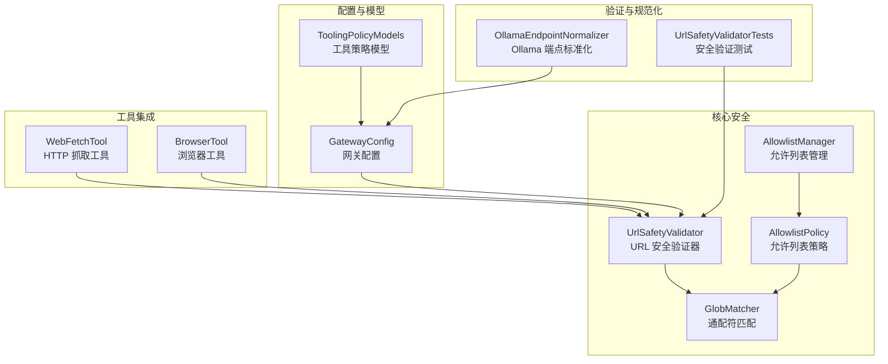
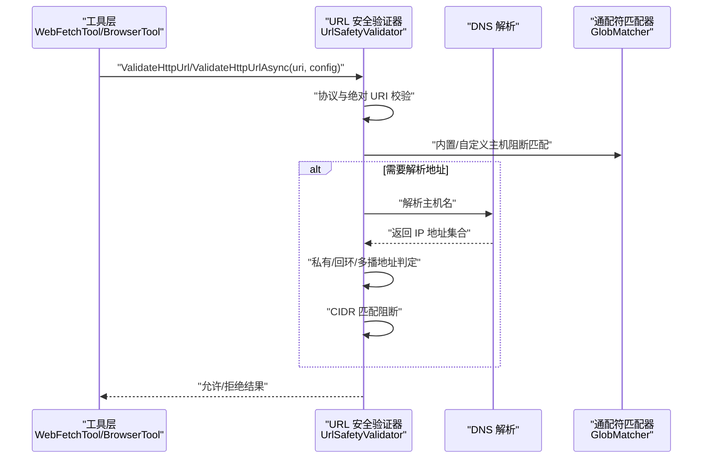
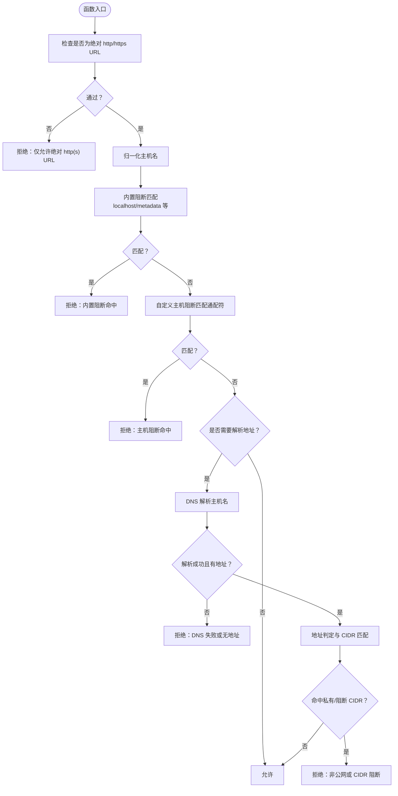
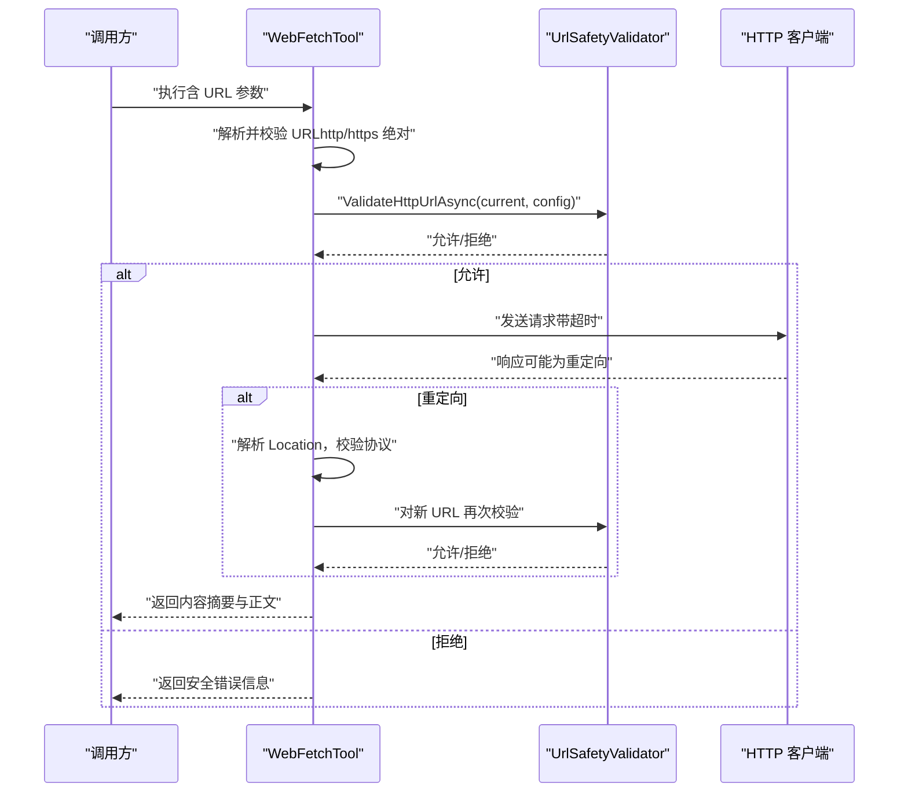
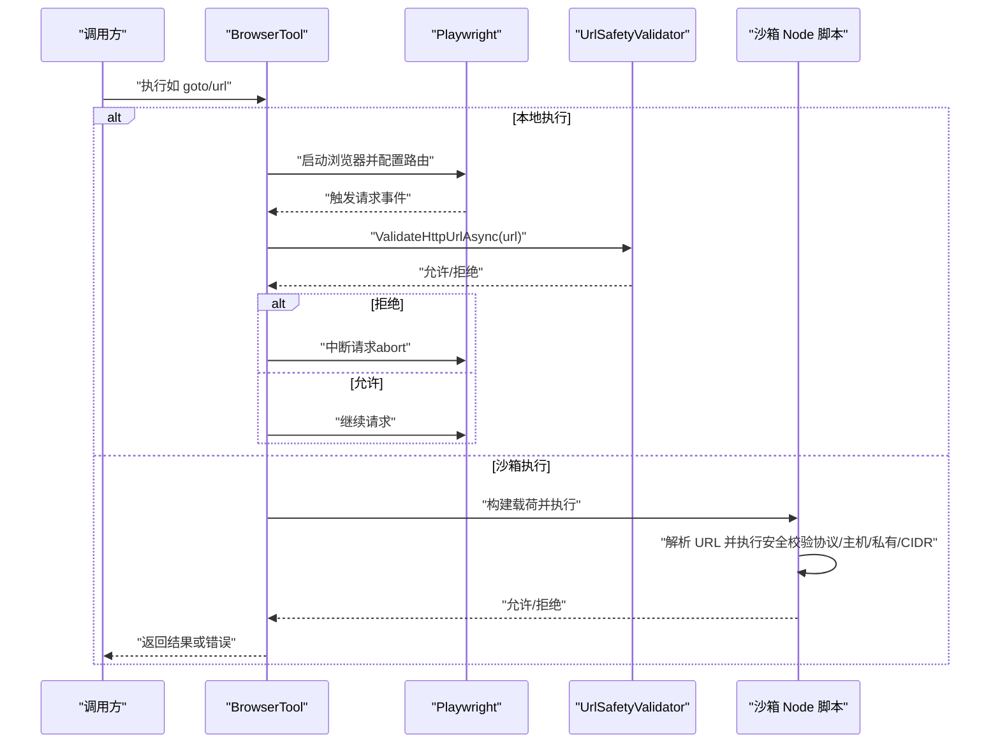
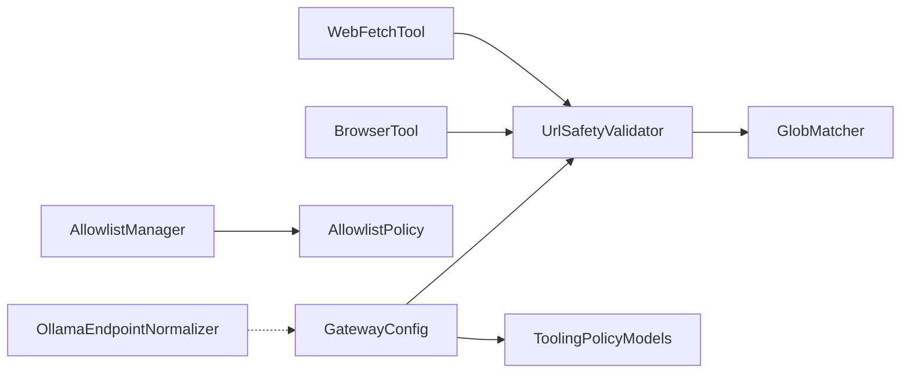

# URL 安全验证

<cite>
**本文档引用的文件**
- [UrlSafetyValidator.cs](file://src/OpenClaw.Core/Security/UrlSafetyValidator.cs)
- [OllamaEndpointNormalizer.cs](file://src/OpenClaw.Core/Validation/OllamaEndpointNormalizer.cs)
- [GatewayConfig.cs](file://src/OpenClaw.Core/Models/GatewayConfig.cs)
- [WebFetchTool.cs](file://src/OpenClaw.Agent/Tools/WebFetchTool.cs)
- [BrowserTool.cs](file://src/OpenClaw.Agent/Tools/BrowserTool.cs)
- [UrlSafetyValidatorTests.cs](file://src/OpenClaw.Tests/UrlSafetyValidatorTests.cs)
- [GlobMatcher.cs](file://src/OpenClaw.Core/Security/GlobMatcher.cs)
- [AllowlistPolicy.cs](file://src/OpenClaw.Core/Security/AllowlistPolicy.cs)
- [AllowlistManager.cs](file://src/OpenClaw.Core/Security/AllowlistManager.cs)
- [ToolingPolicyModels.cs](file://src/OpenClaw.Core/Models/ToolingPolicyModels.cs)
</cite>

## 目录
1. [简介](#简介)
2. [项目结构](#项目结构)
3. [核心组件](#核心组件)
4. [架构总览](#架构总览)
5. [详细组件分析](#详细组件分析)
6. [依赖关系分析](#依赖关系分析)
7. [性能考量](#性能考量)
8. [故障排查指南](#故障排查指南)
9. [结论](#结论)
10. [附录](#附录)

## 简介
本技术文档围绕 URL 安全验证系统进行深入解析，涵盖 URL 安全验证机制、域名白名单、协议限制、CIDR 阻断、DNS 解析与地址判定、重定向防护、浏览器沙箱安全、Ollama 端点标准化等内容。文档同时提供验证流程图、配置示例与安全规则模板，并给出 URL 安全配置指南、常见攻击防护建议与合规性检查要点，帮助读者在不直接暴露源码的前提下理解系统设计与最佳实践。

## 项目结构
与 URL 安全验证相关的核心模块分布于以下位置：
- 安全策略与验证：OpenClaw.Core/Security（UrlSafetyValidator、GlobMatcher、AllowlistPolicy、AllowlistManager）
- 工具层集成：OpenClaw.Agent/Tools（WebFetchTool、BrowserTool）
- 配置模型：OpenClaw.Core/Models（GatewayConfig、ToolingPolicyModels）
- 验证与规范化：OpenClaw.Core/Validation（OllamaEndpointNormalizer）
- 测试用例：OpenClaw.Tests（UrlSafetyValidatorTests）

**图表来源**
- [UrlSafetyValidator.cs:1-168](file://src/OpenClaw.Core/Security/UrlSafetyValidator.cs#L1-L168)
- [GlobMatcher.cs:1-89](file://src/OpenClaw.Core/Security/GlobMatcher.cs#L1-L89)
- [AllowlistPolicy.cs:1-43](file://src/OpenClaw.Core/Security/AllowlistPolicy.cs#L1-L43)
- [AllowlistManager.cs:1-126](file://src/OpenClaw.Core/Security/AllowlistManager.cs#L1-L126)
- [WebFetchTool.cs:1-212](file://src/OpenClaw.Agent/Tools/WebFetchTool.cs#L1-L212)
- [BrowserTool.cs:1-696](file://src/OpenClaw.Agent/Tools/BrowserTool.cs#L1-L696)
- [GatewayConfig.cs:331-384](file://src/OpenClaw.Core/Models/GatewayConfig.cs#L331-L384)
- [ToolingPolicyModels.cs:1-45](file://src/OpenClaw.Core/Models/ToolingPolicyModels.cs#L1-L45)
- [OllamaEndpointNormalizer.cs:1-39](file://src/OpenClaw.Core/Validation/OllamaEndpointNormalizer.cs#L1-L39)
- [UrlSafetyValidatorTests.cs:1-78](file://src/OpenClaw.Tests/UrlSafetyValidatorTests.cs#L1-L78)

**章节来源**
- [UrlSafetyValidator.cs:1-168](file://src/OpenClaw.Core/Security/UrlSafetyValidator.cs#L1-L168)
- [WebFetchTool.cs:1-212](file://src/OpenClaw.Agent/Tools/WebFetchTool.cs#L1-L212)
- [BrowserTool.cs:1-696](file://src/OpenClaw.Agent/Tools/BrowserTool.cs#L1-L696)
- [GatewayConfig.cs:331-384](file://src/OpenClaw.Core/Models/GatewayConfig.cs#L331-L384)
- [OllamaEndpointNormalizer.cs:1-39](file://src/OpenClaw.Core/Validation/OllamaEndpointNormalizer.cs#L1-L39)
- [UrlSafetyValidatorTests.cs:1-78](file://src/OpenClaw.Tests/UrlSafetyValidatorTests.cs#L1-L78)

## 核心组件
- URL 安全验证器：负责协议校验、主机名归一化、内置阻断模式匹配、通配符阻断列表、DNS 解析与私有网络地址判定、CIDR 匹配阻断等。
- 通配符匹配器：支持简单通配符“*”的高效匹配算法，避免字符串分割分配。
- 允许列表策略与管理：提供“严格/传统”两种允许列表语义，动态持久化通道允许列表。
- 工具集成：WebFetchTool 与 BrowserTool 在发起请求前调用 URL 安全验证器，确保仅允许安全的 http/https 绝对 URL。
- Ollama 端点标准化：将 /v1 路径兼容转换为标准基地址，便于统一管理本地推理端点。
- 配置模型：UrlSafetyConfig 提供启用开关、私有网络阻断、主机阻断列表、CIDR 列表等策略参数；ToolingConfig 嵌套 UrlSafetyConfig 以影响工具行为。

**章节来源**
- [UrlSafetyValidator.cs:17-168](file://src/OpenClaw.Core/Security/UrlSafetyValidator.cs#L17-L168)
- [GlobMatcher.cs:3-89](file://src/OpenClaw.Core/Security/GlobMatcher.cs#L3-L89)
- [AllowlistPolicy.cs:9-43](file://src/OpenClaw.Core/Security/AllowlistPolicy.cs#L9-L43)
- [AllowlistManager.cs:19-126](file://src/OpenClaw.Core/Security/AllowlistManager.cs#L19-L126)
- [WebFetchTool.cs:18-31](file://src/OpenClaw.Agent/Tools/WebFetchTool.cs#L18-L31)
- [BrowserTool.cs:17-275](file://src/OpenClaw.Agent/Tools/BrowserTool.cs#L17-L275)
- [GatewayConfig.cs:371-384](file://src/OpenClaw.Core/Models/GatewayConfig.cs#L371-L384)
- [OllamaEndpointNormalizer.cs:3-39](file://src/OpenClaw.Core/Validation/OllamaEndpointNormalizer.cs#L3-L39)

## 架构总览
下图展示了从工具到安全验证器再到 DNS 解析的整体调用链路，以及浏览器沙箱侧的 URL 安全校验逻辑。

**图表来源**
- [WebFetchTool.cs:64-70](file://src/OpenClaw.Agent/Tools/WebFetchTool.cs#L64-L70)
- [BrowserTool.cs:496-526](file://src/OpenClaw.Agent/Tools/BrowserTool.cs#L496-L526)
- [UrlSafetyValidator.cs:27-111](file://src/OpenClaw.Core/Security/UrlSafetyValidator.cs#L27-L111)
- [GlobMatcher.cs:9-63](file://src/OpenClaw.Core/Security/GlobMatcher.cs#L9-L63)

## 详细组件分析

### URL 安全验证器（UrlSafetyValidator）
- 功能要点
  - 协议限制：仅允许 http/https 的绝对 URL。
  - 主机名归一化：去除尾部点号、转小写，处理 IPv6 方括号。
  - 内置阻断：localhost、*.localhost、metadata、metadata.google.internal。
  - 自定义阻断：支持通配符主机阻断列表（BlockedHostGlobs）。
  - 私有网络阻断：可选阻断 loopback、私有、链路本地、多播等非公网地址。
  - CIDR 阻断：对解析出的地址进行 CIDR 匹配阻断。
  - DNS 解析：异步解析主机名，异常时返回拒绝结果。
  - 结果封装：返回 Allow/Deny 及原因，支持转换为工具错误消息。

- 关键算法
  - 非公网地址判定：覆盖 IPv4/IPv6 的 loopback、私有、链路本地、多播、组播范围。
  - CIDR 匹配：支持 IPv4/IPv6，按前缀长度进行掩码匹配。
  - 通配符匹配：快速路径优化，避免分配，支持“*”。

**图表来源**
- [UrlSafetyValidator.cs:27-135](file://src/OpenClaw.Core/Security/UrlSafetyValidator.cs#L27-L135)
- [GlobMatcher.cs:9-63](file://src/OpenClaw.Core/Security/GlobMatcher.cs#L9-L63)

**章节来源**
- [UrlSafetyValidator.cs:17-168](file://src/OpenClaw.Core/Security/UrlSafetyValidator.cs#L17-L168)
- [GlobMatcher.cs:3-89](file://src/OpenClaw.Core/Security/GlobMatcher.cs#L3-L89)

### 通配符匹配器（GlobMatcher）
- 支持“*”作为任意序列匹配，大小写可配置。
- 快速路径：无通配符时直接比较；使用 Span 避免 Split 分割带来的内存分配。
- 允许/拒绝评估：拒绝优先，空允许列表默认拒绝。

**章节来源**
- [GlobMatcher.cs:3-89](file://src/OpenClaw.Core/Security/GlobMatcher.cs#L3-L89)

### 允许列表策略与管理（AllowlistPolicy/AllowlistManager）
- 允许列表语义
  - 传统语义：空列表即允许全部（历史行为）。
  - 严格语义：空列表即拒绝全部，需显式“*”或具体条目。
- 动态持久化
  - 每个频道独立存储允许列表文件，动态文件优先于静态配置。
  - 并发安全：基于频道 ID 的锁，原子写入临时文件后替换。

**章节来源**
- [AllowlistPolicy.cs:9-43](file://src/OpenClaw.Core/Security/AllowlistPolicy.cs#L9-L43)
- [AllowlistManager.cs:19-126](file://src/OpenClaw.Core/Security/AllowlistManager.cs#L19-L126)

### 工具集成：WebFetchTool
- 行为
  - 参数校验：仅接受 http/https 绝对 URL。
  - 请求循环：支持最多固定次数的重定向，重定向前进行安全校验。
  - 内容提取：HTML 时剥离标签与脚本，提取可读文本。
  - 错误处理：超时、HTTP 失败、重定向缺失 Location 等场景返回明确错误。
- 安全控制
  - 每次请求前调用 UrlSafetyValidator.ValidateHttpUrlAsync 进行安全校验。
  - 重定向目标同样进行协议与安全校验，防止跳转至非 http/https。

**图表来源**
- [WebFetchTool.cs:48-159](file://src/OpenClaw.Agent/Tools/WebFetchTool.cs#L48-L159)
- [UrlSafetyValidator.cs:27-111](file://src/OpenClaw.Core/Security/UrlSafetyValidator.cs#L27-L111)

**章节来源**
- [WebFetchTool.cs:18-31](file://src/OpenClaw.Agent/Tools/WebFetchTool.cs#L18-L31)
- [WebFetchTool.cs:48-159](file://src/OpenClaw.Agent/Tools/WebFetchTool.cs#L48-L159)

### 工具集成：BrowserTool（浏览器）
- 行为
  - 支持 goto、click、fill、get_text、evaluate、screenshot 等动作。
  - 本地执行与沙箱执行双模式，沙箱中使用 Node.js 脚本执行。
- 安全控制
  - 页面路由拦截：对所有资源请求进行安全校验，拒绝则中断请求。
  - 沙箱侧校验：Node 脚本内复用与服务端一致的 URL 安全校验逻辑（协议、主机、私有网络、CIDR）。
  - evaluate 动作受配置开关控制，避免在高风险场景执行任意脚本。

**图表来源**
- [BrowserTool.cs:496-526](file://src/OpenClaw.Agent/Tools/BrowserTool.cs#L496-L526)
- [BrowserTool.cs:580-696](file://src/OpenClaw.Agent/Tools/BrowserTool.cs#L580-L696)
- [UrlSafetyValidator.cs:27-111](file://src/OpenClaw.Core/Security/UrlSafetyValidator.cs#L27-L111)

**章节来源**
- [BrowserTool.cs:17-275](file://src/OpenClaw.Agent/Tools/BrowserTool.cs#L17-L275)
- [BrowserTool.cs:496-526](file://src/OpenClaw.Agent/Tools/BrowserTool.cs#L496-L526)
- [BrowserTool.cs:580-696](file://src/OpenClaw.Agent/Tools/BrowserTool.cs#L580-L696)

### Ollama 端点标准化（OllamaEndpointNormalizer）
- 默认基地址：http://127.0.0.1:11434。
- 规范化逻辑：
  - 若为空或无效 URI，返回默认地址与“非兼容端点”标记。
  - 若路径为 /v1，则移除 /v1，返回标准化基地址与“使用兼容端点”标记。
  - 否则返回原始地址与“非兼容端点”标记。

**章节来源**
- [OllamaEndpointNormalizer.cs:3-39](file://src/OpenClaw.Core/Validation/OllamaEndpointNormalizer.cs#L3-L39)

### 配置模型与策略
- UrlSafetyConfig
  - Enabled：启用/禁用 URL 安全策略。
  - BlockPrivateNetworkTargets：阻断私有网络目标。
  - BlockedHostGlobs：额外主机阻断通配符列表。
  - BlockedCidrs：额外 CIDR 阻断列表。
- ToolingConfig.UrlSafety：嵌套 UrlSafetyConfig，影响浏览器与抓取工具的行为。
- Toolset/ToolPreset：工具集与预设配置，用于控制工具可用性与审批需求。

**章节来源**
- [GatewayConfig.cs:371-384](file://src/OpenClaw.Core/Models/GatewayConfig.cs#L371-L384)
- [GatewayConfig.cs:453](file://src/OpenClaw.Core/Models/GatewayConfig.cs#L453)
- [ToolingPolicyModels.cs:3-45](file://src/OpenClaw.Core/Models/ToolingPolicyModels.cs#L3-L45)

## 依赖关系分析
- 工具层依赖安全验证器：WebFetchTool 与 BrowserTool 在执行前均调用 UrlSafetyValidator。
- 安全验证器依赖通配符匹配器：用于内置与自定义主机阻断匹配。
- 允许列表管理器依赖允许列表策略：根据语义决定允许/拒绝。
- 配置模型贯穿：UrlSafetyConfig 由 ToolingConfig 嵌入，最终影响工具行为。
- Ollama 端点标准化与配置模型解耦，但可被上层逻辑用于统一本地推理端点。

**图表来源**
- [WebFetchTool.cs:64-70](file://src/OpenClaw.Agent/Tools/WebFetchTool.cs#L64-L70)
- [BrowserTool.cs:500-508](file://src/OpenClaw.Agent/Tools/BrowserTool.cs#L500-L508)
- [UrlSafetyValidator.cs:76-89](file://src/OpenClaw.Core/Security/UrlSafetyValidator.cs#L76-L89)
- [GlobMatcher.cs:9-63](file://src/OpenClaw.Core/Security/GlobMatcher.cs#L9-L63)
- [AllowlistManager.cs:50-51](file://src/OpenClaw.Core/Security/AllowlistManager.cs#L50-L51)
- [AllowlistPolicy.cs:18-40](file://src/OpenClaw.Core/Security/AllowlistPolicy.cs#L18-L40)
- [GatewayConfig.cs:371-384](file://src/OpenClaw.Core/Models/GatewayConfig.cs#L371-L384)
- [OllamaEndpointNormalizer.cs:17-37](file://src/OpenClaw.Core/Validation/OllamaEndpointNormalizer.cs#L17-L37)

**章节来源**
- [UrlSafetyValidator.cs:27-135](file://src/OpenClaw.Core/Security/UrlSafetyValidator.cs#L27-L135)
- [AllowlistManager.cs:19-126](file://src/OpenClaw.Core/Security/AllowlistManager.cs#L19-L126)

## 性能考量
- 通配符匹配采用 Span 与快速路径，避免字符串分割与数组分配，适合高频调用。
- DNS 解析为异步操作，避免阻塞主线程；失败时快速返回拒绝，减少后续开销。
- 浏览器工具在沙箱中执行 URL 校验，避免在主进程中进行复杂网络操作。
- 工具层对重定向次数进行上限控制，防止无限循环与资源耗尽。

[本节为通用性能讨论，无需特定文件来源]

## 故障排查指南
- 常见问题与定位
  - “仅允许绝对 http(s) URL”：确认传入 URL 是否为 http/https 且为绝对地址。
  - “DNS 解析失败/无地址”：检查网络连通性、DNS 配置与解析超时设置。
  - “主机阻断命中”：检查 BlockedHostGlobs 是否包含目标主机的通配符模式。
  - “非公网地址/私有网络阻断”：确认 BlockPrivateNetworkTargets 开关与目标地址范围。
  - “CIDR 阻断命中”：核对 BlockedCidrs 中是否包含目标地址所属网段。
  - “重定向协议不符”：确认重定向目标是否为 http/https，否则会被拒绝。
  - “浏览器 evaluate 被禁用”：检查 Tooling.AllowBrowserEvaluate 配置。
- 测试参考
  - 使用测试用例验证默认阻断、自定义主机阻断、IPv6 CIDR 阻断、WebFetchTool 与 BrowserTool 的安全拦截行为。

**章节来源**
- [UrlSafetyValidatorTests.cs:12-78](file://src/OpenClaw.Tests/UrlSafetyValidatorTests.cs#L12-L78)
- [WebFetchTool.cs:64-98](file://src/OpenClaw.Agent/Tools/WebFetchTool.cs#L64-L98)
- [BrowserTool.cs:615-619](file://src/OpenClaw.Agent/Tools/BrowserTool.cs#L615-L619)

## 结论
该 URL 安全验证系统通过严格的协议限制、主机与 CIDR 阻断、DNS 解析与地址判定、重定向防护以及浏览器沙箱安全，有效降低了 SSRF、内网探测、重定向攻击等风险。结合允许列表策略与动态管理，系统在保证安全的同时具备良好的可运维性。配合 Ollama 端点标准化与工具层统一接入，形成从配置到执行的闭环安全控制。

[本节为总结性内容，无需特定文件来源]

## 附录

### URL 安全配置指南
- 基本策略
  - Enabled：默认开启，确保所有外联请求均受控。
  - BlockPrivateNetworkTargets：默认开启，阻断 loopback、私有、链路本地、多播等非公网地址。
  - BlockedHostGlobs：添加内部域、元数据服务等通配符阻断项。
  - BlockedCidrs：阻断已知内网网段或可疑网段。
- 工具层配置
  - ToolingConfig.UrlSafety：在 Tooling 层面统一注入 UrlSafetyConfig，影响 WebFetchTool 与 BrowserTool。
  - BrowserTool：可通过 AllowBrowserEvaluate 控制 evaluate 动作；沙箱模式下同样应用安全策略。
- Ollama 端点
  - 使用 OllamaEndpointNormalizer 将 /v1 路径转换为标准基地址，便于统一管理本地推理服务。

**章节来源**
- [GatewayConfig.cs:371-384](file://src/OpenClaw.Core/Models/GatewayConfig.cs#L371-L384)
- [GatewayConfig.cs:453](file://src/OpenClaw.Core/Models/GatewayConfig.cs#L453)
- [BrowserTool.cs:615-619](file://src/OpenClaw.Agent/Tools/BrowserTool.cs#L615-L619)
- [OllamaEndpointNormalizer.cs:17-37](file://src/OpenClaw.Core/Validation/OllamaEndpointNormalizer.cs#L17-L37)

### 常见攻击与防护
- SSRF（服务器端请求伪造）
  - 防护：仅允许 http/https 绝对 URL；阻断私有网络与元数据服务；DNS 解析失败即拒绝。
- 内网探测与访问
  - 防护：BlockPrivateNetworkTargets 与 CIDR 阻断；内置阻断列表覆盖 metadata 等敏感主机。
- 重定向攻击
  - 防护：限制重定向协议为 http/https；对每次重定向目标再次进行安全校验。
- 浏览器高危操作
  - 防护：evaluate 动作默认关闭或受控；沙箱中同样执行安全校验。
- 反向代理与信任边界
  - 建议：结合网关安全配置（如 KnownProxies、TrustForwardedHeaders）与严格公共绑定策略，降低代理绕过风险。

[本节为通用安全建议，无需特定文件来源]

### 合规性检查要点
- 最小权限原则：仅开放必要的主机与 CIDR；默认阻断私有网络。
- 可审计性：记录安全拒绝原因与工具错误消息，便于审计与溯源。
- 配置一致性：在 Tooling 层统一注入 UrlSafetyConfig，避免各工具策略不一致。
- 动态更新：通过 AllowlistManager 动态调整允许列表，满足业务变化需求。

[本节为通用合规建议，无需特定文件来源]