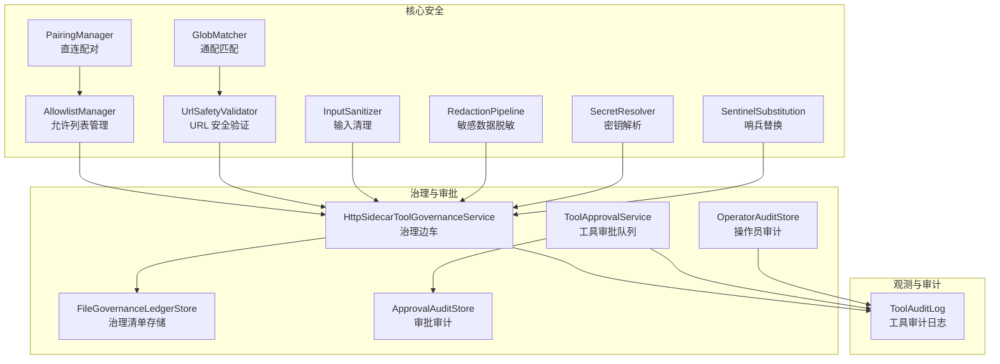
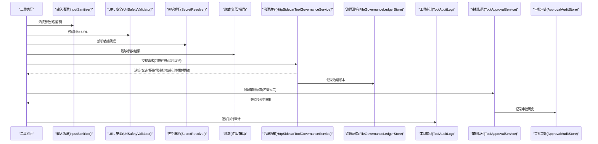
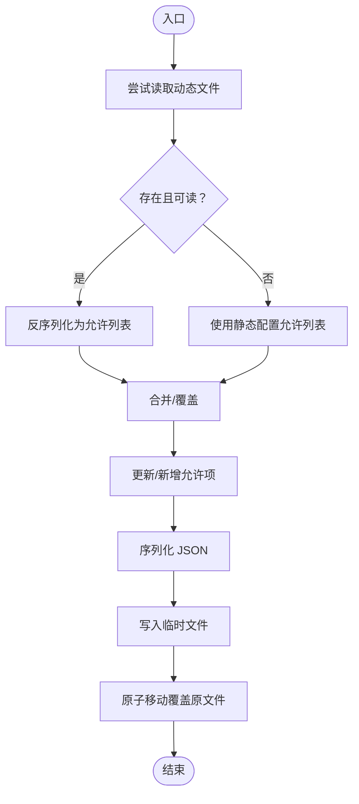
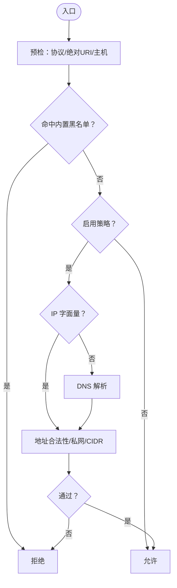
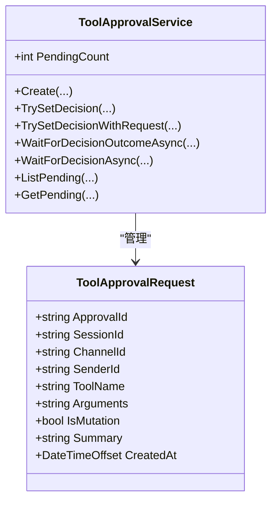
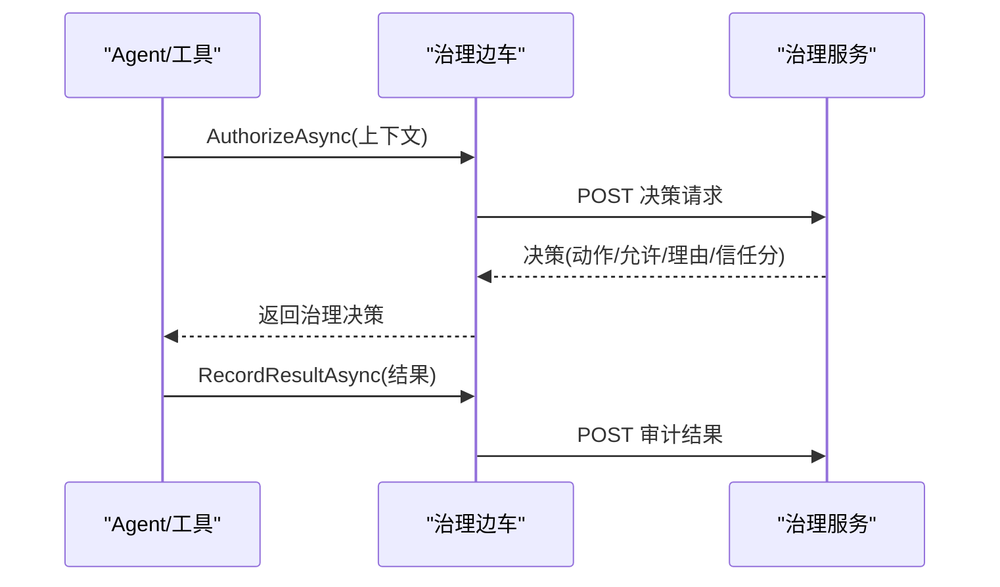
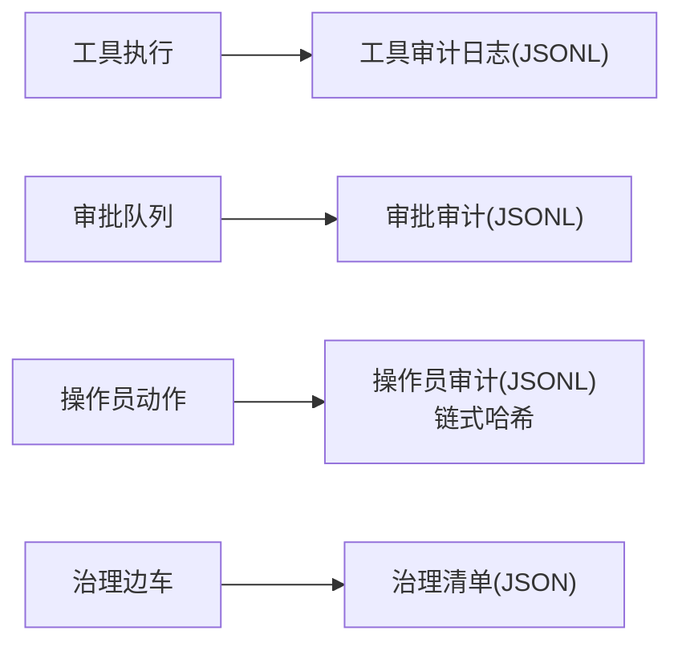
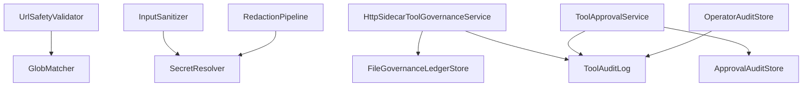

# 安全和治理

<cite>
**本文引用的文件**
- [AllowlistManager.cs](file://src/OpenClaw.Core/Src/OpenClaw.Core/Security/AllowlistManager.cs)
- [UrlSafetyValidator.cs](file://src/OpenClaw.Core/Src/OpenClaw.Core/Security/UrlSafetyValidator.cs)
- [InputSanitizer.cs](file://src/OpenClaw.Core/Src/OpenClaw.Core/Security/InputSanitizer.cs)
- [GlobMatcher.cs](file://src/OpenClaw.Core/Src/OpenClaw.Core/Security/GlobMatcher.cs)
- [SecretResolver.cs](file://src/OpenClaw.Core/Src/OpenClaw.Core/Security/SecretResolver.cs)
- [RedactionPipeline.cs](file://src/OpenClaw.Core/Src/OpenClaw.Core/Security/RedactionPipeline.cs)
- [SentinelSubstitution.cs](file://src/OpenClaw.Core/Src/OpenClaw.Core/Security/SentinelSubstitution.cs)
- [PairingManager.cs](file://src/OpenClaw.Core/Src/OpenClaw.Core/Security/PairingManager.cs)
- [ToolApprovalService.cs](file://src/OpenClaw.Core/Src/OpenClaw.Core/Pipeline/ToolApprovalService.cs)
- [HttpSidecarToolGovernanceService.cs](file://src/OpenClaw.Core/Src/OpenClaw.Core/Governance/HttpSidecarToolGovernanceService.cs)
- [FileGovernanceLedgerStore.cs](file://src/OpenClaw.Core/Src/OpenClaw.Core/Features/FileGovernanceLedgerStore.cs)
- [ToolAuditLog.cs](file://src/OpenClaw.Core/Src/OpenClaw.Core/Observability/ToolAuditLog.cs)
- [ApprovalAuditStore.cs](file://src/OpenClaw.Gateway/Src/OpenClaw.Gateway/ApprovalAuditStore.cs)
- [OperatorAuditStore.cs](file://src/OpenClaw.Gateway/Src/OpenClaw.Gateway/OperatorAuditStore.cs)
</cite>

## 目录
1. [引言](#引言)
2. [项目结构](#项目结构)
3. [核心组件](#核心组件)
4. [架构总览](#架构总览)
5. [详细组件分析](#详细组件分析)
6. [依赖关系分析](#依赖关系分析)
7. [性能考量](#性能考量)
8. [故障排查指南](#故障排查指南)
9. [结论](#结论)
10. [附录](#附录)

## 引言
本文件面向安全与治理体系，系统化梳理并解释以下主题：安全架构设计、访问控制机制、审计日志系统、工具审批流程；详述允许列表管理、URL 安全验证、输入清理、敏感数据保护等安全措施；文档化工具审批服务、治理清单、合规性检查等治理功能；阐述安全策略配置、威胁防护、事件响应机制；提供安全最佳实践、漏洞防护、合规性要求、安全配置指南、监控告警设置与应急响应流程，并解释与插件系统、工具执行的安全集成方式。

## 项目结构
安全与治理相关能力主要分布在以下模块：
- 核心安全（OpenClaw.Core.Security）：允许列表、URL 安全、输入清理、敏感数据脱敏、密钥解析、通配匹配器、哨兵替换占位等。
- 治理与审批（OpenClaw.Core.Governance、OpenClaw.Core.Pipeline、OpenClaw.Gateway）：工具治理服务（HTTP 边车）、治理清单存储、工具审批队列、审批审计、操作员审计。
- 观测与审计（OpenClaw.Core.Observability、OpenClaw.Gateway）：工具执行审计日志、审批历史记录、操作员链式审计。

**图表来源**
- [AllowlistManager.cs:1-126](file://src/OpenClaw.Core/Src/OpenClaw.Core/Security/AllowlistManager.cs#L1-L126)
- [UrlSafetyValidator.cs:1-219](file://src/OpenClaw.Core/Src/OpenClaw.Core/Security/UrlSafetyValidator.cs#L1-L219)
- [InputSanitizer.cs:1-84](file://src/OpenClaw.Core/Src/OpenClaw.Core/Security/InputSanitizer.cs#L1-L84)
- [RedactionPipeline.cs:1-131](file://src/OpenClaw.Core/Src/OpenClaw.Core/Security/RedactionPipeline.cs#L1-L131)
- [SecretResolver.cs:1-66](file://src/OpenClaw.Core/Src/OpenClaw.Core/Security/SecretResolver.cs#L1-L66)
- [GlobMatcher.cs:1-89](file://src/OpenClaw.Core/Src/OpenClaw.Core/Security/GlobMatcher.cs#L1-L89)
- [SentinelSubstitution.cs:1-38](file://src/OpenClaw.Core/Src/OpenClaw.Core/Security/SentinelSubstitution.cs#L1-L38)
- [PairingManager.cs:1-211](file://src/OpenClaw.Core/Src/OpenClaw.Core/Security/PairingManager.cs#L1-L211)
- [HttpSidecarToolGovernanceService.cs:1-236](file://src/OpenClaw.Core/Src/OpenClaw.Core/Governance/HttpSidecarToolGovernanceService.cs#L1-L236)
- [ToolApprovalService.cs:1-265](file://src/OpenClaw.Core/Src/OpenClaw.Core/Pipeline/ToolApprovalService.cs#L1-L265)
- [FileGovernanceLedgerStore.cs:1-285](file://src/OpenClaw.Core/Src/OpenClaw.Core/Features/FileGovernanceLedgerStore.cs#L1-L285)
- [ApprovalAuditStore.cs:1-126](file://src/OpenClaw.Gateway/Src/OpenClaw.Gateway/ApprovalAuditStore.cs#L1-L126)
- [OperatorAuditStore.cs:1-195](file://src/OpenClaw.Gateway/Src/OpenClaw.Gateway/OperatorAuditStore.cs#L1-L195)
- [ToolAuditLog.cs:1-125](file://src/OpenClaw.Core/Src/OpenClaw.Core/Observability/ToolAuditLog.cs#L1-L125)

**章节来源**
- [AllowlistManager.cs:1-126](file://src/OpenClaw.Core/Src/OpenClaw.Core/Security/AllowlistManager.cs#L1-L126)
- [UrlSafetyValidator.cs:1-219](file://src/OpenClaw.Core/Src/OpenClaw.Core/Security/UrlSafetyValidator.cs#L1-L219)
- [InputSanitizer.cs:1-84](file://src/OpenClaw.Core/Src/OpenClaw.Core/Security/InputSanitizer.cs#L1-L84)
- [RedactionPipeline.cs:1-131](file://src/OpenClaw.Core/Src/OpenClaw.Core/Security/RedactionPipeline.cs#L1-L131)
- [SecretResolver.cs:1-66](file://src/OpenClaw.Core/Src/OpenClaw.Core/Security/SecretResolver.cs#L1-L66)
- [GlobMatcher.cs:1-89](file://src/OpenClaw.Core/Src/OpenClaw.Core/Security/GlobMatcher.cs#L1-L89)
- [SentinelSubstitution.cs:1-38](file://src/OpenClaw.Core/Src/OpenClaw.Core/Security/SentinelSubstitution.cs#L1-L38)
- [PairingManager.cs:1-211](file://src/OpenClaw.Core/Src/OpenClaw.Core/Security/PairingManager.cs#L1-L211)
- [HttpSidecarToolGovernanceService.cs:1-236](file://src/OpenClaw.Core/Src/OpenClaw.Core/Governance/HttpSidecarToolGovernanceService.cs#L1-L236)
- [ToolApprovalService.cs:1-265](file://src/OpenClaw.Core/Src/OpenClaw.Core/Pipeline/ToolApprovalService.cs#L1-L265)
- [FileGovernanceLedgerStore.cs:1-285](file://src/OpenClaw.Core/Src/OpenClaw.Core/Features/FileGovernanceLedgerStore.cs#L1-L285)
- [ApprovalAuditStore.cs:1-126](file://src/OpenClaw.Gateway/Src/OpenClaw.Gateway/ApprovalAuditStore.cs#L1-L126)
- [OperatorAuditStore.cs:1-195](file://src/OpenClaw.Gateway/Src/OpenClaw.Gateway/OperatorAuditStore.cs#L1-L195)
- [ToolAuditLog.cs:1-125](file://src/OpenClaw.Core/Src/OpenClaw.Core/Observability/ToolAuditLog.cs#L1-L125)

## 核心组件
- 允许列表管理：按通道持久化动态允许列表，支持并发写入与原子落盘，优先动态覆盖静态配置。
- URL 安全验证：校验绝对 http(s) URL、内置黑名单主机、可选私网阻断与 CIDR 阻断、DNS 解析与地址判定。
- 输入清理：检测并阻止 shell 元字符注入、剥离 CRLF、校验内存键与 IMAP 文件夹名安全性。
- 敏感数据保护：多级脱敏流水线，支持会话级脱敏、参数/结果/失败信息脱敏、默认基础密钥识别规则。
- 密钥解析：统一解析 env/raw/裸字符串，避免生产环境明文硬编码。
- 通配匹配：高性能通配匹配器，支持允许/拒绝评估。
- 哨兵替换：在执行与持久化之间进行参数替换，便于审计与合规。
- 直连配对：生成一次性验证码、固定时间比较、冷却与过期控制，批准名单持久化。
- 工具审批服务：内存审批队列，支持超时、等待决策、权限校验、统计指标。
- 治理边车：调用外部治理服务进行授权决策、审计回传、失败闭合/开合策略。
- 治理清单存储：文件型治理账本，支持查询、撤销、安全路径编码。
- 审计与可观测：工具执行审计日志（JSONL）、审批历史（JSONL）、操作员链式审计（哈希链）。

**章节来源**
- [AllowlistManager.cs:1-126](file://src/OpenClaw.Core/Src/OpenClaw.Core/Security/AllowlistManager.cs#L1-L126)
- [UrlSafetyValidator.cs:1-219](file://src/OpenClaw.Core/Src/OpenClaw.Core/Security/UrlSafetyValidator.cs#L1-L219)
- [InputSanitizer.cs:1-84](file://src/OpenClaw.Core/Src/OpenClaw.Core/Security/InputSanitizer.cs#L1-L84)
- [RedactionPipeline.cs:1-131](file://src/OpenClaw.Core/Src/OpenClaw.Core/Security/RedactionPipeline.cs#L1-L131)
- [SecretResolver.cs:1-66](file://src/OpenClaw.Core/Src/OpenClaw.Core/Security/SecretResolver.cs#L1-L66)
- [GlobMatcher.cs:1-89](file://src/OpenClaw.Core/Src/OpenClaw.Core/Security/GlobMatcher.cs#L1-L89)
- [SentinelSubstitution.cs:1-38](file://src/OpenClaw.Core/Src/OpenClaw.Core/Security/SentinelSubstitution.cs#L1-L38)
- [PairingManager.cs:1-211](file://src/OpenClaw.Core/Src/OpenClaw.Core/Security/PairingManager.cs#L1-L211)
- [ToolApprovalService.cs:1-265](file://src/OpenClaw.Core/Src/OpenClaw.Core/Pipeline/ToolApprovalService.cs#L1-L265)
- [HttpSidecarToolGovernanceService.cs:1-236](file://src/OpenClaw.Core/Src/OpenClaw.Core/Governance/HttpSidecarToolGovernanceService.cs#L1-L236)
- [FileGovernanceLedgerStore.cs:1-285](file://src/OpenClaw.Core/Src/OpenClaw.Core/Features/FileGovernanceLedgerStore.cs#L1-L285)
- [ToolAuditLog.cs:1-125](file://src/OpenClaw.Core/Src/OpenClaw.Core/Observability/ToolAuditLog.cs#L1-L125)
- [ApprovalAuditStore.cs:1-126](file://src/OpenClaw.Gateway/Src/OpenClaw.Gateway/ApprovalAuditStore.cs#L1-L126)
- [OperatorAuditStore.cs:1-195](file://src/OpenClaw.Gateway/Src/OpenClaw.Gateway/OperatorAuditStore.cs#L1-L195)

## 架构总览
下图展示从“工具执行”到“治理决策/审计”的端到端流程，强调安全控制点与数据流。

**图表来源**
- [InputSanitizer.cs:1-84](file://src/OpenClaw.Core/Src/OpenClaw.Core/Security/InputSanitizer.cs#L1-L84)
- [UrlSafetyValidator.cs:1-219](file://src/OpenClaw.Core/Src/OpenClaw.Core/Security/UrlSafetyValidator.cs#L1-L219)
- [SecretResolver.cs:1-66](file://src/OpenClaw.Core/Src/OpenClaw.Core/Security/SecretResolver.cs#L1-L66)
- [RedactionPipeline.cs:1-131](file://src/OpenClaw.Core/Src/OpenClaw.Core/Security/RedactionPipeline.cs#L1-L131)
- [SentinelSubstitution.cs:1-38](file://src/OpenClaw.Core/Src/OpenClaw.Core/Security/SentinelSubstitution.cs#L1-L38)
- [HttpSidecarToolGovernanceService.cs:1-236](file://src/OpenClaw.Core/Src/OpenClaw.Core/Governance/HttpSidecarToolGovernanceService.cs#L1-L236)
- [FileGovernanceLedgerStore.cs:1-285](file://src/OpenClaw.Core/Src/OpenClaw.Core/Features/FileGovernanceLedgerStore.cs#L1-L285)
- [ToolAuditLog.cs:1-125](file://src/OpenClaw.Core/Src/OpenClaw.Core/Observability/ToolAuditLog.cs#L1-L125)
- [ToolApprovalService.cs:1-265](file://src/OpenClaw.Core/Src/OpenClaw.Core/Pipeline/ToolApprovalService.cs#L1-L265)
- [ApprovalAuditStore.cs:1-126](file://src/OpenClaw.Gateway/Src/OpenClaw.Gateway/ApprovalAuditStore.cs#L1-L126)

## 详细组件分析

### 允许列表管理（AllowlistManager）
- 功能要点
  - 按通道持久化动态允许列表，文件命名安全化，目录隔离。
  - 读取顺序：动态文件优先于静态配置；动态文件不存在则回退到配置。
  - 并发安全：通道级锁，原子写入（临时文件 + 原子移动），异常时尽力清理临时文件。
  - 支持添加/设置允许来源，自动去重与空白过滤。
- 复杂度与性能
  - 读取：O(1) 文件 IO；序列化反序列化按 JSON 大小线性。
  - 写入：O(n) 合并与去重，但单通道串行，避免竞争。
- 错误处理
  - 文件读写异常记录警告；失败不中断主流程。
- 最佳实践
  - 将动态允许列表用于短期策略调整；长期策略固化在静态配置中。
  - 使用通道维度隔离不同渠道的风险边界。

**图表来源**
- [AllowlistManager.cs:32-84](file://src/OpenClaw.Core/Src/OpenClaw.Core/Security/AllowlistManager.cs#L32-L84)

**章节来源**
- [AllowlistManager.cs:1-126](file://src/OpenClaw.Core/Src/OpenClaw.Core/Security/AllowlistManager.cs#L1-L126)

### URL 安全验证（UrlSafetyValidator）
- 功能要点
  - 仅允许绝对 http/https URL；主机标准化与空白校验。
  - 内置黑名单主机（如 localhost/metadata）；可选阻断私网与 CIDR。
  - 可选 DNS 解析，将 IPv4 映射至 IPv4 以统一判断；支持 IPv6 链路本地/站点本地/组播判定。
  - 提供同步与异步两种接口，异步版本支持取消令牌。
- 复杂度与性能
  - DNS 解析为 O(1) 查询，地址匹配基于 CIDR 的字节掩码计算。
- 错误处理
  - DNS 解析失败返回拒绝；空地址集合返回拒绝；异常记录日志。
- 最佳实践
  - 对高风险工具启用私网阻断与 CIDR 白名单；对只读工具可放宽限制。
  - 在网关层前置校验，减少下游工具暴露面。

**图表来源**
- [UrlSafetyValidator.cs:27-135](file://src/OpenClaw.Core/Src/OpenClaw.Core/Security/UrlSafetyValidator.cs#L27-L135)

**章节来源**
- [UrlSafetyValidator.cs:1-219](file://src/OpenClaw.Core/Src/OpenClaw.Core/Security/UrlSafetyValidator.cs#L1-L219)
- [GlobMatcher.cs:1-89](file://src/OpenClaw.Core/Src/OpenClaw.Core/Security/GlobMatcher.cs#L1-L89)

### 输入清理（InputSanitizer）
- 功能要点
  - 检测 shell 元字符（分号、管道、重定向、美元、括号、尖括号、换行等）并拒绝。
  - 剥离 CRLF，防止 IMAP/SMTP 注入。
  - 校验内存键禁止路径遍历与空字符；IMAP 文件夹名禁止控制字符。
- 复杂度与性能
  - SIMD 加速的字符搜索，近似 O(n)。
- 最佳实践
  - 所有用户输入在进入工具前必须经过清理；对路径类参数严格限定根目录与白名单。

**章节来源**
- [InputSanitizer.cs:1-84](file://src/OpenClaw.Core/Src/OpenClaw.Core/Security/InputSanitizer.cs#L1-L84)

### 敏感数据保护（RedactionPipeline）
- 功能要点
  - 多级脱敏流水线：依次应用各脱敏器。
  - 会话级脱敏：对消息内容、工具调用参数/结果/失败信息进行脱敏。
  - 默认脱敏器：识别 Authorization Bearer、OpenAI 密钥、API Key 字段并替换。
- 复杂度与性能
  - 正则替换按文本长度线性；会话克隆采用 JSON 序列化/反序列化。
- 最佳实践
  - 审计日志仅记录摘要与计数，避免泄露原始敏感数据。
  - 结合哨兵替换，在执行阶段替换真实值，持久化阶段再脱敏。

**章节来源**
- [RedactionPipeline.cs:1-131](file://src/OpenClaw.Core/Src/OpenClaw.Core/Security/RedactionPipeline.cs#L1-L131)

### 密钥解析（SecretResolver）
- 功能要点
  - 统一解析格式：env:VAR、raw:literal、裸变量名（优先环境变量，否则回退字面量）。
  - 生产建议：显式使用 env: 或 raw: 前缀，避免误判。
- 最佳实践
  - 禁止在配置中直接写明文密钥；使用 env: 前缀并确保环境变量存在。
  - 使用 raw: 仅限测试或特殊场景。

**章节来源**
- [SecretResolver.cs:1-66](file://src/OpenClaw.Core/Src/OpenClaw.Core/Security/SecretResolver.cs#L1-L66)

### 哨兵替换（SentinelSubstitution）
- 功能要点
  - 在执行与持久化阶段分别提供替换后的参数，支持是否发生替换标记。
  - 默认实现为“无操作”，便于在未启用替换时保持兼容。
- 最佳实践
  - 与脱敏流水线配合：先替换后脱敏，确保审计与持久化均不可逆。

**章节来源**
- [SentinelSubstitution.cs:1-38](file://src/OpenClaw.Core/Src/OpenClaw.Core/Security/SentinelSubstitution.cs#L1-L38)

### 直连配对（PairingManager）
- 功能要点
  - 生成 6 位验证码（带 TTL），固定时间比较防时序攻击，失败冷却。
  - 手动批准与撤销，批准名单持久化，重启后仍有效。
- 最佳实践
  - 严格限制验证码有效期与失败次数；对管理员手动批准留痕审计。

**章节来源**
- [PairingManager.cs:1-211](file://src/OpenClaw.Core/Src/OpenClaw.Core/Security/PairingManager.cs#L1-L211)

### 工具审批服务（ToolApprovalService）
- 功能要点
  - 内存审批队列：创建审批请求、等待决策、超时处理、权限校验。
  - 支持按通道/发送者过滤待审批列表；记录队列深度指标。
  - 超时默认拒绝，避免长时间悬挂。
- 最佳实践
  - 对高风险/副作用工具强制审批；低风险只读工具可快速放行。
  - 与治理边车联动：治理服务返回“需要审批”时由该队列接管。

**图表来源**
- [ToolApprovalService.cs:49-265](file://src/OpenClaw.Core/Src/OpenClaw.Core/Pipeline/ToolApprovalService.cs#L49-L265)

**章节来源**
- [ToolApprovalService.cs:1-265](file://src/OpenClaw.Core/Src/OpenClaw.Core/Pipeline/ToolApprovalService.cs#L1-L265)

### 治理边车（HttpSidecarToolGovernanceService）
- 功能要点
  - 发送授权请求到外部治理服务，接收动作映射（允许/拒绝/需要审批/仅审计/替换/脱敏）。
  - 可配置超时、审计结果回传、失败闭合/开合策略（高风险强制闭合、低风险只读可开）。
  - 记录决策原因、信任分、策略/规则 ID、评估耗时等。
- 最佳实践
  - 高风险工具与可执行代码/外发数据/文件系统写入一律启用治理。
  - 失败回退策略应根据风险等级与 SLA 设定。

**图表来源**
- [HttpSidecarToolGovernanceService.cs:24-155](file://src/OpenClaw.Core/Src/OpenClaw.Core/Governance/HttpSidecarToolGovernanceService.cs#L24-L155)

**章节来源**
- [HttpSidecarToolGovernanceService.cs:1-236](file://src/OpenClaw.Core/Src/OpenClaw.Core/Governance/HttpSidecarToolGovernanceService.cs#L1-L236)

### 治理清单存储（FileGovernanceLedgerStore）
- 功能要点
  - 文件型账本，按 ID 编码保存治理记录，支持查询、撤销、排序与限制数量。
  - 路径安全校验：禁止越界与危险字符，保证文件系统安全。
- 最佳实践
  - 定期归档与轮转；对撤销操作保留审计轨迹。

**章节来源**
- [FileGovernanceLedgerStore.cs:1-285](file://src/OpenClaw.Core/Src/OpenClaw.Core/Features/FileGovernanceLedgerStore.cs#L1-L285)

### 审计与可观测
- 工具审计日志（ToolAuditLog）
  - JSONL 追加写入，记录时间戳、工具名、会话/通道/发送者、耗时、失败/超时、治理字段等。
  - 不记录原始参数与结果，仅记录字节数，避免泄露敏感信息。
- 审批审计（ApprovalAuditStore）
  - JSONL 记录审批创建与决策事件，包含预览摘要、决策来源与操作者信息。
- 操作员审计（OperatorAuditStore）
  - JSONL 记录操作员行为，支持链式哈希校验（SHA-256），保证不可篡改性。

**图表来源**
- [ToolAuditLog.cs:39-125](file://src/OpenClaw.Core/Src/OpenClaw.Core/Observability/ToolAuditLog.cs#L39-L125)
- [ApprovalAuditStore.cs:7-126](file://src/OpenClaw.Gateway/Src/OpenClaw.Gateway/ApprovalAuditStore.cs#L7-L126)
- [OperatorAuditStore.cs:10-195](file://src/OpenClaw.Gateway/Src/OpenClaw.Gateway/OperatorAuditStore.cs#L10-L195)
- [FileGovernanceLedgerStore.cs:10-285](file://src/OpenClaw.Core/Src/OpenClaw.Core/Features/FileGovernanceLedgerStore.cs#L10-L285)

**章节来源**
- [ToolAuditLog.cs:1-125](file://src/OpenClaw.Core/Src/OpenClaw.Core/Observability/ToolAuditLog.cs#L1-L125)
- [ApprovalAuditStore.cs:1-126](file://src/OpenClaw.Gateway/Src/OpenClaw.Gateway/ApprovalAuditStore.cs#L1-L126)
- [OperatorAuditStore.cs:1-195](file://src/OpenClaw.Gateway/Src/OpenClaw.Gateway/OperatorAuditStore.cs#L1-L195)
- [FileGovernanceLedgerStore.cs:1-285](file://src/OpenClaw.Core/Src/OpenClaw.Core/Features/FileGovernanceLedgerStore.cs#L1-L285)

## 依赖关系分析
- 组件耦合
  - 治理边车依赖 HTTP 客户端与配置；与治理清单存储、审计日志解耦。
  - 审批服务与治理边车可并行工作：边车负责策略与信任，审批负责人工监督。
  - 脱敏与哨兵替换贯穿执行与持久化阶段，降低敏感数据泄露风险。
- 外部依赖
  - DNS 解析（URL 安全验证）、文件系统（允许列表/治理清单/审计文件）。
- 循环依赖
  - 未发现循环依赖；各模块职责清晰，接口契约明确。

**图表来源**
- [UrlSafetyValidator.cs:1-219](file://src/OpenClaw.Core/Src/OpenClaw.Core/Security/UrlSafetyValidator.cs#L1-L219)
- [GlobMatcher.cs:1-89](file://src/OpenClaw.Core/Src/OpenClaw.Core/Security/GlobMatcher.cs#L1-L89)
- [InputSanitizer.cs:1-84](file://src/OpenClaw.Core/Src/OpenClaw.Core/Security/InputSanitizer.cs#L1-L84)
- [SecretResolver.cs:1-66](file://src/OpenClaw.Core/Src/OpenClaw.Core/Security/SecretResolver.cs#L1-L66)
- [RedactionPipeline.cs:1-131](file://src/OpenClaw.Core/Src/OpenClaw.Core/Security/RedactionPipeline.cs#L1-L131)
- [HttpSidecarToolGovernanceService.cs:1-236](file://src/OpenClaw.Core/Src/OpenClaw.Core/Governance/HttpSidecarToolGovernanceService.cs#L1-L236)
- [FileGovernanceLedgerStore.cs:1-285](file://src/OpenClaw.Core/Src/OpenClaw.Core/Features/FileGovernanceLedgerStore.cs#L1-L285)
- [ToolAuditLog.cs:1-125](file://src/OpenClaw.Core/Src/OpenClaw.Core/Observability/ToolAuditLog.cs#L1-L125)
- [ToolApprovalService.cs:1-265](file://src/OpenClaw.Core/Src/OpenClaw.Core/Pipeline/ToolApprovalService.cs#L1-L265)
- [ApprovalAuditStore.cs:1-126](file://src/OpenClaw.Gateway/Src/OpenClaw.Gateway/ApprovalAuditStore.cs#L1-L126)
- [OperatorAuditStore.cs:1-195](file://src/OpenClaw.Gateway/Src/OpenClaw.Gateway/OperatorAuditStore.cs#L1-L195)

**章节来源**
- [UrlSafetyValidator.cs:1-219](file://src/OpenClaw.Core/Src/OpenClaw.Core/Security/UrlSafetyValidator.cs#L1-L219)
- [GlobMatcher.cs:1-89](file://src/OpenClaw.Core/Src/OpenClaw.Core/Security/GlobMatcher.cs#L1-L89)
- [InputSanitizer.cs:1-84](file://src/OpenClaw.Core/Src/OpenClaw.Core/Security/InputSanitizer.cs#L1-L84)
- [SecretResolver.cs:1-66](file://src/OpenClaw.Core/Src/OpenClaw.Core/Security/SecretResolver.cs#L1-L66)
- [RedactionPipeline.cs:1-131](file://src/OpenClaw.Core/Src/OpenClaw.Core/Security/RedactionPipeline.cs#L1-L131)
- [HttpSidecarToolGovernanceService.cs:1-236](file://src/OpenClaw.Core/Src/OpenClaw.Core/Governance/HttpSidecarToolGovernanceService.cs#L1-L236)
- [FileGovernanceLedgerStore.cs:1-285](file://src/OpenClaw.Core/Src/OpenClaw.Core/Features/FileGovernanceLedgerStore.cs#L1-L285)
- [ToolAuditLog.cs:1-125](file://src/OpenClaw.Core/Src/OpenClaw.Core/Observability/ToolAuditLog.cs#L1-L125)
- [ToolApprovalService.cs:1-265](file://src/OpenClaw.Core/Src/OpenClaw.Core/Pipeline/ToolApprovalService.cs#L1-L265)
- [ApprovalAuditStore.cs:1-126](file://src/OpenClaw.Gateway/Src/OpenClaw.Gateway/ApprovalAuditStore.cs#L1-L126)
- [OperatorAuditStore.cs:1-195](file://src/OpenClaw.Gateway/Src/OpenClaw.Gateway/OperatorAuditStore.cs#L1-L195)

## 性能考量
- URL 安全验证
  - DNS 解析为瓶颈；建议缓存解析结果或在批量场景复用。
- 允许列表
  - 动态文件读写为 O(n) 合并与去重；通道粒度并发避免争用。
- 脱敏与替换
  - 正则替换与 JSON 克隆成本与文本长度成正比；建议对长文本分片处理或延迟执行。
- 审计日志
  - JSONL 追加写入为顺序写；注意磁盘空间与轮转策略。

[本节为通用指导，无需特定文件分析]

## 故障排查指南
- URL 安全验证失败
  - 检查主机是否在内置黑名单；确认 DNS 解析可用；核对私网阻断与 CIDR 设置。
- 审批队列无响应
  - 查看队列深度与待审批列表；确认超时设置与决策来源；检查权限匹配。
- 治理边车不可用
  - 核对端点、超时、失败闭合策略；查看审计回传是否成功。
- 审计文件写入失败
  - 检查目录权限、磁盘空间；确认 JSONL 写入门禁与异常日志。
- 密钥解析错误
  - 确认前缀使用正确（env:/raw:）；检查环境变量是否存在。

**章节来源**
- [UrlSafetyValidator.cs:44-58](file://src/OpenClaw.Core/Src/OpenClaw.Core/Security/UrlSafetyValidator.cs#L44-L58)
- [ToolApprovalService.cs:156-215](file://src/OpenClaw.Core/Src/OpenClaw.Core/Pipeline/ToolApprovalService.cs#L156-L215)
- [HttpSidecarToolGovernanceService.cs:94-107](file://src/OpenClaw.Core/Src/OpenClaw.Core/Governance/HttpSidecarToolGovernanceService.cs#L94-L107)
- [ToolAuditLog.cs:86-95](file://src/OpenClaw.Core/Src/OpenClaw.Core/Observability/ToolAuditLog.cs#L86-L95)
- [SecretResolver.cs:36-54](file://src/OpenClaw.Core/Src/OpenClaw.Core/Security/SecretResolver.cs#L36-L54)

## 结论
本体系通过“输入清理 + URL 安全 + 允许列表 + 密钥解析 + 脱敏/替换 + 治理边车 + 审批队列 + 多维审计”的纵深防御，构建了可配置、可观测、可追溯的安全与治理闭环。建议在生产中启用私网阻断、严格的允许列表与治理策略，结合审批队列与审计链路，形成“最小授权、最大透明、可审计、可追溯”的安全基线。

[本节为总结，无需特定文件分析]

## 附录

### 安全最佳实践清单
- 网络与通信
  - 仅允许 http/https；启用私网阻断与 CIDR 白名单；对只读工具可放宽限制。
- 输入与命令
  - 所有输入经清理；禁止 shell 元字符；剥离 CRLF；校验键与路径安全。
- 数据与密钥
  - 禁止明文密钥；使用 env: 前缀；必要时启用哨兵替换与脱敏。
- 访问与身份
  - 使用通道维度允许列表；启用直连配对与批准名单；限制管理员操作。
- 治理与审批
  - 高风险/副作用工具强制治理与审批；失败闭合策略按风险分级。
- 审计与合规
  - 审计日志不记录原始参数/结果；操作员审计启用链式哈希；定期归档与轮转。

[本节为通用指导，无需特定文件分析]

### 配置与部署建议
- 安全策略
  - 在网关层开启 URL 安全验证与允许列表；为每个通道维护独立策略。
  - 治理边车启用失败闭合（高风险）或失败开合（低风险只读）策略。
- 监控与告警
  - 关注审批队列深度、治理决策失败率、审计写入失败计数。
  - 对超时与拒绝事件设置阈值告警。
- 应急响应
  - 快速冻结高风险工具；回滚治理策略；检查审计链完整性；恢复受影响通道的允许列表。

[本节为通用指导，无需特定文件分析]