# 安全架构设计

<cite>
**本文引用的文件**
- [BindAddressClassifier.cs](file://src/OpenClaw.Core/Security/BindAddressClassifier.cs)
- [SecretResolver.cs](file://src/OpenClaw.Core/Security/SecretResolver.cs)
- [AllowlistManager.cs](file://src/OpenClaw.Core/Security/AllowlistManager.cs)
- [AllowlistPolicy.cs](file://src/OpenClaw.Core/Security/AllowlistPolicy.cs)
- [InputSanitizer.cs](file://src/OpenClaw.Core/Security/InputSanitizer.cs)
- [UrlSafetyValidator.cs](file://src/OpenClaw.Core/Security/UrlSafetyValidator.cs)
- [GlobMatcher.cs](file://src/OpenClaw.Core/Security/GlobMatcher.cs)
- [PairingManager.cs](file://src/OpenClaw.Core/Security/PairingManager.cs)
- [RedactionPipeline.cs](file://src/OpenClaw.Core/Security/RedactionPipeline.cs)
- [SentinelSubstitution.cs](file://src/OpenClaw.Core/Security/SentinelSubstitution.cs)
- [GatewaySecurity.cs](file://src/OpenClaw.Gateway/GatewaySecurity.cs)
- [SecurityPostureBuilder.cs](file://src/OpenClaw.Gateway/SecurityPostureBuilder.cs)
- [GatewaySecurityExtensions.cs](file://src/OpenClaw.Gateway/Extensions/GatewaySecurityExtensions.cs)
- [GatewayConfig.cs](file://src/OpenClaw.Core/Models/GatewayConfig.cs)
- [GatewayAdminEndpointTests.cs](file://src/OpenClaw.Tests/GatewayAdminEndpointTests.cs)
- [BindAddressClassifierTests.cs](file://src/OpenClaw.Tests/BindAddressClassifierTests.cs)
- [AllowlistPolicyTests.cs](file://src/OpenClaw.Tests/AllowlistPolicyTests.cs)
</cite>

## 目录
1. [引言](#引言)
2. [项目结构](#项目结构)
3. [核心组件](#核心组件)
4. [架构总览](#架构总览)
5. [详细组件分析](#详细组件分析)
6. [依赖关系分析](#依赖关系分析)
7. [性能考量](#性能考量)
8. [故障排查指南](#故障排查指南)
9. [结论](#结论)
10. [附录](#附录)

## 引言
本文件面向安全架构设计，系统化阐述项目的整体安全设计原则、安全边界划分与威胁模型，以及身份认证、授权策略、加密通信、密钥管理、输入与URL安全、敏感数据脱敏与哨兵替换、访问控制矩阵与安全事件处理流程。文档还覆盖绑定地址分类器、秘密解析器等安全基础设施，并给出安全策略配置、最佳实践、性能影响评估与安全审计要点。

## 项目结构
安全相关能力主要分布在以下模块：
- 核心安全库（OpenClaw.Core.Security）：提供绑定地址分类、秘密解析、白名单管理、输入清洗、URL安全校验、通配符匹配、配对管理、敏感数据脱敏与哨兵替换等基础能力。
- 网关安全（OpenClaw.Gateway）：提供网关层的身份认证与签名验证、安全态势构建、启动加固策略等。
- 配置模型（OpenClaw.Core.Models）：集中定义安全配置项，如安全策略、URL安全策略、Canvas与工具集策略等。

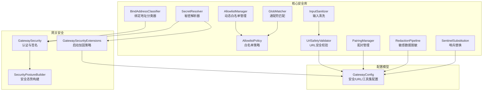

图表来源
- [BindAddressClassifier.cs:1-19](file://src/OpenClaw.Core/Security/BindAddressClassifier.cs#L1-L19)
- [SecretResolver.cs:1-66](file://src/OpenClaw.Core/Security/SecretResolver.cs#L1-L66)
- [AllowlistManager.cs:1-126](file://src/OpenClaw.Core/Security/AllowlistManager.cs#L1-L126)
- [AllowlistPolicy.cs:1-43](file://src/OpenClaw.Core/Security/AllowlistPolicy.cs#L1-L43)
- [InputSanitizer.cs:1-84](file://src/OpenClaw.Core/Security/InputSanitizer.cs#L1-L84)
- [UrlSafetyValidator.cs:1-219](file://src/OpenClaw.Core/Security/UrlSafetyValidator.cs#L1-L219)
- [GlobMatcher.cs:1-89](file://src/OpenClaw.Core/Security/GlobMatcher.cs#L1-L89)
- [PairingManager.cs:1-211](file://src/OpenClaw.Core/Security/PairingManager.cs#L1-L211)
- [RedactionPipeline.cs:1-131](file://src/OpenClaw.Core/Security/RedactionPipeline.cs#L1-L131)
- [SentinelSubstitution.cs:1-38](file://src/OpenClaw.Core/Security/SentinelSubstitution.cs#L1-L38)
- [GatewaySecurity.cs:1-109](file://src/OpenClaw.Gateway/GatewaySecurity.cs#L1-L109)
- [SecurityPostureBuilder.cs:1-169](file://src/OpenClaw.Gateway/SecurityPostureBuilder.cs#L1-L169)
- [GatewaySecurityExtensions.cs:1-317](file://src/OpenClaw.Gateway/Extensions/GatewaySecurityExtensions.cs#L1-L317)
- [GatewayConfig.cs:331-530](file://src/OpenClaw.Core/Models/GatewayConfig.cs#L331-L530)

章节来源
- [GatewayConfig.cs:331-530](file://src/OpenClaw.Core/Models/GatewayConfig.cs#L331-L530)
- [GatewaySecurityExtensions.cs:1-317](file://src/OpenClaw.Gateway/Extensions/GatewaySecurityExtensions.cs#L1-L317)

## 核心组件
- 绑定地址分类器：用于判断是否为回环绑定，避免将“*”、“+”、“[::]”等视为回环，保障非回环绑定时的安全策略生效。
- 秘密解析器：统一解析以“env:”、“raw:”或裸字符串形式的密钥引用，支持严格解析与警告降级，确保生产环境不使用明文硬编码。
- 动态白名单管理：按通道持久化允许来源/去向列表，支持并发写入与原子更新，便于运行时调整。
- 白名单策略：支持“严格/传统”两种语义，空列表在传统模式下默认放行，在严格模式下默认拒绝。
- 输入清洗：检测并阻止Shell元字符注入、剥离CRLF防止协议注入、校验内存键与IMAP文件夹名安全性。
- URL安全校验：基于主机通配与CIDR阻断、私有网络阻断、DNS解析与地址判定，防止SSRF与内网探测。
- 通配符匹配：高性能Span-based通配符匹配，避免Split开销，支持允许/拒绝优先级。
- 配对管理：生成带过期时间的6位验证码，支持失败冷却与固定时间比较，批准后持久化。
- 敏感数据脱敏：多阶段脱敏流水线，支持会话历史中工具调用参数、结果与消息内容的脱敏。
- 哨兵替换：在执行与持久化之间进行参数替换，降低敏感参数泄露风险。
- 网关安全：提供Bearer令牌提取、查询串令牌选择、HMAC-SHA256签名验证与常量时间比较。
- 安全态势构建：汇总公共绑定风险、浏览器会话Cookie安全、插件桥接、工具审批要求、沙箱配置等。
- 启动加固策略：在非回环绑定场景强制收紧策略，禁止不安全工具与桥接插件，要求签名验证与密钥引用安全。

章节来源
- [BindAddressClassifier.cs:1-19](file://src/OpenClaw.Core/Security/BindAddressClassifier.cs#L1-L19)
- [SecretResolver.cs:1-66](file://src/OpenClaw.Core/Security/SecretResolver.cs#L1-L66)
- [AllowlistManager.cs:1-126](file://src/OpenClaw.Core/Security/AllowlistManager.cs#L1-L126)
- [AllowlistPolicy.cs:1-43](file://src/OpenClaw.Core/Security/AllowlistPolicy.cs#L1-L43)
- [InputSanitizer.cs:1-84](file://src/OpenClaw.Core/Security/InputSanitizer.cs#L1-L84)
- [UrlSafetyValidator.cs:1-219](file://src/OpenClaw.Core/Security/UrlSafetyValidator.cs#L1-L219)
- [GlobMatcher.cs:1-89](file://src/OpenClaw.Core/Security/GlobMatcher.cs#L1-L89)
- [PairingManager.cs:1-211](file://src/OpenClaw.Core/Security/PairingManager.cs#L1-L211)
- [RedactionPipeline.cs:1-131](file://src/OpenClaw.Core/Security/RedactionPipeline.cs#L1-L131)
- [SentinelSubstitution.cs:1-38](file://src/OpenClaw.Core/Security/SentinelSubstitution.cs#L1-L38)
- [GatewaySecurity.cs:1-109](file://src/OpenClaw.Gateway/GatewaySecurity.cs#L1-L109)
- [SecurityPostureBuilder.cs:1-169](file://src/OpenClaw.Gateway/SecurityPostureBuilder.cs#L1-L169)
- [GatewaySecurityExtensions.cs:1-317](file://src/OpenClaw.Gateway/Extensions/GatewaySecurityExtensions.cs#L1-L317)

## 架构总览
下图展示从请求进入网关到工具执行的关键安全路径与决策点，包括身份认证、授权审批、URL安全、输入清洗与脱敏等环节。

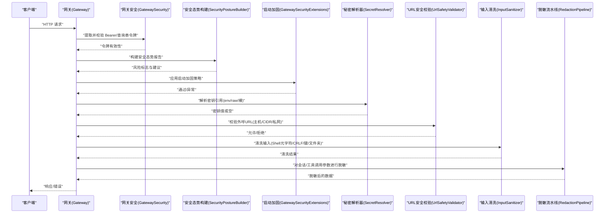

图表来源
- [GatewaySecurity.cs:1-109](file://src/OpenClaw.Gateway/GatewaySecurity.cs#L1-L109)
- [SecurityPostureBuilder.cs:1-169](file://src/OpenClaw.Gateway/SecurityPostureBuilder.cs#L1-L169)
- [GatewaySecurityExtensions.cs:1-317](file://src/OpenClaw.Gateway/Extensions/GatewaySecurityExtensions.cs#L1-L317)
- [SecretResolver.cs:1-66](file://src/OpenClaw.Core/Security/SecretResolver.cs#L1-L66)
- [UrlSafetyValidator.cs:1-219](file://src/OpenClaw.Core/Security/UrlSafetyValidator.cs#L1-L219)
- [InputSanitizer.cs:1-84](file://src/OpenClaw.Core/Security/InputSanitizer.cs#L1-L84)
- [RedactionPipeline.cs:1-131](file://src/OpenClaw.Core/Security/RedactionPipeline.cs#L1-L131)

## 详细组件分析

### 绑定地址分类器
- 设计原则：区分“所有接口绑定”与“回环绑定”，非回环绑定必须启用更严格的安全策略。
- 关键逻辑：对IP/主机名进行解析与判断；特殊通配符直接判定为非回环。
- 测试覆盖：针对常见回环与非回环地址进行正确性断言。

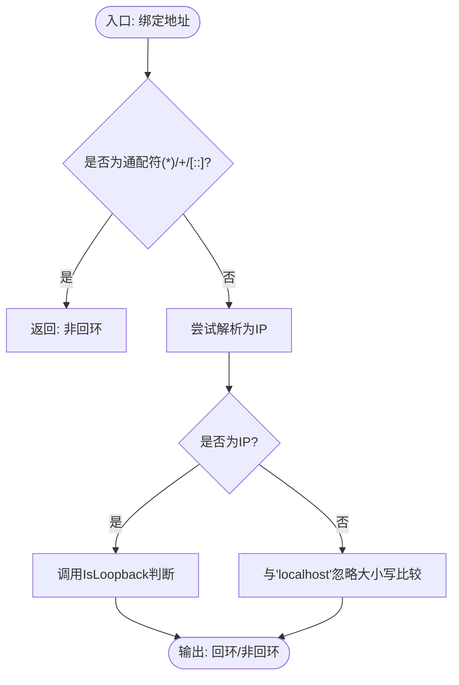

图表来源
- [BindAddressClassifier.cs:1-19](file://src/OpenClaw.Core/Security/BindAddressClassifier.cs#L1-L19)

章节来源
- [BindAddressClassifier.cs:1-19](file://src/OpenClaw.Core/Security/BindAddressClassifier.cs#L1-L19)
- [BindAddressClassifierTests.cs:1-24](file://src/OpenClaw.Tests/BindAddressClassifierTests.cs#L1-L24)

### 秘密解析器
- 设计原则：统一密钥引用格式，支持env:严格解析、raw:明文提示、裸字符串回退；生产环境推荐env:。
- 关键逻辑：前缀识别、环境变量读取、日志警告、常量时间比较防时序攻击。
- 安全影响：避免将密钥硬编码在配置文件中；在非回环绑定时可检测raw:引用并触发风险提示。

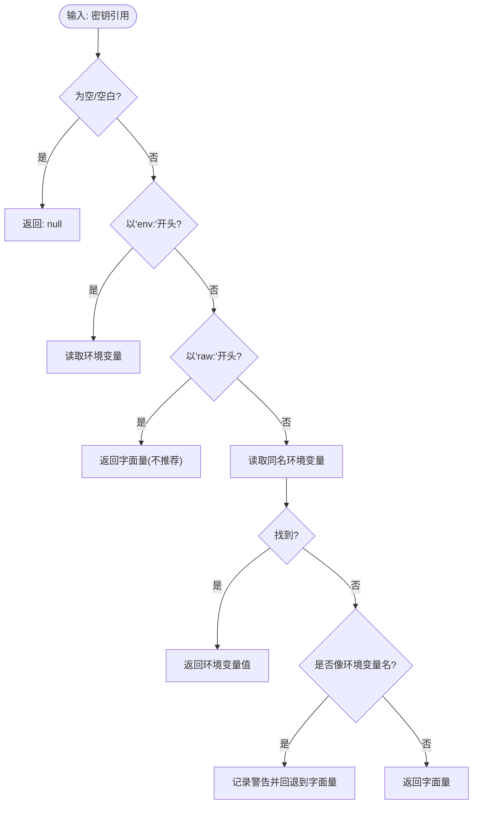

图表来源
- [SecretResolver.cs:1-66](file://src/OpenClaw.Core/Security/SecretResolver.cs#L1-L66)

章节来源
- [SecretResolver.cs:1-66](file://src/OpenClaw.Core/Security/SecretResolver.cs#L1-L66)
- [SecurityPostureBuilder.cs:151-164](file://src/OpenClaw.Gateway/SecurityPostureBuilder.cs#L151-L164)

### 动态白名单管理
- 设计原则：按通道持久化允许来源/去向，动态文件优先于静态配置；并发安全与原子更新。
- 关键逻辑：路径安全化、JSON序列化/反序列化、临时文件写入与原子移动、失败回退清理。
- 应用场景：运行时调整渠道接入权限，减少重启带来的运维成本。

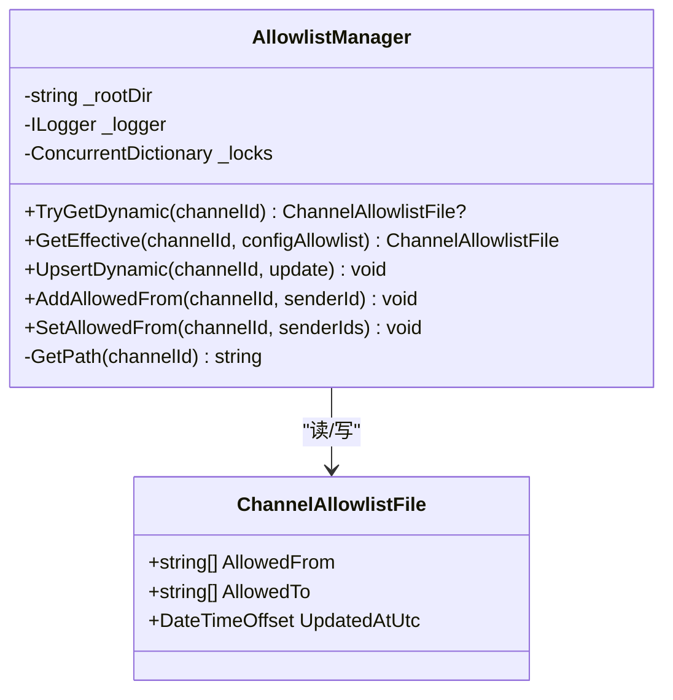

图表来源
- [AllowlistManager.cs:1-126](file://src/OpenClaw.Core/Security/AllowlistManager.cs#L1-L126)

章节来源
- [AllowlistManager.cs:1-126](file://src/OpenClaw.Core/Security/AllowlistManager.cs#L1-L126)

### 白名单策略与通配符匹配
- 设计原则：支持“严格/传统”两种语义；传统空列表默认放行，严格空列表默认拒绝；deny优先。
- 关键逻辑：GlobMatcher高性能匹配；支持前缀/中间段/后缀组合与首段不以*开头的优化。
- 应用场景：渠道来源/目标过滤、工具名称匹配、路径规则。

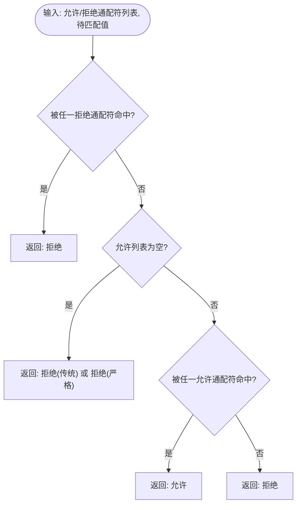

图表来源
- [AllowlistPolicy.cs:1-43](file://src/OpenClaw.Core/Security/AllowlistPolicy.cs#L1-L43)
- [GlobMatcher.cs:1-89](file://src/OpenClaw.Core/Security/GlobMatcher.cs#L1-L89)

章节来源
- [AllowlistPolicy.cs:1-43](file://src/OpenClaw.Core/Security/AllowlistPolicy.cs#L1-L43)
- [GlobMatcher.cs:1-89](file://src/OpenClaw.Core/Security/GlobMatcher.cs#L1-L89)
- [AllowlistPolicyTests.cs:1-33](file://src/OpenClaw.Tests/AllowlistPolicyTests.cs#L1-L33)

### 输入清洗与URL安全
- 输入清洗：检测Shell元字符、剥离CRLF、校验内存键与IMAP文件夹名，降低注入风险。
- URL安全：仅允许绝对http/https；内置阻断主机通配；可阻断私有网络与CIDR；DNS解析与地址判定。

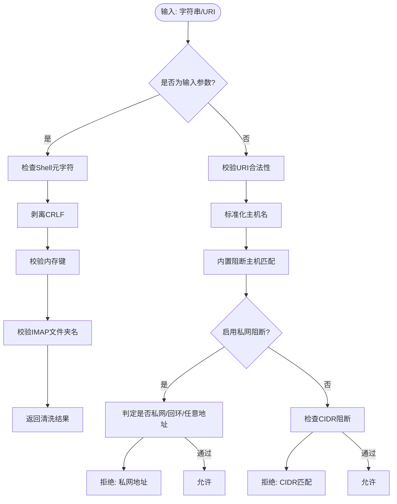

图表来源
- [InputSanitizer.cs:1-84](file://src/OpenClaw.Core/Security/InputSanitizer.cs#L1-L84)
- [UrlSafetyValidator.cs:1-219](file://src/OpenClaw.Core/Security/UrlSafetyValidator.cs#L1-L219)

章节来源
- [InputSanitizer.cs:1-84](file://src/OpenClaw.Core/Security/InputSanitizer.cs#L1-L84)
- [UrlSafetyValidator.cs:1-219](file://src/OpenClaw.Core/Security/UrlSafetyValidator.cs#L1-L219)

### 配对管理
- 设计原则：生成6位验证码，10分钟有效期；最多5次失败尝试，失败冷却5分钟；固定时间比较防时序攻击；批准后持久化。
- 关键逻辑：PendingCodes与ApprovedSenders双集合；原子持久化；异常日志记录。

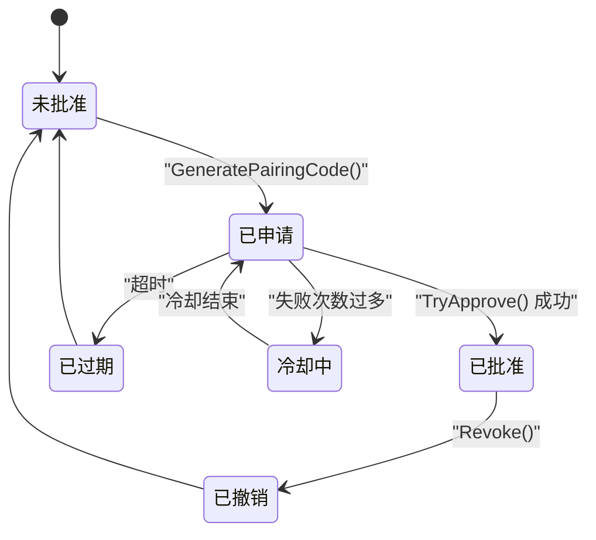

图表来源
- [PairingManager.cs:1-211](file://src/OpenClaw.Core/Security/PairingManager.cs#L1-L211)

章节来源
- [PairingManager.cs:1-211](file://src/OpenClaw.Core/Security/PairingManager.cs#L1-L211)

### 敏感数据脱敏与哨兵替换
- 脱敏流水线：多阶段正则替换，支持会话历史、工具调用参数/结果/失败信息与下一步指令的脱敏。
- 哨兵替换：在执行与持久化阶段分别替换参数，避免敏感参数泄露。

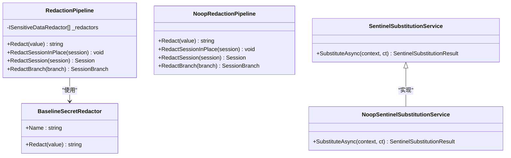

图表来源
- [RedactionPipeline.cs:1-131](file://src/OpenClaw.Core/Security/RedactionPipeline.cs#L1-L131)
- [SentinelSubstitution.cs:1-38](file://src/OpenClaw.Core/Security/SentinelSubstitution.cs#L1-L38)

章节来源
- [RedactionPipeline.cs:1-131](file://src/OpenClaw.Core/Security/RedactionPipeline.cs#L1-L131)
- [SentinelSubstitution.cs:1-38](file://src/OpenClaw.Core/Security/SentinelSubstitution.cs#L1-L38)

### 网关安全与启动加固
- 身份认证：支持Authorization头Bearer令牌与可选查询串token；常量时间比较令牌与签名。
- 启动加固：非回环绑定时强制收紧策略，禁止不安全工具与桥接插件，要求签名验证与密钥引用安全。
- 安全态势：汇总公共绑定风险、浏览器会话Cookie安全、工具审批要求、沙箱配置等，输出风险标志与建议。

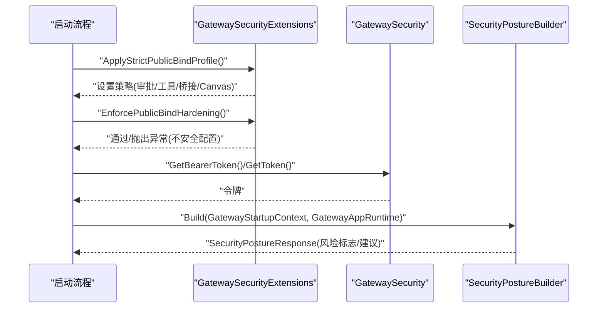

图表来源
- [GatewaySecurityExtensions.cs:1-317](file://src/OpenClaw.Gateway/Extensions/GatewaySecurityExtensions.cs#L1-L317)
- [GatewaySecurity.cs:1-109](file://src/OpenClaw.Gateway/GatewaySecurity.cs#L1-L109)
- [SecurityPostureBuilder.cs:1-169](file://src/OpenClaw.Gateway/SecurityPostureBuilder.cs#L1-L169)

章节来源
- [GatewaySecurity.cs:1-109](file://src/OpenClaw.Gateway/GatewaySecurity.cs#L1-L109)
- [GatewaySecurityExtensions.cs:1-317](file://src/OpenClaw.Gateway/Extensions/GatewaySecurityExtensions.cs#L1-L317)
- [SecurityPostureBuilder.cs:1-169](file://src/OpenClaw.Gateway/SecurityPostureBuilder.cs#L1-L169)
- [GatewayAdminEndpointTests.cs:1524-1555](file://src/OpenClaw.Tests/GatewayAdminEndpointTests.cs#L1524-L1555)

## 依赖关系分析
- 组件耦合：安全基础设施（SecretResolver、UrlSafetyValidator、InputSanitizer、RedactionPipeline）被网关安全与启动加固广泛复用。
- 外部依赖：DNS解析用于URL安全校验；文件系统用于动态白名单与配对批准持久化；常量时间比较用于令牌与签名验证。
- 风险点：若配置不当（如非回环绑定且AllowUnsafeToolingOnPublicBind=true），可能绕过启动加固；raw:密钥引用在非回环绑定时触发风险标志。

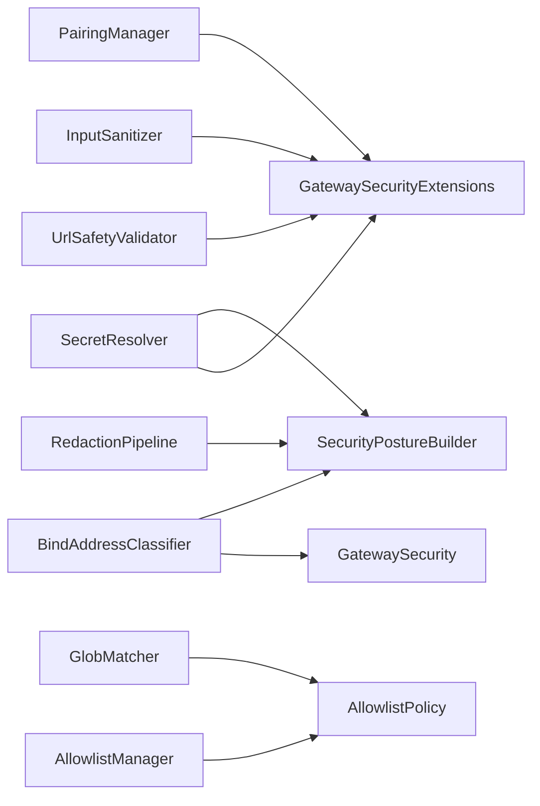

图表来源
- [SecretResolver.cs:1-66](file://src/OpenClaw.Core/Security/SecretResolver.cs#L1-L66)
- [GatewaySecurityExtensions.cs:1-317](file://src/OpenClaw.Gateway/Extensions/GatewaySecurityExtensions.cs#L1-L317)
- [SecurityPostureBuilder.cs:1-169](file://src/OpenClaw.Gateway/SecurityPostureBuilder.cs#L1-L169)
- [UrlSafetyValidator.cs:1-219](file://src/OpenClaw.Core/Security/UrlSafetyValidator.cs#L1-L219)
- [InputSanitizer.cs:1-84](file://src/OpenClaw.Core/Security/InputSanitizer.cs#L1-L84)
- [RedactionPipeline.cs:1-131](file://src/OpenClaw.Core/Security/RedactionPipeline.cs#L1-L131)
- [BindAddressClassifier.cs:1-19](file://src/OpenClaw.Core/Security/BindAddressClassifier.cs#L1-L19)
- [AllowlistManager.cs:1-126](file://src/OpenClaw.Core/Security/AllowlistManager.cs#L1-L126)
- [AllowlistPolicy.cs:1-43](file://src/OpenClaw.Core/Security/AllowlistPolicy.cs#L1-L43)
- [GlobMatcher.cs:1-89](file://src/OpenClaw.Core/Security/GlobMatcher.cs#L1-L89)
- [PairingManager.cs:1-211](file://src/OpenClaw.Core/Security/PairingManager.cs#L1-L211)

章节来源
- [GatewaySecurityExtensions.cs:1-317](file://src/OpenClaw.Gateway/Extensions/GatewaySecurityExtensions.cs#L1-L317)
- [SecurityPostureBuilder.cs:1-169](file://src/OpenClaw.Gateway/SecurityPostureBuilder.cs#L1-L169)

## 性能考量
- URL安全校验：DNS解析与CIDR匹配为O(N)；建议缓存DNS结果与CIDR表，避免重复计算。
- 输入清洗：SIMD加速的SearchValues与Span-based遍历，适合高频输入场景。
- 脱敏流水线：多阶段正则替换，建议限制最大文本长度与批处理大小。
- 动态白名单：原子写入与临时文件策略降低锁竞争，但I/O仍为主要瓶颈。
- 常量时间比较：固定长度比较避免泄漏长度信息，但CPU开销略高。

## 故障排查指南
- 启动失败（非回环绑定）：
  - 症状：启动时报“拒绝启动于非回环绑定且存在不安全配置”。
  - 排查：检查工具根目录限制、本地shell/process执行、插件桥接、Canvas启用与签名验证配置；必要时开启相应AllowXxx选项。
- 公共绑定风险告警：
  - 症状：/admin/posture返回风险标志（如缺少认证令牌、未启用请求者匹配、raw:密钥引用等）。
  - 排查：配置AuthToken、开启RequireRequesterMatchForHttpToolApproval、替换raw:为env:、完善签名验证。
- 令牌/签名验证失败：
  - 症状：Authorization头或签名不匹配。
  - 排查：确认令牌格式、签名算法与前缀、payload一致性与十六进制编码。
- 输入/URL被拒绝：
  - 症状：工具调用因输入包含Shell元字符或外呼URL被阻断。
  - 排查：移除非法字符、调整URL安全策略或修正目标地址。

章节来源
- [GatewaySecurityExtensions.cs:29-218](file://src/OpenClaw.Gateway/Extensions/GatewaySecurityExtensions.cs#L29-L218)
- [GatewayAdminEndpointTests.cs:1524-1555](file://src/OpenClaw.Tests/GatewayAdminEndpointTests.cs#L1524-L1555)
- [GatewaySecurity.cs:13-76](file://src/OpenClaw.Gateway/GatewaySecurity.cs#L13-L76)
- [UrlSafetyValidator.cs:60-135](file://src/OpenClaw.Core/Security/UrlSafetyValidator.cs#L60-L135)

## 结论
本安全架构以“最小暴露面、纵深防御、可审计”为核心原则，通过绑定地址分类、秘密解析、动态白名单、输入与URL安全、脱敏与替换、启动加固与安全态势构建等能力，形成端到端的安全闭环。建议在生产环境中默认启用严格公共绑定预设、禁用raw:密钥引用、强化签名验证与工具审批，并持续监控安全态势报告与风险标志。

## 附录
- 安全配置最佳实践
  - 公共绑定：启用RequireRequesterMatchForHttpToolApproval；替换raw:为env:；启用签名验证；限制工具与Canvas。
  - 密钥管理：统一使用env:引用；避免明文存储；定期轮换；最小权限访问。
  - 工具与路径：限制AllowedReadRoots/AllowedWriteRoots；启用沙箱；严格ApprovalRequiredTools。
  - 日志与审计：开启审计与合规日志；定期审查安全态势报告与风险标志。
- 性能影响评估
  - DNS解析与CIDR匹配：适度缓存；批量处理。
  - 正则脱敏：限制输入长度；分批处理。
  - 常量时间比较：微小CPU开销换取安全性。
- 安全审计要点
  - 配置审计：检查Security/Tooling/Canvas/Plugins等关键节点。
  - 运行审计：监控/auditonly动作与审批流；追踪敏感参数脱敏效果。
  - 合规审计：遵循最小权限、职责分离与变更控制流程。