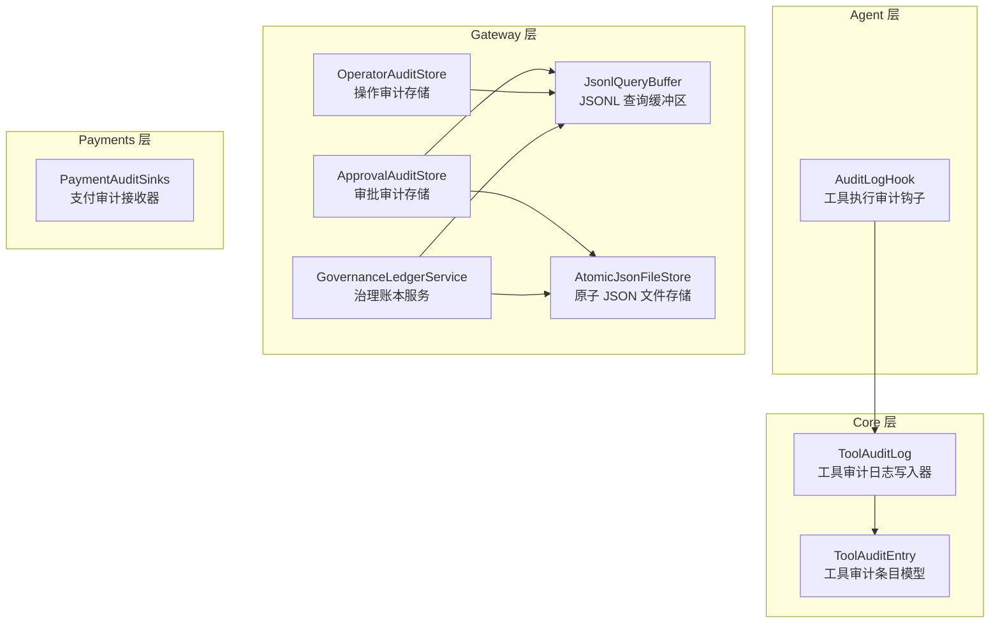
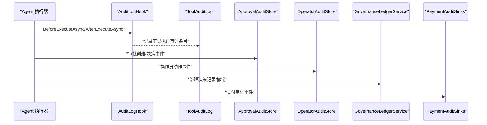
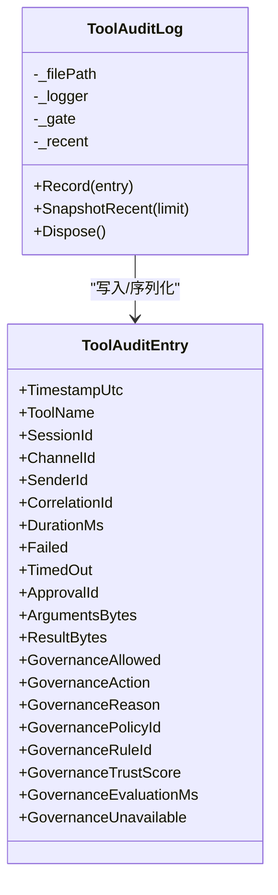
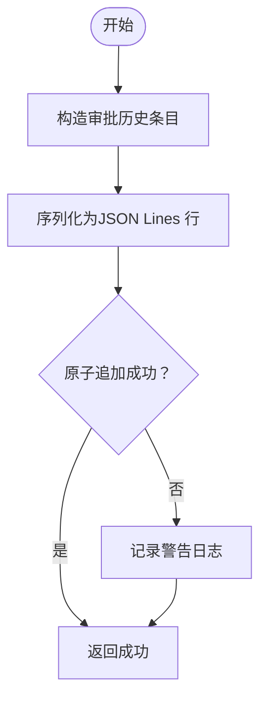
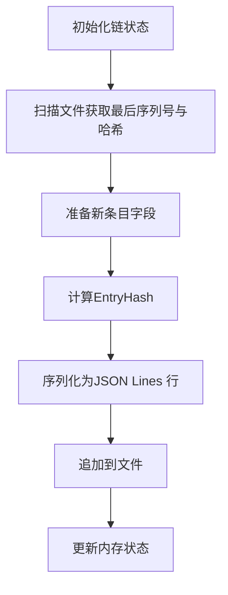
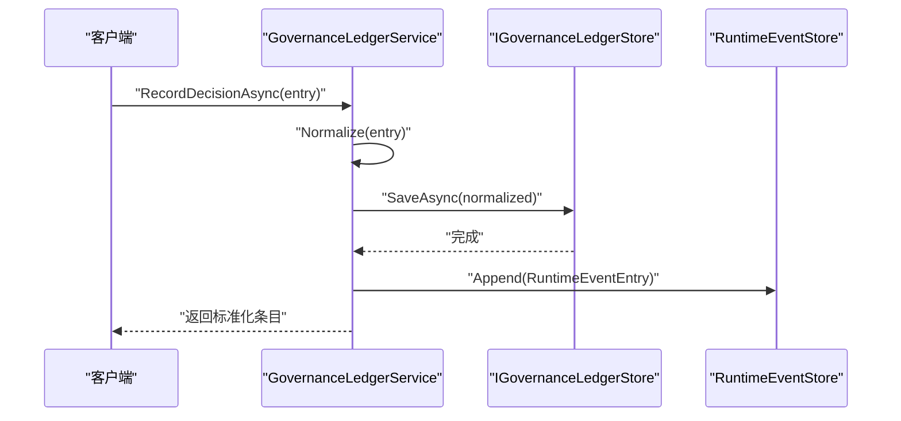
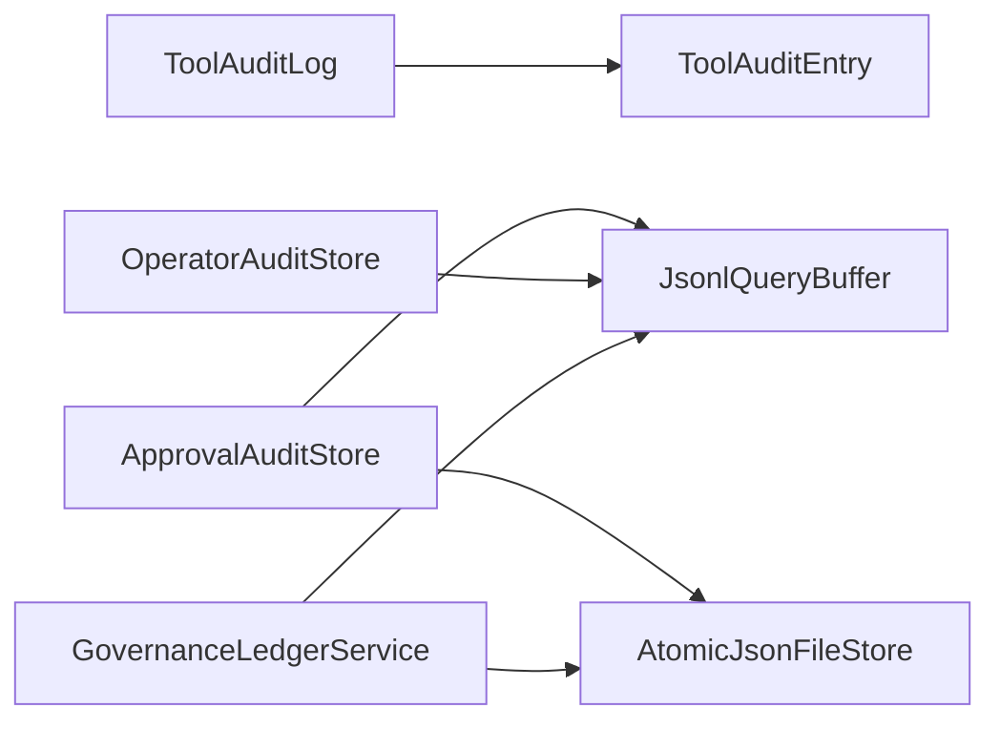

# 审计日志

<cite>
**本文引用的文件**
- [AuditLogHook.cs](file://src/OpenClaw.Agent/AuditLogHook.cs)
- [ToolAuditLog.cs](file://src/OpenClaw.Core/Observability/ToolAuditLog.cs)
- [ApprovalAuditStore.cs](file://src/OpenClaw.Gateway/ApprovalAuditStore.cs)
- [OperatorAuditStore.cs](file://src/OpenClaw.Gateway/OperatorAuditStore.cs)
- [JsonlQueryBuffer.cs](file://src/OpenClaw.Gateway/JsonlQueryBuffer.cs)
- [AtomicJsonFileStore.cs](file://src/OpenClaw.Gateway/AtomicJsonFileStore.cs)
- [GovernanceLedgerService.cs](file://src/OpenClaw.Gateway/GovernanceLedgerService.cs)
- [PaymentAuditSinks.cs](file://src/OpenClaw.Payments.Core/PaymentAuditSinks.cs)
- [GovernanceLedgerModels.cs](file://src/OpenClaw.Core/Models/GovernanceLedgerModels.cs)
- [OperatorApiModels.cs](file://src/OpenClaw.Core/Models/OperatorApiModels.cs)
- [AdminEndpoints.GovernanceLedger.cs](file://src/OpenClaw.Gateway/Endpoints/AdminEndpoints.GovernanceLedger.cs)
- [CoreServicesExtensions.cs](file://src/OpenClaw.Gateway/Composition/CoreServicesExtensions.cs)
- [GatewayAppRuntime.cs](file://src/OpenClaw.Gateway/Composition/GatewayAppRuntime.cs)
- [RuntimeInitializationExtensions.CompositionStages.cs](file://src/OpenClaw.Gateway/Composition/RuntimeInitializationExtensions.CompositionStages.cs)
- [RuntimeInitializationExtensions.RuntimeFactories.cs](file://src/OpenClaw.Gateway/Composition/RuntimeInitializationExtensions.RuntimeFactories.cs)
- [ApprovalAuditStoreTests.cs](file://src/OpenClaw.Tests/ApprovalAuditStoreTests.cs)
</cite>

## 目录
1. [简介](#简介)
2. [项目结构](#项目结构)
3. [核心组件](#核心组件)
4. [架构总览](#架构总览)
5. [组件详解](#组件详解)
6. [依赖关系分析](#依赖关系分析)
7. [性能考量](#性能考量)
8. [故障排查指南](#故障排查指南)
9. [结论](#结论)
10. [附录](#附录)

## 简介
本文件面向Kingcrab项目的审计日志体系，系统化阐述审计日志架构、日志采集机制、存储策略与查询检索机制，并覆盖工具审计日志、审批审计存储、安全事件记录（操作审计）、治理决策审计（治理账本）以及支付审计等子域。文档同时给出审计事件类型、日志格式规范、数据保留策略、完整性保护与防篡改机制、合规性要求、配置指南、性能优化建议、与监控系统的集成与告警机制，以及查询接口与流程图。

## 项目结构
审计相关代码主要分布在以下模块：
- Agent层：工具执行审计钩子，负责在工具执行前后记录审计信息。
- Core层：通用审计数据模型与工具审计日志写入器。
- Gateway层：审批审计存储、操作审计存储、治理账本服务、JSONL查询缓冲区、原子文件写入器；并提供治理账本管理端点。
- Payments层：支付审计事件接收器（内存队列）。
- Tests层：审批审计存储测试用例。

图表来源
- [AuditLogHook.cs:10-62](file://src/OpenClaw.Agent/AuditLogHook.cs#L10-L62)
- [ToolAuditLog.cs:39-114](file://src/OpenClaw.Core/Observability/ToolAuditLog.cs#L39-L114)
- [ApprovalAuditStore.cs:7-125](file://src/OpenClaw.Gateway/ApprovalAuditStore.cs#L7-L125)
- [OperatorAuditStore.cs:10-194](file://src/OpenClaw.Gateway/OperatorAuditStore.cs#L10-L194)
- [JsonlQueryBuffer.cs:7-50](file://src/OpenClaw.Gateway/JsonlQueryBuffer.cs#L7-L50)
- [AtomicJsonFileStore.cs:7-88](file://src/OpenClaw.Gateway/AtomicJsonFileStore.cs#L7-L88)
- [GovernanceLedgerService.cs:10-554](file://src/OpenClaw.Gateway/GovernanceLedgerService.cs#L10-L554)
- [PaymentAuditSinks.cs:6-18](file://src/OpenClaw.Payments.Core/PaymentAuditSinks.cs#L6-L18)

章节来源
- [AuditLogHook.cs:1-63](file://src/OpenClaw.Agent/AuditLogHook.cs#L1-L63)
- [ToolAuditLog.cs:1-125](file://src/OpenClaw.Core/Observability/ToolAuditLog.cs#L1-L125)
- [ApprovalAuditStore.cs:1-126](file://src/OpenClaw.Gateway/ApprovalAuditStore.cs#L1-L126)
- [OperatorAuditStore.cs:1-195](file://src/OpenClaw.Gateway/OperatorAuditStore.cs#L1-L195)
- [JsonlQueryBuffer.cs:1-51](file://src/OpenClaw.Gateway/JsonlQueryBuffer.cs#L1-L51)
- [AtomicJsonFileStore.cs:1-89](file://src/OpenClaw.Gateway/AtomicJsonFileStore.cs#L1-L89)
- [GovernanceLedgerService.cs:1-554](file://src/OpenClaw.Gateway/GovernanceLedgerService.cs#L1-L554)
- [PaymentAuditSinks.cs:1-19](file://src/OpenClaw.Payments.Core/PaymentAuditSinks.cs#L1-L19)

## 核心组件
- 工具审计日志（ToolAuditLog）
  - 职责：以JSON Lines格式追加写入工具执行审计条目，避免直接记录敏感参数与结果，仅记录字节长度与摘要。
  - 关键字段：时间戳、工具名、会话ID、通道ID、发送者ID、关联ID、耗时、是否失败/超时、治理决策元信息、治理评估指标等。
  - 写入策略：线程安全、追加写入、失败降级（目录不可用时禁用文件写入）。
- 审批审计存储（ApprovalAuditStore）
  - 职责：记录工具审批请求的“创建”和“决策”事件，支持按通道、发送者、工具名、时间范围查询。
  - 存储：JSON Lines文件，使用原子追加保证并发安全。
  - 查询：基于JsonlQueryBuffer从文件末尾向前扫描，限制返回数量。
- 操作审计存储（OperatorAuditStore）
  - 职责：记录管理员/操作员行为，构建链式哈希校验，确保不可篡改。
  - 存储：JSON Lines文件，序列号自增，每条记录包含前一条记录哈希。
  - 哈希：SHA-256，材料包含序列号、时间、角色、目标、变更前后状态、成功标志等。
- 治理账本服务（GovernanceLedgerService）
  - 职责：统一记录治理决策（批准/拒绝/过期/撤销），标准化字段，生成运行时事件，支持查询与撤销。
  - 存储：结合原子文件写入与运行时事件记录。
- 支付审计接收器（PaymentAuditSinks）
  - 职责：接收支付相关审计事件，当前实现为内存队列快照，便于调试与内部观测。
- 审计钩子（AuditLogHook）
  - 职责：在工具执行前后通过日志记录关键上下文，便于快速定位问题与审计溯源。

章节来源
- [ToolAuditLog.cs:10-114](file://src/OpenClaw.Core/Observability/ToolAuditLog.cs#L10-L114)
- [ApprovalAuditStore.cs:28-124](file://src/OpenClaw.Gateway/ApprovalAuditStore.cs#L28-L124)
- [OperatorAuditStore.cs:33-193](file://src/OpenClaw.Gateway/OperatorAuditStore.cs#L33-L193)
- [GovernanceLedgerService.cs:31-176](file://src/OpenClaw.Gateway/GovernanceLedgerService.cs#L31-L176)
- [PaymentAuditSinks.cs:6-18](file://src/OpenClaw.Payments.Core/PaymentAuditSinks.cs#L6-L18)
- [AuditLogHook.cs:10-61](file://src/OpenClaw.Agent/AuditLogHook.cs#L10-L61)

## 架构总览
下图展示审计日志系统的关键交互：Agent侧触发工具执行审计钩子，Core侧写入工具审计日志；Gateway侧分别处理审批审计与操作审计；治理账本服务统一治理决策；支付审计接收器用于支付场景观测。

图表来源
- [AuditLogHook.cs:17-61](file://src/OpenClaw.Agent/AuditLogHook.cs#L17-L61)
- [ToolAuditLog.cs:72-95](file://src/OpenClaw.Core/Observability/ToolAuditLog.cs#L72-L95)
- [ApprovalAuditStore.cs:28-71](file://src/OpenClaw.Gateway/ApprovalAuditStore.cs#L28-L71)
- [OperatorAuditStore.cs:33-93](file://src/OpenClaw.Gateway/OperatorAuditStore.cs#L33-L93)
- [GovernanceLedgerService.cs:48-176](file://src/OpenClaw.Gateway/GovernanceLedgerService.cs#L48-L176)
- [PaymentAuditSinks.cs:12-17](file://src/OpenClaw.Payments.Core/PaymentAuditSinks.cs#L12-L17)

## 组件详解

### 工具审计日志（ToolAuditLog）
- 数据模型（ToolAuditEntry）
  - 必填字段：时间戳、工具名、会话ID、通道ID、发送者ID、关联ID。
  - 行为字段：耗时、失败/超时标记。
  - 治理字段：是否允许、动作、原因、策略/规则ID、信任分、评估耗时、不可用标记。
  - 非敏感统计：参数字节数、结果字节数。
- 写入与缓存
  - 追加写入：使用JSON Lines，逐条写入。
  - 内存快照：最近N条记录驻留内存，支持快速查询。
  - 失败处理：目录不存在或权限不足时降级为无文件写入。
- 日志格式规范
  - 单行JSON对象，驼峰命名，空值忽略，不缩进。
  - 不包含原始参数与结果内容，仅字节数与摘要。
- 典型用途
  - 工具执行轨迹、失败分析、性能基线、合规审计。

图表来源
- [ToolAuditLog.cs:10-114](file://src/OpenClaw.Core/Observability/ToolAuditLog.cs#L10-L114)

章节来源
- [ToolAuditLog.cs:10-114](file://src/OpenClaw.Core/Observability/ToolAuditLog.cs#L10-L114)

### 审批审计存储（ApprovalAuditStore）
- 事件类型
  - created：审批请求创建。
  - decision：审批决策（批准/拒绝/超时）。
- 字段要点
  - 事件类型、审批ID、会话ID、通道ID、发送者ID、工具名、动作、是否变更、摘要、时间戳、决策来源、决策者、批准布尔值。
  - 参数预览：截断最大长度，避免泄露敏感内容。
- 查询机制
  - 限制返回条数上限，按通道、发送者、工具名、时间范围过滤。
  - 使用JsonlQueryBuffer从文件末尾向前扫描，匹配后入队，最终反转输出。
- 写入机制
  - 原子追加：使用AtomicJsonFileStore.TryAppendLine，确保并发安全与文件一致性。

图表来源
- [ApprovalAuditStore.cs:103-113](file://src/OpenClaw.Gateway/ApprovalAuditStore.cs#L103-L113)
- [AtomicJsonFileStore.cs:61-87](file://src/OpenClaw.Gateway/AtomicJsonFileStore.cs#L61-L87)

章节来源
- [ApprovalAuditStore.cs:28-124](file://src/OpenClaw.Gateway/ApprovalAuditStore.cs#L28-L124)
- [JsonlQueryBuffer.cs:9-49](file://src/OpenClaw.Gateway/JsonlQueryBuffer.cs#L9-L49)
- [AtomicJsonFileStore.cs:61-87](file://src/OpenClaw.Gateway/AtomicJsonFileStore.cs#L61-L87)

### 操作审计存储（OperatorAuditStore）
- 事件类型
  - 操作员对系统资源进行的各类动作（创建、修改、删除、查询等）。
- 链式哈希完整性
  - 初始化：扫描现有文件，确定最后序列号与最后条目哈希。
  - 写入：计算当前条目哈希，包含序列号、时间、角色、目标、变更前后、成功标志、上一条哈希。
  - 哈希算法：SHA-256，十六进制大写字符串。
- 查询机制
  - 与审批审计一致，基于JsonlQueryBuffer从文件末尾向前扫描，支持按操作员ID、动作类型、目标ID、时间范围过滤。
- 错误处理
  - 写入异常时增加指标计数并记录警告。

图表来源
- [OperatorAuditStore.cs:127-160](file://src/OpenClaw.Gateway/OperatorAuditStore.cs#L127-L160)
- [OperatorAuditStore.cs:162-193](file://src/OpenClaw.Gateway/OperatorAuditStore.cs#L162-L193)

章节来源
- [OperatorAuditStore.cs:33-193](file://src/OpenClaw.Gateway/OperatorAuditStore.cs#L33-L193)
- [JsonlQueryBuffer.cs:9-49](file://src/OpenClaw.Gateway/JsonlQueryBuffer.cs#L9-L49)

### 治理账本服务（GovernanceLedgerService）
- 功能职责
  - 记录治理决策（批准/拒绝/过期/撤销），标准化字段，生成运行时事件，支持查询与撤销。
  - 将审批请求转换为治理账本条目，填充风险等级、作用域、元数据等。
- 字段规范化
  - 决策、状态、风险等级、作用域、来源、摘要、参数摘要、元数据等均进行清洗与归一化。
- 与审批审计的关系
  - 审批审计关注“谁何时做了什么”，治理账本关注“治理层面的决策与影响”。
- 接口与端点
  - 提供创建、保存、记录决策、撤销等方法；管理端点支持详情查询与撤销。

图表来源
- [GovernanceLedgerService.cs:48-60](file://src/OpenClaw.Gateway/GovernanceLedgerService.cs#L48-L60)
- [GovernanceLedgerService.cs:34-46](file://src/OpenClaw.Gateway/GovernanceLedgerService.cs#L34-L46)
- [AdminEndpoints.GovernanceLedger.cs:87-120](file://src/OpenClaw.Gateway/Endpoints/AdminEndpoints.GovernanceLedger.cs#L87-L120)

章节来源
- [GovernanceLedgerService.cs:48-176](file://src/OpenClaw.Gateway/GovernanceLedgerService.cs#L48-L176)
- [AdminEndpoints.GovernanceLedger.cs:62-197](file://src/OpenClaw.Gateway/Endpoints/AdminEndpoints.GovernanceLedger.cs#L62-L197)

### 支付审计接收器（PaymentAuditSinks）
- 实现：内存队列（并发队列），支持快照查看。
- 用途：支付场景下的审计事件观测与调试。

章节来源
- [PaymentAuditSinks.cs:6-18](file://src/OpenClaw.Payments.Core/PaymentAuditSinks.cs#L6-L18)

### 审计钩子（AuditLogHook）
- 触发时机：BeforeExecuteAsync（总是允许执行）、AfterExecuteAsync（记录失败/成功与耗时）。
- 记录内容：工具名、会话ID、通道ID、发送者ID、参数长度、结果长度、耗时、失败标志。
- 作用：补充日志输出，便于快速定位问题与审计溯源。

章节来源
- [AuditLogHook.cs:17-61](file://src/OpenClaw.Agent/AuditLogHook.cs#L17-L61)

## 依赖关系分析
- 组件耦合
  - ToolAuditLog与ToolAuditEntry强耦合，序列化上下文固定。
  - ApprovalAuditStore与OperatorAuditStore共享JsonlQueryBuffer与AtomicJsonFileStore，降低重复实现。
  - GovernanceLedgerService依赖运行时事件存储与红化管道，统一治理决策口径。
- 外部依赖
  - System.Text.Json：序列化/反序列化。
  - System.Security.Cryptography：操作审计哈希计算。
- 可能的循环依赖
  - 当前未见直接循环依赖；各模块职责清晰，通过接口与服务注册解耦。

图表来源
- [ToolAuditLog.cs:39-114](file://src/OpenClaw.Core/Observability/ToolAuditLog.cs#L39-L114)
- [ApprovalAuditStore.cs:7-125](file://src/OpenClaw.Gateway/ApprovalAuditStore.cs#L7-L125)
- [OperatorAuditStore.cs:10-194](file://src/OpenClaw.Gateway/OperatorAuditStore.cs#L10-L194)
- [JsonlQueryBuffer.cs:7-50](file://src/OpenClaw.Gateway/JsonlQueryBuffer.cs#L7-L50)
- [AtomicJsonFileStore.cs:7-88](file://src/OpenClaw.Gateway/AtomicJsonFileStore.cs#L7-L88)
- [GovernanceLedgerService.cs:10-554](file://src/OpenClaw.Gateway/GovernanceLedgerService.cs#L10-L554)

章节来源
- [ToolAuditLog.cs:39-114](file://src/OpenClaw.Core/Observability/ToolAuditLog.cs#L39-L114)
- [ApprovalAuditStore.cs:7-125](file://src/OpenClaw.Gateway/ApprovalAuditStore.cs#L7-L125)
- [OperatorAuditStore.cs:10-194](file://src/OpenClaw.Gateway/OperatorAuditStore.cs#L10-L194)
- [JsonlQueryBuffer.cs:7-50](file://src/OpenClaw.Gateway/JsonlQueryBuffer.cs#L7-L50)
- [AtomicJsonFileStore.cs:7-88](file://src/OpenClaw.Gateway/AtomicJsonFileStore.cs#L7-L88)
- [GovernanceLedgerService.cs:10-554](file://src/OpenClaw.Gateway/GovernanceLedgerService.cs#L10-L554)

## 性能考量
- 写入路径
  - ToolAuditLog：逐条追加写入，避免频繁打开/关闭文件；内存最近N条缓冲减少磁盘IO压力。
  - ApprovalAuditStore/OperatorAuditStore：原子追加，锁粒度在文件级别，适合高并发写入。
- 查询路径
  - JsonlQueryBuffer从文件末尾向前扫描，限制返回数量，避免全量解析；建议合理设置limit与过滤条件。
- 序列化
  - 使用源生成上下文，减少反射开销；JSON Lines不缩进，减小体积。
- 建议
  - 合理配置日志轮转与清理策略，避免单文件过大。
  - 对高频工具调用场景，可考虑批量写入或异步批处理（当前实现已尽量轻量）。
  - 操作审计哈希计算为CPU密集型，建议在低频写入场景使用。

[本节为通用性能建议，无需特定文件来源]

## 故障排查指南
- 工具审计日志无法写入
  - 现象：工具执行正常但未产生审计文件。
  - 排查：确认文件路径存在且有写权限；查看ToolAuditLog初始化警告日志。
  - 参考
    - [ToolAuditLog.cs:52-67](file://src/OpenClaw.Core/Observability/ToolAuditLog.cs#L52-L67)
- 审批审计查询为空
  - 现象：查询返回空列表。
  - 排查：确认过滤条件（通道ID/发送者ID/工具名/时间范围）是否过于严格；检查文件是否存在与可读。
  - 参考
    - [ApprovalAuditStore.cs:73-101](file://src/OpenClaw.Gateway/ApprovalAuditStore.cs#L73-L101)
    - [JsonlQueryBuffer.cs:18-49](file://src/OpenClaw.Gateway/JsonlQueryBuffer.cs#L18-L49)
- 操作审计链断裂
  - 现象：后续条目哈希校验失败。
  - 排查：检查文件是否被外部修改；确认链初始化逻辑是否正确读取最后序列号与哈希。
  - 参考
    - [OperatorAuditStore.cs:127-160](file://src/OpenClaw.Gateway/OperatorAuditStore.cs#L127-L160)
- 治理账本撤销失败
  - 现象：撤销接口返回未找到或异常。
  - 排查：确认条目ID有效；检查服务日志中的警告信息。
  - 参考
    - [GovernanceLedgerService.cs:117-138](file://src/OpenClaw.Gateway/GovernanceLedgerService.cs#L117-L138)
    - [AdminEndpoints.GovernanceLedger.cs:169-195](file://src/OpenClaw.Gateway/Endpoints/AdminEndpoints.GovernanceLedger.cs#L169-L195)
- 支付审计事件缺失
  - 现象：支付审计快照为空。
  - 排查：确认事件是否正确进入InMemoryPaymentAuditSink；检查消费/快照逻辑。
  - 参考
    - [PaymentAuditSinks.cs:10-17](file://src/OpenClaw.Payments.Core/PaymentAuditSinks.cs#L10-L17)

章节来源
- [ToolAuditLog.cs:52-67](file://src/OpenClaw.Core/Observability/ToolAuditLog.cs#L52-L67)
- [ApprovalAuditStore.cs:73-101](file://src/OpenClaw.Gateway/ApprovalAuditStore.cs#L73-L101)
- [JsonlQueryBuffer.cs:18-49](file://src/OpenClaw.Gateway/JsonlQueryBuffer.cs#L18-L49)
- [OperatorAuditStore.cs:127-160](file://src/OpenClaw.Gateway/OperatorAuditStore.cs#L127-L160)
- [GovernanceLedgerService.cs:117-138](file://src/OpenClaw.Gateway/GovernanceLedgerService.cs#L117-L138)
- [AdminEndpoints.GovernanceLedger.cs:169-195](file://src/OpenClaw.Gateway/Endpoints/AdminEndpoints.GovernanceLedger.cs#L169-L195)
- [PaymentAuditSinks.cs:10-17](file://src/OpenClaw.Payments.Core/PaymentAuditSinks.cs#L10-L17)

## 结论
本审计日志体系以JSON Lines为核心存储格式，结合原子写入与链式哈希技术，实现了工具执行审计、审批审计、操作审计、治理账本与支付审计的多维度覆盖。通过严格的字段规范化与非敏感化策略，兼顾了可观测性与安全性。建议在生产环境中配合日志轮转、查询索引与合规审查流程，持续完善审计能力。

[本节为总结性内容，无需特定文件来源]

## 附录

### 审计事件类型与日志格式规范
- 工具审计（ToolAuditEntry）
  - 字段：时间戳、工具名、会话ID、通道ID、发送者ID、关联ID、耗时、失败/超时、治理决策与评估指标、参数/结果字节数。
  - 格式：单行JSON，驼峰命名，空值忽略，不缩进。
  - 参考
    - [ToolAuditLog.cs:10-32](file://src/OpenClaw.Core/Observability/ToolAuditLog.cs#L10-L32)
- 审批审计（ApprovalHistoryEntry）
  - 字段：事件类型、审批ID、会话ID、通道ID、发送者ID、工具名、动作、是否变更、摘要、时间戳、决策时间、决策来源、决策者、批准布尔值、参数预览。
  - 格式：JSON Lines。
  - 参考
    - [ApprovalAuditStore.cs:28-71](file://src/OpenClaw.Gateway/ApprovalAuditStore.cs#L28-L71)
- 操作审计（OperatorAuditEntry）
  - 字段：序列号、时间戳、操作员ID/角色/显示名、认证方式、动作类型、目标ID、摘要、前/后状态、成功标志、前一条哈希、当前条目哈希。
  - 格式：JSON Lines，链式哈希校验。
  - 参考
    - [OperatorAuditStore.cs:33-93](file://src/OpenClaw.Gateway/OperatorAuditStore.cs#L33-L93)
- 治理账本（GovernanceLedgerEntry）
  - 字段：ID、创建/更新时间、决策、状态、来源、动作类型/工具名、摘要、参数摘要、风险等级、作用域、会话ID/通道ID/发送者ID、决策者/原因、到期/撤销信息、标签与元数据。
  - 格式：JSON Lines，标准化与红化处理。
  - 参考
    - [GovernanceLedgerService.cs:277-332](file://src/OpenClaw.Gateway/GovernanceLedgerService.cs#L277-L332)
    - [GovernanceLedgerModels.cs](file://src/OpenClaw.Core/Models/GovernanceLedgerModels.cs)

章节来源
- [ToolAuditLog.cs:10-32](file://src/OpenClaw.Core/Observability/ToolAuditLog.cs#L10-L32)
- [ApprovalAuditStore.cs:28-71](file://src/OpenClaw.Gateway/ApprovalAuditStore.cs#L28-L71)
- [OperatorAuditStore.cs:33-93](file://src/OpenClaw.Gateway/OperatorAuditStore.cs#L33-L93)
- [GovernanceLedgerService.cs:277-332](file://src/OpenClaw.Gateway/GovernanceLedgerService.cs#L277-L332)

### 数据保留策略与查询检索机制
- 保留策略
  - 建议结合业务需求制定保留周期（如90/180/365天），到期后归档或删除。
  - 对高敏感数据（如参数预览、变更前后），建议缩短保留期或脱敏归档。
- 查询检索
  - 审批审计：按通道/发送者/工具名/时间范围过滤，限制返回条数。
  - 操作审计：按操作员ID/动作类型/目标ID/时间范围过滤，限制返回条数。
  - 治理账本：支持ID查询与列表查询，按时间与标签过滤。
  - 参考
    - [ApprovalAuditStore.cs:73-101](file://src/OpenClaw.Gateway/ApprovalAuditStore.cs#L73-L101)
    - [OperatorAuditStore.cs:97-125](file://src/OpenClaw.Gateway/OperatorAuditStore.cs#L97-L125)
    - [GovernanceLedgerService.cs:111-115](file://src/OpenClaw.Gateway/GovernanceLedgerService.cs#L111-L115)

章节来源
- [ApprovalAuditStore.cs:73-101](file://src/OpenClaw.Gateway/ApprovalAuditStore.cs#L73-L101)
- [OperatorAuditStore.cs:97-125](file://src/OpenClaw.Gateway/OperatorAuditStore.cs#L97-L125)
- [GovernanceLedgerService.cs:111-115](file://src/OpenClaw.Gateway/GovernanceLedgerService.cs#L111-L115)

### 完整性保护与防篡改机制
- 审批审计：原子追加写入，避免部分写入；查询基于文件末尾扫描，便于发现异常。
- 操作审计：链式哈希（SHA-256），任何篡改都会导致后续哈希校验失败；初始化时重建链状态。
- 工具审计：追加写入，不包含原始敏感内容；可通过外部工具进行完整性校验。
- 参考
  - [AtomicJsonFileStore.cs:61-87](file://src/OpenClaw.Gateway/AtomicJsonFileStore.cs#L61-L87)
  - [OperatorAuditStore.cs:162-193](file://src/OpenClaw.Gateway/OperatorAuditStore.cs#L162-L193)

章节来源
- [AtomicJsonFileStore.cs:61-87](file://src/OpenClaw.Gateway/AtomicJsonFileStore.cs#L61-L87)
- [OperatorAuditStore.cs:162-193](file://src/OpenClaw.Gateway/OperatorAuditStore.cs#L162-L193)

### 合规性要求
- 数据最小化：仅记录必要字段，避免敏感内容；参数与结果以字节数与摘要替代。
- 可追溯性：保留完整时间戳、会话/通道/发送者标识、治理决策与元数据。
- 不可否认性：操作审计采用链式哈希，审批审计采用原子写入。
- 参考
  - [ToolAuditLog.cs:34-37](file://src/OpenClaw.Core/Observability/ToolAuditLog.cs#L34-L37)
  - [ApprovalAuditStore.cs:115-124](file://src/OpenClaw.Gateway/ApprovalAuditStore.cs#L115-L124)
  - [OperatorAuditStore.cs:162-193](file://src/OpenClaw.Gateway/OperatorAuditStore.cs#L162-L193)

章节来源
- [ToolAuditLog.cs:34-37](file://src/OpenClaw.Core/Observability/ToolAuditLog.cs#L34-L37)
- [ApprovalAuditStore.cs:115-124](file://src/OpenClaw.Gateway/ApprovalAuditStore.cs#L115-L124)
- [OperatorAuditStore.cs:162-193](file://src/OpenClaw.Gateway/OperatorAuditStore.cs#L162-L193)

### 审计配置指南
- 工具审计日志
  - 配置文件路径：通过服务注册时传入路径；若路径无效则降级为无文件写入。
  - 参考
    - [CoreServicesExtensions.cs:124-126](file://src/OpenClaw.Gateway/Composition/CoreServicesExtensions.cs#L124-L126)
    - [GatewayAppRuntime.cs](file://src/OpenClaw.Gateway/Composition/GatewayAppRuntime.cs#L36)
- 审批/操作审计存储
  - 存储根路径：由运行时注入，最终落盘至admin目录下的JSON Lines文件。
  - 参考
    - [RuntimeInitializationExtensions.CompositionStages.cs:36-45](file://src/OpenClaw.Gateway/Composition/RuntimeInitializationExtensions.CompositionStages.cs#L36-L45)
    - [RuntimeInitializationExtensions.RuntimeFactories.cs:48-70](file://src/OpenClaw.Gateway/Composition/RuntimeInitializationExtensions.RuntimeFactories.cs#L48-L70)
- 治理账本
  - 端点访问：需具备相应管理端授权与CSRF保护。
  - 参考
    - [AdminEndpoints.GovernanceLedger.cs:87-92](file://src/OpenClaw.Gateway/Endpoints/AdminEndpoints.GovernanceLedger.cs#L87-L92)
- 支付审计
  - 快照查看：通过内存队列快照接口。
  - 参考
    - [PaymentAuditSinks.cs:10-17](file://src/OpenClaw.Payments.Core/PaymentAuditSinks.cs#L10-L17)

章节来源
- [CoreServicesExtensions.cs:124-126](file://src/OpenClaw.Gateway/Composition/CoreServicesExtensions.cs#L124-L126)
- [GatewayAppRuntime.cs](file://src/OpenClaw.Gateway/Composition/GatewayAppRuntime.cs#L36)
- [RuntimeInitializationExtensions.CompositionStages.cs:36-45](file://src/OpenClaw.Gateway/Composition/RuntimeInitializationExtensions.CompositionStages.cs#L36-L45)
- [RuntimeInitializationExtensions.RuntimeFactories.cs:48-70](file://src/OpenClaw.Gateway/Composition/RuntimeInitializationExtensions.RuntimeFactories.cs#L48-L70)
- [AdminEndpoints.GovernanceLedger.cs:87-92](file://src/OpenClaw.Gateway/Endpoints/AdminEndpoints.GovernanceLedger.cs#L87-L92)
- [PaymentAuditSinks.cs:10-17](file://src/OpenClaw.Payments.Core/PaymentAuditSinks.cs#L10-L17)

### 查询接口
- 审批审计查询
  - 方法：Query(ApprovalHistoryQuery)
  - 支持：通道ID、发送者ID、工具名、时间范围、限制条数
  - 参考
    - [ApprovalAuditStore.cs:73-101](file://src/OpenClaw.Gateway/ApprovalAuditStore.cs#L73-L101)
- 操作审计查询
  - 方法：Query(OperatorAuditQuery)
  - 支持：操作员ID、动作类型、目标ID、时间范围、限制条数
  - 参考
    - [OperatorAuditStore.cs:97-125](file://src/OpenClaw.Gateway/OperatorAuditStore.cs#L97-L125)
- 治理账本查询
  - 方法：GetAsync/ListAsync
  - 支持：ID精确查询、列表查询（含时间与标签过滤）
  - 参考
    - [GovernanceLedgerService.cs:111-115](file://src/OpenClaw.Gateway/GovernanceLedgerService.cs#L111-L115)
    - [AdminEndpoints.GovernanceLedger.cs:62-85](file://src/OpenClaw.Gateway/Endpoints/AdminEndpoints.GovernanceLedger.cs#L62-L85)

章节来源
- [ApprovalAuditStore.cs:73-101](file://src/OpenClaw.Gateway/ApprovalAuditStore.cs#L73-L101)
- [OperatorAuditStore.cs:97-125](file://src/OpenClaw.Gateway/OperatorAuditStore.cs#L97-L125)
- [GovernanceLedgerService.cs:111-115](file://src/OpenClaw.Gateway/GovernanceLedgerService.cs#L111-L115)
- [AdminEndpoints.GovernanceLedger.cs:62-85](file://src/OpenClaw.Gateway/Endpoints/AdminEndpoints.GovernanceLedger.cs#L62-L85)

### 与监控系统的集成与告警机制
- 指标
  - 操作审计写入失败计数（OperatorAuditStore内部指标）。
  - 可扩展：在ToolAuditLog/ApprovalAuditStore/OperatorAuditStore中增加更多指标。
- 告警
  - 建议：当审计写入失败率超过阈值或链式哈希校验失败时触发告警。
- 参考
  - [OperatorAuditStore.cs:88-92](file://src/OpenClaw.Gateway/OperatorAuditStore.cs#L88-L92)

章节来源
- [OperatorAuditStore.cs:88-92](file://src/OpenClaw.Gateway/OperatorAuditStore.cs#L88-L92)

### 测试参考
- 审批审计存储测试
  - 场景：记录创建/决策事件、查询过滤、原子写入失败处理。
  - 参考
    - [ApprovalAuditStoreTests.cs](file://src/OpenClaw.Tests/ApprovalAuditStoreTests.cs)

章节来源
- [ApprovalAuditStoreTests.cs](file://src/OpenClaw.Tests/ApprovalAuditStoreTests.cs)