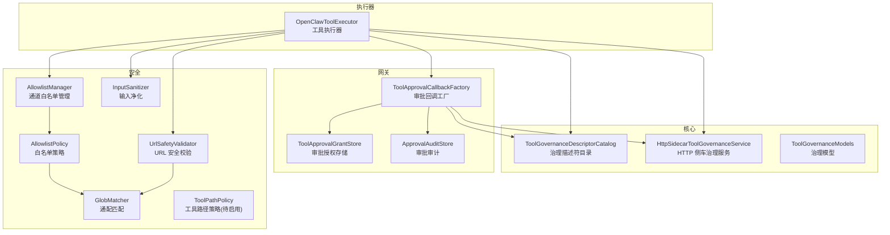
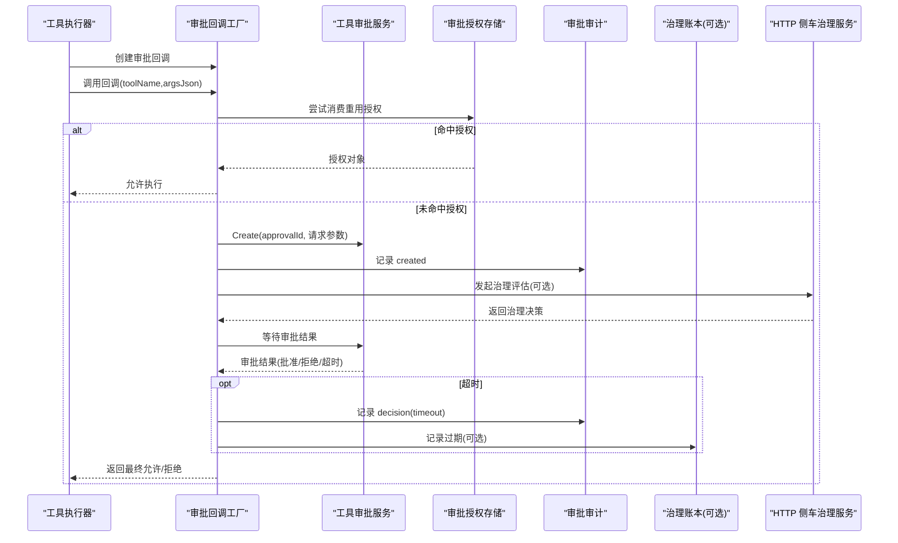
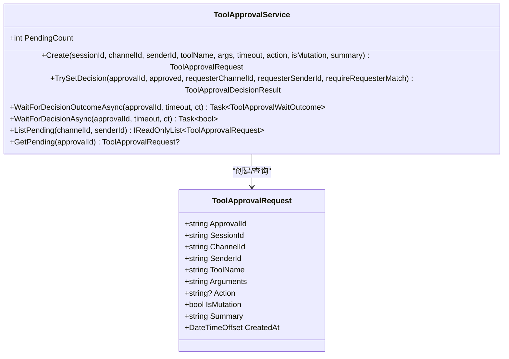
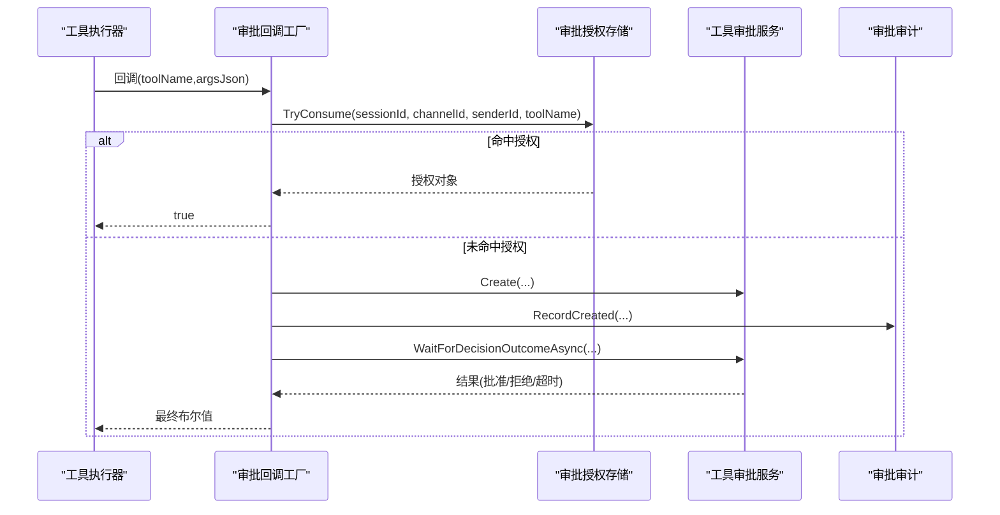
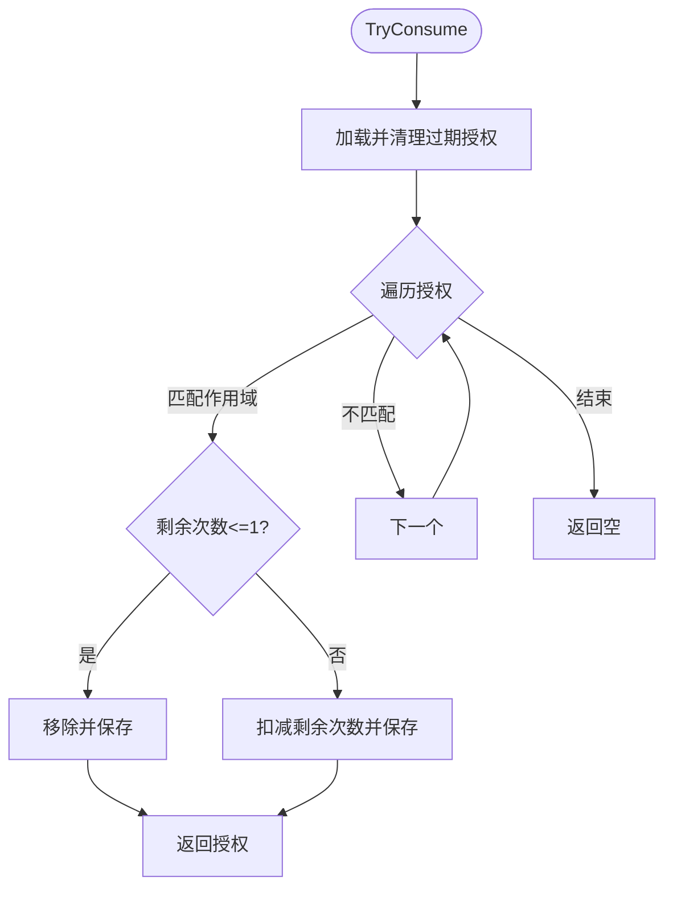
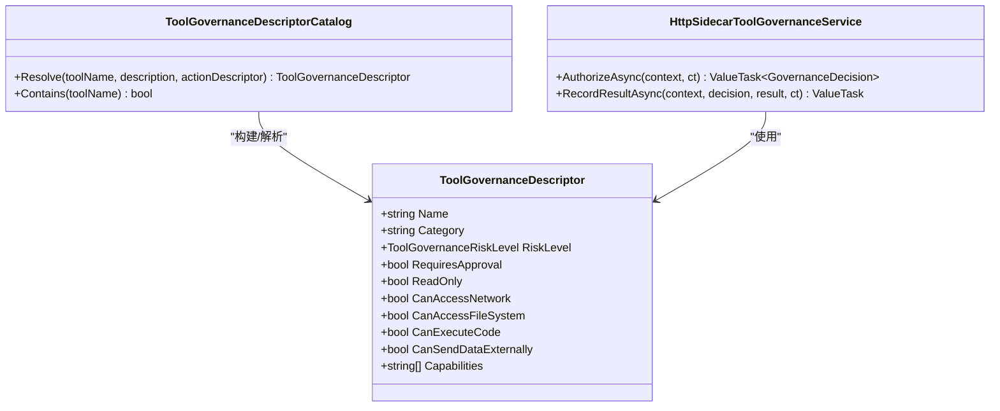
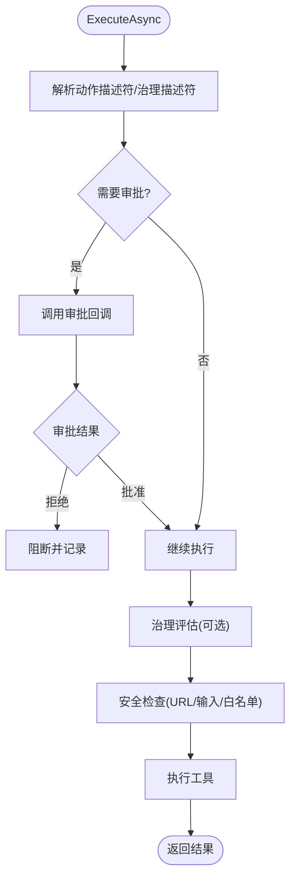
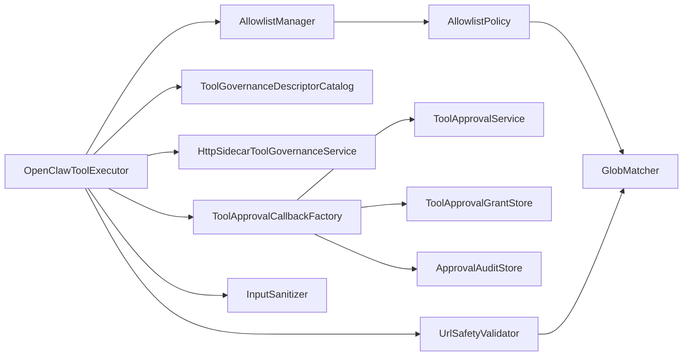
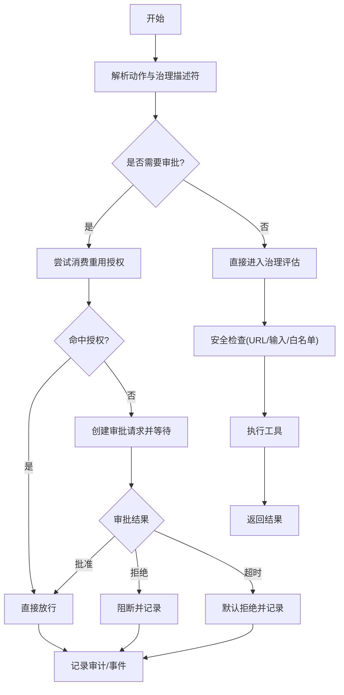

# 工具审批

<cite>
**本文引用的文件**
- [ToolApprovalService.cs](file://src/OpenClaw.Core/Pipeline/ToolApprovalService.cs)
- [ToolApprovalCallbackFactory.cs](file://src/OpenClaw.Gateway/ToolApprovalCallbackFactory.cs)
- [ToolApprovalGrantStore.cs](file://src/OpenClaw.Gateway/ToolApprovalGrantStore.cs)
- [ApprovalAuditStore.cs](file://src/OpenClaw.Gateway/ApprovalAuditStore.cs)
- [ToolGovernanceDescriptorCatalog.cs](file://src/OpenClaw.Core/Governance/ToolGovernanceDescriptorCatalog.cs)
- [HttpSidecarToolGovernanceService.cs](file://src/OpenClaw.Core/Governance/HttpSidecarToolGovernanceService.cs)
- [ToolGovernanceModels.cs](file://src/OpenClaw.Core/Models/ToolGovernanceModels.cs)
- [OpenClawToolExecutor.cs](file://src/OpenClaw.Agent/OpenClawToolExecutor.cs)
- [AllowlistManager.cs](file://src/OpenClaw.Core/Security/AllowlistManager.cs)
- [AllowlistPolicy.cs](file://src/OpenClaw.Core/Security/AllowlistPolicy.cs)
- [GlobMatcher.cs](file://src/OpenClaw.Core/Security/GlobMatcher.cs)
- [UrlSafetyValidator.cs](file://src/OpenClaw.Core/Security/UrlSafetyValidator.cs)
- [InputSanitizer.cs](file://src/OpenClaw.Core/Security/InputSanitizer.cs)
- [ToolPathPolicy.cs](file://src/OpenClaw.Core/Security/ToolPathPolicy.cs)
</cite>

## 目录
1. [简介](#简介)
2. [项目结构](#项目结构)
3. [核心组件](#核心组件)
4. [架构总览](#架构总览)
5. [详细组件分析](#详细组件分析)
6. [依赖关系分析](#依赖关系分析)
7. [性能考量](#性能考量)
8. [故障排查指南](#故障排查指南)
9. [结论](#结论)
10. [附录](#附录)

## 简介
本技术文档面向“工具审批系统”，围绕工具审批流程、审批策略、风险评估等核心能力，系统性阐述以下内容：
- 审批流程：自动审批、人工审批、紧急审批与超时处理
- 审批策略：内置治理描述符、可配置高风险工具集、重用审批授权
- 风险评估：治理侧车（HTTP）接口、失败闭合/开合策略、动作映射
- 安全基线：输入净化、URL 安全校验、通道白名单、路径策略（待启用）
- 与工具执行框架集成：审批回调、审批指纹校验、PEV 协作
- 可观测性：审批审计、事件记录、指标采集

## 项目结构
工具审批系统横跨多个子项目模块：
- 核心管道与模型：审批请求、等待结果、治理上下文与决策
- 网关层：审批回调工厂、审批授权存储、审批审计
- 执行器：工具执行器在执行前进行审批判定与治理评估
- 治理与安全：治理描述符目录、HTTP 侧车治理服务、URL 安全、输入净化、通道白名单、路径策略

图表来源
- [ToolApprovalCallbackFactory.cs:10-147](file://src/OpenClaw.Gateway/ToolApprovalCallbackFactory.cs#L10-147)
- [ToolApprovalGrantStore.cs:7-135](file://src/OpenClaw.Gateway/ToolApprovalGrantStore.cs#L7-135)
- [ApprovalAuditStore.cs:7-113](file://src/OpenClaw.Gateway/ApprovalAuditStore.cs#L7-113)
- [ToolGovernanceDescriptorCatalog.cs:5-181](file://src/OpenClaw.Core/Governance/ToolGovernanceDescriptorCatalog.cs#L5-181)
- [HttpSidecarToolGovernanceService.cs:8-236](file://src/OpenClaw.Core/Governance/HttpSidecarToolGovernanceService.cs#L8-236)
- [ToolGovernanceModels.cs:24-150](file://src/OpenClaw.Core/Models/ToolGovernanceModels.cs#L24-150)
- [OpenClawToolExecutor.cs:30-100](file://src/OpenClaw.Agent/OpenClawToolExecutor.cs#L30-100)
- [AllowlistManager.cs:19-125](file://src/OpenClaw.Core/Security/AllowlistManager.cs#L19-125)
- [AllowlistPolicy.cs:9-43](file://src/OpenClaw.Core/Security/AllowlistPolicy.cs#L9-43)
- [GlobMatcher.cs:3-89](file://src/OpenClaw.Core/Security/GlobMatcher.cs#L3-89)
- [UrlSafetyValidator.cs:17-219](file://src/OpenClaw.Core/Security/UrlSafetyValidator.cs#L17-219)
- [InputSanitizer.cs:9-84](file://src/OpenClaw.Core/Security/InputSanitizer.cs#L9-84)
- [ToolPathPolicy.cs:5-136](file://src/OpenClaw.Core/Security/ToolPathPolicy.cs#L5-136)

章节来源
- [ToolApprovalService.cs:49-265](file://src/OpenClaw.Core/Pipeline/ToolApprovalService.cs#L49-265)
- [ToolApprovalCallbackFactory.cs:8-171](file://src/OpenClaw.Gateway/ToolApprovalCallbackFactory.cs#L8-171)
- [ToolApprovalGrantStore.cs:7-165](file://src/OpenClaw.Gateway/ToolApprovalGrantStore.cs#L7-165)
- [ApprovalAuditStore.cs:7-126](file://src/OpenClaw.Gateway/ApprovalAuditStore.cs#L7-126)
- [ToolGovernanceDescriptorCatalog.cs:5-181](file://src/OpenClaw.Core/Governance/ToolGovernanceDescriptorCatalog.cs#L5-181)
- [HttpSidecarToolGovernanceService.cs:8-236](file://src/OpenClaw.Core/Governance/HttpSidecarToolGovernanceService.cs#L8-236)
- [ToolGovernanceModels.cs:24-150](file://src/OpenClaw.Core/Models/ToolGovernanceModels.cs#L24-150)
- [OpenClawToolExecutor.cs:30-100](file://src/OpenClaw.Agent/OpenClawToolExecutor.cs#L30-100)
- [AllowlistManager.cs:19-125](file://src/OpenClaw.Core/Security/AllowlistManager.cs#L19-125)
- [AllowlistPolicy.cs:9-43](file://src/OpenClaw.Core/Security/AllowlistPolicy.cs#L9-43)
- [GlobMatcher.cs:3-89](file://src/OpenClaw.Core/Security/GlobMatcher.cs#L3-89)
- [UrlSafetyValidator.cs:17-219](file://src/OpenClaw.Core/Security/UrlSafetyValidator.cs#L17-219)
- [InputSanitizer.cs:9-84](file://src/OpenClaw.Core/Security/InputSanitizer.cs#L9-84)
- [ToolPathPolicy.cs:5-136](file://src/OpenClaw.Core/Security/ToolPathPolicy.cs#L5-136)

## 核心组件
- 工具审批服务（内存队列）：负责创建审批请求、等待审批结果、超时处理与过期清理
- 审批回调工厂：生成工具执行前的审批回调，支持重用审批授权、记录审计、触发通知
- 审批授权存储：持久化“一次性/会话级/窗口级”重用授权，支持到期清理与原子写入
- 审批审计：以 JSONL 追加方式记录审批生命周期事件，支持查询与裁剪
- 治理描述符目录：内置工具分类、风险等级、是否需要审批、能力集合
- HTTP 侧车治理服务：向外部治理侧车发起授权请求与结果审计，支持失败闭合/开合策略
- 工具执行器：在执行前综合审批要求、治理评估、路径/URL/输入安全策略
- 安全组件：通道白名单、URL 安全校验、输入净化、路径策略（预留）

章节来源
- [ToolApprovalService.cs:49-265](file://src/OpenClaw.Core/Pipeline/ToolApprovalService.cs#L49-265)
- [ToolApprovalCallbackFactory.cs:8-171](file://src/OpenClaw.Gateway/ToolApprovalCallbackFactory.cs#L8-171)
- [ToolApprovalGrantStore.cs:7-165](file://src/OpenClaw.Gateway/ToolApprovalGrantStore.cs#L7-165)
- [ApprovalAuditStore.cs:7-126](file://src/OpenClaw.Gateway/ApprovalAuditStore.cs#L7-126)
- [ToolGovernanceDescriptorCatalog.cs:5-181](file://src/OpenClaw.Core/Governance/ToolGovernanceDescriptorCatalog.cs#L5-181)
- [HttpSidecarToolGovernanceService.cs:8-236](file://src/OpenClaw.Core/Governance/HttpSidecarToolGovernanceService.cs#L8-236)
- [OpenClawToolExecutor.cs:30-100](file://src/OpenClaw.Agent/OpenClawToolExecutor.cs#L30-100)
- [AllowlistManager.cs:19-125](file://src/OpenClaw.Core/Security/AllowlistManager.cs#L19-125)
- [UrlSafetyValidator.cs:17-219](file://src/OpenClaw.Core/Security/UrlSafetyValidator.cs#L17-219)
- [InputSanitizer.cs:9-84](file://src/OpenClaw.Core/Security/InputSanitizer.cs#L9-84)

## 架构总览
工具审批与治理的整体调用链如下：

图表来源
- [OpenClawToolExecutor.cs:346-433](file://src/OpenClaw.Agent/OpenClawToolExecutor.cs#L346-433)
- [ToolApprovalCallbackFactory.cs:42-146](file://src/OpenClaw.Gateway/ToolApprovalCallbackFactory.cs#L42-146)
- [ToolApprovalService.cs:65-218](file://src/OpenClaw.Core/Pipeline/ToolApprovalService.cs#L65-218)
- [ToolApprovalGrantStore.cs:63-135](file://src/OpenClaw.Gateway/ToolApprovalGrantStore.cs#L63-135)
- [ApprovalAuditStore.cs:28-71](file://src/OpenClaw.Gateway/ApprovalAuditStore.cs#L28-71)
- [HttpSidecarToolGovernanceService.cs:24-107](file://src/OpenClaw.Core/Governance/HttpSidecarToolGovernanceService.cs#L24-107)

## 详细组件分析

### 组件A：工具审批服务（内存队列）
- 角色：在“监督式自治”模式下，作为内存中的审批队列，承载审批请求、等待审批结果、超时与过期清理
- 关键点：
  - 请求创建：生成唯一 approvalId，设置超时时间
  - 决策记录：支持带请求者身份的授权校验，防止越权
  - 等待结果：支持超时取消，超时默认拒绝并清理
  - 列表查询：按频道/发送者过滤，自动清理过期与已完成请求
- 复杂度：并发字典查找/删除 O(1)，列表过滤 O(n)

图表来源
- [ToolApprovalService.cs:49-265](file://src/OpenClaw.Core/Pipeline/ToolApprovalService.cs#L49-265)

章节来源
- [ToolApprovalService.cs:49-265](file://src/OpenClaw.Core/Pipeline/ToolApprovalService.cs#L49-265)

### 组件B：审批回调工厂
- 角色：在工具执行前生成审批回调，负责：
  - 消费重用审批授权（一次性/会话/窗口）
  - 创建审批请求并记录审计
  - 触发审批等待与超时处理
  - 可选记录治理账本（过期/决策）
- 关键点：
  - 审批超时由配置约束，最小/最大范围限制
  - 审批指纹一致性校验，避免请求后变更
  - 超时事件记录到运行时事件流

图表来源
- [ToolApprovalCallbackFactory.cs:10-147](file://src/OpenClaw.Gateway/ToolApprovalCallbackFactory.cs#L10-147)
- [ToolApprovalGrantStore.cs:63-135](file://src/OpenClaw.Gateway/ToolApprovalGrantStore.cs#L63-135)
- [ToolApprovalService.cs:156-218](file://src/OpenClaw.Core/Pipeline/ToolApprovalService.cs#L156-218)
- [ApprovalAuditStore.cs:28-71](file://src/OpenClaw.Gateway/ApprovalAuditStore.cs#L28-71)

章节来源
- [ToolApprovalCallbackFactory.cs:8-171](file://src/OpenClaw.Gateway/ToolApprovalCallbackFactory.cs#L8-171)

### 组件C：审批授权存储
- 角色：持久化“一次性/会话/窗口”重用授权，支持到期清理与原子写入
- 关键点：
  - 并发安全：锁保护 + 原子 JSON 写入
  - 自动清理：读取时移除过期授权
  - 消费逻辑：根据作用域匹配并扣减剩余使用次数

图表来源
- [ToolApprovalGrantStore.cs:63-135](file://src/OpenClaw.Gateway/ToolApprovalGrantStore.cs#L63-135)

章节来源
- [ToolApprovalGrantStore.cs:7-165](file://src/OpenClaw.Gateway/ToolApprovalGrantStore.cs#L7-165)

### 组件D：审批审计
- 角色：以 JSONL 追加方式记录审批生命周期事件，支持查询与裁剪
- 关键点：
  - 参数预览长度限制
  - 查询支持按频道/发送者/工具名/时间范围过滤
  - 原子追加写入，失败日志记录

章节来源
- [ApprovalAuditStore.cs:7-126](file://src/OpenClaw.Gateway/ApprovalAuditStore.cs#L7-126)

### 组件E：治理描述符目录与 HTTP 侧车治理服务
- 角色：
  - 描述符目录：内置工具分类、风险等级、是否需要审批、能力集合
  - HTTP 侧车治理：对外部治理服务发起授权请求与结果审计，支持失败闭合/开合策略
- 关键点：
  - 动态合并：根据动作描述符覆盖默认描述符
  - 动作映射：侧车返回动作映射到 Allow/Deny/RequireApproval/Redact/AuditOnly
  - 失败策略：高风险或副作用工具默认失败闭合；低风险只读可失败开合

图表来源
- [ToolGovernanceDescriptorCatalog.cs:5-181](file://src/OpenClaw.Core/Governance/ToolGovernanceDescriptorCatalog.cs#L5-181)
- [HttpSidecarToolGovernanceService.cs:8-236](file://src/OpenClaw.Core/Governance/HttpSidecarToolGovernanceService.cs#L8-236)
- [ToolGovernanceModels.cs:65-93](file://src/OpenClaw.Core/Models/ToolGovernanceModels.cs#L65-93)

章节来源
- [ToolGovernanceDescriptorCatalog.cs:5-181](file://src/OpenClaw.Core/Governance/ToolGovernanceDescriptorCatalog.cs#L5-181)
- [HttpSidecarToolGovernanceService.cs:8-236](file://src/OpenClaw.Core/Governance/HttpSidecarToolGovernanceService.cs#L8-236)
- [ToolGovernanceModels.cs:24-150](file://src/OpenClaw.Core/Models/ToolGovernanceModels.cs#L24-150)

### 组件F：工具执行器与审批集成
- 角色：在执行前综合审批要求、治理评估、路径/URL/输入安全策略
- 关键点：
  - 显式配置高风险工具集与动作感知审批
  - 审批指纹一致性校验，避免请求后变更
  - 治理侧车不可用时的失败闭合/开合策略
  - 与 PEV 协作记录审批决策

图表来源
- [OpenClawToolExecutor.cs:346-433](file://src/OpenClaw.Agent/OpenClawToolExecutor.cs#L346-433)
- [OpenClawToolExecutor.cs:987-998](file://src/OpenClaw.Agent/OpenClawToolExecutor.cs#L987-998)

章节来源
- [OpenClawToolExecutor.cs:30-100](file://src/OpenClaw.Agent/OpenClawToolExecutor.cs#L30-100)
- [OpenClawToolExecutor.cs:346-433](file://src/OpenClaw.Agent/OpenClawToolExecutor.cs#L346-433)
- [OpenClawToolExecutor.cs:987-998](file://src/OpenClaw.Agent/OpenClawToolExecutor.cs#L987-998)

### 组件G：安全扫描与路径白名单
- 通道白名单：动态/静态组合，支持按频道持久化
- URL 安全：基于 DNS 解析、私有网络与 CIDR 黑名单校验
- 输入净化：检测 Shell 元字符、剥离 CRLF、校验内存键与 IMAP 文件夹名
- 路径策略：预留实现（当前为注释模板）

章节来源
- [AllowlistManager.cs:19-125](file://src/OpenClaw.Core/Security/AllowlistManager.cs#L19-125)
- [AllowlistPolicy.cs:9-43](file://src/OpenClaw.Core/Security/AllowlistPolicy.cs#L9-43)
- [GlobMatcher.cs:3-89](file://src/OpenClaw.Core/Security/GlobMatcher.cs#L3-89)
- [UrlSafetyValidator.cs:17-219](file://src/OpenClaw.Core/Security/UrlSafetyValidator.cs#L17-219)
- [InputSanitizer.cs:9-84](file://src/OpenClaw.Core/Security/InputSanitizer.cs#L9-84)
- [ToolPathPolicy.cs:5-136](file://src/OpenClaw.Core/Security/ToolPathPolicy.cs#L5-136)

## 依赖关系分析
- 执行器依赖：审批回调工厂、治理描述符目录、HTTP 侧车治理服务、安全组件
- 网关依赖：审批服务、审批授权存储、审批审计
- 安全组件之间：白名单策略依赖通配匹配，URL 安全依赖通配匹配与 DNS 解析

图表来源
- [OpenClawToolExecutor.cs:30-100](file://src/OpenClaw.Agent/OpenClawToolExecutor.cs#L30-100)
- [ToolApprovalCallbackFactory.cs:8-171](file://src/OpenClaw.Gateway/ToolApprovalCallbackFactory.cs#L8-171)
- [ToolApprovalService.cs:49-265](file://src/OpenClaw.Core/Pipeline/ToolApprovalService.cs#L49-265)
- [ToolApprovalGrantStore.cs:7-165](file://src/OpenClaw.Gateway/ToolApprovalGrantStore.cs#L7-165)
- [ApprovalAuditStore.cs:7-126](file://src/OpenClaw.Gateway/ApprovalAuditStore.cs#L7-126)
- [AllowlistManager.cs:19-125](file://src/OpenClaw.Core/Security/AllowlistManager.cs#L19-125)
- [AllowlistPolicy.cs:9-43](file://src/OpenClaw.Core/Security/AllowlistPolicy.cs#L9-43)
- [GlobMatcher.cs:3-89](file://src/OpenClaw.Core/Security/GlobMatcher.cs#L3-89)
- [UrlSafetyValidator.cs:17-219](file://src/OpenClaw.Core/Security/UrlSafetyValidator.cs#L17-219)
- [InputSanitizer.cs:9-84](file://src/OpenClaw.Core/Security/InputSanitizer.cs#L9-84)

章节来源
- [OpenClawToolExecutor.cs:30-100](file://src/OpenClaw.Agent/OpenClawToolExecutor.cs#L30-100)
- [ToolApprovalCallbackFactory.cs:8-171](file://src/OpenClaw.Gateway/ToolApprovalCallbackFactory.cs#L8-171)
- [ToolApprovalService.cs:49-265](file://src/OpenClaw.Core/Pipeline/ToolApprovalService.cs#L49-265)
- [ToolApprovalGrantStore.cs:7-165](file://src/OpenClaw.Gateway/ToolApprovalGrantStore.cs#L7-165)
- [ApprovalAuditStore.cs:7-126](file://src/OpenClaw.Gateway/ApprovalAuditStore.cs#L7-126)
- [AllowlistManager.cs:19-125](file://src/OpenClaw.Core/Security/AllowlistManager.cs#L19-125)
- [AllowlistPolicy.cs:9-43](file://src/OpenClaw.Core/Security/AllowlistPolicy.cs#L9-43)
- [GlobMatcher.cs:3-89](file://src/OpenClaw.Core/Security/GlobMatcher.cs#L3-89)
- [UrlSafetyValidator.cs:17-219](file://src/OpenClaw.Core/Security/UrlSafetyValidator.cs#L17-219)
- [InputSanitizer.cs:9-84](file://src/OpenClaw.Core/Security/InputSanitizer.cs#L9-84)

## 性能考量
- 审批队列：内存并发字典操作，建议合理设置审批超时与队列深度监控
- 原子持久化：审批授权与审计采用原子写入，注意磁盘 IO 压力
- 治理侧车：超时令牌与失败闭合策略减少阻塞，建议配置合理的超时与失败策略
- 白名单与 URL 校验：通配匹配与 DNS 解析可能成为瓶颈，建议缓存与限流

## 故障排查指南
- 审批超时：检查审批超时配置、审批队列深度、审批回调是否被正确触发
- 授权未命中：确认授权作用域与剩余次数，检查到期清理逻辑
- 治理侧车不可用：查看失败闭合/开合策略是否符合预期，关注审计日志
- 安全拦截：核对白名单/URL 安全策略与输入净化规则，定位具体拦截原因

章节来源
- [ToolApprovalService.cs:156-218](file://src/OpenClaw.Core/Pipeline/ToolApprovalService.cs#L156-218)
- [ToolApprovalCallbackFactory.cs:125-146](file://src/OpenClaw.Gateway/ToolApprovalCallbackFactory.cs#L125-146)
- [ApprovalAuditStore.cs:73-101](file://src/OpenClaw.Gateway/ApprovalAuditStore.cs#L73-101)
- [HttpSidecarToolGovernanceService.cs:167-203](file://src/OpenClaw.Core/Governance/HttpSidecarToolGovernanceService.cs#L167-203)
- [UrlSafetyValidator.cs:27-58](file://src/OpenClaw.Core/Security/UrlSafetyValidator.cs#L27-58)
- [InputSanitizer.cs:24-82](file://src/OpenClaw.Core/Security/InputSanitizer.cs#L24-82)

## 结论
工具审批系统通过“审批回调工厂 + 内存审批服务 + 治理侧车 + 安全基线”的组合，实现了从自动审批到人工审批再到紧急审批的完整闭环，并提供了可观测的审计与事件记录。执行器在执行前进行多层校验，确保高风险工具在受控环境下运行。建议结合业务场景合理配置审批超时、治理策略与安全策略，持续优化审批效率与安全性。

## 附录

### 审批流程图（概念）

### 审批策略设计指南
- 高风险工具集：明确 shell/code_exec/git/external_cli/payment 等工具的审批要求
- 重用授权：合理设计一次性/会话/窗口级授权，避免滥用
- 失败策略：高风险或副作用工具默认失败闭合；低风险只读可失败开合
- 审批超时：根据业务 SLA 设置合理超时，避免长时间阻塞

### 风险评估方法
- 治理描述符：依据工具类别、风险等级、能力集合与副作用判断
- 侧车动作映射：统一映射到 Allow/Deny/RequireApproval/Redact/AuditOnly
- 失效保护：不可用时的失败闭合/开合策略，保障系统可用性

### 审批效率优化
- 缓存与限流：白名单与 URL 校验结果缓存，DNS 解析限流
- 原子写入：审批授权与审计采用原子写入，降低冲突
- 监控告警：审批队列深度、超时率、治理侧车可用性等指标监控