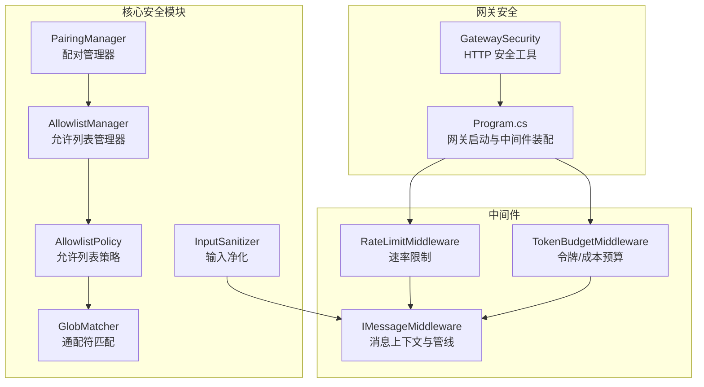
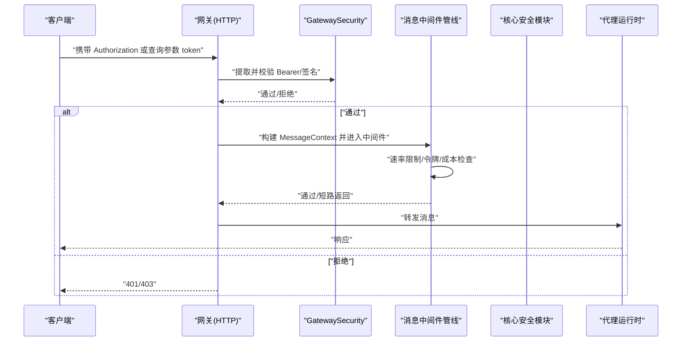
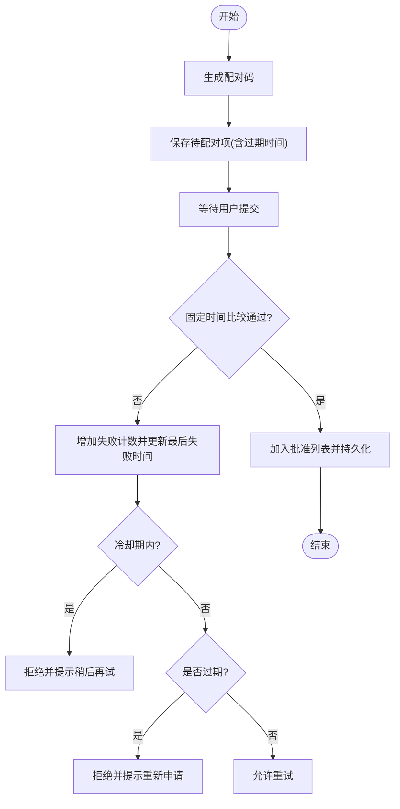
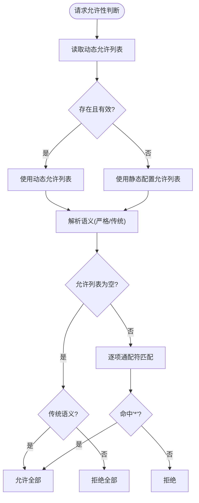
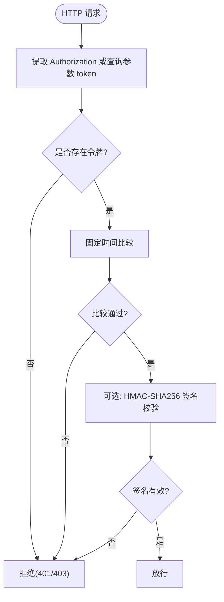
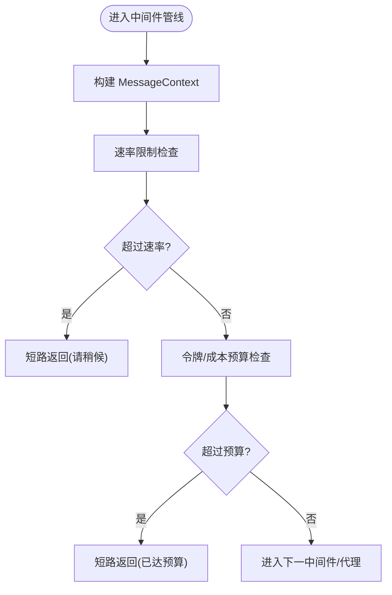
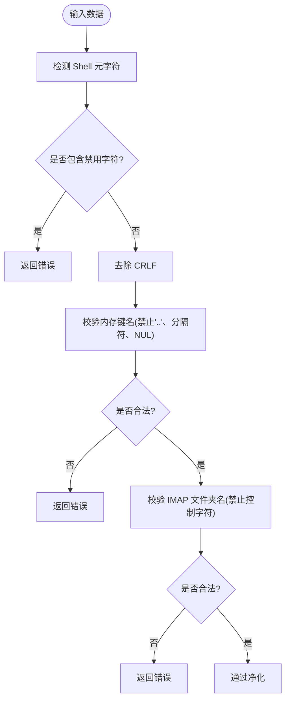
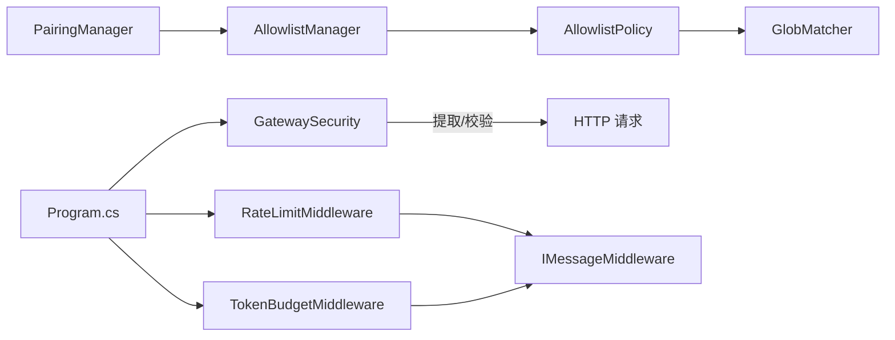
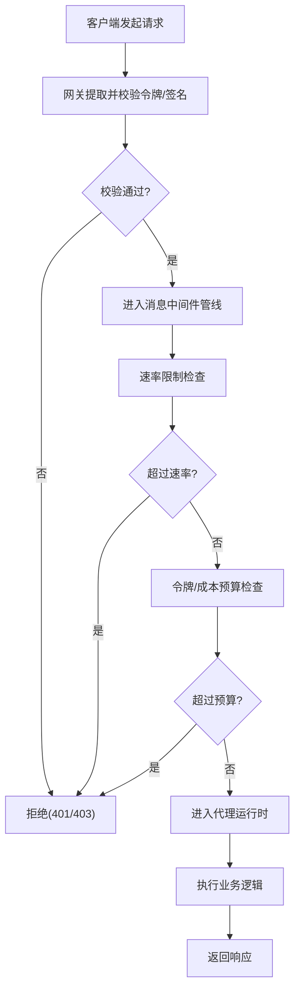

# 访问控制

<cite>
**本文引用的文件**
- [src/OpenClaw.Core/Security/PairingManager.cs](file://src/OpenClaw.Core/Security/PairingManager.cs)
- [src/OpenClaw.Core/Security/AllowlistManager.cs](file://src/OpenClaw.Core/Security/AllowlistManager.cs)
- [src/OpenClaw.Core/Security/AllowlistPolicy.cs](file://src/OpenClaw.Core/Security/AllowlistPolicy.cs)
- [src/OpenClaw.Core/Security/GlobMatcher.cs](file://src/OpenClaw.Core/Security/GlobMatcher.cs)
- [src/OpenClaw.Core/Security/InputSanitizer.cs](file://src/OpenClaw.Core/Security/InputSanitizer.cs)
- [src/OpenClaw.Gateway/GatewaySecurity.cs](file://src/OpenClaw.Gateway/GatewaySecurity.cs)
- [src/OpenClaw.Gateway/Program.cs](file://src/OpenClaw.Gateway/Program.cs)
- [src/OpenClaw.Core/Middleware/IMessageMiddleware.cs](file://src/OpenClaw.Core/Middleware/IMessageMiddleware.cs)
- [src/OpenClaw.Core/Middleware/RateLimitMiddleware.cs](file://src/OpenClaw.Core/Middleware/RateLimitMiddleware.cs)
- [src/OpenClaw.Core/Middleware/TokenBudgetMiddleware.cs](file://src/OpenClaw.Core/Middleware/TokenBudgetMiddleware.cs)
</cite>

## 目录
1. [简介](#简介)
2. [项目结构](#项目结构)
3. [核心组件](#核心组件)
4. [架构总览](#架构总览)
5. [详细组件分析](#详细组件分析)
6. [依赖关系分析](#依赖关系分析)
7. [性能考量](#性能考量)
8. [故障排查指南](#故障排查指南)
9. [结论](#结论)
10. [附录](#附录)

## 简介
本文件面向访问控制系统，系统性阐述身份认证机制、令牌管理、权限控制与策略执行，覆盖以下关键能力：
- 配对管理器：用于渠道侧发送方的“一次性配对码”生成与审批，支持固定时间比较、冷却期与持久化批准列表。
- 允许列表管理器与策略：按通道维度维护动态/静态允许列表，支持通配符匹配与严格/传统两种语义。
- 网关安全工具：提供 Bearer 令牌提取、固定时间令牌校验、HMAC-SHA256 签名校验等通用安全能力。
- 中间件与预算控制：消息级速率限制与会话级令牌/成本预算控制，保障资源使用可控。
- 输入净化与路径策略：防御注入攻击与路径遍历，提升工具层安全边界。

本文件同时给出访问控制流程图、权限矩阵、配置示例与安全最佳实践，帮助在网关服务与代理运行时之间建立一致、可审计、可扩展的访问控制体系。

## 项目结构
访问控制相关代码主要分布在核心库与网关服务中：
- 核心安全模块（OpenClaw.Core.Security）：配对、允许列表、通配符匹配、输入净化等。
- 网关安全工具（OpenClaw.Gateway）：HTTP 层令牌与签名解析与校验。
- 中间件（OpenClaw.Core.Middleware）：消息管道中的速率与预算控制。
- 网关入口（OpenClaw.Gateway.Program）：注册安全中间件与端点映射。

**图表来源**
- [src/OpenClaw.Core/Security/PairingManager.cs:1-211](file://src/OpenClaw.Core/Security/PairingManager.cs#L1-L211)
- [src/OpenClaw.Core/Security/AllowlistManager.cs:1-126](file://src/OpenClaw.Core/Security/AllowlistManager.cs#L1-L126)
- [src/OpenClaw.Core/Security/AllowlistPolicy.cs:1-43](file://src/OpenClaw.Core/Security/AllowlistPolicy.cs#L1-L43)
- [src/OpenClaw.Core/Security/GlobMatcher.cs:1-89](file://src/OpenClaw.Core/Security/GlobMatcher.cs#L1-L89)
- [src/OpenClaw.Core/Security/InputSanitizer.cs:1-84](file://src/OpenClaw.Core/Security/InputSanitizer.cs#L1-L84)
- [src/OpenClaw.Gateway/GatewaySecurity.cs:1-109](file://src/OpenClaw.Gateway/GatewaySecurity.cs#L1-L109)
- [src/OpenClaw.Gateway/Program.cs:1-124](file://src/OpenClaw.Gateway/Program.cs#L1-L124)
- [src/OpenClaw.Core/Middleware/IMessageMiddleware.cs:1-97](file://src/OpenClaw.Core/Middleware/IMessageMiddleware.cs#L1-L97)
- [src/OpenClaw.Core/Middleware/RateLimitMiddleware.cs:1-93](file://src/OpenClaw.Core/Middleware/RateLimitMiddleware.cs#L1-L93)
- [src/OpenClaw.Core/Middleware/TokenBudgetMiddleware.cs:1-71](file://src/OpenClaw.Core/Middleware/TokenBudgetMiddleware.cs#L1-L71)

**章节来源**
- [src/OpenClaw.Gateway/Program.cs:80-98](file://src/OpenClaw.Gateway/Program.cs#L80-L98)

## 核心组件
- 配对管理器（PairingManager）
  - 功能：为未批准的渠道发送方生成一次性 6 位配对码；基于固定时间比较进行安全校验；支持失败尝试冷却；持久化批准列表以重启不丢失。
  - 关键点：超时清理、固定时间比较、并发字典、原子写入临时文件后移动覆盖。
- 允许列表管理器（AllowlistManager）
  - 功能：按通道维护动态允许列表文件；支持增删改；优先动态文件覆盖静态配置。
  - 关键点：线程安全锁、原子写入、路径安全化、UTC 更新时间记录。
- 允许列表策略（AllowlistPolicy）
  - 功能：解析允许列表语义（严格/传统），提供通配符匹配判断。
  - 关键点：空列表在传统语义下视为“允许全部”，星号通配符直接放行。
- 网关安全工具（GatewaySecurity）
  - 功能：从 Authorization 头或查询参数提取令牌；固定时间令牌比较；HMAC-SHA256 签名校验。
  - 关键点：大小写不敏感前缀匹配、十六进制签名解析、常量时间比较。
- 中间件（IMessageMiddleware、RateLimitMiddleware、TokenBudgetMiddleware）
  - 功能：消息上下文传递、短路返回；按会话速率限制；按会话令牌/成本预算控制。
  - 关键点：队列窗口计数、空闲回收、原子清理阈值、USD 成本回调。

**章节来源**
- [src/OpenClaw.Core/Security/PairingManager.cs:14-124](file://src/OpenClaw.Core/Security/PairingManager.cs#L14-L124)
- [src/OpenClaw.Core/Security/AllowlistManager.cs:19-84](file://src/OpenClaw.Core/Security/AllowlistManager.cs#L19-L84)
- [src/OpenClaw.Core/Security/AllowlistPolicy.cs:9-41](file://src/OpenClaw.Core/Security/AllowlistPolicy.cs#L9-L41)
- [src/OpenClaw.Gateway/GatewaySecurity.cs:8-76](file://src/OpenClaw.Gateway/GatewaySecurity.cs#L8-L76)
- [src/OpenClaw.Core/Middleware/IMessageMiddleware.cs:7-38](file://src/OpenClaw.Core/Middleware/IMessageMiddleware.cs#L7-L38)
- [src/OpenClaw.Core/Middleware/RateLimitMiddleware.cs:10-68](file://src/OpenClaw.Core/Middleware/RateLimitMiddleware.cs#L10-L68)
- [src/OpenClaw.Core/Middleware/TokenBudgetMiddleware.cs:12-69](file://src/OpenClaw.Core/Middleware/TokenBudgetMiddleware.cs#L12-L69)

## 架构总览
访问控制在网关层与代理运行时之间形成“请求进入—鉴权—策略—中间件—业务处理”的闭环。网关负责外部接入的令牌与签名校验，核心安全模块负责内部策略与配对/允许列表管理，中间件在消息进入代理前进行速率与预算控制。

**图表来源**
- [src/OpenClaw.Gateway/GatewaySecurity.cs:13-37](file://src/OpenClaw.Gateway/GatewaySecurity.cs#L13-L37)
- [src/OpenClaw.Core/Middleware/IMessageMiddleware.cs:44-54](file://src/OpenClaw.Core/Middleware/IMessageMiddleware.cs#L44-L54)
- [src/OpenClaw.Core/Middleware/RateLimitMiddleware.cs:39-68](file://src/OpenClaw.Core/Middleware/RateLimitMiddleware.cs#L39-L68)
- [src/OpenClaw.Core/Middleware/TokenBudgetMiddleware.cs:36-69](file://src/OpenClaw.Core/Middleware/TokenBudgetMiddleware.cs#L36-L69)
- [src/OpenClaw.Gateway/Program.cs:86-93](file://src/OpenClaw.Gateway/Program.cs#L86-L93)

## 详细组件分析

### 配对管理器（PairingManager）
- 设计要点
  - 使用并发字典存储待配对条目，带过期时间与失败次数控制。
  - 固定时间比较防止时序攻击；冷却期避免暴力破解。
  - 批准列表持久化到磁盘，采用临时文件+原子移动保证一致性。
- 关键流程

**图表来源**
- [src/OpenClaw.Core/Security/PairingManager.cs:53-124](file://src/OpenClaw.Core/Security/PairingManager.cs#L53-L124)

**章节来源**
- [src/OpenClaw.Core/Security/PairingManager.cs:14-124](file://src/OpenClaw.Core/Security/PairingManager.cs#L14-L124)

### 允许列表管理器与策略（AllowlistManager/AllowlistPolicy/GlobMatcher）
- 设计要点
  - 动态允许列表文件优先于静态配置；原子写入确保一致性。
  - 支持“严格/传统”两种语义：严格模式下空允许列表即拒绝；传统模式下空列表表示允许全部。
  - 通配符匹配仅支持“*”，避免复杂正则带来的性能与安全问题。
- 关键流程

**图表来源**
- [src/OpenClaw.Core/Security/AllowlistManager.cs:50-51](file://src/OpenClaw.Core/Security/AllowlistManager.cs#L50-L51)
- [src/OpenClaw.Core/Security/AllowlistPolicy.cs:18-40](file://src/OpenClaw.Core/Security/AllowlistPolicy.cs#L18-L40)
- [src/OpenClaw.Core/Security/GlobMatcher.cs:9-63](file://src/OpenClaw.Core/Security/GlobMatcher.cs#L9-L63)

**章节来源**
- [src/OpenClaw.Core/Security/AllowlistManager.cs:19-84](file://src/OpenClaw.Core/Security/AllowlistManager.cs#L19-L84)
- [src/OpenClaw.Core/Security/AllowlistPolicy.cs:9-41](file://src/OpenClaw.Core/Security/AllowlistPolicy.cs#L9-L41)
- [src/OpenClaw.Core/Security/GlobMatcher.cs:3-89](file://src/OpenClaw.Core/Security/GlobMatcher.cs#L3-L89)

### 网关安全工具（GatewaySecurity）
- 设计要点
  - 提供从 Authorization 头提取 Bearer 令牌的能力，并可选允许查询参数 token。
  - 使用固定时间比较进行令牌校验，避免时序信息泄露。
  - 支持 HMAC-SHA256 签名校验，自动识别 sha256= 前缀与十六进制编码。
- 关键流程

**图表来源**
- [src/OpenClaw.Gateway/GatewaySecurity.cs:13-37](file://src/OpenClaw.Gateway/GatewaySecurity.cs#L13-L37)
- [src/OpenClaw.Gateway/GatewaySecurity.cs:39-76](file://src/OpenClaw.Gateway/GatewaySecurity.cs#L39-L76)

**章节来源**
- [src/OpenClaw.Gateway/GatewaySecurity.cs:8-109](file://src/OpenClaw.Gateway/GatewaySecurity.cs#L8-L109)

### 中间件与预算控制（IMessageMiddleware/RateLimitMiddleware/TokenBudgetMiddleware）
- 设计要点
  - 消息上下文贯穿中间件链，支持短路返回与属性传递。
  - 速率限制基于滑动窗口与队列，空闲回收降低内存占用。
  - 令牌预算与 USD 成本预算均可启用，超过阈值短路返回友好提示。
- 关键流程

**图表来源**
- [src/OpenClaw.Core/Middleware/IMessageMiddleware.cs:44-54](file://src/OpenClaw.Core/Middleware/IMessageMiddleware.cs#L44-L54)
- [src/OpenClaw.Core/Middleware/RateLimitMiddleware.cs:39-68](file://src/OpenClaw.Core/Middleware/RateLimitMiddleware.cs#L39-L68)
- [src/OpenClaw.Core/Middleware/TokenBudgetMiddleware.cs:36-69](file://src/OpenClaw.Core/Middleware/TokenBudgetMiddleware.cs#L36-L69)

**章节来源**
- [src/OpenClaw.Core/Middleware/IMessageMiddleware.cs:7-38](file://src/OpenClaw.Core/Middleware/IMessageMiddleware.cs#L7-L38)
- [src/OpenClaw.Core/Middleware/RateLimitMiddleware.cs:10-68](file://src/OpenClaw.Core/Middleware/RateLimitMiddleware.cs#L10-L68)
- [src/OpenClaw.Core/Middleware/TokenBudgetMiddleware.cs:12-69](file://src/OpenClaw.Core/Middleware/TokenBudgetMiddleware.cs#L12-L69)

### 输入净化与路径策略（InputSanitizer/工具路径策略）
- 设计要点
  - 提供 Shell 元字符检测、CRLF 去除、IMAP 文件夹名安全校验、内存键名路径遍历防护等。
  - 工具路径策略预留了文件系统根目录白名单与真实路径解析能力，当前以注释形式存在，便于后续启用。
- 关键流程

**图表来源**
- [src/OpenClaw.Core/Security/InputSanitizer.cs:24-82](file://src/OpenClaw.Core/Security/InputSanitizer.cs#L24-L82)

**章节来源**
- [src/OpenClaw.Core/Security/InputSanitizer.cs:9-84](file://src/OpenClaw.Core/Security/InputSanitizer.cs#L9-L84)

## 依赖关系分析
- 组件耦合
  - 网关安全工具独立于核心安全模块，仅在 HTTP 层使用，便于替换与扩展。
  - 允许列表策略依赖通配符匹配器，二者组合提供灵活的访问控制规则。
  - 中间件与核心安全模块解耦，通过消息上下文与配置驱动策略执行。
- 外部依赖
  - 使用固定时间比较与哈希算法进行安全校验，避免时序与信息泄露。
  - JSON 序列化/反序列化用于动态允许列表与批准列表的持久化。

**图表来源**
- [src/OpenClaw.Gateway/GatewaySecurity.cs:1-109](file://src/OpenClaw.Gateway/GatewaySecurity.cs#L1-L109)
- [src/OpenClaw.Core/Security/AllowlistPolicy.cs:1-43](file://src/OpenClaw.Core/Security/AllowlistPolicy.cs#L1-L43)
- [src/OpenClaw.Core/Security/GlobMatcher.cs:1-89](file://src/OpenClaw.Core/Security/GlobMatcher.cs#L1-L89)
- [src/OpenClaw.Core/Security/AllowlistManager.cs:1-126](file://src/OpenClaw.Core/Security/AllowlistManager.cs#L1-L126)
- [src/OpenClaw.Core/Security/PairingManager.cs:1-211](file://src/OpenClaw.Core/Security/PairingManager.cs#L1-L211)
- [src/OpenClaw.Core/Middleware/IMessageMiddleware.cs:1-97](file://src/OpenClaw.Core/Middleware/IMessageMiddleware.cs#L1-L97)
- [src/OpenClaw.Core/Middleware/RateLimitMiddleware.cs:1-93](file://src/OpenClaw.Core/Middleware/RateLimitMiddleware.cs#L1-L93)
- [src/OpenClaw.Core/Middleware/TokenBudgetMiddleware.cs:1-71](file://src/OpenClaw.Core/Middleware/TokenBudgetMiddleware.cs#L1-L71)
- [src/OpenClaw.Gateway/Program.cs:1-124](file://src/OpenClaw.Gateway/Program.cs#L1-L124)

**章节来源**
- [src/OpenClaw.Gateway/Program.cs:86-93](file://src/OpenClaw.Gateway/Program.cs#L86-L93)

## 性能考量
- 时间复杂度
  - 允许列表匹配：单次匹配近似 O(n)（n 为规则数量），建议规则数量控制在合理范围。
  - 通配符匹配：基于 Span 的线性扫描，避免 Split 分割开销。
  - 速率限制：滑动窗口队列操作均摊 O(1)，空闲回收降低内存占用。
- 存储与 I/O
  - 动态允许列表与批准列表采用原子写入（临时文件+移动），减少竞态与损坏风险。
  - 并发字典与锁粒度控制在通道级别，降低争用。
- 安全与健壮性
  - 固定时间比较与哈希比较避免时序攻击。
  - 异常捕获与日志记录，失败时回退至安全状态。

[本节为通用性能讨论，无需特定文件来源]

## 故障排查指南
- 配对码无效或过期
  - 检查配对码 TTL 与失败尝试冷却；确认固定时间比较是否被触发。
  - 查看批准列表持久化是否成功（临时文件清理与移动）。
- 允许列表不生效
  - 确认动态文件是否覆盖静态配置；检查规则格式与通配符使用。
  - 校验语义设置（严格/传统）与预期行为是否一致。
- 令牌校验失败
  - 确认 Authorization 头格式与大小写；检查查询参数 token 是否被允许。
  - 排查签名前缀与十六进制编码是否正确。
- 速率限制误伤
  - 调整每分钟最大消息数与空闲回收 TTL；观察清理阈值是否过低导致频繁回收。
- 预算控制误伤
  - 核对会话令牌累计值与 USD 成本回调返回值；必要时放宽阈值或启用成本预算。

**章节来源**
- [src/OpenClaw.Core/Security/PairingManager.cs:70-124](file://src/OpenClaw.Core/Security/PairingManager.cs#L70-L124)
- [src/OpenClaw.Core/Security/AllowlistManager.cs:32-51](file://src/OpenClaw.Core/Security/AllowlistManager.cs#L32-L51)
- [src/OpenClaw.Core/Security/AllowlistPolicy.cs:11-16](file://src/OpenClaw.Core/Security/AllowlistPolicy.cs#L11-L16)
- [src/OpenClaw.Gateway/GatewaySecurity.cs:13-37](file://src/OpenClaw.Gateway/GatewaySecurity.cs#L13-L37)
- [src/OpenClaw.Core/Middleware/RateLimitMiddleware.cs:39-68](file://src/OpenClaw.Core/Middleware/RateLimitMiddleware.cs#L39-L68)
- [src/OpenClaw.Core/Middleware/TokenBudgetMiddleware.cs:36-69](file://src/OpenClaw.Core/Middleware/TokenBudgetMiddleware.cs#L36-L69)

## 结论
该访问控制系统通过“配对—允许列表—令牌/签名—中间件预算”多层防护，实现了从入口到消息处理的全链路安全控制。其设计强调：
- 安全性：固定时间比较、哈希签名、输入净化与路径遍历防护。
- 可运维性：动态允许列表、原子写入、日志与告警。
- 可扩展性：策略可插拔、中间件可组合、配置可热更新。

建议在生产环境中结合最小权限原则与审计追踪，持续优化策略与阈值，确保系统在高负载下仍保持稳定与安全。

[本节为总结，无需特定文件来源]

## 附录

### 访问控制流程图（端到端）

**图表来源**
- [src/OpenClaw.Gateway/GatewaySecurity.cs:13-37](file://src/OpenClaw.Gateway/GatewaySecurity.cs#L13-L37)
- [src/OpenClaw.Core/Middleware/RateLimitMiddleware.cs:39-68](file://src/OpenClaw.Core/Middleware/RateLimitMiddleware.cs#L39-L68)
- [src/OpenClaw.Core/Middleware/TokenBudgetMiddleware.cs:36-69](file://src/OpenClaw.Core/Middleware/TokenBudgetMiddleware.cs#L36-L69)

### 权限矩阵（概念示意）
- 配对管理
  - 生成配对码：管理员/系统
  - 审批配对：管理员/系统
  - 撤销批准：管理员
- 允许列表
  - 动态更新：管理员/系统
  - 规则匹配：系统
- 中间件
  - 速率限制：系统
  - 令牌/成本预算：系统

[本图为概念示意，无需图表来源]

### 配置示例（概念性）
- 允许列表语义
  - 严格：空列表即拒绝
  - 传统：空列表即允许全部
- 速率限制
  - 每通道每发送方：每分钟最大消息数
  - 空闲回收：超过一定时间无活动自动清理
- 预算控制
  - 会话令牌上限：超过则短路
  - USD 成本上限：通过回调查询并控制

[本节为概念性配置说明，无需特定文件来源]

### 安全配置指南
- 最小权限原则
  - 默认拒绝所有，仅在明确需要时添加允许规则。
  - 优先使用更严格的“严格”语义，避免历史兼容导致的宽泛放行。
- 令牌与签名
  - 使用强随机令牌；定期轮换；启用固定时间比较与签名校验。
- 输入净化
  - 在工具层启用输入净化，阻断注入与路径遍历。
- 审计与监控
  - 记录配对、批准、撤销、速率限制触发、预算超限事件。
  - 对异常尝试（频繁失败、签名错误）进行告警。

[本节为通用安全建议，无需特定文件来源]