# 输入验证和清理

<cite>
**本文引用的文件**
- [InputSanitizer.cs](file://src/OpenClaw.Core/Security/InputSanitizer.cs)
- [RedactionPipeline.cs](file://src/OpenClaw.Core/Security/RedactionPipeline.cs)
- [SentinelSubstitution.cs](file://src/OpenClaw.Core/Security/SentinelSubstitution.cs)
- [AllowlistPolicy.cs](file://src/OpenClaw.Core/Security/AllowlistPolicy.cs)
- [GlobMatcher.cs](file://src/OpenClaw.Core/Security/GlobMatcher.cs)
- [UrlSafetyValidator.cs](file://src/OpenClaw.Core/Security/UrlSafetyValidator.cs)
- [GatewaySecurity.cs](file://src/OpenClaw.Gateway/GatewaySecurity.cs)
- [SlackWebhookHandler.cs](file://src/OpenClaw.Gateway/SlackWebhookHandler.cs)
- [IMessageMiddleware.cs](file://src/OpenClaw.Core/Middleware/IMessageMiddleware.cs)
- [Session.cs](file://src/OpenClaw.Core/Models/Session.cs)
- [GatewayConfig.cs](file://src/OpenClaw.Core/Models/GatewayConfig.cs)
- [SecurityPostureBuilder.cs](file://src/OpenClaw.Gateway/SecurityPostureBuilder.cs)
- [DatabaseTool.cs](file://src/OpenClaw.Agent/Tools/DatabaseTool.cs)
- [BrowserTool.cs](file://src/OpenClaw.Agent/Tools/BrowserTool.cs)
- [PaymentSensitiveDataRedactor.cs](file://src/OpenClaw.Payments.Core/PaymentSensitiveDataRedactor.cs)
- [SecurityTests.cs](file://src/OpenClaw.Tests/SecurityTests.cs)
- [UrlSafetyValidatorTests.cs](file://src/OpenClaw.Tests/UrlSafetyValidatorTests.cs)
- [AllowlistPolicyTests.cs](file://src/OpenClaw.Tests/AllowlistPolicyTests.cs)
- [PaymentRuntimeTests.cs](file://src/OpenClaw.Tests/PaymentRuntimeTests.cs)
</cite>

## 目录
1. [简介](#简介)
2. [项目结构](#项目结构)
3. [核心组件](#核心组件)
4. [架构总览](#架构总览)
5. [组件详解](#组件详解)
6. [依赖关系分析](#依赖关系分析)
7. [性能考量](#性能考量)
8. [故障排查指南](#故障排查指南)
9. [结论](#结论)
10. [附录](#附录)

## 简介
本技术文档聚焦于输入验证与清理系统，覆盖以下方面：
- 输入验证机制：参数合法性校验、协议安全检查（如CRLF剥离、路径穿越防护）、工具级策略（SQL表访问白名单、Git分支名等）。
- 数据清理策略：敏感信息识别与脱敏、会话级数据清洗、哨兵替换以区分执行态与持久化态参数。
- 安全集成：URL安全策略、通道签名验证、网关绑定安全预设、中间件短路与速率限制。
- 恶意输入检测与防护：SQL注入、XSS、命令注入、路径穿越、私网目标访问控制等。

## 项目结构
输入验证与清理相关代码主要分布在如下模块：
- 核心安全库：输入净化、敏感信息脱敏、URL安全策略、白名单策略、哨兵替换。
- 网关层：令牌解析与校验、通道签名验证、公共绑定安全强化。
- 中间件：消息处理流水线，支持短路与变换。
- 工具层：数据库工具的SQL策略校验、浏览器工具的地址与CIDR校验。
- 支付扩展：支付场景专用敏感信息脱敏器。

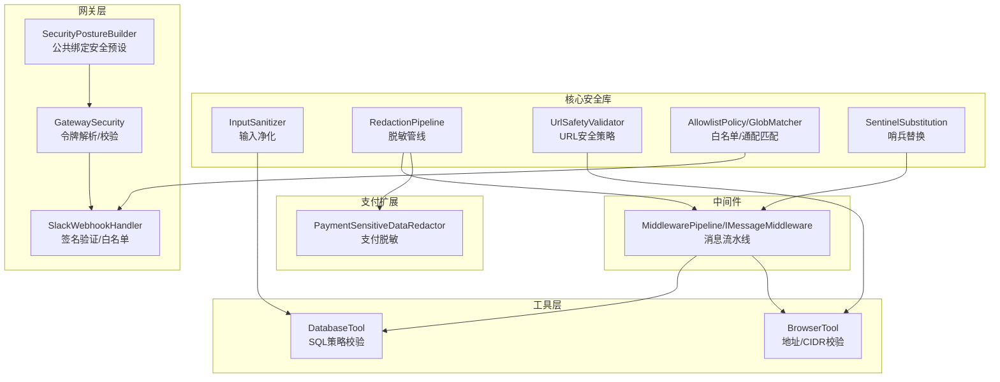

**图表来源**
- [InputSanitizer.cs:1-84](file://src/OpenClaw.Core/Security/InputSanitizer.cs#L1-L84)
- [RedactionPipeline.cs:1-131](file://src/OpenClaw.Core/Security/RedactionPipeline.cs#L1-L131)
- [UrlSafetyValidator.cs:1-219](file://src/OpenClaw.Core/Security/UrlSafetyValidator.cs#L1-L219)
- [AllowlistPolicy.cs:1-43](file://src/OpenClaw.Core/Security/AllowlistPolicy.cs#L1-L43)
- [GlobMatcher.cs:1-89](file://src/OpenClaw.Core/Security/GlobMatcher.cs#L1-L89)
- [SentinelSubstitution.cs:1-38](file://src/OpenClaw.Core/Security/SentinelSubstitution.cs#L1-L38)
- [GatewaySecurity.cs:1-44](file://src/OpenClaw.Gateway/GatewaySecurity.cs#L1-L44)
- [SlackWebhookHandler.cs:1-41](file://src/OpenClaw.Gateway/SlackWebhookHandler.cs#L1-L41)
- [SecurityPostureBuilder.cs:126-147](file://src/OpenClaw.Gateway/SecurityPostureBuilder.cs#L126-L147)
- [IMessageMiddleware.cs:1-68](file://src/OpenClaw.Core/Middleware/IMessageMiddleware.cs#L1-L68)
- [DatabaseTool.cs:350-394](file://src/OpenClaw.Agent/Tools/DatabaseTool.cs#L350-L394)
- [BrowserTool.cs:116-146](file://src/OpenClaw.Agent/Tools/BrowserTool.cs#L116-L146)
- [PaymentSensitiveDataRedactor.cs:1-63](file://src/OpenClaw.Payments.Core/PaymentSensitiveDataRedactor.cs#L1-L63)

**章节来源**
- [InputSanitizer.cs:1-84](file://src/OpenClaw.Core/Security/InputSanitizer.cs#L1-L84)
- [RedactionPipeline.cs:1-131](file://src/OpenClaw.Core/Security/RedactionPipeline.cs#L1-L131)
- [UrlSafetyValidator.cs:1-219](file://src/OpenClaw.Core/Security/UrlSafetyValidator.cs#L1-L219)
- [AllowlistPolicy.cs:1-43](file://src/OpenClaw.Core/Security/AllowlistPolicy.cs#L1-L43)
- [GlobMatcher.cs:1-89](file://src/OpenClaw.Core/Security/GlobMatcher.cs#L1-L89)
- [SentinelSubstitution.cs:1-38](file://src/OpenClaw.Core/Security/SentinelSubstitution.cs#L1-L38)
- [GatewaySecurity.cs:1-44](file://src/OpenClaw.Gateway/GatewaySecurity.cs#L1-L44)
- [SlackWebhookHandler.cs:1-41](file://src/OpenClaw.Gateway/SlackWebhookHandler.cs#L1-L41)
- [SecurityPostureBuilder.cs:126-147](file://src/OpenClaw.Gateway/SecurityPostureBuilder.cs#L126-L147)
- [IMessageMiddleware.cs:1-68](file://src/OpenClaw.Core/Middleware/IMessageMiddleware.cs#L1-L68)
- [DatabaseTool.cs:350-394](file://src/OpenClaw.Agent/Tools/DatabaseTool.cs#L350-L394)
- [BrowserTool.cs:116-146](file://src/OpenClaw.Agent/Tools/BrowserTool.cs#L116-L146)
- [PaymentSensitiveDataRedactor.cs:1-63](file://src/OpenClaw.Payments.Core/PaymentSensitiveDataRedactor.cs#L1-L63)

## 核心组件
- 输入净化器：提供Shell元字符检测、CRLF剥离、内存键名校验、IMAP文件夹名校验等通用能力。
- 脱敏管线：对字符串、会话历史、会话分支进行多阶段敏感信息脱敏；内置基础密钥脱敏器与支付专用脱敏器。
- 哨兵替换：在执行态与持久化态之间切换参数JSON，避免将敏感参数写入日志或持久化存储。
- 白名单策略：支持严格/传统两种语义，基于通配符匹配；提供允许/拒绝组合评估。
- URL安全策略：绝对HTTP(S)校验、主机黑名单、私网/非公网地址阻断、CIDR阻断、DNS解析与地址判定。
- 网关安全：令牌提取与常量时间比较、通道签名验证、公共绑定安全预设。
- 中间件流水线：消息上下文短路与变换，支持限流、令牌预算等中间件。
- 工具级验证：数据库工具的SQL策略（多语句禁用、表白名单/黑名单）、浏览器工具的地址与CIDR校验。

**章节来源**
- [InputSanitizer.cs:1-84](file://src/OpenClaw.Core/Security/InputSanitizer.cs#L1-L84)
- [RedactionPipeline.cs:1-131](file://src/OpenClaw.Core/Security/RedactionPipeline.cs#L1-L131)
- [SentinelSubstitution.cs:1-38](file://src/OpenClaw.Core/Security/SentinelSubstitution.cs#L1-L38)
- [AllowlistPolicy.cs:1-43](file://src/OpenClaw.Core/Security/AllowlistPolicy.cs#L1-L43)
- [GlobMatcher.cs:1-89](file://src/OpenClaw.Core/Security/GlobMatcher.cs#L1-L89)
- [UrlSafetyValidator.cs:1-219](file://src/OpenClaw.Core/Security/UrlSafetyValidator.cs#L1-L219)
- [GatewaySecurity.cs:1-44](file://src/OpenClaw.Gateway/GatewaySecurity.cs#L1-L44)
- [IMessageMiddleware.cs:1-68](file://src/OpenClaw.Core/Middleware/IMessageMiddleware.cs#L1-L68)
- [DatabaseTool.cs:350-394](file://src/OpenClaw.Agent/Tools/DatabaseTool.cs#L350-L394)
- [BrowserTool.cs:116-146](file://src/OpenClaw.Agent/Tools/BrowserTool.cs#L116-L146)
- [PaymentSensitiveDataRedactor.cs:1-63](file://src/OpenClaw.Payments.Core/PaymentSensitiveDataRedactor.cs#L1-L63)

## 架构总览
输入验证与清理贯穿“请求进入—中间件—工具执行—结果输出”的全链路，形成纵深防御：

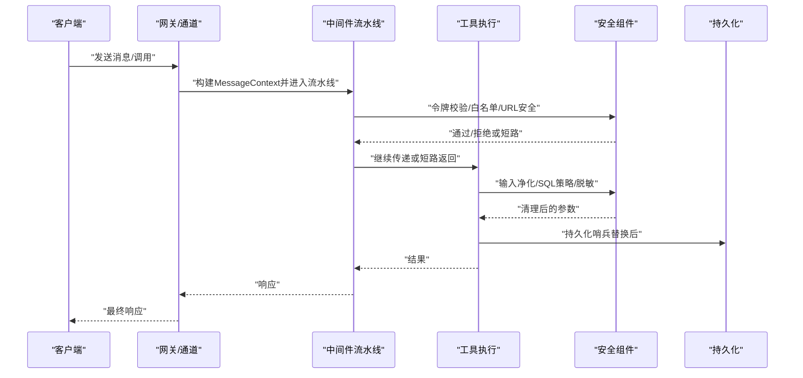

**图表来源**
- [GatewaySecurity.cs:1-44](file://src/OpenClaw.Gateway/GatewaySecurity.cs#L1-L44)
- [SlackWebhookHandler.cs:1-41](file://src/OpenClaw.Gateway/SlackWebhookHandler.cs#L1-L41)
- [IMessageMiddleware.cs:1-68](file://src/OpenClaw.Core/Middleware/IMessageMiddleware.cs#L1-L68)
- [InputSanitizer.cs:1-84](file://src/OpenClaw.Core/Security/InputSanitizer.cs#L1-L84)
- [UrlSafetyValidator.cs:1-219](file://src/OpenClaw.Core/Security/UrlSafetyValidator.cs#L1-L219)
- [RedactionPipeline.cs:1-131](file://src/OpenClaw.Core/Security/RedactionPipeline.cs#L1-L131)
- [SentinelSubstitution.cs:1-38](file://src/OpenClaw.Core/Security/SentinelSubstitution.cs#L1-L38)
- [DatabaseTool.cs:350-394](file://src/OpenClaw.Agent/Tools/DatabaseTool.cs#L350-L394)

## 组件详解

### 输入净化器（InputSanitizer）
- 功能要点
  - Shell元字符检测：禁止分号、管道、重定向、反引号、美元、花括号、尖括号及换行回车等。
  - CRLF剥离：针对IMAP/SMTP协议输入，移除回车与换行，防止命令注入。
  - 内存键名校验：禁止路径穿越、斜杠、反斜杠、空字符。
  - IMAP文件夹名校验：禁止控制字符。
- 性能特性
  - 使用SIMD加速的SearchValues进行快速扫描。
  - CRLF剥离采用Span与自定义字符串构造，减少分配。
- 典型用途
  - 工具参数校验、协议输入清洗、路径与文件名安全检查。

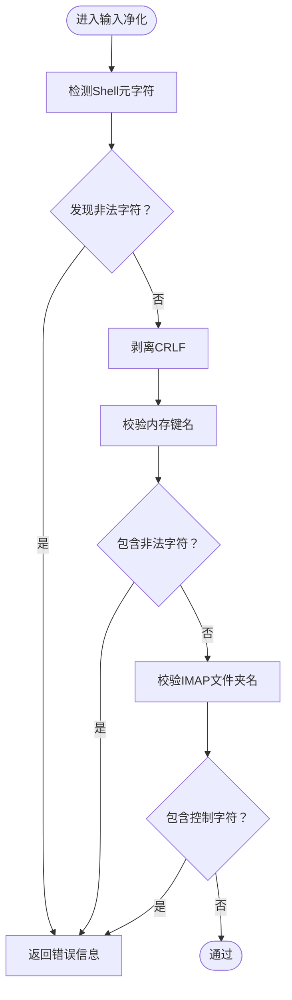

**图表来源**
- [InputSanitizer.cs:1-84](file://src/OpenClaw.Core/Security/InputSanitizer.cs#L1-L84)

**章节来源**
- [InputSanitizer.cs:1-84](file://src/OpenClaw.Core/Security/InputSanitizer.cs#L1-L84)
- [SecurityTests.cs:108-140](file://src/OpenClaw.Tests/SecurityTests.cs#L108-L140)

### 敏感信息脱敏与会话清理（RedactionPipeline）
- 功能要点
  - 多阶段脱敏器链：按顺序对输入文本执行脱敏。
  - 会话级脱敏：对History中的Content、ToolCalls.arguments/result/failure/next_step进行原地脱敏。
  - 分支脱敏：克隆SessionBranch并转换为Session进行脱敏。
  - 基础脱敏器：识别Authorization Bearer、OpenAI密钥、API Key字段等。
  - 支付脱敏器：识别并脱敏卡号、CVV、授权头、JSON字段、支付令牌等，并保留末尾4位以便审计。
- 设计模式
  - IRedactionPipeline接口与RedactionPipeline实现，支持空操作实现NoopRedactionPipeline。
- 复杂度
  - 文本脱敏：O(n)遍历与多次正则替换。
  - 会话脱敏：对每条对话轮次与每个工具调用进行脱敏，整体O(N)。

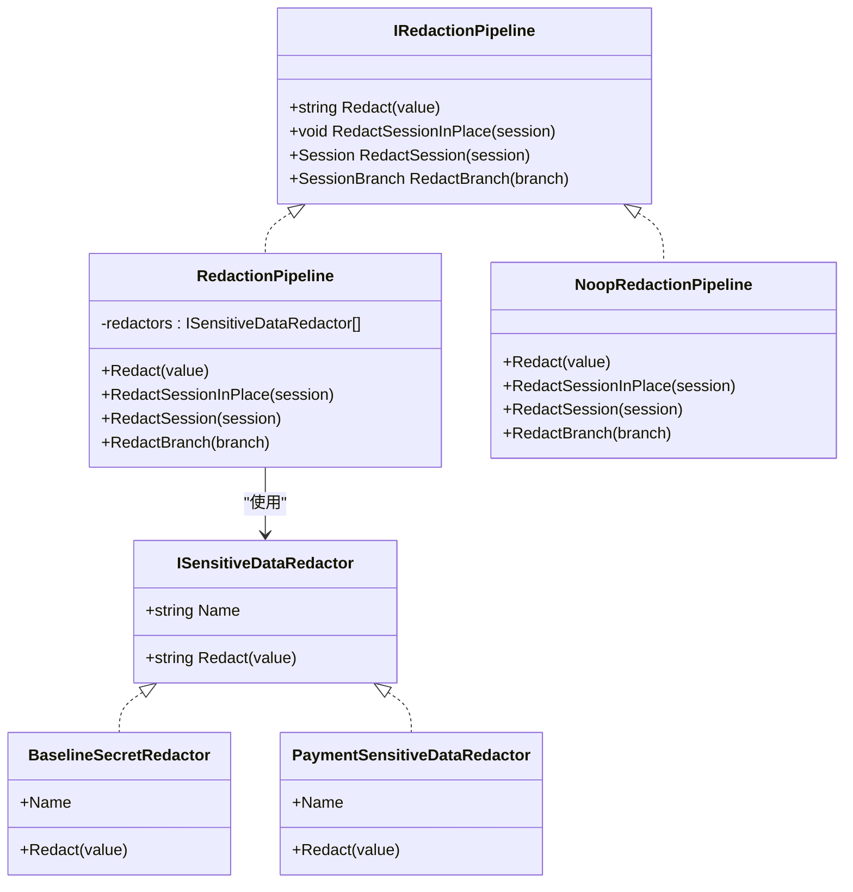

**图表来源**
- [RedactionPipeline.cs:1-131](file://src/OpenClaw.Core/Security/RedactionPipeline.cs#L1-L131)
- [PaymentSensitiveDataRedactor.cs:1-63](file://src/OpenClaw.Payments.Core/PaymentSensitiveDataRedactor.cs#L1-L63)

**章节来源**
- [RedactionPipeline.cs:1-131](file://src/OpenClaw.Core/Security/RedactionPipeline.cs#L1-L131)
- [PaymentSensitiveDataRedactor.cs:1-63](file://src/OpenClaw.Payments.Core/PaymentSensitiveDataRedactor.cs#L1-L63)
- [Session.cs:152-200](file://src/OpenClaw.Core/Models/Session.cs#L152-L200)
- [PaymentRuntimeTests.cs:17-30](file://src/OpenClaw.Tests/PaymentRuntimeTests.cs#L17-L30)

### 哨兵替换（SentinelSubstitution）
- 功能要点
  - 将执行态参数与持久化参数分离，避免将敏感参数写入日志或持久化存储。
  - 上下文包含工具名、参数JSON、会话/通道/发送者/关联ID、工作区、支付提供商与环境等。
  - 提供空操作实现NoopSentinelSubstitutionService用于测试或禁用场景。
- 应用场景
  - 在工具执行前后分别生成执行态与持久化态参数JSON，确保日志与存储仅记录脱敏后的参数。

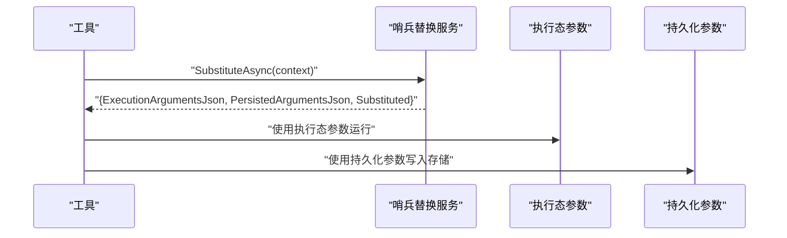

**图表来源**
- [SentinelSubstitution.cs:1-38](file://src/OpenClaw.Core/Security/SentinelSubstitution.cs#L1-L38)

**章节来源**
- [SentinelSubstitution.cs:1-38](file://src/OpenClaw.Core/Security/SentinelSubstitution.cs#L1-L38)

### 白名单策略与通配匹配（AllowlistPolicy / GlobMatcher）
- 功能要点
  - AllowlistSemantics：Strict（严格，默认）与Legacy（传统，空列表即放行）。
  - GlobMatcher：支持简单通配“*”，前缀/中缀匹配，避免Split('*')分配。
  - IsAllowed：先deny后allow，空allow列表即deny all。
- 典型用途
  - 通道入站消息来源白名单、路由工具集、频道/房间命名等。

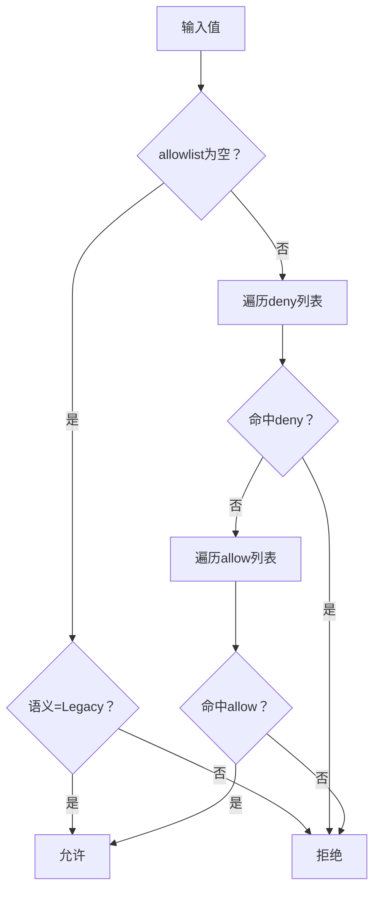

**图表来源**
- [AllowlistPolicy.cs:1-43](file://src/OpenClaw.Core/Security/AllowlistPolicy.cs#L1-L43)
- [GlobMatcher.cs:1-89](file://src/OpenClaw.Core/Security/GlobMatcher.cs#L1-L89)

**章节来源**
- [AllowlistPolicy.cs:1-43](file://src/OpenClaw.Core/Security/AllowlistPolicy.cs#L1-L43)
- [GlobMatcher.cs:1-89](file://src/OpenClaw.Core/Security/GlobMatcher.cs#L1-L89)
- [AllowlistPolicyTests.cs:1-33](file://src/OpenClaw.Tests/AllowlistPolicyTests.cs#L1-L33)

### URL安全策略（UrlSafetyValidator）
- 功能要点
  - 仅允许绝对HTTP/HTTPS URL。
  - 内置主机黑名单（localhost/metadata等）。
  - 可选阻断私网/非公网地址（loopback/0/127/169.254/172.16–31/192.168.x.x/224+等IPv4；link/site/local/multicast/IPv6 fc00/ff00等）。
  - 支持CIDR阻断列表。
  - DNS解析失败/无地址时拒绝。
- 异步与同步两套API，异步版本可进行DNS解析。

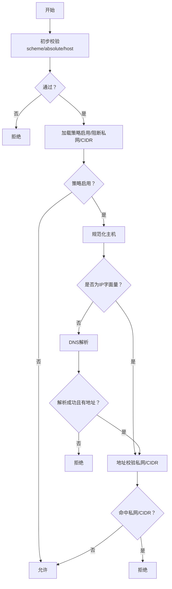

**图表来源**
- [UrlSafetyValidator.cs:1-219](file://src/OpenClaw.Core/Security/UrlSafetyValidator.cs#L1-L219)

**章节来源**
- [UrlSafetyValidator.cs:1-219](file://src/OpenClaw.Core/Security/UrlSafetyValidator.cs#L1-L219)
- [UrlSafetyValidatorTests.cs:1-41](file://src/OpenClaw.Tests/UrlSafetyValidatorTests.cs#L1-L41)

### 网关安全与通道签名（GatewaySecurity / SlackWebhookHandler）
- 功能要点
  - 令牌提取：支持Authorization: Bearer与可选查询串token。
  - 常量时间比较：避免时序攻击。
  - 通道签名验证：Slack等通道的签名/令牌校验，结合白名单策略。
  - 公共绑定安全预设：在非回环绑定时强制更严格的安全配置，禁止不安全工具与原始密钥引用。
- 集成点
  - 网关启动前执行安全预设校验。
  - 入站Webhook处理器在业务逻辑前进行签名与白名单校验。

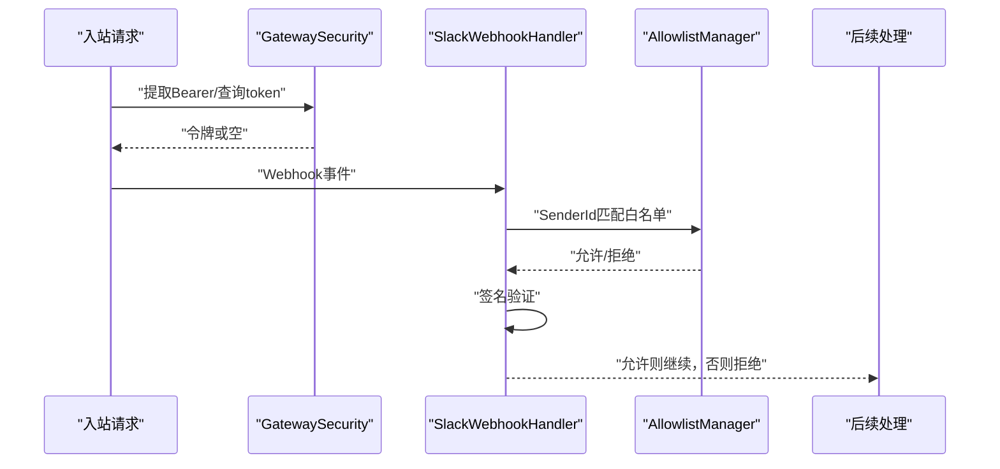

**图表来源**
- [GatewaySecurity.cs:1-44](file://src/OpenClaw.Gateway/GatewaySecurity.cs#L1-L44)
- [SlackWebhookHandler.cs:1-41](file://src/OpenClaw.Gateway/SlackWebhookHandler.cs#L1-L41)
- [SecurityPostureBuilder.cs:126-147](file://src/OpenClaw.Gateway/SecurityPostureBuilder.cs#L126-L147)

**章节来源**
- [GatewaySecurity.cs:1-44](file://src/OpenClaw.Gateway/GatewaySecurity.cs#L1-L44)
- [SlackWebhookHandler.cs:1-41](file://src/OpenClaw.Gateway/SlackWebhookHandler.cs#L1-L41)
- [SecurityPostureBuilder.cs:126-147](file://src/OpenClaw.Gateway/SecurityPostureBuilder.cs#L126-L147)

### 中间件流水线（MiddlewarePipeline / IMessageMiddleware）
- 功能要点
  - MessageContext：承载通道、发送者、文本、会话令牌统计、属性字典、短路响应。
  - 中间件可变换文本、设置短路响应并终止后续执行。
  - 支持限流、令牌预算等中间件组合。
- 性能
  - 空流水线与单中间件路径分配极低，适合高频消息处理。

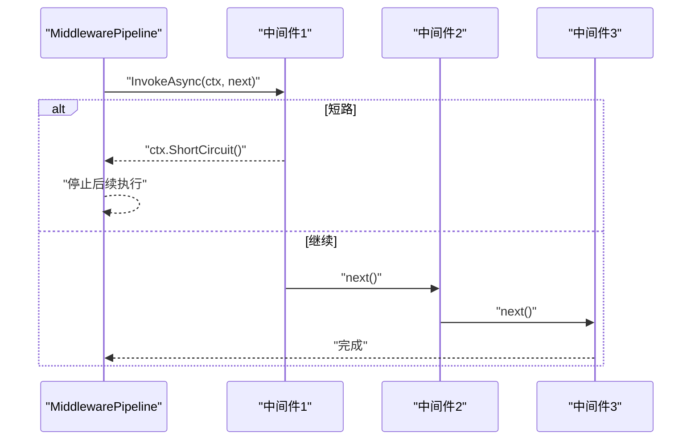

**图表来源**
- [IMessageMiddleware.cs:1-68](file://src/OpenClaw.Core/Middleware/IMessageMiddleware.cs#L1-L68)

**章节来源**
- [IMessageMiddleware.cs:1-68](file://src/OpenClaw.Core/Middleware/IMessageMiddleware.cs#L1-L68)

### 工具级输入验证

#### 数据库工具（DatabaseTool）SQL策略
- 功能要点
  - 禁止多语句（可配置开关）。
  - 表白名单/黑名单：规范化标识符后匹配，未显式允许的表一律拒绝。
  - 表名注入检测：在执行前即拦截非法表名。
- 安全收益
  - 从源头阻断SQL注入与越权访问。

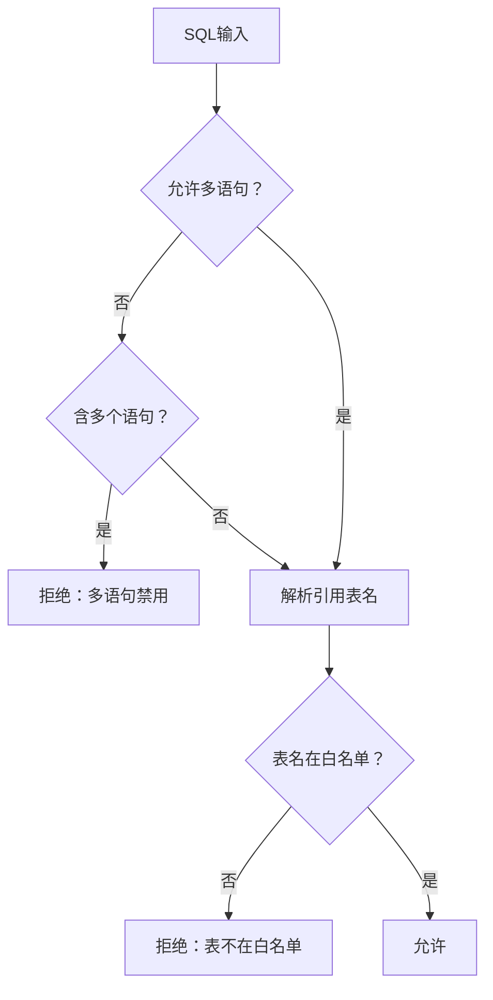

**图表来源**
- [DatabaseTool.cs:350-394](file://src/OpenClaw.Agent/Tools/DatabaseTool.cs#L350-L394)

**章节来源**
- [DatabaseTool.cs:350-394](file://src/OpenClaw.Agent/Tools/DatabaseTool.cs#L350-L394)
- [SecurityTests.cs:233-260](file://src/OpenClaw.Tests/SecurityTests.cs#L233-L260)

#### 浏览器工具（BrowserTool）地址与CIDR校验
- 功能要点
  - 对IPv4/IPv6进行阻断范围判断（本地/链路本地/站点本地/组播/特殊前缀等）。
  - 支持IPv4映射IPv6归一化。
  - 与URL安全策略协同，阻断私网/非公网目标。

**章节来源**
- [BrowserTool.cs:116-146](file://src/OpenClaw.Agent/Tools/BrowserTool.cs#L116-L146)
- [UrlSafetyValidator.cs:140-173](file://src/OpenClaw.Core/Security/UrlSafetyValidator.cs#L140-L173)

## 依赖关系分析

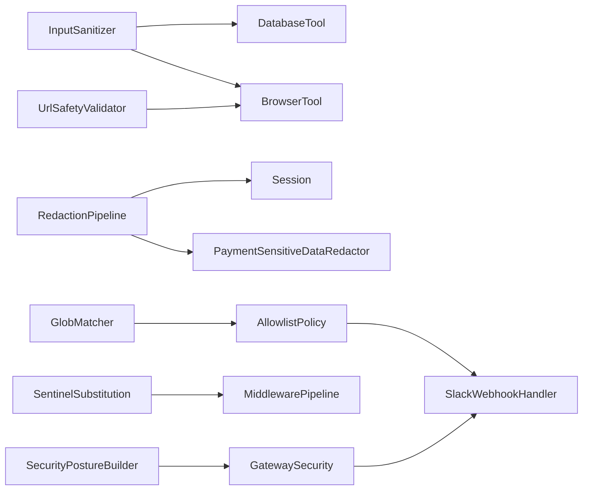

**图表来源**
- [InputSanitizer.cs:1-84](file://src/OpenClaw.Core/Security/InputSanitizer.cs#L1-L84)
- [RedactionPipeline.cs:1-131](file://src/OpenClaw.Core/Security/RedactionPipeline.cs#L1-L131)
- [UrlSafetyValidator.cs:1-219](file://src/OpenClaw.Core/Security/UrlSafetyValidator.cs#L1-L219)
- [AllowlistPolicy.cs:1-43](file://src/OpenClaw.Core/Security/AllowlistPolicy.cs#L1-L43)
- [GlobMatcher.cs:1-89](file://src/OpenClaw.Core/Security/GlobMatcher.cs#L1-L89)
- [SentinelSubstitution.cs:1-38](file://src/OpenClaw.Core/Security/SentinelSubstitution.cs#L1-L38)
- [GatewaySecurity.cs:1-44](file://src/OpenClaw.Gateway/GatewaySecurity.cs#L1-L44)
- [SlackWebhookHandler.cs:1-41](file://src/OpenClaw.Gateway/SlackWebhookHandler.cs#L1-L41)
- [SecurityPostureBuilder.cs:126-147](file://src/OpenClaw.Gateway/SecurityPostureBuilder.cs#L126-L147)
- [DatabaseTool.cs:350-394](file://src/OpenClaw.Agent/Tools/DatabaseTool.cs#L350-L394)
- [BrowserTool.cs:116-146](file://src/OpenClaw.Agent/Tools/BrowserTool.cs#L116-L146)
- [Session.cs:152-200](file://src/OpenClaw.Core/Models/Session.cs#L152-L200)
- [PaymentSensitiveDataRedactor.cs:1-63](file://src/OpenClaw.Payments.Core/PaymentSensitiveDataRedactor.cs#L1-L63)

**章节来源**
- 同上

## 性能考量
- SIMD与Span：输入净化器使用SearchValues与Span构造，降低GC压力与CPU开销。
- 正则与通配：脱敏器与白名单匹配均采用编译正则与零分配匹配，适合高吞吐场景。
- 中间件流水线：空/单中间件路径分配极少，适合高频消息处理。
- DNS解析：URL安全策略异步版本在必要时才进行DNS解析，避免不必要的网络开销。
- 建议
  - 对高频输入优先使用SIMD/Span路径。
  - 缓存编译后的正则表达式，避免重复编译。
  - 控制脱敏器链长度，仅保留必要规则。
  - 在公共绑定场景下启用安全预设，避免额外的运行时检查。

[本节为通用性能指导，无需特定文件引用]

## 故障排查指南
- Shell元字符告警
  - 现象：参数被拒绝，提示包含不允许的字符。
  - 排查：确认输入是否包含分号、管道、重定向、反引号、美元、花括号、尖括号或换行回车。
  - 参考
    - [SecurityTests.cs:108-124](file://src/OpenClaw.Tests/SecurityTests.cs#L108-L124)
- CRLF注入
  - 现象：IMAP/SMTP输入异常或命令被截断。
  - 排查：确认输入是否包含回车/换行，使用CRLF剥离逻辑。
  - 参考
    - [SecurityTests.cs:125-131](file://src/OpenClaw.Tests/SecurityTests.cs#L125-L131)
- 路径穿越
  - 现象：内存键名被拒绝。
  - 排查：避免使用“..”、斜杠、反斜杠或空字符。
  - 参考
    - [SecurityTests.cs:133-140](file://src/OpenClaw.Tests/SecurityTests.cs#L133-L140)
- SQL注入/越权
  - 现象：数据库工具执行失败，提示表名无效或权限不足。
  - 排查：确认表名是否在白名单，是否启用了多语句；检查表名规范化与大小写处理。
  - 参考
    - [SecurityTests.cs:233-260](file://src/OpenClaw.Tests/SecurityTests.cs#L233-L260)
    - [DatabaseTool.cs:350-394](file://src/OpenClaw.Agent/Tools/DatabaseTool.cs#L350-L394)
- URL安全策略拒绝
  - 现象：外部链接被拒绝。
  - 排查：检查URL scheme/主机、是否命中内置黑名单、是否解析到私网/CIDR。
  - 参考
    - [UrlSafetyValidatorTests.cs:1-41](file://src/OpenClaw.Tests/UrlSafetyValidatorTests.cs#L1-L41)
    - [UrlSafetyValidator.cs:1-219](file://src/OpenClaw.Core/Security/UrlSafetyValidator.cs#L1-L219)
- 通道签名/令牌问题
  - 现象：Webhook被拒绝或认证失败。
  - 排查：确认签名密钥/令牌配置、白名单策略、是否启用签名验证。
  - 参考
    - [SlackWebhookHandler.cs:1-41](file://src/OpenClaw.Gateway/SlackWebhookHandler.cs#L1-L41)
    - [GatewaySecurity.cs:1-44](file://src/OpenClaw.Gateway/GatewaySecurity.cs#L1-L44)
- 公共绑定安全预设
  - 现象：启动时报错，禁止某些工具或原始密钥引用。
  - 排查：调整GatewayConfig中的安全预设开关或修正配置。
  - 参考
    - [SecurityPostureBuilder.cs:126-147](file://src/OpenClaw.Gateway/SecurityPostureBuilder.cs#L126-L147)
    - [GatewayConfig.cs:331-378](file://src/OpenClaw.Core/Models/GatewayConfig.cs#L331-L378)

**章节来源**
- [SecurityTests.cs:108-260](file://src/OpenClaw.Tests/SecurityTests.cs#L108-L260)
- [UrlSafetyValidatorTests.cs:1-41](file://src/OpenClaw.Tests/UrlSafetyValidatorTests.cs#L1-L41)
- [SlackWebhookHandler.cs:1-41](file://src/OpenClaw.Gateway/SlackWebhookHandler.cs#L1-L41)
- [GatewaySecurity.cs:1-44](file://src/OpenClaw.Gateway/GatewaySecurity.cs#L1-L44)
- [SecurityPostureBuilder.cs:126-147](file://src/OpenClaw.Gateway/SecurityPostureBuilder.cs#L126-L147)
- [GatewayConfig.cs:331-378](file://src/OpenClaw.Core/Models/GatewayConfig.cs#L331-L378)
- [DatabaseTool.cs:350-394](file://src/OpenClaw.Agent/Tools/DatabaseTool.cs#L350-L394)

## 结论
该输入验证与清理系统通过“输入净化—脱敏—哨兵替换—白名单/URL策略—通道签名—中间件短路”的多层防御，有效降低了SQL注入、XSS、命令注入、路径穿越与私网目标泄露等风险。系统在保证安全性的同时，注重性能与可维护性，适合在生产环境中大规模部署。

[本节为总结性内容，无需特定文件引用]

## 附录

### 验证流程图（综合）
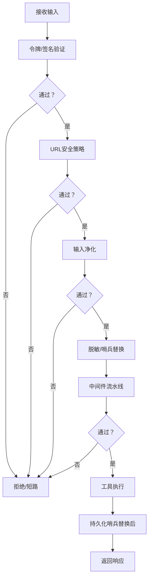

**图表来源**
- [GatewaySecurity.cs:1-44](file://src/OpenClaw.Gateway/GatewaySecurity.cs#L1-L44)
- [UrlSafetyValidator.cs:1-219](file://src/OpenClaw.Core/Security/UrlSafetyValidator.cs#L1-L219)
- [InputSanitizer.cs:1-84](file://src/OpenClaw.Core/Security/InputSanitizer.cs#L1-L84)
- [RedactionPipeline.cs:1-131](file://src/OpenClaw.Core/Security/RedactionPipeline.cs#L1-L131)
- [SentinelSubstitution.cs:1-38](file://src/OpenClaw.Core/Security/SentinelSubstitution.cs#L1-L38)
- [IMessageMiddleware.cs:1-68](file://src/OpenClaw.Core/Middleware/IMessageMiddleware.cs#L1-L68)

### 清理规则配置清单
- 脱敏器链
  - 基础密钥脱敏器：识别Authorization Bearer、OpenAI密钥、API Key字段。
  - 支付脱敏器：识别卡号、CVV、授权头、JSON字段、支付令牌，保留末尾4位。
- 哨兵替换
  - 执行态参数：用于实际运行，不写入日志/存储。
  - 持久化参数：用于审计与恢复，已脱敏。
- 白名单策略
  - 严格语义：空列表拒绝所有；通配符支持“*”。
  - 传统语义：空列表允许所有。
- URL安全策略
  - 启用/禁用、阻断私网目标、CIDR阻断、主机黑名单、DNS解析开关。
- 网关安全预设
  - 公共绑定时强制更严格的安全配置，禁止不安全工具与原始密钥引用。

**章节来源**
- [RedactionPipeline.cs:1-131](file://src/OpenClaw.Core/Security/RedactionPipeline.cs#L1-L131)
- [PaymentSensitiveDataRedactor.cs:1-63](file://src/OpenClaw.Payments.Core/PaymentSensitiveDataRedactor.cs#L1-L63)
- [SentinelSubstitution.cs:1-38](file://src/OpenClaw.Core/Security/SentinelSubstitution.cs#L1-L38)
- [AllowlistPolicy.cs:1-43](file://src/OpenClaw.Core/Security/AllowlistPolicy.cs#L1-L43)
- [GlobMatcher.cs:1-89](file://src/OpenClaw.Core/Security/GlobMatcher.cs#L1-L89)
- [UrlSafetyValidator.cs:1-219](file://src/OpenClaw.Core/Security/UrlSafetyValidator.cs#L1-L219)
- [GatewayConfig.cs:331-378](file://src/OpenClaw.Core/Models/GatewayConfig.cs#L331-L378)
- [SecurityPostureBuilder.cs:126-147](file://src/OpenClaw.Gateway/SecurityPostureBuilder.cs#L126-L147)

### 安全检查清单
- 输入净化
  - Shell元字符检测、CRLF剥离、键名与文件夹名校验。
- 敏感信息
  - 脱敏器链完整、会话级脱敏、哨兵替换正确应用。
- 访问控制
  - URL安全策略启用、私网阻断、CIDR阻断、主机黑名单。
  - 通道签名验证开启、白名单策略生效。
- 运行时安全
  - 公共绑定安全预设启用、不安全工具禁用、原始密钥引用受限。
- 中间件
  - 短路与变换逻辑正确、无多余分配、限流/预算中间件按需启用。

**章节来源**
- [InputSanitizer.cs:1-84](file://src/OpenClaw.Core/Security/InputSanitizer.cs#L1-L84)
- [RedactionPipeline.cs:1-131](file://src/OpenClaw.Core/Security/RedactionPipeline.cs#L1-L131)
- [UrlSafetyValidator.cs:1-219](file://src/OpenClaw.Core/Security/UrlSafetyValidator.cs#L1-L219)
- [SlackWebhookHandler.cs:1-41](file://src/OpenClaw.Gateway/SlackWebhookHandler.cs#L1-L41)
- [SecurityPostureBuilder.cs:126-147](file://src/OpenClaw.Gateway/SecurityPostureBuilder.cs#L126-L147)
- [IMessageMiddleware.cs:1-68](file://src/OpenClaw.Core/Middleware/IMessageMiddleware.cs#L1-L68)