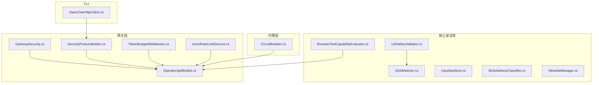
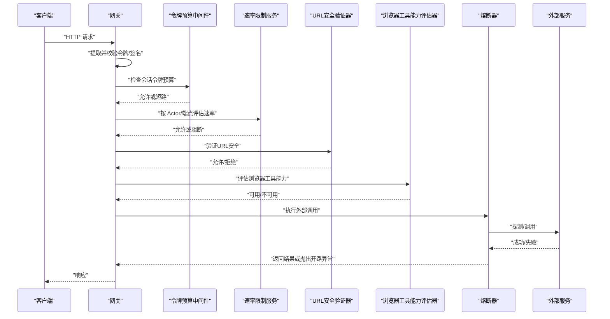
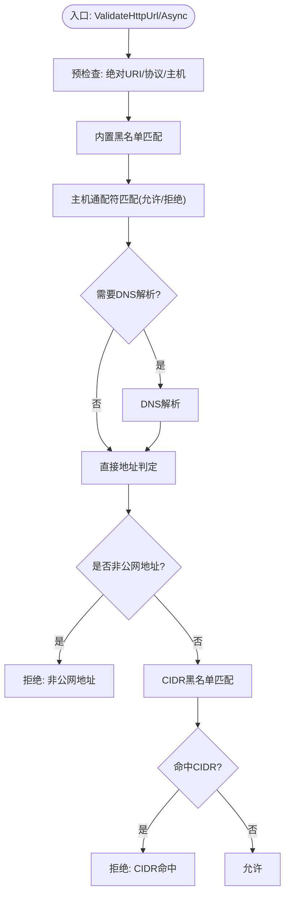
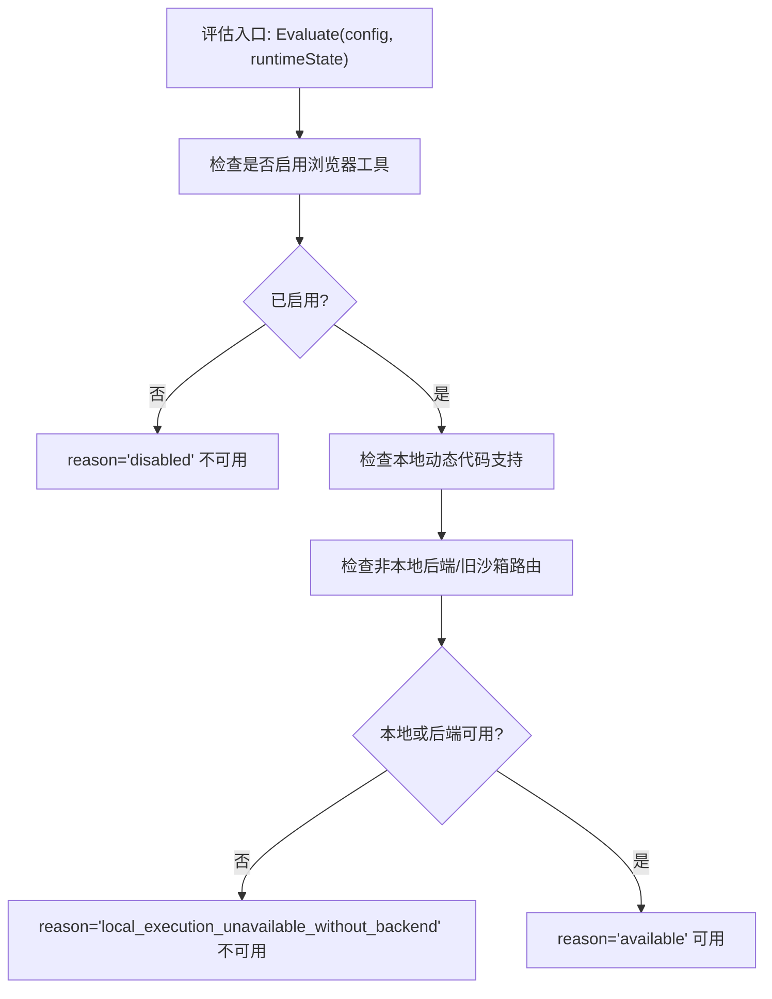
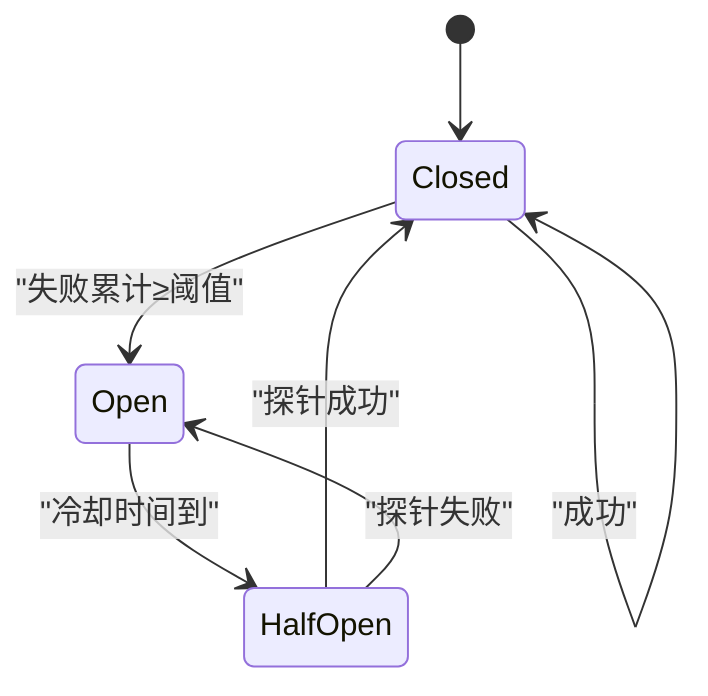
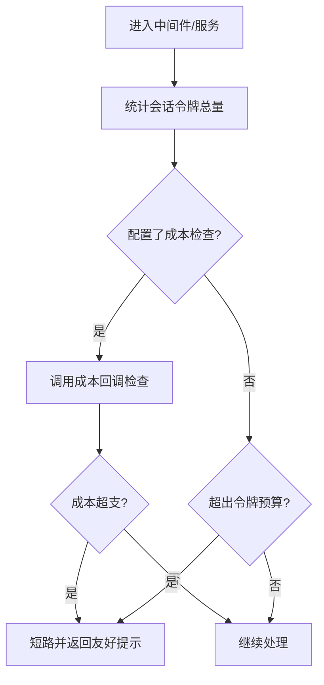
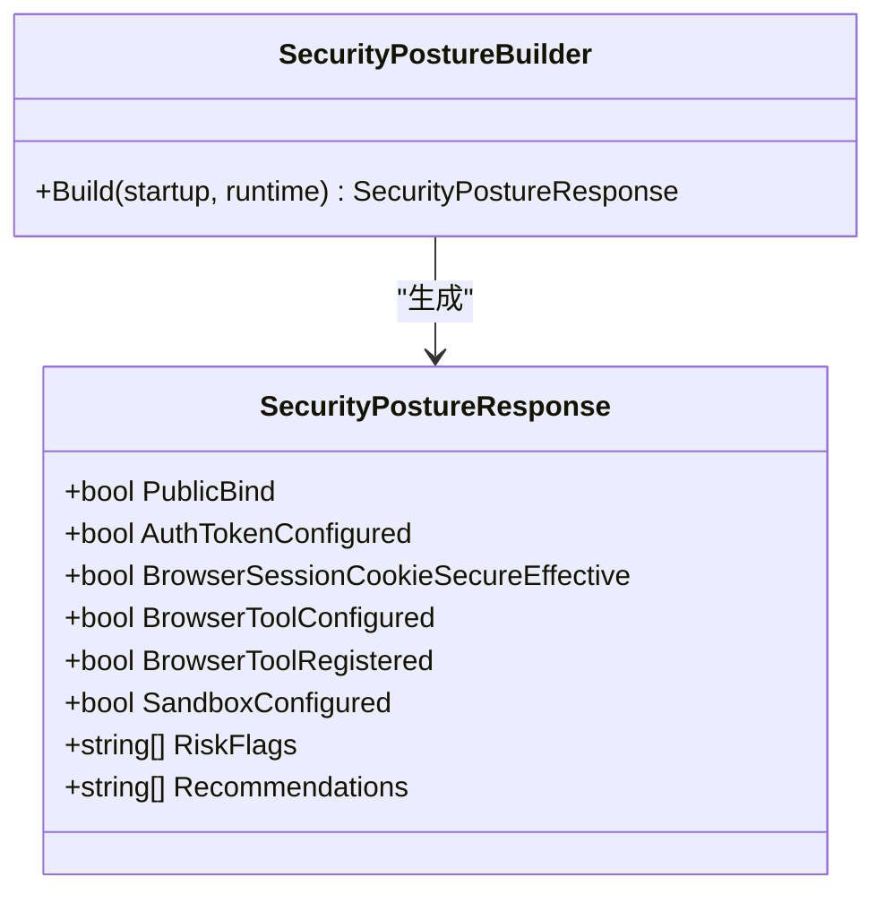
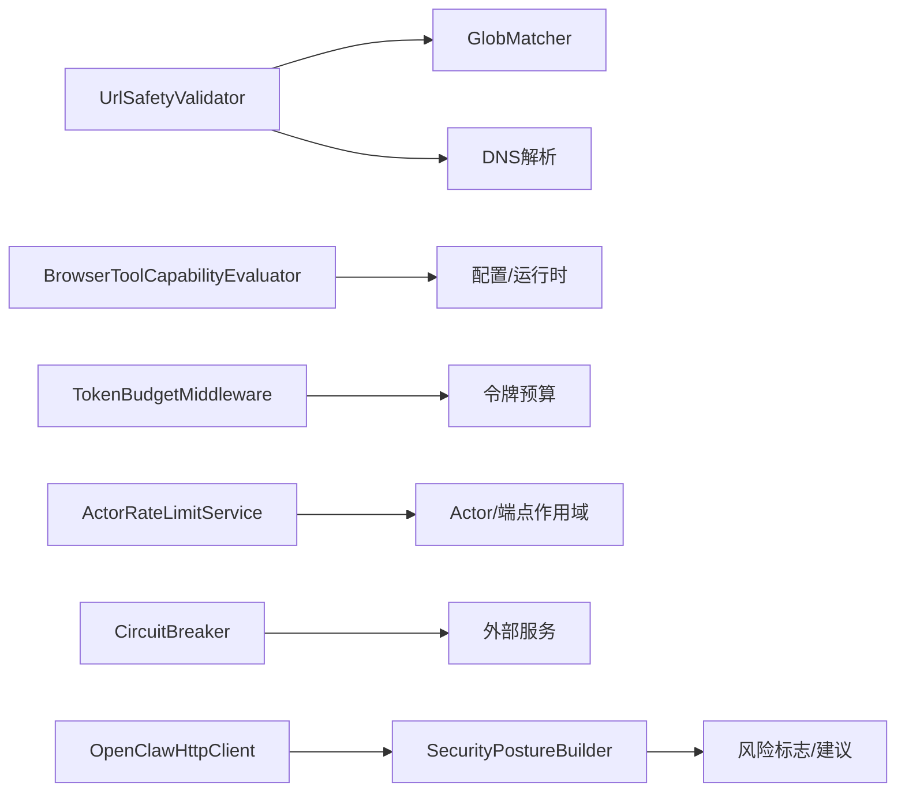

# 威胁防护

<cite>
**本文引用的文件**
- [UrlSafetyValidator.cs](file://src/OpenClaw.Core/Security/UrlSafetyValidator.cs)
- [GlobMatcher.cs](file://src/OpenClaw.Core/Security/GlobMatcher.cs)
- [BrowserToolCapabilityEvaluator.cs](file://src/OpenClaw.Core/Security/BrowserToolCapabilityEvaluator.cs)
- [CircuitBreaker.cs](file://src/OpenClaw.Agent/CircuitBreaker.cs)
- [AllowlistManager.cs](file://src/OpenClaw.Core/Security/AllowlistManager.cs)
- [InputSanitizer.cs](file://src/OpenClaw.Core/Security/InputSanitizer.cs)
- [BindAddressClassifier.cs](file://src/OpenClaw.Core/Security/BindAddressClassifier.cs)
- [GatewaySecurity.cs](file://src/OpenClaw.Gateway/GatewaySecurity.cs)
- [SecurityPostureBuilder.cs](file://src/OpenClaw.Gateway/SecurityPostureBuilder.cs)
- [TokenBudgetMiddleware.cs](file://src/OpenClaw.Core/Middleware/TokenBudgetMiddleware.cs)
- [ActorRateLimitService.cs](file://src/OpenClaw.Gateway/ActorRateLimitService.cs)
- [UrlSafetyValidatorTests.cs](file://src/OpenClaw.Tests/UrlSafetyValidatorTests.cs)
- [GlobMatcherTests.cs](file://src/OpenClaw.Tests/GlobMatcherTests.cs)
- [HarnessRegressionScenarios.cs](file://src/OpenClaw.Testing/HarnessRegressionScenarios.cs)
- [OperatorApiModels.cs](file://src/OpenClaw.Core/Models/OperatorApiModels.cs)
- [OpenClawHttpClient.cs](file://src/OpenClaw.Cli/OpenClawHttpClient.cs)
</cite>

## 目录
1. [简介](#简介)
2. [项目结构](#项目结构)
3. [核心组件](#核心组件)
4. [架构总览](#架构总览)
5. [详细组件分析](#详细组件分析)
6. [依赖关系分析](#依赖关系分析)
7. [性能考量](#性能考量)
8. [故障排查指南](#故障排查指南)
9. [结论](#结论)
10. [附录](#附录)

## 简介
本文件面向 OpenClaw.NET 的威胁防护体系，系统化阐述以下关键能力与机制：URL 安全验证（含通配符匹配）、浏览器工具能力评估、熔断器模式、威胁检测与识别、恶意请求拦截、URL 安全扫描、流量控制与成本预算、安全策略配置与异常检测、威胁响应流程与最佳实践。目标是帮助开发者与运维人员在不深入源码的前提下，理解并正确配置与使用威胁防护功能。

## 项目结构
威胁防护相关代码主要分布在以下模块：
- 核心安全库（OpenClaw.Core.Security）：URL 安全验证、通配符匹配、浏览器工具能力评估、输入净化、绑定地址分类等。
- 网关层（OpenClaw.Gateway）：安全态势构建、令牌与速率限制中间件、网关安全工具、安全策略输出模型。
- 代理层（OpenClaw.Agent）：熔断器模式，用于外部服务调用的稳定性保护。
- 测试与回归（OpenClaw.Tests / OpenClaw.Testing）：覆盖 URL 安全、通配符匹配、默认策略等场景。

**图表来源**
- [UrlSafetyValidator.cs:1-219](file://src/OpenClaw.Core/Security/UrlSafetyValidator.cs#L1-L219)
- [GlobMatcher.cs:1-89](file://src/OpenClaw.Core/Security/GlobMatcher.cs#L1-L89)
- [BrowserToolCapabilityEvaluator.cs:1-61](file://src/OpenClaw.Core/Security/BrowserToolCapabilityEvaluator.cs#L1-L61)
- [InputSanitizer.cs:1-84](file://src/OpenClaw.Core/Security/InputSanitizer.cs#L1-L84)
- [BindAddressClassifier.cs:1-19](file://src/OpenClaw.Core/Security/BindAddressClassifier.cs#L1-L19)
- [GatewaySecurity.cs:1-109](file://src/OpenClaw.Gateway/GatewaySecurity.cs#L1-L109)
- [SecurityPostureBuilder.cs:1-169](file://src/OpenClaw.Gateway/SecurityPostureBuilder.cs#L1-L169)
- [TokenBudgetMiddleware.cs:1-30](file://src/OpenClaw.Core/Middleware/TokenBudgetMiddleware.cs#L1-L30)
- [ActorRateLimitService.cs:69-103](file://src/OpenClaw.Gateway/ActorRateLimitService.cs#L69-L103)
- [OperatorApiModels.cs:700-763](file://src/OpenClaw.Core/Models/OperatorApiModels.cs#L700-L763)
- [OpenClawHttpClient.cs:30-55](file://src/OpenClaw.Cli/OpenClawHttpClient.cs#L30-L55)

**章节来源**
- [UrlSafetyValidator.cs:1-219](file://src/OpenClaw.Core/Security/UrlSafetyValidator.cs#L1-L219)
- [GlobMatcher.cs:1-89](file://src/OpenClaw.Core/Security/GlobMatcher.cs#L1-L89)
- [BrowserToolCapabilityEvaluator.cs:1-61](file://src/OpenClaw.Core/Security/BrowserToolCapabilityEvaluator.cs#L1-L61)
- [CircuitBreaker.cs:1-227](file://src/OpenClaw.Agent/CircuitBreaker.cs#L1-L227)
- [AllowlistManager.cs:1-126](file://src/OpenClaw.Core/Security/AllowlistManager.cs#L1-L126)
- [InputSanitizer.cs:1-84](file://src/OpenClaw.Core/Security/InputSanitizer.cs#L1-L84)
- [BindAddressClassifier.cs:1-19](file://src/OpenClaw.Core/Security/BindAddressClassifier.cs#L1-L19)
- [GatewaySecurity.cs:1-109](file://src/OpenClaw.Gateway/GatewaySecurity.cs#L1-L109)
- [SecurityPostureBuilder.cs:1-169](file://src/OpenClaw.Gateway/SecurityPostureBuilder.cs#L1-L169)
- [TokenBudgetMiddleware.cs:1-30](file://src/OpenClaw.Core/Middleware/TokenBudgetMiddleware.cs#L1-L30)
- [ActorRateLimitService.cs:69-103](file://src/OpenClaw.Gateway/ActorRateLimitService.cs#L69-L103)
- [OperatorApiModels.cs:700-763](file://src/OpenClaw.Core/Models/OperatorApiModels.cs#L700-L763)
- [OpenClawHttpClient.cs:30-55](file://src/OpenClaw.Cli/OpenClawHttpClient.cs#L30-L55)

## 核心组件
- URL 安全验证器：对绝对 http(s) URL 进行预检查、内置黑名单、主机通配符匹配、DNS 解析与私有地址判定、CIDR 黑名单匹配。
- 通配符匹配器：支持 “*” 的简单通配符匹配与允许/拒绝优先级判定。
- 浏览器工具能力评估器：根据配置与运行时状态评估浏览器工具可用性与后端执行能力。
- 输入净化器：针对 Shell 元字符、CRLF 注入、路径遍历、IMAP 文件夹名等进行校验与清理。
- 绑定地址分类器：判断是否为回环绑定，避免误判“所有接口”为回环。
- 熔断器：LLM 或外部服务调用的轻量熔断，支持闭合/打开/半开状态与指数退避。
- 允许列表管理器：动态持久化通道允许列表，支持并发写入与原子替换。
- 网关安全工具：令牌提取与校验、HMAC 校验、签名计算。
- 安全态势构建器：基于部署配置与运行时状态生成安全态势报告，包含风险标志与建议。
- 令牌预算中间件：按会话令牌总量与可选美元成本预算进行短路拦截。
- 行为速率限制服务：按 Actor 类型/键/端点作用域进行突发与持续速率限制。
- CLI 客户端：提供获取安全态势等 API 的客户端封装。

**章节来源**
- [UrlSafetyValidator.cs:17-135](file://src/OpenClaw.Core/Security/UrlSafetyValidator.cs#L17-L135)
- [GlobMatcher.cs:9-86](file://src/OpenClaw.Core/Security/GlobMatcher.cs#L9-L86)
- [BrowserToolCapabilityEvaluator.cs:7-30](file://src/OpenClaw.Core/Security/BrowserToolCapabilityEvaluator.cs#L7-L30)
- [InputSanitizer.cs:24-82](file://src/OpenClaw.Core/Security/InputSanitizer.cs#L24-L82)
- [BindAddressClassifier.cs:7-17](file://src/OpenClaw.Core/Security/BindAddressClassifier.cs#L7-L17)
- [CircuitBreaker.cs:15-208](file://src/OpenClaw.Agent/CircuitBreaker.cs#L15-L208)
- [AllowlistManager.cs:19-84](file://src/OpenClaw.Core/Security/AllowlistManager.cs#L19-L84)
- [GatewaySecurity.cs:13-76](file://src/OpenClaw.Gateway/GatewaySecurity.cs#L13-L76)
- [SecurityPostureBuilder.cs:11-139](file://src/OpenClaw.Gateway/SecurityPostureBuilder.cs#L11-L139)
- [TokenBudgetMiddleware.cs:12-30](file://src/OpenClaw.Core/Middleware/TokenBudgetMiddleware.cs#L12-L30)
- [ActorRateLimitService.cs:92-103](file://src/OpenClaw.Gateway/ActorRateLimitService.cs#L92-L103)
- [OpenClawHttpClient.cs:53-54](file://src/OpenClaw.Cli/OpenClawHttpClient.cs#L53-L54)

## 架构总览
威胁防护贯穿“请求进入—策略评估—执行—监控反馈”的闭环：
- 请求进入网关后，先进行安全令牌与签名校验；随后通过令牌预算与速率限制中间件；再由 URL 安全验证器与浏览器工具能力评估器决定是否放行。
- 对外部服务调用采用熔断器保护，避免雪崩效应。
- 安全态势构建器汇总配置与运行时状态，输出风险标志与建议，供 CLI/仪表盘使用。
- 异常与风险通过证据记录与可观测性上报，形成闭环治理。

**图表来源**
- [GatewaySecurity.cs:13-76](file://src/OpenClaw.Gateway/GatewaySecurity.cs#L13-L76)
- [TokenBudgetMiddleware.cs:12-30](file://src/OpenClaw.Core/Middleware/TokenBudgetMiddleware.cs#L12-L30)
- [ActorRateLimitService.cs:92-103](file://src/OpenClaw.Gateway/ActorRateLimitService.cs#L92-L103)
- [UrlSafetyValidator.cs:27-58](file://src/OpenClaw.Core/Security/UrlSafetyValidator.cs#L27-L58)
- [BrowserToolCapabilityEvaluator.cs:7-30](file://src/OpenClaw.Core/Security/BrowserToolCapabilityEvaluator.cs#L7-L30)
- [CircuitBreaker.cs:91-147](file://src/OpenClaw.Agent/CircuitBreaker.cs#L91-L147)

## 详细组件分析

### URL 安全验证与通配符匹配
- 预检查：仅允许绝对 http(s) URL，空主机拒绝。
- 内置黑名单：localhost、*.localhost、metadata、metadata.google.internal。
- 主机通配符匹配：支持 “*” 匹配任意子串，大小写敏感；拒绝优先于允许。
- DNS 解析与地址判定：解析失败/无地址即拒绝；对 IPv4/IPv6 私有/链路本地/组播/多播等非公网地址进行阻断。
- CIDR 黑名单：支持 IPv4/IPv6 CIDR 段匹配，映射到 IPv4 后统一比较。
- 异步与同步两套接口：异步版本支持 DNS 异步解析，同步版本可禁用 DNS。

**图表来源**
- [UrlSafetyValidator.cs:60-135](file://src/OpenClaw.Core/Security/UrlSafetyValidator.cs#L60-L135)
- [GlobMatcher.cs:9-86](file://src/OpenClaw.Core/Security/GlobMatcher.cs#L9-L86)

**章节来源**
- [UrlSafetyValidator.cs:27-135](file://src/OpenClaw.Core/Security/UrlSafetyValidator.cs#L27-L135)
- [GlobMatcher.cs:9-86](file://src/OpenClaw.Core/Security/GlobMatcher.cs#L9-L86)
- [UrlSafetyValidatorTests.cs:12-55](file://src/OpenClaw.Tests/UrlSafetyValidatorTests.cs#L12-L55)
- [HarnessRegressionScenarios.cs:246-284](file://src/OpenClaw.Testing/HarnessRegressionScenarios.cs#L246-L284)

### 浏览器工具能力评估
- 能力评估维度：已启用、本地执行支持、后端执行可用、最终注册可用。
- 判定逻辑：若未启用则不可用；若启用但既无本地执行也无后端，则不可用；否则可用。
- 后端可用性：支持非本地后端或旧沙箱路由；opensandbox 需要已配置提供者。

**图表来源**
- [BrowserToolCapabilityEvaluator.cs:7-30](file://src/OpenClaw.Core/Security/BrowserToolCapabilityEvaluator.cs#L7-L30)

**章节来源**
- [BrowserToolCapabilityEvaluator.cs:7-61](file://src/OpenClaw.Core/Security/BrowserToolCapabilityEvaluator.cs#L7-L61)

### 熔断器模式
- 状态机：Closed（正常）、Open（短路）、HalfOpen（探针）。
- 触发条件：连续失败达到阈值或半开探针失败。
- 退避策略：指数退避，上限保护。
- 使用方式：同步短路检查与异步执行包装；适合 LLM/外部服务调用。

**图表来源**
- [CircuitBreaker.cs:15-208](file://src/OpenClaw.Agent/CircuitBreaker.cs#L15-L208)

**章节来源**
- [CircuitBreaker.cs:15-227](file://src/OpenClaw.Agent/CircuitBreaker.cs#L15-L227)

### 流量控制与成本预算
- 令牌预算中间件：按会话输入+输出令牌总量限制，超过则短路。
- 成本预算回调：可选 USD 成本检查，超支同样短路。
- 速率限制服务：按 Actor 类型/键/端点作用域进行突发与持续窗口计数，支持通配符端点。

**图表来源**
- [TokenBudgetMiddleware.cs:12-30](file://src/OpenClaw.Core/Middleware/TokenBudgetMiddleware.cs#L12-L30)
- [ActorRateLimitService.cs:92-103](file://src/OpenClaw.Gateway/ActorRateLimitService.cs#L92-L103)

**章节来源**
- [TokenBudgetMiddleware.cs:12-30](file://src/OpenClaw.Core/Middleware/TokenBudgetMiddleware.cs#L12-L30)
- [ActorRateLimitService.cs:92-103](file://src/OpenClaw.Gateway/ActorRateLimitService.cs#L92-L103)

### 安全策略与异常检测
- 安全态势构建：综合公共绑定、认证令牌、浏览器会话 Cookie 安全性、浏览器工具可用性、插件桥接风险、签名验证就绪度、沙箱配置、审批策略等，输出风险标志与建议。
- 异常检测：通过证据记录与可观测性指标，结合回归测试与默认策略，确保默认安全基线生效。

**图表来源**
- [OperatorApiModels.cs:700-736](file://src/OpenClaw.Core/Models/OperatorApiModels.cs#L700-L736)
- [SecurityPostureBuilder.cs:11-139](file://src/OpenClaw.Gateway/SecurityPostureBuilder.cs#L11-L139)

**章节来源**
- [SecurityPostureBuilder.cs:11-169](file://src/OpenClaw.Gateway/SecurityPostureBuilder.cs#L11-L169)
- [OperatorApiModels.cs:700-763](file://src/OpenClaw.Core/Models/OperatorApiModels.cs#L700-L763)

### 输入净化与绑定地址分类
- 输入净化：检测 Shell 元字符、剥离 CRLF、校验内存键与 IMAP 文件夹名。
- 绑定地址分类：区分 ASP.NET Core 的“通配符绑定”与真正的回环绑定，避免误判。

**章节来源**
- [InputSanitizer.cs:24-82](file://src/OpenClaw.Core/Security/InputSanitizer.cs#L24-L82)
- [BindAddressClassifier.cs:7-17](file://src/OpenClaw.Core/Security/BindAddressClassifier.cs#L7-L17)

### 允许列表管理与网关安全工具
- 动态允许列表：按通道持久化允许来源/去向，支持并发写入与原子替换。
- 网关安全工具：Bearer 令牌提取、查询参数令牌、固定时间比较、HMAC-SHA256 签名验证。

**章节来源**
- [AllowlistManager.cs:19-126](file://src/OpenClaw.Core/Security/AllowlistManager.cs#L19-L126)
- [GatewaySecurity.cs:13-76](file://src/OpenClaw.Gateway/GatewaySecurity.cs#L13-L76)

## 依赖关系分析
- URL 安全验证依赖通配符匹配与 DNS 解析；浏览器工具能力评估依赖配置与运行时状态；令牌预算与速率限制共同构成流量控制；熔断器独立保护外部依赖；安全态势构建器聚合多源信息。
- CLI 客户端通过网关 API 获取安全态势，形成从观测到治理的闭环。

**图表来源**
- [UrlSafetyValidator.cs:27-135](file://src/OpenClaw.Core/Security/UrlSafetyValidator.cs#L27-L135)
- [GlobMatcher.cs:9-86](file://src/OpenClaw.Core/Security/GlobMatcher.cs#L9-L86)
- [BrowserToolCapabilityEvaluator.cs:7-30](file://src/OpenClaw.Core/Security/BrowserToolCapabilityEvaluator.cs#L7-L30)
- [TokenBudgetMiddleware.cs:12-30](file://src/OpenClaw.Core/Middleware/TokenBudgetMiddleware.cs#L12-L30)
- [ActorRateLimitService.cs:92-103](file://src/OpenClaw.Gateway/ActorRateLimitService.cs#L92-L103)
- [CircuitBreaker.cs:91-147](file://src/OpenClaw.Agent/CircuitBreaker.cs#L91-L147)
- [SecurityPostureBuilder.cs:11-139](file://src/OpenClaw.Gateway/SecurityPostureBuilder.cs#L11-L139)
- [OpenClawHttpClient.cs:53-54](file://src/OpenClaw.Cli/OpenClawHttpClient.cs#L53-L54)

**章节来源**
- [UrlSafetyValidator.cs:27-135](file://src/OpenClaw.Core/Security/UrlSafetyValidator.cs#L27-L135)
- [BrowserToolCapabilityEvaluator.cs:7-30](file://src/OpenClaw.Core/Security/BrowserToolCapabilityEvaluator.cs#L7-L30)
- [TokenBudgetMiddleware.cs:12-30](file://src/OpenClaw.Core/Middleware/TokenBudgetMiddleware.cs#L12-L30)
- [ActorRateLimitService.cs:92-103](file://src/OpenClaw.Gateway/ActorRateLimitService.cs#L92-L103)
- [CircuitBreaker.cs:91-147](file://src/OpenClaw.Agent/CircuitBreaker.cs#L91-L147)
- [SecurityPostureBuilder.cs:11-139](file://src/OpenClaw.Gateway/SecurityPostureBuilder.cs#L11-L139)
- [OpenClawHttpClient.cs:53-54](file://src/OpenClaw.Cli/OpenClawHttpClient.cs#L53-L54)

## 性能考量
- URL 安全验证：DNS 解析为潜在瓶颈，建议在高并发场景下缓存解析结果或启用异步解析；CIDR 匹配为 O(N) 地址×O(M) CIDR，建议合理控制 CIDR 数量。
- 通配符匹配：Span-based 实现避免分配，适合高频匹配；注意模式数量与长度。
- 熔断器：指数退避上限保护，避免雪崩；阈值与冷却时间需结合外部服务 SLA 调优。
- 令牌预算与速率限制：中间件与服务均采用轻量计数，建议结合持久化存储与分布式锁以保证跨实例一致性。

## 故障排查指南
- URL 安全被拒：检查是否命中内置黑名单、主机通配符、私有地址或 CIDR；确认 DNS 是否可达。
- 浏览器工具不可用：确认已启用且具备本地执行支持或非本地后端；检查沙箱配置。
- 令牌预算超限：调整会话令牌上限或成本回调；优化消息长度与上下文。
- 速率限制触发：检查 Actor/端点作用域配置；适当增大突发窗口或持续窗口。
- 熔断器打开：查看外部服务健康状况；调整阈值与冷却时间；关注探针失败次数。
- 安全态势告警：根据风险标志逐项整改，如缺少认证令牌、浏览器 Cookie 安全性不足、未配置沙箱等。

**章节来源**
- [UrlSafetyValidatorTests.cs:12-77](file://src/OpenClaw.Tests/UrlSafetyValidatorTests.cs#L12-L77)
- [GlobMatcherTests.cs:19-32](file://src/OpenClaw.Tests/GlobMatcherTests.cs#L19-L32)
- [HarnessRegressionScenarios.cs:246-284](file://src/OpenClaw.Testing/HarnessRegressionScenarios.cs#L246-L284)
- [SecurityPostureBuilder.cs:27-109](file://src/OpenClaw.Gateway/SecurityPostureBuilder.cs#L27-L109)

## 结论
OpenClaw.NET 的威胁防护体系通过“URL 安全验证 + 通配符匹配 + 浏览器工具能力评估 + 输入净化 + 流量控制 + 熔断器 + 安全态势构建”的组合拳，实现了从入口到执行再到观测的全链路安全。默认策略严格，默认行为安全，同时提供灵活的配置与动态策略（如允许列表）。建议在生产环境强制启用认证令牌、签名验证、沙箱隔离与审批策略，并结合安全态势与回归测试持续加固。

## 附录
- 威胁响应流程（建议）
  - 发现异常：通过安全态势与证据记录定位风险来源。
  - 快速处置：临时收紧 URL 安全策略、提高熔断阈值、暂停高风险工具、增加速率限制。
  - 根因分析：结合日志、签名验证、令牌预算与速率限制数据，复盘攻击路径。
  - 改进闭环：更新策略、补充回归测试、发布安全公告与最佳实践。

- 最佳实践
  - 默认启用 BlockPrivateNetworkTargets 与内置黑名单。
  - 为浏览器工具配置非本地执行后端或沙箱。
  - 在公共绑定场景下启用认证令牌与签名验证。
  - 为高风险工具（shell/code_exec/git/external_cli/payment）配置审批策略。
  - 合理设置令牌预算与 USD 成本预算，防止滥用。
  - 使用熔断器保护外部服务，避免级联故障。
  - 定期审查安全态势报告，落实风险整改与加固。