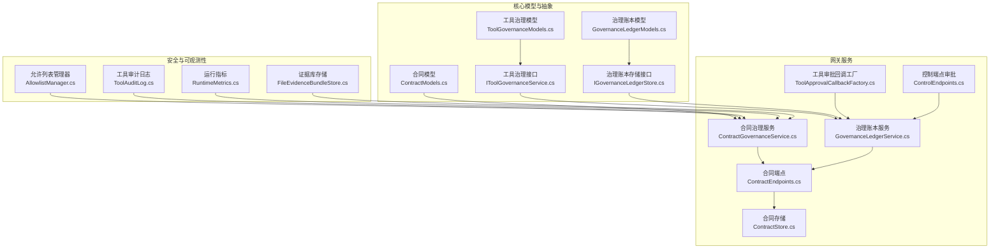
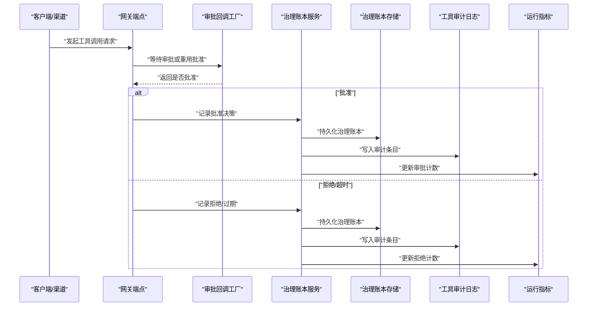
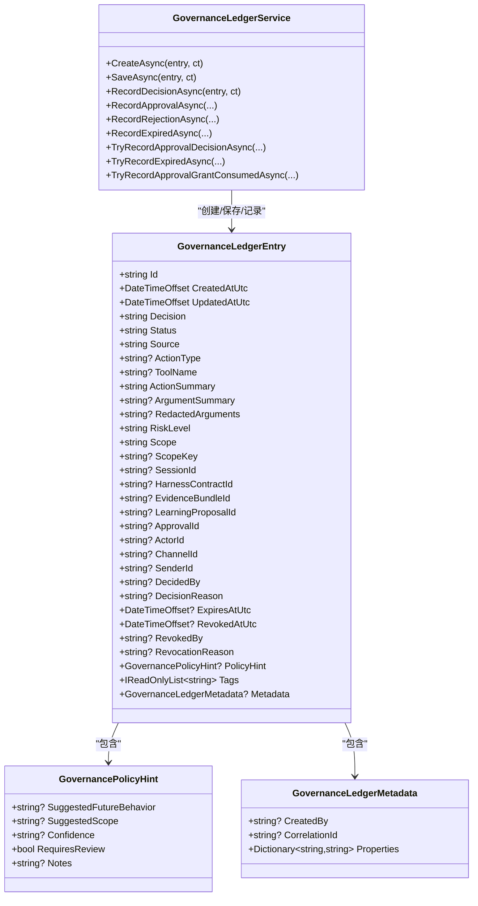
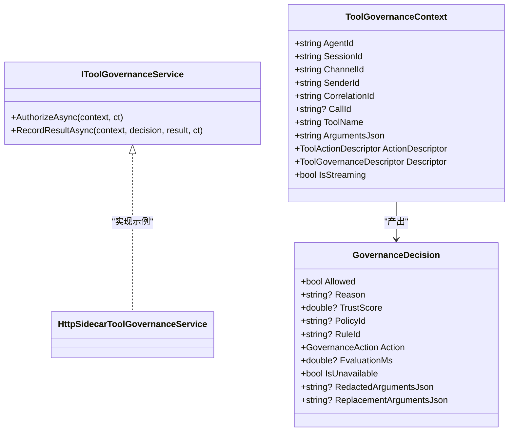
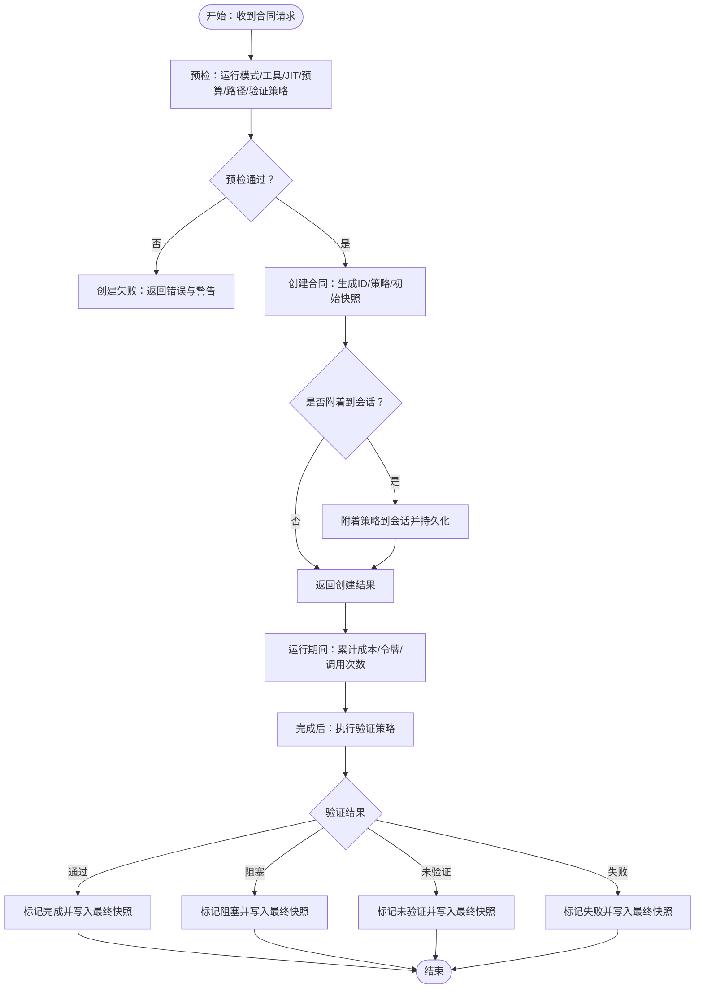
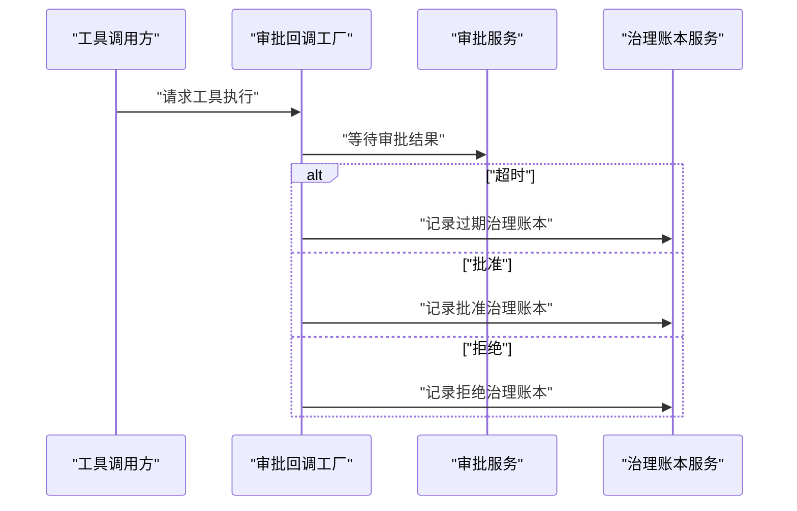
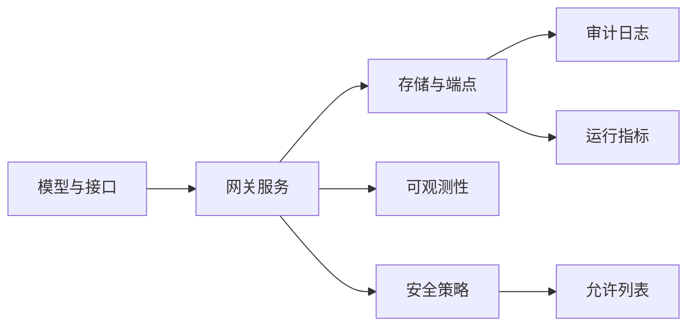

# 安全合规

<cite>
**本文引用的文件**
- [GovernanceLedgerModels.cs](file://src/OpenClaw.Core/Models/GovernanceLedgerModels.cs)
- [ToolGovernanceModels.cs](file://src/OpenClaw.Core/Models/ToolGovernanceModels.cs)
- [ContractModels.cs](file://src/OpenClaw.Core/Models/ContractModels.cs)
- [IToolGovernanceService.cs](file://src/OpenClaw.Core/Abstractions/IToolGovernanceService.cs)
- [IGovernanceLedgerStore.cs](file://src/OpenClaw.Core/Abstractions/IGovernanceLedgerStore.cs)
- [AllowlistManager.cs](file://src/OpenClaw.Core/Security/AllowlistManager.cs)
- [ToolAuditLog.cs](file://src/OpenClaw.Core/Observability/ToolAuditLog.cs)
- [RuntimeMetrics.cs](file://src/OpenClaw.Core/Observability/RuntimeMetrics.cs)
- [ContractGovernanceService.cs](file://src/OpenClaw.Gateway/ContractGovernanceService.cs)
- [GovernanceLedgerService.cs](file://src/OpenClaw.Gateway/GovernanceLedgerService.cs)
- [ContractEndpoints.cs](file://src/OpenClaw.Gateway/Endpoints/ContractEndpoints.cs)
- [ContractStore.cs](file://src/OpenClaw.Gateway/ContractStore.cs)
- [ToolApprovalCallbackFactory.cs](file://src/OpenClaw.Gateway/ToolApprovalCallbackFactory.cs)
- [ControlEndpoints.cs](file://src/OpenClaw.Gateway/Endpoints/ControlEndpoints.cs)
- [FileEvidenceBundleStore.cs](file://src/OpenClaw.Core/Features/FileEvidenceBundleStore.cs)
- [HarnessRegressionScenarios.cs](file://src/OpenClaw.Testing/HarnessRegressionScenarios.cs)
- [GovernanceLedgerTests.cs](file://src/OpenClaw.Tests/GovernanceLedgerTests.cs)
- [ContractGovernanceTests.cs](file://src/OpenClaw.Tests/ContractGovernanceTests.cs)
- [AllowlistPolicyTests.cs](file://src/OpenClaw.Tests/AllowlistPolicyTests.cs)
</cite>

## 目录
1. [引言](#引言)
2. [项目结构](#项目结构)
3. [核心组件](#核心组件)
4. [架构总览](#架构总览)
5. [详细组件分析](#详细组件分析)
6. [依赖关系分析](#依赖关系分析)
7. [性能考量](#性能考量)
8. [故障排查指南](#故障排查指南)
9. [结论](#结论)
10. [附录](#附录)

## 引言
本文件面向 OpenClaw.NET 的安全合规框架，系统化阐述运营治理模型、工具治理规范、合同治理服务与合规要求。重点覆盖以下方面：
- 运营治理模型：以“决策-记录-审计-报告”为主线，构建可追溯、可度量、可复核的治理闭环。
- 工具治理规范：定义工具访问控制、风险分级、审批流程与结果归档。
- 合同治理服务：预检、预算与生命周期管理、后置验证与状态快照。
- 合规检查机制：参数校验、路径限制、运行模式匹配、预算与时间约束。
- 审计跟踪与报告：工具执行审计日志、运行指标、治理账本与证据库。
- 合规配置与策略制定：基于模型的策略声明、动态白名单、超时与拒绝计数。
- 最佳实践与持续合规：最小权限、默认拒绝、红acted 数据处理、定期审计与回溯。

## 项目结构
OpenClaw.NET 将安全合规能力分布在“核心模型/抽象层”“网关服务层”“可观测性与审计层”等模块中，形成“策略建模—执行—记录—审计—报告”的分层架构。

**图表来源**
- [ToolGovernanceModels.cs:1-150](file://src/OpenClaw.Core/Models/ToolGovernanceModels.cs#L1-L150)
- [GovernanceLedgerModels.cs:1-146](file://src/OpenClaw.Core/Models/GovernanceLedgerModels.cs#L1-L146)
- [ContractModels.cs:1-131](file://src/OpenClaw.Core/Models/ContractModels.cs#L1-L131)
- [IToolGovernanceService.cs:1-17](file://src/OpenClaw.Core/Abstractions/IToolGovernanceService.cs#L1-L17)
- [IGovernanceLedgerStore.cs:1-12](file://src/OpenClaw.Core/Abstractions/IGovernanceLedgerStore.cs#L1-L12)
- [AllowlistManager.cs:1-126](file://src/OpenClaw.Core/Security/AllowlistManager.cs#L1-L126)
- [ToolAuditLog.cs:1-125](file://src/OpenClaw.Core/Observability/ToolAuditLog.cs#L1-L125)
- [RuntimeMetrics.cs:1-312](file://src/OpenClaw.Core/Observability/RuntimeMetrics.cs#L1-L312)
- [ContractGovernanceService.cs:1-826](file://src/OpenClaw.Gateway/ContractGovernanceService.cs#L1-L826)
- [GovernanceLedgerService.cs:1-554](file://src/OpenClaw.Gateway/GovernanceLedgerService.cs#L1-L554)
- [ContractEndpoints.cs:1-280](file://src/OpenClaw.Gateway/Endpoints/ContractEndpoints.cs#L1-L280)
- [ContractStore.cs:1-44](file://src/OpenClaw.Gateway/ContractStore.cs#L1-L44)
- [ToolApprovalCallbackFactory.cs:1-153](file://src/OpenClaw.Gateway/ToolApprovalCallbackFactory.cs#L1-L153)
- [ControlEndpoints.cs:277-302](file://src/OpenClaw.Gateway/Endpoints/ControlEndpoints.cs#L277-L302)
- [FileEvidenceBundleStore.cs:1-220](file://src/OpenClaw.Core/Features/FileEvidenceBundleStore.cs#L1-L220)

**章节来源**
- [ContractGovernanceService.cs:1-826](file://src/OpenClaw.Gateway/ContractGovernanceService.cs#L1-L826)
- [GovernanceLedgerService.cs:1-554](file://src/OpenClaw.Gateway/GovernanceLedgerService.cs#L1-L554)
- [ContractEndpoints.cs:1-280](file://src/OpenClaw.Gateway/Endpoints/ContractEndpoints.cs#L1-L280)
- [ToolAuditLog.cs:1-125](file://src/OpenClaw.Core/Observability/ToolAuditLog.cs#L1-L125)
- [RuntimeMetrics.cs:1-312](file://src/OpenClaw.Core/Observability/RuntimeMetrics.cs#L1-L312)

## 核心组件
- 治理账本模型与服务：统一的治理决策、状态、来源、风险级别、范围、策略提示与元数据；通过服务进行规范化、脱敏与持久化，并同步运行事件。
- 工具治理模型与接口：定义治理动作（允许/拒绝/需审批/脱敏/仅审计）、上下文、描述符、决策与执行结果；服务接口负责授权与结果记录。
- 合同治理服务与端点：合同预检、预算计算、生命周期管理、后置验证与状态快照；提供 REST 端点供操作员使用。
- 允许列表管理器：按通道维护动态白名单，支持增删改查与原子落盘。
- 审计与指标：工具执行审计日志（JSON Lines），运行指标（计数器/仪表），证据库存储（合规证据）。
- 审批与超时：工具审批回调工厂与控制端点，支持超时自动拒绝与账本记录。

**章节来源**
- [GovernanceLedgerModels.cs:1-146](file://src/OpenClaw.Core/Models/GovernanceLedgerModels.cs#L1-L146)
- [GovernanceLedgerService.cs:1-554](file://src/OpenClaw.Gateway/GovernanceLedgerService.cs#L1-L554)
- [ToolGovernanceModels.cs:1-150](file://src/OpenClaw.Core/Models/ToolGovernanceModels.cs#L1-L150)
- [IToolGovernanceService.cs:1-17](file://src/OpenClaw.Core/Abstractions/IToolGovernanceService.cs#L1-L17)
- [ContractModels.cs:1-131](file://src/OpenClaw.Core/Models/ContractModels.cs#L1-L131)
- [ContractGovernanceService.cs:1-826](file://src/OpenClaw.Gateway/ContractGovernanceService.cs#L1-L826)
- [ContractEndpoints.cs:1-280](file://src/OpenClaw.Gateway/Endpoints/ContractEndpoints.cs#L1-L280)
- [AllowlistManager.cs:1-126](file://src/OpenClaw.Core/Security/AllowlistManager.cs#L1-L126)
- [ToolAuditLog.cs:1-125](file://src/OpenClaw.Core/Observability/ToolAuditLog.cs#L1-L125)
- [RuntimeMetrics.cs:1-312](file://src/OpenClaw.Core/Observability/RuntimeMetrics.cs#L1-L312)
- [ToolApprovalCallbackFactory.cs:1-153](file://src/OpenClaw.Gateway/ToolApprovalCallbackFactory.cs#L1-L153)
- [ControlEndpoints.cs:277-302](file://src/OpenClaw.Gateway/Endpoints/ControlEndpoints.cs#L277-L302)

## 架构总览
下图展示从“工具调用到治理决策、记录与审计”的关键交互链路。

**图表来源**
- [ToolApprovalCallbackFactory.cs:38-153](file://src/OpenClaw.Gateway/ToolApprovalCallbackFactory.cs#L38-L153)
- [GovernanceLedgerService.cs:48-176](file://src/OpenClaw.Gateway/GovernanceLedgerService.cs#L48-L176)
- [ToolAuditLog.cs:72-95](file://src/OpenClaw.Core/Observability/ToolAuditLog.cs#L72-L95)
- [RuntimeMetrics.cs:138-139](file://src/OpenClaw.Core/Observability/RuntimeMetrics.cs#L138-L139)

## 详细组件分析

### 组件一：治理账本（Governance Ledger）
- 职责：统一记录治理决策、状态、来源、风险级别、作用域、策略提示与元数据；对自由文本字段进行脱敏与截断；生成运行事件。
- 关键点：
  - 决策与状态标准化（Approved/Rejected/Expired/Revoked/Unknown；Active/Expired/Revoked/Superseded）。
  - 风险级别与作用域标准化（Once/Session/Actor/Channel/Project/Tool/Global/Unknown）。
  - 政策提示（建议行为、建议作用域、置信度、是否需复审、备注）。
  - 元数据清洗与属性去重。
  - 审计事件附加治理账本 ID、决策、状态、风险级别等元信息。
- 测试与回归：
  - 治理账本条目序列化/反序列化一致性测试。
  - 自由文本字段与作用域的脱敏与清理测试。

**图表来源**
- [GovernanceLedgerModels.cs:54-103](file://src/OpenClaw.Core/Models/GovernanceLedgerModels.cs#L54-L103)
- [GovernanceLedgerService.cs:31-228](file://src/OpenClaw.Gateway/GovernanceLedgerService.cs#L31-L228)

**章节来源**
- [GovernanceLedgerModels.cs:1-146](file://src/OpenClaw.Core/Models/GovernanceLedgerModels.cs#L1-L146)
- [GovernanceLedgerService.cs:1-554](file://src/OpenClaw.Gateway/GovernanceLedgerService.cs#L1-L554)
- [GovernanceLedgerTests.cs:118-258](file://src/OpenClaw.Tests/GovernanceLedgerTests.cs#L118-L258)

### 组件二：工具治理服务与模型
- 职责：在工具调用前进行授权判断，决定允许、拒绝、需审批、脱敏或仅审计；记录执行结果。
- 关键点：
  - 治理动作枚举与上下文（含会话、渠道、发送者、工具名、动作描述、风险等级）。
  - 决策包含原因、信任分、策略/规则标识、评估耗时、是否不可用、脱敏/替换后的参数。
  - 提供接口用于授权与结果记录。
- 实现要点：
  - 授权接口定义于抽象层，具体实现可对接外部治理侧车。
  - 服务层负责将授权结果映射为治理账本条目并记录。

**图表来源**
- [IToolGovernanceService.cs:1-17](file://src/OpenClaw.Core/Abstractions/IToolGovernanceService.cs#L1-L17)
- [ToolGovernanceModels.cs:44-150](file://src/OpenClaw.Core/Models/ToolGovernanceModels.cs#L44-L150)

**章节来源**
- [IToolGovernanceService.cs:1-17](file://src/OpenClaw.Core/Abstractions/IToolGovernanceService.cs#L1-L17)
- [ToolGovernanceModels.cs:1-150](file://src/OpenClaw.Core/Models/ToolGovernanceModels.cs#L1-L150)

### 组件三：合同治理服务与端点
- 职责：合同预检（运行模式、工具可用性、JIT 兼容、预算与路径限制）、创建与附着、成本与令牌统计、生命周期与验证、取消与快照。
- 关键点：
  - 预检阶段：运行模式匹配、工具注册与 JIT 限制、预算参数合法性、作用域能力有效性、验证策略校验。
  - 成本计算：基于最近回合估算或累计计数；令牌用量与工具调用次数统计。
  - 验证策略：文件存在/内容、HTTP 状态码/响应体包含、操作员确认等。
  - 端点：validate/create/list/get/cancel，均带操作审计与速率限制。
- 存储：合同执行快照以 JSON Lines 形式持久化，支持按会话查询。

**图表来源**
- [ContractGovernanceService.cs:53-139](file://src/OpenClaw.Gateway/ContractGovernanceService.cs#L53-L139)
- [ContractGovernanceService.cs:144-207](file://src/OpenClaw.Gateway/ContractGovernanceService.cs#L144-L207)
- [ContractGovernanceService.cs:331-381](file://src/OpenClaw.Gateway/ContractGovernanceService.cs#L331-L381)
- [ContractEndpoints.cs:20-69](file://src/OpenClaw.Gateway/Endpoints/ContractEndpoints.cs#L20-L69)
- [ContractEndpoints.cs:71-120](file://src/OpenClaw.Gateway/Endpoints/ContractEndpoints.cs#L71-L120)
- [ContractStore.cs:25-43](file://src/OpenClaw.Gateway/ContractStore.cs#L25-L43)

**章节来源**
- [ContractGovernanceService.cs:1-826](file://src/OpenClaw.Gateway/ContractGovernanceService.cs#L1-L826)
- [ContractEndpoints.cs:1-280](file://src/OpenClaw.Gateway/Endpoints/ContractEndpoints.cs#L1-L280)
- [ContractStore.cs:1-44](file://src/OpenClaw.Gateway/ContractStore.cs#L1-L44)
- [ContractGovernanceTests.cs:591-627](file://src/OpenClaw.Tests/ContractGovernanceTests.cs#L591-L627)

### 组件四：工具审批与超时处理
- 职责：在工具调用前触发审批流程，支持超时自动拒绝、重用批准、管理员直接审批与账本记录。
- 关键点：
  - 审批超时：超时后自动记录“过期”治理账本条目。
  - 重用批准：消费一次性/周期性批准，自动生成治理账本条目。
  - 控制端点：管理员可对审批请求进行授权/拒绝，并记录治理账本与运行事件。

**图表来源**
- [ToolApprovalCallbackFactory.cs:120-146](file://src/OpenClaw.Gateway/ToolApprovalCallbackFactory.cs#L120-L146)
- [GovernanceLedgerService.cs:162-176](file://src/OpenClaw.Gateway/GovernanceLedgerService.cs#L162-L176)
- [ControlEndpoints.cs:277-302](file://src/OpenClaw.Gateway/Endpoints/ControlEndpoints.cs#L277-L302)

**章节来源**
- [ToolApprovalCallbackFactory.cs:1-153](file://src/OpenClaw.Gateway/ToolApprovalCallbackFactory.cs#L1-L153)
- [ControlEndpoints.cs:277-302](file://src/OpenClaw.Gateway/Endpoints/ControlEndpoints.cs#L277-L302)
- [HarnessRegressionScenarios.cs:297-330](file://src/OpenClaw.Testing/HarnessRegressionScenarios.cs#L297-L330)

### 组件五：允许列表与安全策略
- 职责：按通道维护动态允许列表，优先于静态配置；支持并发安全写入与原子落盘。
- 关键点：
  - 动态文件命名与路径安全校验，防止目录穿越。
  - 并发锁保证同一通道的写入原子性。
  - 严格/传统两种语义下的匹配策略。

**章节来源**
- [AllowlistManager.cs:1-126](file://src/OpenClaw.Core/Security/AllowlistManager.cs#L1-L126)
- [AllowlistPolicyTests.cs:1-33](file://src/OpenClaw.Tests/AllowlistPolicyTests.cs#L1-L33)

### 组件六：审计与报告
- 工具审计日志：记录工具执行的关键维度（时间、会话、渠道、发送者、治理结果、耗时、字节等），默认不记录原始参数与结果，避免敏感信息泄露。
- 运行指标：提供审批决策计数（记录/拒绝）、会话容量、进程与保留进程数量、提示器脉冲等指标，便于监控告警。
- 证据库：合规证据以 JSON 文件形式存储，支持按来源会话、合同、学习提案、标签等条件检索。

**章节来源**
- [ToolAuditLog.cs:1-125](file://src/OpenClaw.Core/Observability/ToolAuditLog.cs#L1-L125)
- [RuntimeMetrics.cs:1-312](file://src/OpenClaw.Core/Observability/RuntimeMetrics.cs#L1-L312)
- [FileEvidenceBundleStore.cs:1-220](file://src/OpenClaw.Core/Features/FileEvidenceBundleStore.cs#L1-L220)

## 依赖关系分析
- 模型与抽象层：工具治理模型与接口定义了授权与记录契约；治理账本模型与接口定义了记录与查询契约。
- 网关服务层：合同治理服务依赖运行状态、运行事件、提供商用量追踪与存储；治理账本服务依赖存储与运行事件；端点层负责鉴权、速率限制与审计。
- 安全与可观测性：允许列表管理器与审计日志/指标共同构成合规与审计基础设施。

**图表来源**
- [IToolGovernanceService.cs:1-17](file://src/OpenClaw.Core/Abstractions/IToolGovernanceService.cs#L1-L17)
- [IGovernanceLedgerStore.cs:1-12](file://src/OpenClaw.Core/Abstractions/IGovernanceLedgerStore.cs#L1-L12)
- [ContractGovernanceService.cs:1-826](file://src/OpenClaw.Gateway/ContractGovernanceService.cs#L1-L826)
- [GovernanceLedgerService.cs:1-554](file://src/OpenClaw.Gateway/GovernanceLedgerService.cs#L1-L554)
- [ToolAuditLog.cs:1-125](file://src/OpenClaw.Core/Observability/ToolAuditLog.cs#L1-L125)
- [RuntimeMetrics.cs:1-312](file://src/OpenClaw.Core/Observability/RuntimeMetrics.cs#L1-L312)
- [AllowlistManager.cs:1-126](file://src/OpenClaw.Core/Security/AllowlistManager.cs#L1-L126)

**章节来源**
- [ContractGovernanceService.cs:1-826](file://src/OpenClaw.Gateway/ContractGovernanceService.cs#L1-L826)
- [GovernanceLedgerService.cs:1-554](file://src/OpenClaw.Gateway/GovernanceLedgerService.cs#L1-L554)

## 性能考量
- 原子写入与并发控制：允许列表采用文件级临时文件与原子移动，降低竞态风险。
- 序列化与 IO：审计日志与证据库采用 JSON Lines，避免大对象一次性序列化；运行指标使用无锁计数器，减少锁竞争。
- 预算与验证：合同治理在预检阶段完成参数与路径校验，避免运行期昂贵检查；验证策略限制 HTTP 请求大小与地址范围，防止滥用。
- 记忆化与缓存：运行事件与最近回合统计用于估算成本，避免重复昂贵计算。

[本节为通用指导，无需特定文件来源]

## 故障排查指南
- 治理账本持久化失败：服务层捕获异常并记录警告，同时尝试追加运行事件；检查存储路径权限与磁盘空间。
- 审批超时：审批回调工厂在超时后记录“过期”治理账本条目并更新运行事件；检查审批服务可用性与超时配置。
- 合同验证失败：合同治理服务在预检阶段收集错误与警告；检查运行模式、工具注册、预算参数与验证策略格式。
- 允许列表写入失败：动态文件写入失败会记录警告并清理临时文件；检查存储根目录权限与磁盘配额。
- 审计日志写入失败：审计日志在初始化或写入时捕获异常并记录警告；检查文件路径与权限。

**章节来源**
- [GovernanceLedgerService.cs:358-361](file://src/OpenClaw.Gateway/GovernanceLedgerService.cs#L358-L361)
- [ToolApprovalCallbackFactory.cs:125-143](file://src/OpenClaw.Gateway/ToolApprovalCallbackCallbackFactory.cs#L125-L143)
- [ContractGovernanceService.cs:496-556](file://src/OpenClaw.Gateway/ContractGovernanceService.cs#L496-L556)
- [AllowlistManager.cs:63-83](file://src/OpenClaw.Core/Security/AllowlistManager.cs#L63-L83)
- [ToolAuditLog.cs:86-94](file://src/OpenClaw.Core/Observability/ToolAuditLog.cs#L86-L94)

## 结论
OpenClaw.NET 的安全合规框架通过“模型驱动的治理决策、严格的工具与合同治理、完善的审计与指标体系”，实现了可追溯、可度量、可复核的合规闭环。建议在生产环境中：
- 默认拒绝高风险工具，启用审批与重用批准机制。
- 对自由文本与敏感字段进行脱敏与截断，确保最小披露。
- 使用合同预算与验证策略，保障运行成本与结果真实性。
- 定期审查允许列表与治理策略，结合运行指标与审计日志进行持续改进。

[本节为总结性内容，无需特定文件来源]

## 附录
- 合规配置清单
  - 工具治理：启用治理服务、设置超时、审计结果、失败闭合/只读低风险策略。
  - 合同预算：设置最大成本、软预警阈值、最大令牌、最大工具调用次数、最大运行时长。
  - 路径限制：为高风险工具配置 AllowedPaths，避免越权访问。
  - 审批策略：高风险工具强制审批，设置审批超时与重用批准范围。
  - 审计与报告：开启工具审计日志与运行指标导出，定期生成合规报告。
- 合规最佳实践
  - 最小权限原则：仅授予完成任务所需的最低权限与能力。
  - 默认拒绝：非白名单通道与发送者默认拒绝，动态白名单优先。
  - 可追溯性：所有治理决策与工具执行均应记录到治理账本与审计日志。
  - 风险分级：根据工具名称与动作关键词自动推断风险级别，调整审批强度。
  - 持续合规：定期回溯证据库与治理账本，识别异常趋势并优化策略。

[本节为概念性内容，无需特定文件来源]