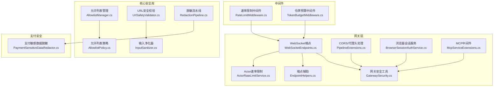
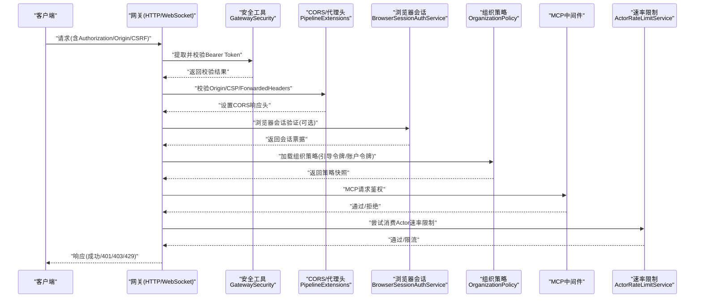
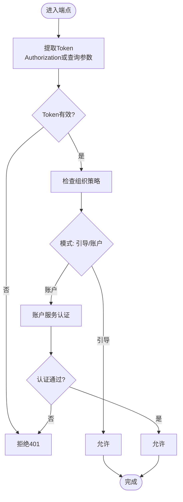
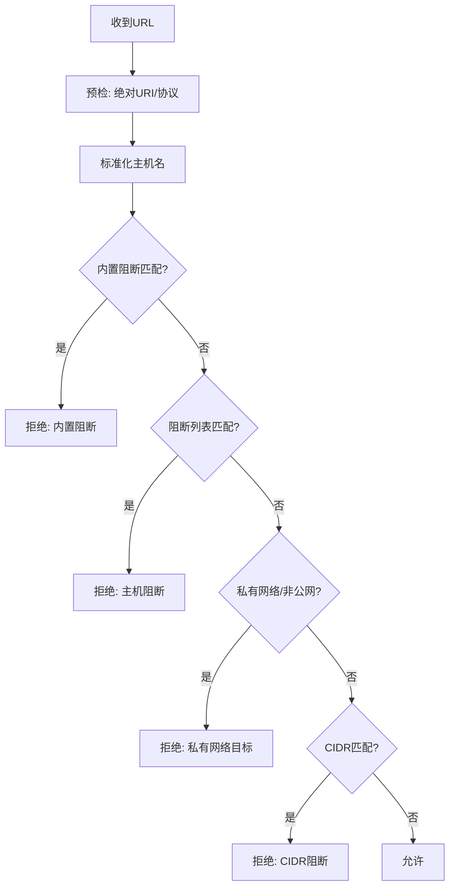
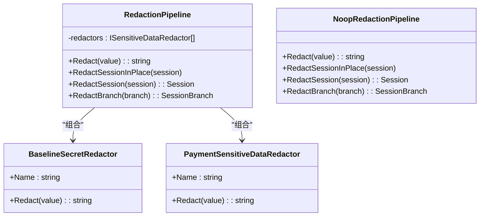
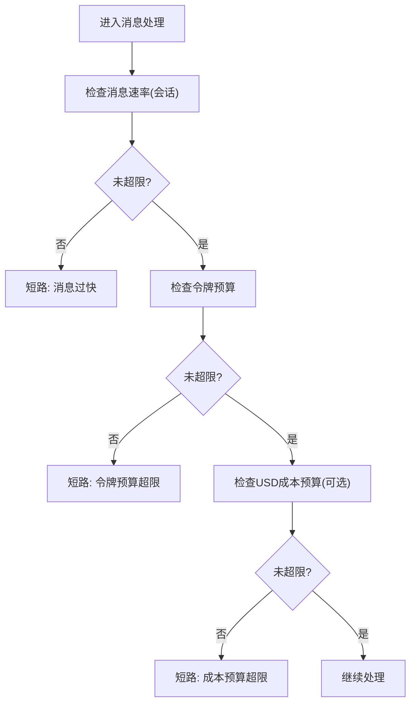
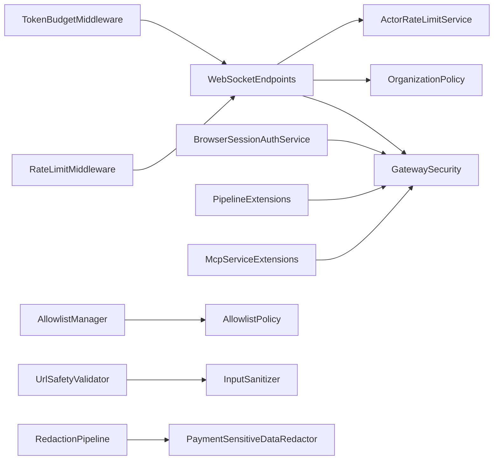

# 安全指南

<cite>
**本文档引用的文件**
- [src/OpenClaw.Gateway/appsettings.json](file://src/OpenClaw.Gateway/appsettings.json)
- [src/OpenClaw.Gateway/appsettings.Production.json](file://src/OpenClaw.Gateway/appsettings.Production.json)
- [src/OpenClaw.Core/Models/GatewayConfig.cs](file://src/OpenClaw.Core/Models/GatewayConfig.cs)
- [src/OpenClaw.Gateway/BrowserSessionAuthService.cs](file://src/OpenClaw.Gateway/BrowserSessionAuthService.cs)
- [src/OpenClaw.Gateway/Endpoints/WebSocketEndpoints.cs](file://src/OpenClaw.Gateway/Endpoints/WebSocketEndpoints.cs)
- [src/OpenClaw.Gateway/EndpointHelpers.cs](file://src/OpenClaw.Gateway/EndpointHelpers.cs)
- [src/OpenClaw.Gateway/GatewaySecurity.cs](file://src/OpenClaw.Gateway/GatewaySecurity.cs)
- [src/OpenClaw.Gateway/Mcp/McpServiceExtensions.cs](file://src/OpenClaw.Gateway/Mcp/McpServiceExtensions.cs)
- [src/OpenClaw.Gateway/Pipeline/PipelineExtensions.cs](file://src/OpenClaw.Gateway/Pipeline/PipelineExtensions.cs)
- [src/OpenClaw.Core/Security/AllowlistManager.cs](file://src/OpenClaw.Core/Security/AllowlistManager.cs)
- [src/OpenClaw.Core/Security/AllowlistPolicy.cs](file://src/OpenClaw.Core/Security/AllowlistPolicy.cs)
- [src/OpenClaw.Core/Security/InputSanitizer.cs](file://src/OpenClaw.Core/Security/InputSanitizer.cs)
- [src/OpenClaw.Core/Security/UrlSafetyValidator.cs](file://src/OpenClaw.Core/Security/UrlSafetyValidator.cs)
- [src/OpenClaw.Core/Security/RedactionPipeline.cs](file://src/OpenClaw.Core/Security/RedactionPipeline.cs)
- [src/OpenClaw.Payments.Core/PaymentSensitiveDataRedactor.cs](file://src/OpenClaw.Payments.Core/PaymentSensitiveDataRedactor.cs)
- [src/OpenClaw.Core/Middleware/RateLimitMiddleware.cs](file://src/OpenClaw.Core/Middleware/RateLimitMiddleware.cs)
- [src/OpenClaw.Core/Middleware/TokenBudgetMiddleware.cs](file://src/OpenClaw.Core/Middleware/TokenBudgetMiddleware.cs)
- [src/OpenClaw.Gateway/ActorRateLimitService.cs](file://src/OpenClaw.Gateway/ActorRateLimitService.cs)
- [src/OpenClaw.Gateway/AdminObservabilityService.cs](file://src/OpenClaw.Gateway/AdminObservabilityService.cs)
- [src/OpenClaw.Gateway/EvidenceBundleService.cs](file://src/OpenClaw.Gateway/EvidenceBundleService.cs)
- [src/OpenClaw.Cli/Program.cs](file://src/OpenClaw.Cli/Program.cs)
- [src/OpenClaw.Cli/OpenClawHttpClient.cs](file://src/OpenClaw.Cli/OpenClawHttpClient.cs)
</cite>

## 目录
1. [简介](#简介)
2. [项目结构](#项目结构)
3. [核心组件](#核心组件)
4. [架构总览](#架构总览)
5. [详细组件分析](#详细组件分析)
6. [依赖关系分析](#依赖关系分析)
7. [性能考虑](#性能考虑)
8. [故障排除指南](#故障排除指南)
9. [结论](#结论)
10. [附录](#附录)

## 简介
本安全指南面向 OpenClaw.NET 的部署与运维团队，系统阐述其安全架构设计、认证授权机制、访问控制策略与数据保护措施。文档覆盖安全配置项、威胁防护与合规要点，并提供可操作的安全配置示例、最佳实践、风险评估方法以及安全事件响应与漏洞修复流程，帮助在开发、测试与生产环境中建立纵深防御体系。

## 项目结构
OpenClaw.NET 的安全相关能力主要分布在以下模块：
- 网关层（Gateway）：负责入口安全、认证授权、速率限制、CORS/Origin 控制、浏览器会话管理等
- 核心安全库（Core.Security）：提供白名单策略、输入净化、URL 安全校验、敏感信息脱敏流水线等
- 支付安全扩展（Payments）：对支付敏感数据进行识别与脱敏
- 中间件（Core.Middleware）：消息级速率限制与令牌预算控制
- CLI 与可观测性：安全态势检查、审计证据收集与导出

图表来源
- [src/OpenClaw.Gateway/Endpoints/WebSocketEndpoints.cs:68-106](file://src/OpenClaw.Gateway/Endpoints/WebSocketEndpoints.cs#L68-L106)
- [src/OpenClaw.Gateway/EndpointHelpers.cs:145-173](file://src/OpenClaw.Gateway/EndpointHelpers.cs#L145-L173)
- [src/OpenClaw.Gateway/GatewaySecurity.cs:1-44](file://src/OpenClaw.Gateway/GatewaySecurity.cs#L1-L44)
- [src/OpenClaw.Gateway/Pipeline/PipelineExtensions.cs:91-127](file://src/OpenClaw.Gateway/Pipeline/PipelineExtensions.cs#L91-L127)
- [src/OpenClaw.Gateway/BrowserSessionAuthService.cs:1-180](file://src/OpenClaw.Gateway/BrowserSessionAuthService.cs#L1-L180)
- [src/OpenClaw.Gateway/Mcp/McpServiceExtensions.cs:67-90](file://src/OpenClaw.Gateway/Mcp/McpServiceExtensions.cs#L67-L90)
- [src/OpenClaw.Gateway/ActorRateLimitService.cs:92-103](file://src/OpenClaw.Gateway/ActorRateLimitService.cs#L92-L103)
- [src/OpenClaw.Core/Security/AllowlistManager.cs:1-126](file://src/OpenClaw.Core/Security/AllowlistManager.cs#L1-L126)
- [src/OpenClaw.Core/Security/AllowlistPolicy.cs:1-42](file://src/OpenClaw.Core/Security/AllowlistPolicy.cs#L1-L42)
- [src/OpenClaw.Core/Security/InputSanitizer.cs:1-84](file://src/OpenClaw.Core/Security/InputSanitizer.cs#L1-L84)
- [src/OpenClaw.Core/Security/UrlSafetyValidator.cs:1-219](file://src/OpenClaw.Core/Security/UrlSafetyValidator.cs#L1-L219)
- [src/OpenClaw.Core/Security/RedactionPipeline.cs:1-111](file://src/OpenClaw.Core/Security/RedactionPipeline.cs#L1-L111)
- [src/OpenClaw.Payments.Core/PaymentSensitiveDataRedactor.cs:25-63](file://src/OpenClaw.Payments.Core/PaymentSensitiveDataRedactor.cs#L25-L63)
- [src/OpenClaw.Core/Middleware/RateLimitMiddleware.cs:1-93](file://src/OpenClaw.Core/Middleware/RateLimitMiddleware.cs#L1-L93)
- [src/OpenClaw.Core/Middleware/TokenBudgetMiddleware.cs:1-71](file://src/OpenClaw.Core/Middleware/TokenBudgetMiddleware.cs#L1-L71)

章节来源
- [src/OpenClaw.Gateway/appsettings.json:82-102](file://src/OpenClaw.Gateway/appsettings.json#L82-L102)
- [src/OpenClaw.Gateway/appsettings.Production.json:22-30](file://src/OpenClaw.Gateway/appsettings.Production.json#L22-L30)
- [src/OpenClaw.Core/Models/GatewayConfig.cs:331-369](file://src/OpenClaw.Core/Models/GatewayConfig.cs#L331-L369)

## 核心组件
- 认证与授权
  - Bearer Token 提取与校验、查询参数令牌开关、跨域来源白名单、反向代理信任配置
  - 浏览器会话（CSRF 令牌、HttpOnly/SameSite/Lax/Secure Cookie）
  - 组织策略与引导令牌模式
- 访问控制
  - 允许列表（通道级）、严格/传统语义、动态更新
  - URL 安全校验（私有网络阻断、CIDR 黑名单、主机通配符）
  - 输入净化（Shell 元字符检测、CRLF 去除、路径穿越禁止）
- 数据保护
  - 敏感信息脱敏流水线（通用与支付专用）
  - 会话与分支级脱敏
- 速率与预算
  - 消息级速率限制（按会话）
  - 令牌预算与成本预算（USD）
  - IP/令牌维度的 Actor 速率限制

章节来源
- [src/OpenClaw.Gateway/GatewaySecurity.cs:13-44](file://src/OpenClaw.Gateway/GatewaySecurity.cs#L13-L44)
- [src/OpenClaw.Gateway/BrowserSessionAuthService.cs:10-180](file://src/OpenClaw.Gateway/BrowserSessionAuthService.cs#L10-L180)
- [src/OpenClaw.Core/Security/AllowlistManager.cs:19-126](file://src/OpenClaw.Core/Security/AllowlistManager.cs#L19-L126)
- [src/OpenClaw.Core/Security/AllowlistPolicy.cs:9-42](file://src/OpenClaw.Core/Security/AllowlistPolicy.cs#L9-L42)
- [src/OpenClaw.Core/Security/UrlSafetyValidator.cs:17-219](file://src/OpenClaw.Core/Security/UrlSafetyValidator.cs#L17-L219)
- [src/OpenClaw.Core/Security/InputSanitizer.cs:9-84](file://src/OpenClaw.Core/Security/InputSanitizer.cs#L9-L84)
- [src/OpenClaw.Core/Security/RedactionPipeline.cs:21-111](file://src/OpenClaw.Core/Security/RedactionPipeline.cs#L21-L111)
- [src/OpenClaw.Payments.Core/PaymentSensitiveDataRedactor.cs:25-63](file://src/OpenClaw.Payments.Core/PaymentSensitiveDataRedactor.cs#L25-L63)
- [src/OpenClaw.Core/Middleware/RateLimitMiddleware.cs:10-93](file://src/OpenClaw.Core/Middleware/RateLimitMiddleware.cs#L10-L93)
- [src/OpenClaw.Core/Middleware/TokenBudgetMiddleware.cs:12-71](file://src/OpenClaw.Core/Middleware/TokenBudgetMiddleware.cs#L12-L71)

## 架构总览
下图展示从客户端到网关再到工具执行的整体安全流：

图表来源
- [src/OpenClaw.Gateway/Endpoints/WebSocketEndpoints.cs:68-106](file://src/OpenClaw.Gateway/Endpoints/WebSocketEndpoints.cs#L68-L106)
- [src/OpenClaw.Gateway/GatewaySecurity.cs:13-44](file://src/OpenClaw.Gateway/GatewaySecurity.cs#L13-L44)
- [src/OpenClaw.Gateway/Pipeline/PipelineExtensions.cs:91-127](file://src/OpenClaw.Gateway/Pipeline/PipelineExtensions.cs#L91-L127)
- [src/OpenClaw.Gateway/BrowserSessionAuthService.cs:68-107](file://src/OpenClaw.Gateway/BrowserSessionAuthService.cs#L68-L107)
- [src/OpenClaw.Gateway/Mcp/McpServiceExtensions.cs:67-90](file://src/OpenClaw.Gateway/Mcp/McpServiceExtensions.cs#L67-L90)
- [src/OpenClaw.Gateway/ActorRateLimitService.cs:92-103](file://src/OpenClaw.Gateway/ActorRateLimitService.cs#L92-L103)

## 详细组件分析

### 认证与授权机制
- Bearer Token 提取与校验
  - 优先从 Authorization 头解析 Bearer，支持查询参数令牌开关
  - 使用常量时间比较避免时序攻击
- 跨域与来源控制
  - 显式 AllowedOrigins 白名单；非本地绑定时严格校验 Origin
  - 反向代理信任与 KnownProxies 配置，避免伪造源
- 浏览器会话
  - HttpOnly/SameSite=Lax/Secure Cookie；CSRF 令牌强制；支持“记住我”持久化
  - 过期清理与续期逻辑
- 组织策略与引导令牌
  - 支持引导令牌与账户令牌两种模式，结合策略快照进行授权判定

图表来源
- [src/OpenClaw.Gateway/GatewaySecurity.cs:13-44](file://src/OpenClaw.Gateway/GatewaySecurity.cs#L13-L44)
- [src/OpenClaw.Gateway/Endpoints/WebSocketEndpoints.cs:106-118](file://src/OpenClaw.Gateway/Endpoints/WebSocketEndpoints.cs#L106-L118)
- [src/OpenClaw.Gateway/BrowserSessionAuthService.cs:68-107](file://src/OpenClaw.Gateway/BrowserSessionAuthService.cs#L68-L107)

章节来源
- [src/OpenClaw.Gateway/GatewaySecurity.cs:13-44](file://src/OpenClaw.Gateway/GatewaySecurity.cs#L13-L44)
- [src/OpenClaw.Gateway/Endpoints/WebSocketEndpoints.cs:106-118](file://src/OpenClaw.Gateway/Endpoints/WebSocketEndpoints.cs#L106-L118)
- [src/OpenClaw.Gateway/BrowserSessionAuthService.cs:10-180](file://src/OpenClaw.Gateway/BrowserSessionAuthService.cs#L10-L180)
- [src/OpenClaw.Gateway/Pipeline/PipelineExtensions.cs:108-127](file://src/OpenClaw.Gateway/Pipeline/PipelineExtensions.cs#L108-L127)

### 访问控制策略
- 允许列表（通道级）
  - 动态文件优先于静态配置；并发写入加锁；路径安全化
  - 严格/传统两种语义：空即拒/空即允
- URL 安全校验
  - 私有/回环/链路本地/元数据域名阻断
  - 支持 CIDR 黑名单与主机通配符阻断
  - DNS 解析失败与无地址场景明确拒绝
- 输入净化
  - Shell 元字符检测与报错
  - CRLF 去除防止命令注入
  - 内存键与 IMAP 文件夹名安全校验

图表来源
- [src/OpenClaw.Core/Security/UrlSafetyValidator.cs:27-135](file://src/OpenClaw.Core/Security/UrlSafetyValidator.cs#L27-L135)

章节来源
- [src/OpenClaw.Core/Security/AllowlistManager.cs:19-126](file://src/OpenClaw.Core/Security/AllowlistManager.cs#L19-L126)
- [src/OpenClaw.Core/Security/AllowlistPolicy.cs:9-42](file://src/OpenClaw.Core/Security/AllowlistPolicy.cs#L9-L42)
- [src/OpenClaw.Core/Security/UrlSafetyValidator.cs:17-219](file://src/OpenClaw.Core/Security/UrlSafetyValidator.cs#L17-L219)
- [src/OpenClaw.Core/Security/InputSanitizer.cs:9-84](file://src/OpenClaw.Core/Security/InputSanitizer.cs#L9-L84)

### 数据保护与脱敏
- 敏感信息脱敏流水线
  - 通用：Authorization Bearer、常见密钥模式等
  - 支付：卡号、CVV、授权令牌、支付密钥等
  - 会话/分支级脱敏，JSON 深拷贝后处理
- 脱敏策略
  - 正则识别 + Luhn 校验（卡号）
  - 上下文定位（如 JSON 字段）精准替换
  - 支付专用正则覆盖多厂商标识

图表来源
- [src/OpenClaw.Core/Security/RedactionPipeline.cs:21-111](file://src/OpenClaw.Core/Security/RedactionPipeline.cs#L21-L111)
- [src/OpenClaw.Payments.Core/PaymentSensitiveDataRedactor.cs:25-63](file://src/OpenClaw.Payments.Core/PaymentSensitiveDataRedactor.cs#L25-L63)

章节来源
- [src/OpenClaw.Core/Security/RedactionPipeline.cs:21-111](file://src/OpenClaw.Core/Security/RedactionPipeline.cs#L21-L111)
- [src/OpenClaw.Payments.Core/PaymentSensitiveDataRedactor.cs:25-63](file://src/OpenClaw.Payments.Core/PaymentSensitiveDataRedactor.cs#L25-L63)

### 速率限制与预算控制
- 消息级速率限制（会话维度）
  - 基于时间窗口的队列计数，超限短路
- 令牌预算与成本预算
  - 会话内输入输出令牌累计，超限短路
  - 可插拔 USD 成本预算回调
- Actor 速率限制（IP/令牌/账户）
  - 多粒度策略匹配与消费，支持通配端点作用域

图表来源
- [src/OpenClaw.Core/Middleware/RateLimitMiddleware.cs:39-68](file://src/OpenClaw.Core/Middleware/RateLimitMiddleware.cs#L39-L68)
- [src/OpenClaw.Core/Middleware/TokenBudgetMiddleware.cs:36-69](file://src/OpenClaw.Core/Middleware/TokenBudgetMiddleware.cs#L36-L69)
- [src/OpenClaw.Gateway/ActorRateLimitService.cs:92-103](file://src/OpenClaw.Gateway/ActorRateLimitService.cs#L92-L103)

章节来源
- [src/OpenClaw.Core/Middleware/RateLimitMiddleware.cs:10-93](file://src/OpenClaw.Core/Middleware/RateLimitMiddleware.cs#L10-L93)
- [src/OpenClaw.Core/Middleware/TokenBudgetMiddleware.cs:12-71](file://src/OpenClaw.Core/Middleware/TokenBudgetMiddleware.cs#L12-L71)
- [src/OpenClaw.Gateway/ActorRateLimitService.cs:92-103](file://src/OpenClaw.Gateway/ActorRateLimitService.cs#L92-L103)

## 依赖关系分析
- 网关端点依赖安全工具与策略服务，形成“先认证、再策略、后限流”的统一入口
- 允许列表与 URL 校验贯穿工具调用前链路，降低横向移动风险
- 脱敏流水线在会话持久化与日志输出前执行，确保敏感信息不出界
- CLI 与可观测性服务提供安全态势检查与审计证据导出，支撑持续监控

图表来源
- [src/OpenClaw.Gateway/Endpoints/WebSocketEndpoints.cs:68-106](file://src/OpenClaw.Gateway/Endpoints/WebSocketEndpoints.cs#L68-L106)
- [src/OpenClaw.Gateway/GatewaySecurity.cs:13-44](file://src/OpenClaw.Gateway/GatewaySecurity.cs#L13-L44)
- [src/OpenClaw.Gateway/ActorRateLimitService.cs:92-103](file://src/OpenClaw.Gateway/ActorRateLimitService.cs#L92-L103)
- [src/OpenClaw.Gateway/BrowserSessionAuthService.cs:68-107](file://src/OpenClaw.Gateway/BrowserSessionAuthService.cs#L68-L107)
- [src/OpenClaw.Gateway/Pipeline/PipelineExtensions.cs:91-127](file://src/OpenClaw.Gateway/Pipeline/PipelineExtensions.cs#L91-L127)
- [src/OpenClaw.Gateway/Mcp/McpServiceExtensions.cs:67-90](file://src/OpenClaw.Gateway/Mcp/McpServiceExtensions.cs#L67-L90)
- [src/OpenClaw.Core/Security/AllowlistManager.cs:19-126](file://src/OpenClaw.Core/Security/AllowlistManager.cs#L19-L126)
- [src/OpenClaw.Core/Security/AllowlistPolicy.cs:9-42](file://src/OpenClaw.Core/Security/AllowlistPolicy.cs#L9-L42)
- [src/OpenClaw.Core/Security/UrlSafetyValidator.cs:17-219](file://src/OpenClaw.Core/Security/UrlSafetyValidator.cs#L17-L219)
- [src/OpenClaw.Core/Security/InputSanitizer.cs:9-84](file://src/OpenClaw.Core/Security/InputSanitizer.cs#L9-L84)
- [src/OpenClaw.Core/Security/RedactionPipeline.cs:21-111](file://src/OpenClaw.Core/Security/RedactionPipeline.cs#L21-L111)
- [src/OpenClaw.Payments.Core/PaymentSensitiveDataRedactor.cs:25-63](file://src/OpenClaw.Payments.Core/PaymentSensitiveDataRedactor.cs#L25-L63)
- [src/OpenClaw.Core/Middleware/RateLimitMiddleware.cs:10-93](file://src/OpenClaw.Core/Middleware/RateLimitMiddleware.cs#L10-L93)
- [src/OpenClaw.Core/Middleware/TokenBudgetMiddleware.cs:12-71](file://src/OpenClaw.Core/Middleware/TokenBudgetMiddleware.cs#L12-L71)

## 性能考虑
- 令牌常量时间比较避免时序泄漏，同时保持 O(1) 复杂度
- URL 校验在必要时进行 DNS 解析，建议在高并发场景启用缓存与合理超时
- 脱敏流水线采用正则扫描，建议对大文本分块处理并限制最大长度
- 速率限制使用固定窗口与惰性清理，注意内存占用与清理频率平衡
- 生产环境默认关闭查询参数令牌，减少误用与绕过风险

## 故障排除指南
- 401 未授权
  - 检查 Authorization 头是否以 Bearer 开头且非空
  - 确认查询参数令牌开关与部署策略一致
  - 核对组织策略中的引导/账户令牌配置
- 403 禁止
  - 核对 Origin 是否在 AllowedOrigins 白名单
  - 非本地绑定时需携带有效 Token 或通过浏览器会话
- 429 请求过多
  - 检查 Actor 速率限制策略与当前桶状态
  - 调整会话级速率限制与令牌预算
- 脱敏异常
  - 确认脱敏流水线顺序与正则规则
  - 对支付敏感数据使用专用脱敏器
- 观测与审计
  - 使用 CLI 获取安全态势报告，关注风险标志与建议
  - 导出审计证据包用于合规审查

章节来源
- [src/OpenClaw.Cli/Program.cs:1860-1873](file://src/OpenClaw.Cli/Program.cs#L1860-L1873)
- [src/OpenClaw.Cli/OpenClawHttpClient.cs:53-55](file://src/OpenClaw.Cli/OpenClawHttpClient.cs#L53-L55)
- [src/OpenClaw.Gateway/AdminObservabilityService.cs:199-229](file://src/OpenClaw.Gateway/AdminObservabilityService.cs#L199-L229)
- [src/OpenClaw.Gateway/EvidenceBundleService.cs:226-247](file://src/OpenClaw.Gateway/EvidenceBundleService.cs#L226-L247)

## 结论
OpenClaw.NET 的安全体系以“入口强认证、策略白名单、输入净化与URL校验、脱敏与预算控制”为核心，配合可观测性与 CLI 工具实现持续监控与快速响应。生产部署应遵循最小暴露面原则，严格限制公开绑定与高危工具，启用浏览器会话与严格的 CORS/代理头策略，并定期进行安全态势检查与风险评估。

## 附录

### 安全配置示例与最佳实践
- 生产环境建议
  - 绑定地址设为 0.0.0.0，但开启严格公共绑定预设与工具安全限制
  - 关闭 AllowQueryStringToken，启用 KnownProxies 并信任转发头
  - 设置 AllowedOrigins 为受控域名，启用浏览器会话 Cookie 安全属性
  - 启用 URL 安全校验与严格允许列表语义
- 开发环境建议
  - 绑定地址设为 127.0.0.1，允许查询参数令牌便于调试
  - 临时放宽允许列表与工具权限，上线前回归生产策略
- 支付与敏感数据
  - 启用支付专用脱敏器，避免日志泄露
  - 会话与分支级脱敏在持久化前执行
- 速率与预算
  - 为不同端点设置 Actor 速率限制策略
  - 为高成本模型启用令牌与 USD 成本预算

章节来源
- [src/OpenClaw.Gateway/appsettings.Production.json:22-30](file://src/OpenClaw.Gateway/appsettings.Production.json#L22-L30)
- [src/OpenClaw.Gateway/appsettings.json:82-102](file://src/OpenClaw.Gateway/appsettings.json#L82-L102)
- [src/OpenClaw.Core/Models/GatewayConfig.cs:331-369](file://src/OpenClaw.Core/Models/GatewayConfig.cs#L331-L369)