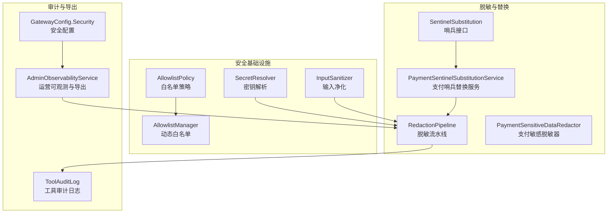
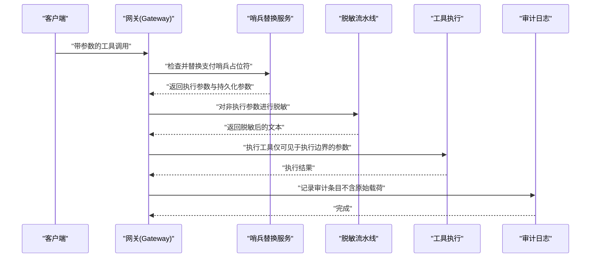
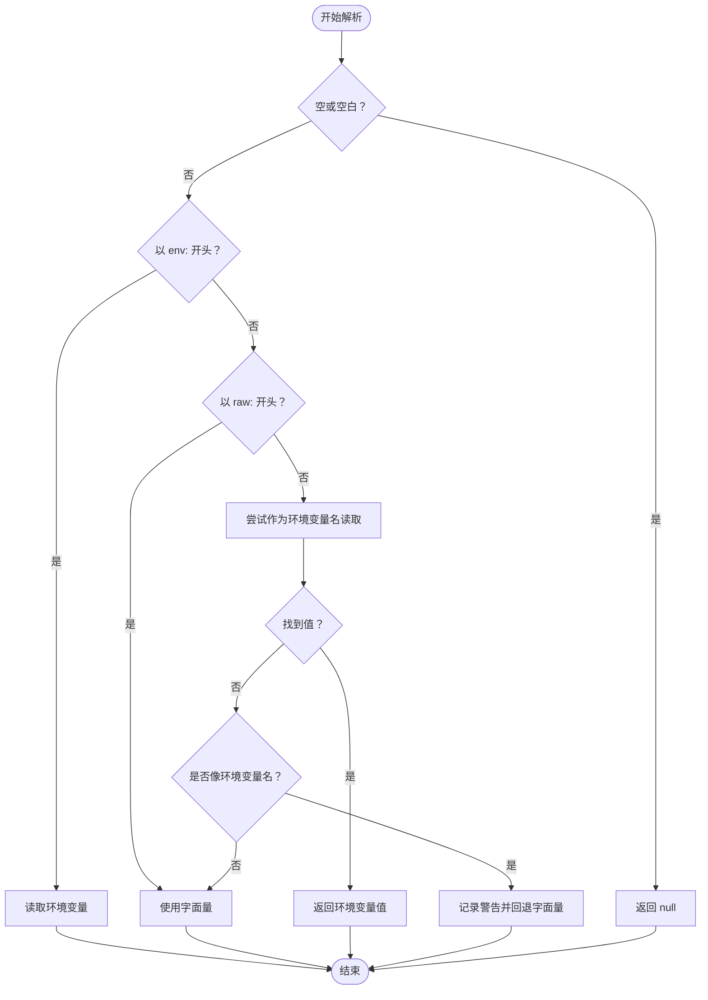
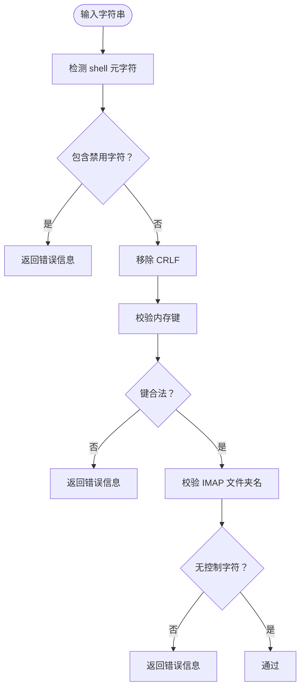
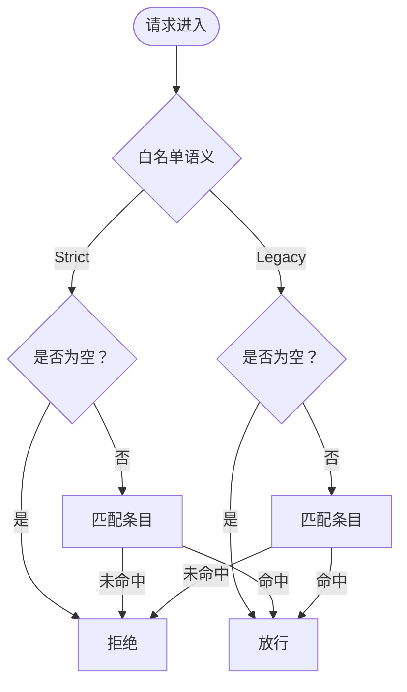
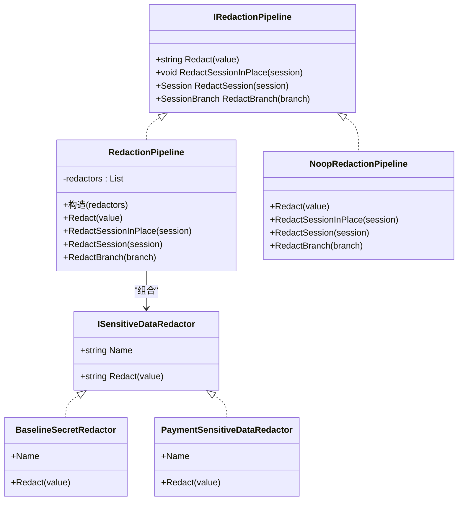
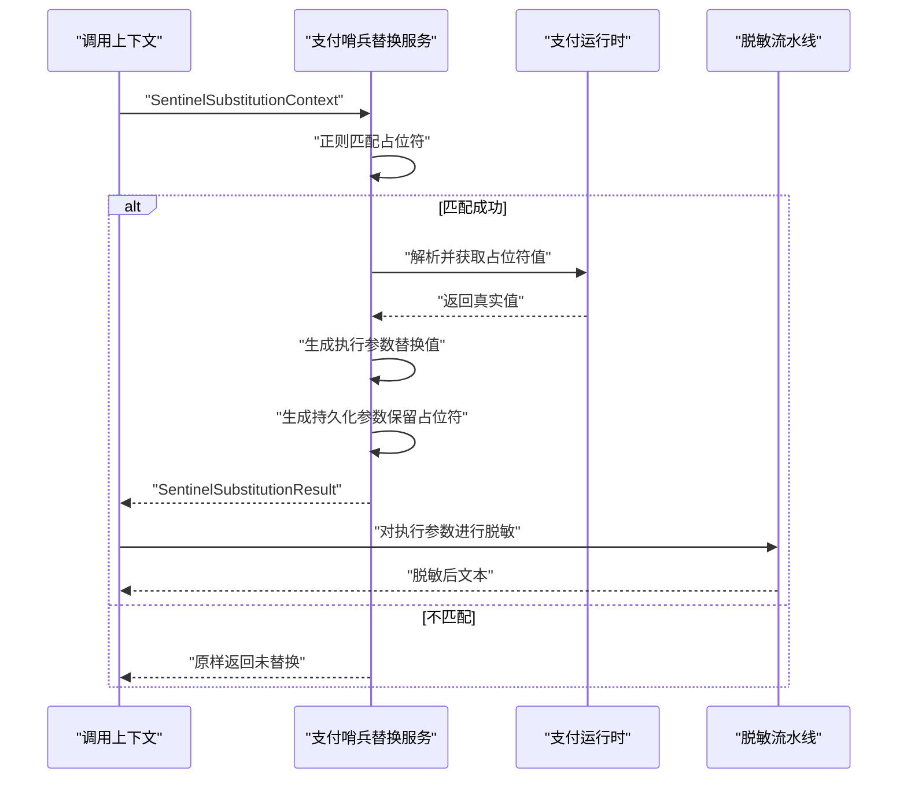
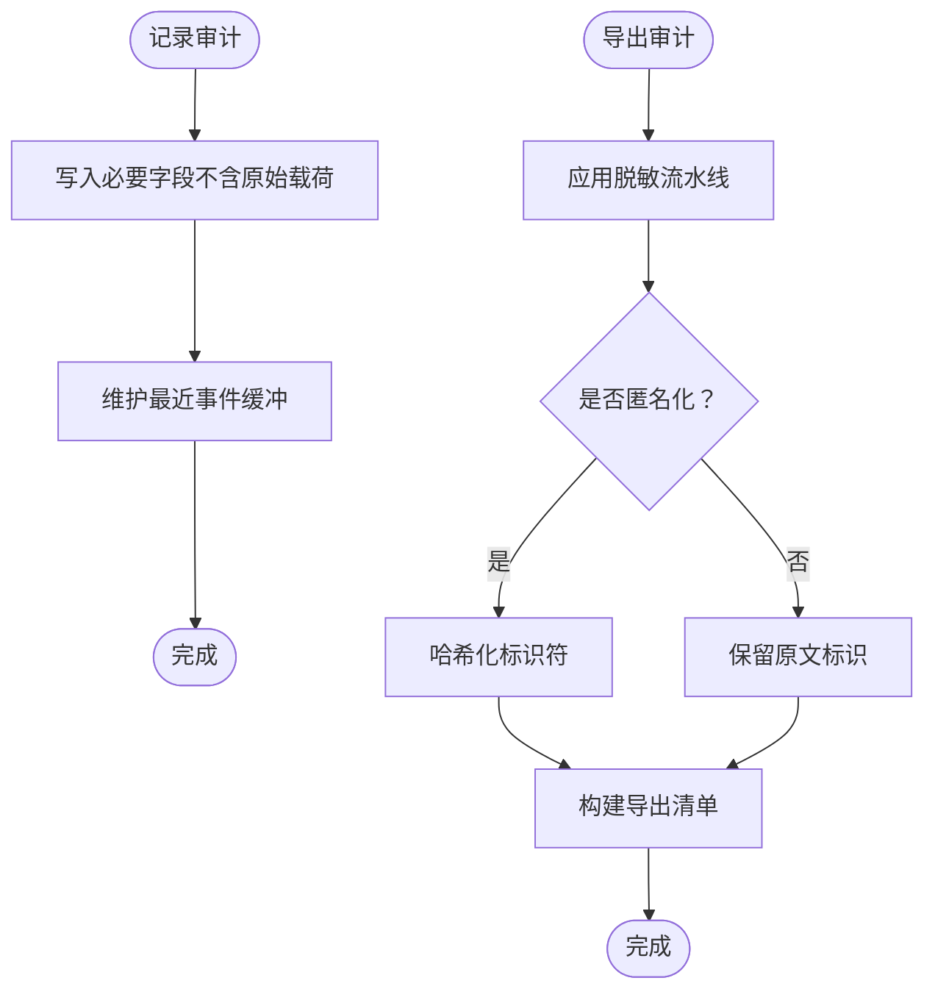
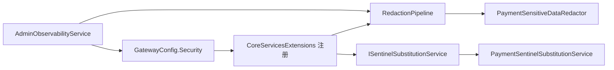

# 数据保护

<cite>
**本文引用的文件**
- [RedactionPipeline.cs](file://src/OpenClaw.Core/Security/RedactionPipeline.cs)
- [SentinelSubstitution.cs](file://src/OpenClaw.Core/Security/SentinelSubstitution.cs)
- [PaymentSentinelSubstitutionService.cs](file://src/OpenClaw.Payments.Core/PaymentSentinelSubstitutionService.cs)
- [PaymentSensitiveDataRedactor.cs](file://src/OpenClaw.Payments.Core/PaymentSensitiveDataRedactor.cs)
- [SecretResolver.cs](file://src/OpenClaw.Core/Security/SecretResolver.cs)
- [InputSanitizer.cs](file://src/OpenClaw.Core/Security/InputSanitizer.cs)
- [GatewaySecurity.cs](file://src/OpenClaw.Gateway/GatewaySecurity.cs)
- [AdminObservabilityService.cs](file://src/OpenClaw.Gateway/AdminObservabilityService.cs)
- [ToolAuditLog.cs](file://src/OpenClaw.Core/Observability/ToolAuditLog.cs)
- [CoreServicesExtensions.cs](file://src/OpenClaw.Gateway/Composition/CoreServicesExtensions.cs)
- [GatewayConfig.cs](file://src/OpenClaw.Core/Models/GatewayConfig.cs)
- [OperatorGovernanceModels.cs](file://src/OpenClaw.Core/Models/OperatorGovernanceModels.cs)
- [AllowlistPolicy.cs](file://src/OpenClaw.Core/Security/AllowlistPolicy.cs)
- [AllowlistManager.cs](file://src/OpenClaw.Core/Security/AllowlistManager.cs)
- [PaymentRuntimeTests.cs](file://src/OpenClaw.Tests/PaymentRuntimeTests.cs)
- [SecurityTests.cs](file://src/OpenClaw.Tests/SecurityTests.cs)
</cite>

## 目录
1. [简介](#简介)
2. [项目结构](#项目结构)
3. [核心组件](#核心组件)
4. [架构总览](#架构总览)
5. [详细组件分析](#详细组件分析)
6. [依赖关系分析](#依赖关系分析)
7. [性能考量](#性能考量)
8. [故障排查指南](#故障排查指南)
9. [结论](#结论)
10. [附录](#附录)

## 简介
本文件系统性阐述 OpenClaw.NET 的数据保护机制，覆盖敏感信息解析、哨兵替换、数据脱敏与审计日志保护；详解密钥管理、敏感数据识别、自动脱敏规则与日志审计；并提供数据保护配置、脱敏策略制定与合规建议，以及数据泄露防护、隐私保护与安全审计的最佳实践。

## 项目结构
OpenClaw.NET 将数据保护能力分布在多个模块中：
- 安全基础设施：密钥解析、输入净化、访问白名单策略
- 脱敏流水线：通用敏感数据脱敏与会话级脱敏
- 哨兵替换：支付场景的参数占位替换与持久化隔离
- 审计与导出：工具执行审计日志与运营导出的匿名化处理
- 配置与策略：网关安全配置、组织策略与导出清单

**图表来源**
- [SecretResolver.cs:14-66](file://src/OpenClaw.Core/Security/SecretResolver.cs#L14-L66)
- [InputSanitizer.cs:9-84](file://src/OpenClaw.Core/Security/InputSanitizer.cs#L9-L84)
- [AllowlistPolicy.cs:9-42](file://src/OpenClaw.Core/Security/AllowlistPolicy.cs#L9-L42)
- [AllowlistManager.cs:19-126](file://src/OpenClaw.Core/Security/AllowlistManager.cs#L19-L126)
- [RedactionPipeline.cs:21-102](file://src/OpenClaw.Core/Security/RedactionPipeline.cs#L21-L102)
- [PaymentSensitiveDataRedactor.cs:8-63](file://src/OpenClaw.Payments.Core/PaymentSensitiveDataRedactor.cs#L8-L63)
- [SentinelSubstitution.cs:3-37](file://src/OpenClaw.Core/Security/SentinelSubstitution.cs#L3-L37)
- [PaymentSentinelSubstitutionService.cs:8-35](file://src/OpenClaw.Payments.Core/PaymentSentinelSubstitutionService.cs#L8-L35)
- [ToolAuditLog.cs:39-125](file://src/OpenClaw.Core/Observability/ToolAuditLog.cs#L39-L125)
- [AdminObservabilityService.cs:26-229](file://src/OpenClaw.Gateway/AdminObservabilityService.cs#L26-L229)
- [GatewayConfig.cs:331-369](file://src/OpenClaw.Core/Models/GatewayConfig.cs#L331-L369)

**章节来源**
- [SecretResolver.cs:14-66](file://src/OpenClaw.Core/Security/SecretResolver.cs#L14-L66)
- [InputSanitizer.cs:9-84](file://src/OpenClaw.Core/Security/InputSanitizer.cs#L9-L84)
- [AllowlistPolicy.cs:9-42](file://src/OpenClaw.Core/Security/AllowlistPolicy.cs#L9-L42)
- [AllowlistManager.cs:19-126](file://src/OpenClaw.Core/Security/AllowlistManager.cs#L19-L126)
- [RedactionPipeline.cs:21-102](file://src/OpenClaw.Core/Security/RedactionPipeline.cs#L21-L102)
- [PaymentSensitiveDataRedactor.cs:8-63](file://src/OpenClaw.Payments.Core/PaymentSensitiveDataRedactor.cs#L8-L63)
- [SentinelSubstitution.cs:3-37](file://src/OpenClaw.Core/Security/SentinelSubstitution.cs#L3-L37)
- [PaymentSentinelSubstitutionService.cs:8-35](file://src/OpenClaw.Payments.Core/PaymentSentinelSubstitutionService.cs#L8-L35)
- [ToolAuditLog.cs:39-125](file://src/OpenClaw.Core/Observability/ToolAuditLog.cs#L39-L125)
- [AdminObservabilityService.cs:26-229](file://src/OpenClaw.Gateway/AdminObservabilityService.cs#L26-L229)
- [GatewayConfig.cs:331-369](file://src/OpenClaw.Core/Models/GatewayConfig.cs#L331-L369)

## 核心组件
- 密钥解析（SecretResolver）：统一解析 env:、raw: 与裸字符串三种密钥引用，避免生产环境误用裸字符串，并在日志中提示潜在风险。
- 输入净化（InputSanitizer）：检测并清理 shell 元字符、CRLF 注入、路径穿越与 IMAP 文件夹名控制字符，降低注入风险。
- 白名单策略（AllowlistPolicy/AllowlistManager）：支持“严格”和“兼容”两种语义，动态持久化通道白名单，保障渠道来源安全。
- 脱敏流水线（RedactionPipeline/ISensitiveDataRedactor）：可组合的敏感数据脱敏器，对会话历史、分支与任意文本进行多层脱敏。
- 支付脱敏器（PaymentSensitiveDataRedactor）：识别并脱敏卡号、CVV、授权头、JSON 字段与支付令牌等支付敏感信息。
- 哨兵替换（SentinelSubstitution/IPaymentSentinelSubstitutionService）：在浏览器工具调用时，将模板占位符替换为真实值，同时保留持久化参数中的占位符，实现“执行边界可见、持久化不可见”的隔离。
- 审计日志（ToolAuditLog）：默认不记录原始参数与结果载荷，仅记录字节数与关键元数据，避免敏感信息泄露。
- 运营导出（AdminObservabilityService）：对导出内容进行脱敏与匿名化处理，支持按需哈希化标识符与替换敏感文本。

**章节来源**
- [SecretResolver.cs:14-66](file://src/OpenClaw.Core/Security/SecretResolver.cs#L14-L66)
- [InputSanitizer.cs:9-84](file://src/OpenClaw.Core/Security/InputSanitizer.cs#L9-L84)
- [AllowlistPolicy.cs:9-42](file://src/OpenClaw.Core/Security/AllowlistPolicy.cs#L9-L42)
- [AllowlistManager.cs:19-126](file://src/OpenClaw.Core/Security/AllowlistManager.cs#L19-L126)
- [RedactionPipeline.cs:21-102](file://src/OpenClaw.Core/Security/RedactionPipeline.cs#L21-L102)
- [PaymentSensitiveDataRedactor.cs:8-63](file://src/OpenClaw.Payments.Core/PaymentSensitiveDataRedactor.cs#L8-L63)
- [SentinelSubstitution.cs:3-37](file://src/OpenClaw.Core/Security/SentinelSubstitution.cs#L3-L37)
- [PaymentSentinelSubstitutionService.cs:8-35](file://src/OpenClaw.Payments.Core/PaymentSentinelSubstitutionService.cs#L8-L35)
- [ToolAuditLog.cs:39-125](file://src/OpenClaw.Core/Observability/ToolAuditLog.cs#L39-L125)
- [AdminObservabilityService.cs:26-229](file://src/OpenClaw.Gateway/AdminObservabilityService.cs#L26-L229)

## 架构总览
下图展示从请求到执行再到审计的关键路径，强调敏感数据在不同阶段的处理策略。

**图表来源**
- [PaymentSentinelSubstitutionService.cs:21-35](file://src/OpenClaw.Payments.Core/PaymentSentinelSubstitutionService.cs#L21-L35)
- [RedactionPipeline.cs:30-39](file://src/OpenClaw.Core/Security/RedactionPipeline.cs#L30-L39)
- [ToolAuditLog.cs:72-95](file://src/OpenClaw.Core/Observability/ToolAuditLog.cs#L72-L95)

## 详细组件分析

### 敏感信息解析与密钥管理
- 解析策略
  - env:VAR_NAME：严格从环境变量读取，失败则为空。
  - raw:literal：直接使用字面量（不推荐用于生产）。
  - bare string：优先尝试作为环境变量名读取，若未设置且看起来像环境变量名，则记录警告并回退为字面量。
- 生产安全建议
  - 禁止在公开绑定场景使用 raw: 引用；通过安全配置开关限制。
  - 对裸字符串密钥引用进行告警，促使显式使用 env: 前缀。

**图表来源**
- [SecretResolver.cs:24-54](file://src/OpenClaw.Core/Security/SecretResolver.cs#L24-L54)

**章节来源**
- [SecretResolver.cs:14-66](file://src/OpenClaw.Core/Security/SecretResolver.cs#L14-L66)
- [GatewayConfig.cs:358-362](file://src/OpenClaw.Core/Models/GatewayConfig.cs#L358-L362)

### 输入净化与注入防护
- shell 元字符检测：禁止 ; | & ` $ ( ) { } < > 回车换行等，防止命令注入。
- CRLF 清理：移除 IMAP/SMTP 协议输入中的回车与换行，避免行注入。
- 路径穿越与键名校验：拒绝 .. / \ 与空字符，确保内存键安全。
- IMAP 文件夹名校验：拒绝控制字符，仅允许可打印字符。

**图表来源**
- [InputSanitizer.cs:24-82](file://src/OpenClaw.Core/Security/InputSanitizer.cs#L24-L82)

**章节来源**
- [InputSanitizer.cs:9-84](file://src/OpenClaw.Core/Security/InputSanitizer.cs#L9-L84)
- [SecurityTests.cs:108-144](file://src/OpenClaw.Tests/SecurityTests.cs#L108-L144)

### 白名单策略与动态管理
- 语义选择
  - 兼容模式（Legacy）：空白名单即放行，保持历史行为。
  - 严格模式（Strict）：空白名单即拒绝，通配符 * 表示全部放行。
- 动态白名单
  - 按通道持久化 allowlists/{channel}.json，动态更新覆盖静态配置。
  - 并发安全：基于通道 ID 的锁保证写入一致性。

**图表来源**
- [AllowlistPolicy.cs:18-40](file://src/OpenClaw.Core/Security/AllowlistPolicy.cs#L18-L40)
- [AllowlistManager.cs:32-84](file://src/OpenClaw.Core/Security/AllowlistManager.cs#L32-L84)

**章节来源**
- [AllowlistPolicy.cs:9-42](file://src/OpenClaw.Core/Security/AllowlistPolicy.cs#L9-L42)
- [AllowlistManager.cs:19-126](file://src/OpenClaw.Core/Security/AllowlistManager.cs#L19-L126)

### 脱敏流水线与敏感数据识别
- 流水线设计
  - 可组合的脱敏器链路，依次对输入进行处理。
  - 支持对会话历史、分支与任意文本进行就地与克隆脱敏。
- 通用与支付专用脱敏器
  - 通用：识别 Authorization Bearer、OpenAI 秘钥等常见敏感头与令牌。
  - 支付：识别卡号（含 Luhn 校验）、CVV 上下文、授权头、JSON 字段与支付令牌等。

**图表来源**
- [RedactionPipeline.cs:7-102](file://src/OpenClaw.Core/Security/RedactionPipeline.cs#L7-L102)
- [PaymentSensitiveDataRedactor.cs:8-63](file://src/OpenClaw.Payments.Core/PaymentSensitiveDataRedactor.cs#L8-L63)

**章节来源**
- [RedactionPipeline.cs:21-102](file://src/OpenClaw.Core/Security/RedactionPipeline.cs#L21-L102)
- [PaymentSensitiveDataRedactor.cs:8-63](file://src/OpenClaw.Payments.Core/PaymentSensitiveDataRedactor.cs#L8-L63)

### 哨兵替换与持久化隔离
- 场景：浏览器工具调用中使用 {{payment.vcard:...}} 占位符填写虚拟卡信息。
- 规则：
  - 执行边界可见：将占位符替换为真实值，供本次执行使用。
  - 持久化不可见：保存的参数仍保留占位符，避免泄露。
- 实现要点：正则匹配占位符，解析上下文（如环境、卡号字段），调用运行时获取对应值。

**图表来源**
- [SentinelSubstitution.cs:3-37](file://src/OpenClaw.Core/Security/SentinelSubstitution.cs#L3-L37)
- [PaymentSentinelSubstitutionService.cs:21-35](file://src/OpenClaw.Payments.Core/PaymentSentinelSubstitutionService.cs#L21-L35)

**章节来源**
- [SentinelSubstitution.cs:3-37](file://src/OpenClaw.Core/Security/SentinelSubstitution.cs#L3-L37)
- [PaymentSentinelSubstitutionService.cs:8-35](file://src/OpenClaw.Payments.Core/PaymentSentinelSubstitutionService.cs#L8-L35)
- [PaymentRuntimeTests.cs:127-155](file://src/OpenClaw.Tests/PaymentRuntimeTests.cs#L127-L155)

### 审计日志保护与导出
- 审计日志
  - 默认不记录原始参数与结果载荷，仅记录时间戳、工具名、会话/通道/发送者标识、耗时、失败/超时状态、治理评估等元数据与字节数。
  - 提供最近事件快照，便于实时监控。
- 运营导出
  - 对导出内容进行脱敏与匿名化：可选哈希化会话/用户 ID、替换邮箱/电话/密钥等敏感文本。
  - 导出清单包含起止时间、文件列表、策略快照、保留天数与审计序列范围等。

**图表来源**
- [ToolAuditLog.cs:72-108](file://src/OpenClaw.Core/Observability/ToolAuditLog.cs#L72-L108)
- [AdminObservabilityService.cs:816-850](file://src/OpenClaw.Gateway/AdminObservabilityService.cs#L816-L850)
- [OperatorGovernanceModels.cs:435-449](file://src/OpenClaw.Core/Models/OperatorGovernanceModels.cs#L435-L449)

**章节来源**
- [ToolAuditLog.cs:39-125](file://src/OpenClaw.Core/Observability/ToolAuditLog.cs#L39-L125)
- [AdminObservabilityService.cs:816-850](file://src/OpenClaw.Gateway/AdminObservabilityService.cs#L816-L850)
- [OperatorGovernanceModels.cs:435-449](file://src/OpenClaw.Core/Models/OperatorGovernanceModels.cs#L435-L449)

## 依赖关系分析
- 服务注册与装配
  - 脱敏流水线由多个脱敏器组成，运行时按顺序应用。
  - 哨兵替换服务根据配置选择支付专用或空实现。
  - 运营导出依赖脱敏流水线与安全配置，确保导出合规。
- 关键耦合点
  - 支付哨兵替换依赖支付运行时服务与 JSON 文档解析。
  - 脱敏流水线与支付脱敏器共同作用于会话与导出数据。
  - 网关安全工具类提供固定时间比较与 HMAC 验证，保障令牌与签名验证安全。

**图表来源**
- [CoreServicesExtensions.cs:77-98](file://src/OpenClaw.Gateway/Composition/CoreServicesExtensions.cs#L77-L98)
- [GatewaySecurity.cs:39-76](file://src/OpenClaw.Gateway/GatewaySecurity.cs#L39-L76)

**章节来源**
- [CoreServicesExtensions.cs:77-98](file://src/OpenClaw.Gateway/Composition/CoreServicesExtensions.cs#L77-L98)
- [GatewaySecurity.cs:8-109](file://src/OpenClaw.Gateway/GatewaySecurity.cs#L8-L109)

## 性能考量
- 正则与字符串处理
  - 脱敏与哨兵替换使用编译型正则，减少重复编译开销。
  - 脱敏流水线按顺序串联，建议按敏感度排序，优先处理高风险模式。
- I/O 与并发
  - 审计日志采用追加写与近期缓冲，避免频繁文件操作。
  - 白名单管理使用通道级锁，降低并发写冲突。
- 内存与 CPU
  - 输入净化使用 SIMD 加速的字符搜索与堆栈分配缓冲，降低 GC 压力。
  - 导出阶段的哈希与替换应结合批量处理，避免在热路径上过度计算。

[本节为通用指导，无需具体文件来源]

## 故障排查指南
- 哨兵替换未生效
  - 检查工具名是否为浏览器工具，参数 JSON 是否包含支付哨兵占位符。
  - 确认运行时可解析占位符并返回真实值。
- 脱敏后仍残留敏感信息
  - 确认已启用支付专用脱敏器与通用脱敏器链路。
  - 检查会话持久化前是否调用了脱敏流水线。
- 导出内容泄露
  - 确认导出时启用了脱敏与匿名化。
  - 检查安全配置中是否允许查询字符串令牌、是否允许公共绑定下的不安全工具配置。
- 白名单策略异常
  - 确认语义设置（严格/兼容），检查动态白名单文件是否正确写入与覆盖静态配置。

**章节来源**
- [PaymentRuntimeTests.cs:127-155](file://src/OpenClaw.Tests/PaymentRuntimeTests.cs#L127-L155)
- [AdminObservabilityService.cs:816-850](file://src/OpenClaw.Gateway/AdminObservabilityService.cs#L816-L850)
- [GatewayConfig.cs:331-369](file://src/OpenClaw.Core/Models/GatewayConfig.cs#L331-L369)
- [AllowlistManager.cs:50-84](file://src/OpenClaw.Core/Security/AllowlistManager.cs#L50-L84)

## 结论
OpenClaw.NET 通过“密钥解析 + 输入净化 + 白名单策略 + 脱敏流水线 + 哨兵替换 + 审计日志 + 导出匿名化”的完整体系，实现了对敏感信息的全生命周期保护。支付场景的哨兵替换与持久化隔离进一步强化了数据最小暴露原则；脱敏与导出的可插拔设计便于扩展与定制。结合安全配置与组织策略，可在不同部署环境下满足合规与隐私保护要求。

[本节为总结，无需具体文件来源]

## 附录
- 数据保护配置要点
  - 公共绑定安全预设：在非本地绑定时强制更严格的审批与工具默认策略。
  - 查询令牌与代理信任：按需开启查询令牌与转发头信任，明确受信代理列表。
  - 工具执行安全：限制 shell 与写入根目录，启用 URL 安全策略与浏览器安全选项。
- 脱敏策略制定建议
  - 分层脱敏：先通用后专用，优先处理高风险模式（令牌、卡号、授权头）。
  - 会话与导出一致：确保持久化与导出均经过相同脱敏流程。
  - 可观测性与审计：保留必要的元数据与统计，避免载荷泄露。
- 合规与最佳实践
  - 最小权限与最小暴露：仅在执行边界可见敏感参数，持久化与导出均应脱敏。
  - 定期审查：对白名单、密钥引用与导出策略进行定期审计。
  - 日志与追踪：结合审计日志与导出清单，建立可追溯的合规档案。

[本节为通用指导，无需具体文件来源]