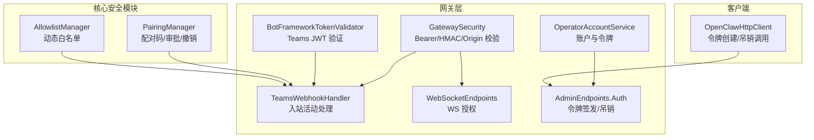
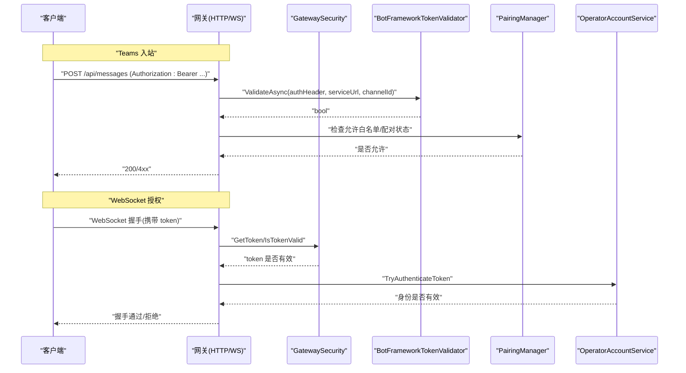
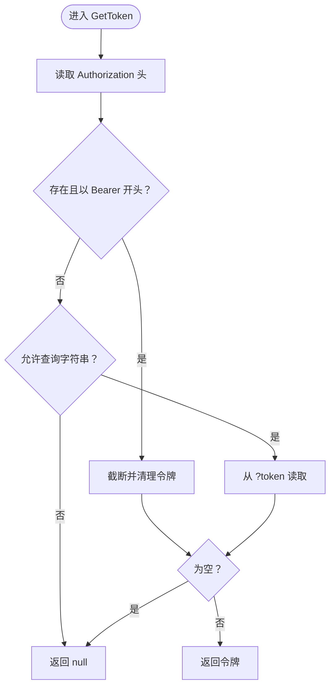
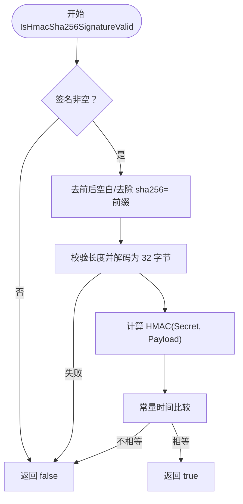
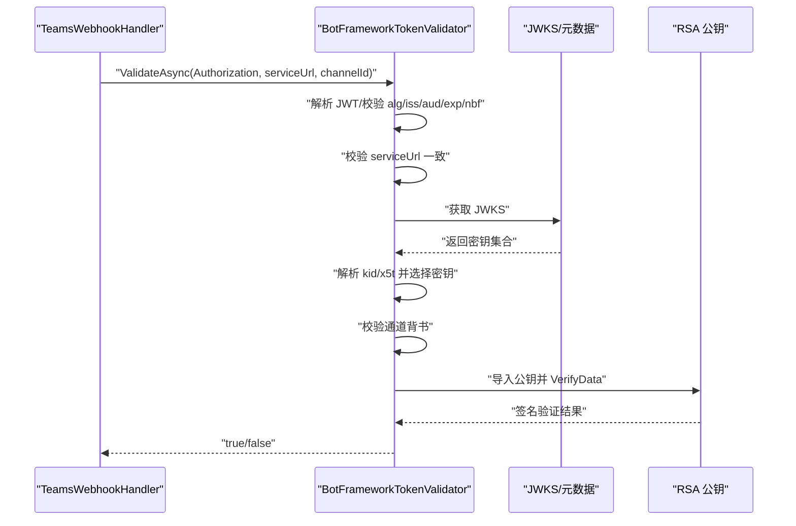
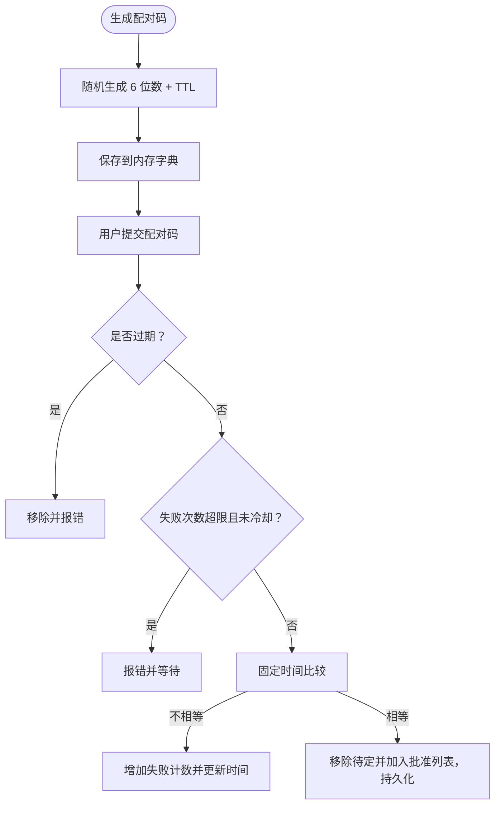
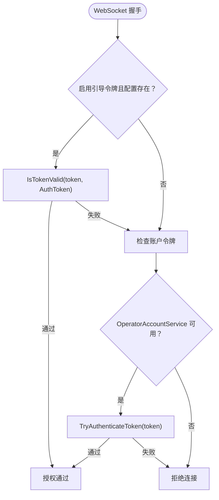
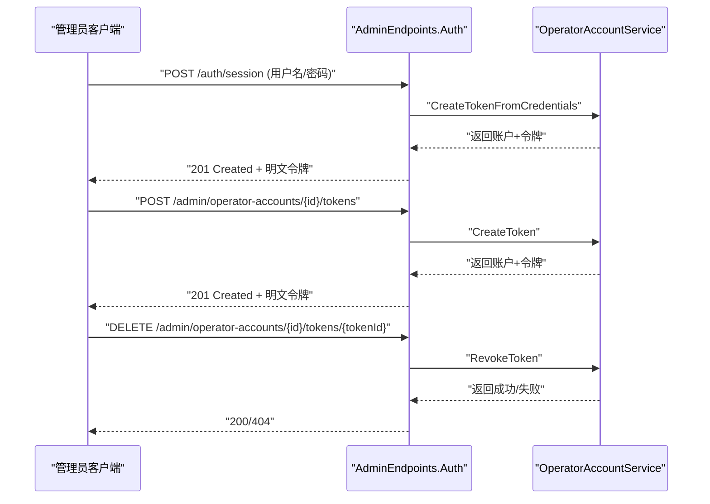
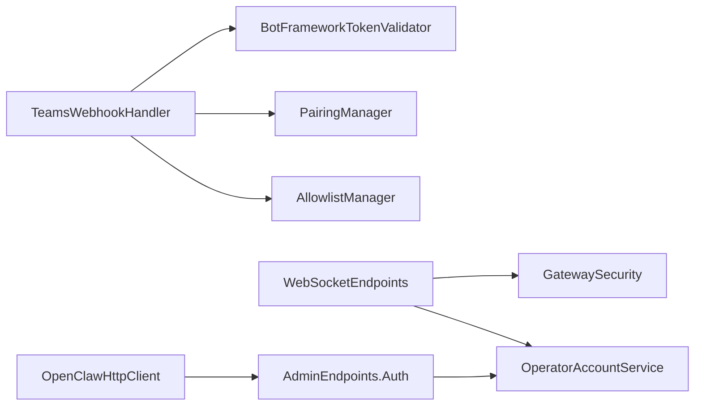

# 认证与授权

<cite>
**本文引用的文件**
- [BotFrameworkTokenValidator.cs](file://src/OpenClaw.Gateway/BotFrameworkTokenValidator.cs)
- [TeamsWebhookHandler.cs](file://src/OpenClaw.Gateway/TeamsWebhookHandler.cs)
- [GatewaySecurity.cs](file://src/OpenClaw.Gateway/GatewaySecurity.cs)
- [PairingManager.cs](file://src/OpenClaw.Core/Security/PairingManager.cs)
- [AllowlistManager.cs](file://src/OpenClaw.Core/Security/AllowlistManager.cs)
- [WebSocketEndpoints.cs](file://src/OpenClaw.Gateway/Endpoints/WebSocketEndpoints.cs)
- [appsettings.json](file://src/OpenClaw.Gateway/appsettings.json)
- [appsettings.Production.json](file://src/OpenClaw.Gateway/appsettings.Production.json)
- [OperatorAccountService.cs](file://src/OpenClaw.Gateway/OperatorAccountService.cs)
- [AdminEndpoints.Auth.cs](file://src/OpenClaw.Gateway/Endpoints/AdminEndpoints.Auth.cs)
- [OpenClawHttpClient.cs](file://src/OpenClaw.Client/OpenClawHttpClient.cs)
- [GatewaySecurityTests.cs](file://src/OpenClaw.Tests/GatewaySecurityTests.cs)
- [PairingManagerTests.cs](file://src/OpenClaw.Tests/PairingManagerTests.cs)
- [TeamsWebhookHandlerTests.cs](file://src/OpenClaw.Tests/TeamsWebhookHandlerTests.cs)
</cite>

## 目录
1. [简介](#简介)
2. [项目结构](#项目结构)
3. [核心组件](#核心组件)
4. [架构总览](#架构总览)
5. [组件详解](#组件详解)
6. [依赖关系分析](#依赖关系分析)
7. [性能考量](#性能考量)
8. [故障排查指南](#故障排查指南)
9. [结论](#结论)
10. [附录](#附录)

## 简介
本文件面向 OpenClaw.NET 的认证与授权体系，聚焦以下能力：
- Bearer Token 认证：从请求头提取并校验令牌，支持查询字符串回退（可配置）。
- HMAC SHA256 签名验证：用于校验请求体完整性，采用常量时间比较防止时序攻击。
- Bot Framework 令牌验证：对 Microsoft Teams 活动中的 JWT 进行算法、发行者、受众、有效期、服务地址、签名密钥与通道背书等多维校验。
- 配对管理器：为直接消息通道提供一次性配对码生成、审批与撤销，并持久化已批准发送方。

文档同时给出认证流程、令牌生成与验证、签名计算与安全传输要点、配置示例、最佳实践以及常见问题排查与安全加固建议。

## 项目结构
认证与授权相关代码主要分布在网关层与核心安全模块中：
- 网关层：Bearer Token 提取与校验、HMAC 校验、Bot Framework 令牌验证、Teams 入站处理、WebSocket 授权、管理员端点与操作审计。
- 核心安全模块：配对管理器、允许白名单管理器。

图示来源
- [GatewaySecurity.cs:1-109](file://src/OpenClaw.Gateway/GatewaySecurity.cs#L1-L109)
- [BotFrameworkTokenValidator.cs:1-410](file://src/OpenClaw.Gateway/BotFrameworkTokenValidator.cs#L1-L410)
- [TeamsWebhookHandler.cs:1-67](file://src/OpenClaw.Gateway/TeamsWebhookHandler.cs#L1-L67)
- [WebSocketEndpoints.cs:106-138](file://src/OpenClaw.Gateway/Endpoints/WebSocketEndpoints.cs#L106-L138)
- [OperatorAccountService.cs:166-236](file://src/OpenClaw.Gateway/OperatorAccountService.cs#L166-L236)
- [AdminEndpoints.Auth.cs:145-347](file://src/OpenClaw.Gateway/Endpoints/AdminEndpoints.Auth.cs#L145-L347)
- [PairingManager.cs:1-211](file://src/OpenClaw.Core/Security/PairingManager.cs#L1-L211)
- [AllowlistManager.cs:1-126](file://src/OpenClaw.Core/Security/AllowlistManager.cs#L1-L126)
- [OpenClawHttpClient.cs:1084-1109](file://src/OpenClaw.Client/OpenClawHttpClient.cs#L1084-L1109)

章节来源
- [appsettings.json:82-102](file://src/OpenClaw.Gateway/appsettings.json#L82-L102)
- [appsettings.Production.json:22-30](file://src/OpenClaw.Gateway/appsettings.Production.json#L22-L30)

## 核心组件
- Bearer Token 提取与校验：从 Authorization 头提取 Bearer 令牌；可选允许查询字符串 token 参数；使用常量时间比较进行令牌对比。
- HMAC SHA256 签名验证：支持带或不带 sha256= 前缀的十六进制签名；常量时间比较验证。
- Bot Framework 令牌验证：解析并验证 Teams JWT 的算法、发行者、受众、有效期、服务地址、公钥解析与通道背书、RSA 签名校验。
- 配对管理器：生成一次性配对码、失败次数限制与冷却、固定时间比较、持久化已批准发送方。
- 允许白名单管理器：按通道动态加载/更新允许列表，优先动态文件，其次静态配置。
- WebSocket 授权：结合引导令牌与账户令牌两种模式进行授权判定。
- 管理员端点：提供凭据交换换取操作员令牌、创建/吊销令牌、审计记录。

章节来源
- [GatewaySecurity.cs:13-80](file://src/OpenClaw.Gateway/GatewaySecurity.cs#L13-L80)
- [BotFrameworkTokenValidator.cs:40-134](file://src/OpenClaw.Gateway/BotFrameworkTokenValidator.cs#L40-L134)
- [PairingManager.cs:53-124](file://src/OpenClaw.Core/Security/PairingManager.cs#L53-L124)
- [AllowlistManager.cs:32-84](file://src/OpenClaw.Core/Security/AllowlistManager.cs#L32-L84)
- [WebSocketEndpoints.cs:106-118](file://src/OpenClaw.Gateway/Endpoints/WebSocketEndpoints.cs#L106-L118)
- [AdminEndpoints.Auth.cs:145-175](file://src/OpenClaw.Gateway/Endpoints/AdminEndpoints.Auth.cs#L145-L175)

## 架构总览
下图展示从外部请求到内部授权决策的关键路径，包括 Teams 入站、WebSocket 连接、HTTP 管理端点与安全策略。

图示来源
- [TeamsWebhookHandler.cs:42-67](file://src/OpenClaw.Gateway/TeamsWebhookHandler.cs#L42-L67)
- [BotFrameworkTokenValidator.cs:40-134](file://src/OpenClaw.Gateway/BotFrameworkTokenValidator.cs#L40-L134)
- [GatewaySecurity.cs:27-49](file://src/OpenClaw.Gateway/GatewaySecurity.cs#L27-L49)
- [WebSocketEndpoints.cs:106-118](file://src/OpenClaw.Gateway/Endpoints/WebSocketEndpoints.cs#L106-L118)
- [PairingManager.cs:44-48](file://src/OpenClaw.Core/Security/PairingManager.cs#L44-L48)

## 组件详解

### Bearer Token 认证机制
- 请求头提取：仅接受以 Bearer 开头的 Authorization 头，去除前缀后进行空值校验。
- 查询字符串回退：当允许时，若头中无令牌则尝试从查询参数 token 获取。
- 令牌对比：使用常量时间比较，避免时序侧信道泄露。
- 安全传输：生产配置默认禁止在查询字符串传递令牌，降低日志与缓存风险。

图示来源
- [GatewaySecurity.cs:13-37](file://src/OpenClaw.Gateway/GatewaySecurity.cs#L13-L37)

章节来源
- [GatewaySecurity.cs:13-37](file://src/OpenClaw.Gateway/GatewaySecurity.cs#L13-L37)
- [GatewaySecurityTests.cs:1-48](file://src/OpenClaw.Tests/GatewaySecurityTests.cs#L1-L48)
- [appsettings.json:82-102](file://src/OpenClaw.Gateway/appsettings.json#L82-L102)
- [appsettings.Production.json:22-30](file://src/OpenClaw.Gateway/appsettings.Production.json#L22-L30)

### HMAC SHA256 签名验证
- 支持两种输入格式：原始字符串与字节数组。
- 签名格式：可带或不带 sha256= 前缀；自动去除空白。
- 验证流程：解码提供的十六进制签名，计算期望哈希，常量时间比较。
- 适用场景：校验回调/Webhook 负载完整性。

图示来源
- [GatewaySecurity.cs:59-79](file://src/OpenClaw.Gateway/GatewaySecurity.cs#L59-L79)
- [GatewaySecurity.cs:81-107](file://src/OpenClaw.Gateway/GatewaySecurity.cs#L81-L107)

章节来源
- [GatewaySecurity.cs:51-79](file://src/OpenClaw.Gateway/GatewaySecurity.cs#L51-L79)
- [GatewaySecurityTests.cs:49-64](file://src/OpenClaw.Tests/GatewaySecurityTests.cs#L49-L64)

### Bot Framework 令牌验证（Teams）
- 输入：Authorization 头中的 Bearer 令牌、活动中的 serviceUrl、channelId。
- 校验步骤：
  - 解析 JWT，校验算法为 RS256。
  - 校验发行者为 https://api.botframework.com。
  - 校验受众 aud 等于应用 ID。
  - 校验过期时间 exp 与时钟偏差，必要时校验 notBefore nbf。
  - 校验 serviceUrl 与请求中的 serviceUrl 匹配（忽略尾部斜杠）。
  - 拉取 JWKS 并解析签名密钥，匹配 kid/x5t。
  - 校验通道背书 endorsement。
  - 使用 RSA 公钥验证签名。
- 缓存：OpenID 元数据与 JWKS 有 TTL 缓存与并发门控。
- 安全性：严格字段校验、常量时间比较、日志告警。

图示来源
- [BotFrameworkTokenValidator.cs:40-134](file://src/OpenClaw.Gateway/BotFrameworkTokenValidator.cs#L40-L134)
- [BotFrameworkTokenValidator.cs:147-180](file://src/OpenClaw.Gateway/BotFrameworkTokenValidator.cs#L147-L180)
- [BotFrameworkTokenValidator.cs:214-273](file://src/OpenClaw.Gateway/BotFrameworkTokenValidator.cs#L214-L273)
- [BotFrameworkTokenValidator.cs:240-265](file://src/OpenClaw.Gateway/BotFrameworkTokenValidator.cs#L240-L265)
- [TeamsWebhookHandler.cs:42-67](file://src/OpenClaw.Gateway/TeamsWebhookHandler.cs#L42-L67)

章节来源
- [BotFrameworkTokenValidator.cs:1-410](file://src/OpenClaw.Gateway/BotFrameworkTokenValidator.cs#L1-L410)
- [TeamsWebhookHandler.cs:1-67](file://src/OpenClaw.Gateway/TeamsWebhookHandler.cs#L1-L67)
- [TeamsWebhookHandlerTests.cs:129-166](file://src/OpenClaw.Tests/TeamsWebhookHandlerTests.cs#L129-L166)

### 配对管理器（Direct Message Pairing）
- 功能：为未批准的发送方生成一次性配对码（6 位数字），限定有效期与失败次数冷却；成功后持久化批准列表。
- 存储：批准列表以 JSON 文件保存在存储目录，写入采用临时文件再移动，保证原子性。
- 安全：固定时间比较配对码，失败计数与冷却窗口限制暴力破解。
- 使用：通常与允许白名单配合，先检查配对状态再决定放行。

图示来源
- [PairingManager.cs:53-124](file://src/OpenClaw.Core/Security/PairingManager.cs#L53-L124)
- [PairingManager.cs:165-211](file://src/OpenClaw.Core/Security/PairingManager.cs#L165-L211)

章节来源
- [PairingManager.cs:1-211](file://src/OpenClaw.Core/Security/PairingManager.cs#L1-L211)
- [PairingManagerTests.cs:1-61](file://src/OpenClaw.Tests/PairingManagerTests.cs#L1-L61)

### WebSocket 授权流程
- 支持两种授权模式：
  - 引导令牌：启用时，若配置了全局 AuthToken 且与请求令牌一致，则放行。
  - 账户令牌：通过 OperatorAccountService 校验账户令牌有效性。
- 两者任一满足即授权成功；否则拒绝。

图示来源
- [WebSocketEndpoints.cs:106-118](file://src/OpenClaw.Gateway/Endpoints/WebSocketEndpoints.cs#L106-L118)

章节来源
- [WebSocketEndpoints.cs:106-118](file://src/OpenClaw.Gateway/Endpoints/WebSocketEndpoints.cs#L106-L118)

### 管理员令牌签发与吊销
- 凭据交换：凭据正确时签发操作员令牌，记录审计事件。
- 创建令牌：为指定账户创建新令牌，返回明文密钥以便客户端保存。
- 吊销令牌：标记令牌为已吊销并持久化。
- 客户端工具：提供 HTTP 客户端封装，便于自动化集成。

图示来源
- [AdminEndpoints.Auth.cs:145-175](file://src/OpenClaw.Gateway/Endpoints/AdminEndpoints.Auth.cs#L145-L175)
- [AdminEndpoints.Auth.cs:317-341](file://src/OpenClaw.Gateway/Endpoints/AdminEndpoints.Auth.cs#L317-L341)
- [AdminEndpoints.Auth.cs:343-347](file://src/OpenClaw.Gateway/Endpoints/AdminEndpoints.Auth.cs#L343-L347)
- [OperatorAccountService.cs:166-236](file://src/OpenClaw.Gateway/OperatorAccountService.cs#L166-L236)
- [OpenClawHttpClient.cs:1094-1109](file://src/OpenClaw.Client/OpenClawHttpClient.cs#L1094-L1109)

章节来源
- [AdminEndpoints.Auth.cs:145-347](file://src/OpenClaw.Gateway/Endpoints/AdminEndpoints.Auth.cs#L145-L347)
- [OperatorAccountService.cs:166-236](file://src/OpenClaw.Gateway/OperatorAccountService.cs#L166-L236)
- [OpenClawHttpClient.cs:1084-1109](file://src/OpenClaw.Client/OpenClawHttpClient.cs#L1084-L1109)

## 依赖关系分析
- Teams 入站处理依赖 Bot Framework 令牌验证器与配对/白名单管理器。
- WebSocket 授权依赖 GatewaySecurity 与 OperatorAccountService。
- 管理端点依赖 OperatorAccountService 与审计记录。
- 配对管理器与允许白名单管理器均依赖持久化存储。

图示来源
- [TeamsWebhookHandler.cs:1-67](file://src/OpenClaw.Gateway/TeamsWebhookHandler.cs#L1-L67)
- [BotFrameworkTokenValidator.cs:1-410](file://src/OpenClaw.Gateway/BotFrameworkTokenValidator.cs#L1-L410)
- [PairingManager.cs:1-211](file://src/OpenClaw.Core/Security/PairingManager.cs#L1-L211)
- [AllowlistManager.cs:1-126](file://src/OpenClaw.Core/Security/AllowlistManager.cs#L1-L126)
- [WebSocketEndpoints.cs:106-118](file://src/OpenClaw.Gateway/Endpoints/WebSocketEndpoints.cs#L106-L118)
- [GatewaySecurity.cs:1-109](file://src/OpenClaw.Gateway/GatewaySecurity.cs#L1-L109)
- [OperatorAccountService.cs:166-236](file://src/OpenClaw.Gateway/OperatorAccountService.cs#L166-L236)
- [AdminEndpoints.Auth.cs:145-347](file://src/OpenClaw.Gateway/Endpoints/AdminEndpoints.Auth.cs#L145-L347)
- [OpenClawHttpClient.cs:1084-1109](file://src/OpenClaw.Client/OpenClawHttpClient.cs#L1084-L1109)

## 性能考量
- 常量时间比较：避免时序侧信道，代价是 CPU 微小开销，换取安全性。
- HMAC 验证：使用栈上缓冲区与固定长度哈希，减少分配。
- JWT 验证：JWKS 与元数据缓存，避免频繁网络请求；并发门控保护缓存更新。
- 配对码：内存字典存储，过期清理，避免磁盘频繁 IO。
- 生产配置：禁用查询字符串令牌，降低日志与缓存泄漏风险。

## 故障排查指南
- Bearer 令牌无效
  - 检查 Authorization 头是否以 Bearer 开头且不含空白。
  - 确认是否启用了查询字符串令牌回退，且未被生产配置禁用。
  - 使用常量时间比较，确保令牌长度与内容正确。
  - 参考测试用例覆盖边界情况。
- HMAC 签名不匹配
  - 确认签名格式（带或不带 sha256= 前缀）。
  - 校验密钥与负载一致，注意编码与字符集。
  - 对比期望与提供的十六进制长度是否为 64。
- Teams JWT 验证失败
  - 核对算法必须为 RS256，发行者为 https://api.botframework.com。
  - 校验受众 aud 与应用 ID 一致。
  - 检查 serviceUrl 是否与活动一致（忽略尾斜杠）。
  - 确认 JWKS 可访问且密钥匹配 kid/x5t。
  - 校验通道背书 endorsement。
  - 查看日志中的警告信息定位具体失败项。
- WebSocket 授权被拒
  - 确认引导令牌是否启用且与配置一致。
  - 检查账户令牌是否有效、未被吊销。
  - 核对 Origin 是否在允许列表内。
- 配对码无效或被限制
  - 检查配对码是否过期（默认 10 分钟）。
  - 观察失败次数是否超过上限并触发冷却（默认 5 分钟）。
  - 使用固定时间比较，避免时序推断。

章节来源
- [GatewaySecurityTests.cs:1-64](file://src/OpenClaw.Tests/GatewaySecurityTests.cs#L1-L64)
- [TeamsWebhookHandlerTests.cs:129-166](file://src/OpenClaw.Tests/TeamsWebhookHandlerTests.cs#L129-L166)
- [PairingManagerTests.cs:1-61](file://src/OpenClaw.Tests/PairingManagerTests.cs#L1-L61)
- [BotFrameworkTokenValidator.cs:40-134](file://src/OpenClaw.Gateway/BotFrameworkTokenValidator.cs#L40-L134)
- [WebSocketEndpoints.cs:106-118](file://src/OpenClaw.Gateway/Endpoints/WebSocketEndpoints.cs#L106-L118)

## 结论
OpenClaw.NET 的认证与授权体系通过多层校验与安全实践，兼顾易用性与安全性：
- Bearer Token 与 HMAC 验证提供基础的请求认证与完整性保障。
- Bot Framework 令牌验证确保 Teams 入站消息可信。
- 配对管理器与允许白名单为 DM 场景提供可控的访问控制。
- 管理端点支持安全的令牌生命周期管理与审计。
建议在生产环境中遵循最小暴露原则、禁用查询字符串令牌、定期轮换密钥与令牌，并持续监控日志与审计事件。

## 附录

### 配置示例与最佳实践
- 安全配置（示例片段）
  - 禁止查询字符串令牌：AllowQueryStringToken=false
  - 允许的 Origin 列表：AllowedOrigins
  - 生产环境信任转发头：TrustForwardedHeaders=true（需配合 KnownProxies）
  - 强制鉴权：AlwaysRequireAuth=true
- Teams 通道配置（示例片段）
  - ValidateToken=true：启用 JWT 校验
  - AppId/AppPassword/TenantId：从密钥引用加载
  - GroupPolicy/AllowedTeamIds：按团队白名单控制
- WebSocket
  - MaxMessageBytes/MaxConnections：限制资源占用
  - MessagesPerMinutePerConnection：速率限制
- 最佳实践
  - 令牌与密钥使用 SecretRef 或环境变量注入。
  - 生产环境绑定 0.0.0.0 时，开启 TrustForwardedHeaders 并明确 KnownProxies。
  - 定期轮换 AuthToken 与各渠道 App 密钥。
  - 对外暴露接口尽量使用 HTTPS，避免明文传输。
  - 限制允许白名单与配对码有效期，及时清理过期条目。

章节来源
- [appsettings.json:82-102](file://src/OpenClaw.Gateway/appsettings.json#L82-L102)
- [appsettings.Production.json:22-30](file://src/OpenClaw.Gateway/appsettings.Production.json#L22-L30)
- [TeamsWebhookHandler.cs:1-67](file://src/OpenClaw.Gateway/TeamsWebhookHandler.cs#L1-L67)