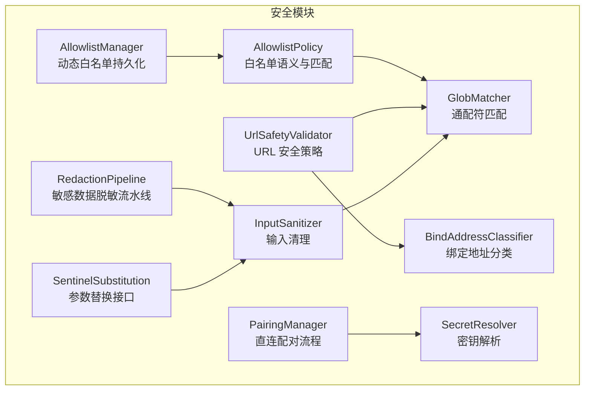
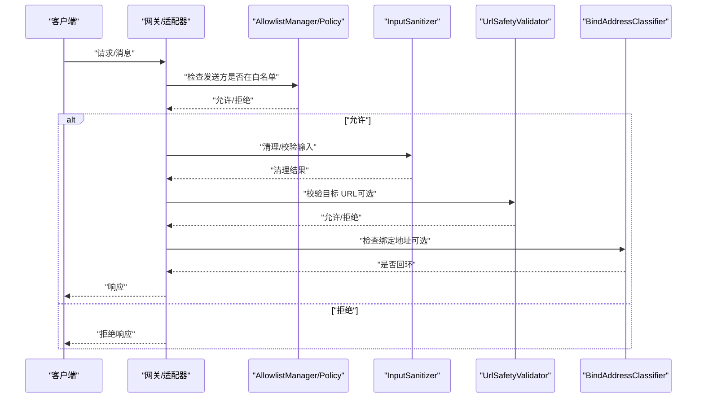
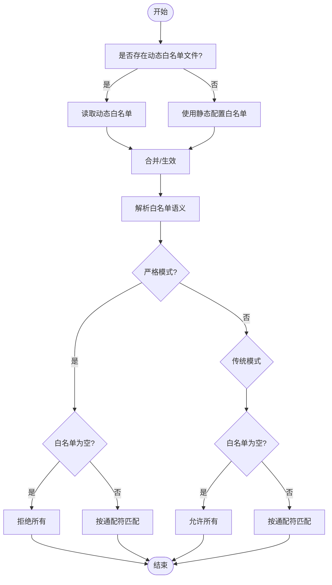
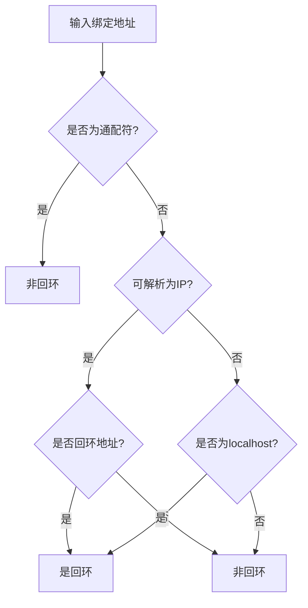
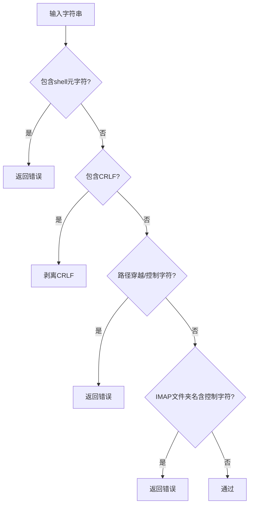
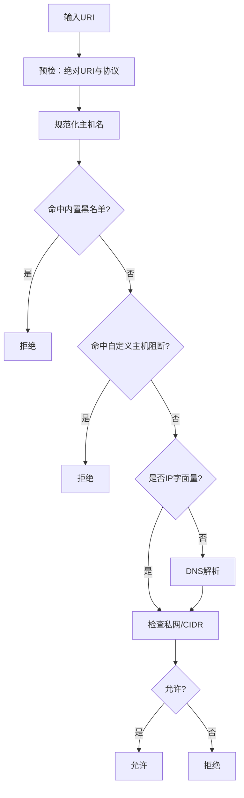
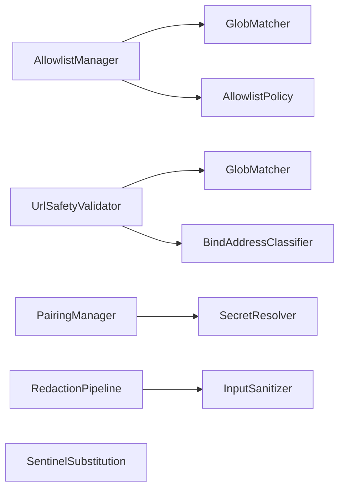

# 访问控制

<cite>
**本文引用的文件**
- [AllowlistManager.cs](file://src/OpenClaw.Core/security/AllowlistManager.cs)
- [AllowlistPolicy.cs](file://src/OpenClaw.Core/security/AllowlistPolicy.cs)
- [BindAddressClassifier.cs](file://src/OpenClaw.Core/security/BindAddressClassifier.cs)
- [InputSanitizer.cs](file://src/OpenClaw.Core/security/InputSanitizer.cs)
- [UrlSafetyValidator.cs](file://src/OpenClaw.Core/security/UrlSafetyValidator.cs)
- [GlobMatcher.cs](file://src/OpenClaw.Core/security/GlobMatcher.cs)
- [PairingManager.cs](file://src/OpenClaw.Core/security/PairingManager.cs)
- [SecretResolver.cs](file://src/OpenClaw.Core/security/SecretResolver.cs)
- [RedactionPipeline.cs](file://src/OpenClaw.Core/security/RedactionPipeline.cs)
- [SentinelSubstitution.cs](file://src/OpenClaw.Core/security/SentinelSubstitution.cs)
- [AllowlistManagerTests.cs](file://src/OpenClaw.Tests/AllowlistManagerTests.cs)
- [AllowlistPolicyTests.cs](file://src/OpenClaw.Tests/AllowlistPolicyTests.cs)
- [BindAddressClassifierTests.cs](file://src/OpenClaw.Tests/BindAddressClassifierTests.cs)
- [UrlSafetyValidatorTests.cs](file://src/OpenClaw.Tests/UrlSafetyValidatorTests.cs)
</cite>

## 目录
1. [简介](#简介)
2. [项目结构](#项目结构)
3. [核心组件](#核心组件)
4. [架构总览](#架构总览)
5. [组件详解](#组件详解)
6. [依赖关系分析](#依赖关系分析)
7. [性能考量](#性能考量)
8. [故障排除指南](#故障排除指南)
9. [结论](#结论)
10. [附录](#附录)

## 简介
本文件面向 OpenClaw.NET 的访问控制系统，系统性阐述以下主题：
- IP 白名单管理：动态与静态白名单合并、持久化、路径安全与并发写入保障
- 绑定地址分类：对本地回环地址的识别与安全建议
- 输入清理：针对命令注入、路径穿越、控制字符等的清洗与校验
- 安全策略实施：URL 安全策略、通配符与 CIDR 匹配、私网目标阻断
- 访问控制策略配置：白名单语义（严格/传统）、URL 安全策略配置项
- 安全策略定义与违规检测：基于通配符匹配与网络地址判定的阻断逻辑
- 最佳实践与定制：策略选择、配置建议、常见问题排查

## 项目结构
访问控制相关代码集中于 OpenClaw.Core 的 Security 命名空间，围绕“白名单”“绑定地址分类”“输入清理”“URL 安全策略”“配对与密钥解析”“敏感信息脱敏与哨兵替换”等模块协同工作。

图表来源
- [AllowlistManager.cs:1-126](file://src/OpenClaw.Core/security/AllowlistManager.cs#L1-L126)
- [AllowlistPolicy.cs:1-43](file://src/OpenClaw.Core/security/AllowlistPolicy.cs#L1-L43)
- [BindAddressClassifier.cs:1-19](file://src/OpenClaw.Core/security/BindAddressClassifier.cs#L1-L19)
- [InputSanitizer.cs:1-84](file://src/OpenClaw.Core/security/InputSanitizer.cs#L1-L84)
- [UrlSafetyValidator.cs:1-219](file://src/OpenClaw.Core/security/UrlSafetyValidator.cs#L1-L219)
- [GlobMatcher.cs:1-89](file://src/OpenClaw.Core/security/GlobMatcher.cs#L1-L89)
- [PairingManager.cs:1-211](file://src/OpenClaw.Core/security/PairingManager.cs#L1-L211)
- [SecretResolver.cs:1-66](file://src/OpenClaw.Core/security/SecretResolver.cs#L1-L66)
- [RedactionPipeline.cs:1-131](file://src/OpenClaw.Core/security/RedactionPipeline.cs#L1-L131)
- [SentinelSubstitution.cs:1-38](file://src/OpenClaw.Core/security/SentinelSubstitution.cs#L1-L38)

章节来源
- [AllowlistManager.cs:1-126](file://src/OpenClaw.Core/security/AllowlistManager.cs#L1-L126)
- [AllowlistPolicy.cs:1-43](file://src/OpenClaw.Core/security/AllowlistPolicy.cs#L1-L43)
- [BindAddressClassifier.cs:1-19](file://src/OpenClaw.Core/security/BindAddressClassifier.cs#L1-L19)
- [InputSanitizer.cs:1-84](file://src/OpenClaw.Core/security/InputSanitizer.cs#L1-L84)
- [UrlSafetyValidator.cs:1-219](file://src/OpenClaw.Core/security/UrlSafetyValidator.cs#L1-L219)
- [GlobMatcher.cs:1-89](file://src/OpenClaw.Core/security/GlobMatcher.cs#L1-L89)
- [PairingManager.cs:1-211](file://src/OpenClaw.Core/security/PairingManager.cs#L1-L211)
- [SecretResolver.cs:1-66](file://src/OpenClaw.Core/security/SecretResolver.cs#L1-L66)
- [RedactionPipeline.cs:1-131](file://src/OpenClaw.Core/security/RedactionPipeline.cs#L1-L131)
- [SentinelSubstitution.cs:1-38](file://src/OpenClaw.Core/security/SentinelSubstitution.cs#L1-L38)

## 核心组件
- 动态白名单管理器：支持按通道持久化白名单，动态覆盖静态配置；提供并发安全的增删改操作与路径安全处理。
- 白名单策略：定义“严格/传统”两种语义，支持通配符匹配与“允许全部”的快速路径。
- 绑定地址分类器：识别本地回环绑定地址，区分 ASP.NET Core 的通配符绑定语义。
- 输入清理器：检测并清洗 shell 元字符、CRLF 注入、路径穿越与控制字符，降低注入风险。
- URL 安全验证器：基于内置黑名单、主机通配符、CIDR 列表与 DNS 解析，阻断私网与不安全目标。
- 通配符匹配器：高性能 Span 匹配实现，支持“允许/拒绝”优先级判定。
- 配对管理器：生成一次性配对码、限制失败尝试与冷却时间，并持久化已批准发送者。
- 密钥解析器：统一解析 env/raw/literal 三种密钥引用，避免明文硬编码。
- 脱敏流水线：对会话历史中的敏感字段进行多阶段脱敏，支持 JSON 深拷贝与就地修改。
- 哨兵替换服务：在工具执行前后对参数进行替换，支持“执行时参数”与“持久化参数”的差异化处理。

章节来源
- [AllowlistManager.cs:1-126](file://src/OpenClaw.Core/security/AllowlistManager.cs#L1-L126)
- [AllowlistPolicy.cs:1-43](file://src/OpenClaw.Core/security/AllowlistPolicy.cs#L1-L43)
- [BindAddressClassifier.cs:1-19](file://src/OpenClaw.Core/security/BindAddressClassifier.cs#L1-L19)
- [InputSanitizer.cs:1-84](file://src/OpenClaw.Core/security/InputSanitizer.cs#L1-L84)
- [UrlSafetyValidator.cs:1-219](file://src/OpenClaw.Core/security/UrlSafetyValidator.cs#L1-L219)
- [GlobMatcher.cs:1-89](file://src/OpenClaw.Core/security/GlobMatcher.cs#L1-L89)
- [PairingManager.cs:1-211](file://src/OpenClaw.Core/security/PairingManager.cs#L1-L211)
- [SecretResolver.cs:1-66](file://src/OpenClaw.Core/security/SecretResolver.cs#L1-L66)
- [RedactionPipeline.cs:1-131](file://src/OpenClaw.Core/security/RedactionPipeline.cs#L1-L131)
- [SentinelSubstitution.cs:1-38](file://src/OpenClaw.Core/security/SentinelSubstitution.cs#L1-L38)

## 架构总览
下图展示访问控制关键流程：白名单合并与匹配、输入清理、URL 安全策略与绑定地址分类共同构成入口控制与运行期防护。

图表来源
- [AllowlistManager.cs:32-51](file://src/OpenClaw.Core/security/AllowlistManager.cs#L32-L51)
- [AllowlistPolicy.cs:18-40](file://src/OpenClaw.Core/security/AllowlistPolicy.cs#L18-L40)
- [InputSanitizer.cs:24-82](file://src/OpenClaw.Core/security/InputSanitizer.cs#L24-L82)
- [UrlSafetyValidator.cs:27-58](file://src/OpenClaw.Core/security/UrlSafetyValidator.cs#L27-L58)
- [BindAddressClassifier.cs:7-17](file://src/OpenClaw.Core/security/BindAddressClassifier.cs#L7-L17)

## 组件详解

### 白名单管理与策略
- 动态白名单优先：若存在动态文件则覆盖静态配置；否则使用静态配置。
- 并发安全：按通道加锁，采用临时文件写入后原子移动，保证一致性。
- 路径安全：对通道 ID 进行字符过滤与前导点清理，防止目录遍历。
- 语义切换：
  - 严格模式：空白名单即拒绝；仅显式允许或通配符“*”才放行。
  - 传统模式：空白名单即允许（兼容历史行为），其余按通配符匹配。

图表来源
- [AllowlistManager.cs:32-51](file://src/OpenClaw.Core/security/AllowlistManager.cs#L32-L51)
- [AllowlistPolicy.cs:11-40](file://src/OpenClaw.Core/security/AllowlistPolicy.cs#L11-L40)
- [GlobMatcher.cs:9-63](file://src/OpenClaw.Core/security/GlobMatcher.cs#L9-L63)

章节来源
- [AllowlistManager.cs:1-126](file://src/OpenClaw.Core/security/AllowlistManager.cs#L1-L126)
- [AllowlistPolicy.cs:1-43](file://src/OpenClaw.Core/security/AllowlistPolicy.cs#L1-L43)
- [GlobMatcher.cs:1-89](file://src/OpenClaw.Core/security/GlobMatcher.cs#L1-L89)
- [AllowlistManagerTests.cs:1-43](file://src/OpenClaw.Tests/AllowlistManagerTests.cs#L1-L43)
- [AllowlistPolicyTests.cs:1-34](file://src/OpenClaw.Tests/AllowlistPolicyTests.cs#L1-L34)

### 绑定地址分类
- 识别本地回环：支持 IPv4/IPv6 回环、localhost 与通配符绑定的区分。
- 关键点：ASP.NET Core 的“*”“+”“[::]”并非回环，不应被误判为本地访问。

图表来源
- [BindAddressClassifier.cs:7-17](file://src/OpenClaw.Core/security/BindAddressClassifier.cs#L7-L17)
- [BindAddressClassifierTests.cs:1-25](file://src/OpenClaw.Tests/BindAddressClassifierTests.cs#L1-L25)

章节来源
- [BindAddressClassifier.cs:1-19](file://src/OpenClaw.Core/security/BindAddressClassifier.cs#L1-L19)
- [BindAddressClassifierTests.cs:1-25](file://src/OpenClaw.Tests/BindAddressClassifierTests.cs#L1-L25)

### 输入清理与验证
- Shell 元字符检测：禁止分号、管道、重定向、反引号、美元、括号、尖括号及换行符。
- CRLF 清洗：剥离回车与换行，防止协议注入。
- 路径穿越与控制字符：禁止“..”、路径分隔符、反斜杠与空字符。
- IMAP 文件夹名：禁止控制字符。

图表来源
- [InputSanitizer.cs:24-82](file://src/OpenClaw.Core/security/InputSanitizer.cs#L24-L82)

章节来源
- [InputSanitizer.cs:1-84](file://src/OpenClaw.Core/security/InputSanitizer.cs#L1-L84)

### URL 安全策略与违规检测
- 默认阻断私网目标：未显式允许时，阻止 localhost、127.x、169.254.x、10.x、172.16–31.x、192.168.x、组播/链路本地/环回/多播等。
- 主机通配符阻断：内置黑名单（如 metadata、localhost 及其泛域名）。
- 自定义阻断：支持主机通配符列表与 CIDR 列表。
- DNS 解析：在需要时解析主机以判断地址类别与 CIDR 匹配。
- 工具集成：浏览器沙箱与 Web 请求工具在执行前进行阻断判定。

图表来源
- [UrlSafetyValidator.cs:27-135](file://src/OpenClaw.Core/security/UrlSafetyValidator.cs#L27-L135)
- [UrlSafetyValidatorTests.cs:1-78](file://src/OpenClaw.Tests/UrlSafetyValidatorTests.cs#L1-L78)

章节来源
- [UrlSafetyValidator.cs:1-219](file://src/OpenClaw.Core/security/UrlSafetyValidator.cs#L1-L219)
- [UrlSafetyValidatorTests.cs:1-78](file://src/OpenClaw.Tests/UrlSafetyValidatorTests.cs#L1-L78)

### 通配符匹配与“允许/拒绝”优先级
- 支持“*”“?”等简单通配符（当前实现以“*”为主）。
- “拒绝优先”：先检查拒绝列表，再检查允许列表；空允许列表默认拒绝。

章节来源
- [GlobMatcher.cs:1-89](file://src/OpenClaw.Core/security/GlobMatcher.cs#L1-L89)

### 配对管理与密钥解析
- 配对码：6 位数字，有效期 10 分钟；失败尝试超过阈值进入 5 分钟冷却。
- 批准持久化：批准的发送者键值对持久化到磁盘，重启后仍有效。
- 密钥解析：支持 env:VAR、raw:value 与裸变量名（优先环境变量，不存在则回退字面量）。

章节来源
- [PairingManager.cs:1-211](file://src/OpenClaw.Core/security/PairingManager.cs#L1-L211)
- [SecretResolver.cs:1-66](file://src/OpenClaw.Core/security/SecretResolver.cs#L1-L66)

### 敏感信息脱敏与参数替换
- 脱敏流水线：对会话历史中的内容、工具调用参数与结果进行多阶段脱敏。
- 基线脱敏器：识别 Authorization Bearer、OpenAI 密钥、API Key 字段并替换。
- 哨兵替换：在工具执行前后对参数进行替换，支持“执行时参数”与“持久化参数”。

章节来源
- [RedactionPipeline.cs:1-131](file://src/OpenClaw.Core/security/RedactionPipeline.cs#L1-L131)
- [SentinelSubstitution.cs:1-38](file://src/OpenClaw.Core/security/SentinelSubstitution.cs#L1-L38)

## 依赖关系分析
- AllowlistManager 依赖 GlobMatcher 进行通配符匹配；与 AllowlistPolicy 协作决定语义。
- UrlSafetyValidator 依赖 GlobMatcher 与 BindAddressClassifier；在工具层（如浏览器与 WebFetch）前置阻断。
- InputSanitizer 作为通用输入清理器被各工具复用。
- PairingManager 与 SecretResolver 共同支撑安全启动与运行期凭据管理。
- RedactionPipeline 与 SentinelSubstitution 提供运行期与持久化的安全输出控制。

图表来源
- [AllowlistManager.cs:1-126](file://src/OpenClaw.Core/security/AllowlistManager.cs#L1-L126)
- [AllowlistPolicy.cs:1-43](file://src/OpenClaw.Core/security/AllowlistPolicy.cs#L1-L43)
- [GlobMatcher.cs:1-89](file://src/OpenClaw.Core/security/GlobMatcher.cs#L1-L89)
- [UrlSafetyValidator.cs:1-219](file://src/OpenClaw.Core/security/UrlSafetyValidator.cs#L1-L219)
- [BindAddressClassifier.cs:1-19](file://src/OpenClaw.Core/security/BindAddressClassifier.cs#L1-L19)
- [InputSanitizer.cs:1-84](file://src/OpenClaw.Core/security/InputSanitizer.cs#L1-L84)
- [PairingManager.cs:1-211](file://src/OpenClaw.Core/security/PairingManager.cs#L1-L211)
- [SecretResolver.cs:1-66](file://src/OpenClaw.Core/security/SecretResolver.cs#L1-L66)
- [RedactionPipeline.cs:1-131](file://src/OpenClaw.Core/security/RedactionPipeline.cs#L1-L131)
- [SentinelSubstitution.cs:1-38](file://src/OpenClaw.Core/security/SentinelSubstitution.cs#L1-L38)

## 性能考量
- 通配符匹配采用 Span 实现，避免中间数组分配，适合高频调用场景。
- 白名单与配对列表的文件写入采用临时文件+原子移动，减少部分写入失败的风险。
- URL 安全策略在不需要时可关闭 DNS 解析，降低网络开销。
- 输入清理使用 SIMD 友好的搜索值，提升字符扫描效率。

## 故障排除指南
- 白名单未生效
  - 检查动态文件是否存在且可读；确认动态文件优先级高于静态配置。
  - 确认通道 ID 是否被安全处理（移除非法字符与前导点）。
  - 参考测试用例路径：[AllowlistManagerTests.cs:1-43](file://src/OpenClaw.Tests/AllowlistManagerTests.cs#L1-L43)
- 白名单语义不符合预期
  - 明确选择“严格/传统”语义；严格模式下空白名单即拒绝。
  - 参考测试用例路径：[AllowlistPolicyTests.cs:1-34](file://src/OpenClaw.Tests/AllowlistPolicyTests.cs#L1-L34)
- 绑定地址误判
  - 确认 ASP.NET Core 通配符绑定（*、+、[::]）不会被误判为回环。
  - 参考测试用例路径：[BindAddressClassifierTests.cs:1-25](file://src/OpenClaw.Tests/BindAddressClassifierTests.cs#L1-L25)
- 输入被拒绝
  - 检查是否包含 shell 元字符、CRLF、路径穿越或控制字符。
  - 参考实现路径：[InputSanitizer.cs:24-82](file://src/OpenClaw.Core/security/InputSanitizer.cs#L24-L82)
- URL 被阻断
  - 检查是否命中内置黑名单、自定义主机阻断或 CIDR 列表。
  - 若需访问私网，请在配置中启用相应选项并确保 DNS 解析可用。
  - 参考测试用例路径：[UrlSafetyValidatorTests.cs:1-78](file://src/OpenClaw.Tests/UrlSafetyValidatorTests.cs#L1-L78)
- 配对失败
  - 检查配对码是否过期、失败次数是否超限、冷却时间是否生效。
  - 参考实现路径：[PairingManager.cs:53-124](file://src/OpenClaw.Core/security/PairingManager.cs#L53-L124)
- 密钥解析异常
  - 使用 env: 或 raw: 前缀明确解析方式；避免裸变量名在环境变量缺失时回退为字面量。
  - 参考实现路径：[SecretResolver.cs:24-54](file://src/OpenClaw.Core/security/SecretResolver.cs#L24-L54)

章节来源
- [AllowlistManagerTests.cs:1-43](file://src/OpenClaw.Tests/AllowlistManagerTests.cs#L1-L43)
- [AllowlistPolicyTests.cs:1-34](file://src/OpenClaw.Tests/AllowlistPolicyTests.cs#L1-L34)
- [BindAddressClassifierTests.cs:1-25](file://src/OpenClaw.Tests/BindAddressClassifierTests.cs#L1-L25)
- [UrlSafetyValidatorTests.cs:1-78](file://src/OpenClaw.Tests/UrlSafetyValidatorTests.cs#L1-L78)
- [PairingManager.cs:53-124](file://src/OpenClaw.Core/security/PairingManager.cs#L53-L124)
- [SecretResolver.cs:24-54](file://src/OpenClaw.Core/security/SecretResolver.cs#L24-L54)

## 结论
OpenClaw.NET 的访问控制体系通过“动态白名单优先、严格语义可选、输入清理与 URL 安全策略、绑定地址分类、配对与密钥解析、敏感数据脱敏与参数替换”等多层防御，形成从入口到运行期的纵深安全防线。建议在生产环境中：
- 默认启用严格白名单语义与私网阻断策略；
- 对输入进行强制清理与校验；
- 明确绑定地址分类，避免误判；
- 使用 env: 前缀解析密钥，禁用 raw: 明文；
- 在工具层前置 URL 安全策略与输入清理；
- 定期审计配对列表与白名单变更。

## 附录
- 配置要点
  - 白名单语义：strict 或 legacy
  - URL 安全策略：启用、阻断私网目标、主机阻断列表、CIDR 列表
  - 绑定地址：区分通配符与回环
- 最佳实践
  - 优先使用动态白名单并定期轮换
  - 对所有外部输入执行清理与校验
  - 限制配对码有效期与失败尝试
  - 采用最小权限原则与最小暴露面