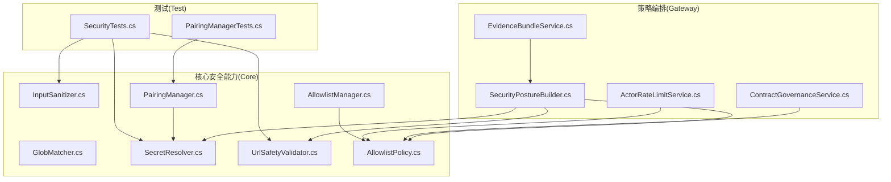
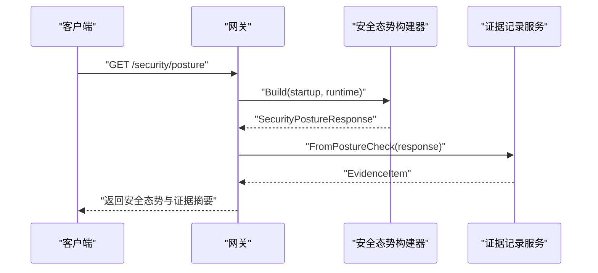
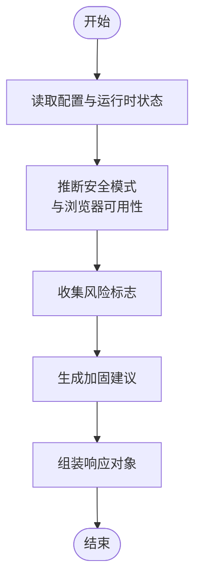
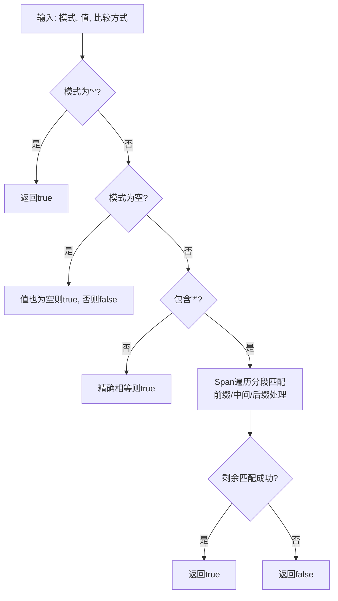
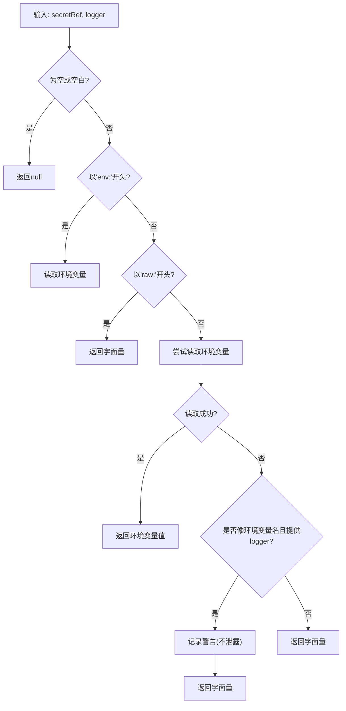
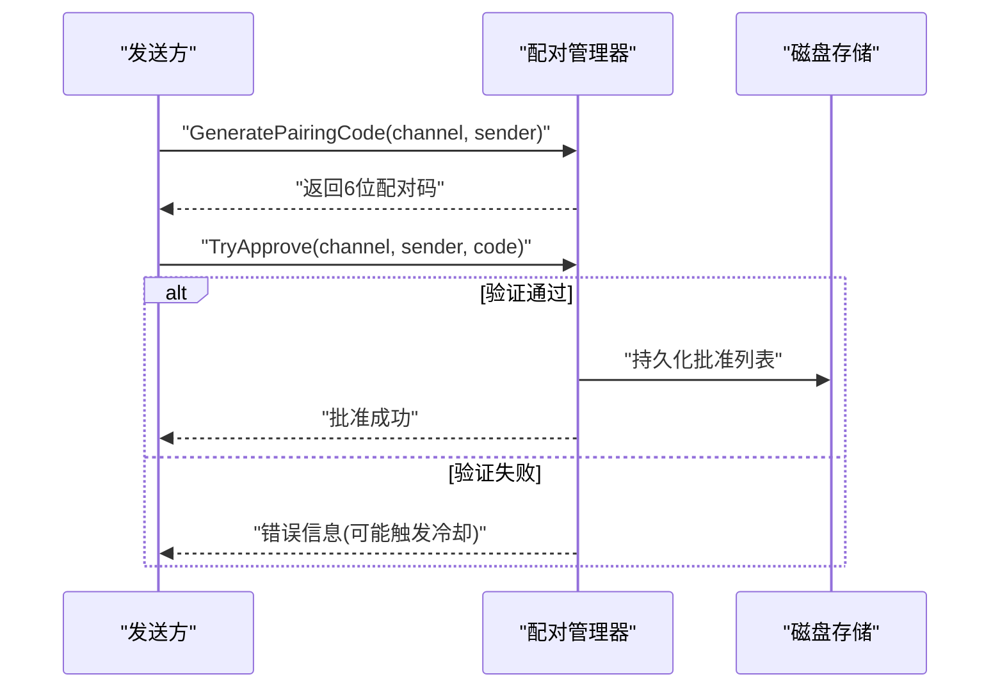
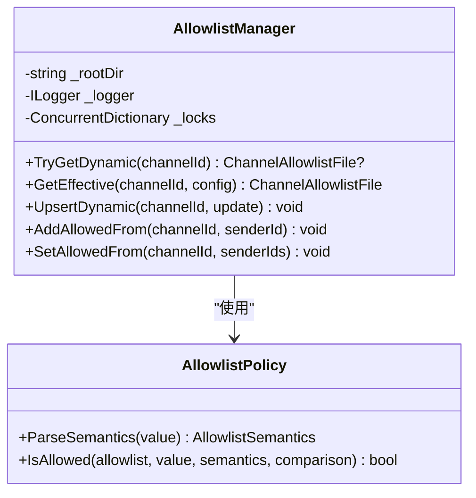
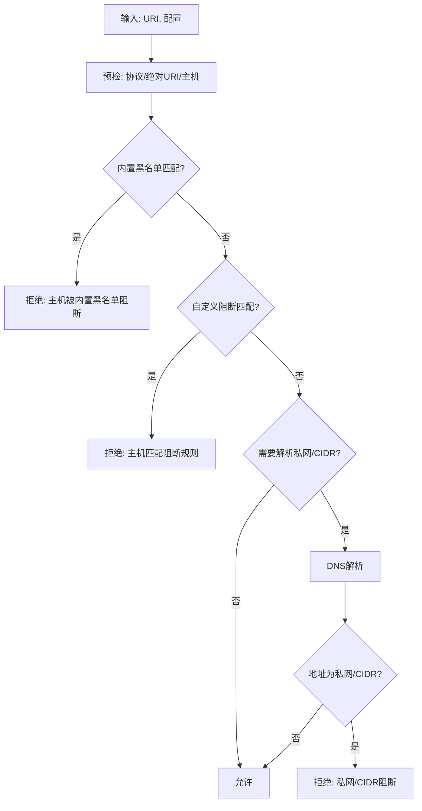
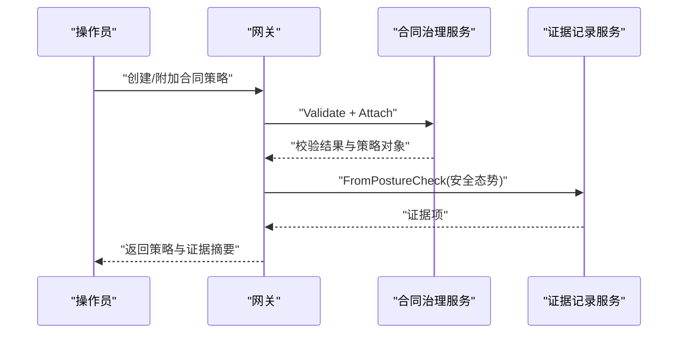
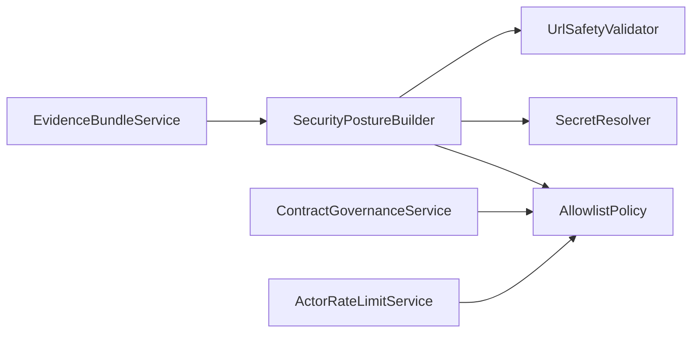

# 安全策略

<cite>
**本文引用的文件**
- [SecurityPostureBuilder.cs](file://src/OpenClaw.Gateway/SecurityPostureBuilder.cs)
- [GlobMatcher.cs](file://src/OpenClaw.Core/Security/GlobMatcher.cs)
- [SecretResolver.cs](file://src/OpenClaw.Core/Security/SecretResolver.cs)
- [PairingManager.cs](file://src/OpenClaw.Core/Security/PairingManager.cs)
- [AllowlistManager.cs](file://src/OpenClaw.Core/Security/AllowlistManager.cs)
- [AllowlistPolicy.cs](file://src/OpenClaw.Core/Security/AllowlistPolicy.cs)
- [InputSanitizer.cs](file://src/OpenClaw.Core/Security/InputSanitizer.cs)
- [UrlSafetyValidator.cs](file://src/OpenClaw.Core/Security/UrlSafetyValidator.cs)
- [SecurityTests.cs](file://src/OpenClaw.Tests/SecurityTests.cs)
- [PairingManagerTests.cs](file://src/OpenClaw.Tests/PairingManagerTests.cs)
- [EvidenceBundleService.cs](file://src/OpenClaw.Gateway/EvidenceBundleService.cs)
- [ContractGovernanceService.cs](file://src/OpenClaw.Gateway/ContractGovernanceService.cs)
- [ContractModels.cs](file://src/OpenClaw.Core/Models/ContractModels.cs)
- [ActorRateLimitService.cs](file://src/OpenClaw.Gateway/ActorRateLimitService.cs)
- [OpenClawHttpClient.cs](file://src/OpenClaw.Cli/OpenClawHttpClient.cs)
- [OperatorApiModels.cs](file://src/OpenClaw.Core/Models/OperatorApiModels.cs)
</cite>

## 目录
1. [引言](#引言)
2. [项目结构](#项目结构)
3. [核心组件](#核心组件)
4. [架构总览](#架构总览)
5. [详细组件分析](#详细组件分析)
6. [依赖关系分析](#依赖关系分析)
7. [性能考量](#性能考量)
8. [故障排除指南](#故障排除指南)
9. [结论](#结论)
10. [附录](#附录)

## 引言
本技术文档聚焦于安全策略模块，系统性阐述以下关键能力与机制：
- 安全态势构建器：基于运行时配置与环境状态生成安全态势报告，识别风险与给出加固建议。
- 通配符匹配器：支持“*”通配的高性能字符串匹配与允许/拒绝判定。
- 密钥解析器：统一解析密钥引用（env:、raw:、裸字符串），保障密钥注入的安全性与可审计性。
- 配对管理器：实现设备直连消息通道的临时配对码生成、校验与持久化批准列表，支持固定时间比较与失败冷却。
- 允许白名单管理：支持按通道维度的动态白名单读写、合并生效与并发安全持久化。
- 输入净化与URL安全校验：防御注入攻击与私网访问风险，确保工具输入与网络请求安全。
- 策略配置、动态更新与优先级：策略来源与生效顺序、动态策略更新流程与并发控制。
- 策略与业务集成：与会话治理、审批流、速率限制等业务组件协同。
- 策略执行评估与调整：通过证据记录、风险标志与推荐项进行闭环评估与持续优化。

## 项目结构
安全策略相关代码主要分布在以下位置：
- 核心安全能力：OpenClaw.Core/Security（通配符匹配、密钥解析、输入净化、URL安全校验、允许白名单、配对管理）
- 策略编排与呈现：OpenClaw.Gateway（安全态势构建器、证据记录服务、合同治理服务、速率限制服务）
- 测试用例：OpenClaw.Tests（覆盖安全策略关键行为）

图表来源
- [SecurityPostureBuilder.cs:11-139](file://src/OpenClaw.Gateway/SecurityPostureBuilder.cs#L11-L139)
- [GlobMatcher.cs:9-86](file://src/OpenClaw.Core/Security/GlobMatcher.cs#L9-L86)
- [SecretResolver.cs:24-61](file://src/OpenClaw.Core/Security/SecretResolver.cs#L24-L61)
- [InputSanitizer.cs:24-82](file://src/OpenClaw.Core/Security/InputSanitizer.cs#L24-L82)
- [UrlSafetyValidator.cs:27-135](file://src/OpenClaw.Core/Security/UrlSafetyValidator.cs#L27-L135)
- [AllowlistManager.cs:32-84](file://src/OpenClaw.Core/Security/AllowlistManager.cs#L32-L84)
- [AllowlistPolicy.cs:18-40](file://src/OpenClaw.Core/Security/AllowlistPolicy.cs#L18-L40)
- [PairingManager.cs:53-124](file://src/OpenClaw.Core/Security/ParingManager.cs#L53-L124)
- [EvidenceBundleService.cs:226-247](file://src/OpenClaw.Gateway/EvidenceBundleService.cs#L226-L247)
- [ContractGovernanceService.cs:97-132](file://src/OpenClaw.Gateway/ContractGovernanceService.cs#L97-L132)
- [ActorRateLimitService.cs:92-103](file://src/OpenClaw.Gateway/ActorRateLimitService.cs#L92-L103)

章节来源
- [SecurityPostureBuilder.cs:11-139](file://src/OpenClaw.Gateway/SecurityPostureBuilder.cs#L11-L139)
- [GlobMatcher.cs:9-86](file://src/OpenClaw.Core/Security/GlobMatcher.cs#L9-L86)
- [SecretResolver.cs:24-61](file://src/OpenClaw.Core/Security/SecretResolver.cs#L24-L61)
- [PairingManager.cs:32-124](file://src/OpenClaw.Core/Security/PairingManager.cs#L32-L124)
- [AllowlistManager.cs:32-84](file://src/OpenClaw.Core/Security/AllowlistManager.cs#L32-L84)
- [AllowlistPolicy.cs:18-40](file://src/OpenClaw.Core/Security/AllowlistPolicy.cs#L18-L40)
- [InputSanitizer.cs:24-82](file://src/OpenClaw.Core/Security/InputSanitizer.cs#L24-L82)
- [UrlSafetyValidator.cs:27-135](file://src/OpenClaw.Core/Security/UrlSafetyValidator.cs#L27-L135)

## 核心组件
- 安全态势构建器：根据启动上下文与运行时状态，综合认证令牌、浏览器会话、插件桥接、沙箱、工具审批、Webhook签名等配置，输出风险标志与加固建议。
- 通配符匹配器：提供前缀/中间/后缀匹配与“*”通配的高性能实现，并支持允许/拒绝判定（拒绝优先）。
- 密钥解析器：统一解析密钥引用，支持env:、raw:与裸字符串回退，提供原始引用检测以辅助硬化工单。
- 配对管理器：生成一次性配对码、固定时间比较、失败次数与冷却控制、批准列表持久化与加载。
- 允许白名单管理：按通道维度的动态白名单读取/写入、合并生效、并发锁与原子落盘。
- 输入净化器：检测Shell元字符、剥离CRLF、校验内存键与IMAP文件夹名，降低注入风险。
- URL安全校验器：校验协议、主机、CIDR与私网地址，支持内置黑名单与自定义阻断规则。

章节来源
- [SecurityPostureBuilder.cs:11-139](file://src/OpenClaw.Gateway/SecurityPostureBuilder.cs#L11-L139)
- [GlobMatcher.cs:9-86](file://src/OpenClaw.Core/Security/GlobMatcher.cs#L9-L86)
- [SecretResolver.cs:24-61](file://src/OpenClaw.Core/Security/SecretResolver.cs#L24-L61)
- [PairingManager.cs:32-124](file://src/OpenClaw.Core/Security/PairingManager.cs#L32-L124)
- [AllowlistManager.cs:32-84](file://src/OpenClaw.Core/Security/AllowlistManager.cs#L32-L84)
- [AllowlistPolicy.cs:18-40](file://src/OpenClaw.Core/Security/AllowlistPolicy.cs#L18-L40)
- [InputSanitizer.cs:24-82](file://src/OpenClaw.Core/Security/InputSanitizer.cs#L24-L82)
- [UrlSafetyValidator.cs:27-135](file://src/OpenClaw.Core/Security/UrlSafetyValidator.cs#L27-L135)

## 架构总览
安全策略在系统中的作用是“策略编排 + 安全能力 + 证据记录 + 业务集成”的闭环：
- 策略编排：安全态势构建器汇总配置与运行时信息，形成风险与建议；证据记录服务将结果转化为可审计证据。
- 安全能力：通配符匹配、密钥解析、输入净化、URL校验、白名单与配对管理作为基础能力被上层策略调用。
- 业务集成：合同治理服务、速率限制服务、工具审批服务等消费策略与能力，实现端到端安全控制。

图表来源
- [OpenClawHttpClient.cs:53-55](file://src/OpenClaw.Cli/OpenClawHttpClient.cs#L53-L55)
- [SecurityPostureBuilder.cs:11-139](file://src/OpenClaw.Gateway/SecurityPostureBuilder.cs#L11-L139)
- [EvidenceBundleService.cs:226-247](file://src/OpenClaw.Gateway/EvidenceBundleService.cs#L226-L247)

## 详细组件分析

### 安全态势构建器
- 功能要点
  - 基于启动上下文判断是否公网绑定、插件桥接、传输模式、浏览器工具可用性与沙箱配置。
  - 综合认证令牌、请求者匹配、浏览器Cookie Secure、Webhook签名、本地工具执行安全性等维度，生成风险标志与加固建议。
  - 对密钥引用进行原始引用检测，避免公网部署暴露明文密钥。
- 关键路径
  - 配置归一化与安全模式推断
  - 风险标志与建议收集
  - 返回结构化响应对象

图表来源
- [SecurityPostureBuilder.cs:11-139](file://src/OpenClaw.Gateway/SecurityPostureBuilder.cs#L11-L139)

章节来源
- [SecurityPostureBuilder.cs:11-139](file://src/OpenClaw.Gateway/SecurityPostureBuilder.cs#L11-L139)

### 通配符匹配器
- 功能要点
  - 支持“*”通配的高性能匹配，避免Split分配，使用Span遍历。
  - 提供允许/拒绝判定：拒绝优先、空允许列表默认拒绝。
- 复杂度
  - 匹配算法近似O(n+m)，其中n、m为模式与值长度；拒绝优先的判定为O(k)（k为deny/allow条目数）。

图表来源
- [GlobMatcher.cs:9-86](file://src/OpenClaw.Core/Security/GlobMatcher.cs#L9-L86)

章节来源
- [GlobMatcher.cs:9-86](file://src/OpenClaw.Core/Security/GlobMatcher.cs#L9-L86)

### 密钥解析器
- 功能要点
  - 支持env:VAR_NAME、raw:literal与裸字符串（回退到字面量）三种引用格式。
  - 提供原始引用检测，用于硬化工单检查。
  - 当裸字符串像环境变量名且未设置时，记录警告但不泄露敏感信息。
- 使用场景
  - 网关与工具共享同一解析实现，保证密钥注入一致性与可审计性。

图表来源
- [SecretResolver.cs:24-61](file://src/OpenClaw.Core/Security/SecretResolver.cs#L24-L61)

章节来源
- [SecretResolver.cs:24-61](file://src/OpenClaw.Core/Security/SecretResolver.cs#L24-L61)

### 配对管理器
- 功能要点
  - 生成6位配对码并带过期时间；失败尝试次数过多进入冷却。
  - 固定时间比较防止时序攻击；批准后持久化到磁盘。
  - 支持管理员手动批准与撤销。
- 并发与持久化
  - 内部使用并发字典存储待批准项；批准列表以原子写入方式落盘，失败清理临时文件。

图表来源
- [PairingManager.cs:53-124](file://src/OpenClaw.Core/Security/PairingManager.cs#L53-L124)
- [PairingManager.cs:185-209](file://src/OpenClaw.Core/Security/PairingManager.cs#L185-L209)

章节来源
- [PairingManager.cs:32-124](file://src/OpenClaw.Core/Security/PairingManager.cs#L32-L124)
- [PairingManager.cs:165-209](file://src/OpenClaw.Core/Security/PairingManager.cs#L165-L209)
- [PairingManagerTests.cs:9-59](file://src/OpenClaw.Tests/PairingManagerTests.cs#L9-L59)

### 允许白名单管理与策略
- 允许白名单管理
  - 按通道维度动态读取/写入白名单文件，合并“动态优先于静态”。
  - 并发锁保护写入，原子落盘，失败清理临时文件。
- 允许白名单策略
  - 支持Legacy与Strict两种语义：空列表在Legacy下视为允许，在Strict下视为拒绝。
  - 通配符匹配支持“*”与glob模式。

图表来源
- [AllowlistManager.cs:32-84](file://src/OpenClaw.Core/Security/AllowlistManager.cs#L32-L84)
- [AllowlistPolicy.cs:18-40](file://src/OpenClaw.Core/Security/AllowlistPolicy.cs#L18-L40)

章节来源
- [AllowlistManager.cs:32-84](file://src/OpenClaw.Core/Security/AllowlistManager.cs#L32-L84)
- [AllowlistPolicy.cs:18-40](file://src/OpenClaw.Core/Security/AllowlistPolicy.cs#L18-L40)

### 输入净化与URL安全校验
- 输入净化器
  - 检测Shell元字符、剥离CRLF、校验内存键与IMAP文件夹名，降低注入风险。
- URL安全校验器
  - 校验协议、主机、CIDR与私网地址，支持内置黑名单与自定义阻断规则；DNS解析失败与无地址返回明确拒绝原因。

图表来源
- [UrlSafetyValidator.cs:27-135](file://src/OpenClaw.Core/Security/UrlSafetyValidator.cs#L27-L135)
- [InputSanitizer.cs:24-82](file://src/OpenClaw.Core/Security/InputSanitizer.cs#L24-L82)

章节来源
- [InputSanitizer.cs:24-82](file://src/OpenClaw.Core/Security/InputSanitizer.cs#L24-L82)
- [UrlSafetyValidator.cs:27-135](file://src/OpenClaw.Core/Security/UrlSafetyValidator.cs#L27-L135)

### 策略配置、动态更新与优先级
- 策略来源与优先级
  - 动态白名单优先于静态配置；严格语义下空白名单即拒绝；Legacy语义下空白名单即允许。
- 动态更新流程
  - 读取当前动态文件 -> 应用更新函数 -> 原子写入临时文件 -> 原子替换目标文件。
- 并发控制
  - 每个通道独立锁，避免并发写冲突。

章节来源
- [AllowlistManager.cs:53-84](file://src/OpenClaw.Core/Security/AllowlistManager.cs#L53-L84)
- [AllowlistPolicy.cs:18-40](file://src/OpenClaw.Core/Security/AllowlistPolicy.cs#L18-L40)

### 策略与业务集成、执行评估与调整
- 与会话治理与审批
  - 合同治理服务对预算、令牌调用次数、运行时长与能力范围进行校验，结合白名单策略与工具注册状态。
- 速率限制
  - 基于Actor类型、端点作用域与匹配值进行策略匹配与消耗。
- 证据记录与评估
  - 将安全态势转换为证据项，包含风险标志、建议与元数据，便于审计与可视化。

图表来源
- [ContractGovernanceService.cs:97-132](file://src/OpenClaw.Gateway/ContractGovernanceService.cs#L97-L132)
- [EvidenceBundleService.cs:226-247](file://src/OpenClaw.Gateway/EvidenceBundleService.cs#L226-L247)
- [OperatorApiModels.cs:738-754](file://src/OpenClaw.Core/Models/OperatorApiModels.cs#L738-L754)

章节来源
- [ContractGovernanceService.cs:97-132](file://src/OpenClaw.Gateway/ContractGovernanceService.cs#L97-L132)
- [EvidenceBundleService.cs:226-247](file://src/OpenClaw.Gateway/EvidenceBundleService.cs#L226-L247)
- [OperatorApiModels.cs:738-754](file://src/OpenClaw.Core/Models/OperatorApiModels.cs#L738-L754)

## 依赖关系分析
- 安全态势构建器依赖密钥解析器、允许白名单策略与URL安全校验器，用于识别原始密钥引用、Webhook签名准备与私网访问风险。
- 证据记录服务依赖安全态势构建器输出，将其转化为可审计证据。
- 合同治理服务依赖允许白名单策略与工具注册集合，进行预算与能力范围校验。
- 速率限制服务依赖允许白名单策略与端点作用域匹配，实现细粒度限流。

图表来源
- [SecurityPostureBuilder.cs:11-139](file://src/OpenClaw.Gateway/SecurityPostureBuilder.cs#L11-L139)
- [EvidenceBundleService.cs:226-247](file://src/OpenClaw.Gateway/EvidenceBundleService.cs#L226-L247)
- [ContractGovernanceService.cs:97-132](file://src/OpenClaw.Gateway/ContractGovernanceService.cs#L97-L132)
- [ActorRateLimitService.cs:92-103](file://src/OpenClaw.Gateway/ActorRateLimitService.cs#L92-L103)

章节来源
- [SecurityPostureBuilder.cs:11-139](file://src/OpenClaw.Gateway/SecurityPostureBuilder.cs#L11-L139)
- [EvidenceBundleService.cs:226-247](file://src/OpenClaw.Gateway/EvidenceBundleService.cs#L226-L247)
- [ContractGovernanceService.cs:97-132](file://src/OpenClaw.Gateway/ContractGovernanceService.cs#L97-L132)
- [ActorRateLimitService.cs:92-103](file://src/OpenClaw.Gateway/ActorRateLimitService.cs#L92-L103)

## 性能考量
- 通配符匹配采用Span遍历，避免字符串分割分配，适合高频匹配场景。
- 密钥解析器对裸字符串的环境变量名检测仅在提供日志器时发出警告，避免泄露。
- 白名单动态更新使用原子写入与并发锁，减少IO争用与数据损坏风险。
- URL安全校验在启用DNS解析时进行异步解析，失败快速返回，避免阻塞。

## 故障排除指南
- 配对码无效或频繁失败
  - 检查是否超过最大失败次数导致冷却；确认配对码是否过期；核对通道与发送方标识一致。
- 原始密钥引用导致公网部署风险
  - 使用env:前缀替代raw:；在安全态势中查看“原始密钥引用”风险标志并按建议替换。
- 工具执行被拒绝
  - 检查工具审批要求与白名单策略；确认端点作用域与匹配值；核对速率限制策略。
- Webhook签名未就绪
  - 在公网绑定场景下启用对应平台的签名验证；检查安全态势中的签名验证就绪状态。
- 证据记录异常
  - 查看证据项元数据中的风险标志与建议，定位具体问题并执行加固。

章节来源
- [PairingManager.cs:73-124](file://src/OpenClaw.Core/Security/PairingManager.cs#L73-L124)
- [SecurityPostureBuilder.cs:141-164](file://src/OpenClaw.Gateway/SecurityPostureBuilder.cs#L141-L164)
- [ActorRateLimitService.cs:92-103](file://src/OpenClaw.Gateway/ActorRateLimitService.cs#L92-L103)
- [EvidenceBundleService.cs:226-247](file://src/OpenClaw.Gateway/EvidenceBundleService.cs#L226-L247)

## 结论
安全策略模块通过“安全态势构建器 + 基础安全能力 + 证据记录 + 业务集成”的架构，实现了从配置与运行时状态到风险识别、策略执行与闭环评估的完整链路。通配符匹配、密钥解析、输入净化与URL校验等能力为上层策略提供了坚实基础；动态白名单与配对管理增强了灵活性与可运维性；证据记录与合同治理服务将策略执行可视化与可审计化。建议在公网部署前完成密钥引用硬化工单、启用Webhook签名验证与沙箱隔离，并定期审查证据记录与风险标志，持续优化策略优先级与执行效果。

## 附录
- 安全策略模板与最佳实践
  - 模板：基于通道维度的动态白名单模板、工具审批模板、速率限制模板、Webhook签名模板。
  - 最佳实践：最小权限原则、拒绝优先、严格语义、密钥引用env:化、沙箱隔离、证据留存与可视化。
- 策略验证与审计
  - 使用测试用例覆盖密钥解析、输入净化、URL校验与配对流程；通过证据记录服务生成审计证据；结合合同治理服务进行预算与能力范围校验。
- 策略调整机制
  - 动态白名单原子更新、并发锁保护；安全态势构建器按配置与运行时状态自动评估风险并给出建议；证据记录服务支持证据聚合与导出。

章节来源
- [SecurityTests.cs:11-318](file://src/OpenClaw.Tests/SecurityTests.cs#L11-L318)
- [PairingManagerTests.cs:9-59](file://src/OpenClaw.Tests/PairingManagerTests.cs#L9-L59)
- [ContractModels.cs:12-35](file://src/OpenClaw.Core/Models/ContractModels.cs#L12-L35)
- [EvidenceBundleService.cs:226-247](file://src/OpenClaw.Gateway/EvidenceBundleService.cs#L226-L247)