# 工具安全

<cite>
**本文引用的文件**
- [ToolPathPolicy.cs](file://src/OpenClaw.Core/Security/ToolPathPolicy.cs)
- [BrowserToolCapabilityEvaluator.cs](file://src/OpenClaw.Core/Security/BrowserToolCapabilityEvaluator.cs)
- [SentinelSubstitution.cs](file://src/OpenClaw.Core/Security/SentinelSubstitution.cs)
- [InputSanitizer.cs](file://src/OpenClaw.Core/Security/InputSanitizer.cs)
- [RedactionPipeline.cs](file://src/OpenClaw.Core/Security/RedactionPipeline.cs)
- [AllowlistManager.cs](file://src/OpenClaw.Core/Security/AllowlistManager.cs)
- [AllowlistPolicy.cs](file://src/OpenClaw.Core/Security/AllowlistPolicy.cs)
- [UrlSafetyValidator.cs](file://src/OpenClaw.Core/Security/UrlSafetyValidator.cs)
- [GlobMatcher.cs](file://src/OpenClaw.Core/Security/GlobMatcher.cs)
- [PairingManager.cs](file://src/OpenClaw.Core/Security/PairingManager.cs)
- [IToolSandbox.cs](file://src/OpenClaw.Core/Abstractions/IToolSandbox.cs)
- [SandboxModels.cs](file://src/OpenClaw.Core/Models/SandboxModels.cs)
- [ToolExecutionRouter.cs](file://src/OpenClaw.Agent/Execution/ToolExecutionRouter.cs)
- [OpenSandboxExecutionBackend.cs](file://src/OpenClaw.Agent/Execution/OpenSandboxExecutionBackend.cs)
- [OpenClawToolExecutor.cs](file://src/OpenClaw.Agent/OpenClawToolExecutor.cs)
- [SecurityPostureBuilder.cs](file://src/OpenClaw.Gateway/SecurityPostureBuilder.cs)
- [ToolGovernanceDescriptorCatalog.cs](file://src/OpenClaw.Core/Governance/ToolGovernanceDescriptorCatalog.cs)
- [ToolGovernanceModels.cs](file://src/OpenClaw.Core/Models/ToolGovernanceModels.cs)
- [OpenSandboxToolSandbox.cs](file://src/OpenClawNet.Sandbox.OpenSandbox/OpenSandboxToolSandbox.cs)
</cite>

## 目录
1. [引言](#引言)
2. [项目结构](#项目结构)
3. [核心组件](#核心组件)
4. [架构总览](#架构总览)
5. [详细组件分析](#详细组件分析)
6. [依赖关系分析](#依赖关系分析)
7. [性能考量](#性能考量)
8. [故障排查指南](#故障排查指南)
9. [结论](#结论)
10. [附录](#附录)

## 引言
本技术文档聚焦于工具安全模块，系统化阐述以下关键主题：
- 工具路径策略：当前仓库中存在已注释的路径策略骨架，可扩展为文件系统访问白名单/黑名单策略。
- 浏览器工具能力评估：基于网关配置与运行时状态，评估浏览器工具是否可用及可用方式（本地或后端）。
- 敏感数据哨兵替换机制：定义上下文与结果结构，支持在执行前后对参数进行替换与持久化。
- 工具执行沙箱、资源限制与权限控制：通过路由解析、OpenSandbox 后端与超时控制实现强隔离与可控执行。
- 输入输出数据净化、敏感信息脱敏与隐私保护：输入净化与输出脱敏管线协同，保障注入防护与隐私合规。
- 工具调用链路监控、执行结果验证与异常行为检测：结合审计日志、治理决策与超时/失败回退。
- 安全配置、策略定制与动态权限管理：允许列表、配对流程、URL 安全策略与治理描述符。
- 审计、合规与风险评估：安全态势构建器汇总风险与建议，指导部署加固。

## 项目结构
工具安全相关代码主要分布在以下区域：
- 核心安全能力：OpenClaw.Core/Security 下的各类策略与工具（路径策略骨架、浏览器能力评估、哨兵替换、输入净化、脱敏管线、允许列表、URL 安全、通配匹配、配对管理等）。
- 执行与沙箱：OpenClaw.Agent 的执行路由器与 OpenSandbox 执行后端；OpenClaw.Core.Abstractions 的沙箱接口；OpenClaw.Core.Models 的沙箱模型。
- 网关安全态势：OpenClaw.Gateway 的安全态势构建器。
- 治理与策略：OpenClaw.Core/Governance 的工具治理描述符目录与模型。
- OpenSandbox 实现：OpenClawNet.Sandbox.OpenSandbox 的具体沙箱实现。

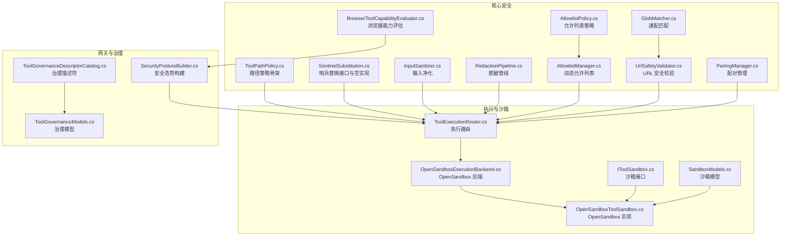

**图表来源**
- [ToolPathPolicy.cs:1-136](file://src/OpenClaw.Core/Security/ToolPathPolicy.cs#L1-L136)
- [BrowserToolCapabilityEvaluator.cs:1-61](file://src/OpenClaw.Core/Security/BrowserToolCapabilityEvaluator.cs#L1-L61)
- [SentinelSubstitution.cs:1-38](file://src/OpenClaw.Core/Security/SentinelSubstitution.cs#L1-L38)
- [InputSanitizer.cs:1-84](file://src/OpenClaw.Core/Security/InputSanitizer.cs#L1-L84)
- [RedactionPipeline.cs:1-131](file://src/OpenClaw.Core/Security/RedactionPipeline.cs#L1-L131)
- [AllowlistManager.cs:1-126](file://src/OpenClaw.Core/Security/AllowlistManager.cs#L1-L126)
- [AllowlistPolicy.cs:1-43](file://src/OpenClaw.Core/Security/AllowlistPolicy.cs#L1-L43)
- [UrlSafetyValidator.cs:1-219](file://src/OpenClaw.Core/Security/UrlSafetyValidator.cs#L1-L219)
- [GlobMatcher.cs:1-89](file://src/OpenClaw.Core/Security/GlobMatcher.cs#L1-L89)
- [PairingManager.cs:1-211](file://src/OpenClaw.Core/Security/PairingManager.cs#L1-L211)
- [ToolExecutionRouter.cs:1-253](file://src/OpenClaw.Agent/Execution/ToolExecutionRouter.cs#L1-L253)
- [OpenSandboxExecutionBackend.cs:1-69](file://src/OpenClaw.Agent/Execution/OpenSandboxExecutionBackend.cs#L1-L69)
- [IToolSandbox.cs:1-12](file://src/OpenClaw.Core/Abstractions/IToolSandbox.cs#L1-L12)
- [SandboxModels.cs:1-28](file://src/OpenClaw.Core/Models/SandboxModels.cs#L1-L28)
- [OpenSandboxToolSandbox.cs](file://src/OpenClawNet.Sandbox.OpenSandbox/OpenSandboxToolSandbox.cs)
- [SecurityPostureBuilder.cs:1-169](file://src/OpenClaw.Gateway/SecurityPostureBuilder.cs#L1-L169)
- [ToolGovernanceDescriptorCatalog.cs:1-34](file://src/OpenClaw.Core/Governance/ToolGovernanceDescriptorCatalog.cs#L1-L34)
- [ToolGovernanceModels.cs:45-81](file://src/OpenClaw.Core/Models/ToolGovernanceModels.cs#L45-L81)

**章节来源**
- [ToolExecutionRouter.cs:1-253](file://src/OpenClaw.Agent/Execution/ToolExecutionRouter.cs#L1-L253)
- [OpenSandboxExecutionBackend.cs:1-69](file://src/OpenClaw.Agent/Execution/OpenSandboxExecutionBackend.cs#L1-L69)
- [SecurityPostureBuilder.cs:1-169](file://src/OpenClaw.Gateway/SecurityPostureBuilder.cs#L1-L169)

## 核心组件
- 路径策略骨架：提供读写根目录白名单/黑名单判定与路径解析能力，便于扩展为文件系统访问控制。
- 浏览器工具能力评估：综合配置开关、本地动态代码支持与执行后端可用性，给出“可用/仅后端/禁用”等状态与原因。
- 哨兵替换服务：定义上下文与结果结构，支持在执行前替换参数并在持久化时保留替换后的参数，空实现直接透传。
- 输入净化：针对 Shell 元字符、CRLF 注入、内存键与 IMAP 文件夹名进行校验与清洗。
- 脱敏管线：多级脱敏器串联，对会话历史中的工具调用参数、结果与消息进行脱敏，并提供会话克隆与分支脱敏。
- 动态允许列表：按通道持久化允许发送者/接收者的列表，支持并发更新与原子落盘。
- URL 安全校验：基于 DNS 解析、私有网络与 CIDR 黑名单的 URL 安全校验，支持错误转工具错误消息。
- 通配匹配：高性能通配匹配与允许/拒绝判定，拒绝优先。
- 配对管理：生成一次性配对码、固定时间比较防时序攻击、持久化批准列表。
- 执行路由与沙箱：根据工具与配置解析执行后端，支持 OpenSandbox 提供强隔离执行与超时控制。
- 安全态势构建：汇总公网暴露、认证令牌、浏览器会话 Cookie 安全、审批要求、沙箱配置等，输出风险与建议。

**章节来源**
- [ToolPathPolicy.cs:1-136](file://src/OpenClaw.Core/Security/ToolPathPolicy.cs#L1-L136)
- [BrowserToolCapabilityEvaluator.cs:1-61](file://src/OpenClaw.Core/Security/BrowserToolCapabilityEvaluator.cs#L1-L61)
- [SentinelSubstitution.cs:1-38](file://src/OpenClaw.Core/Security/SentinelSubstitution.cs#L1-L38)
- [InputSanitizer.cs:1-84](file://src/OpenClaw.Core/Security/InputSanitizer.cs#L1-L84)
- [RedactionPipeline.cs:1-131](file://src/OpenClaw.Core/Security/RedactionPipeline.cs#L1-L131)
- [AllowlistManager.cs:1-126](file://src/OpenClaw.Core/Security/AllowlistManager.cs#L1-L126)
- [AllowlistPolicy.cs:1-43](file://src/OpenClaw.Core/Security/AllowlistPolicy.cs#L1-L43)
- [UrlSafetyValidator.cs:1-219](file://src/OpenClaw.Core/Security/UrlSafetyValidator.cs#L1-L219)
- [GlobMatcher.cs:1-89](file://src/OpenClaw.Core/Security/GlobMatcher.cs#L1-L89)
- [PairingManager.cs:1-211](file://src/OpenClaw.Core/Security/PairingManager.cs#L1-L211)
- [ToolExecutionRouter.cs:1-253](file://src/OpenClaw.Agent/Execution/ToolExecutionRouter.cs#L1-L253)
- [OpenSandboxExecutionBackend.cs:1-69](file://src/OpenClaw.Agent/Execution/OpenSandboxExecutionBackend.cs#L1-L69)
- [SecurityPostureBuilder.cs:1-169](file://src/OpenClaw.Gateway/SecurityPostureBuilder.cs#L1-L169)

## 架构总览
下图展示从工具调用到沙箱执行的关键交互，包括路由解析、OpenSandbox 后端与超时控制。

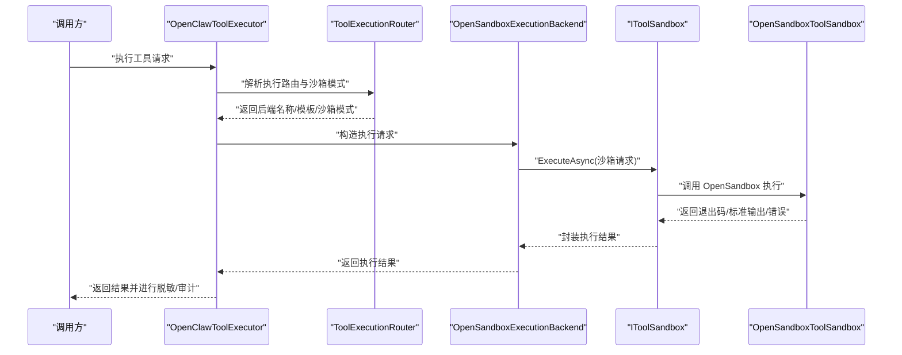

**图表来源**
- [OpenClawToolExecutor.cs:833-926](file://src/OpenClaw.Agent/OpenClawToolExecutor.cs#L833-L926)
- [ToolExecutionRouter.cs:65-112](file://src/OpenClaw.Agent/Execution/ToolExecutionRouter.cs#L65-L112)
- [OpenSandboxExecutionBackend.cs:22-67](file://src/OpenClaw.Agent/Execution/OpenSandboxExecutionBackend.cs#L22-L67)
- [IToolSandbox.cs:5-11](file://src/OpenClaw.Core/Abstractions/IToolSandbox.cs#L5-L11)
- [OpenSandboxToolSandbox.cs](file://src/OpenClawNet.Sandbox.OpenSandbox/OpenSandboxToolSandbox.cs)

**章节来源**
- [OpenClawToolExecutor.cs:833-926](file://src/OpenClaw.Agent/OpenClawToolExecutor.cs#L833-L926)
- [ToolExecutionRouter.cs:1-253](file://src/OpenClaw.Agent/Execution/ToolExecutionRouter.cs#L1-L253)
- [OpenSandboxExecutionBackend.cs:1-69](file://src/OpenClaw.Agent/Execution/OpenSandboxExecutionBackend.cs#L1-L69)

## 详细组件分析

### 组件一：工具路径策略（待实现）
- 当前为骨架注释版本，包含读/写路径允许判断、真实路径解析、符号链接处理与根目录判定等方法。
- 建议扩展点：结合配置中的允许根目录数组，实现严格白名单与路径遍历防护。

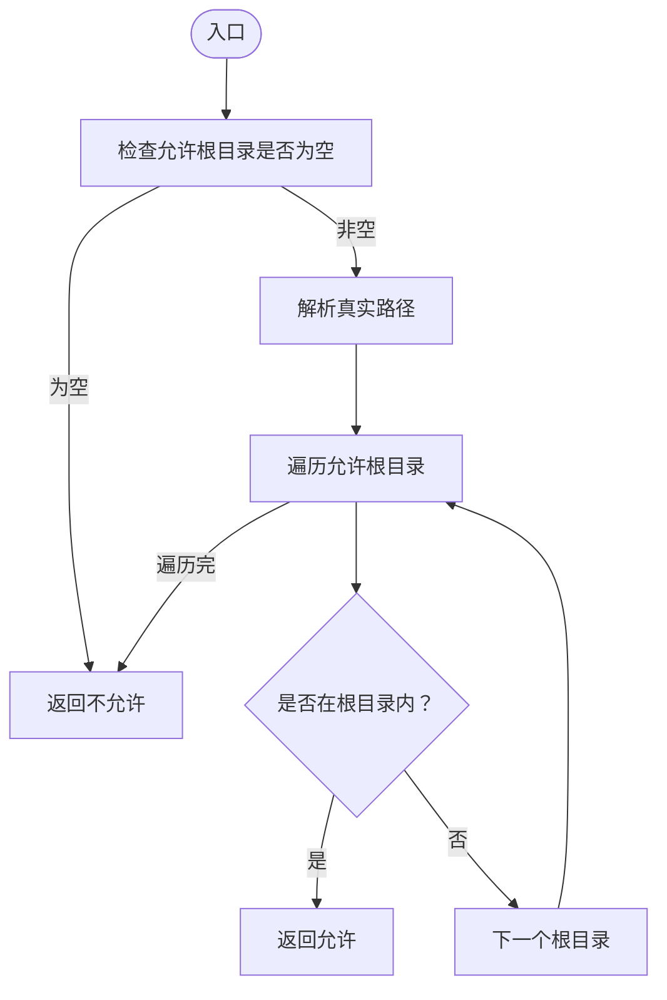

**图表来源**
- [ToolPathPolicy.cs:1-136](file://src/OpenClaw.Core/Security/ToolPathPolicy.cs#L1-L136)

**章节来源**
- [ToolPathPolicy.cs:1-136](file://src/OpenClaw.Core/Security/ToolPathPolicy.cs#L1-L136)

### 组件二：浏览器工具能力评估
- 综合配置开关、本地动态代码支持与执行后端可用性，输出“可用/仅后端/禁用/不可用”等状态与原因。
- 关键逻辑：若启用且具备本地或后端能力则注册；否则给出原因（未启用/无后端/本地不支持）。

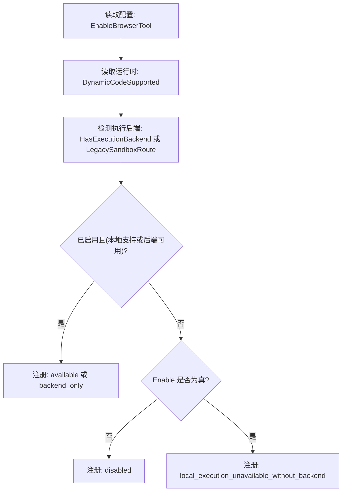

**图表来源**
- [BrowserToolCapabilityEvaluator.cs:7-30](file://src/OpenClaw.Core/Security/BrowserToolCapabilityEvaluator.cs#L7-L30)

**章节来源**
- [BrowserToolCapabilityEvaluator.cs:1-61](file://src/OpenClaw.Core/Security/BrowserToolCapabilityEvaluator.cs#L1-L61)

### 组件三：敏感数据哨兵替换机制
- 上下文包含工具名、参数 JSON、会话/通道/发送者/关联 ID、工作区与支付环境等。
- 结果包含执行参数 JSON、持久化参数 JSON 与是否发生替换标记。
- 空实现直接透传，实际实现可在执行前替换敏感字段并在持久化时保留替换结果。

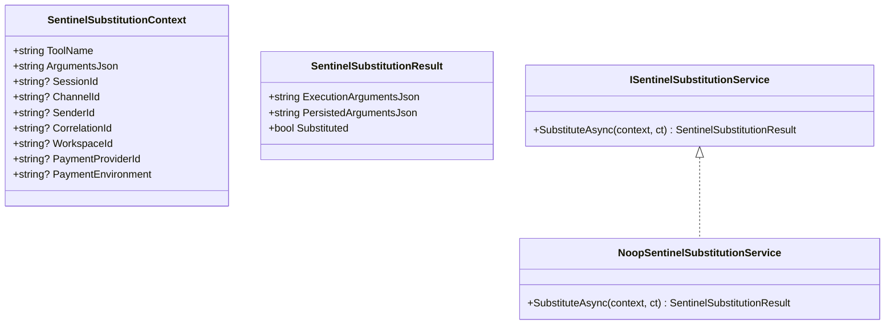

**图表来源**
- [SentinelSubstitution.cs:3-37](file://src/OpenClaw.Core/Security/SentinelSubstitution.cs#L3-L37)

**章节来源**
- [SentinelSubstitution.cs:1-38](file://src/OpenClaw.Core/Security/SentinelSubstitution.cs#L1-L38)

### 组件四：输入净化与输出脱敏
- 输入净化：检测 Shell 元字符、剥离 CRLF、校验内存键与 IMAP 文件夹名，防止注入。
- 输出脱敏：多级脱敏器串联，对会话历史中的工具调用参数、结果与消息进行脱敏，支持原地与克隆两种模式。

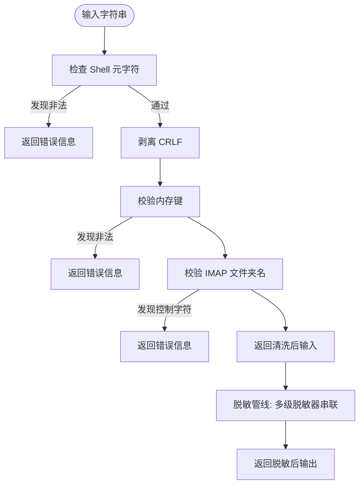

**图表来源**
- [InputSanitizer.cs:24-82](file://src/OpenClaw.Core/Security/InputSanitizer.cs#L24-L82)
- [RedactionPipeline.cs:30-130](file://src/OpenClaw.Core/Security/RedactionPipeline.cs#L30-L130)

**章节来源**
- [InputSanitizer.cs:1-84](file://src/OpenClaw.Core/Security/InputSanitizer.cs#L1-L84)
- [RedactionPipeline.cs:1-131](file://src/OpenClaw.Core/Security/RedactionPipeline.cs#L1-L131)

### 组件五：动态权限与配对管理
- 动态允许列表：按通道持久化允许发送者/接收者，支持并发锁与临时文件原子写入。
- 允许列表策略：支持“严格/传统”语义，空列表在传统语义下视为允许，在严格语义下默认拒绝。
- 配对管理：生成一次性配对码、固定时间比较、冷却与过期控制、持久化批准列表。

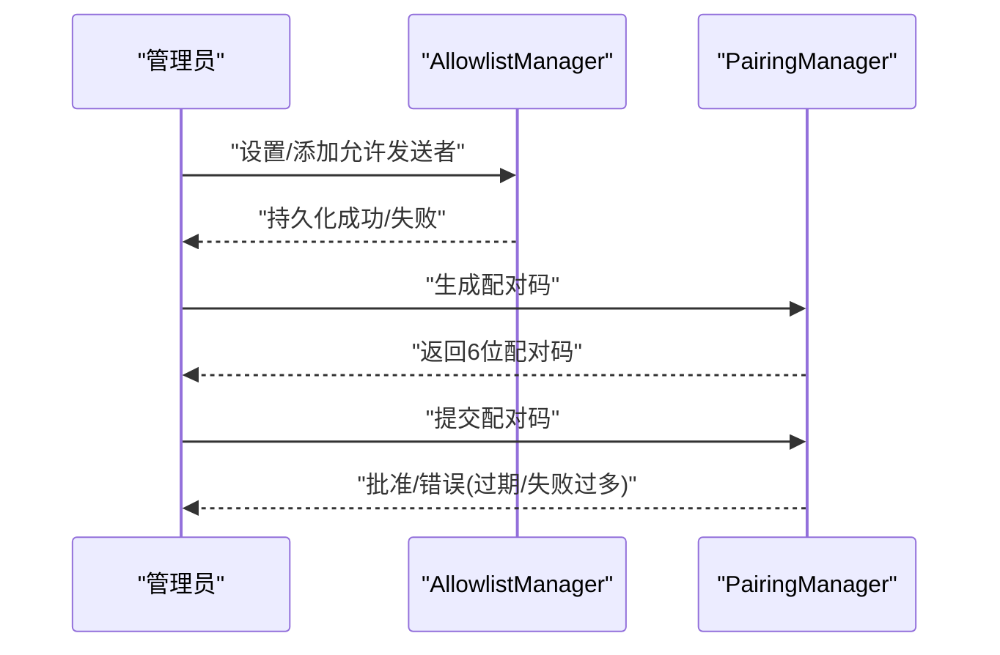

**图表来源**
- [AllowlistManager.cs:53-115](file://src/OpenClaw.Core/Security/AllowlistManager.cs#L53-L115)
- [AllowlistPolicy.cs:18-40](file://src/OpenClaw.Core/Security/AllowlistPolicy.cs#L18-L40)
- [PairingManager.cs:53-124](file://src/OpenClaw.Core/Security/PairingManager.cs#L53-L124)

**章节来源**
- [AllowlistManager.cs:1-126](file://src/OpenClaw.Core/Security/AllowlistManager.cs#L1-L126)
- [AllowlistPolicy.cs:1-43](file://src/OpenClaw.Core/Security/AllowlistPolicy.cs#L1-L43)
- [PairingManager.cs:1-211](file://src/OpenClaw.Core/Security/PairingManager.cs#L1-L211)

### 组件六：工具执行沙箱、资源限制与权限控制
- 执行路由：根据工具与配置解析后端、模板与沙箱模式；若未配置后端但工具支持沙箱，则回退到 OpenSandbox。
- OpenSandbox 后端：统一包装沙箱请求，设置超时，捕获取消异常并标记超时。
- 沙箱接口与模型：抽象出 ExecuteAsync，请求包含命令、工作目录、环境变量、参数、租约键、模板与 TTL。
- OpenSandbox 实现：HTTP 请求构建、响应反序列化、异常处理与租约删除。

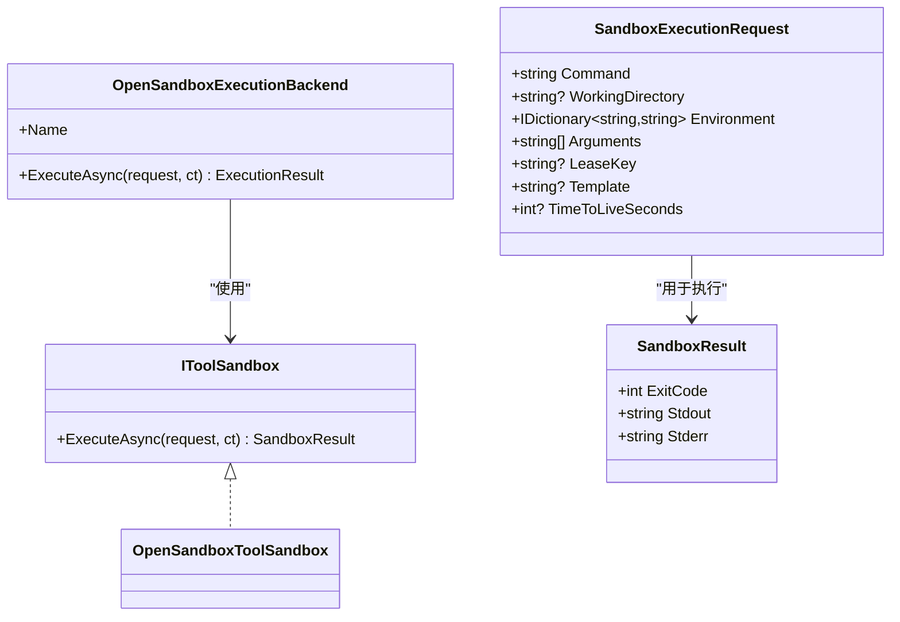

**图表来源**
- [IToolSandbox.cs:5-11](file://src/OpenClaw.Core/Abstractions/IToolSandbox.cs#L5-L11)
- [SandboxModels.cs:10-26](file://src/OpenClaw.Core/Models/SandboxModels.cs#L10-L26)
- [OpenSandboxExecutionBackend.cs:22-67](file://src/OpenClaw.Agent/Execution/OpenSandboxExecutionBackend.cs#L22-L67)
- [OpenSandboxToolSandbox.cs](file://src/OpenClawNet.Sandbox.OpenSandbox/OpenSandboxToolSandbox.cs)

**章节来源**
- [ToolExecutionRouter.cs:65-112](file://src/OpenClaw.Agent/Execution/ToolExecutionRouter.cs#L65-L112)
- [OpenSandboxExecutionBackend.cs:1-69](file://src/OpenClaw.Agent/Execution/OpenSandboxExecutionBackend.cs#L1-L69)
- [IToolSandbox.cs:1-12](file://src/OpenClaw.Core/Abstractions/IToolSandbox.cs#L1-L12)
- [SandboxModels.cs:1-28](file://src/OpenClaw.Core/Models/SandboxModels.cs#L1-L28)
- [OpenSandboxToolSandbox.cs](file://src/OpenClawNet.Sandbox.OpenSandbox/OpenSandboxToolSandbox.cs)

### 组件七：URL 安全策略与治理
- URL 安全校验：支持绝对 http(s)、内置黑名单主机、自定义阻断 CIDR 与私网地址阻断，DNS 解析失败即拒绝。
- 治理描述符：根据工具名称、动作描述与风险级别，动态决定是否需要审批、只读与风险等级。

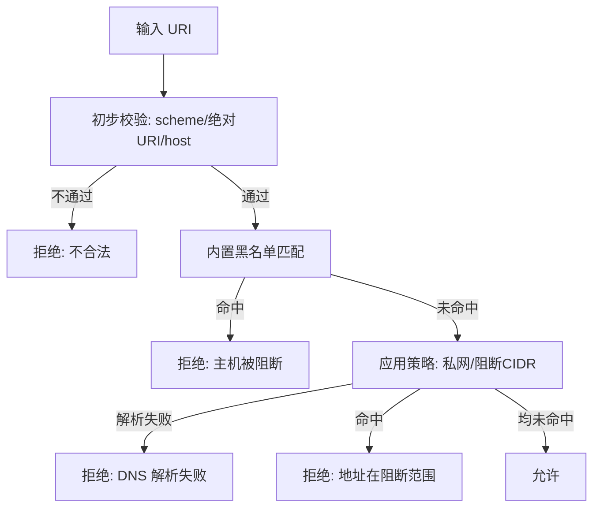

**图表来源**
- [UrlSafetyValidator.cs:27-135](file://src/OpenClaw.Core/Security/UrlSafetyValidator.cs#L27-L135)
- [ToolGovernanceDescriptorCatalog.cs:12-32](file://src/OpenClaw.Core/Governance/ToolGovernanceDescriptorCatalog.cs#L12-L32)

**章节来源**
- [UrlSafetyValidator.cs:1-219](file://src/OpenClaw.Core/Security/UrlSafetyValidator.cs#L1-L219)
- [ToolGovernanceDescriptorCatalog.cs:1-34](file://src/OpenClaw.Core/Governance/ToolGovernanceDescriptorCatalog.cs#L1-L34)
- [ToolGovernanceModels.cs:45-81](file://src/OpenClaw.Core/Models/ToolGovernanceModels.cs#L45-L81)

### 组件八：安全态势构建与审计
- 安全态势构建器：汇总公网绑定、认证令牌、浏览器会话 Cookie 安全、审批要求、沙箱配置、通道签名验证就绪度等，输出风险标志与加固建议。
- 审计与治理记录：工具审批决策与治理账本记录，便于审计与合规检查。

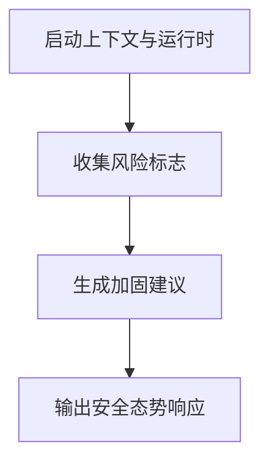

**图表来源**
- [SecurityPostureBuilder.cs:11-139](file://src/OpenClaw.Gateway/SecurityPostureBuilder.cs#L11-L139)

**章节来源**
- [SecurityPostureBuilder.cs:1-169](file://src/OpenClaw.Gateway/SecurityPostureBuilder.cs#L1-L169)

## 依赖关系分析
- 组件耦合与内聚：执行路由与后端解耦，通过接口与模型传递；沙箱实现与后端解耦，便于替换不同提供者。
- 外部依赖与集成点：OpenSandbox HTTP 接口、DNS 解析、文件系统持久化（允许列表/配对列表）、JSON 序列化。
- 可能的循环依赖：当前设计以接口与模型为中心，未见循环导入迹象。

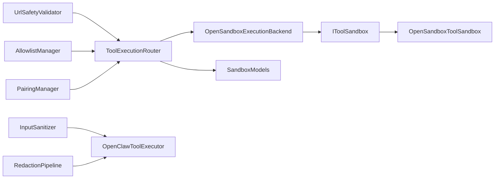

**图表来源**
- [ToolExecutionRouter.cs:1-253](file://src/OpenClaw.Agent/Execution/ToolExecutionRouter.cs#L1-L253)
- [OpenSandboxExecutionBackend.cs:1-69](file://src/OpenClaw.Agent/Execution/OpenSandboxExecutionBackend.cs#L1-L69)
- [IToolSandbox.cs:1-12](file://src/OpenClaw.Core/Abstractions/IToolSandbox.cs#L1-L12)
- [OpenSandboxToolSandbox.cs](file://src/OpenClawNet.Sandbox.OpenSandbox/OpenSandboxToolSandbox.cs)
- [SandboxModels.cs:1-28](file://src/OpenClaw.Core/Models/SandboxModels.cs#L1-L28)
- [InputSanitizer.cs:1-84](file://src/OpenClaw.Core/Security/InputSanitizer.cs#L1-L84)
- [RedactionPipeline.cs:1-131](file://src/OpenClaw.Core/Security/RedactionPipeline.cs#L1-L131)
- [UrlSafetyValidator.cs:1-219](file://src/OpenClaw.Core/Security/UrlSafetyValidator.cs#L1-L219)
- [AllowlistManager.cs:1-126](file://src/OpenClaw.Core/Security/AllowlistManager.cs#L1-L126)
- [PairingManager.cs:1-211](file://src/OpenClaw.Core/Security/PairingManager.cs#L1-L211)

**章节来源**
- [ToolExecutionRouter.cs:1-253](file://src/OpenClaw.Agent/Execution/ToolExecutionRouter.cs#L1-L253)
- [OpenSandboxExecutionBackend.cs:1-69](file://src/OpenClaw.Agent/Execution/OpenSandboxExecutionBackend.cs#L1-L69)

## 性能考量
- SIMD 加速与 Span 匹配：输入净化与通配匹配采用 Span 与 SIMD 加速搜索，降低分配与提升匹配性能。
- 超时控制：OpenSandbox 后端统一设置超时，避免长时间占用；执行器在配置存在时应用工具级超时。
- 原子持久化：允许列表与配对列表使用临时文件与原子移动，减少竞态与损坏风险。
- DNS 缓存与重试：URL 安全校验在解析失败时快速拒绝，避免重复昂贵操作。

[本节为通用性能讨论，无需列出具体文件来源]

## 故障排查指南
- 沙箱执行失败：检查 OpenSandbox 提供者配置、模板与环境变量；确认租约键与 TTL 设置；查看超时与异常日志。
- 工具路由失败：确认工具是否配置了执行后端或沙箱模式；检查本地后端是否可用与回退策略。
- 审批与治理：核对工具治理描述符与审批策略，确保高风险工具已纳入审批清单。
- URL 安全：若被阻断，检查主机是否命中内置黑名单、CIDR 或私网地址；确认 DNS 解析是否正常。
- 允许列表与配对：检查动态文件是否存在与格式正确；确认并发更新是否成功；核对配对码是否过期或失败次数过多。

**章节来源**
- [OpenSandboxToolSandbox.cs](file://src/OpenClawNet.Sandbox.OpenSandbox/OpenSandboxToolSandbox.cs)
- [ToolExecutionRouter.cs:114-157](file://src/OpenClaw.Agent/Execution/ToolExecutionRouter.cs#L114-L157)
- [UrlSafetyValidator.cs:44-58](file://src/OpenClaw.Core/Security/UrlSafetyValidator.cs#L44-L58)
- [AllowlistManager.cs:32-51](file://src/OpenClaw.Core/Security/AllowlistManager.cs#L32-L51)
- [PairingManager.cs:73-124](file://src/OpenClaw.Core/Security/PairingManager.cs#L73-L124)

## 结论
工具安全模块通过“输入净化 + 输出脱敏 + 动态权限 + 沙箱隔离 + 安全态势构建”的组合，形成纵深防御体系。路径策略、浏览器能力评估与哨兵替换为扩展点，配合治理与审计，满足生产环境下的安全与合规需求。建议在生产部署中启用 OpenSandbox、严格审批策略与 URL 安全策略，并持续完善允许列表与配对流程。

[本节为总结性内容，无需列出具体文件来源]

## 附录
- 配置要点
  - 开启 OpenSandbox 并为高风险工具（如 shell、code_exec、browser）配置沙箱模式。
  - 设置工具审批策略与审批所需工具清单，确保高风险工具受控。
  - 启用 URL 安全策略，阻断私网与特定 CIDR；必要时开启 DNS 解析校验。
  - 使用动态允许列表与配对管理，限制通道访问来源。
- 最佳实践
  - 对外部输入进行输入净化，对内部输出进行脱敏。
  - 将工具执行路由至隔离后端，设置合理超时与 TTL。
  - 定期审查安全态势报告，落实加固建议。
  - 记录治理与审批日志，支持审计与合规检查。

[本节为通用建议，无需列出具体文件来源]