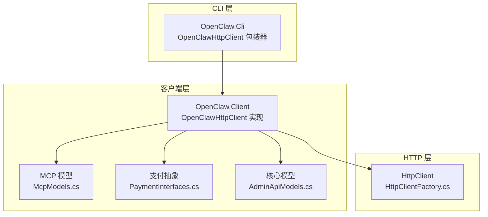
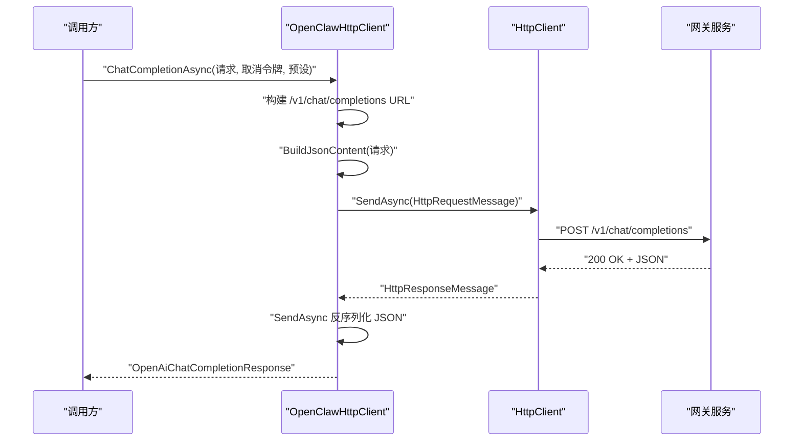
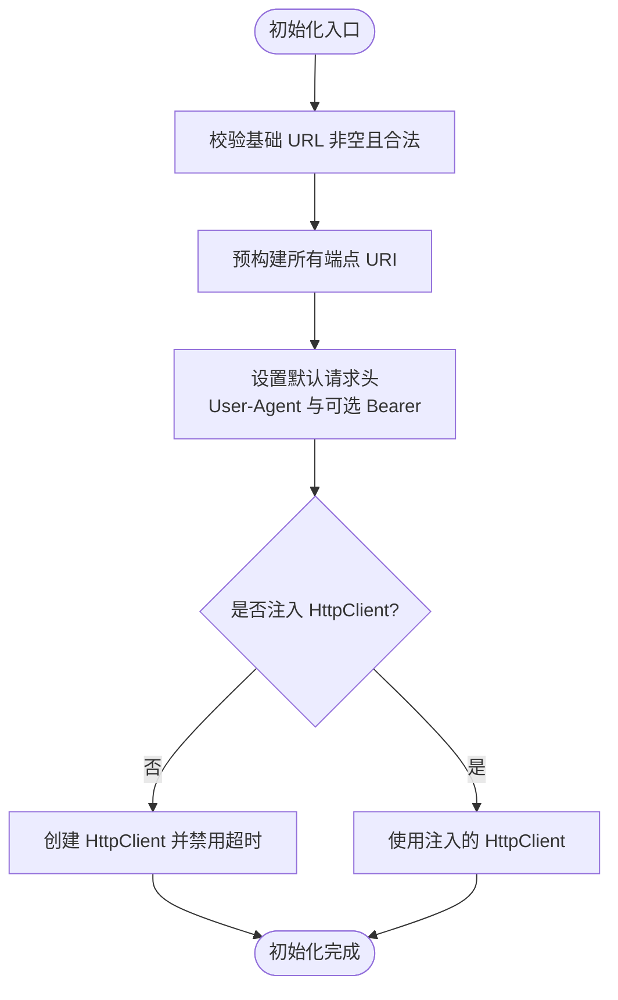
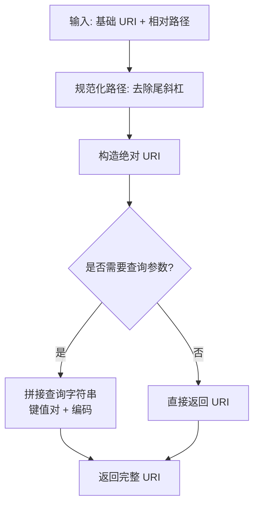
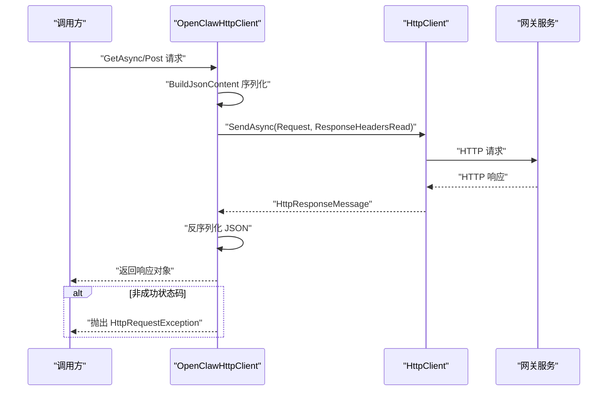
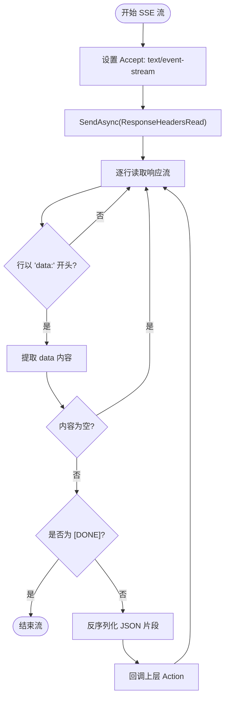
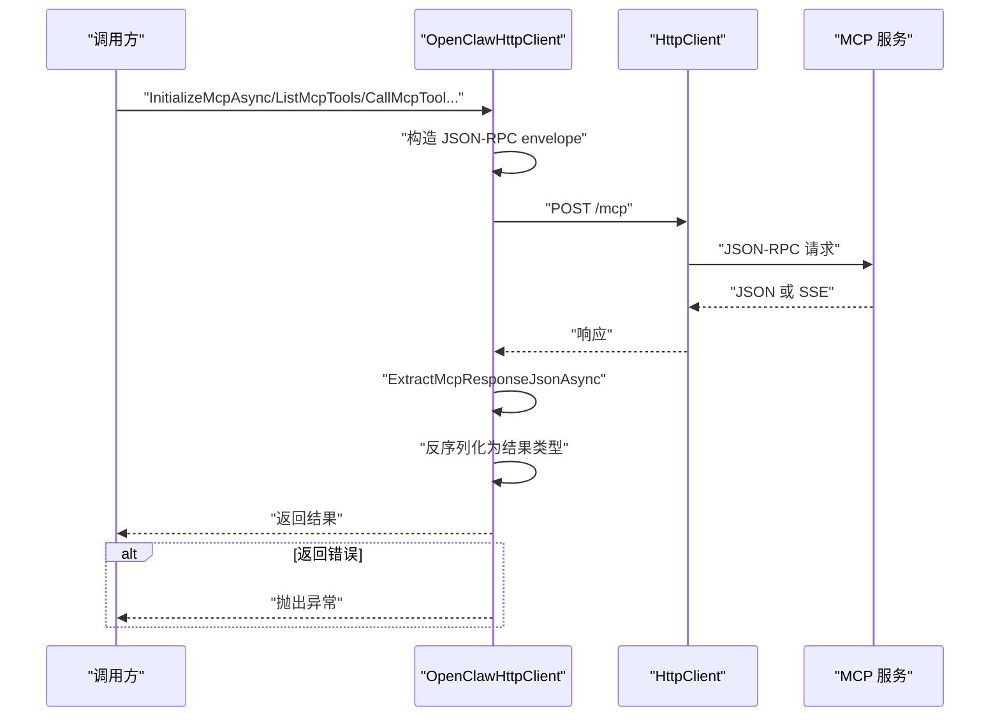
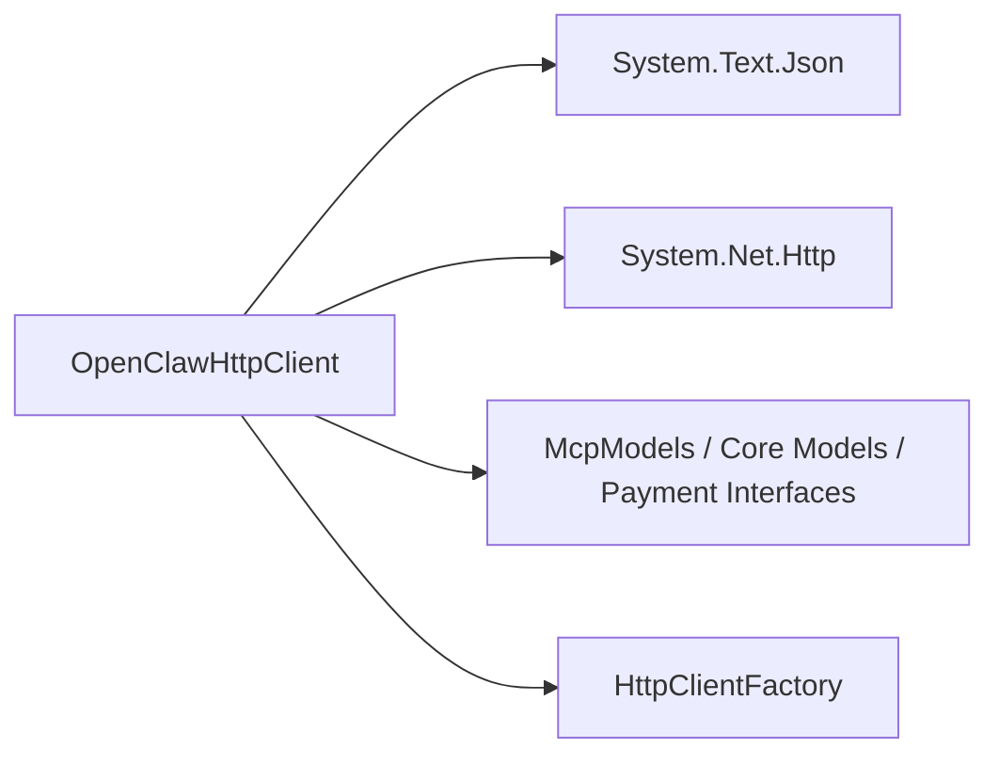

# HTTP 客户端

<cite>
**本文引用的文件**
- [OpenClawHttpClient.cs](file://src/OpenClaw.Client/OpenClawHttpClient.cs)
- [OpenClawHttpClient.cs](file://src/OpenClaw.Cli/OpenClawHttpClient.cs)
- [McpModels.cs](file://src/OpenClaw.Client/McpModels.cs)
- [AdminApiModels.cs](file://src/OpenClaw.Core/Models/AdminApiModels.cs)
- [PaymentInterfaces.cs](file://src/OpenClaw.Payments.Abstractions/PaymentInterfaces.cs)
- [HttpClientFactory.cs](file://src/OpenClaw.Core/Http/HttpClientFactory.cs)
- [Program.cs](file://src/OpenClaw.Cli/Program.cs)
- [HarnessCommands.cs](file://src/OpenClaw.Cli/HarnessCommands.cs)
- [ExternalCliCommands.cs](file://src/OpenClaw.Cli/ExternalCliCommands.cs)
</cite>

## 目录
1. [简介](#简介)
2. [项目结构](#项目结构)
3. [核心组件](#核心组件)
4. [架构总览](#架构总览)
5. [详细组件分析](#详细组件分析)
6. [依赖关系分析](#依赖关系分析)
7. [性能考量](#性能考量)
8. [故障排查指南](#故障排查指南)
9. [结论](#结论)
10. [附录](#附录)

## 简介
本文件系统性地文档化 OpenClaw 客户端的 HTTP 客户端实现，重点围绕 OpenClawHttpClient 类的设计架构、初始化过程、URL 构建机制与请求处理流程展开。文档覆盖以下关键能力：
- 聊天完成请求与流式响应（SSE）
- MCP 协议支持（初始化、工具/资源/提示交互）
- 支付处理（查询状态、列出资金来源、发行虚拟卡、执行机器支付、查询支付状态）
- 会话管理（集成会话列表、详情、时间线、搜索）
- 结构化记忆（Fractal Memory）状态、检索、打开、导出、最近条目、校验与索引刷新、手把手移交
- 自动化与工作流（模板、运行、回放、隔离区清理、迁移）
- 运行时事件、消息队列、心跳与脉冲（Pulse）、安全态势、模型与评估、外部 CLI、审批模拟、审计导出、轨迹导出、WhatsApp 设置与重启、通道认证流
- 认证机制、错误处理、重试策略、超时配置与内存管理
- 使用示例：同步与异步调用、参数传递、响应处理

## 项目结构
OpenClaw 客户端由两个主要实现组成：
- OpenClaw.Client 中的 OpenClawHttpClient：面向库使用的完整客户端实现，负责所有 API 的构建、序列化、发送与反序列化。
- OpenClaw.Cli 中的 OpenClawHttpClient：轻量包装器，委托给 OpenClaw.Client 实现，便于 CLI 命令直接复用。

图表来源
- [OpenClawHttpClient.cs:10-182](file://src/OpenClaw.Client/OpenClawHttpClient.cs#L10-L182)
- [OpenClawHttpClient.cs:6-182](file://src/OpenClaw.Cli/OpenClawHttpClient.cs#L6-L182)
- [McpModels.cs:1-187](file://src/OpenClaw.Client/McpModels.cs#L1-L187)
- [PaymentInterfaces.cs:1-60](file://src/OpenClaw.Payments.Abstractions/PaymentInterfaces.cs#L1-L60)
- [AdminApiModels.cs:1-200](file://src/OpenClaw.Core/Models/AdminApiModels.cs#L1-L200)
- [HttpClientFactory.cs:1-33](file://src/OpenClaw.Core/Http/HttpClientFactory.cs#L1-L33)

章节来源
- [OpenClawHttpClient.cs:10-182](file://src/OpenClaw.Client/OpenClawHttpClient.cs#L10-L182)
- [OpenClawHttpClient.cs:6-182](file://src/OpenClaw.Cli/OpenClawHttpClient.cs#L6-L182)

## 核心组件
- OpenClawHttpClient：封装 HTTP 请求构建、认证头设置、JSON 序列化/反序列化、SSE 流解析、MCP JSON-RPC 调用、URI 查询参数构造、错误转换等。
- MCP 模型：定义 MCP 初始化、工具、资源、提示等请求/响应结构。
- 支付抽象：定义支付提供方、审批、密钥保管、策略、审计与替换等接口。
- 核心模型：包含认证会话、审批历史、会话详情、消息、事件等数据契约。
- HttpClientFactory：提供带连接池生命周期优化的 HttpClient 工厂方法。

章节来源
- [OpenClawHttpClient.cs:10-182](file://src/OpenClaw.Client/OpenClawHttpClient.cs#L10-L182)
- [McpModels.cs:1-187](file://src/OpenClaw.Client/McpModels.cs#L1-L187)
- [PaymentInterfaces.cs:1-60](file://src/OpenClaw.Payments.Abstractions/PaymentInterfaces.cs#L1-L60)
- [AdminApiModels.cs:1-200](file://src/OpenClaw.Core/Models/AdminApiModels.cs#L1-L200)
- [HttpClientFactory.cs:1-33](file://src/OpenClaw.Core/Http/HttpClientFactory.cs#L1-L33)

## 架构总览
OpenClawHttpClient 将“URL 构建”、“请求发送”、“响应解析”、“错误处理”、“SSE 流处理”、“MCP JSON-RPC”等职责解耦，形成清晰的职责边界：
- 初始化阶段：校验基础 URL、构造各端点 URI、设置默认 User-Agent 与可选 Bearer 认证头。
- 请求阶段：根据端点选择 GET/POST，必要时设置 Accept: text/event-stream；将请求体通过 System.Text.Json 进行序列化。
- 响应阶段：对非流式响应进行 JSON 反序列化；对 SSE 响应按行解析 data: 行，提取 JSON 片段并反序列化。
- MCP 阶段：构造 JSON-RPC envelope，发送到 /mcp，支持返回 JSON 或 text/event-stream 并提取最终结果。
- 错误阶段：统一捕获 HTTP 错误，拼接状态码与响应体，抛出 HttpRequestException。

图表来源
- [OpenClawHttpClient.cs:190-202](file://src/OpenClaw.Client/OpenClawHttpClient.cs#L190-L202)
- [OpenClawHttpClient.cs:1327-1339](file://src/OpenClaw.Client/OpenClawHttpClient.cs#L1327-L1339)

章节来源
- [OpenClawHttpClient.cs:190-202](file://src/OpenClaw.Client/OpenClawHttpClient.cs#L190-L202)
- [OpenClawHttpClient.cs:1327-1339](file://src/OpenClaw.Client/OpenClawHttpClient.cs#L1327-L1339)

## 详细组件分析

### 设计架构与初始化
- 基础 URL 校验与规范化：确保传入 URL 非空且为绝对 URI，去除尾部斜杠。
- 端点 URI 预构建：在构造函数中一次性生成所有常用端点的绝对 URI，避免运行时重复拼接。
- 默认请求头：设置 User-Agent；若提供 Bearer Token，则设置 Authorization 头。
- HttpClient 生命周期：支持注入外部 HttpClient；若未注入则创建新实例，并设置 Timeout 为无限，以便支持长连接与 SSE。

图表来源
- [OpenClawHttpClient.cs:91-182](file://src/OpenClaw.Client/OpenClawHttpClient.cs#L91-L182)

章节来源
- [OpenClawHttpClient.cs:91-182](file://src/OpenClaw.Client/OpenClawHttpClient.cs#L91-L182)

### URL 构建机制
- 统一基类路径：所有端点基于基础 URL，追加相对路径（如 /v1/chat/completions、/mcp、/auth/session 等）。
- 查询参数构造：大量 GET 接口通过 Build*Uri 方法拼接查询参数，支持分页、过滤、时间范围、布尔开关等。
- 路径参数：部分接口采用绝对路径拼接（如会话详情、共享 Harness 状态详情），并对路径片段进行 URL 编码。
- 支付相关：BuildPaymentUri 将 provider、environment、yes 等参数附加到支付相关端点。

图表来源
- [OpenClawHttpClient.cs:101-174](file://src/OpenClaw.Client/OpenClawHttpClient.cs#L101-L174)
- [OpenClawHttpClient.cs:1908-1922](file://src/OpenClaw.Client/OpenClawHttpClient.cs#L1908-L1922)

章节来源
- [OpenClawHttpClient.cs:101-174](file://src/OpenClaw.Client/OpenClawHttpClient.cs#L101-L174)
- [OpenClawHttpClient.cs:1908-1922](file://src/OpenClaw.Client/OpenClawHttpClient.cs#L1908-L1922)

### 请求处理流程（非流式）
- 构造 HttpRequestMessage：指定方法与 URL。
- 序列化请求体：使用 BuildJsonContent 将请求对象序列化为 UTF-8 JSON。
- 发送请求：SendAsync 使用 ResponseHeadersRead 选项，先读取响应头再进入正文读取。
- 反序列化响应：从响应流中读取 JSON 并反序列化为目标类型。
- 错误处理：非成功状态码统一转换为 HttpRequestException，包含状态与响应体摘要。

图表来源
- [OpenClawHttpClient.cs:1327-1339](file://src/OpenClaw.Client/OpenClawHttpClient.cs#L1327-L1339)
- [OpenClawHttpClient.cs:1930-1950](file://src/OpenClaw.Client/OpenClawHttpClient.cs#L1930-L1950)

章节来源
- [OpenClawHttpClient.cs:1327-1339](file://src/OpenClaw.Client/OpenClawHttpClient.cs#L1327-L1339)
- [OpenClawHttpClient.cs:1930-1950](file://src/OpenClaw.Client/OpenClawHttpClient.cs#L1930-L1950)

### 流式响应处理（SSE）
- SSE 请求：在请求头中添加 Accept: text/event-stream。
- 逐行解析：读取响应流，仅处理以 "data:" 开头的行，忽略空行与 [DONE] 结束标记。
- JSON 解析：将 data 后的内容反序列化为 OpenAI 流式块，提取 delta 内容并回调给上层。
- 事件流：后端事件流与通道认证流采用相同模式，分别解析 BackendEvent 与 ChannelAuthStatusItem。

图表来源
- [OpenClawHttpClient.cs:204-260](file://src/OpenClaw.Client/OpenClawHttpClient.cs#L204-L260)
- [OpenClawHttpClient.cs:476-510](file://src/OpenClaw.Client/OpenClawHttpClient.cs#L476-L510)
- [OpenClawHttpClient.cs:1209-1242](file://src/OpenClaw.Client/OpenClawHttpClient.cs#L1209-L1242)

章节来源
- [OpenClawHttpClient.cs:204-260](file://src/OpenClaw.Client/OpenClawHttpClient.cs#L204-L260)
- [OpenClawHttpClient.cs:476-510](file://src/OpenClaw.Client/OpenClawHttpClient.cs#L476-L510)
- [OpenClawHttpClient.cs:1209-1242](file://src/OpenClaw.Client/OpenClawHttpClient.cs#L1209-L1242)

### MCP 协议支持
- JSON-RPC 构造：为每次调用生成自增 id，写入 jsonrpc、method、params。
- 支持无参数方法：当参数为空时写入空对象 {}。
- 多种返回形式：支持纯 JSON 返回或 text/event-stream，后者需从 data 行提取 JSON。
- 错误处理：若返回 envelope 中包含 error 字段，抛出包含错误码与消息的异常。

图表来源
- [OpenClawHttpClient.cs:1253-1306](file://src/OpenClaw.Client/OpenClawHttpClient.cs#L1253-L1306)
- [OpenClawHttpClient.cs:1308-1325](file://src/OpenClaw.Client/OpenClawHttpClient.cs#L1308-L1325)
- [McpModels.cs:5-25](file://src/OpenClaw.Client/McpModels.cs#L5-L25)

章节来源
- [OpenClawHttpClient.cs:1253-1306](file://src/OpenClaw.Client/OpenClawHttpClient.cs#L1253-L1306)
- [OpenClawHttpClient.cs:1308-1325](file://src/OpenClaw.Client/OpenClawHttpClient.cs#L1308-L1325)
- [McpModels.cs:5-25](file://src/OpenClaw.Client/McpModels.cs#L5-L25)

### 支付处理
- 查询支付设置：GetPaymentSetupStatusAsync，支持 provider、environment、yes 参数。
- 列出资金来源：ListPaymentFundingSourcesAsync，支持 provider、environment。
- 发行虚拟卡：IssueVirtualCardAsync，POST 到 /payment/virtual-card。
- 执行机器支付：ExecuteMachinePaymentAsync，POST 到 /payment/execute。
- 查询支付状态：GetPaymentStatusAsync，GET /payment/status/{id}。
- 统一序列化：使用 PaymentJsonContext 对支付相关模型进行序列化/反序列化。

章节来源
- [OpenClawHttpClient.cs:328-359](file://src/OpenClaw.Client/OpenClawHttpClient.cs#L328-L359)
- [OpenClawHttpClient.cs:334-350](file://src/OpenClaw.Client/OpenClawHttpClient.cs#L334-L350)
- [OpenClawHttpClient.cs:1908-1922](file://src/OpenClaw.Client/OpenClawHttpClient.cs#L1908-L1922)
- [PaymentInterfaces.cs:1-60](file://src/OpenClaw.Payments.Abstractions/PaymentInterfaces.cs#L1-L60)

### 会话管理
- 列表与分页：ListSessionsAsync，支持 page、pageSize、search、channelId、senderId、fromUtc、toUtc、state、starred、tag。
- 详情与时间线：GetSessionAsync、GetSessionTimelineAsync。
- 搜索：SearchSessionsAsync，支持文本搜索、限制、片段长度、时间范围。
- 共享 Harness 状态：List/Get/GetForSession/DetectConflicts。
- 会话元数据更新与推广：UpdateSessionMetadataAsync、PromoteSessionAsync。

章节来源
- [OpenClawHttpClient.cs:517-543](file://src/OpenClaw.Client/OpenClawHttpClient.cs#L517-L543)
- [OpenClawHttpClient.cs:524-540](file://src/OpenClaw.Client/OpenClawHttpClient.cs#L524-L540)
- [OpenClawHttpClient.cs:664-690](file://src/OpenClaw.Client/OpenClawHttpClient.cs#L664-L690)
- [OpenClawHttpClient.cs:720-751](file://src/OpenClaw.Client/OpenClawHttpClient.cs#L720-L751)

### 结构化记忆（Fractal Memory）
- 状态查询：GetFractalMemoryStatusAsync。
- 检索/打开/导出/最近条目：Search/Open/Export/Recent。
- 校验与索引刷新：Validate/RefreshIndex。
- 手把手移交：CreateFractalMemoryHandoffAsync。

章节来源
- [OpenClawHttpClient.cs:624-662](file://src/OpenClaw.Client/OpenClawHttpClient.cs#L624-L662)
- [OpenClawHttpClient.cs:627-637](file://src/OpenClaw.Client/OpenClawHttpClient.cs#L627-L637)
- [OpenClawHttpClient.cs:639-661](file://src/OpenClaw.Client/OpenClawHttpClient.cs#L639-L661)
- [OpenClawHttpClient.cs:651-661](file://src/OpenClaw.Client/OpenClawHttpClient.cs#L651-L661)

### 自动化与工作流
- 列表与模板：ListAutomationsAsync、ListAutomationTemplatesAsync。
- 详情与运行：GetAutomationAsync、RunAutomationAsync、GetAutomationRunsAsync、GetAutomationRunAsync。
- 回放与隔离区清理：ReplayAutomationRunAsync、ClearAutomationQuarantineAsync。
- 迁移：MigrateAutomationsAsync。
- 工作流：List/Run/Get/Respond。

章节来源
- [OpenClawHttpClient.cs:753-794](file://src/OpenClaw.Client/OpenClawHttpClient.cs#L753-L794)
- [OpenClawHttpClient.cs:799-820](file://src/OpenClaw.Client/OpenClawHttpClient.cs#L799-L820)

### 运行时事件、消息队列、心跳与脉冲
- 运行时事件查询：QueryRuntimeEventsAsync。
- 消息入队：EnqueueMessageAsync。
- 心跳：Get/Preview/Save/Status。
- 脉冲：GetStatus/Run/Events/Enable/Disable。
- 安全态势：GetSecurityPostureAsync。
- 模型与评估：GetModelProfiles/GetModelSelectionDoctor/RunModelEvaluation。
- 外部 CLI：List/Status/Commands/Preview/Execute。
- 审批模拟：SimulateApprovalAsync。
- 审计与轨迹导出：ExportAuditBundle/ExportTrajectoryJsonl。
- WhatsApp 设置与重启：Get/Save/Restart。

章节来源
- [OpenClawHttpClient.cs:822-837](file://src/OpenClaw.Client/OpenClawHttpClient.cs#L822-L837)
- [OpenClawHttpClient.cs:839-981](file://src/OpenClaw.Client/OpenClawHttpClient.cs#L839-L981)
- [OpenClawHttpClient.cs:989-1026](file://src/OpenClaw.Client/OpenClawHttpClient.cs#L989-L1026)
- [OpenClawHttpClient.cs:1028-1038](file://src/OpenClaw.Client/OpenClawHttpClient.cs#L1028-L1038)
- [OpenClawHttpClient.cs:1148-1183](file://src/OpenClaw.Client/OpenClawHttpClient.cs#L1148-L1183)
- [OpenClawHttpClient.cs:1185-1204](file://src/OpenClaw.Client/OpenClawHttpClient.cs#L1185-L1204)

### 通道认证流
- 获取认证状态：GetChannelAuthAsync。
- 认证流：StreamChannelAuthAsync，解析 ChannelAuthStatusItem。

章节来源
- [OpenClawHttpClient.cs:1206-1242](file://src/OpenClaw.Client/OpenClawHttpClient.cs#L1206-L1242)

### 认证机制
- Bearer Token：在初始化时设置 Authorization: Bearer {token}。
- CLI 令牌优先级：CLI 命令支持从环境变量 OPENCLAW_AUTH_TOKEN 读取令牌。
- 网关侧验证：网关支持从 Authorization 头或查询字符串提取令牌，优先 Authorization 头。

章节来源
- [OpenClawHttpClient.cs:180-181](file://src/OpenClaw.Client/OpenClawHttpClient.cs#L180-L181)
- [Program.cs:9-11](file://src/OpenClaw.Cli/Program.cs#L9-L11)
- [Program.cs:490-491](file://src/OpenClaw.Cli/Program.cs#L490-L491)

### 错误处理与重试策略
- 错误处理：非成功状态码统一转换为 HttpRequestException，包含状态码与响应体摘要。
- 重试策略：当前实现未内置重试逻辑，建议在调用方结合 Polly 等库实现指数退避重试。
- 超时配置：HttpClient 默认超时为无限，适合长连接与 SSE；若需超时可在外部注入 HttpClient 时设置。

章节来源
- [OpenClawHttpClient.cs:1930-1950](file://src/OpenClaw.Client/OpenClawHttpClient.cs#L1930-L1950)
- [HttpClientFactory.cs:23-32](file://src/OpenClaw.Core/Http/HttpClientFactory.cs#L23-L32)

### 内存管理
- HttpClient 生命周期：若未注入外部实例，Dispose 时释放内部 HttpClient。
- 流式读取：使用 using 语句确保 HttpResponseMessage、Stream、StreamReader 正确释放。
- JSON Writer/Reader：使用 MemoryStream 与 Utf8JsonWriter/Utf8JsonReader，避免额外分配。

章节来源
- [OpenClawHttpClient.cs:1952-1956](file://src/OpenClaw.Client/OpenClawHttpClient.cs#L1952-L1956)
- [OpenClawHttpClient.cs:1260-1286](file://src/OpenClaw.Client/OpenClawHttpClient.cs#L1260-L1286)

## 依赖关系分析
- 组件内聚与耦合：
  - OpenClawHttpClient 与 System.Text.Json 强耦合，用于请求/响应序列化。
  - 与 MCP 模型、支付抽象、核心模型存在编译期依赖，但通过 JsonTypeInfo 解耦具体序列化上下文。
  - 与 HttpClient 存在运行时依赖，可通过注入替换。
- 外部依赖：
  - System.Net.Http 提供 HTTP 传输。
  - System.Text.Json 提供高性能 JSON 序列化。
- 循环依赖：未发现循环依赖。

图表来源
- [OpenClawHttpClient.cs:1-8](file://src/OpenClaw.Client/OpenClawHttpClient.cs#L1-L8)
- [HttpClientFactory.cs:1-33](file://src/OpenClaw.Core/Http/HttpClientFactory.cs#L1-L33)

章节来源
- [OpenClawHttpClient.cs:1-8](file://src/OpenClaw.Client/OpenClawHttpClient.cs#L1-L8)
- [HttpClientFactory.cs:1-33](file://src/OpenClaw.Core/Http/HttpClientFactory.cs#L1-L33)

## 性能考量
- 连接池与 DNS 刷新：使用 HttpClientFactory 创建的 HttpClient，其 SocketsHttpHandler 具有 2 分钟的连接池生命周期，有助于避免 DNS 城市化问题。
- 流式读取：SSE 与后端事件流采用逐行读取与 UTF-8 流式解析，降低内存峰值。
- 序列化开销：使用 Utf8JsonWriter/Utf8JsonReader 与 MemoryStream，减少中间字符串分配。
- 超时控制：默认无限超时适合长连接；若需要，应在外部注入时设置合理超时。

章节来源
- [HttpClientFactory.cs:11-32](file://src/OpenClaw.Core/Http/HttpClientFactory.cs#L11-L32)
- [OpenClawHttpClient.cs:221-222](file://src/OpenClaw.Client/OpenClawHttpClient.cs#L221-L222)
- [OpenClawHttpClient.cs:1260-1286](file://src/OpenClaw.Client/OpenClawHttpClient.cs#L1260-L1286)

## 故障排查指南
- HTTP 401/403：检查 Authorization 头是否正确设置，确认 Bearer Token 是否过期或无效。
- HTTP 404：确认基础 URL 与端点路径正确，注意尾斜杠与查询参数编码。
- SSE 无法解析：确认服务端返回格式符合 "data: {json}"，且未遗漏 [DONE] 结束标记。
- MCP 错误：检查 JSON-RPC envelope 的 error 字段，定位服务端错误码与消息。
- 超时问题：若出现长时间等待，考虑在外部注入 HttpClient 时设置超时，或在调用方实现重试。

章节来源
- [OpenClawHttpClient.cs:1930-1950](file://src/OpenClaw.Client/OpenClawHttpClient.cs#L1930-L1950)
- [OpenClawHttpClient.cs:231-239](file://src/OpenClaw.Client/OpenClawHttpClient.cs#L231-L239)
- [OpenClawHttpClient.cs:1298-1299](file://src/OpenClaw.Client/OpenClawHttpClient.cs#L1298-L1299)

## 结论
OpenClawHttpClient 通过清晰的职责划分与完善的错误处理，提供了稳定可靠的 HTTP 客户端能力。其对 SSE、MCP、支付、会话与结构化记忆等领域的深度支持，使其能够满足从 CLI 到应用的多样化场景需求。建议在生产环境中结合外部 HttpClient 注入与重试策略，进一步提升鲁棒性与性能。

## 附录

### 使用示例（同步与异步）
- 同步调用（非流式）：调用 ChatCompletionAsync 获取完整响应。
- 异步调用（流式）：调用 StreamChatCompletionAsync，通过回调实时接收增量文本。
- 参数传递：通过 OpenAiChatCompletionRequest 传递模型、温度、最大 token、消息列表与可选预设 ID。
- 响应处理：非流式直接获得完整响应对象；流式返回拼接后的完整文本。

章节来源
- [Program.cs:517-538](file://src/OpenClaw.Cli/Program.cs#L517-L538)
- [Program.cs:595-607](file://src/OpenClaw.Cli/Program.cs#L595-L607)

### CLI 集成示例
- 基础命令：openclaw run、chat、live、tui、insights、migrate、pulse、heartbeat、models、eval、accounts、backends、admin、compatibility、plugins、skill、skills、clawhub。
- 环境变量：OPENCLAW_BASE_URL 与 OPENCLAW_AUTH_TOKEN 优先于命令行参数。
- 外部 CLI：openclaw external list/status/commands/preview/execute。
- 测试与回归：openclaw test、harness、regression。

章节来源
- [Program.cs:12-237](file://src/OpenClaw.Cli/Program.cs#L12-L237)
- [Program.cs:481-800](file://src/OpenClaw.Cli/Program.cs#L481-L800)
- [HarnessCommands.cs:252-288](file://src/OpenClaw.Cli/HarnessCommands.cs#L252-L288)
- [ExternalCliCommands.cs:180-194](file://src/OpenClaw.Cli/ExternalCliCommands.cs#L180-L194)