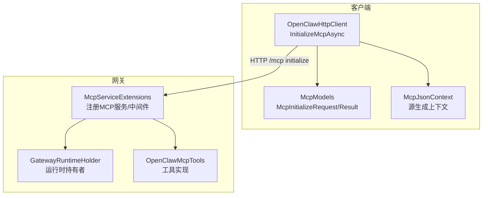
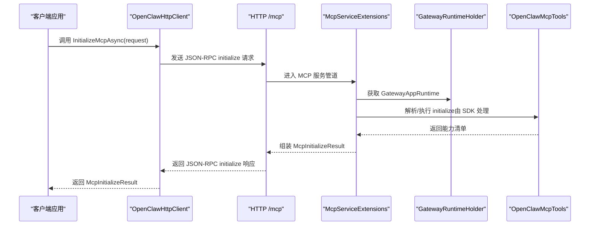
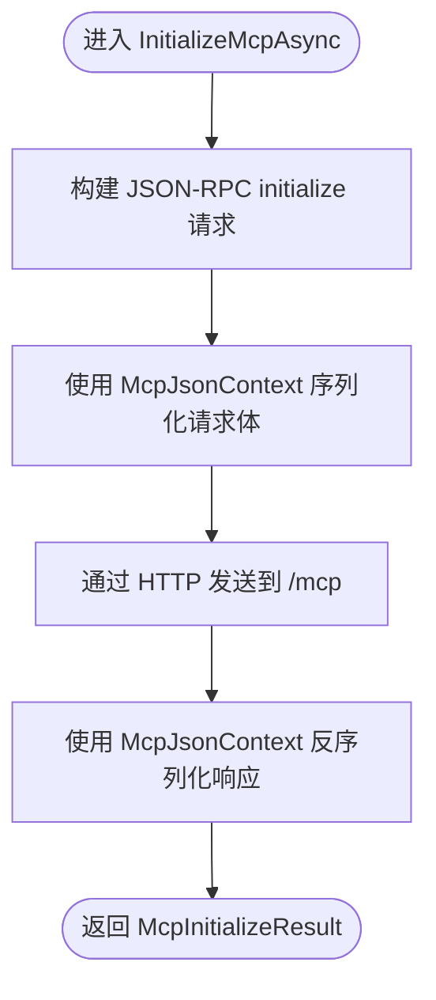
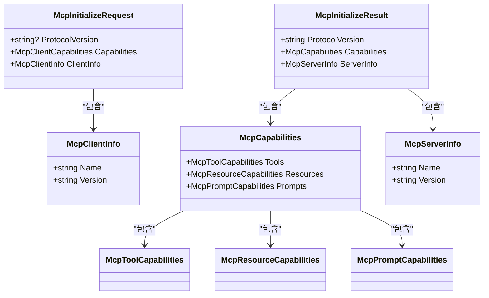
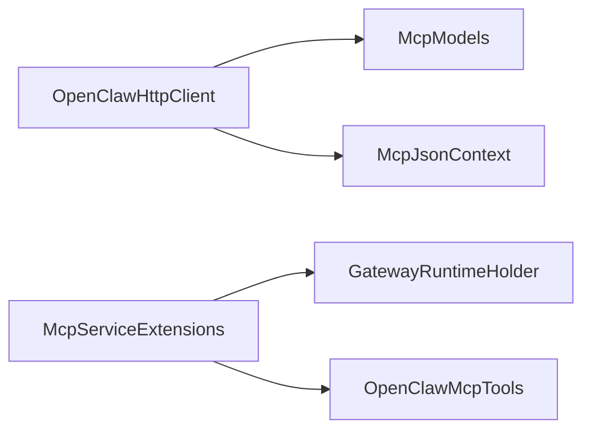

# MCP 初始化协议

<cite>
**本文档引用的文件**
- [McpModels.cs](file://src/OpenClaw.Client/McpModels.cs)
- [OpenClawHttpClient.cs](file://src/OpenClaw.Client/OpenClawHttpClient.cs)
- [McpJsonContext.cs](file://src/OpenClaw.Client/McpJsonContext.cs)
- [McpServiceExtensions.cs](file://src/OpenClaw.Gateway/Mcp/McpServiceExtensions.cs)
- [GatewayRuntimeHolder.cs](file://src/OpenClaw.Gateway/Mcp/GatewayRuntimeHolder.cs)
- [OpenClawMcpTools.cs](file://src/OpenClaw.Gateway/Mcp/OpenClawMcpTools.cs)
- [USER_GUIDE.md](file://docs/USER_GUIDE.md)
- [GatewayAdminEndpointTests.cs](file://src/OpenClaw.Tests/GatewayAdminEndpointTests.cs)
</cite>

## 目录
1. [简介](#简介)
2. [项目结构](#项目结构)
3. [核心组件](#核心组件)
4. [架构总览](#架构总览)
5. [详细组件分析](#详细组件分析)
6. [依赖关系分析](#依赖关系分析)
7. [性能考虑](#性能考虑)
8. [故障排除指南](#故障排除指南)
9. [结论](#结论)
10. [附录](#附录)

## 简介
本文件系统性阐述 OpenClaw 项目中 MCP（Model Context Protocol）初始化协议的实现与使用，重点覆盖以下方面：
- InitializeMcpAsync 方法的实现细节与调用流程
- McpInitializeRequest 与 McpInitializeResult 数据模型的结构、字段语义与用途
- 协议版本协商、客户端能力声明、服务器信息获取的关键步骤
- 完整的初始化示例与最佳实践
- 常见初始化失败原因与故障排除方法

## 项目结构
MCP 初始化协议在客户端与网关两端均有实现与集成：
- 客户端侧：通过 OpenClawHttpClient 暴露 InitializeMcpAsync，并以 McpModels 中的数据模型进行序列化/反序列化
- 网关侧：通过 McpServiceExtensions 注册 MCP 服务，设置 ServerInfo，并在运行时注入 GatewayRuntimeHolder

**图表来源**
- [OpenClawHttpClient.cs:262-263](file://src/OpenClaw.Client/OpenClawHttpClient.cs#L262-L263)
- [McpModels.cs:27-47](file://src/OpenClaw.Client/McpModels.cs#L27-L47)
- [McpJsonContext.cs:5-38](file://src/OpenClaw.Client/McpJsonContext.cs#L5-L38)
- [McpServiceExtensions.cs:20-55](file://src/OpenClaw.Gateway/Mcp/McpServiceExtensions.cs#L20-L55)
- [GatewayRuntimeHolder.cs:10-19](file://src/OpenClaw.Gateway/Mcp/GatewayRuntimeHolder.cs#L10-L19)
- [OpenClawMcpTools.cs:14-19](file://src/OpenClaw.Gateway/Mcp/OpenClawMcpTools.cs#L14-L19)

**章节来源**
- [OpenClawHttpClient.cs:262-263](file://src/OpenClaw.Client/OpenClawHttpClient.cs#L262-L263)
- [McpModels.cs:27-47](file://src/OpenClaw.Client/McpModels.cs#L27-L47)
- [McpJsonContext.cs:5-38](file://src/OpenClaw.Client/McpJsonContext.cs#L5-L38)
- [McpServiceExtensions.cs:20-55](file://src/OpenClaw.Gateway/Mcp/McpServiceExtensions.cs#L20-L55)
- [GatewayRuntimeHolder.cs:10-19](file://src/OpenClaw.Gateway/Mcp/GatewayRuntimeHolder.cs#L10-L19)
- [OpenClawMcpTools.cs:14-19](file://src/OpenClaw.Gateway/Mcp/OpenClawMcpTools.cs#L14-L19)

## 核心组件
- McpInitializeRequest：客户端向服务器发起初始化请求时携带的参数对象，包含协议版本、客户端能力声明、客户端信息
- McpInitializeResult：服务器返回的初始化结果，包含协议版本、能力清单、服务器信息
- OpenClawHttpClient.InitializeMcpAsync：客户端发起 initialize 请求的入口方法
- McpJsonContext：基于 System.Text.Json.SourceGeneration 的源生成上下文，确保高性能序列化/反序列化
- McpServiceExtensions：在网关侧注册 MCP 服务、设置 ServerInfo、注入运行时
- GatewayRuntimeHolder：延迟注入 GatewayAppRuntime 的单例持有者

**章节来源**
- [McpModels.cs:27-47](file://src/OpenClaw.Client/McpModels.cs#L27-L47)
- [OpenClawHttpClient.cs:262-263](file://src/OpenClaw.Client/OpenClawHttpClient.cs#L262-L263)
- [McpJsonContext.cs:5-38](file://src/OpenClaw.Client/McpJsonContext.cs#L5-L38)
- [McpServiceExtensions.cs:20-55](file://src/OpenClaw.Gateway/Mcp/McpServiceExtensions.cs#L20-L55)
- [GatewayRuntimeHolder.cs:10-19](file://src/OpenClaw.Gateway/Mcp/GatewayRuntimeHolder.cs#L10-L19)

## 架构总览
下图展示了从客户端到网关的初始化交互流程，以及数据模型在各层之间的传递。

**图表来源**
- [OpenClawHttpClient.cs:262-263](file://src/OpenClaw.Client/OpenClawHttpClient.cs#L262-L263)
- [McpServiceExtensions.cs:20-55](file://src/OpenClaw.Gateway/Mcp/McpServiceExtensions.cs#L20-L55)
- [GatewayRuntimeHolder.cs:10-19](file://src/OpenClaw.Gateway/Mcp/GatewayRuntimeHolder.cs#L10-L19)
- [OpenClawMcpTools.cs:14-19](file://src/OpenClaw.Gateway/Mcp/OpenClawMcpTools.cs#L14-L19)

## 详细组件分析

### InitializeMcpAsync 方法实现
- 入口：OpenClawHttpClient.InitializeMcpAsync 接收 McpInitializeRequest，内部通过 SendMcpAsync 将请求发送至 /mcp initialize
- 序列化：使用 McpJsonContext.Default.McpInitializeRequest 与 McpJsonContext.Default.McpInitializeResult 进行高效序列化/反序列化
- 返回：解析为 McpInitializeResult 并返回给调用方

**图表来源**
- [OpenClawHttpClient.cs:262-263](file://src/OpenClaw.Client/OpenClawHttpClient.cs#L262-L263)
- [McpJsonContext.cs:5-38](file://src/OpenClaw.Client/McpJsonContext.cs#L5-L38)

**章节来源**
- [OpenClawHttpClient.cs:262-263](file://src/OpenClaw.Client/OpenClawHttpClient.cs#L262-L263)
- [McpJsonContext.cs:5-38](file://src/OpenClaw.Client/McpJsonContext.cs#L5-L38)

### 数据模型：McpInitializeRequest 与 McpInitializeResult
- McpInitializeRequest 字段
  - ProtocolVersion：客户端期望使用的协议版本（如 "2025-03-26"）
  - Capabilities：客户端能力声明（类型为 McpClientCapabilities，当前为空占位）
  - ClientInfo：客户端标识（Name、Version）
- McpInitializeResult 字段
  - ProtocolVersion：服务器实际采用的协议版本
  - Capabilities：服务器能力清单（包含 Tools、Resources、Prompts 子能力）
  - ServerInfo：服务器标识（Name、Version）

**图表来源**
- [McpModels.cs:27-76](file://src/OpenClaw.Client/McpModels.cs#L27-L76)

**章节来源**
- [McpModels.cs:27-76](file://src/OpenClaw.Client/McpModels.cs#L27-L76)

### 协议版本协商与能力声明
- 版本协商：客户端通过 ProtocolVersion 指定期望版本；服务器在 McpInitializeResult 中返回实际采用的版本
- 能力声明：客户端 Capabilities 字段用于声明自身能力；服务器 Capabilities 字段用于声明其提供的工具、资源、提示等能力
- 服务器信息：ServerInfo 提供服务器名称与版本，便于客户端识别后端能力

**章节来源**
- [McpModels.cs:27-76](file://src/OpenClaw.Client/McpModels.cs#L27-L76)
- [McpServiceExtensions.cs:32-43](file://src/OpenClaw.Gateway/Mcp/McpServiceExtensions.cs#L32-L43)

### 网关侧初始化与运行时注入
- 服务注册：McpServiceExtensions.AddOpenClawMcpServices 在启动阶段注册 MCP 服务、HTTP 传输、工具/资源/提示提供者，并设置 ServerInfo
- 运行时注入：McpServiceExtensions.InitializeMcpRuntime 在运行时将 GatewayAppRuntime 注入 GatewayRuntimeHolder，确保后续工具调用可用
- 认证与限流：UseOpenClawMcpAuth 为 /mcp 路径添加与网关其他端点一致的认证与限流策略

**章节来源**
- [McpServiceExtensions.cs:20-91](file://src/OpenClaw.Gateway/Mcp/McpServiceExtensions.cs#L20-L91)
- [GatewayRuntimeHolder.cs:10-19](file://src/OpenClaw.Gateway/Mcp/GatewayRuntimeHolder.cs#L10-L19)

### 初始化示例与最佳实践
- 示例路径：用户指南中提供了完整的初始化与工具调用示例，包括构造 McpInitializeRequest、调用 InitializeMcpAsync、随后调用 openclaw.get_status 工具
- 最佳实践
  - 明确指定 ProtocolVersion，避免版本不匹配
  - 合理设置 ClientInfo 的 Name 与 Version，便于服务端日志与监控
  - 在非回环绑定场景下，确保 Authorization 头或相应认证机制已正确配置
  - 使用源生成上下文（McpJsonContext）提升序列化性能与类型安全

**章节来源**
- [USER_GUIDE.md:254-261](file://docs/USER_GUIDE.md#L254-L261)

## 依赖关系分析
- 客户端依赖
  - OpenClawHttpClient 依赖 McpModels 与 McpJsonContext
  - McpModels 作为数据契约，McpJsonContext 提供高性能序列化支持
- 网关依赖
  - McpServiceExtensions 依赖 ModelContextProtocol.AspNetCore 与内部运行时（GatewayRuntimeHolder）
  - OpenClawMcpTools 通过 IntegrationApiFacade 暴露具体工具能力

**图表来源**
- [OpenClawHttpClient.cs:262-263](file://src/OpenClaw.Client/OpenClawHttpClient.cs#L262-L263)
- [McpModels.cs:27-76](file://src/OpenClaw.Client/McpModels.cs#L27-L76)
- [McpJsonContext.cs:5-38](file://src/OpenClaw.Client/McpJsonContext.cs#L5-L38)
- [McpServiceExtensions.cs:20-55](file://src/OpenClaw.Gateway/Mcp/McpServiceExtensions.cs#L20-L55)
- [GatewayRuntimeHolder.cs:10-19](file://src/OpenClaw.Gateway/Mcp/GatewayRuntimeHolder.cs#L10-L19)
- [OpenClawMcpTools.cs:14-19](file://src/OpenClaw.Gateway/Mcp/OpenClawMcpTools.cs#L14-L19)

**章节来源**
- [OpenClawHttpClient.cs:262-263](file://src/OpenClaw.Client/OpenClawHttpClient.cs#L262-L263)
- [McpModels.cs:27-76](file://src/OpenClaw.Client/McpModels.cs#L27-L76)
- [McpJsonContext.cs:5-38](file://src/OpenClaw.Client/McpJsonContext.cs#L5-L38)
- [McpServiceExtensions.cs:20-55](file://src/OpenClaw.Gateway/Mcp/McpServiceExtensions.cs#L20-L55)
- [GatewayRuntimeHolder.cs:10-19](file://src/OpenClaw.Gateway/Mcp/GatewayRuntimeHolder.cs#L10-L19)
- [OpenClawMcpTools.cs:14-19](file://src/OpenClaw.Gateway/Mcp/OpenClawMcpTools.cs#L14-L19)

## 性能考虑
- 源生成序列化：McpJsonContext 使用 System.Text.Json.SourceGeneration，避免运行时反射开销，显著提升序列化/反序列化性能
- HTTP 传输：McpServiceExtensions 配置 MCP 使用无状态 HTTP 传输，降低连接管理复杂度
- 运行时注入：GatewayRuntimeHolder 采用单例持有运行时，避免重复初始化成本

**章节来源**
- [McpJsonContext.cs:34-38](file://src/OpenClaw.Client/McpJsonContext.cs#L34-L38)
- [McpServiceExtensions.cs:40-43](file://src/OpenClaw.Gateway/Mcp/McpServiceExtensions.cs#L40-L43)
- [GatewayRuntimeHolder.cs:10-19](file://src/OpenClaw.Gateway/Mcp/GatewayRuntimeHolder.cs#L10-L19)

## 故障排除指南
- 常见失败原因
  - 版本不匹配：客户端 ProtocolVersion 与服务器支持版本不兼容，需确认双方版本约定
  - 缺少认证：在非回环绑定场景下，未提供有效 Authorization 或令牌无效
  - 运行时未注入：GatewayRuntimeHolder.Runtime 未在运行前设置，导致工具调用失败
  - 网络/路由问题：/mcp 路由不可达或被中间件拦截
- 排查步骤
  - 校验初始化响应中的 ProtocolVersion 与 Capabilities，确认服务器能力
  - 检查 /mcp 访问是否通过认证与限流中间件
  - 确认 GatewayRuntimeHolder.Runtime 已正确注入
  - 参考测试用例中的初始化流程，比对请求/响应格式

**章节来源**
- [GatewayAdminEndpointTests.cs:5974-5990](file://src/OpenClaw.Tests/GatewayAdminEndpointTests.cs#L5974-L5990)
- [McpServiceExtensions.cs:52-55](file://src/OpenClaw.Gateway/Mcp/McpServiceExtensions.cs#L52-L55)
- [GatewayRuntimeHolder.cs:14-19](file://src/OpenClaw.Gateway/Mcp/GatewayRuntimeHolder.cs#L14-L19)

## 结论
MCP 初始化协议在 OpenClaw 中通过客户端与网关两侧的清晰分工得以实现：客户端负责构造请求与解析响应，网关负责注册服务、声明能力与注入运行时。借助源生成序列化与标准的 JSON-RPC 传输，初始化流程具备良好的性能与可维护性。遵循本文的最佳实践与故障排除建议，可有效提升初始化成功率与稳定性。

## 附录
- 初始化示例参考路径：用户指南中的初始化与工具调用示例
- 测试用例参考路径：GatewayAdminEndpointTests 中的 initialize 请求与响应断言

**章节来源**
- [USER_GUIDE.md:254-261](file://docs/USER_GUIDE.md#L254-L261)
- [GatewayAdminEndpointTests.cs:5974-5990](file://src/OpenClaw.Tests/GatewayAdminEndpointTests.cs#L5974-L5990)