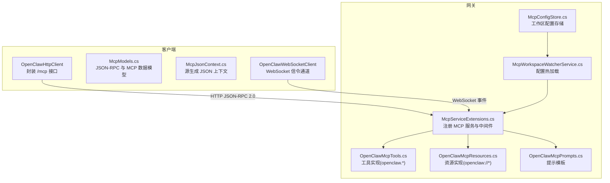
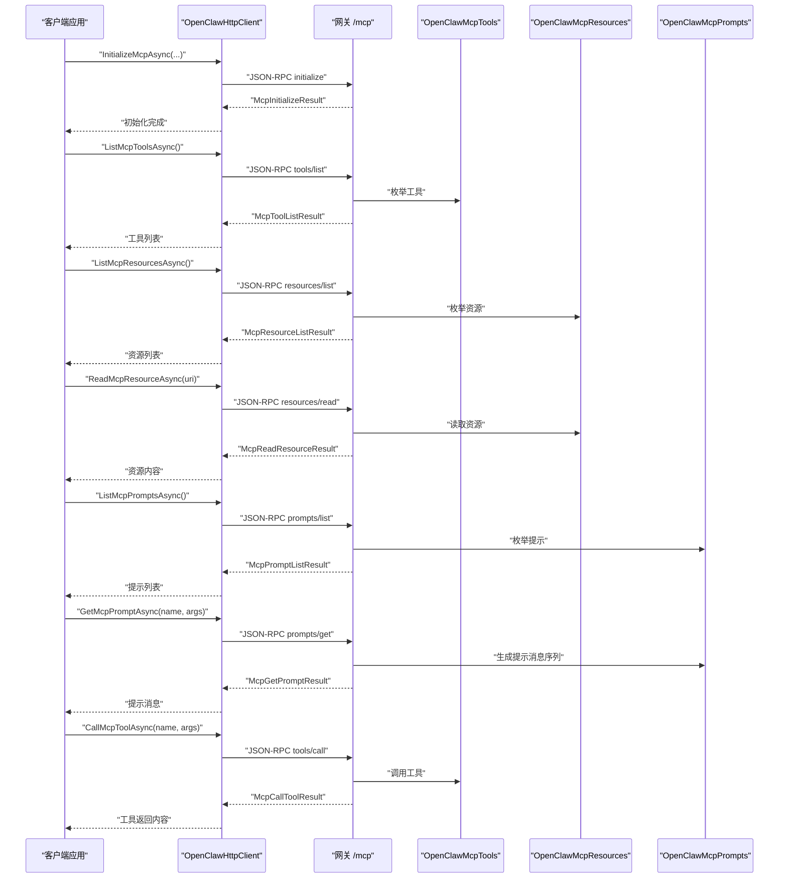
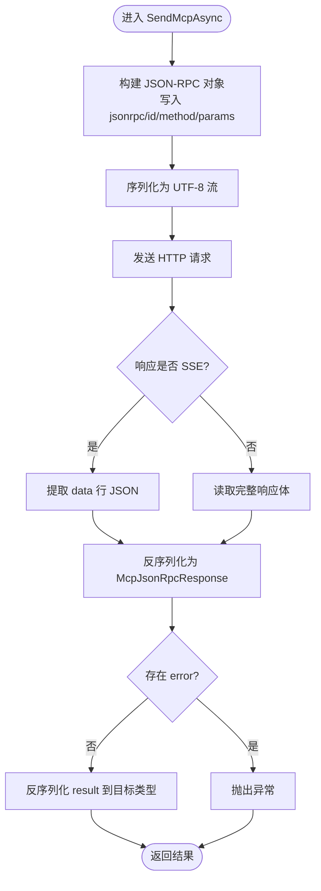
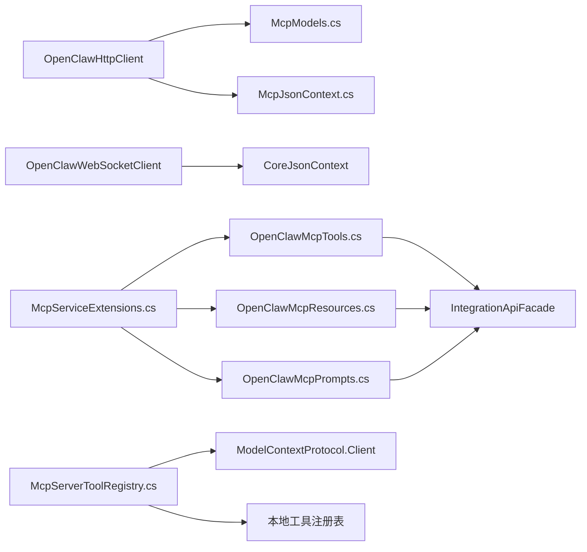

# MCP 协议支持

<cite>
**本文引用的文件**
- [McpModels.cs](file://src/OpenClaw.Client/McpModels.cs)
- [McpJsonContext.cs](file://src/OpenClaw.Client/McpJsonContext.cs)
- [OpenClawHttpClient.cs](file://src/OpenClaw.Client/OpenClawHttpClient.cs)
- [OpenClawWebSocketClient.cs](file://src/OpenClaw.Client/OpenClawWebSocketClient.cs)
- [OpenClawMcpTools.cs](file://src/OpenClaw.Gateway/Mcp/OpenClawMcpTools.cs)
- [OpenClawMcpResources.cs](file://src/OpenClaw.Gateway/Mcp/OpenClawMcpResources.cs)
- [OpenClawMcpPrompts.cs](file://src/OpenClaw.Gateway/Mcp/OpenClawMcpPrompts.cs)
- [McpServiceExtensions.cs](file://src/OpenClaw.Gateway/Mcp/McpServiceExtensions.cs)
- [McpServerToolRegistry.cs](file://src/OpenClaw.Agent/Plugins/McpServerToolRegistry.cs)
- [McpConfigStore.cs](file://src/OpenClaw.Gateway/Mcp/McpConfigStore.cs)
- [McpWorkspaceWatcherService.cs](file://src/OpenClaw.Gateway/McpWorkspaceWatcherService.cs)
- [GatewayAdminEndpointTests.cs](file://src/OpenClaw.Tests/GatewayAdminEndpointTests.cs)
</cite>

## 目录
1. [简介](#简介)
2. [项目结构](#项目结构)
3. [核心组件](#核心组件)
4. [架构总览](#架构总览)
5. [详细组件分析](#详细组件分析)
6. [依赖关系分析](#依赖关系分析)
7. [性能考虑](#性能考虑)
8. [故障排除指南](#故障排除指南)
9. [结论](#结论)
10. [附录](#附录)

## 简介
本文件面向 MCP（Model Context Protocol）协议在 OpenClaw 体系中的实现与使用，覆盖客户端与网关两端的关键能力：初始化、工具列表获取、资源管理、提示管理、工具调用等。文档重点解释以下核心方法的使用方式与消息格式：
- InitializeMcpAsync
- ListMcpToolsAsync
- ListMcpResourcesAsync
- ReadMcpResourceAsync
- ListMcpPromptsAsync
- GetMcpPromptAsync
- CallMcpToolAsync

同时，文档阐述 MCP 协议的消息格式、请求/响应结构以及 JSON 序列化机制，并提供可操作的使用示例与最佳实践，帮助读者在 AI 代理系统中高效集成与扩展 MCP 能力。

## 项目结构
MCP 支持横跨客户端与网关两部分：
- 客户端侧：定义 JSON-RPC 2.0 请求/响应模型、基于 System.Text.Json 的源生成上下文、HTTP/WebSocket 客户端封装，以及对 MCP 方法的高层封装。
- 网关侧：通过官方 MCP SDK 将内部集成 API 暴露为 MCP 工具、资源与提示；提供服务注册、认证与限流中间件；支持工作区配置热加载。

图表来源
- [OpenClawHttpClient.cs:262-320](file://src/OpenClaw.Client/OpenClawHttpClient.cs#L262-L320)
- [McpModels.cs:5-25](file://src/OpenClaw.Client/McpModels.cs#L5-L25)
- [McpJsonContext.cs:5-38](file://src/OpenClaw.Client/McpJsonContext.cs#L5-L38)
- [McpServiceExtensions.cs:20-46](file://src/OpenClaw.Gateway/Mcp/McpServiceExtensions.cs#L20-L46)
- [OpenClawMcpTools.cs:14-16](file://src/OpenClaw.Gateway/Mcp/OpenClawMcpTools.cs#L14-L16)
- [OpenClawMcpResources.cs:9-14](file://src/OpenClaw.Gateway/Mcp/OpenClawMcpResources.cs#L9-L14)
- [OpenClawMcpPrompts.cs:12-13](file://src/OpenClaw.Gateway/Mcp/OpenClawMcpPrompts.cs#L12-L13)
- [McpConfigStore.cs:53-89](file://src/OpenClaw.Gateway/Mcp/McpConfigStore.cs#L53-L89)
- [McpWorkspaceWatcherService.cs:105-126](file://src/OpenClaw.Gateway/McpWorkspaceWatcherService.cs#L105-L126)

章节来源
- [OpenClawHttpClient.cs:10-182](file://src/OpenClaw.Client/OpenClawHttpClient.cs#L10-L182)
- [McpModels.cs:1-187](file://src/OpenClaw.Client/McpModels.cs#L1-L187)
- [McpJsonContext.cs:1-39](file://src/OpenClaw.Client/McpJsonContext.cs#L1-L39)
- [McpServiceExtensions.cs:11-91](file://src/OpenClaw.Gateway/Mcp/McpServiceExtensions.cs#L11-L91)
- [OpenClawMcpTools.cs:14-319](file://src/OpenClaw.Gateway/Mcp/OpenClawMcpTools.cs#L14-L319)
- [OpenClawMcpResources.cs:9-116](file://src/OpenClaw.Gateway/Mcp/OpenClawMcpResources.cs#L9-L116)
- [OpenClawMcpPrompts.cs:12-71](file://src/OpenClaw.Gateway/Mcp/OpenClawMcpPrompts.cs#L12-L71)
- [McpConfigStore.cs:36-109](file://src/OpenClaw.Gateway/Mcp/McpConfigStore.cs#L36-L109)
- [McpWorkspaceWatcherService.cs:100-126](file://src/OpenClaw.Gateway/McpWorkspaceWatcherService.cs#L100-L126)

## 核心组件
- 客户端 JSON-RPC 与数据模型
  - JSON-RPC 2.0 请求/响应包装类，用于统一序列化与反序列化。
  - MCP 协议数据模型：初始化请求/结果、工具定义、资源定义、提示定义、工具调用请求/结果等。
- 客户端 HTTP/WebSocket 客户端
  - OpenClawHttpClient 提供 /mcp 的 JSON-RPC 方法封装，包括 InitializeMcpAsync、ListMcpToolsAsync、ListMcpResourcesAsync、ReadMcpResourceAsync、ListMcpPromptsAsync、GetMcpPromptAsync、CallMcpToolAsync。
  - OpenClawWebSocketClient 提供 WebSocket 事件通道，用于实时消息与事件订阅。
- 网关 MCP 服务
  - 通过 McpServiceExtensions 注册 MCP 服务器、工具、资源与提示类型。
  - OpenClawMcpTools、OpenClawMcpResources、OpenClawMcpPrompts 将内部集成 API 映射为 MCP 原生能力。
- 配置与热加载
  - McpConfigStore 与 McpWorkspaceWatcherService 支持工作区 MCP 服务器配置的持久化与热更新。

章节来源
- [McpModels.cs:5-187](file://src/OpenClaw.Client/McpModels.cs#L5-L187)
- [McpJsonContext.cs:5-38](file://src/OpenClaw.Client/McpJsonContext.cs#L5-L38)
- [OpenClawHttpClient.cs:262-320](file://src/OpenClaw.Client/OpenClawHttpClient.cs#L262-L320)
- [OpenClawWebSocketClient.cs:9-248](file://src/OpenClaw.Client/OpenClawWebSocketClient.cs#L9-L248)
- [McpServiceExtensions.cs:20-56](file://src/OpenClaw.Gateway/Mcp/McpServiceExtensions.cs#L20-L56)
- [OpenClawMcpTools.cs:14-319](file://src/OpenClaw.Gateway/Mcp/OpenClawMcpTools.cs#L14-L319)
- [OpenClawMcpResources.cs:9-116](file://src/OpenClaw.Gateway/Mcp/OpenClawMcpResources.cs#L9-L116)
- [OpenClawMcpPrompts.cs:12-71](file://src/OpenClaw.Gateway/Mcp/OpenClawMcpPrompts.cs#L12-L71)
- [McpConfigStore.cs:53-89](file://src/OpenClaw.Gateway/Mcp/McpConfigStore.cs#L53-L89)
- [McpWorkspaceWatcherService.cs:105-126](file://src/OpenClaw.Gateway/McpWorkspaceWatcherService.cs#L105-L126)

## 架构总览
MCP 在系统中的角色是“模型上下文协议”，将外部 MCP 服务器的能力以统一接口暴露给客户端或代理，同时网关将内部 API 转换为 MCP 工具/资源/提示，形成“外部 MCP → 网关 MCP → 内部 API”的桥接链路。

图表来源
- [OpenClawHttpClient.cs:262-320](file://src/OpenClaw.Client/OpenClawHttpClient.cs#L262-L320)
- [OpenClawMcpTools.cs:14-319](file://src/OpenClaw.Gateway/Mcp/OpenClawMcpTools.cs#L14-L319)
- [OpenClawMcpResources.cs:9-116](file://src/OpenClaw.Gateway/Mcp/OpenClawMcpResources.cs#L9-L116)
- [OpenClawMcpPrompts.cs:12-71](file://src/OpenClaw.Gateway/Mcp/OpenClawMcpPrompts.cs#L12-L71)

## 详细组件分析

### 客户端 JSON-RPC 与数据模型
- JSON-RPC 2.0 包装
  - 请求包含 jsonrpc、id、method、params 字段；响应包含 jsonrpc、id、result 或 error。
- MCP 数据模型
  - 初始化：McpInitializeRequest/McpInitializeResult，包含协议版本、能力声明、服务器信息。
  - 工具：McpToolDefinition、McpToolListResult、McpCallToolRequest、McpCallToolResult。
  - 资源：McpResourceDefinition、McpResourceListResult、McpResourceTemplateDefinition、McpResourceTemplateListResult、McpReadResourceRequest、McpReadResourceResult。
  - 提示：McpPromptDefinition、McpPromptListResult、McpGetPromptRequest、McpGetPromptResult、McpPromptMessage。
- JSON 源生成上下文
  - 使用 McpJsonContext 对上述类型进行源生成，确保高性能序列化与命名策略一致（小驼峰、忽略空值、不美化输出）。

章节来源
- [McpModels.cs:5-187](file://src/OpenClaw.Client/McpModels.cs#L5-L187)
- [McpJsonContext.cs:5-38](file://src/OpenClaw.Client/McpJsonContext.cs#L5-L38)

### 客户端 HTTP 客户端（OpenClawHttpClient）
- /mcp 终结点
  - 通过构造 /mcp URI 发起 JSON-RPC 2.0 请求。
- 核心方法
  - InitializeMcpAsync：发送 initialize 请求并返回初始化结果。
  - ListMcpToolsAsync：发送 tools/list 请求并返回工具列表。
  - ListMcpResourcesAsync：发送 resources/list 请求并返回资源列表。
  - ListMcpResourceTemplatesAsync：发送 resources/templates/list 请求并返回资源模板列表。
  - ReadMcpResourceAsync：发送 resources/read 请求并返回资源文本内容。
  - ListMcpPromptsAsync：发送 prompts/list 请求并返回提示列表。
  - GetMcpPromptAsync：发送 prompts/get 请求并返回提示消息序列。
  - CallMcpToolAsync：发送 tools/call 请求并返回工具调用结果。
- 通用发送逻辑
  - SendMcpAsync：构建 JSON-RPC 2.0 对象，写入 id 自增，按需写入 params，解析响应体，处理 SSE 场景下的 data 行。
  - SendMcpWithoutParamsAsync：无参数方法的便捷封装。
  - ExtractMcpResponseJsonAsync：从 SSE 响应中提取 JSON 文本。

图表来源
- [OpenClawHttpClient.cs:1253-1325](file://src/OpenClaw.Client/OpenClawHttpClient.cs#L1253-L1325)

章节来源
- [OpenClawHttpClient.cs:101-102](file://src/OpenClaw.Client/OpenClawHttpClient.cs#L101-L102)
- [OpenClawHttpClient.cs:262-320](file://src/OpenClaw.Client/OpenClawHttpClient.cs#L262-L320)
- [OpenClawHttpClient.cs:1253-1325](file://src/OpenClaw.Client/OpenClawHttpClient.cs#L1253-L1325)

### 客户端 WebSocket 客户端（OpenClawWebSocketClient）
- 连接与断开
  - ConnectAsync 支持设置 Bearer 认证头，断开时清理收发循环与资源。
- 事件接收
  - ReceiveLoopAsync 循环接收消息，按结束标记拼接完整文本，触发 OnTextMessage 与 OnEnvelopeReceived。
- 发送
  - SendEnvelopeAsync 序列化并发送消息，限制最大消息大小，保证并发安全。

章节来源
- [OpenClawWebSocketClient.cs:38-248](file://src/OpenClaw.Client/OpenClawWebSocketClient.cs#L38-L248)

### 网关 MCP 服务注册与中间件
- 服务注册
  - AddOpenClawMcpServices：注册 GatewayRuntimeHolder、IntegrationApiFacade，添加 MCP 服务器（含 HTTP 传输），并注册工具、资源、提示类型。
  - InitializeMcpRuntime：在运行时创建后填充 GatewayRuntimeHolder。
  - UseOpenClawMcpAuth：对 /mcp 请求强制授权与速率限制。
- 服务器信息
  - ServerInfo 名称为 “OpenClaw Gateway MCP”，版本为 “1.0.0”。

章节来源
- [McpServiceExtensions.cs:20-56](file://src/OpenClaw.Gateway/Mcp/McpServiceExtensions.cs#L20-L56)

### 网关 MCP 工具（OpenClawMcpTools）
- 工具命名
  - 以 openclaw.* 命名，兼容现有客户端约定。
- 工具职责
  - 获取仪表盘、状态、审批、审计、会话、工作流、消息队列等内部 API 的快照或执行结果。
- 参数与返回
  - 大多返回序列化后的 JSON 字符串，便于 MCP 客户端直接消费。

章节来源
- [OpenClawMcpTools.cs:14-319](file://src/OpenClaw.Gateway/Mcp/OpenClawMcpTools.cs#L14-L319)

### 网关 MCP 资源（OpenClawMcpResources）
- 资源命名与模板
  - 使用 openclaw://* URI 模板，如 openclaw://status、openclaw://sessions/{sessionId} 等。
- 资源职责
  - 返回状态快照、仪表盘、审批、审计、会话详情、自动化等 JSON 快照。
- 错误处理
  - 未找到会话或自动化时抛出 KeyNotFoundException。

章节来源
- [OpenClawMcpResources.cs:9-116](file://src/OpenClaw.Gateway/Mcp/OpenClawMcpResources.cs#L9-L116)

### 网关 MCP 提示（OpenClawMcpPrompts）
- 提示模板
  - openclaw_operator_summary：引导模型总结网关健康状况。
  - openclaw_session_summary：引导模型总结指定会话。
- 输出结构
  - 返回包含描述与消息序列的 GetPromptResult，消息由角色与文本内容块组成。

章节来源
- [OpenClawMcpPrompts.cs:12-71](file://src/OpenClaw.Gateway/Mcp/OpenClawMcpPrompts.cs#L12-L71)

### 客户端到网关的 MCP 工具注册（代理侧）
- 动态发现与注册
  - McpServerToolRegistry：根据配置连接 MCP 服务器，列出工具，将远程工具包装为本地工具并注册。
- 传输与认证
  - 支持 stdio 与 http 两种传输；http 传输支持自定义头部与环境变量解析。
- 命名与模式
  - 通过前缀与远程名称组合生成本地工具名，保留输入模式文本以便工具调用。

章节来源
- [McpServerToolRegistry.cs:16-369](file://src/OpenClaw.Agent/Plugins/McpServerToolRegistry.cs#L16-L369)

### 工作区 MCP 配置与热加载
- 配置存储
  - McpConfigStore：原子写入与读取，支持 Enabled=false 视为空配置。
- 热加载
  - McpWorkspaceWatcherService：优先从内存存储加载，失败则回退到工作区文件；支持增量更新。

章节来源
- [McpConfigStore.cs:53-89](file://src/OpenClaw.Gateway/Mcp/McpConfigStore.cs#L53-L89)
- [McpWorkspaceWatcherService.cs:105-126](file://src/OpenClaw.Gateway/McpWorkspaceWatcherService.cs#L105-L126)

## 依赖关系分析
- 客户端依赖
  - OpenClawHttpClient 依赖 McpModels 与 McpJsonContext，通过 SendMcpAsync 统一发送 JSON-RPC 请求。
  - OpenClawWebSocketClient 依赖 CoreJsonContext（用于 WebSocket 信令）。
- 网关依赖
  - McpServiceExtensions 依赖 ModelContextProtocol.AspNetCore 与内部 IntegrationApiFacade。
  - OpenClawMcpTools/Resources/Prompts 依赖 IntegrationApiFacade 与 CoreJsonContext。
- 代理侧依赖
  - McpServerToolRegistry 依赖 ModelContextProtocol.Client 与内部工具抽象，动态桥接 MCP 服务器能力。

图表来源
- [OpenClawHttpClient.cs:262-320](file://src/OpenClaw.Client/OpenClawHttpClient.cs#L262-L320)
- [McpModels.cs:5-187](file://src/OpenClaw.Client/McpModels.cs#L5-L187)
- [McpJsonContext.cs:5-38](file://src/OpenClaw.Client/McpJsonContext.cs#L5-L38)
- [OpenClawWebSocketClient.cs:132-132](file://src/OpenClaw.Client/OpenClawWebSocketClient.cs#L132-L132)
- [McpServiceExtensions.cs:26-30](file://src/OpenClaw.Gateway/Mcp/McpServiceExtensions.cs#L26-L30)
- [OpenClawMcpTools.cs:17-19](file://src/OpenClaw.Gateway/Mcp/OpenClawMcpTools.cs#L17-L19)
- [OpenClawMcpResources.cs:12-14](file://src/OpenClaw.Gateway/Mcp/OpenClawMcpResources.cs#L12-L14)
- [OpenClawMcpPrompts.cs:14-15](file://src/OpenClaw.Gateway/Mcp/OpenClawMcpPrompts.cs#L14-L15)
- [McpServerToolRegistry.cs:16-36](file://src/OpenClaw.Agent/Plugins/McpServerToolRegistry.cs#L16-L36)

章节来源
- [OpenClawHttpClient.cs:262-320](file://src/OpenClaw.Client/OpenClawHttpClient.cs#L262-L320)
- [McpServiceExtensions.cs:26-30](file://src/OpenClaw.Gateway/Mcp/McpServiceExtensions.cs#L26-L30)
- [McpServerToolRegistry.cs:16-36](file://src/OpenClaw.Agent/Plugins/McpServerToolRegistry.cs#L16-L36)

## 性能考虑
- JSON 源生成
  - 使用 McpJsonContext 与 CoreJsonContext 进行源生成，避免反射带来的序列化开销。
- 流式与 SSE
  - SendMcpAsync 支持从 SSE 响应中提取 data 行，减少额外解析成本。
- 并发与锁
  - OpenClawWebSocketClient 使用发送锁与状态锁，确保并发安全与资源释放。
- 传输选择
  - 代理侧支持 http 与 stdio 传输，建议在本地进程内优先 stdio，在远端服务优先 http 并合理设置超时。

## 故障排除指南
- 初始化失败
  - 检查 /mcp 终端点可达性与授权中间件是否生效；参考测试用例验证 initialize 正常返回。
- 工具/资源/提示列表为空
  - 确认网关已正确注册工具、资源与提示类型；检查 IntegrationApiFacade 是否可用。
- WebSocket 连接问题
  - 确认 Bearer 头设置正确；检查 OnError 事件与断线重连逻辑。
- 配置未生效
  - 检查 McpConfigStore 是否成功保存；确认 McpWorkspaceWatcherService 是否正确加载内存存储或工作区文件。

章节来源
- [GatewayAdminEndpointTests.cs:5973-6001](file://src/OpenClaw.Tests/GatewayAdminEndpointTests.cs#L5973-L6001)
- [OpenClawWebSocketClient.cs:158-227](file://src/OpenClaw.Client/OpenClawWebSocketClient.cs#L158-L227)
- [McpConfigStore.cs:92-108](file://src/OpenClaw.Gateway/Mcp/McpConfigStore.cs#L92-L108)
- [McpWorkspaceWatcherService.cs:105-126](file://src/OpenClaw.Gateway/McpWorkspaceWatcherService.cs#L105-L126)

## 结论
MCP 协议在 OpenClaw 中实现了“外部 MCP 服务器 → 网关 MCP → 内部 API”的统一桥接，既允许客户端通过标准 JSON-RPC 2.0 与网关交互，也允许代理侧自动发现并注册外部 MCP 工具，极大增强了系统的可扩展性与互操作性。通过源生成 JSON 上下文与统一的发送逻辑，客户端在保持简洁的同时获得高性能与强类型保障；网关侧通过服务注册与中间件确保安全与稳定。

## 附录

### MCP 方法使用示例（步骤说明）
- 与 MCP 服务器建立连接
  - 使用 OpenClawHttpClient.InitializeMcpAsync 发送 initialize 请求，校验返回的 Capabilities 与 ServerInfo。
- 获取工具列表
  - 调用 ListMcpToolsAsync，解析 McpToolListResult 中的工具定义，记录工具名称与输入模式。
- 获取资源列表与读取资源
  - 调用 ListMcpResourcesAsync，随后对每个资源调用 ReadMcpResourceAsync，解析 McpReadResourceResult。
- 获取提示列表与执行提示
  - 调用 ListMcpPromptsAsync，再调用 GetMcpPromptAsync 获取提示消息序列，作为模型输入。
- 调用工具
  - 准备 JsonElement 作为参数，调用 CallMcpToolAsync，解析 McpCallToolResult 的内容数组。

章节来源
- [OpenClawHttpClient.cs:262-320](file://src/OpenClaw.Client/OpenClawHttpClient.cs#L262-L320)
- [McpModels.cs:91-187](file://src/OpenClaw.Client/McpModels.cs#L91-L187)

### MCP 协议消息格式与 JSON 序列化要点
- JSON-RPC 2.0
  - 请求字段：jsonrpc、id、method、params。
  - 响应字段：jsonrpc、id、result 或 error。
- 序列化策略
  - 小驼峰命名、忽略空值、不美化输出，确保与 MCP 官方实现一致。
- 客户端发送流程
  - 构建请求对象 → 写入 id 自增 → 可选写入 params → 解析响应体 → 处理 SSE data 行 → 反序列化结果。

章节来源
- [McpModels.cs:5-25](file://src/OpenClaw.Client/McpModels.cs#L5-L25)
- [McpJsonContext.cs:34-38](file://src/OpenClaw.Client/McpJsonContext.cs#L34-L38)
- [OpenClawHttpClient.cs:1253-1325](file://src/OpenClaw.Client/OpenClawHttpClient.cs#L1253-L1325)