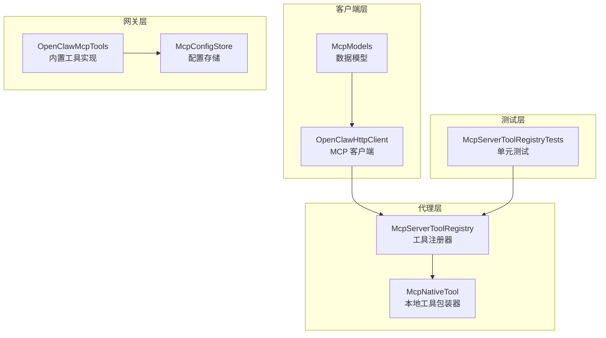
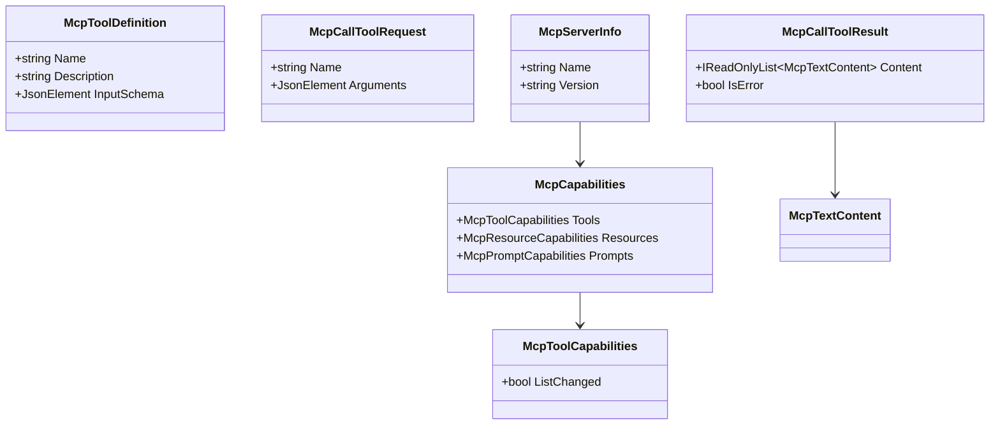
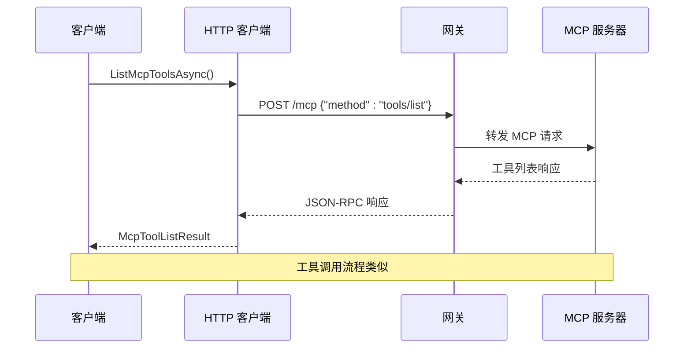
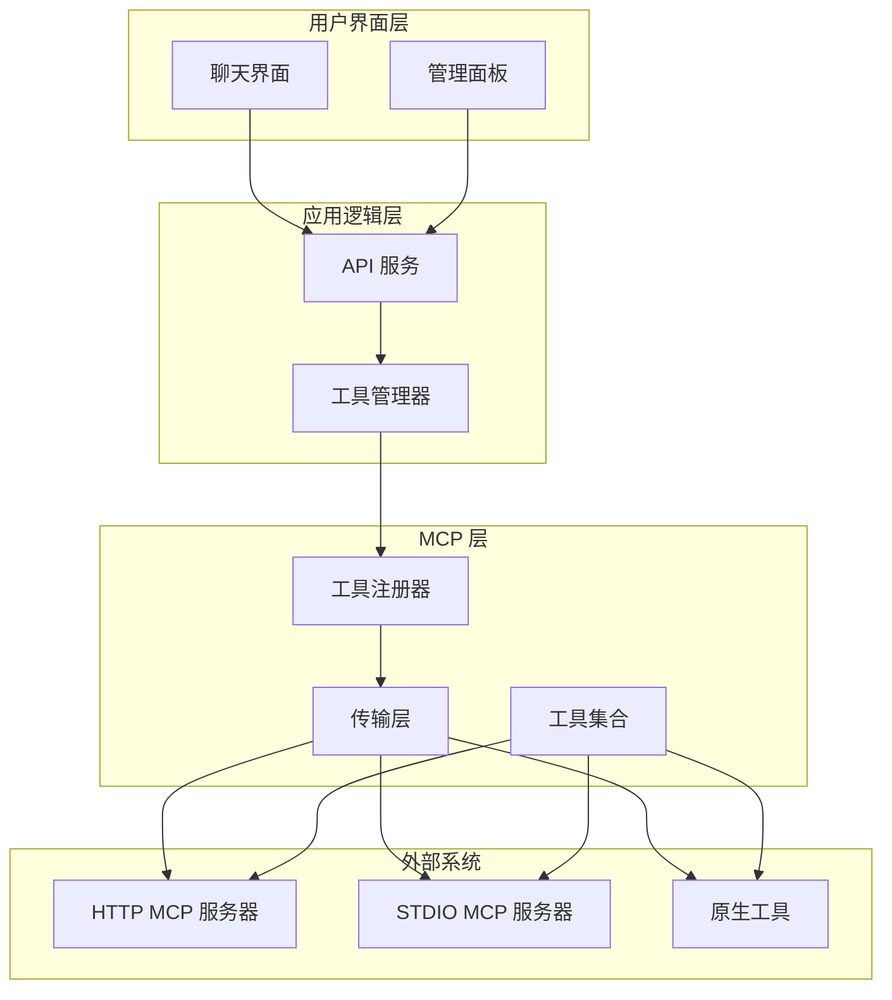
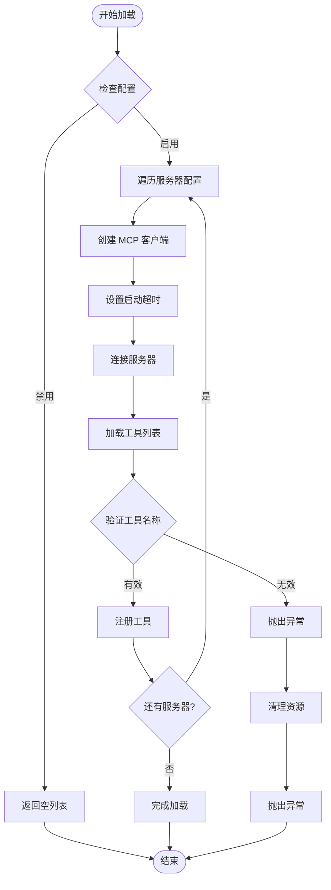
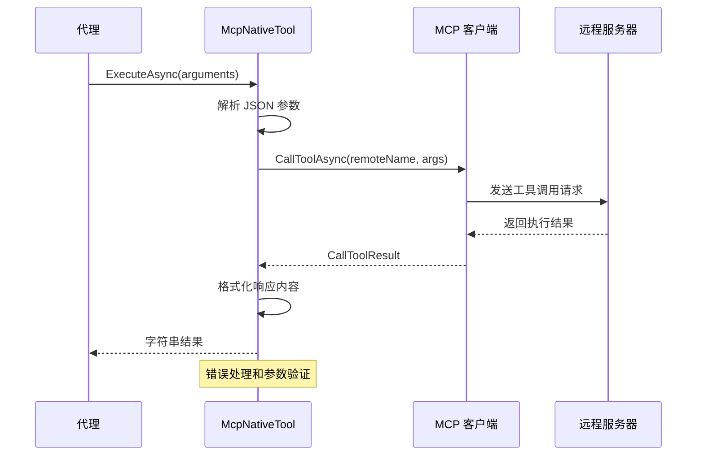
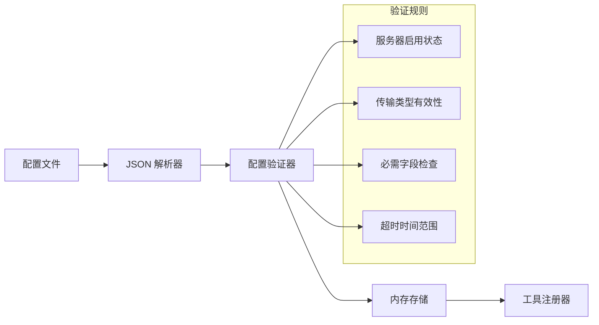
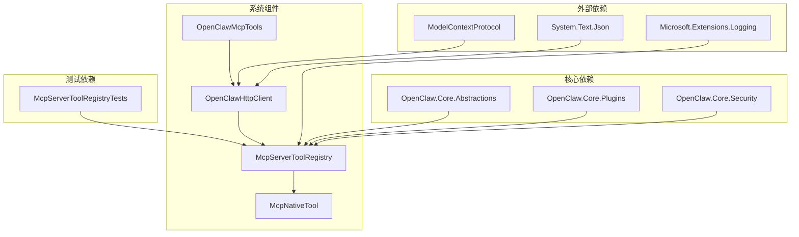

# MCP 工具管理

<cite>
**本文档引用的文件**
- [McpModels.cs](file://src/OpenClaw.Client/McpModels.cs)
- [OpenClawHttpClient.cs](file://src/OpenClaw.Client/OpenClawHttpClient.cs)
- [McpServerToolRegistry.cs](file://src/OpenClaw.Agent/Plugins/McpServerToolRegistry.cs)
- [McpNativeTool.cs](file://src/OpenClaw.Agent/Tools/McpNativeTool.cs)
- [OpenClawMcpTools.cs](file://src/OpenClaw.Gateway/Mcp/OpenClawMcpTools.cs)
- [McpConfigStore.cs](file://src/OpenClaw.Gateway/Mcp/McpConfigStore.cs)
- [McpServerToolRegistryTests.cs](file://src/OpenClaw.Tests/McpServerToolRegistryTests.cs)
</cite>

## 目录
1. [简介](#简介)
2. [项目结构](#项目结构)
3. [核心组件](#核心组件)
4. [架构概览](#架构概览)
5. [详细组件分析](#详细组件分析)
6. [依赖关系分析](#依赖关系分析)
7. [性能考虑](#性能考虑)
8. [故障排除指南](#故障排除指南)
9. [结论](#结论)

## 简介

MCP（Model Context Protocol）工具管理系统是 OpenClaw 框架中的重要组成部分，负责管理和协调外部 MCP 服务器提供的工具服务。该系统实现了标准化的工具发现、注册、调用和管理功能，支持多种传输协议（HTTP 和 STDIO），为 AI 代理提供了丰富的外部工具集成能力。

系统的核心目标是：
- 自动发现和注册来自 MCP 服务器的工具
- 提供统一的工具调用接口
- 实现工具权限控制和安全验证
- 支持工具参数验证和错误处理
- 提供工具生命周期管理

## 项目结构

MCP 工具管理系统在代码库中分布于多个关键模块：



**图表来源**
- [OpenClawHttpClient.cs:10-182](file://src/OpenClaw.Client/OpenClawHttpClient.cs#L10-L182)
- [McpServerToolRegistry.cs:16-36](file://src/OpenClaw.Agent/Plugins/McpServerToolRegistry.cs#L16-L36)
- [McpNativeTool.cs:9-18](file://src/OpenClaw.Agent/Tools/McpNativeTool.cs#L9-L18)
- [OpenClawMcpTools.cs:14-19](file://src/OpenClaw.Gateway/Mcp/OpenClawMcpTools.cs#L14-L19)

**章节来源**
- [OpenClawHttpClient.cs:10-182](file://src/OpenClaw.Client/OpenClawHttpClient.cs#L10-L182)
- [McpServerToolRegistry.cs:16-36](file://src/OpenClaw.Agent/Plugins/McpServerToolRegistry.cs#L16-L36)

## 核心组件

### 数据模型层

系统定义了完整的 MCP 协议数据模型，包括工具定义、调用请求和响应格式：



**图表来源**
- [McpModels.cs:49-94](file://src/OpenClaw.Client/McpModels.cs#L49-L94)

### 客户端通信层

OpenClawHttpClient 提供了完整的 MCP 协议客户端实现，支持所有标准 MCP 方法：



**图表来源**
- [OpenClawHttpClient.cs:262-320](file://src/OpenClaw.Client/OpenClawHttpClient.cs#L262-L320)

**章节来源**
- [McpModels.cs:49-94](file://src/OpenClaw.Client/McpModels.cs#L49-L94)
- [OpenClawHttpClient.cs:262-320](file://src/OpenClaw.Client/OpenClawHttpClient.cs#L262-L320)

## 架构概览

MCP 工具管理系统采用分层架构设计，确保了良好的模块分离和可扩展性：



**图表来源**
- [McpServerToolRegistry.cs:16-36](file://src/OpenClaw.Agent/Plugins/McpServerToolRegistry.cs#L16-L36)
- [OpenClawMcpTools.cs:14-19](file://src/OpenClaw.Gateway/Mcp/OpenClawMcpTools.cs#L14-L19)

## 详细组件分析

### 工具注册器 (McpServerToolRegistry)

工具注册器是 MCP 系统的核心组件，负责与外部 MCP 服务器建立连接并注册可用工具：



**图表来源**
- [McpServerToolRegistry.cs:78-138](file://src/OpenClaw.Agent/Plugins/McpServerToolRegistry.cs#L78-L138)

工具注册器的关键特性：
- **并发控制**：使用信号量确保线程安全
- **错误恢复**：自动清理已创建的客户端连接
- **工具命名**：支持自定义工具前缀和名称规范化
- **传输支持**：同时支持 HTTP 和 STDIO 传输协议

**章节来源**
- [McpServerToolRegistry.cs:78-138](file://src/OpenClaw.Agent/Plugins/McpServerToolRegistry.cs#L78-L138)

### 本地工具包装器 (McpNativeTool)

McpNativeTool 将远程 MCP 工具包装成本地工具，提供统一的执行接口：



**图表来源**
- [McpNativeTool.cs:20-70](file://src/OpenClaw.Agent/Tools/McpNativeTool.cs#L20-L70)

**章节来源**
- [McpNativeTool.cs:20-70](file://src/OpenClaw.Agent/Tools/McpNativeTool.cs#L20-L70)

### 内置 MCP 工具 (OpenClawMcpTools)

网关层提供了多个内置 MCP 工具，用于系统管理和监控：

| 工具名称 | 功能描述 | 只读模式 |
|---------|----------|----------|
| openclaw.get_dashboard | 获取运营仪表板快照 | 是 |
| openclaw.get_status | 获取网关运行状态 | 是 |
| openclaw.list_approvals | 列出待审批的工具请求 | 是 |
| openclaw.get_approval_history | 获取审批历史记录 | 是 |
| openclaw.list_sessions | 列出会话信息 | 是 |
| openclaw.run_workflow | 启动工作流执行 | 否 |
| openclaw.send_message | 入站消息队列 | 否 |

**章节来源**
- [OpenClawMcpTools.cs:21-318](file://src/OpenClaw.Gateway/Mcp/OpenClawMcpTools.cs#L21-L318)

### 配置管理 (McpConfigStore)

配置存储负责从文件系统加载和管理 MCP 服务器配置：



**图表来源**
- [McpConfigStore.cs:53-77](file://src/OpenClaw.Gateway/Mcp/McpConfigStore.cs#L53-L77)

**章节来源**
- [McpConfigStore.cs:53-77](file://src/OpenClaw.Gateway/Mcp/McpConfigStore.cs#L53-L77)

## 依赖关系分析

MCP 工具管理系统展现了清晰的依赖层次结构：



**图表来源**
- [McpServerToolRegistry.cs:1-10](file://src/OpenClaw.Agent/Plugins/McpServerToolRegistry.cs#L1-L10)
- [OpenClawHttpClient.cs:1-8](file://src/OpenClaw.Client/OpenClawHttpClient.cs#L1-L8)

**章节来源**
- [McpServerToolRegistry.cs:1-10](file://src/OpenClaw.Agent/Plugins/McpServerToolRegistry.cs#L1-L10)
- [OpenClawHttpClient.cs:1-8](file://src/OpenClaw.Client/OpenClawHttpClient.cs#L1-L8)

## 性能考虑

MCP 工具管理系统在设计时充分考虑了性能优化：

### 连接管理
- **连接池复用**：同一服务器的多个工具共享 MCP 客户端连接
- **超时控制**：独立的启动超时和请求超时配置
- **并发限制**：使用信号量控制并发加载操作

### 缓存策略
- **工具列表缓存**：避免重复查询相同的工具定义
- **配置缓存**：减少频繁的文件系统访问
- **响应缓存**：对静态资源和配置进行缓存

### 内存优化
- **流式处理**：大响应体采用流式处理避免内存峰值
- **对象重用**：复用 JSON 解析器和序列化器实例
- **异步操作**：全面使用异步 I/O 操作

## 故障排除指南

### 常见问题及解决方案

#### 工具发现失败
**症状**：工具注册器无法连接到 MCP 服务器
**诊断步骤**：
1. 检查服务器配置是否正确启用
2. 验证网络连接和端点可达性
3. 查看启动超时设置是否合理

**解决方法**：
```csharp
// 增加启动超时时间
config.Servers["server1"].StartupTimeoutSeconds = 30;

// 检查传输配置
config.Servers["server1"].Transport = "http"; // 或 "stdio"
```

#### 工具调用超时
**症状**：工具执行长时间无响应
**诊断步骤**：
1. 检查工具执行时间
2. 验证请求超时设置
3. 监控服务器负载情况

**解决方法**：
```csharp
// 为特定工具设置更长的超时
config.Servers["server1"].RequestTimeoutSeconds = 60;
```

#### 参数验证错误
**症状**：工具调用返回参数验证错误
**诊断步骤**：
1. 检查工具输入模式定义
2. 验证传入参数的 JSON 结构
3. 确认必需参数是否完整

**解决方法**：
```csharp
// 使用正确的参数格式
var arguments = new JsonObject
{
    ["requiredParam"] = "value",
    ["optionalParam"] = 123
};
```

**章节来源**
- [McpServerToolRegistryTests.cs:225-289](file://src/OpenClaw.Tests/McpServerToolRegistryTests.cs#L225-L289)

## 结论

MCP 工具管理系统展现了优秀的架构设计和实现质量。通过分层架构、清晰的职责分离和完善的错误处理机制，系统为 AI 代理提供了强大而灵活的工具集成能力。

### 主要优势
- **模块化设计**：各组件职责明确，易于维护和扩展
- **协议兼容**：完全符合 MCP 标准，支持多种传输协议
- **安全性**：内置权限控制和参数验证机制
- **性能优化**：多层缓存和异步处理提升响应速度
- **可观测性**：完整的日志记录和错误报告

### 技术亮点
- 统一的工具抽象层，简化了工具使用的复杂性
- 灵活的配置系统，支持动态服务器发现和热重载
- 完善的错误处理和恢复机制
- 详细的测试覆盖，确保系统稳定性

该系统为构建复杂的 AI 代理应用奠定了坚实的基础，通过标准化的工具管理接口，开发者可以轻松集成各种外部工具和服务。