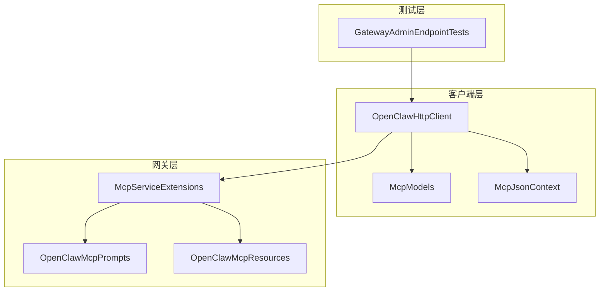
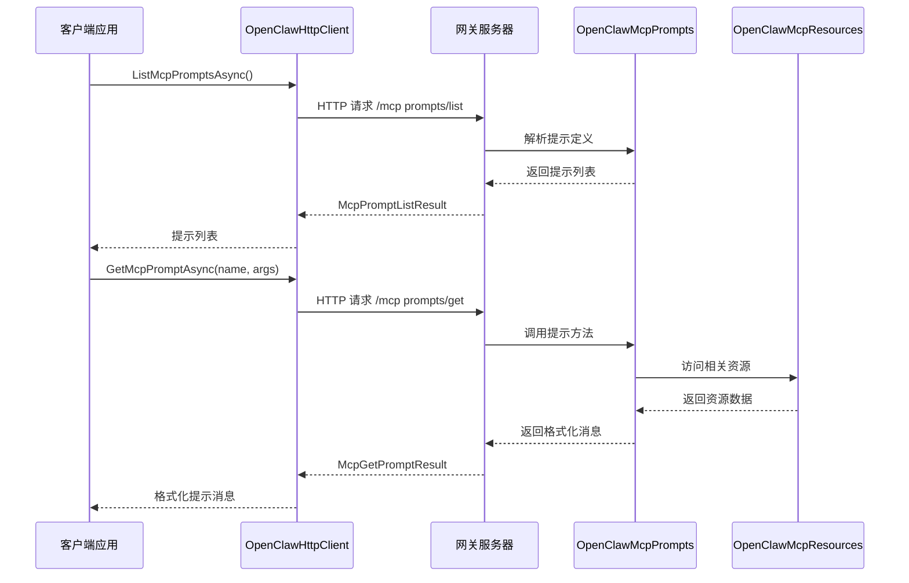
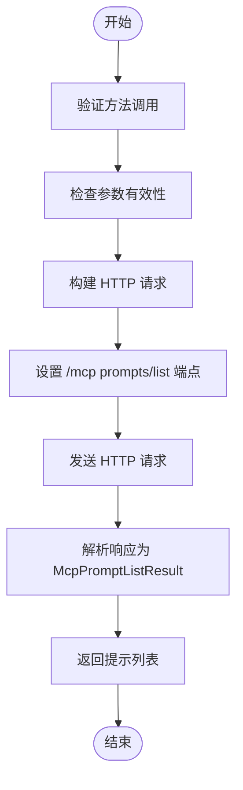
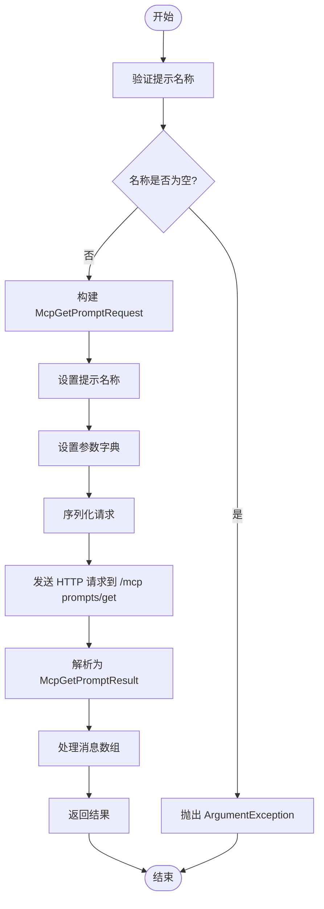
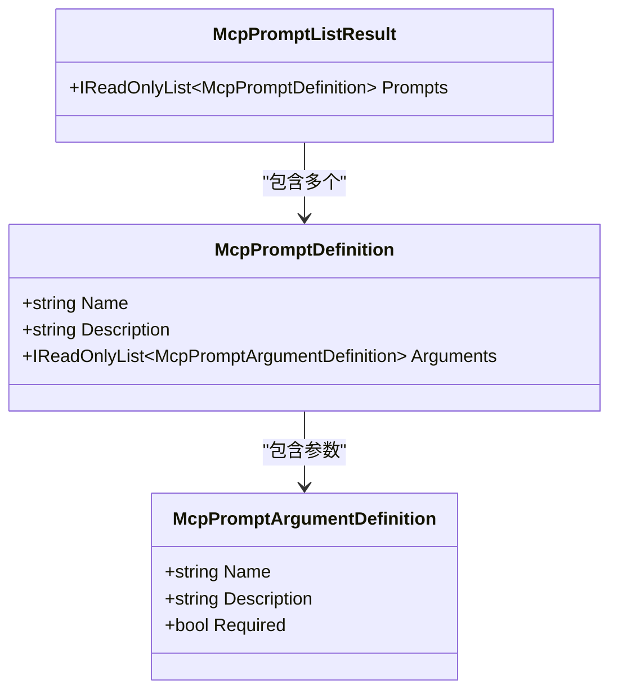
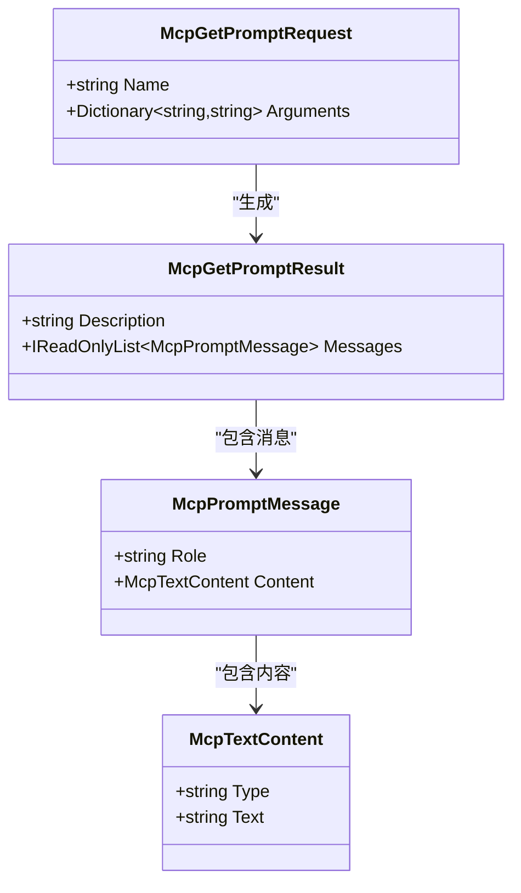
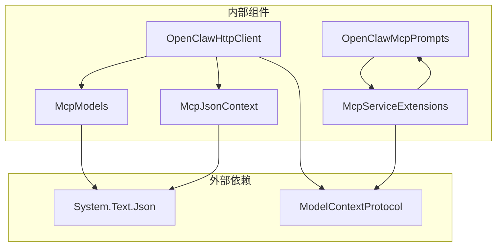

# MCP 提示管理

<cite>
**本文档引用的文件**
- [OpenClawHttpClient.cs](file://src/OpenClaw.Client/OpenClawHttpClient.cs)
- [McpModels.cs](file://src/OpenClaw.Client/McpModels.cs)
- [McpJsonContext.cs](file://src/OpenClaw.Client/McpJsonContext.cs)
- [OpenClawMcpPrompts.cs](file://src/OpenClaw.Gateway/Mcp/OpenClawMcpPrompts.cs)
- [McpServiceExtensions.cs](file://src/OpenClaw.Gateway/Mcp/McpServiceExtensions.cs)
- [OpenClawMcpResources.cs](file://src/OpenClaw.Gateway/Mcp/OpenClawMcpResources.cs)
- [GatewayAdminEndpointTests.cs](file://src/OpenClaw.Tests/GatewayAdminEndpointTests.cs)
</cite>

## 目录
1. [简介](#简介)
2. [项目结构](#项目结构)
3. [核心组件](#核心组件)
4. [架构概览](#架构概览)
5. [详细组件分析](#详细组件分析)
6. [依赖关系分析](#依赖关系分析)
7. [性能考虑](#性能考虑)
8. [故障排除指南](#故障排除指南)
9. [结论](#结论)
10. [附录](#附录)

## 简介

MCP（Model Context Protocol）提示管理系统是 OpenClaw 框架中的重要组成部分，它提供了基于模板的提示生成机制。该系统通过 ModelContextProtocol 协议实现了提示的发现、获取和管理功能，支持动态参数绑定和消息格式化。

系统的核心特性包括：
- 基于模板的提示生成，不执行任何 I/O 操作
- 支持动态参数绑定和占位符替换
- 提供预定义的提示模板集合
- 完整的消息序列生成能力
- 与资源系统的无缝集成

## 项目结构

MCP 提示管理系统在项目中采用分层架构设计，主要分布在以下模块：



**图表来源**
- [OpenClawHttpClient.cs:10-182](file://src/OpenClaw.Client/OpenClawHttpClient.cs#L10-L182)
- [McpServiceExtensions.cs:20-46](file://src/OpenClaw.Gateway/Mcp/McpServiceExtensions.cs#L20-L46)
- [OpenClawMcpPrompts.cs:12-13](file://src/OpenClaw.Gateway/Mcp/OpenClawMcpPrompts.cs#L12-L13)

**章节来源**
- [OpenClawHttpClient.cs:10-182](file://src/OpenClaw.Client/OpenClawHttpClient.cs#L10-L182)
- [McpServiceExtensions.cs:11-46](file://src/OpenClaw.Gateway/Mcp/McpServiceExtensions.cs#L11-L46)

## 核心组件

### 客户端组件

#### OpenClawHttpClient
客户端核心类，提供完整的 MCP 提示管理接口：
- `ListMcpPromptsAsync()`: 获取所有可用提示列表
- `GetMcpPromptAsync()`: 获取指定提示内容
- 内置参数验证和错误处理
- 支持异步操作和取消令牌

#### McpModels 数据模型
定义了完整的 MCP 协议数据结构：
- `McpPromptDefinition`: 提示定义模型
- `McpPromptArgumentDefinition`: 提示参数定义
- `McpGetPromptRequest`: 提示获取请求
- `McpGetPromptResult`: 提示获取结果
- `McpPromptMessage`: 提示消息模型

#### McpJsonContext 序列化上下文
提供 JSON 序列化支持，确保数据模型的正确转换。

### 网关组件

#### OpenClawMcpPrompts
网关端的提示实现类，包含预定义的提示模板：
- `OperatorSummary()`: 运营商摘要提示
- `SessionSummary()`: 会话摘要提示
- 支持参数化模板和动态内容生成

#### McpServiceExtensions
服务扩展类，负责服务注册和配置：
- 注册 MCP 服务器基础设施
- 配置提示、工具和资源服务
- 实现认证和速率限制

**章节来源**
- [OpenClawHttpClient.cs:287-307](file://src/OpenClaw.Client/OpenClawHttpClient.cs#L287-L307)
- [McpModels.cs:151-186](file://src/OpenClaw.Client/McpModels.cs#L151-L186)
- [OpenClawMcpPrompts.cs:12-70](file://src/OpenClaw.Gateway/Mcp/OpenClawMcpPrompts.cs#L12-L70)

## 架构概览

MCP 提示管理系统采用客户端-服务器架构，通过 ModelContextProtocol 协议实现通信：



**图表来源**
- [OpenClawHttpClient.cs:287-307](file://src/OpenClaw.Client/OpenClawHttpClient.cs#L287-L307)
- [McpServiceExtensions.cs:32-43](file://src/OpenClaw.Gateway/Mcp/McpServiceExtensions.cs#L32-L43)
- [OpenClawMcpPrompts.cs:15-41](file://src/OpenClaw.Gateway/Mcp/OpenClawMcpPrompts.cs#L15-L41)

## 详细组件分析

### ListMcpPromptsAsync 方法实现

ListMcpPromptsAsync 方法负责获取所有可用提示的列表信息：



**图表来源**
- [OpenClawHttpClient.cs:287-288](file://src/OpenClaw.Client/OpenClawHttpClient.cs#L287-L288)

实现特点：
- 使用 `SendMcpWithoutParamsAsync` 方法简化请求构建
- 自动处理 JSON 序列化和反序列化
- 返回类型为 `McpPromptListResult`，包含所有提示定义

### GetMcpPromptAsync 方法实现

GetMcpPromptAsync 方法负责获取指定名称的提示内容：



**图表来源**
- [OpenClawHttpClient.cs:290-307](file://src/OpenClaw.Client/OpenClawHttpClient.cs#L290-L307)

实现特点：
- 参数验证确保提示名称的有效性
- 支持可选参数字典，自动转换为有序字典
- 返回 `McpGetPromptResult` 包含描述和消息序列

### 数据模型结构分析

#### McpPromptDefinition 结构


**图表来源**
- [McpModels.cs:151-168](file://src/OpenClaw.Client/McpModels.cs#L151-L168)
- [McpModels.cs:158-163](file://src/OpenClaw.Client/McpModels.cs#L158-L163)

#### McpGetPromptRequest 和 McpGetPromptResult


**图表来源**
- [McpModels.cs:170-186](file://src/OpenClaw.Client/McpModels.cs#L170-L186)
- [McpModels.cs:96-100](file://src/OpenClaw.Client/McpModels.cs#L96-L100)

### 提示发现机制

提示发现机制通过以下步骤实现：

1. **提示注册**: 网关启动时通过 `McpServiceExtensions` 注册提示服务
2. **提示定义**: 使用 `[McpServerPrompt]` 特性标记提示方法
3. **元数据提取**: 系统自动提取提示名称、描述和参数信息
4. **列表生成**: 将所有注册的提示组合成 `McpPromptListResult`

### 参数传递和动态绑定

系统支持动态参数绑定，允许在运行时向提示模板传递参数：


**图表来源**
- [OpenClawHttpClient.cs:295-303](file://src/OpenClaw.Client/OpenClawHttpClient.cs#L295-L303)

### 消息格式化系统

消息格式化系统负责将提示模板转换为标准的消息序列：

1. **角色分配**: 默认用户角色，支持自定义
2. **内容封装**: 使用 `McpTextContent` 封装文本内容
3. **序列生成**: 创建有序的消息列表
4. **格式标准化**: 确保输出符合 MCP 协议规范

**章节来源**
- [OpenClawMcpPrompts.cs:15-70](file://src/OpenClaw.Gateway/Mcp/OpenClawMcpPrompts.cs#L15-L70)
- [McpModels.cs:176-186](file://src/OpenClaw.Client/McpModels.cs#L176-L186)

## 依赖关系分析

MCP 提示管理系统的关键依赖关系如下：



**图表来源**
- [McpServiceExtensions.cs:1-91](file://src/OpenClaw.Gateway/Mcp/McpServiceExtensions.cs#L1-L91)
- [OpenClawHttpClient.cs:1-8](file://src/OpenClaw.Client/OpenClawHttpClient.cs#L1-L8)

**章节来源**
- [McpServiceExtensions.cs:20-46](file://src/OpenClaw.Gateway/Mcp/McpServiceExtensions.cs#L20-L46)
- [OpenClawHttpClient.cs:10-182](file://src/OpenClaw.Client/OpenClawHttpClient.cs#L10-L182)

## 性能考虑

### 异步操作优化
- 所有 MCP 操作都支持异步执行
- 使用 `CancellationToken` 支持操作取消
- 避免阻塞操作，提高并发性能

### 内存管理
- 使用 `IReadOnlyList<T>` 减少内存分配
- 字符串参数使用有序字典避免重复键
- 及时释放 JSON 序列化资源

### 缓存策略
- 利用 `McpJsonContext` 的源生成优化序列化性能
- 避免重复的类型反射操作
- 合理使用连接池减少网络开销

## 故障排除指南

### 常见问题和解决方案

#### 提示名称无效
**问题**: `GetMcpPromptAsync` 抛出 `ArgumentException`
**原因**: 提示名称为空或空白
**解决方案**: 确保传入有效的提示名称

#### 提示未找到
**问题**: 网关返回 404 错误
**原因**: 指定的提示名称不存在
**解决方案**: 使用 `ListMcpPromptsAsync` 获取有效提示列表

#### 参数类型不匹配
**问题**: 提示执行失败
**原因**: 参数类型与预期不符
**解决方案**: 检查 `McpPromptArgumentDefinition` 中的参数要求

#### 序列化错误
**问题**: JSON 序列化异常
**原因**: 数据模型不兼容
**解决方案**: 确保使用正确的 `McpJsonContext`

**章节来源**
- [OpenClawHttpClient.cs:291-294](file://src/OpenClaw.Client/OpenClawHttpClient.cs#L291-L294)
- [OpenClawMcpPrompts.cs:15-41](file://src/OpenClaw.Gateway/Mcp/OpenClawMcpPrompts.cs#L15-L41)

## 结论

MCP 提示管理系统为 OpenClaw 框架提供了强大而灵活的提示生成功能。通过基于模板的设计理念，系统实现了：

1. **高度可扩展性**: 支持动态提示定义和参数绑定
2. **强类型安全**: 完整的数据模型定义和验证
3. **性能优化**: 异步操作和高效的序列化机制
4. **易于使用**: 简洁的 API 设计和丰富的示例

该系统为构建智能代理和自动化工作流提供了坚实的基础，支持复杂的提示管理和动态内容生成需求。

## 附录

### 使用示例

#### 获取可用提示列表
```csharp
// 客户端代码示例
var client = new OpenClawHttpClient("https://gateway.example.com");
var prompts = await client.ListMcpPromptsAsync(CancellationToken.None);
foreach (var prompt in prompts.Prompts)
{
    Console.WriteLine($"提示: {prompt.Name}");
    Console.WriteLine($"描述: {prompt.Description}");
    foreach (var arg in prompt.Arguments)
    {
        Console.WriteLine($"  参数: {arg.Name} (必需: {arg.Required})");
    }
}
```

#### 获取特定提示内容
```csharp
// 获取会话摘要提示
var arguments = new Dictionary<string, string>
{
    ["sessionId"] = "sess-123"
};
var promptResult = await client.GetMcpPromptAsync(
    "openclaw_session_summary", 
    arguments, 
    CancellationToken.None);

foreach (var message in promptResult.Messages)
{
    Console.WriteLine($"角色: {message.Role}");
    Console.WriteLine($"内容: {message.Content.Text}");
}
```

#### 自定义提示实现
```csharp
// 在网关端添加自定义提示
[McpServerPrompt(Name = "custom_prompt")]
public GetPromptResult CustomPrompt(
    [Description("自定义参数描述")] 
    string customParam)
{
    return new GetPromptResult
    {
        Description = "自定义提示描述",
        Messages = new List<PromptMessage>
        {
            new PromptMessage
            {
                Role = Role.User,
                Content = new TextContentBlock
                {
                    Text = $"使用参数: {customParam}"
                }
            }
        }
    };
}
```

**章节来源**
- [GatewayAdminEndpointTests.cs:6090-6094](file://src/OpenClaw.Tests/GatewayAdminEndpointTests.cs#L6090-L6094)
- [OpenClawMcpPrompts.cs:43-69](file://src/OpenClaw.Gateway/Mcp/OpenClawMcpPrompts.cs#L43-L69)