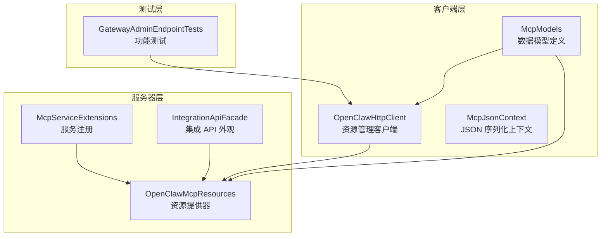
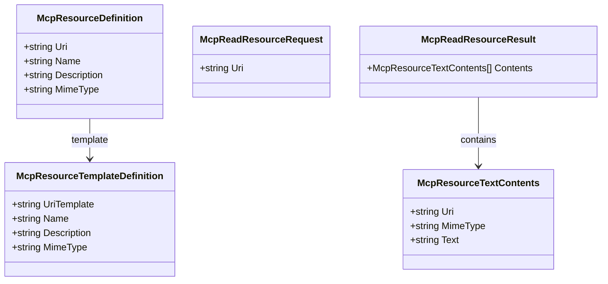
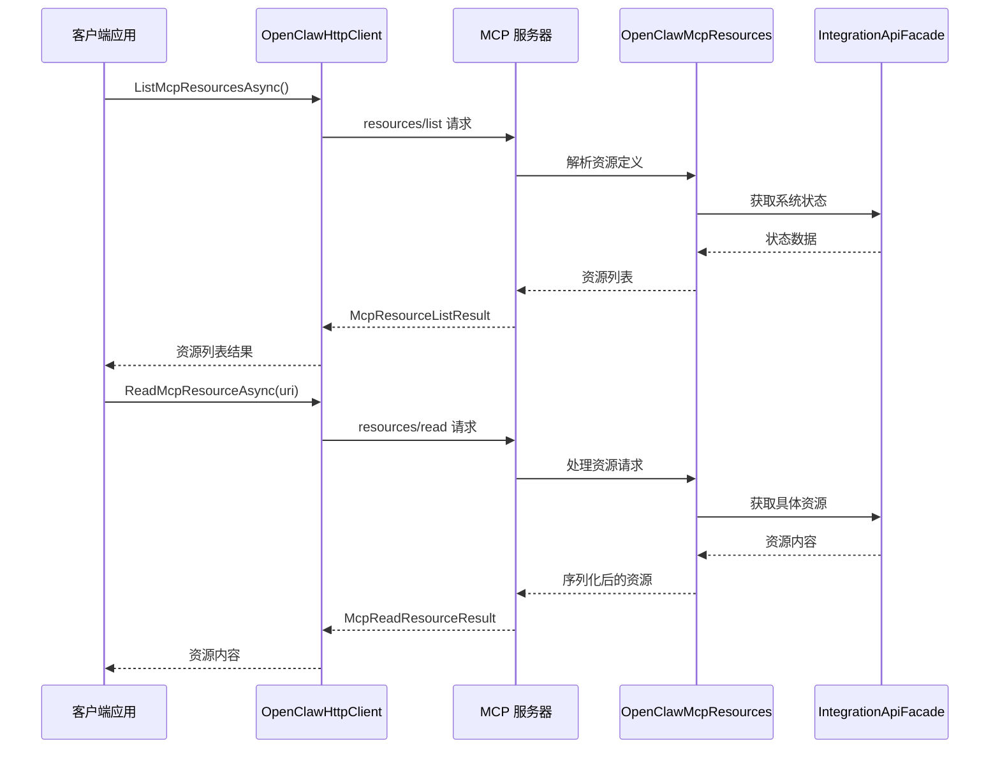
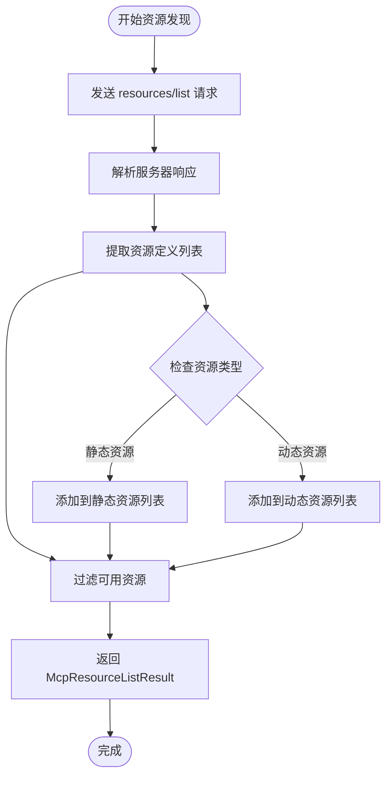
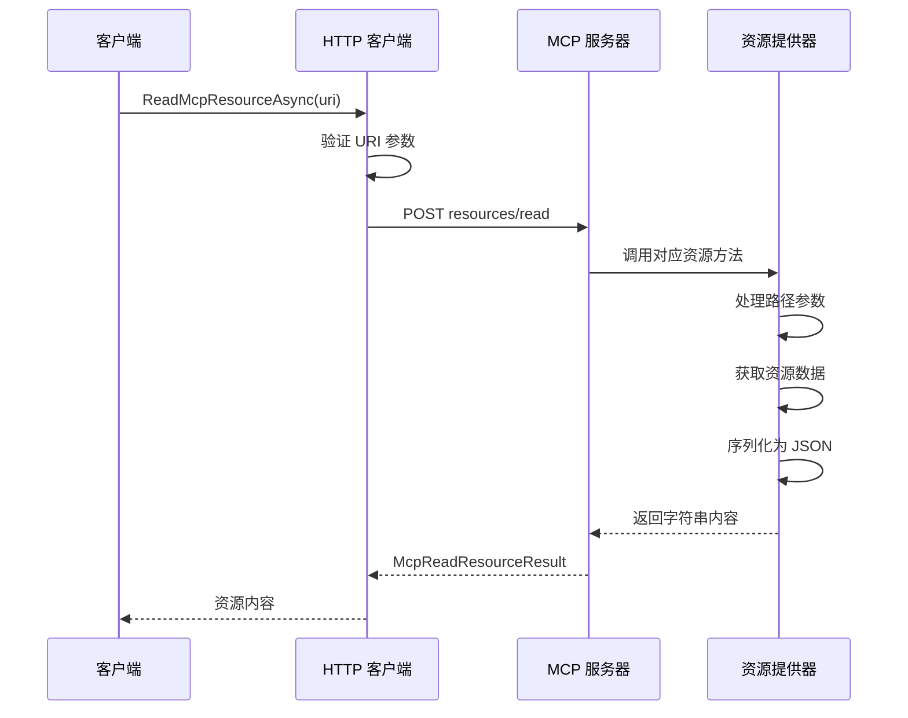
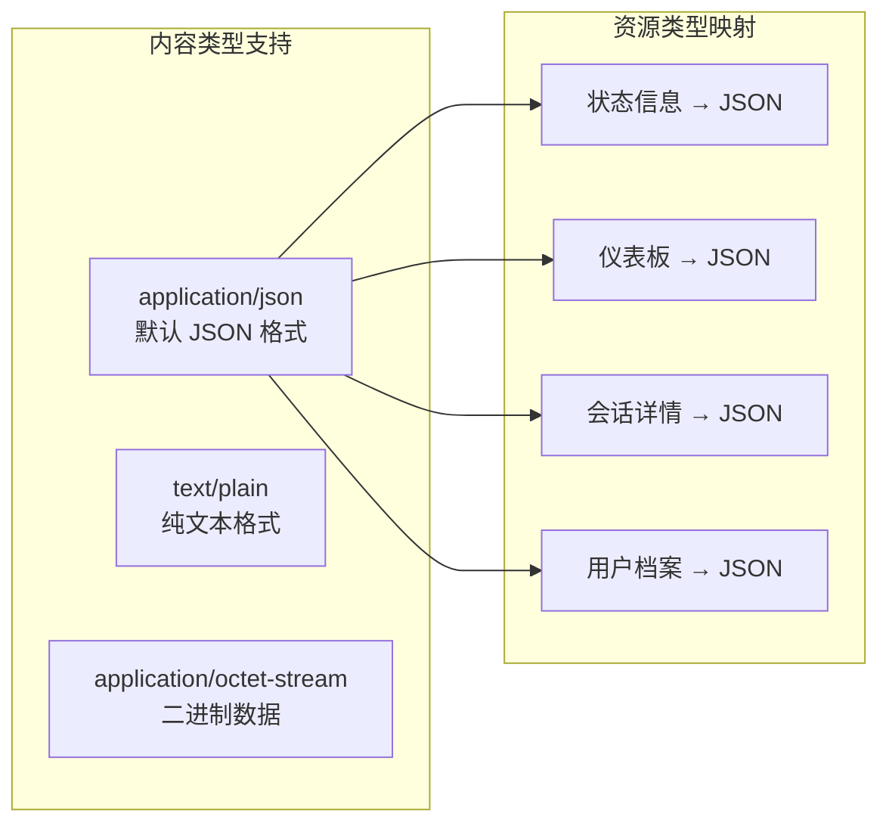
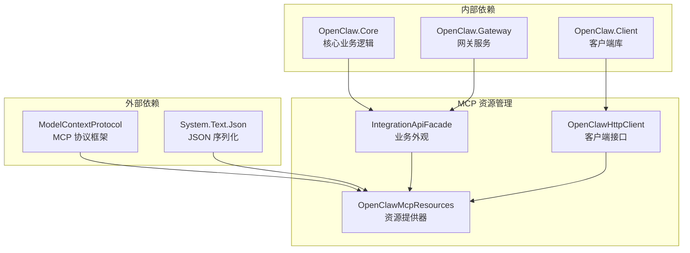

# MCP 资源管理

<cite>
**本文档引用的文件**
- [OpenClawHttpClient.cs](file://src/OpenClaw.Client/OpenClawHttpClient.cs)
- [McpModels.cs](file://src/OpenClaw.Client/McpModels.cs)
- [OpenClawMcpResources.cs](file://src/OpenClaw.Gateway/Mcp/OpenClawMcpResources.cs)
- [McpServiceExtensions.cs](file://src/OpenClaw.Gateway/Mcp/McpServiceExtensions.cs)
- [GatewayAdminEndpointTests.cs](file://src/OpenClaw.Tests/GatewayAdminEndpointTests.cs)
</cite>

## 目录
1. [简介](#简介)
2. [项目结构](#项目结构)
3. [核心组件](#核心组件)
4. [架构概览](#架构概览)
5. [详细组件分析](#详细组件分析)
6. [依赖关系分析](#依赖关系分析)
7. [性能考虑](#性能考虑)
8. [故障排除指南](#故障排除指南)
9. [结论](#结论)

## 简介

本文档详细介绍了 OpenClaw 项目中的 MCP（Model Context Protocol）资源管理功能。MCP 是一个用于在 AI 应用程序和工具之间建立标准化通信协议的框架。本项目的资源管理功能允许客户端通过 MCP 协议获取和读取各种系统资源，包括网关状态、仪表板快照、待审批事项、自动化流程等。

该功能的核心实现包括：
- 客户端侧的资源管理接口
- 服务器端的资源提供器
- 完整的数据模型定义
- 模板支持机制
- 内容类型处理

## 项目结构

MCP 资源管理功能分布在以下关键位置：

**图表来源**
- [OpenClawHttpClient.cs:1-50](file://src/OpenClaw.Client/OpenClawHttpClient.cs#L1-L50)
- [OpenClawMcpResources.cs:1-50](file://src/OpenClaw.Gateway/Mcp/OpenClawMcpResources.cs#L1-L50)
- [McpServiceExtensions.cs:1-50](file://src/OpenClaw.Gateway/Mcp/McpServiceExtensions.cs#L1-L50)

**章节来源**
- [OpenClawHttpClient.cs:260-290](file://src/OpenClaw.Client/OpenClawHttpClient.cs#L260-L290)
- [OpenClawMcpResources.cs:1-116](file://src/OpenClaw.Gateway/Mcp/OpenClawMcpResources.cs#L1-L116)
- [McpServiceExtensions.cs:20-46](file://src/OpenClaw.Gateway/Mcp/McpServiceExtensions.cs#L20-L46)

## 核心组件

### 客户端资源管理器

客户端通过 `OpenClawHttpClient` 提供的资源管理方法与 MCP 服务器交互：

- `ListMcpResourcesAsync()`: 获取可用资源列表
- `ListMcpResourceTemplatesAsync()`: 获取资源模板列表  
- `ReadMcpResourceAsync(uri)`: 读取指定 URI 的资源

### 服务器资源提供器

服务器端通过 `OpenClawMcpResources` 类提供多种预定义资源：

- 网关状态 (`openclaw://status`)
- 仪表板快照 (`openclaw://dashboard`)
- 待审批事项 (`openclaw://approvals`)
- 用户档案 (`openclaw://profiles/{actorId}`)
- 会话详情 (`openclaw://sessions/{sessionId}`)

### 数据模型体系

系统定义了完整的数据模型来描述 MCP 资源：

**图表来源**
- [McpModels.cs:108-149](file://src/OpenClaw.Client/McpModels.cs#L108-L149)

**章节来源**
- [McpModels.cs:108-149](file://src/OpenClaw.Client/McpModels.cs#L108-L149)
- [OpenClawHttpClient.cs:268-285](file://src/OpenClaw.Client/OpenClawHttpClient.cs#L268-L285)

## 架构概览

MCP 资源管理采用分层架构设计，确保客户端与服务器之间的清晰分离：

**图表来源**
- [OpenClawHttpClient.cs:268-285](file://src/OpenClaw.Client/OpenClawHttpClient.cs#L268-L285)
- [OpenClawMcpResources.cs:16-115](file://src/OpenClaw.Gateway/Mcp/OpenClawMcpResources.cs#L16-L115)

## 详细组件分析

### 资源发现机制

资源发现通过 `ListMcpResourcesAsync` 方法实现，该方法返回所有可用资源的元数据：

**图表来源**
- [OpenClawHttpClient.cs:268-269](file://src/OpenClaw.Client/OpenClawHttpClient.cs#L268-L269)
- [OpenClawMcpResources.cs:16-115](file://src/OpenClaw.Gateway/Mcp/OpenClawMcpResources.cs#L16-L115)

### 资源读取流程

资源读取通过 `ReadMcpResourceAsync` 方法实现，支持参数化资源访问：

**图表来源**
- [OpenClawHttpClient.cs:274-285](file://src/OpenClaw.Client/OpenClawHttpClient.cs#L274-L285)
- [OpenClawMcpResources.cs:65-96](file://src/OpenClaw.Gateway/Mcp/OpenClawMcpResources.cs#L65-L96)

### 模板支持机制

系统支持 URI 模板，允许动态参数化资源访问：

| 模板 | 描述 | 参数 |
|------|------|------|
| `openclaw://sessions/{sessionId}` | 会话详情 | sessionId |
| `openclaw://profiles/{actorId}` | 用户档案 | actorId |
| `openclaw://automations/{automationId}` | 自动化详情 | automationId |

**章节来源**
- [OpenClawMcpResources.cs:65-114](file://src/OpenClaw.Gateway/Mcp/OpenClawMcpResources.cs#L65-L114)
- [McpModels.cs:121-132](file://src/OpenClaw.Client/McpModels.cs#L121-L132)

### 内容类型处理

系统支持多种内容类型，主要以 JSON 为主：

**图表来源**
- [OpenClawMcpResources.cs:16-115](file://src/OpenClaw.Gateway/Mcp/OpenClawMcpResources.cs#L16-L115)
- [McpModels.cs:113-127](file://src/OpenClaw.Client/McpModels.cs#L113-L127)

**章节来源**
- [McpModels.cs:113-127](file://src/OpenClaw.Client/McpModels.cs#L113-L127)
- [OpenClawMcpResources.cs:16-115](file://src/OpenClaw.Gateway/Mcp/OpenClawMcpResources.cs#L16-L115)

## 依赖关系分析

MCP 资源管理功能的依赖关系如下：

**图表来源**
- [McpServiceExtensions.cs:26-30](file://src/OpenClaw.Gateway/Mcp/McpServiceExtensions.cs#L26-L30)
- [OpenClawMcpResources.cs:12-14](file://src/OpenClaw.Gateway/Mcp/OpenClawMcpResources.cs#L12-L14)

**章节来源**
- [McpServiceExtensions.cs:26-30](file://src/OpenClaw.Gateway/Mcp/McpServiceExtensions.cs#L26-L30)
- [OpenClawMcpResources.cs:12-14](file://src/OpenClaw.Gateway/Mcp/OpenClawMcpResources.cs#L12-L14)

## 性能考虑

### 缓存策略

系统实现了多层缓存机制来优化资源访问性能：

1. **HTTP 层缓存**: 使用无状态 HTTP 传输减少连接开销
2. **内存缓存**: 对频繁访问的资源进行内存缓存
3. **模板缓存**: 预编译 URI 模板提高参数化查询性能

### 性能优化技巧

- **批量操作**: 支持一次性获取多个资源
- **条件请求**: 利用 ETag 实现条件加载
- **流式传输**: 对大资源支持流式读取
- **压缩传输**: 启用 Gzip 压缩减少网络传输量

### 错误处理

系统提供了完善的错误处理机制：

- **超时控制**: 所有网络请求都有超时保护
- **重试机制**: 关键操作支持自动重试
- **降级策略**: 服务不可用时提供降级响应
- **监控告警**: 异常情况自动记录和告警

## 故障排除指南

### 常见问题及解决方案

| 问题类型 | 症状 | 解决方案 |
|----------|------|----------|
| 认证失败 | 401 未授权 | 检查访问令牌有效性 |
| 资源不存在 | 404 资源未找到 | 验证 URI 格式正确性 |
| 超时错误 | 请求超时 | 检查网络连接和服务器负载 |
| 权限不足 | 403 禁止访问 | 确认用户权限设置 |
| JSON 解析错误 | 数据格式不正确 | 检查序列化配置 |

### 调试方法

1. **启用详细日志**: 在开发环境中启用 MCP 协议调试日志
2. **网络抓包**: 使用工具捕获 HTTP 请求和响应
3. **状态监控**: 监控服务器资源使用情况
4. **性能分析**: 分析资源访问延迟和吞吐量

**章节来源**
- [GatewayAdminEndpointTests.cs:6034-6048](file://src/OpenClaw.Tests/GatewayAdminEndpointTests.cs#L6034-L6048)
- [OpenClawHttpClient.cs:274-285](file://src/OpenClaw.Client/OpenClawHttpClient.cs#L274-L285)

## 结论

MCP 资源管理功能为 OpenClaw 项目提供了强大而灵活的资源访问能力。通过清晰的分层架构、完善的数据模型定义和高效的实现机制，该功能能够满足各种复杂的资源管理需求。

关键优势包括：
- **标准化接口**: 遵循 MCP 协议标准，确保互操作性
- **灵活扩展**: 支持自定义资源和模板
- **高性能设计**: 多层缓存和优化机制
- **安全可靠**: 完善的认证、授权和错误处理
- **易于使用**: 简洁的 API 设计和丰富的示例

未来可以进一步优化的方向包括：实现更智能的缓存策略、增加资源版本控制、提供更丰富的过滤和排序选项等。