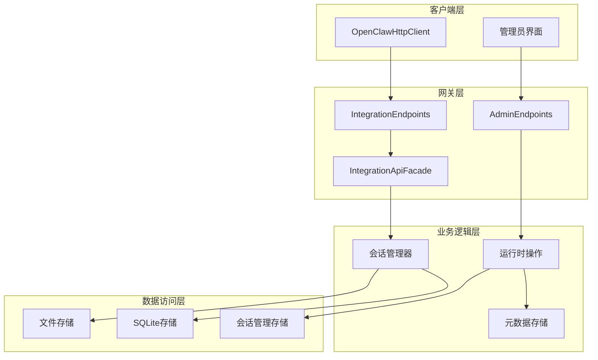
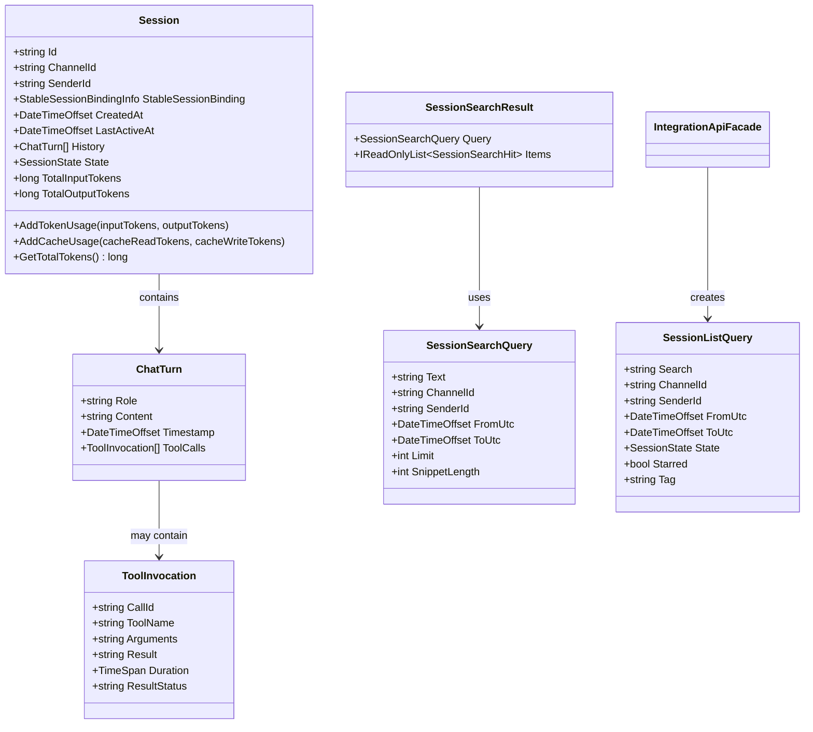
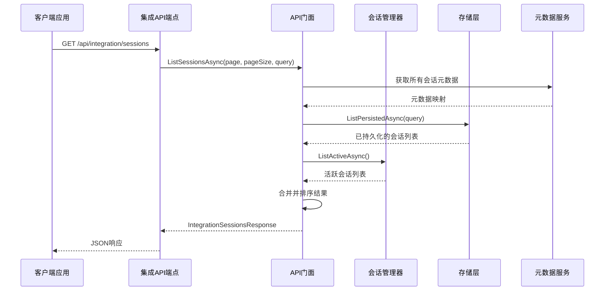
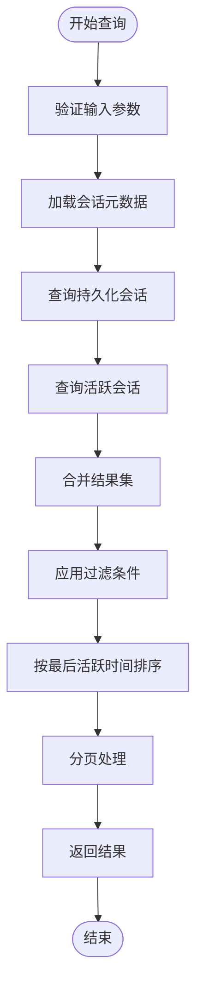
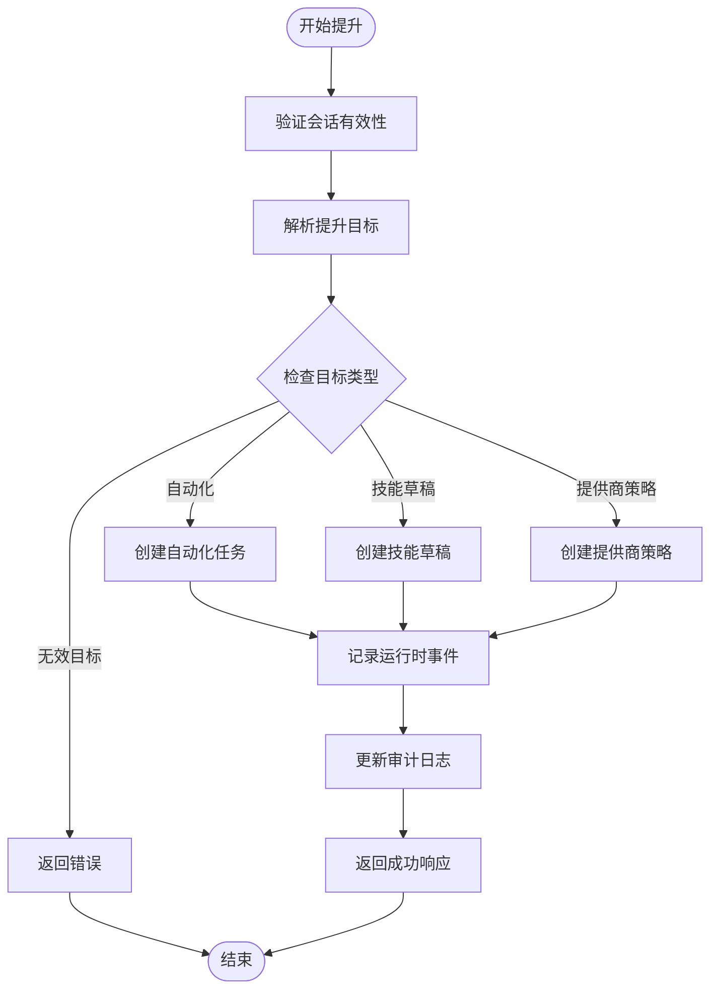
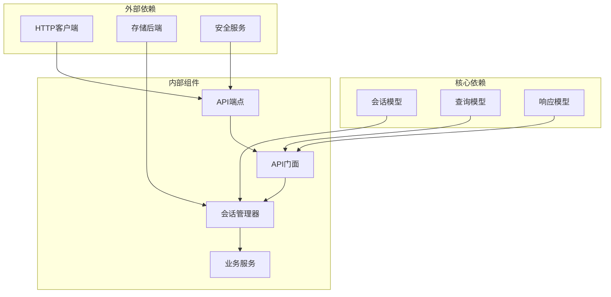

# 会话管理 API

<cite>
**本文档引用的文件**
- [IntegrationEndpoints.cs](file://src/OpenClaw.Gateway/Endpoints/IntegrationEndpoints.cs)
- [AdminEndpoints.Sessions.cs](file://src/OpenClaw.Gateway/Endpoints/AdminEndpoints.Sessions.cs)
- [IntegrationApiFacade.cs](file://src/OpenClaw.Gateway/Composition/IntegrationApiFacade.cs)
- [Session.cs](file://src/OpenClaw.Core/Models/Session.cs)
- [SessionSearchModels.cs](file://src/OpenClaw.Core/Models/SessionSearchModels.cs)
- [SessionAdminModels.cs](file://src/OpenClaw.Core/Models/SessionAdminModels.cs)
- [OpenClawHttpClient.cs](file://src/OpenClaw.Client/OpenClawHttpClient.cs)
- [FileMemoryStore.cs](file://src/OpenClaw.Core/Memory/FileMemoryStore.cs)
- [SqliteMemoryStore.cs](file://src/OpenClaw.Core/Memory/SqliteMemoryStore.cs)
</cite>

## 目录
1. [简介](#简介)
2. [项目结构](#项目结构)
3. [核心组件](#核心组件)
4. [架构概览](#架构概览)
5. [详细组件分析](#详细组件分析)
6. [依赖关系分析](#依赖关系分析)
7. [性能考虑](#性能考虑)
8. [故障排除指南](#故障排除指南)
9. [结论](#结论)

## 简介

会话管理 API 是 OpenClaw AI 代理系统的核心功能模块，负责管理用户与 AI 代理之间的对话会话。该 API 提供了完整的会话生命周期管理能力，包括会话列表查询、会话详情获取、会话时间线查看、会话搜索、元数据更新和会话提升等功能。

在 AI 代理系统中，会话管理扮演着至关重要的角色：
- **状态持久化**：确保对话状态在系统重启后能够恢复
- **历史记录**：维护完整的对话历史以便后续分析和审计
- **并发控制**：处理多用户并发会话的隔离和同步
- **资源管理**：有效管理内存和存储资源的使用
- **安全控制**：提供访问控制和操作审计功能

## 项目结构

会话管理 API 的实现采用分层架构设计，主要包含以下层次：



**图表来源**
- [IntegrationEndpoints.cs:1-800](file://src/OpenClaw.Gateway/Endpoints/IntegrationEndpoints.cs#L1-L800)
- [AdminEndpoints.Sessions.cs:1-437](file://src/OpenClaw.Gateway/Endpoints/AdminEndpoints.Sessions.cs#L1-L437)
- [IntegrationApiFacade.cs:1-966](file://src/OpenClaw.Gateway/Composition/IntegrationApiFacade.cs#L1-L966)

**章节来源**
- [IntegrationEndpoints.cs:1-800](file://src/OpenClaw.Gateway/Endpoints/IntegrationEndpoints.cs#L1-L800)
- [AdminEndpoints.Sessions.cs:1-437](file://src/OpenClaw.Gateway/Endpoints/AdminEndpoints.Sessions.cs#L1-L437)
- [IntegrationApiFacade.cs:1-966](file://src/OpenClaw.Gateway/Composition/IntegrationApiFacade.cs#L1-L966)

## 核心组件

### 会话模型系统

会话管理系统基于一组精心设计的数据模型构建：



**图表来源**
- [Session.cs:15-135](file://src/OpenClaw.Core/Models/Session.cs#L15-L135)
- [Session.cs:152-179](file://src/OpenClaw.Core/Models/Session.cs#L152-L179)
- [SessionSearchModels.cs:3-29](file://src/OpenClaw.Core/Models/SessionSearchModels.cs#L3-L29)
- [SessionAdminModels.cs:29-39](file://src/OpenClaw.Core/Models/SessionAdminModels.cs#L29-L39)

### 数据存储抽象

系统支持多种存储后端以满足不同的部署需求：

| 存储类型 | 特点 | 适用场景 | 性能特征 |
|---------|------|----------|----------|
| 文件存储 | 简单可靠，易于备份 | 开发环境，小规模部署 | 读取性能好，写入开销大 |
| SQLite存储 | 结构化查询，全文搜索 | 生产环境，中等规模 | 查询灵活，支持复杂过滤 |

**章节来源**
- [Session.cs:15-135](file://src/OpenClaw.Core/Models/Session.cs#L15-L135)
- [SessionSearchModels.cs:3-29](file://src/OpenClaw.Core/Models/SessionSearchModels.cs#L3-L29)
- [SessionAdminModels.cs:29-39](file://src/OpenClaw.Core/Models/SessionAdminModels.cs#L29-L39)

## 架构概览

会话管理 API 采用分层架构，每层都有明确的职责分工：



**图表来源**
- [IntegrationEndpoints.cs:158-179](file://src/OpenClaw.Gateway/Endpoints/IntegrationEndpoints.cs#L158-L179)
- [IntegrationApiFacade.cs:105-142](file://src/OpenClaw.Gateway/Composition/IntegrationApiFacade.cs#L105-L142)

**章节来源**
- [IntegrationEndpoints.cs:158-179](file://src/OpenClaw.Gateway/Endpoints/IntegrationEndpoints.cs#L158-L179)
- [IntegrationApiFacade.cs:105-142](file://src/OpenClaw.Gateway/Composition/IntegrationApiFacade.cs#L105-L142)

## 详细组件分析

### ListSessionsAsync 方法

ListSessionsAsync 负责提供会话列表查询功能，支持分页和多种过滤条件。

#### 功能特性
- **分页支持**：通过 page 和 pageSize 参数控制返回数量
- **多维过滤**：支持按渠道、发送者、状态、时间范围等条件过滤
- **活跃会话合并**：同时显示内存中的活跃会话和持久化会话
- **元数据关联**：自动关联会话元数据（如星标状态）

#### 处理流程



**图表来源**
- [IntegrationApiFacade.cs:105-142](file://src/OpenClaw.Gateway/Composition/IntegrationApiFacade.cs#L105-L142)
- [FileMemoryStore.cs:1076-1156](file://src/OpenClaw.Core/Memory/FileMemoryStore.cs#L1076-L1156)

#### 使用示例

```csharp
// 基本会话列表查询
var sessions = await client.ListSessionsAsync(1, 25, new SessionListQuery());

// 带过滤条件的查询
var filteredSessions = await client.ListSessionsAsync(1, 25, new SessionListQuery
{
    ChannelId = "email",
    FromUtc = DateTime.UtcNow.AddDays(-7),
    State = SessionState.Active
});
```

**章节来源**
- [IntegrationApiFacade.cs:105-142](file://src/OpenClaw.Gateway/Composition/IntegrationApiFacade.cs#L105-L142)
- [FileMemoryStore.cs:1076-1156](file://src/OpenClaw.Core/Memory/FileMemoryStore.cs#L1076-L1156)

### GetSessionAsync 方法

GetSessionAsync 提供会话详情获取功能，包含会话基本信息、分支信息和元数据。

#### 返回内容
- **会话对象**：完整的历史记录和统计信息
- **分支计数**：子会话或分支的数量
- **元数据**：星标状态、标签等用户标记信息
- **活跃状态**：当前会话是否仍处于活跃状态

#### 错误处理
- **会话不存在**：返回 404 状态码和错误信息
- **权限不足**：返回 401 或 403 状态码
- **内部错误**：返回 500 状态码和异常信息

**章节来源**
- [IntegrationApiFacade.cs:144-159](file://src/OpenClaw.Gateway/Composition/IntegrationApiFacade.cs#L144-L159)
- [OpenClawHttpClient.cs:524-531](file://src/OpenClaw.Client/OpenClawHttpClient.cs#L524-L531)

### GetSessionTimelineAsync 方法

GetSessionTimelineAsync 提供会话时间线视图，展示会话相关的运行时事件和提供商交互记录。

#### 时间线内容
- **运行时事件**：系统内部事件（工具调用、错误、警告等）
- **提供商交互**：与外部服务的对话记录
- **事件排序**：按时间戳降序排列

#### 限制机制
- **事件数量限制**：默认最多返回 100 条事件
- **时间范围过滤**：可指定查询的时间范围
- **会话存在性检查**：确保会话 ID 有效

**章节来源**
- [IntegrationApiFacade.cs:161-173](file://src/OpenClaw.Gateway/Composition/IntegrationApiFacade.cs#L161-L173)
- [OpenClawHttpClient.cs:533-540](file://src/OpenClaw.Client/OpenClawHttpClient.cs#L533-L540)

### SearchSessionsAsync 方法

SearchSessionsAsync 提供全文搜索功能，支持在会话历史中查找特定内容。

#### 搜索能力
- **文本匹配**：在消息内容、工具调用参数和结果中搜索
- **时间范围限制**：可限定搜索的时间范围
- **渠道和发送者过滤**：支持按通信渠道和发送者过滤
- **结果排序**：按相关性和时间排序

#### 搜索算法
- **精确匹配**：支持完全匹配和部分匹配
- **模糊搜索**：支持拼写错误容忍
- **权重计算**：根据匹配位置和内容重要性计算相关性分数

**章节来源**
- [IntegrationApiFacade.cs:514-518](file://src/OpenClaw.Gateway/Composition/IntegrationApiFacade.cs#L514-L518)
- [OpenClawHttpClient.cs:542](file://src/OpenClaw.Client/OpenClawHttpClient.cs#L542)

### UpdateSessionMetadataAsync 方法

UpdateSessionMetadataAsync 允许更新会话的元数据信息，如星标状态、标签等。

#### 支持的元数据字段
- **星标状态**：标记重要会话
- **自定义标签**：用于分类和过滤
- **备注信息**：人工添加的注释

#### 审计跟踪
- **变更记录**：记录每次元数据变更
- **操作员审计**：追踪谁在何时进行了修改
- **变更前后对比**：保存修改前后的完整状态

**章节来源**
- [IntegrationApiFacade.cs:362-389](file://src/OpenClaw.Gateway/Composition/IntegrationApiFacade.cs#L362-L389)
- [OpenClawHttpClient.cs:720-735](file://src/OpenClaw.Client/OpenClawHttpClient.cs#L720-L735)

### PromoteSessionAsync 方法

PromoteSessionAsync 将现有会话转换为其他类型的工件，如自动化任务、技能草稿或提供商策略。

#### 支持的提升目标
- **自动化任务**：将会话转换为可执行的自动化工作流
- **技能草稿**：提取会话中的知识形成技能模板
- **提供商策略**：基于会话经验制定新的服务策略

#### 提升流程


**图表来源**
- [IntegrationApiFacade.cs:115-259](file://src/OpenClaw.Gateway/Composition/IntegrationApiFacade.cs#L115-L259)

**章节来源**
- [IntegrationApiFacade.cs:115-259](file://src/OpenClaw.Gateway/Composition/IntegrationApiFacade.cs#L115-L259)
- [OpenClawHttpClient.cs:737-751](file://src/OpenClaw.Client/OpenClawHttpClient.cs#L737-L751)

## 依赖关系分析

会话管理 API 的依赖关系呈现清晰的分层结构：



**图表来源**
- [IntegrationEndpoints.cs:1-800](file://src/OpenClaw.Gateway/Endpoints/IntegrationEndpoints.cs#L1-L800)
- [IntegrationApiFacade.cs:1-966](file://src/OpenClaw.Gateway/Composition/IntegrationApiFacade.cs#L1-L966)

**章节来源**
- [IntegrationEndpoints.cs:1-800](file://src/OpenClaw.Gateway/Endpoints/IntegrationEndpoints.cs#L1-L800)
- [IntegrationApiFacade.cs:1-966](file://src/OpenClaw.Gateway/Composition/IntegrationApiFacade.cs#L1-L966)

## 性能考虑

### 缓存策略
- **会话缓存**：活跃会话在内存中缓存，减少磁盘 I/O
- **元数据缓存**：会话元数据按需加载和缓存
- **查询结果缓存**：常用查询结果进行短期缓存

### 异步处理
- **非阻塞I/O**：所有文件和数据库操作都是异步的
- **并发控制**：使用信号量控制同时加载的会话数量
- **超时处理**：为长时间操作设置合理的超时时间

### 内存管理
- **流式处理**：大文件采用流式读取避免内存峰值
- **对象池**：复用临时对象减少垃圾回收压力
- **及时释放**：确保不再使用的资源及时释放

## 故障排除指南

### 常见问题及解决方案

| 问题类型 | 症状 | 可能原因 | 解决方案 |
|---------|------|----------|----------|
| 会话加载失败 | 返回空会话或错误 | 文件损坏或权限问题 | 检查文件完整性，修复权限 |
| 查询性能慢 | 响应时间过长 | 缺少索引或查询条件不当 | 添加适当的索引，优化查询 |
| 内存使用过高 | 系统内存不足 | 会话过多或缓存未清理 | 调整缓存大小，定期清理 |
| 并发冲突 | 数据不一致 | 多个进程同时修改 | 使用事务或锁机制 |

### 调试技巧
- **启用详细日志**：查看会话加载和保存过程的详细信息
- **监控资源使用**：观察内存、CPU和磁盘I/O使用情况
- **分析查询计划**：检查数据库查询的执行计划
- **性能剖析**：使用性能分析工具识别瓶颈

**章节来源**
- [FileMemoryStore.cs:78-170](file://src/OpenClaw.Core/Memory/FileMemoryStore.cs#L78-L170)
- [SqliteMemoryStore.cs:150-207](file://src/OpenClaw.Core/Memory/SqliteMemoryStore.cs#L150-L207)

## 结论

会话管理 API 提供了一个完整、高效且可扩展的会话生命周期管理解决方案。通过清晰的分层架构、灵活的查询能力和强大的扩展性，该系统能够满足从个人开发者到企业级应用的各种需求。

### 主要优势
- **功能完整**：涵盖会话管理的所有核心功能
- **性能优异**：优化的存储和查询机制
- **易于使用**：直观的API设计和丰富的示例
- **可扩展性强**：支持多种存储后端和自定义扩展

### 未来发展方向
- **分布式支持**：支持多节点部署和负载均衡
- **高级搜索**：增强自然语言查询和语义搜索
- **实时协作**：支持多用户实时协作编辑
- **智能分析**：集成机器学习进行会话分析和预测

会话管理 API 作为 AI 代理系统的核心基础设施，为构建智能化、自动化的对话应用奠定了坚实的基础。