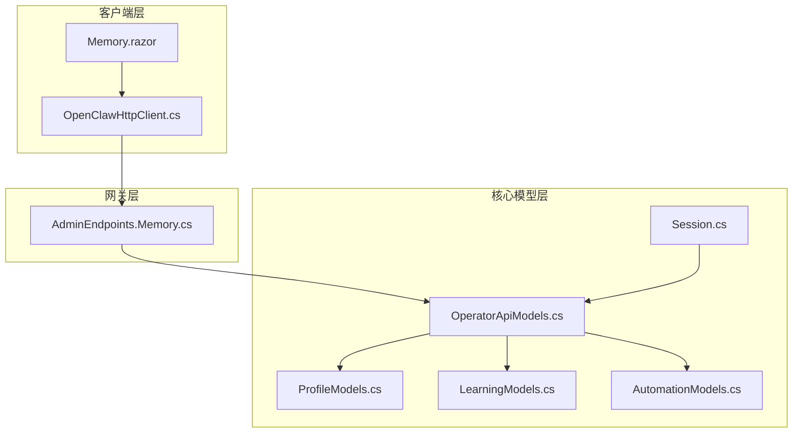
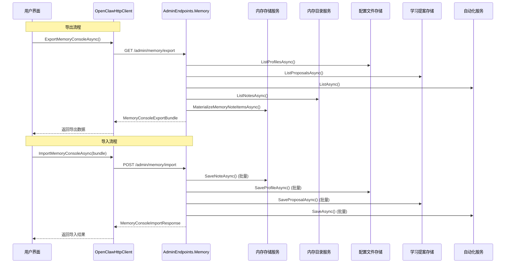
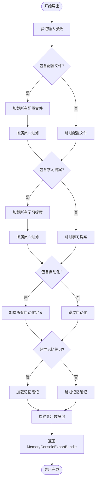
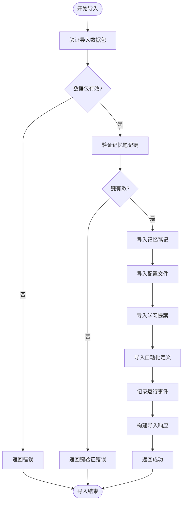
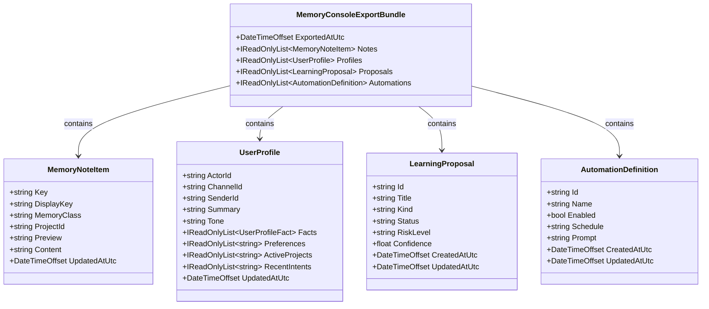
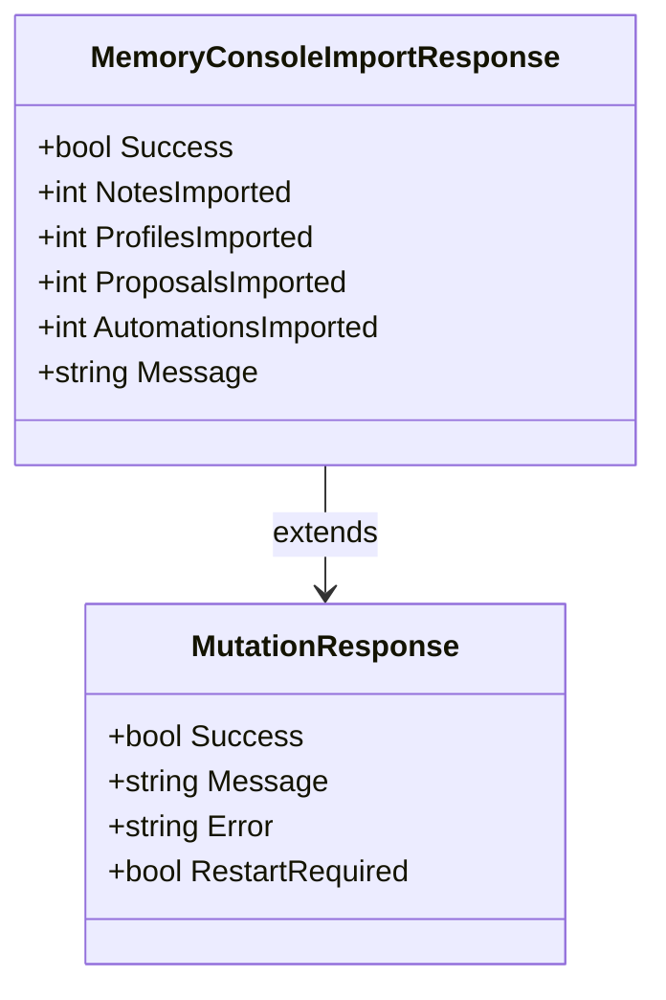
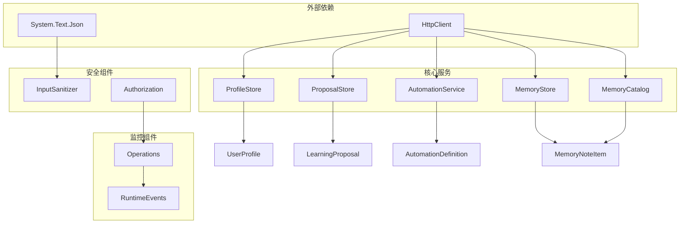

# 内存控制台导出导入

<cite>
**本文档引用的文件**
- [OperatorApiModels.cs](file://src/OpenClaw.Core/Models/OperatorApiModels.cs)
- [AdminEndpoints.Memory.cs](file://src/OpenClaw.Gateway/Endpoints/AdminEndpoints.Memory.cs)
- [OpenClawHttpClient.cs](file://src/OpenClaw.Client/OpenClawHttpClient.cs)
- [Session.cs](file://src/OpenClaw.Core/Models/Session.cs)
- [ProfileModels.cs](file://src/OpenClaw.Core/Models/ProfileModels.cs)
- [LearningModels.cs](file://src/OpenClaw.Core/Models/LearningModels.cs)
- [AutomationModels.cs](file://src/OpenClaw.Core/Models/AutomationModels.cs)
- [Memory.razor](file://src/OpenClaw.Dashboard/Pages/Memory.razor)
</cite>

## 目录
1. [简介](#简介)
2. [项目结构](#项目结构)
3. [核心组件](#核心组件)
4. [架构概览](#架构概览)
5. [详细组件分析](#详细组件分析)
6. [依赖关系分析](#依赖关系分析)
7. [性能考虑](#性能考虑)
8. [故障排除指南](#故障排除指南)
9. [结论](#结论)

## 简介

本文档详细介绍了OpenClaw系统中的内存控制台导出导入功能。该功能允许用户将内存数据（包括记忆笔记、用户配置文件、学习提案和自动化定义）打包导出为JSON格式，或从备份文件中导入这些数据。

内存控制台导出导入功能是系统的重要组成部分，为用户提供数据备份、迁移和恢复能力。该功能支持细粒度的数据选择，用户可以根据需要选择性地包含或排除特定类型的数据。

## 项目结构

内存控制台导出导入功能涉及以下关键文件和组件：

**图表来源**
- [OpenClawHttpClient.cs:599-622](file://src/OpenClaw.Client/OpenClawHttpClient.cs#L599-L622)
- [AdminEndpoints.Memory.cs:428-582](file://src/OpenClaw.Gateway/Endpoints/AdminEndpoints.Memory.cs#L428-L582)
- [OperatorApiModels.cs:435-452](file://src/OpenClaw.Core/Models/OperatorApiModels.cs#L435-L452)

**章节来源**
- [OpenClawHttpClient.cs:599-622](file://src/OpenClaw.Client/OpenClawHttpClient.cs#L599-L622)
- [AdminEndpoints.Memory.cs:428-582](file://src/OpenClaw.Gateway/Endpoints/AdminEndpoints.Memory.cs#L428-L582)
- [OperatorApiModels.cs:435-452](file://src/OpenClaw.Core/Models/OperatorApiModels.cs#L435-L452)

## 核心组件

内存控制台导出导入功能的核心组件包括：

### 主要数据模型

1. **MemoryConsoleExportBundle** - 导出数据包容器
   - 包含导出时间戳
   - 包含记忆笔记列表
   - 包含用户配置文件列表
   - 包含学习提案列表
   - 包含自动化定义列表

2. **MemoryConsoleImportResponse** - 导入响应模型
   - 包含操作成功状态
   - 记录各类数据的导入数量
   - 提供操作结果消息

### 关键方法

1. **ExportMemoryConsoleAsync** - 导出内存数据
   - 支持按演员ID过滤
   - 支持按项目ID过滤
   - 可选择性包含不同类型的组件

2. **ImportMemoryConsoleAsync** - 导入内存数据
   - 验证数据完整性
   - 批量保存数据
   - 记录导入统计信息

**章节来源**
- [OperatorApiModels.cs:435-452](file://src/OpenClaw.Core/Models/OperatorApiModels.cs#L435-L452)
- [OpenClawHttpClient.cs:599-622](file://src/OpenClaw.Client/OpenClawHttpClient.cs#L599-L622)

## 架构概览

内存控制台导出导入功能采用分层架构设计：

**图表来源**
- [OpenClawHttpClient.cs:599-622](file://src/OpenClaw.Client/OpenClawHttpClient.cs#L599-L622)
- [AdminEndpoints.Memory.cs:428-582](file://src/OpenClaw.Gateway/Endpoints/AdminEndpoints.Memory.cs#L428-L582)

## 详细组件分析

### ExportMemoryConsoleAsync 方法实现

ExportMemoryConsoleAsync方法负责导出内存数据包，其核心实现逻辑如下：

**图表来源**
- [AdminEndpoints.Memory.cs:428-485](file://src/OpenClaw.Gateway/Endpoints/AdminEndpoints.Memory.cs#L428-L485)

#### 参数详解

- **actorId**: 可选参数，用于过滤特定演员的配置文件和学习提案
- **projectId**: 可选参数，用于过滤特定项目的记忆笔记
- **includeProfiles**: 是否包含用户配置文件
- **includeProposals**: 是否包含学习提案
- **includeAutomations**: 是否包含自动化定义
- **includeNotes**: 是否包含记忆笔记

#### 数据处理流程

1. **配置文件处理**: 从ProfileStore加载所有配置文件，如果指定了actorId则进行过滤
2. **学习提案处理**: 从ProposalStore加载所有学习提案，如果指定了actorId则进行过滤
3. **自动化处理**: 从AutomationService加载所有自动化定义
4. **记忆笔记处理**: 从MemoryCatalog加载记忆笔记，使用prefixFilter进行项目级过滤

**章节来源**
- [AdminEndpoints.Memory.cs:428-485](file://src/OpenClaw.Gateway/Endpoints/AdminEndpoints.Memory.cs#L428-L485)
- [OpenClawHttpClient.cs:599-610](file://src/OpenClaw.Client/OpenClawHttpClient.cs#L599-L610)

### ImportMemoryConsoleAsync 方法实现

ImportMemoryConsoleAsync方法负责导入内存数据包，其核心实现逻辑如下：

**图表来源**
- [AdminEndpoints.Memory.cs:487-582](file://src/OpenClaw.Gateway/Endpoints/AdminEndpoints.Memory.cs#L487-L582)

#### 导入验证机制

1. **数据包验证**: 检查导入数据包是否为空
2. **记忆笔记键验证**: 使用InputSanitizer检查每个记忆笔记的键是否有效
3. **数据完整性检查**: 确保必需字段不为空

#### 批量导入策略

导入过程采用批量处理策略，对每种数据类型进行独立的批量导入：

1. **记忆笔记导入**: 使用memoryStore.SaveNoteAsync()批量保存
2. **配置文件导入**: 使用profileStore.SaveProfileAsync()批量保存
3. **学习提案导入**: 使用proposalStore.SaveProposalAsync()批量保存
4. **自动化导入**: 使用automationService.SaveAsync()批量保存

**章节来源**
- [AdminEndpoints.Memory.cs:487-582](file://src/OpenClaw.Gateway/Endpoints/AdminEndpoints.Memory.cs#L487-L582)
- [OpenClawHttpClient.cs:612-622](file://src/OpenClaw.Client/OpenClawHttpClient.cs#L612-L622)

### 数据模型结构分析

#### MemoryConsoleExportBundle 数据模型

MemoryConsoleExportBundle是导出数据包的核心容器，包含以下主要组件：

**图表来源**
- [OperatorApiModels.cs:435-442](file://src/OpenClaw.Core/Models/OperatorApiModels.cs#L435-L442)
- [ProfileModels.cs:10-22](file://src/OpenClaw.Core/Models/ProfileModels.cs#L10-L22)
- [LearningModels.cs:15-30](file://src/OpenClaw.Core/Models/LearningModels.cs#L15-L30)
- [AutomationModels.cs:57-81](file://src/OpenClaw.Core/Models/AutomationModels.cs#L57-L81)

#### MemoryConsoleImportResponse 数据模型

MemoryConsoleImportResponse提供导入操作的详细反馈信息：

**图表来源**
- [OperatorApiModels.cs:444-452](file://src/OpenClaw.Core/Models/OperatorApiModels.cs#L444-L452)

**章节来源**
- [OperatorApiModels.cs:435-452](file://src/OpenClaw.Core/Models/OperatorApiModels.cs#L435-L452)
- [ProfileModels.cs:10-22](file://src/OpenClaw.Core/Models/ProfileModels.cs#L10-L22)
- [LearningModels.cs:15-30](file://src/OpenClaw.Core/Models/LearningModels.cs#L15-L30)
- [AutomationModels.cs:57-81](file://src/OpenClaw.Core/Models/AutomationModels.cs#L57-L81)

### 导入选项参数详解

导入功能提供了四个主要的包含选项参数，每个参数控制特定类型数据的包含与否：

| 参数名 | 类型 | 默认值 | 描述 |
|--------|------|--------|------|
| includeProfiles | bool | true | 是否包含用户配置文件数据 |
| includeProposals | bool | true | 是否包含学习提案数据 |
| includeAutomations | bool | true | 是否包含自动化定义数据 |
| includeNotes | bool | true | 是否包含记忆笔记数据 |

#### 参数影响范围

1. **includeProfiles**: 影响UserProfile对象的导出和导入
2. **includeProposals**: 影响LearningProposal对象的导出和导入  
3. **includeAutomations**: 影响AutomationDefinition对象的导出和导入
4. **includeNotes**: 影响MemoryNoteItem对象的导出和导入

#### 条件加载机制

每个参数都实现了条件加载机制：
- 当参数为true时，对应的数据类型会被加载并包含在导出包中
- 当参数为false时，对应的数据类型会被跳过，不会出现在导出包中
- 这种机制允许用户根据需要创建精简的数据包

**章节来源**
- [AdminEndpoints.Memory.cs:428-485](file://src/OpenClaw.Gateway/Endpoints/AdminEndpoints.Memory.cs#L428-L485)
- [OpenClawHttpClient.cs:599-610](file://src/OpenClaw.Client/OpenClawHttpClient.cs#L599-L610)

## 依赖关系分析

内存控制台导出导入功能涉及多个服务和存储组件之间的复杂依赖关系：

**图表来源**
- [AdminEndpoints.Memory.cs:30-44](file://src/OpenClaw.Gateway/Endpoints/AdminEndpoints.Memory.cs#L30-L44)
- [Session.cs:1010-1016](file://src/OpenClaw.Core/Models/Session.cs#L1010-L1016)

### 组件耦合度分析

1. **高内聚低耦合**: 各个数据模型保持独立，通过接口进行交互
2. **服务依赖**: 网关端点依赖多个存储服务，但通过抽象层解耦
3. **安全集成**: 导入过程集成了输入验证和授权检查
4. **监控集成**: 导入操作被记录到运行事件系统中

### 循环依赖风险

当前设计避免了循环依赖：
- 客户端只依赖网关端点
- 网关端点依赖存储服务
- 存储服务之间没有直接依赖关系

**章节来源**
- [AdminEndpoints.Memory.cs:30-44](file://src/OpenClaw.Gateway/Endpoints/AdminEndpoints.Memory.cs#L30-L44)
- [Session.cs:1010-1016](file://src/OpenClaw.Core/Models/Session.cs#L1010-L1016)

## 性能考虑

内存控制台导出导入功能在设计时充分考虑了性能优化：

### 导出性能优化

1. **分页加载**: 记忆笔记使用分页机制（默认500条），避免一次性加载大量数据
2. **条件查询**: 支持按演员ID和项目ID过滤，减少不必要的数据处理
3. **延迟加载**: 只在需要时才加载对应类型的数据

### 导入性能优化

1. **批量操作**: 所有数据导入都采用批量处理，减少数据库往返次数
2. **并行处理**: 不同类型的数据可以并行导入
3. **内存管理**: 导入过程使用流式处理，避免内存溢出

### 错误处理机制

1. **输入验证**: 导入前进行完整的数据验证
2. **事务回滚**: 导入失败时自动回滚已处理的数据
3. **部分成功**: 支持部分成功的导入场景

## 故障排除指南

### 常见问题及解决方案

#### 导出失败

**问题**: 导出请求返回501 Not Implemented
**原因**: 内存目录服务不可用
**解决方案**: 检查MemoryCatalog服务状态，确保其正确初始化

**问题**: 导出数据为空
**原因**: 指定的过滤条件过于严格
**解决方案**: 调整actorId或projectId参数，或设置includeAll参数为true

#### 导入失败

**问题**: 导入返回400 Bad Request
**原因**: 数据包格式不正确或包含无效数据
**解决方案**: 验证JSON格式，检查数据包完整性

**问题**: 部分数据导入失败
**原因**: 特定数据项违反约束条件
**解决方案**: 检查具体失败的数据项，修正后重新导入

#### 性能问题

**问题**: 大数据包导出超时
**解决方案**: 减少包含的数据类型，使用更精确的过滤条件

**问题**: 导入过程内存不足
**解决方案**: 分批导入数据，或增加服务器内存资源

**章节来源**
- [AdminEndpoints.Memory.cs:203-209](file://src/OpenClaw.Gateway/Endpoints/AdminEndpoints.Memory.cs#L203-L209)
- [AdminEndpoints.Memory.cs:498-506](file://src/OpenClaw.Gateway/Endpoints/AdminEndpoints.Memory.cs#L498-L506)

## 结论

内存控制台导出导入功能为OpenClaw系统提供了完整且灵活的数据管理能力。通过精心设计的分层架构、完善的错误处理机制和性能优化策略，该功能能够满足各种数据备份、迁移和恢复需求。

### 主要优势

1. **灵活性**: 支持细粒度的数据选择，用户可以根据需要定制导出内容
2. **安全性**: 集成了完整的输入验证和授权检查机制
3. **可扩展性**: 基于接口的设计允许轻松添加新的数据类型支持
4. **性能**: 采用批量处理和分页加载等优化技术

### 未来改进方向

1. **增量导出**: 支持基于时间戳的增量数据导出
2. **压缩支持**: 添加数据压缩功能以减少传输时间和存储空间
3. **进度报告**: 提供导入导出进度的实时反馈
4. **并发控制**: 实现导入导出操作的并发控制机制

该功能的成功实施为系统的数据持久化和可移植性奠定了坚实基础，是OpenClaw生态系统中不可或缺的重要组成部分。