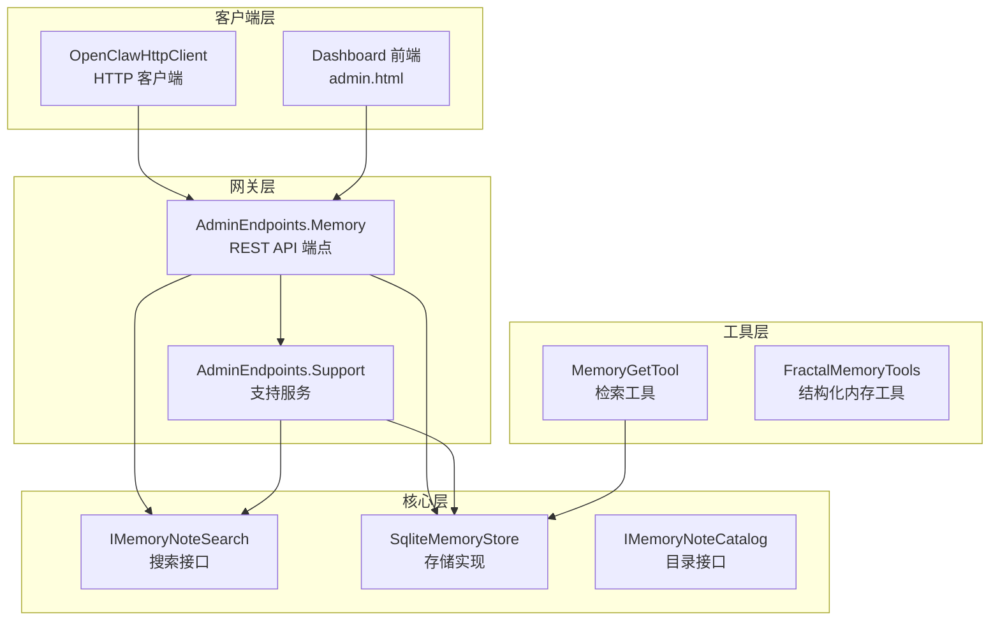
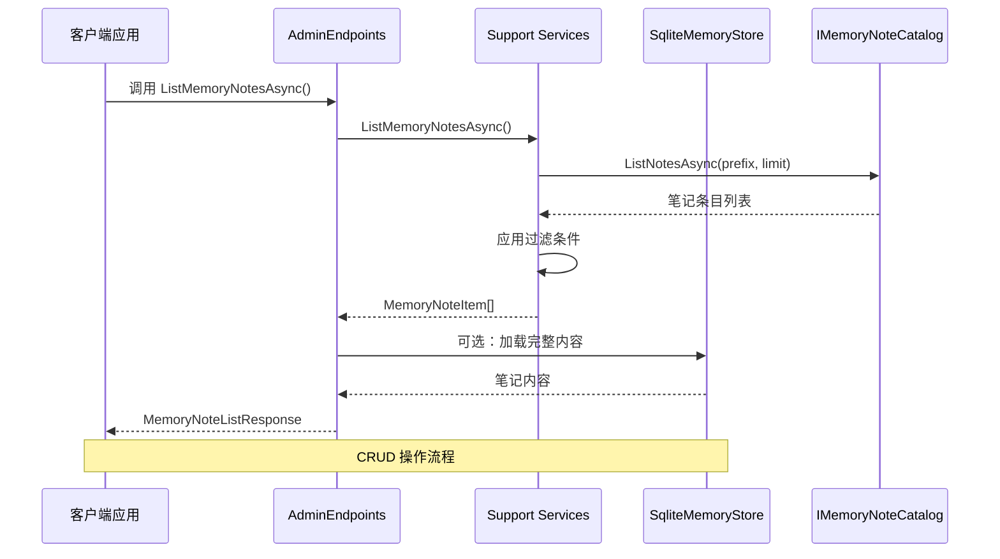
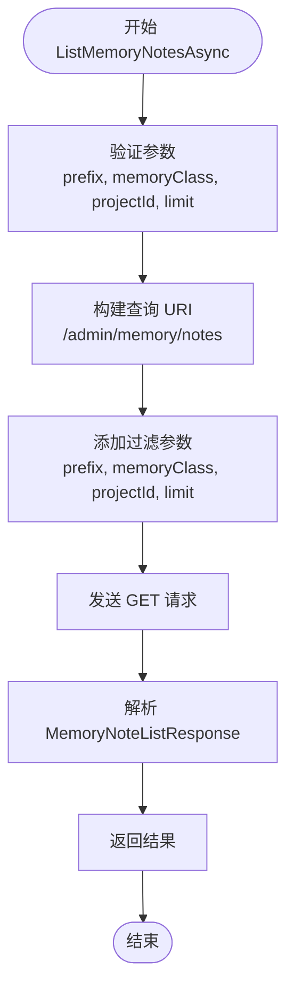
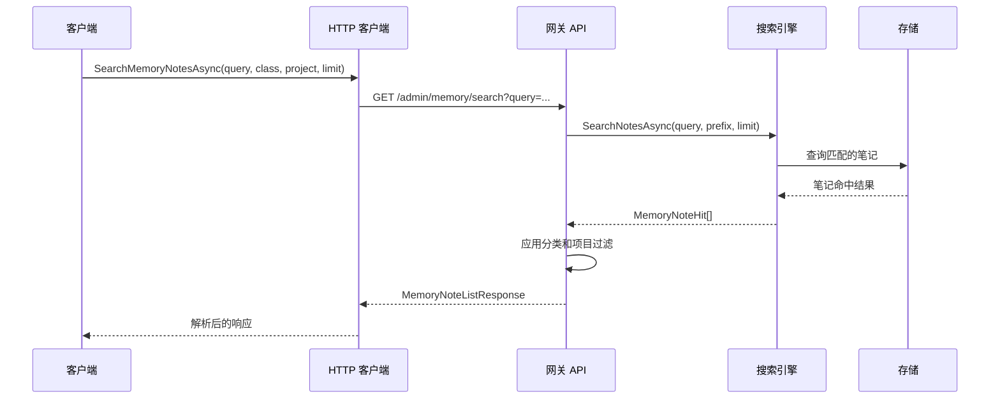
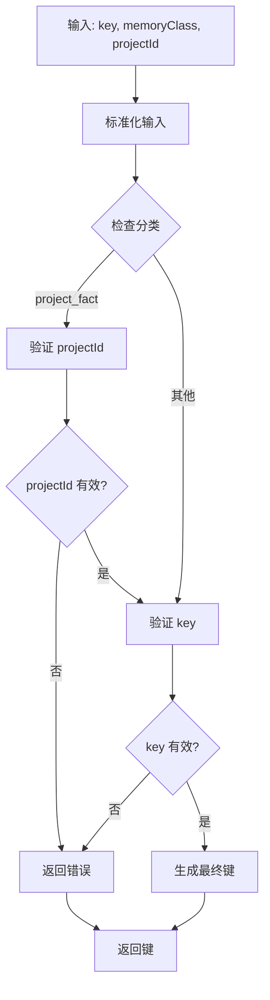
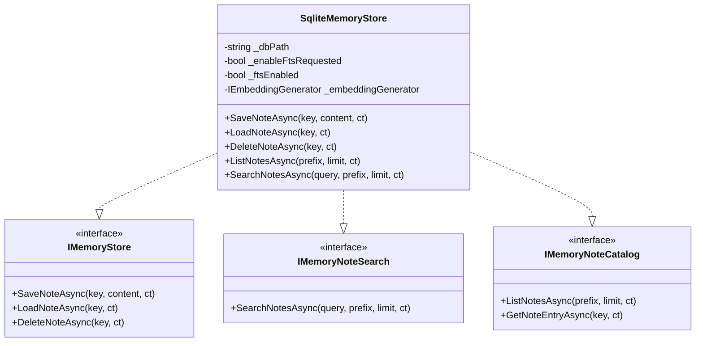
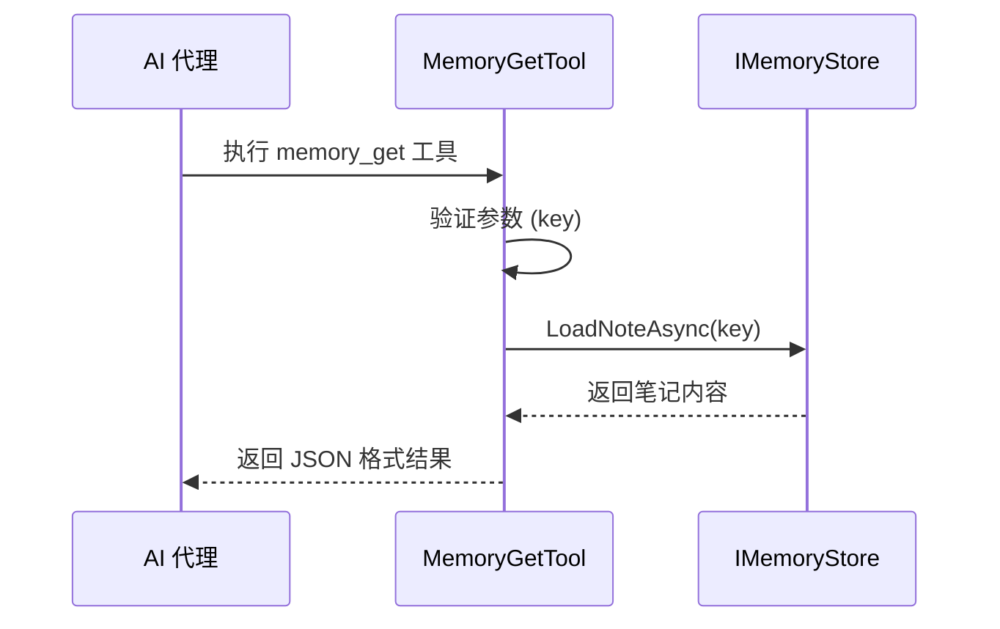
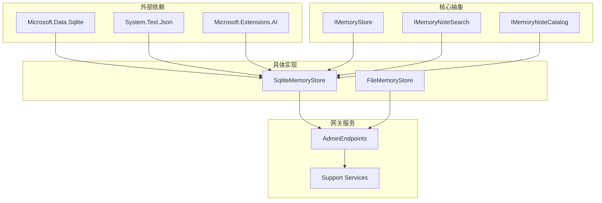

# 内存笔记管理

<cite>
**本文档引用的文件**
- [OperatorApiModels.cs](file://src/OpenClaw.Core/Models/OperatorApiModels.cs)
- [AdminEndpoints.Memory.cs](file://src/OpenClaw.Gateway/Endpoints/AdminEndpoints.Memory.cs)
- [AdminEndpoints.Support.cs](file://src/OpenClaw.Gateway/Endpoints/AdminEndpoints.Support.cs)
- [OpenClawHttpClient.cs](file://src/OpenClaw.Client/OpenClawHttpClient.cs)
- [IMemoryNoteSearch.cs](file://src/OpenClaw.Core/Abstractions/IMemoryNoteSearch.cs)
- [SqliteMemoryStore.cs](file://src/OpenClaw.Core/Memory/SqliteMemoryStore.cs)
- [MemoryGetTool.cs](file://src/OpenClaw.Agent/Tools/MemoryGetTool.cs)
- [admin.html](file://src/OpenClaw.Gateway/wwwroot/admin.html)
- [GatewayAdminEndpointTests.cs](file://src/OpenClaw.Tests/GatewayAdminEndpointTests.cs)
</cite>

## 目录
1. [简介](#简介)
2. [项目结构](#项目结构)
3. [核心组件](#核心组件)
4. [架构概览](#架构概览)
5. [详细组件分析](#详细组件分析)
6. [依赖关系分析](#依赖关系分析)
7. [性能考虑](#性能考虑)
8. [故障排除指南](#故障排除指南)
9. [结论](#结论)

## 简介

内存笔记管理功能是 OpenClaw 系统中的核心组件，负责提供完整的内存笔记 CRUD（创建、读取、更新、删除）操作能力。该功能支持多种内存笔记类型，包括通用笔记、项目事实、操作手册、已批准技能和已批准自动化等，并提供了强大的搜索和分类机制。

系统通过 REST API 提供统一的接口，支持前端界面和命令行工具的交互。内存笔记采用键值对存储模型，支持项目关联和分类管理，为 AI 代理提供了持久化的记忆能力。

## 项目结构

内存笔记管理功能分布在多个项目中，形成了清晰的分层架构：

**图表来源**
- [OpenClawHttpClient.cs:564-598](file://src/OpenClaw.Client/OpenClawHttpClient.cs#L564-L598)
- [AdminEndpoints.Memory.cs:197-378](file://src/OpenClaw.Gateway/Endpoints/AdminEndpoints.Memory.cs#L197-L378)
- [SqliteMemoryStore.cs:12-45](file://src/OpenClaw.Core/Memory/SqliteMemoryStore.cs#L12-L45)

**章节来源**
- [OpenClawHttpClient.cs:564-598](file://src/OpenClaw.Client/OpenClawHttpClient.cs#L564-L598)
- [AdminEndpoints.Memory.cs:197-378](file://src/OpenClaw.Gateway/Endpoints/AdminEndpoints.Memory.cs#L197-L378)
- [SqliteMemoryStore.cs:12-45](file://src/OpenClaw.Core/Memory/SqliteMemoryStore.cs#L12-L45)

## 核心组件

### 数据模型

内存笔记系统的核心数据模型包括以下关键类型：

#### MemoryNoteItem 数据模型
- **Key**: 笔记唯一标识符，采用命名空间前缀格式
- **DisplayKey**: 显示用的简化键名
- **MemoryClass**: 内存笔记分类（general、project_fact、operational_runbook、approved_skill、approved_automation）
- **ProjectId**: 关联的项目标识符（仅对 project_fact 类型必需）
- **Preview**: 内容预览（限制在 512 字符以内）
- **Content**: 完整内容（可选，用于详细视图）
- **UpdatedAtUtc**: 最后更新时间戳

#### 请求和响应模型
- **MemoryNoteListResponse**: 列表查询响应，包含过滤参数和结果集
- **MemoryNoteDetailResponse**: 详情查询响应，包含单个笔记的完整信息
- **MemoryNoteUpsertRequest**: 创建/更新请求，支持键、分类、项目ID和内容

**章节来源**
- [OperatorApiModels.cs:402-433](file://src/OpenClaw.Core/Models/OperatorApiModels.cs#L402-L433)

### API 接口

系统提供以下主要 API 接口：

#### 列表查询接口
- **GET /admin/memory/notes**: 获取内存笔记列表
- **GET /admin/memory/search**: 搜索内存笔记内容

#### 单项操作接口
- **GET /admin/memory/notes/{key}**: 获取指定笔记详情
- **POST /admin/memory/notes**: 创建或更新笔记
- **DELETE /admin/memory/notes/{key}**: 删除指定笔记

**章节来源**
- [AdminEndpoints.Memory.cs:197-378](file://src/OpenClaw.Gateway/Endpoints/AdminEndpoints.Memory.cs#L197-L378)

## 架构概览

内存笔记管理采用分层架构设计，确保了良好的关注点分离和可扩展性：

**图表来源**
- [AdminEndpoints.Memory.cs:197-221](file://src/OpenClaw.Gateway/Endpoints/AdminEndpoints.Memory.cs#L197-L221)
- [AdminEndpoints.Support.cs:470-486](file://src/OpenClaw.Gateway/Endpoints/AdminEndpoints.Support.cs#L470-L486)
- [SqliteMemoryStore.cs:492-517](file://src/OpenClaw.Core/Memory/SqliteMemoryStore.cs#L492-L517)

**章节来源**
- [AdminEndpoints.Memory.cs:197-221](file://src/OpenClaw.Gateway/Endpoints/AdminEndpoints.Memory.cs#L197-L221)
- [AdminEndpoints.Support.cs:470-486](file://src/OpenClaw.Gateway/Endpoints/AdminEndpoints.Support.cs#L470-L486)

## 详细组件分析

### 客户端 API 实现

#### ListMemoryNotesAsync 方法
该方法实现内存笔记列表查询功能：

**图表来源**
- [OpenClawHttpClient.cs:564-570](file://src/OpenClaw.Client/OpenClawHttpClient.cs#L564-L570)
- [OpenClawHttpClient.cs:1623-1638](file://src/OpenClaw.Client/OpenClawHttpClient.cs#L1623-L1638)

#### SearchMemoryNotesAsync 方法
实现基于内容的搜索功能：

**图表来源**
- [OpenClawHttpClient.cs:572-578](file://src/OpenClaw.Client/OpenClawHttpClient.cs#L572-L578)
- [AdminEndpoints.Memory.cs:223-273](file://src/OpenClaw.Gateway/Endpoints/AdminEndpoints.Memory.cs#L223-L273)

**章节来源**
- [OpenClawHttpClient.cs:564-598](file://src/OpenClaw.Client/OpenClawHttpClient.cs#L564-L598)

### 网关端点实现

#### 内存笔记分类机制
系统支持五种内存笔记分类，每种都有特定的键命名规则：

| 分类 | 键前缀 | 必需参数 | 用途 |
|------|--------|----------|------|
| general | 无 | 无 | 通用笔记 |
| project_fact | project:{projectId}: | projectId | 项目事实数据 |
| operational_runbook | runbook: | 无 | 操作手册 |
| approved_skill | skill: | 无 | 已批准技能 |
| approved_automation | automation: | 无 | 已批准自动化 |

#### 键生成和验证

**图表来源**
- [AdminEndpoints.Support.cs:620-664](file://src/OpenClaw.Gateway/Endpoints/AdminEndpoints.Support.cs#L620-L664)

**章节来源**
- [AdminEndpoints.Support.cs:620-664](file://src/OpenClaw.Gateway/Endpoints/AdminEndpoints.Support.cs#L620-L664)

### 存储实现

#### SQLite 存储架构
内存笔记采用 SQLite 作为持久化存储，支持全文搜索和向量嵌入：

**图表来源**
- [SqliteMemoryStore.cs:12-45](file://src/OpenClaw.Core/Memory/SqliteMemoryStore.cs#L12-L45)
- [IMemoryNoteSearch.cs:18-27](file://src/OpenClaw.Core/Abstractions/IMemoryNoteSearch.cs#L18-L27)

**章节来源**
- [SqliteMemoryStore.cs:12-45](file://src/OpenClaw.Core/Memory/SqliteMemoryStore.cs#L12-L45)

### 工具集成

#### MemoryGetTool 工具
AI 代理可以通过 MemoryGetTool 直接检索内存笔记：

**图表来源**
- [MemoryGetTool.cs:18-35](file://src/OpenClaw.Agent/Tools/MemoryGetTool.cs#L18-L35)

**章节来源**
- [MemoryGetTool.cs:18-35](file://src/OpenClaw.Agent/Tools/MemoryGetTool.cs#L18-L35)

## 依赖关系分析

内存笔记管理系统具有清晰的依赖层次结构：

**图表来源**
- [SqliteMemoryStore.cs:1-25](file://src/OpenClaw.Core/Memory/SqliteMemoryStore.cs#L1-L25)
- [AdminEndpoints.Memory.cs:30-44](file://src/OpenClaw.Gateway/Endpoints/AdminEndpoints.Memory.cs#L30-L44)

**章节来源**
- [SqliteMemoryStore.cs:1-25](file://src/OpenClaw.Core/Memory/SqliteMemoryStore.cs#L1-L25)
- [AdminEndpoints.Memory.cs:30-44](file://src/OpenClaw.Gateway/Endpoints/AdminEndpoints.Memory.cs#L30-L44)

## 性能考虑

### 查询优化策略

1. **索引优化**: SQLite 数据库为 notes 表建立了适当的索引以优化查询性能
2. **全文搜索**: 支持 FTS5 全文搜索引擎，提供高效的文本搜索能力
3. **向量搜索**: 可选的嵌入向量支持，用于语义相似度搜索
4. **缓存机制**: 目录服务提供内存缓存，减少重复查询开销

### 内存管理

- **流式处理**: 大型查询结果采用流式处理，避免内存溢出
- **分页机制**: 默认限制查询结果数量，防止过度内存占用
- **内容预览**: 列表视图只返回内容预览，详细内容按需加载

## 故障排除指南

### 常见问题和解决方案

#### 认证和授权问题
- **症状**: 返回 401 或 403 状态码
- **原因**: 缺少有效的操作员令牌或权限不足
- **解决**: 确保请求包含有效的 Bearer 令牌，且具有 admin.memory 权限范围

#### 参数验证错误
- **症状**: 返回 400 状态码和错误消息
- **常见原因**:
  - 无效的 memoryClass 值
  - 缺少必需的 projectId（当使用 project_fact 分类时）
  - 无效的键格式
- **解决**: 检查输入参数格式，确保符合内存笔记键命名规则

#### 存储相关错误
- **症状**: 操作失败或返回空结果
- **可能原因**:
  - SQLite 数据库连接问题
  - 文件权限不足
  - 数据库损坏
- **解决**: 检查数据库文件权限，验证数据库完整性

**章节来源**
- [AdminEndpoints.Memory.cs:223-273](file://src/OpenClaw.Gateway/Endpoints/AdminEndpoints.Memory.cs#L223-L273)
- [AdminEndpoints.Support.cs:620-664](file://src/OpenClaw.Gateway/Endpoints/AdminEndpoints.Support.cs#L620-L664)

## 结论

内存笔记管理功能通过精心设计的架构实现了高效、可扩展的记忆管理能力。系统支持多种内存笔记类型、强大的搜索功能和灵活的分类机制，为 AI 代理提供了完整的记忆基础设施。

关键特性包括：
- **多层架构**: 清晰的关注点分离，便于维护和扩展
- **灵活的分类系统**: 支持五种不同的内存笔记类型
- **强大的搜索能力**: 支持全文搜索和可选的向量搜索
- **安全的访问控制**: 完整的认证和授权机制
- **工具集成**: 与 AI 代理工具系统的无缝集成

该系统为构建智能 AI 代理提供了坚实的基础，能够支持复杂的记忆管理和检索需求。