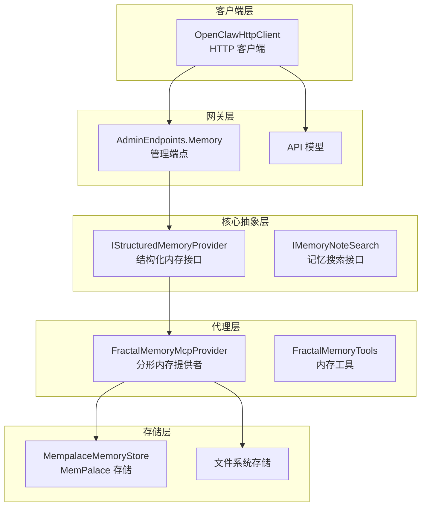
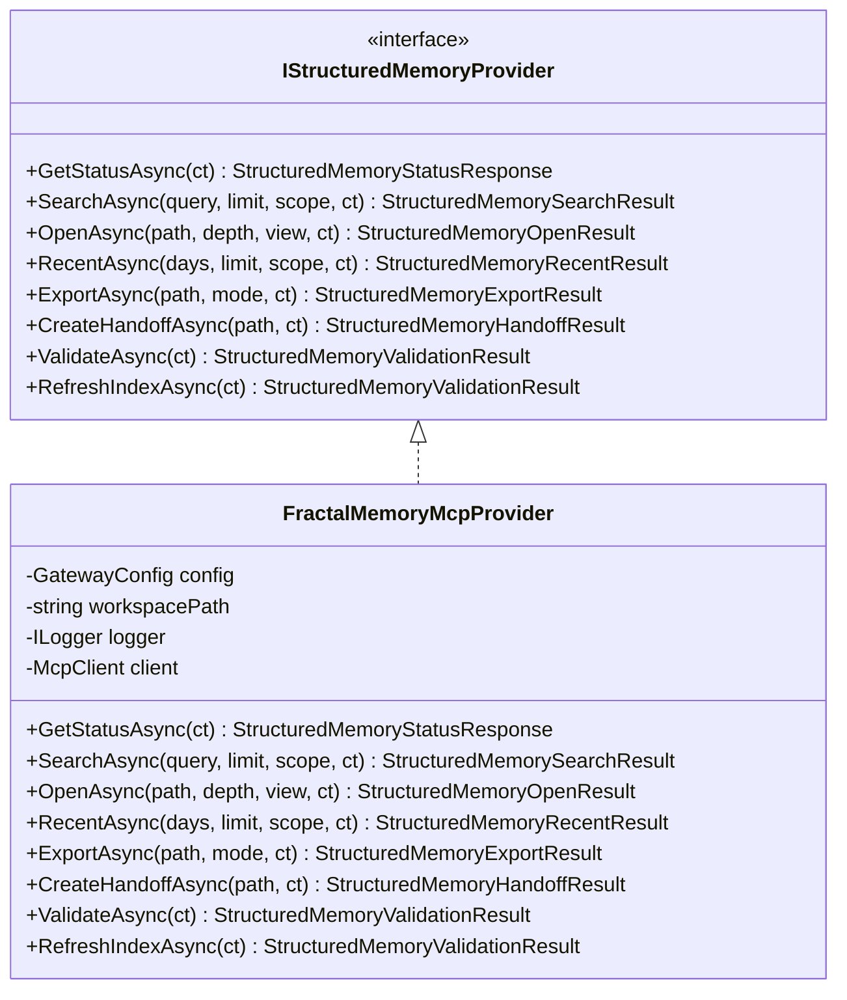
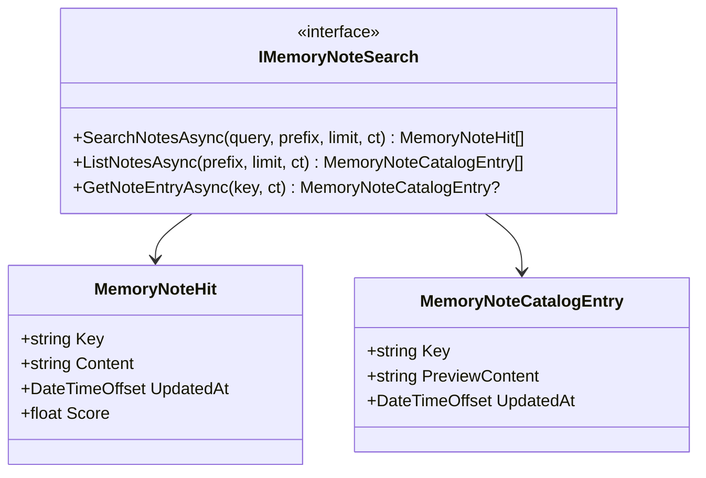
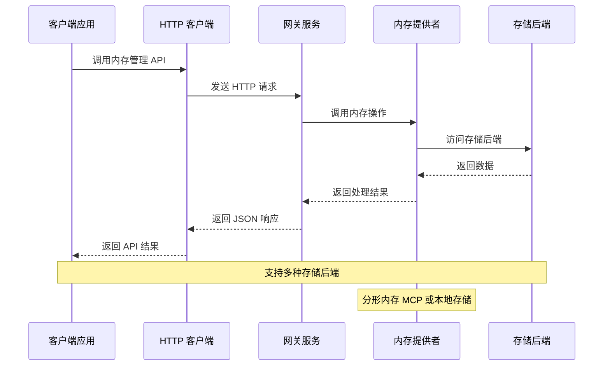
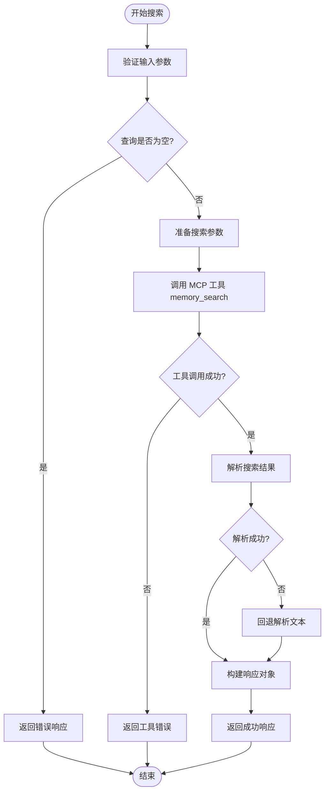
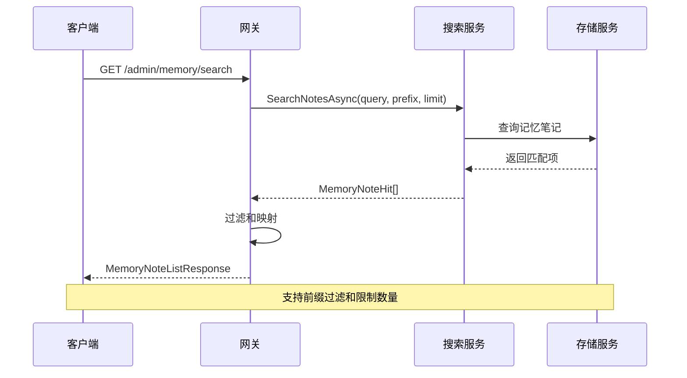
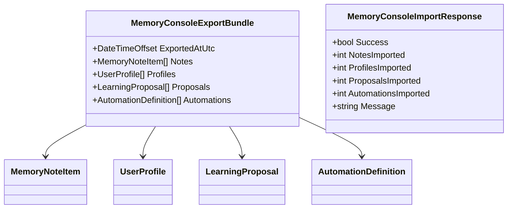
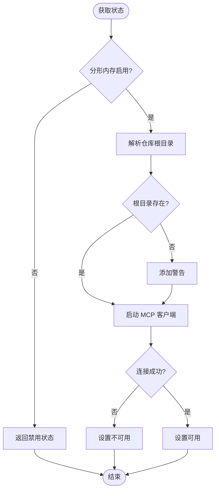
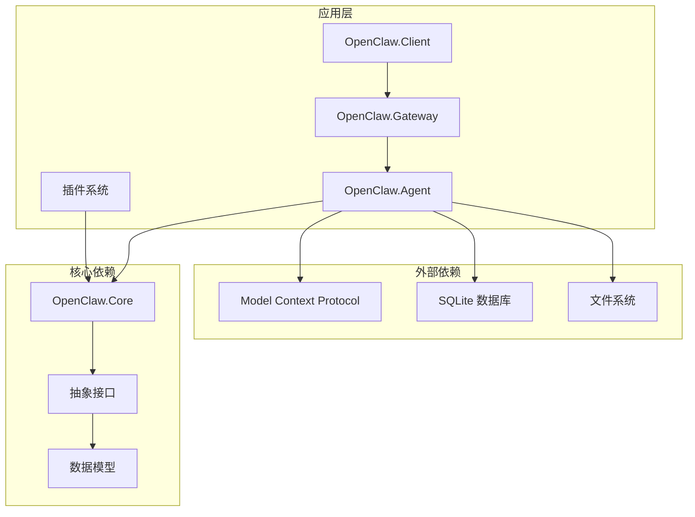
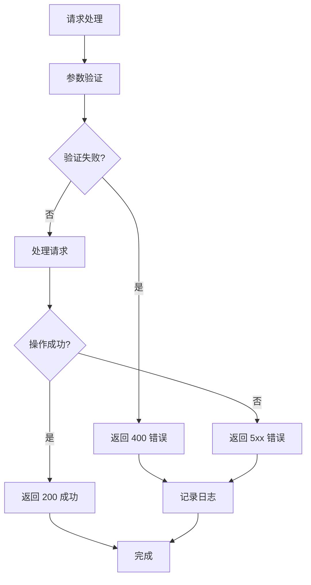

# 内存管理 API

<cite>
**本文档引用的文件**
- [FractalMemoryMcpProvider.cs](file://src/OpenClaw.Agent/Memory/FractalMemoryMcpProvider.cs)
- [IStructuredMemoryProvider.cs](file://src/OpenClaw.Core/Abstractions/IStructuredMemoryProvider.cs)
- [StructuredMemoryModels.cs](file://src/OpenClaw.Core/Models/StructuredMemoryModels.cs)
- [AdminEndpoints.Memory.cs](file://src/OpenClaw.Gateway/Endpoints/AdminEndpoints.Memory.cs)
- [OpenClawHttpClient.cs](file://src/OpenClaw.Client/OpenClawHttpClient.cs)
- [IMemoryNoteSearch.cs](file://src/OpenClaw.Core/Abstractions/IMemoryNoteSearch.cs)
- [MempalaceMemoryStore.cs](file://src/OpenClaw.Plugins.Mempalace/MempalaceMemoryStore.cs)
- [MafAgentRuntime.cs](file://src/OpenClaw.Agent/MafAgentRuntime.cs)
</cite>

## 目录
1. [简介](#简介)
2. [项目结构](#项目结构)
3. [核心组件](#核心组件)
4. [架构概览](#架构概览)
5. [详细组件分析](#详细组件分析)
6. [依赖关系分析](#依赖关系分析)
7. [性能考虑](#性能考虑)
8. [故障排除指南](#故障排除指南)
9. [结论](#结论)

## 简介

内存管理 API 是 OpenClaw 智能体系统中的关键组件，负责管理结构化记忆存储和非结构化记忆笔记。该系统提供了完整的内存生命周期管理功能，包括记忆检索、结构化查询、导出导入、分形内存操作等核心能力。

系统采用分层架构设计，通过抽象接口定义统一的内存管理契约，支持多种内存后端存储（包括分形内存 MCP 服务和本地文件存储）。内存管理 API 不仅支持传统的键值对记忆存储，还提供了高级的结构化内存查询和上下文构建能力。

## 项目结构

内存管理相关的核心文件分布在以下模块中：

**图表来源**
- [OpenClawHttpClient.cs:571-662](file://src/OpenClaw.Client/OpenClawHttpClient.cs#L571-L662)
- [AdminEndpoints.Memory.cs:30-40](file://src/OpenClaw.Gateway/Endpoints/AdminEndpoints.Memory.cs#L30-L40)
- [FractalMemoryMcpProvider.cs:13-30](file://src/OpenClaw.Agent/Memory/FractalMemoryMcpProvider.cs#L13-L30)

**章节来源**
- [OpenClawHttpClient.cs:571-662](file://src/OpenClaw.Client/OpenClawHttpClient.cs#L571-L662)
- [AdminEndpoints.Memory.cs:30-40](file://src/OpenClaw.Gateway/Endpoints/AdminEndpoints.Memory.cs#L30-L40)

## 核心组件

### 结构化内存提供者接口

IStructuredMemoryProvider 定义了完整的结构化内存管理接口：

**图表来源**
- [IStructuredMemoryProvider.cs:5-15](file://src/OpenClaw.Core/Abstractions/IStructuredMemoryProvider.cs#L5-L15)
- [FractalMemoryMcpProvider.cs:13-30](file://src/OpenClaw.Agent/Memory/FractalMemoryMcpProvider.cs#L13-L30)

### 记忆笔记管理接口

IMemoryNoteSearch 提供了非结构化的记忆笔记管理能力：

**图表来源**
- [IMemoryNoteSearch.cs:3-27](file://src/OpenClaw.Core/Abstractions/IMemoryNoteSearch.cs#L3-L27)

**章节来源**
- [IStructuredMemoryProvider.cs:5-15](file://src/OpenClaw.Core/Abstractions/IStructuredMemoryProvider.cs#L5-L15)
- [IMemoryNoteSearch.cs:18-27](file://src/OpenClaw.Core/Abstractions/IMemoryNoteSearch.cs#L18-L27)

## 架构概览

内存管理系统采用分层架构，从客户端到存储层形成清晰的数据流：

**图表来源**
- [OpenClawHttpClient.cs:571-662](file://src/OpenClaw.Client/OpenClawHttpClient.cs#L571-L662)
- [AdminEndpoints.Memory.cs:223-273](file://src/OpenClaw.Gateway/Endpoints/AdminEndpoints.Memory.cs#L223-L273)
- [FractalMemoryMcpProvider.cs:222-277](file://src/OpenClaw.Agent/Memory/FractalMemoryMcpProvider.cs#L222-L277)

## 详细组件分析

### 结构化内存查询系统

#### 搜索功能实现

结构化内存搜索功能提供了强大的内容检索能力：

**图表来源**
- [FractalMemoryMcpProvider.cs:70-95](file://src/OpenClaw.Agent/Memory/FractalMemoryMcpProvider.cs#L70-L95)

#### 内存节点打开功能

内存节点打开功能支持多维度的内容访问：

| 视图类型 | 描述 | 深度级别 |
|---------|------|----------|
| index | 索引视图 | 0 (Pointer) |
| state | 当前状态 | 1 (Orientation) |
| working | 工作深度 | 2 (Working) |
| deep | 深入探索 | 3 (Deep) |

**章节来源**
- [FractalMemoryMcpProvider.cs:97-116](file://src/OpenClaw.Agent/Memory/FractalMemoryMcpProvider.cs#L97-L116)
- [FractalMemoryMcpProvider.cs:808-815](file://src/OpenClaw.Agent/Memory/FractalMemoryMcpProvider.cs#L808-L815)

### 非结构化记忆笔记管理

#### 记忆笔记搜索流程

**图表来源**
- [AdminEndpoints.Memory.cs:223-273](file://src/OpenClaw.Gateway/Endpoints/AdminEndpoints.Memory.cs#L223-L273)
- [IMemoryNoteSearch.cs:20-21](file://src/OpenClaw.Core/Abstractions/IMemoryNoteSearch.cs#L20-L21)

#### 记忆笔记保存和删除

记忆笔记的 CRUD 操作提供了完整的生命周期管理：

**章节来源**
- [AdminEndpoints.Memory.cs:275-378](file://src/OpenClaw.Gateway/Endpoints/AdminEndpoints.Memory.cs#L275-L378)
- [OpenClawHttpClient.cs:583-597](file://src/OpenClaw.Client/OpenClawHttpClient.cs#L583-L597)

### 内存导出导入系统

#### 导出功能实现

内存导出功能支持多种格式和范围：

**图表来源**
- [StructuredMemoryModels.cs:435-442](file://src/OpenClaw.Core/Models/StructuredMemoryModels.cs#L435-L442)
- [StructuredMemoryModels.cs:444-449](file://src/OpenClaw.Core/Models/StructuredMemoryModels.cs#L444-L449)

**章节来源**
- [AdminEndpoints.Memory.cs:457-582](file://src/OpenClaw.Gateway/Endpoints/AdminEndpoints.Memory.cs#L457-L582)
- [OpenClawHttpClient.cs:599-622](file://src/OpenClaw.Client/OpenClawHttpClient.cs#L599-L622)

### 分形内存操作

#### 分形内存状态管理

分形内存提供了高级的记忆组织和检索能力：

**图表来源**
- [FractalMemoryMcpProvider.cs:32-68](file://src/OpenClaw.Agent/Memory/FractalMemoryMcpProvider.cs#L32-L68)

**章节来源**
- [FractalMemoryMcpProvider.cs:32-68](file://src/OpenClaw.Agent/Memory/FractalMemoryMcpProvider.cs#L32-L68)
- [FractalMemoryMcpProvider.cs:279-330](file://src/OpenClaw.Agent/Memory/FractalMemoryMcpProvider.cs#L279-L330)

## 依赖关系分析

内存管理系统的依赖关系展现了清晰的分层架构：

**图表来源**
- [FractalMemoryMcpProvider.cs:1-10](file://src/OpenClaw.Agent/Memory/FractalMemoryMcpProvider.cs#L1-L10)
- [MempalaceMemoryStore.cs:1-12](file://src/OpenClaw.Plugins.Mempalace/MempalaceMemoryStore.cs#L1-L12)

**章节来源**
- [FractalMemoryMcpProvider.cs:1-10](file://src/OpenClaw.Agent/Memory/FractalMemoryMcpProvider.cs#L1-L10)
- [MempalaceMemoryStore.cs:1-12](file://src/OpenClaw.Plugins.Mempalace/MempalaceMemoryStore.cs#L1-L12)

## 性能考虑

### 内存查询优化

系统在多个层面实现了性能优化：

1. **参数限制**: 搜索限制在 1-50 个结果范围内
2. **深度控制**: 分形内存深度限制在 0-3 级别
3. **超时机制**: MCP 工具调用超时控制在 60 秒
4. **缓存策略**: 使用信号量控制 MCP 客户端并发访问

### 存储后端选择

不同的存储后端具有不同的性能特征：

| 存储后端 | 优点 | 适用场景 | 性能特征 |
|----------|------|----------|----------|
| MemPalace | 高级索引和查询 | 大规模知识库 | 高查询性能 |
| SQLite | 轻量级存储 | 小型项目 | 低延迟 |
| 文件系统 | 简单可靠 | 备份和迁移 | 稳定 |

## 故障排除指南

### 常见问题诊断

#### 分形内存连接失败

当遇到分形内存连接问题时，检查以下配置：

1. **MCP 命令路径**: 确认 `Memory.Fractal.McpCommand` 配置正确
2. **仓库根目录**: 验证 `RepositoryRoot` 目录存在且可访问
3. **环境变量**: 检查 `FRACTALMEM_REPOSITORY_ROOT` 设置

#### 记忆搜索无结果

如果搜索没有返回预期结果：

1. **查询优化**: 简化查询条件，增加关键词
2. **范围限制**: 使用更精确的 `scope` 参数
3. **索引刷新**: 执行 `RefreshIndexAsync` 刷新索引

**章节来源**
- [FractalMemoryMcpProvider.cs:279-330](file://src/OpenClaw.Agent/Memory/FractalMemoryMcpProvider.cs#L279-L330)
- [FractalMemoryMcpProvider.cs:222-277](file://src/OpenClaw.Agent/Memory/FractalMemoryMcpProvider.cs#L222-L277)

### 错误处理机制

系统提供了完善的错误处理机制：

**图表来源**
- [AdminEndpoints.Memory.cs:281-400](file://src/OpenClaw.Gateway/Endpoints/AdminEndpoints.Memory.cs#L281-L400)

## 结论

内存管理 API 提供了完整而灵活的记忆存储解决方案，支持从简单的键值对存储到复杂的结构化知识管理。系统的设计充分考虑了可扩展性和性能优化，能够适应不同规模和复杂度的应用场景。

通过分层架构和抽象接口设计，内存管理系统实现了良好的模块化和可测试性。同时，丰富的错误处理和监控机制确保了系统的稳定性和可靠性。

未来的发展方向包括：
- 增加更多的存储后端支持
- 优化大规模数据的查询性能
- 扩展记忆笔记的元数据管理能力
- 提供更丰富的记忆检索算法