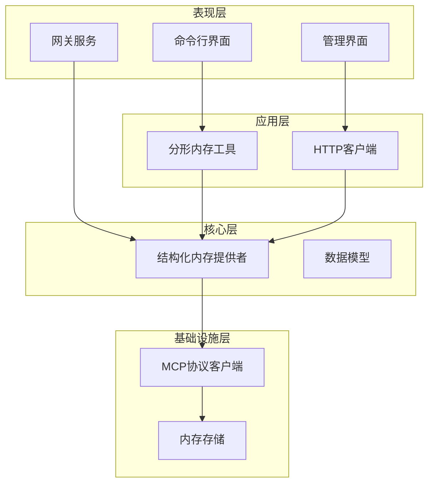
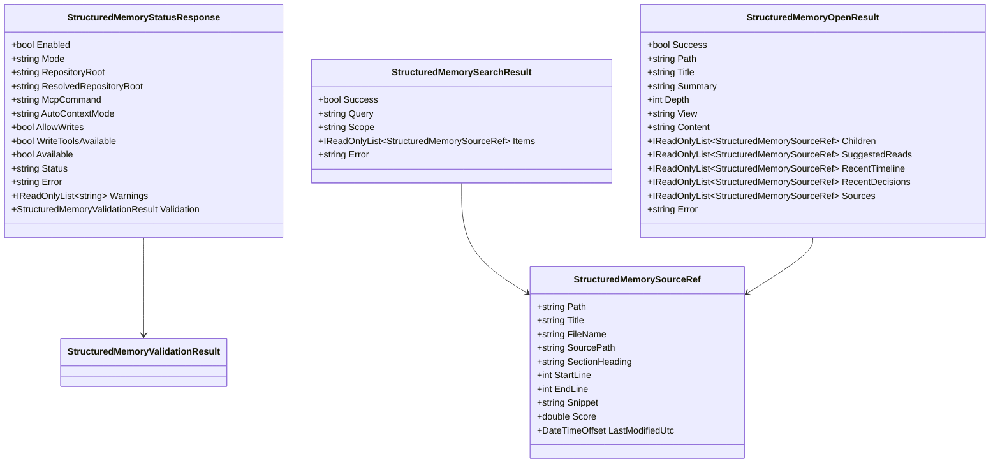
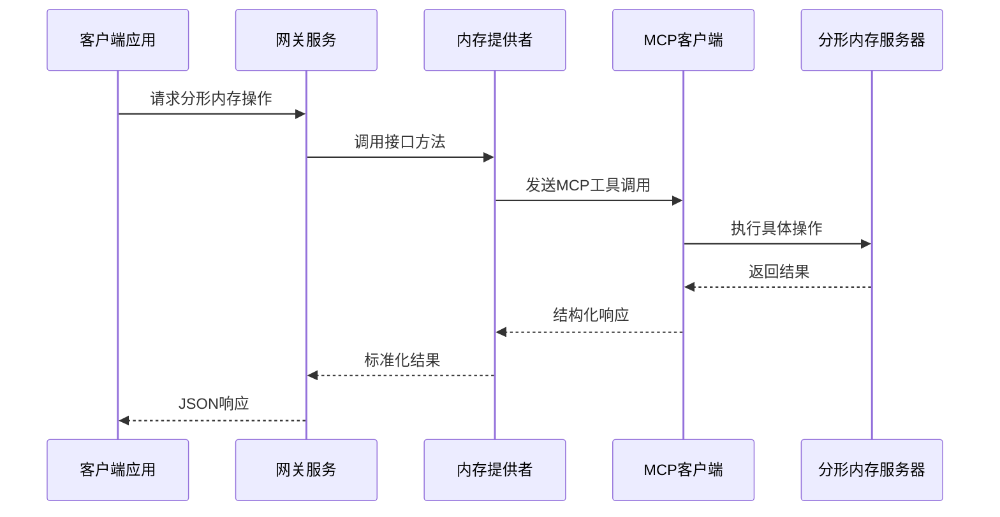
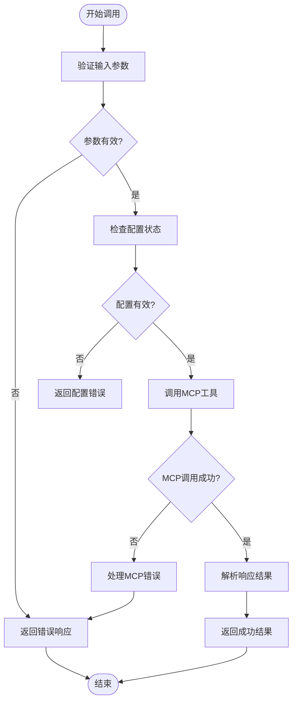
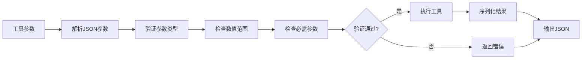
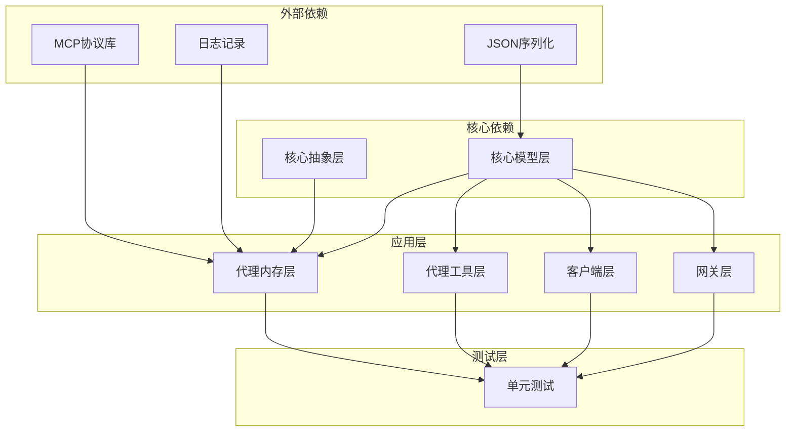

# 分形内存管理

<cite>
**本文档引用的文件**
- [StructuredMemoryModels.cs](file://src/OpenClaw.Core/Models/StructuredMemoryModels.cs)
- [IStructuredMemoryProvider.cs](file://src/OpenClaw.Core/Abstractions/IStructuredMemoryProvider.cs)
- [FractalMemoryMcpProvider.cs](file://src/OpenClaw.Agent/Memory/FractalMemoryMcpProvider.cs)
- [FractalMemoryTools.cs](file://src/OpenClaw.Agent/Tools/FractalMemoryTools.cs)
- [OpenClawHttpClient.cs](file://src/OpenClaw.Client/OpenClawHttpClient.cs)
- [MemoryCommands.cs](file://src/OpenClaw.Cli/MemoryCommands.cs)
- [AdminEndpoints.Memory.cs](file://src/OpenClaw.Gateway/Endpoints/AdminEndpoints.Memory.cs)
- [FractalMemoryTests.cs](file://src/OpenClaw.Tests/FractalMemoryTests.cs)
- [admin.html](file://src/OpenClaw.Gateway/wwwroot/admin.html)
</cite>

## 目录
1. [简介](#简介)
2. [项目结构](#项目结构)
3. [核心组件](#核心组件)
4. [架构概览](#架构概览)
5. [详细组件分析](#详细组件分析)
6. [依赖关系分析](#依赖关系分析)
7. [性能考虑](#性能考虑)
8. [故障排除指南](#故障排除指南)
9. [结论](#结论)
10. [附录](#附录)

## 简介

分形内存管理是 OpenClaw 项目中的一个核心功能模块，它提供了对结构化项目记忆体的统一访问接口。该系统通过 MCP（Model Context Protocol）协议与外部分形内存服务器通信，实现了对项目知识库的智能检索、浏览和管理。

分形内存的核心优势在于其能够：
- 提供层次化的项目知识组织结构
- 支持多维度的内容检索和导航
- 实现自动化的上下文注入和记忆管理
- 提供完整的写入和维护能力
- 支持手办包创建和知识转移

## 项目结构

分形内存管理系统在项目中采用分层架构设计，主要包含以下层次：



**图表来源**
- [FractalMemoryMcpProvider.cs:13-330](file://src/OpenClaw.Agent/Memory/FractalMemoryMcpProvider.cs#L13-L330)
- [FractalMemoryTools.cs:10-182](file://src/OpenClaw.Agent/Tools/FractalMemoryTools.cs#L10-L182)
- [OpenClawHttpClient.cs:624-662](file://src/OpenClaw.Client/OpenClawHttpClient.cs#L624-L662)

**章节来源**
- [FractalMemoryMcpProvider.cs:1-828](file://src/OpenClaw.Agent/Memory/FractalMemoryMcpProvider.cs#L1-L828)
- [FractalMemoryTools.cs:1-243](file://src/OpenClaw.Agent/Tools/FractalMemoryTools.cs#L1-L243)

## 核心组件

分形内存管理系统由多个核心组件构成，每个组件都有明确的职责和接口定义：

### 主要接口和实现

| 组件 | 类型 | 职责 | 关键方法 |
|------|------|------|----------|
| IStructuredMemoryProvider | 接口 | 定义内存管理标准接口 | GetStatusAsync, SearchAsync, OpenAsync, RecentAsync, ExportAsync, CreateHandoffAsync, ValidateAsync, RefreshIndexAsync |
| FractalMemoryMcpProvider | 实现类 | MCP协议内存提供者 | 完整实现所有接口方法 |
| FractalMemoryTools | 工具集合 | AI代理工具封装 | 搜索、打开、导出、验证等工具 |

### 数据模型体系

系统定义了完整的数据传输对象（DTO）体系，用于在各层之间传递数据：



**图表来源**
- [StructuredMemoryModels.cs:3-106](file://src/OpenClaw.Core/Models/StructuredMemoryModels.cs#L3-L106)

**章节来源**
- [IStructuredMemoryProvider.cs:5-15](file://src/OpenClaw.Core/Abstractions/IStructuredMemoryProvider.cs#L5-L15)
- [StructuredMemoryModels.cs:1-134](file://src/OpenClaw.Core/Models/StructuredMemoryModels.cs#L1-L134)

## 架构概览

分形内存管理系统采用分层架构，实现了清晰的关注点分离：



**图表来源**
- [FractalMemoryMcpProvider.cs:222-277](file://src/OpenClaw.Agent/Memory/FractalMemoryMcpProvider.cs#L222-L277)
- [AdminEndpoints.Memory.cs:45-94](file://src/OpenClaw.Gateway/Endpoints/AdminEndpoints.Memory.cs#L45-L94)

系统架构的关键特点：
- **接口抽象**：通过 IStructuredMemoryProvider 定义统一接口
- **协议适配**：FractalMemoryMcpProvider 实现 MCP 协议适配
- **工具封装**：FractalMemoryTools 提供 AI 代理工具接口
- **多入口支持**：CLI、HTTP API、管理界面等多种访问方式

**章节来源**
- [FractalMemoryMcpProvider.cs:13-220](file://src/OpenClaw.Agent/Memory/FractalMemoryMcpProvider.cs#L13-L220)
- [AdminEndpoints.Memory.cs:30-195](file://src/OpenClaw.Gateway/Endpoints/AdminEndpoints.Memory.cs#L30-L195)

## 详细组件分析

### FractalMemoryMcpProvider 分析

FractalMemoryMcpProvider 是系统的核心实现类，负责与 MCP 服务器通信并提供标准的内存管理接口。

#### 核心功能实现

| 方法 | 功能描述 | 参数 | 返回值 |
|------|----------|------|--------|
| GetStatusAsync | 获取分形内存状态 | CancellationToken | StructuredMemoryStatusResponse |
| SearchAsync | 搜索分形内存内容 | query, limit, scope, ct | StructuredMemorySearchResult |
| OpenAsync | 打开分形内存节点 | path, depth, view, ct | StructuredMemoryOpenResult |
| RecentAsync | 获取最近变更节点 | days, limit, scope, ct | StructuredMemoryRecentResult |
| ExportAsync | 导出节点内容 | path, mode, ct | StructuredMemoryExportResult |
| CreateHandoffAsync | 创建手办包 | path, ct | StructuredMemoryHandoffResult |
| ValidateAsync | 验证内存仓库 | ct | StructuredMemoryValidationResult |
| RefreshIndexAsync | 刷新索引 | ct | StructuredMemoryValidationResult |

#### 错误处理机制



**图表来源**
- [FractalMemoryMcpProvider.cs:222-277](file://src/OpenClaw.Agent/Memory/FractalMemoryMcpProvider.cs#L222-L277)

**章节来源**
- [FractalMemoryMcpProvider.cs:32-198](file://src/OpenClaw.Agent/Memory/FractalMemoryMcpProvider.cs#L32-L198)

### FractalMemoryTools 工具分析

FractalMemoryTools 提供了面向 AI 代理的工具接口，将内存管理功能封装为可执行的工具。

#### 工具类型和用途

| 工具名称 | 类型 | 描述 | 适用场景 |
|----------|------|------|----------|
| fractal_memory_search | 只读工具 | 搜索分形内存内容 | 信息检索、知识查询 |
| fractal_memory_open | 只读工具 | 打开分形内存节点 | 内容浏览、上下文获取 |
| fractal_memory_recent | 只读工具 | 获取最近变更节点 | 项目状态跟踪 |
| fractal_memory_export | 只读工具 | 导出节点内容 | 内容提取、报告生成 |
| fractal_memory_validate | 只读工具 | 验证内存仓库 | 系统健康检查 |
| fractal_memory_handoff_create | 写入工具 | 创建手办包 | 知识转移、项目交接 |
| fractal_memory_index_refresh | 写入工具 | 刷新索引 | 索引维护、数据同步 |

#### 参数验证和限制

每个工具都实现了严格的参数验证机制：



**图表来源**
- [FractalMemoryTools.cs:184-242](file://src/OpenClaw.Agent/Tools/FractalMemoryTools.cs#L184-L242)

**章节来源**
- [FractalMemoryTools.cs:10-182](file://src/OpenClaw.Agent/Tools/FractalMemoryTools.cs#L10-L182)

### 数据模型详解

系统定义了完整的数据传输对象体系，确保各组件间的数据一致性。

#### 核心数据模型

| 模型名称 | 字段说明 | 使用场景 |
|----------|----------|----------|
| StructuredMemoryStatusResponse | 状态信息、配置详情、可用性标志 | 系统状态监控 |
| StructuredMemorySearchResult | 搜索结果、匹配项列表 | 内容检索显示 |
| StructuredMemoryOpenResult | 节点内容、子节点、建议阅读 | 内容浏览界面 |
| StructuredMemoryRecentResult | 最近变更列表 | 项目活动跟踪 |
| StructuredMemoryExportResult | 导出内容、源引用、统计信息 | 内容导出处理 |
| StructuredMemoryHandoffResult | 手办包信息、源引用 | 知识转移管理 |
| StructuredMemoryValidationResult | 验证结果、问题列表 | 系统健康检查 |
| StructuredMemorySourceRef | 源引用信息、位置标记 | 内容定位和引用 |

#### 复杂度分析

- **时间复杂度**：大多数操作为 O(n) 级别，其中 n 为匹配或处理的项目数量
- **空间复杂度**：根据返回结果大小而定，通常为 O(k) 级别，k 为实际数据量
- **网络延迟**：主要受 MCP 服务器响应时间和网络状况影响

**章节来源**
- [StructuredMemoryModels.cs:3-134](file://src/OpenClaw.Core/Models/StructuredMemoryModels.cs#L3-L134)

## 依赖关系分析

分形内存管理系统具有清晰的依赖关系结构：



**图表来源**
- [FractalMemoryMcpProvider.cs:1-10](file://src/OpenClaw.Agent/Memory/FractalMemoryMcpProvider.cs#L1-L10)
- [FractalMemoryTools.cs:1-6](file://src/OpenClaw.Agent/Tools/FractalMemoryTools.cs#L1-L6)

### 关键依赖关系

1. **MCP 协议依赖**：FractalMemoryMcpProvider 依赖 MCP 协议库进行通信
2. **JSON 序列化依赖**：所有数据模型都依赖 System.Text.Json 进行序列化
3. **配置管理依赖**：依赖 GatewayConfig 进行运行时配置
4. **日志记录依赖**：使用 Microsoft.Extensions.Logging 进行日志管理

**章节来源**
- [FractalMemoryMcpProvider.cs:1-30](file://src/OpenClaw.Agent/Memory/FractalMemoryMcpProvider.cs#L1-L30)
- [FractalMemoryTests.cs:1-16](file://src/OpenClaw.Tests/FractalMemoryTests.cs#L1-L16)

## 性能考虑

分形内存管理系统在设计时充分考虑了性能优化：

### 缓存策略
- **MCP 客户端缓存**：复用已建立的 MCP 连接，避免频繁连接开销
- **响应内容缓存**：对常用查询结果进行短期缓存
- **配置状态缓存**：缓存分形内存状态以减少重复检查

### 异步处理
- **非阻塞操作**：所有网络操作都采用异步模式
- **超时控制**：设置合理的操作超时时间（默认60秒）
- **取消令牌**：支持操作取消和中断

### 内存管理
- **资源释放**：正确管理 MCP 客户端生命周期
- **内存池**：使用 StringBuilder 进行字符串拼接优化
- **对象重用**：复用 JSON 解析器和序列化器

### 网络优化
- **批量操作**：支持批量查询和操作
- **压缩传输**：在网络传输中启用适当的压缩
- **连接复用**：复用 HTTP 连接减少握手开销

## 故障排除指南

### 常见问题和解决方案

#### MCP 服务器连接问题
**症状**：无法连接到 MCP 服务器，返回连接失败错误
**原因**：
- MCP 命令路径配置错误
- 服务器未启动或不可达
- 权限不足无法启动进程

**解决方案**：
1. 检查 `Memory.Fractal.McpCommand` 配置
2. 验证 MCP 服务器是否正常运行
3. 确认有足够的权限启动 MCP 服务器

#### 分形内存仓库问题
**症状**：分形内存状态显示不可用
**原因**：
- 仓库根目录不存在
- 缺少必要的配置文件
- 权限问题

**解决方案**：
1. 检查仓库根目录路径配置
2. 确认 `.fractal-memory/config.yaml` 文件存在
3. 验证文件系统权限

#### 查询结果异常
**症状**：查询返回空结果或错误
**原因**：
- 查询参数无效
- 仓库索引损坏
- 搜索范围过大

**解决方案**：
1. 验证查询参数格式和范围
2. 尝试缩小搜索范围
3. 重新构建索引

**章节来源**
- [FractalMemoryMcpProvider.cs:279-330](file://src/OpenClaw.Agent/Memory/FractalMemoryMcpProvider.cs#L279-L330)
- [FractalMemoryTests.cs:189-204](file://src/OpenClaw.Tests/FractalMemoryTests.cs#L189-L204)

## 结论

分形内存管理系统是一个设计精良、功能完整的知识管理解决方案。它通过标准化的接口、灵活的架构和完善的错误处理机制，为 OpenClaw 项目提供了强大的结构化记忆能力。

### 主要优势
- **标准化接口**：通过 IStructuredMemoryProvider 提供统一的访问接口
- **协议适配**：支持 MCP 协议，便于集成不同的内存存储后端
- **多入口支持**：CLI、HTTP API、管理界面等多种使用方式
- **完整功能集**：涵盖查询、浏览、导出、验证等完整操作
- **安全可靠**：完善的参数验证和错误处理机制

### 适用场景
- 项目知识库管理
- 智能问答系统
- 自动化工作流
- 知识转移和交接
- 系统监控和诊断

## 附录

### 使用示例

#### 基本查询操作
```bash
# 获取分形内存状态
openclaw memory fractal status

# 搜索内容
openclaw memory fractal search "项目架构" --limit 10 --scope projects/

# 打开节点
openclaw memory fractal open projects/demo --depth 2 --view state

# 导出内容
openclaw memory fractal export projects/demo --mode compact
```

#### 高级操作
```bash
# 获取最近变更
openclaw memory fractal recent --days 30 --limit 10

# 验证内存仓库
openclaw memory fractal validate

# 刷新索引
openclaw memory fractal index refresh

# 创建手办包
openclaw memory fractal handoff create projects/demo
```

### 配置选项

| 配置项 | 默认值 | 描述 |
|--------|--------|------|
| Memory.Fractal.Enabled | false | 是否启用分形内存 |
| Memory.Fractal.Mode | "mcp" | 运行模式 |
| Memory.Fractal.McpCommand | "fractalmem-mcp" | MCP 服务器命令 |
| Memory.Fractal.DefaultDepth | 1 | 默认深度 |
| Memory.Fractal.DefaultView | "index" | 默认视图 |
| Memory.Fractal.DefaultExportMode | "compact" | 默认导出模式 |
| Memory.Fractal.AutoContextMode | "off" | 自动上下文模式 |
| Memory.Fractal.AllowWrites | false | 是否允许写入操作 |