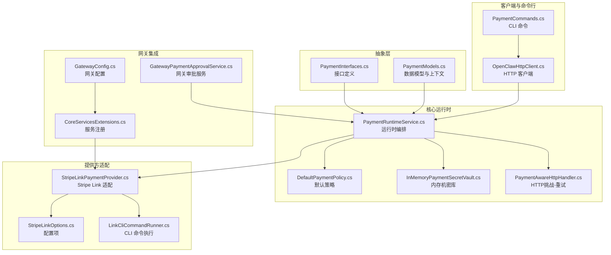
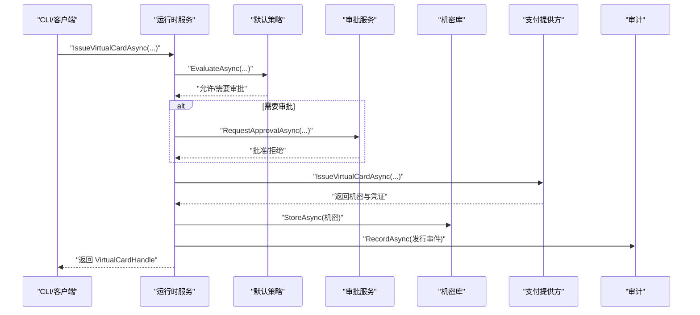
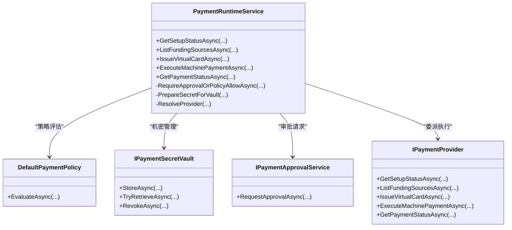
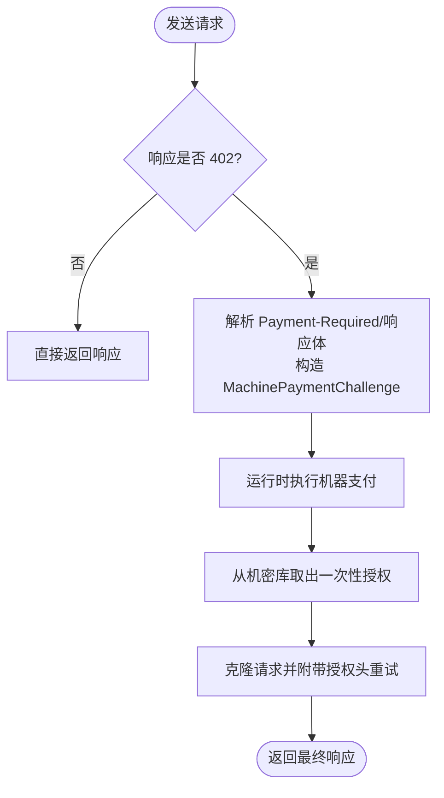
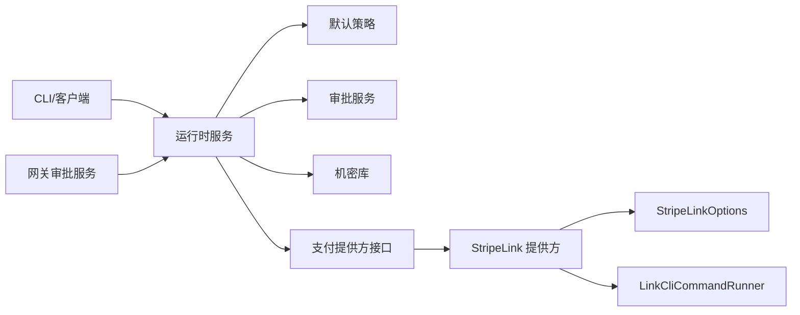

# 支付系统集成

<cite>
**本文引用的文件**   
- [PaymentInterfaces.cs](file://src/OpenClaw.Payments.Abstractions/PaymentInterfaces.cs)
- [PaymentModels.cs](file://src/OpenClaw.Payments.Abstractions/PaymentModels.cs)
- [PaymentRuntimeService.cs](file://src/OpenClaw.Payments.Core/PaymentRuntimeService.cs)
- [DefaultPaymentPolicy.cs](file://src/OpenClaw.Payments.Core/DefaultPaymentPolicy.cs)
- [InMemoryPaymentSecretVault.cs](file://src/OpenClaw.Payments.Core/InMemoryPaymentSecretVault.cs)
- [PaymentAwareHttpHandler.cs](file://src/OpenClaw.Payments.Core/PaymentAwareHttpHandler.cs)
- [StripeLinkPaymentProvider.cs](file://src/OpenClaw.Payments.StripeLink/StripeLinkPaymentProvider.cs)
- [StripeLinkOptions.cs](file://src/OpenClaw.Payments.StripeLink/StripeLinkOptions.cs)
- [LinkCliCommandRunner.cs](file://src/OpenClaw.Payments.StripeLink/LinkCliCommandRunner.cs)
- [PaymentCommands.cs](file://src/OpenClaw.Cli/PaymentCommands.cs)
- [OpenClawHttpClient.cs](file://src/OpenClaw.Client/OpenClawHttpClient.cs)
- [GatewayPaymentApprovalService.cs](file://src/OpenClaw.Gateway/GatewayPaymentApprovalService.cs)
- [CoreServicesExtensions.cs](file://src/OpenClaw.Gateway/Composition/CoreServicesExtensions.cs)
- [GatewayConfig.cs](file://src/OpenClaw.Core/Models/GatewayConfig.cs)
- [PaymentRuntimeTests.cs](file://src/OpenClaw.Tests/PaymentRuntimeTests.cs)
</cite>

## 目录
1. [简介](#简介)
2. [项目结构](#项目结构)
3. [核心组件](#核心组件)
4. [架构总览](#架构总览)
5. [详细组件分析](#详细组件分析)
6. [依赖关系分析](#依赖关系分析)
7. [性能考虑](#性能考虑)
8. [故障排除指南](#故障排除指南)
9. [结论](#结论)
10. [附录](#附录)

## 简介
本技术文档面向支付系统集成，围绕支付运行时与支付提供方适配层，系统性阐述以下能力与实现细节：
- 支付相关 API：GetPaymentSetupStatusAsync、ListPaymentFundingSourcesAsync、IssueVirtualCardAsync、ExecuteMachinePaymentAsync、GetPaymentStatusAsync
- 支付流程：虚拟卡发行、机器支付执行、支付状态查询
- 数据模型：PaymentSetupStatus、VirtualCardHandle、MachinePaymentResult 等
- 安全机制：审批策略、机密存储与替换、敏感信息脱敏
- 错误处理与重试策略：异常类型、审计记录、边界条件
- 使用示例：配置支付提供商、发行虚拟卡、执行支付、监控支付状态

## 项目结构
支付子系统由“抽象层（Abstractions）+ 核心运行时（Core）+ 提供方适配（StripeLink）+ CLI/客户端（CLI/Client）+ 网关集成（Gateway）”构成，职责清晰、边界明确。

图表来源
- [PaymentInterfaces.cs:1-60](file://src/OpenClaw.Payments.Abstractions/PaymentInterfaces.cs#L1-L60)
- [PaymentModels.cs:1-400](file://src/OpenClaw.Payments.Abstractions/PaymentModels.cs#L1-L400)
- [PaymentRuntimeService.cs:1-433](file://src/OpenClaw.Payments.Core/PaymentRuntimeService.cs#L1-L433)
- [DefaultPaymentPolicy.cs:1-60](file://src/OpenClaw.Payments.Core/DefaultPaymentPolicy.cs#L1-L60)
- [InMemoryPaymentSecretVault.cs:1-73](file://src/OpenClaw.Payments.Core/InMemoryPaymentSecretVault.cs#L1-L73)
- [PaymentAwareHttpHandler.cs:1-172](file://src/OpenClaw.Payments.Core/PaymentAwareHttpHandler.cs#L1-L172)
- [StripeLinkPaymentProvider.cs:1-217](file://src/OpenClaw.Payments.StripeLink/StripeLinkPaymentProvider.cs#L1-L217)
- [StripeLinkOptions.cs:1-11](file://src/OpenClaw.Payments.StripeLink/StripeLinkOptions.cs#L1-L11)
- [LinkCliCommandRunner.cs:1-46](file://src/OpenClaw.Payments.StripeLink/LinkCliCommandRunner.cs#L1-L46)
- [PaymentCommands.cs:1-206](file://src/OpenClaw.Cli/PaymentCommands.cs#L1-L206)
- [OpenClawHttpClient.cs:330-351](file://src/OpenClaw.Client/OpenClawHttpClient.cs#L330-L351)
- [GatewayPaymentApprovalService.cs:1-104](file://src/OpenClaw.Gateway/GatewayPaymentApprovalService.cs#L1-L104)
- [CoreServicesExtensions.cs:60-78](file://src/OpenClaw.Gateway/Composition/CoreServicesExtensions.cs#L60-L78)
- [GatewayConfig.cs:517-546](file://src/OpenClaw.Core/Models/GatewayConfig.cs#L517-L546)

章节来源
- [PaymentInterfaces.cs:1-60](file://src/OpenClaw.Payments.Abstractions/PaymentInterfaces.cs#L1-L60)
- [PaymentModels.cs:1-400](file://src/OpenClaw.Payments.Abstractions/PaymentModels.cs#L1-L400)
- [PaymentRuntimeService.cs:1-433](file://src/OpenClaw.Payments.Core/PaymentRuntimeService.cs#L1-L433)
- [StripeLinkPaymentProvider.cs:1-217](file://src/OpenClaw.Payments.StripeLink/StripeLinkPaymentProvider.cs#L1-L217)
- [PaymentCommands.cs:1-206](file://src/OpenClaw.Cli/PaymentCommands.cs#L1-L206)
- [OpenClawHttpClient.cs:330-351](file://src/OpenClaw.Client/OpenClawHttpClient.cs#L330-L351)
- [GatewayPaymentApprovalService.cs:1-104](file://src/OpenClaw.Gateway/GatewayPaymentApprovalService.cs#L1-L104)
- [CoreServicesExtensions.cs:60-78](file://src/OpenClaw.Gateway/Composition/CoreServicesExtensions.cs#L60-L78)
- [GatewayConfig.cs:517-546](file://src/OpenClaw.Core/Models/GatewayConfig.cs#L517-L546)

## 核心组件
- 接口与模型：定义支付提供方统一接口、请求/响应模型、执行上下文、审批与审计事件等。
- 运行时服务：统一编排审批策略、机密存储、审计记录、提供方解析与调用。
- 默认策略：基于环境与限额的自动放行或需审批判定。
- 机密库：内存中安全存储/提取/吊销支付机密，支持一次性取用与过期清理。
- HTTP 处理器：在收到 402 挑战时自动触发机器支付并重试带授权头的请求。
- 提供方适配：Stripe Link CLI 驱动的虚拟卡发行与机器支付执行。
- CLI/客户端：命令行工具与 HTTP 客户端封装上述 API。
- 网关审批：将支付审批接入网关工具审批流程。

章节来源
- [PaymentInterfaces.cs:1-60](file://src/OpenClaw.Payments.Abstractions/PaymentInterfaces.cs#L1-L60)
- [PaymentModels.cs:1-400](file://src/OpenClaw.Payments.Abstractions/PaymentModels.cs#L1-L400)
- [PaymentRuntimeService.cs:1-433](file://src/OpenClaw.Payments.Core/PaymentRuntimeService.cs#L1-L433)
- [DefaultPaymentPolicy.cs:1-60](file://src/OpenClaw.Payments.Core/DefaultPaymentPolicy.cs#L1-L60)
- [InMemoryPaymentSecretVault.cs:1-73](file://src/OpenClaw.Payments.Core/InMemoryPaymentSecretVault.cs#L1-L73)
- [PaymentAwareHttpHandler.cs:1-172](file://src/OpenClaw.Payments.Core/PaymentAwareHttpHandler.cs#L1-L172)
- [StripeLinkPaymentProvider.cs:1-217](file://src/OpenClaw.Payments.StripeLink/StripeLinkPaymentProvider.cs#L1-L217)
- [PaymentCommands.cs:1-206](file://src/OpenClaw.Cli/PaymentCommands.cs#L1-L206)
- [OpenClawHttpClient.cs:330-351](file://src/OpenClaw.Client/OpenClawHttpClient.cs#L330-L351)
- [GatewayPaymentApprovalService.cs:1-104](file://src/OpenClaw.Gateway/GatewayPaymentApprovalService.cs#L1-L104)

## 架构总览
支付系统采用“运行时编排 + 提供方适配”的分层设计。运行时负责策略评估、审批、机密管理与审计；提供方适配负责对接具体支付厂商；CLI/客户端通过 HTTP 调用运行时；网关将审批与治理集成进来。

图表来源
- [PaymentRuntimeService.cs:46-114](file://src/OpenClaw.Payments.Core/PaymentRuntimeService.cs#L46-L114)
- [DefaultPaymentPolicy.cs:21-51](file://src/OpenClaw.Payments.Core/DefaultPaymentPolicy.cs#L21-L51)
- [GatewayPaymentApprovalService.cs:27-102](file://src/OpenClaw.Gateway/GatewayPaymentApprovalService.cs#L27-L102)
- [InMemoryPaymentSecretVault.cs:18-32](file://src/OpenClaw.Payments.Core/InMemoryPaymentSecretVault.cs#L18-L32)
- [StripeLinkPaymentProvider.cs:181-214](file://src/OpenClaw.Payments.StripeLink/StripeLinkPaymentProvider.cs#L181-L214)

## 详细组件分析

### 组件一：运行时服务（PaymentRuntimeService）
- 职责
  - 解析并标准化执行上下文（环境、会话、通道等）
  - 校验请求参数（虚拟卡/机器支付）
  - 策略评估与审批请求（含 CLI 确认）
  - 调用具体提供方执行操作
  - 管理机密存储（一次性/过期控制）、审计记录
- 关键流程
  - 虚拟卡发行：返回机密后写入机密库，记录发行事件
  - 机器支付：记录尝试事件，必要时存储一次性授权机密，记录完成/失败事件
  - 支付状态：委托提供方查询并记录查询事件
- 异常与边界
  - 缺失审批服务或策略拒绝时抛出专用异常
  - 机密字段不可序列化，避免日志泄露
  - 机密过期或被吊销时无法解析

图表来源
- [PaymentRuntimeService.cs:1-433](file://src/OpenClaw.Payments.Core/PaymentRuntimeService.cs#L1-L433)
- [DefaultPaymentPolicy.cs:1-60](file://src/OpenClaw.Payments.Core/DefaultPaymentPolicy.cs#L1-L60)
- [PaymentInterfaces.cs:3-60](file://src/OpenClaw.Payments.Abstractions/PaymentInterfaces.cs#L3-L60)

章节来源
- [PaymentRuntimeService.cs:46-114](file://src/OpenClaw.Payments.Core/PaymentRuntimeService.cs#L46-L114)
- [PaymentRuntimeService.cs:116-176](file://src/OpenClaw.Payments.Core/PaymentRuntimeService.cs#L116-L176)
- [PaymentRuntimeService.cs:178-199](file://src/OpenClaw.Payments.Core/PaymentRuntimeService.cs#L178-L199)
- [PaymentRuntimeService.cs:269-334](file://src/OpenClaw.Payments.Core/PaymentRuntimeService.cs#L269-L334)
- [PaymentRuntimeService.cs:380-424](file://src/OpenClaw.Payments.Core/PaymentRuntimeService.cs#L380-L424)

### 组件二：默认策略（DefaultPaymentPolicy）
- 行为
  - 测试环境默认放行（可配置）
  - 生产环境按限额限制
  - 无审批服务时对生产支付拒绝（可配置）
  - 其余情况要求审批
- 决策输出
  - Allow/Deny/RequireApproval 三种结果，携带原因与严重级别

章节来源
- [DefaultPaymentPolicy.cs:21-51](file://src/OpenClaw.Payments.Core/DefaultPaymentPolicy.cs#L21-L51)

### 组件三：机密库（InMemoryPaymentSecretVault）
- 功能
  - 存储：支持一次性取用与过期时间控制
  - 提取：过期自动清理；一次性标志位命中即移除
  - 吊销：按 handleId 清空并移除
- 安全
  - PaymentSecret 不可序列化，避免日志泄漏
  - 过期清理与一次性取用降低暴露窗口

章节来源
- [InMemoryPaymentSecretVault.cs:18-54](file://src/OpenClaw.Payments.Core/InMemoryPaymentSecretVault.cs#L18-L54)
- [PaymentModels.cs:364-371](file://src/OpenClaw.Payments.Abstractions/PaymentModels.cs#L364-L371)

### 组件四：HTTP 挑战-重试处理器（PaymentAwareHttpHandler）
- 行为
  - 发送请求前缓冲原始内容
  - 若响应为 402，则解析 Payment-Required 或响应体中的挑战信息
  - 自动触发机器支付，获取一次性授权机密
  - 重试请求并附带授权头
- 边界
  - 请求内容在重试时保持不变
  - 未返回授权头时抛出异常

图表来源
- [PaymentAwareHttpHandler.cs:25-63](file://src/OpenClaw.Payments.Core/PaymentAwareHttpHandler.cs#L25-L63)
- [PaymentAwareHttpHandler.cs:114-171](file://src/OpenClaw.Payments.Core/PaymentAwareHttpHandler.cs#L114-L171)

章节来源
- [PaymentAwareHttpHandler.cs:25-63](file://src/OpenClaw.Payments.Core/PaymentAwareHttpHandler.cs#L25-L63)
- [PaymentAwareHttpHandler.cs:84-111](file://src/OpenClaw.Payments.Core/PaymentAwareHttpHandler.cs#L84-L111)

### 组件五：Stripe Link 提供方（StripeLinkPaymentProvider）
- 能力
  - 获取安装与版本状态（通过 link-cli）
  - 列举资金来源（funding-sources list）
  - 发行虚拟卡（返回机密与凭证）
  - 执行机器支付（返回支付结果与可选授权机密）
  - 查询支付状态
- 配置
  - ProviderId、CLI 路径、模式（test/live）、超时、工作目录、环境变量

章节来源
- [StripeLinkPaymentProvider.cs:19-68](file://src/OpenClaw.Payments.StripeLink/StripeLinkPaymentProvider.cs#L19-L68)
- [StripeLinkPaymentProvider.cs:70-77](file://src/OpenClaw.Payments.StripeLink/StripeLinkPaymentProvider.cs#L70-L77)
- [StripeLinkPaymentProvider.cs:181-214](file://src/OpenClaw.Payments.StripeLink/StripeLinkPaymentProvider.cs#L181-L214)
- [StripeLinkOptions.cs:1-11](file://src/OpenClaw.Payments.StripeLink/StripeLinkOptions.cs#L1-L11)
- [LinkCliCommandRunner.cs:15-46](file://src/OpenClaw.Payments.StripeLink/LinkCliCommandRunner.cs#L15-L46)

### 组件六：CLI 与客户端（PaymentCommands / OpenClawHttpClient）
- CLI
  - 支持 setup、funding list、virtual-card issue、execute、status 等命令
  - 参数校验与环境解析（test/live）
  - 输出安全元数据（非敏感字段）
- 客户端
  - 封装 GetPaymentSetupStatusAsync、ListPaymentFundingSourcesAsync、IssueVirtualCardAsync、ExecuteMachinePaymentAsync、GetPaymentStatusAsync

章节来源
- [PaymentCommands.cs:33-99](file://src/OpenClaw.Cli/PaymentCommands.cs#L33-L99)
- [PaymentCommands.cs:120-137](file://src/OpenClaw.Cli/PaymentCommands.cs#L120-L137)
- [OpenClawHttpClient.cs:330-351](file://src/OpenClaw.Client/OpenClawHttpClient.cs#L330-L351)

### 组件七：网关审批与服务注册
- 审批服务
  - 将支付审批映射到网关工具审批流程，支持超时与治理记录
- 服务注册
  - 根据配置选择 Stripe Link 提供方并注入 CLI 命令执行器

章节来源
- [GatewayPaymentApprovalService.cs:27-102](file://src/OpenClaw.Gateway/GatewayPaymentApprovalService.cs#L27-L102)
- [CoreServicesExtensions.cs:60-78](file://src/OpenClaw.Gateway/Composition/CoreServicesExtensions.cs#L60-L78)
- [GatewayConfig.cs:517-546](file://src/OpenClaw.Core/Models/GatewayConfig.cs#L517-L546)

## 依赖关系分析
- 运行时依赖策略、审批、机密库与提供方接口
- 提供方适配依赖 CLI 命令执行器与配置
- CLI/客户端依赖运行时提供的 API
- 网关审批服务依赖工具审批与治理记录

图表来源
- [PaymentRuntimeService.cs:1-433](file://src/OpenClaw.Payments.Core/PaymentRuntimeService.cs#L1-L433)
- [DefaultPaymentPolicy.cs:1-60](file://src/OpenClaw.Payments.Core/DefaultPaymentPolicy.cs#L1-L60)
- [GatewayPaymentApprovalService.cs:1-104](file://src/OpenClaw.Gateway/GatewayPaymentApprovalService.cs#L1-L104)
- [StripeLinkPaymentProvider.cs:1-217](file://src/OpenClaw.Payments.StripeLink/StripeLinkPaymentProvider.cs#L1-L217)
- [StripeLinkOptions.cs:1-11](file://src/OpenClaw.Payments.StripeLink/StripeLinkOptions.cs#L1-L11)
- [LinkCliCommandRunner.cs:1-46](file://src/OpenClaw.Payments.StripeLink/LinkCliCommandRunner.cs#L1-L46)
- [PaymentCommands.cs:1-206](file://src/OpenClaw.Cli/PaymentCommands.cs#L1-L206)
- [OpenClawHttpClient.cs:330-351](file://src/OpenClaw.Client/OpenClawHttpClient.cs#L330-L351)

章节来源
- [PaymentRuntimeService.cs:1-433](file://src/OpenClaw.Payments.Core/PaymentRuntimeService.cs#L1-L433)
- [StripeLinkPaymentProvider.cs:1-217](file://src/OpenClaw.Payments.StripeLink/StripeLinkPaymentProvider.cs#L1-L217)
- [PaymentCommands.cs:1-206](file://src/OpenClaw.Cli/PaymentCommands.cs#L1-L206)
- [OpenClawHttpClient.cs:330-351](file://src/OpenClaw.Client/OpenClawHttpClient.cs#L330-L351)
- [GatewayPaymentApprovalService.cs:1-104](file://src/OpenClaw.Gateway/GatewayPaymentApprovalService.cs#L1-L104)
- [CoreServicesExtensions.cs:60-78](file://src/OpenClaw.Gateway/Composition/CoreServicesExtensions.cs#L60-L78)

## 性能考虑
- 机密存储 TTL：根据虚拟卡有效期动态调整，避免过长占用内存
- 一次性授权机密：仅在极短窗口内可用，降低泄露风险
- CLI 调用超时：可配置，避免阻塞主流程
- 审批等待：超时上限可配置，防止长时间阻塞

章节来源
- [PaymentRuntimeService.cs:352-360](file://src/OpenClaw.Payments.Core/PaymentRuntimeService.cs#L352-L360)
- [DefaultPaymentPolicy.cs:21-51](file://src/OpenClaw.Payments.Core/DefaultPaymentPolicy.cs#L21-L51)
- [StripeLinkOptions.cs:1-11](file://src/OpenClaw.Payments.StripeLink/StripeLinkOptions.cs#L1-L11)
- [GatewayConfig.cs:517-546](file://src/OpenClaw.Core/Models/GatewayConfig.cs#L517-L546)

## 故障排除指南
- 支付策略拒绝
  - 现象：抛出策略拒绝异常
  - 排查：确认环境、限额、审批服务是否满足策略
- 缺少审批服务
  - 现象：生产支付被拒绝
  - 排查：检查网关审批服务是否注册
- 机密缺失/过期/已吊销
  - 现象：浏览器哨兵替换或一次性授权解析失败
  - 排查：确认机密是否正确存储、是否过期或已被吊销
- HTTP 402 挑战未返回授权头
  - 现象：重试阶段抛出异常
  - 排查：确认提供方返回一次性授权机密
- CLI 未安装或启动失败
  - 现象：Stripe Link 状态显示未安装
  - 排查：检查 link-cli 路径、权限、工作目录与环境变量

章节来源
- [PaymentRuntimeService.cs:269-334](file://src/OpenClaw.Payments.Core/PaymentRuntimeService.cs#L269-L334)
- [PaymentRuntimeService.cs:201-264](file://src/OpenClaw.Payments.Core/PaymentRuntimeService.cs#L201-L264)
- [PaymentAwareHttpHandler.cs:55-62](file://src/OpenClaw.Payments.Core/PaymentAwareHttpHandler.cs#L55-L62)
- [StripeLinkPaymentProvider.cs:19-68](file://src/OpenClaw.Payments.StripeLink/StripeLinkPaymentProvider.cs#L19-L68)
- [PaymentRuntimeTests.cs:268-284](file://src/OpenClaw.Tests/PaymentRuntimeTests.cs#L268-L284)

## 结论
该支付系统以运行时为核心，结合策略、审批、机密管理与审计，形成闭环的安全支付能力。提供方适配层通过 CLI 驱动实现与厂商的解耦，CLI/客户端提供易用的交互入口，网关审批与治理确保合规。整体设计兼顾安全性、可观测性与可扩展性。

## 附录

### API 与数据模型速览
- GetPaymentSetupStatusAsync
  - 输入：providerId（可选）
  - 输出：PaymentSetupStatus
  - 用途：检查提供方安装与版本状态
- ListPaymentFundingSourcesAsync
  - 输入：providerId（可选）、执行上下文
  - 输出：资金来源列表
  - 用途：列出可用资金来源
- IssueVirtualCardAsync
  - 输入：VirtualCardRequest、执行上下文
  - 输出：VirtualCardHandle
  - 用途：发行虚拟卡并返回可安全输出的凭证句柄
- ExecuteMachinePaymentAsync
  - 输入：MachinePaymentRequest、执行上下文
  - 输出：MachinePaymentResult
  - 用途：在 402 挑战场景下自动完成支付
- GetPaymentStatusAsync
  - 输入：paymentIdOrHandleId、providerId（可选）、执行上下文
  - 输出：PaymentStatus
  - 用途：查询支付状态

章节来源
- [PaymentInterfaces.cs:7-24](file://src/OpenClaw.Payments.Abstractions/PaymentInterfaces.cs#L7-L24)
- [PaymentModels.cs:124-195](file://src/OpenClaw.Payments.Abstractions/PaymentModels.cs#L124-L195)
- [OpenClawHttpClient.cs:330-351](file://src/OpenClaw.Client/OpenClawHttpClient.cs#L330-L351)

### 使用示例（步骤说明）
- 配置支付提供商（Stripe Link）
  - 在网关配置中设置 ProviderId、CLI 路径、模式、超时、工作目录与环境变量
  - 注册提供方到运行时
- 发行虚拟卡
  - CLI：指定商户名、金额、币种、有效期、资金来源与环境
  - 客户端：构造 VirtualCardRequest 并调用 IssueVirtualCardAsync
- 执行支付
  - CLI：指定金额、商户、资源 URL、协议、资金来源与环境
  - 客户端：构造 MachinePaymentRequest 并调用 ExecuteMachinePaymentAsync
  - 或通过 HTTP 客户端配合 PaymentAwareHttpHandler，在 402 时自动执行
- 监控支付状态
  - CLI：传入支付/凭证 ID 与 providerId（可选）
  - 客户端：调用 GetPaymentStatusAsync

章节来源
- [CoreServicesExtensions.cs:60-78](file://src/OpenClaw.Gateway/Composition/CoreServicesExtensions.cs#L60-L78)
- [GatewayConfig.cs:517-546](file://src/OpenClaw.Core/Models/GatewayConfig.cs#L517-L546)
- [PaymentCommands.cs:47-99](file://src/OpenClaw.Cli/PaymentCommands.cs#L47-L99)
- [OpenClawHttpClient.cs:330-351](file://src/OpenClaw.Client/OpenClawHttpClient.cs#L330-L351)
- [PaymentAwareHttpHandler.cs:25-63](file://src/OpenClaw.Payments.Core/PaymentAwareHttpHandler.cs#L25-L63)