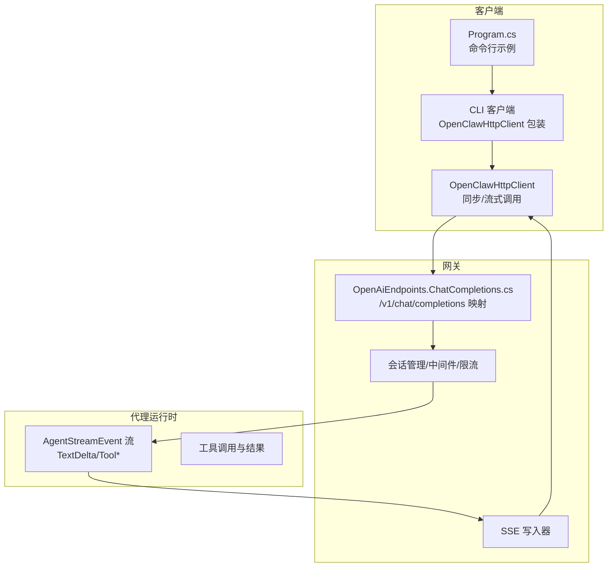
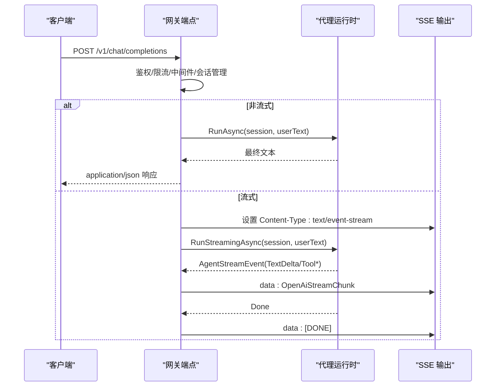
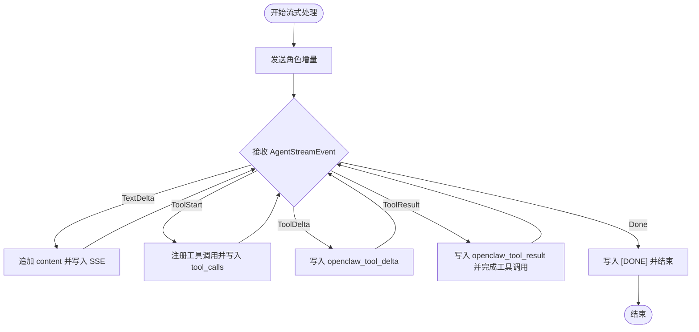
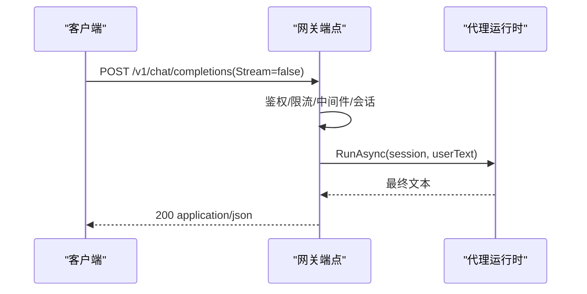
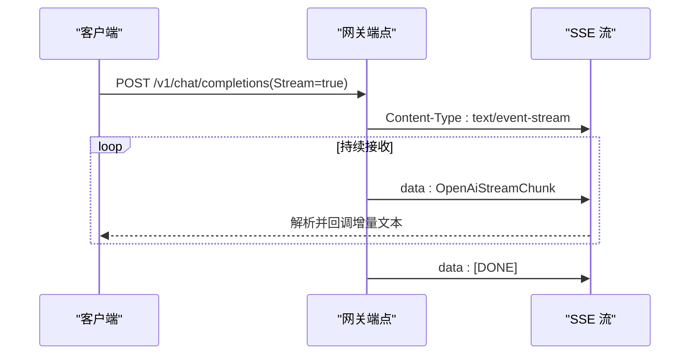
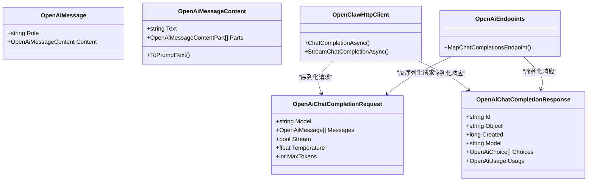

# 聊天完成 API

<cite>
**本文引用的文件**
- [OpenAiModels.cs](file://src/OpenClaw.Core/Models/OpenAiModels.cs)
- [OpenClawHttpClient.cs](file://src/OpenClaw.Client/OpenClawHttpClient.cs)
- [OpenAiEndpoints.ChatCompletions.cs](file://src/OpenClaw.Gateway/Endpoints/OpenAiEndpoints.ChatCompletions.cs)
- [OpenClawHttpClient.cs](file://src/OpenClaw.Cli/OpenClawHttpClient.cs)
- [Program.cs](file://src/OpenClaw.Cli/Program.cs)
- [StreamingTypes.cs](file://src/OpenClaw.Core/Models/StreamingTypes.cs)
- [EmbeddedLocalChatClient.cs](file://src/OpenClaw.Gateway/Extensions/EmbeddedLocalChatClient.cs)
- [OllamaNativeClients.cs](file://src/OpenClaw.Gateway/Extensions/OllamaNativeClients.cs)
- [OpenClawA2AAgentHandler.cs](file://src/OpenClaw.Agent/A2A/OpenClawA2AAgentHandler.cs)
- [OpenAiEndpointTests.cs](file://src/OpenClaw.Tests/OpenAiEndpointTests.cs)
</cite>

## 目录
1. [简介](#简介)
2. [项目结构](#项目结构)
3. [核心组件](#核心组件)
4. [架构总览](#架构总览)
5. [详细组件分析](#详细组件分析)
6. [依赖关系分析](#依赖关系分析)
7. [性能考虑](#性能考虑)
8. [故障排除指南](#故障排除指南)
9. [结论](#结论)
10. [附录：使用示例](#附录使用示例)

## 简介
本文件系统性地文档化了聊天完成 API 的实现，重点覆盖以下方面：
- ChatCompletionAsync 方法的实现与行为
- OpenAiChatCompletionRequest 请求体结构与字段语义
- OpenAiChatCompletionResponse 响应格式与字段含义
- SSE 流式响应处理机制（含增量文本、工具调用、结果）
- 同步与流式两种调用模式的参数配置、认证机制与错误处理策略
- 与 OpenAI 兼容的接口设计细节（消息格式、角色定义、内容类型）
- 实际使用示例（发送消息、处理流式响应、实现回调）

## 项目结构
聊天完成 API 涉及三层协作：
- 客户端层：OpenClawHttpClient 提供同步与流式调用方法
- 网关层：映射 /v1/chat/completions 端点，执行鉴权、限流、中间件与会话管理，并将请求转发给代理运行时
- 代理运行时层：产生 AgentStreamEvent 流，网关将其转换为 OpenAI 兼容的 SSE 增量事件

图表来源
- [OpenClawHttpClient.cs:190-260](file://src/OpenClaw.Client/OpenClawHttpClient.cs#L190-L260)
- [OpenAiEndpoints.ChatCompletions.cs:17-365](file://src/OpenClaw.Gateway/Endpoints/OpenAiEndpoints.ChatCompletions.cs#L17-L365)
- [StreamingTypes.cs:6-25](file://src/OpenClaw.Core/Models/StreamingTypes.cs#L6-L25)

章节来源
- [OpenClawHttpClient.cs:190-260](file://src/OpenClaw.Client/OpenClawHttpClient.cs#L190-L260)
- [OpenAiEndpoints.ChatCompletions.cs:17-365](file://src/OpenClaw.Gateway/Endpoints/OpenAiEndpoints.ChatCompletions.cs#L17-L365)
- [StreamingTypes.cs:6-25](file://src/OpenClaw.Core/Models/StreamingTypes.cs#L6-L25)

## 核心组件
- OpenAiChatCompletionRequest：请求体，包含模型标识、消息列表、是否流式、温度、最大令牌数等
- OpenAiChatCompletionResponse：非流式响应，包含完成 ID、对象类型、创建时间、模型、候选列表、用量统计
- OpenAiStreamChunk：SSE 单条增量，包含 ID、对象类型、创建时间、模型、候选增量
- OpenClawHttpClient：提供 ChatCompletionAsync 与 StreamChatCompletionAsync 两个入口
- 网关端点 OpenAiEndpoints.ChatCompletions：负责鉴权、限流、会话绑定、中间件、工具审批、SSE 输出

章节来源
- [OpenAiModels.cs:22-31](file://src/OpenClaw.Core/Models/OpenAiModels.cs#L22-L31)
- [OpenAiModels.cs:187-196](file://src/OpenClaw.Core/Models/OpenAiModels.cs#L187-L196)
- [OpenAiModels.cs:227-234](file://src/OpenClaw.Core/Models/OpenAiModels.cs#L227-L234)
- [OpenClawHttpClient.cs:190-260](file://src/OpenClaw.Client/OpenClawHttpClient.cs#L190-L260)
- [OpenAiEndpoints.ChatCompletions.cs:17-365](file://src/OpenClaw.Gateway/Endpoints/OpenAiEndpoints.ChatCompletions.cs#L17-L365)

## 架构总览
下图展示了从客户端到网关再到代理运行时的完整调用链路，以及流式响应在网关侧的转换过程。

图表来源
- [OpenClawHttpClient.cs:190-260](file://src/OpenClaw.Client/OpenClawHttpClient.cs#L190-L260)
- [OpenAiEndpoints.ChatCompletions.cs:175-318](file://src/OpenClaw.Gateway/Endpoints/OpenAiEndpoints.ChatCompletions.cs#L175-L318)
- [StreamingTypes.cs:6-25](file://src/OpenClaw.Core/Models/StreamingTypes.cs#L6-L25)

## 详细组件分析

### OpenAiChatCompletionRequest 参数结构
- Model：可选，用于指定模型或覆盖默认模型
- Messages：必填，消息列表，每条消息包含 Role 与 Content
- Stream：布尔值，控制是否启用流式响应
- Temperature：可选，采样温度
- MaxTokens：可选，最大生成令牌数

消息内容支持两种形式：
- 字符串：纯文本
- 数组：多模态内容部件，包含 text 与 image_url 等类型

章节来源
- [OpenAiModels.cs:22-31](file://src/OpenClaw.Core/Models/OpenAiModels.cs#L22-L31)
- [OpenAiModels.cs:33-84](file://src/OpenClaw.Core/Models/OpenAiModels.cs#L33-L84)
- [OpenAiModels.cs:86-94](file://src/OpenClaw.Core/Models/OpenAiModels.cs#L86-L94)

### OpenAiChatCompletionResponse 响应格式
- Id：本次完成的唯一标识
- Object：固定为 "chat.completion"
- Created：Unix 时间戳
- Model：实际使用的模型
- Choices：候选列表，每个包含索引、响应消息与结束原因
- Usage：用量统计，包含提示词、补全、总计令牌数

章节来源
- [OpenAiModels.cs:187-196](file://src/OpenClaw.Core/Models/OpenAiModels.cs#L187-L196)
- [OpenAiModels.cs:198-210](file://src/OpenClaw.Core/Models/OpenAiModels.cs#L198-L210)
- [OpenAiModels.cs:212-220](file://src/OpenClaw.Core/Models/OpenAiModels.cs#L212-L220)

### SSE 流式响应处理机制
网关将代理运行时产生的 AgentStreamEvent 转换为 OpenAI 兼容的 SSE 增量：
- 角色前导：先发送一个仅包含角色的增量
- 文本增量：TextDelta 事件映射为 content 字段的增量
- 工具调用：ToolStart/ToolDelta/ToolResult 分别映射为 tool_calls/function/openclaw_tool_delta/openclaw_tool_result
- 结束标记：Done 事件发送 [DONE] 结束信号

图表来源
- [OpenAiEndpoints.ChatCompletions.cs:215-318](file://src/OpenClaw.Gateway/Endpoints/OpenAiEndpoints.ChatCompletions.cs#L215-L318)
- [StreamingTypes.cs:6-25](file://src/OpenClaw.Core/Models/StreamingTypes.cs#L6-L25)

章节来源
- [OpenAiEndpoints.ChatCompletions.cs:175-318](file://src/OpenClaw.Gateway/Endpoints/OpenAiEndpoints.ChatCompletions.cs#L175-L318)
- [StreamingTypes.cs:6-25](file://src/OpenClaw.Core/Models/StreamingTypes.cs#L6-L25)

### 同步聊天完成调用流程
- 客户端构造 OpenAiChatCompletionRequest（Stream=false）
- 发送 POST /v1/chat/completions
- 网关执行鉴权、限流、中间件与会话管理
- 调用代理运行时 RunAsync 获取最终文本
- 返回 application/json 响应

图表来源
- [OpenClawHttpClient.cs:190-202](file://src/OpenClaw.Client/OpenClawHttpClient.cs#L190-L202)
- [OpenAiEndpoints.ChatCompletions.cs:320-354](file://src/OpenClaw.Gateway/Endpoints/OpenAiEndpoints.ChatCompletions.cs#L320-L354)

章节来源
- [OpenClawHttpClient.cs:190-202](file://src/OpenClaw.Client/OpenClawHttpClient.cs#L190-L202)
- [OpenAiEndpoints.ChatCompletions.cs:320-354](file://src/OpenClaw.Gateway/Endpoints/OpenAiEndpoints.ChatCompletions.cs#L320-L354)

### 流式聊天完成调用流程
- 客户端设置 Stream=true 并注册回调 Action<string>
- 发送 POST /v1/chat/completions 并设置 Accept: text/event-stream
- 网关返回 SSE 流，逐条写入 OpenAiStreamChunk
- 客户端解析 data 行，提取 choices[0].delta.content 并回调

图表来源
- [OpenClawHttpClient.cs:204-260](file://src/OpenClaw.Client/OpenClawHttpClient.cs#L204-L260)
- [OpenAiEndpoints.ChatCompletions.cs:175-318](file://src/OpenClaw.Gateway/Endpoints/OpenAiEndpoints.ChatCompletions.cs#L175-L318)

章节来源
- [OpenClawHttpClient.cs:204-260](file://src/OpenClaw.Client/OpenClawHttpClient.cs#L204-L260)
- [OpenAiEndpoints.ChatCompletions.cs:175-318](file://src/OpenClaw.Gateway/Endpoints/OpenAiEndpoints.ChatCompletions.cs#L175-L318)

### 认证与预设头
- 认证：客户端在构造函数中设置 Authorization: Bearer <token>
- 预设：通过 X-OpenClaw-Preset 请求头传递预设 ID，网关将其应用到会话元数据

章节来源
- [OpenClawHttpClient.cs:91-182](file://src/OpenClaw.Client/OpenClawHttpClient.cs#L91-L182)
- [OpenClawHttpClient.cs:1924-1928](file://src/OpenClaw.Client/OpenClawHttpClient.cs#L1924-L1928)
- [OpenAiEndpoints.ChatCompletions.cs:127-137](file://src/OpenClaw.Gateway/Endpoints/OpenAiEndpoints.ChatCompletions.cs#L127-L137)

### 错误处理策略
- HTTP 状态码：非成功状态直接抛出异常，包含状态与响应体摘要
- JSON 解析：请求体无效或过大时返回 400/413
- 速率限制：命中策略返回 429
- 未授权：鉴权失败返回 401

章节来源
- [OpenClawHttpClient.cs:1930-1950](file://src/OpenClaw.Client/OpenClawHttpClient.cs#L1930-L1950)
- [OpenAiEndpoints.ChatCompletions.cs:19-30](file://src/OpenClaw.Gateway/Endpoints/OpenAiEndpoints.ChatCompletions.cs#L19-L30)
- [OpenAiEndpoints.ChatCompletions.cs:32-52](file://src/OpenClaw.Gateway/Endpoints/OpenAiEndpoints.ChatCompletions.cs#L32-L52)

### 与 OpenAI 兼容的消息格式
- 角色：system、user、assistant
- 内容：字符串或数组（text/image_url 等部件）
- 工具调用：通过 tool_calls 与 openclaw_tool_delta/openclaw_tool_result 扩展字段表达

章节来源
- [OpenAiModels.cs:33-84](file://src/OpenClaw.Core/Models/OpenAiModels.cs#L33-L84)
- [OpenAiModels.cs:244-286](file://src/OpenClaw.Core/Models/OpenAiModels.cs#L244-L286)

## 依赖关系分析

图表来源
- [OpenAiModels.cs:22-31](file://src/OpenClaw.Core/Models/OpenAiModels.cs#L22-L31)
- [OpenAiModels.cs:187-196](file://src/OpenClaw.Core/Models/OpenAiModels.cs#L187-L196)
- [OpenClawHttpClient.cs:190-260](file://src/OpenClaw.Client/OpenClawHttpClient.cs#L190-L260)
- [OpenAiEndpoints.ChatCompletions.cs:17-365](file://src/OpenClaw.Gateway/Endpoints/OpenAiEndpoints.ChatCompletions.cs#L17-L365)

章节来源
- [OpenAiModels.cs:22-31](file://src/OpenClaw.Core/Models/OpenAiModels.cs#L22-L31)
- [OpenAiModels.cs:187-196](file://src/OpenClaw.Core/Models/OpenAiModels.cs#L187-L196)
- [OpenClawHttpClient.cs:190-260](file://src/OpenClaw.Client/OpenClawHttpClient.cs#L190-L260)
- [OpenAiEndpoints.ChatCompletions.cs:17-365](file://src/OpenClaw.Gateway/Endpoints/OpenAiEndpoints.ChatCompletions.cs#L17-L365)

## 性能考虑
- 流式传输：使用 text/event-stream 可以边生成边消费，降低首字延迟
- 缓冲区大小：客户端读取 SSE 时采用较大缓冲区（约 16KB）以提升吞吐
- 会话复用：稳定会话绑定可复用历史上下文，减少重复输入
- 限流与中间件：网关内置速率限制与策略检查，避免过载

## 故障排除指南
- 401 未授权：确认 Authorization 头是否正确设置
- 429 过载保护：降低请求频率或调整限流策略
- 413 请求过大：检查请求体大小限制
- 400 JSON 无效：检查请求体格式与必填字段
- SSE 解析失败：确保按 "data:" 行解析，忽略空行与 [DONE] 结束标记

章节来源
- [OpenClawHttpClient.cs:1930-1950](file://src/OpenClaw.Client/OpenClawHttpClient.cs#L1930-L1950)
- [OpenAiEndpoints.ChatCompletions.cs:19-52](file://src/OpenClaw.Gateway/Endpoints/OpenAiEndpoints.ChatCompletions.cs#L19-L52)
- [OpenClawHttpClient.cs:224-259](file://src/OpenClaw.Client/OpenClawHttpClient.cs#L224-L259)

## 结论
该聊天完成 API 在保持与 OpenAI 接口高度兼容的同时，提供了灵活的流式与非流式两种模式，并通过网关层实现了鉴权、限流、中间件与会话管理等企业级能力。客户端封装清晰，易于集成与扩展。

## 附录：使用示例

### 示例一：同步聊天完成
- 构造请求：设置 Model、Temperature、MaxTokens、Messages（至少一条）
- 调用 ChatCompletionAsync
- 读取响应的 Choices[0].Message.Content

参考路径
- [OpenClawHttpClient.cs:190-202](file://src/OpenClaw.Client/OpenClawHttpClient.cs#L190-L202)
- [Program.cs:517-538](file://src/OpenClaw.Cli/Program.cs#L517-L538)

### 示例二：流式聊天完成
- 设置 Stream=true 并注册回调 Action<string>
- 调用 StreamChatCompletionAsync
- 在回调中累积并显示增量文本
- 直到收到 [DONE] 结束标记

参考路径
- [OpenClawHttpClient.cs:204-260](file://src/OpenClaw.Client/OpenClawHttpClient.cs#L204-L260)
- [Program.cs:527-532](file://src/OpenClaw.Cli/Program.cs#L527-L532)
- [Program.cs:595-607](file://src/OpenClaw.Cli/Program.cs#L595-L607)

### 示例三：多模态消息
- 使用 OpenAiMessageContent.FromText 或包含多个部件的数组
- 支持 text 与 image_url 等类型

参考路径
- [OpenAiModels.cs:39-84](file://src/OpenClaw.Core/Models/OpenAiModels.cs#L39-L84)
- [OpenAiModels.cs:86-94](file://src/OpenClaw.Core/Models/OpenAiModels.cs#L86-L94)

### 示例四：工具调用流式输出
- 网关将 ToolStart/ToolDelta/ToolResult 映射为 SSE 增量
- 客户端根据 ToolCalls 与 openclaw_tool_delta/openclaw_tool_result 组合工具调用结果

参考路径
- [OpenAiEndpoints.ChatCompletions.cs:240-318](file://src/OpenClaw.Gateway/Endpoints/OpenAiEndpoints.ChatCompletions.cs#L240-L318)
- [OpenAiModels.cs:244-286](file://src/OpenClaw.Core/Models/OpenAiModels.cs#L244-L286)
- [OpenAiEndpointTests.cs:235-276](file://src/OpenClaw.Tests/OpenAiEndpointTests.cs#L235-L276)