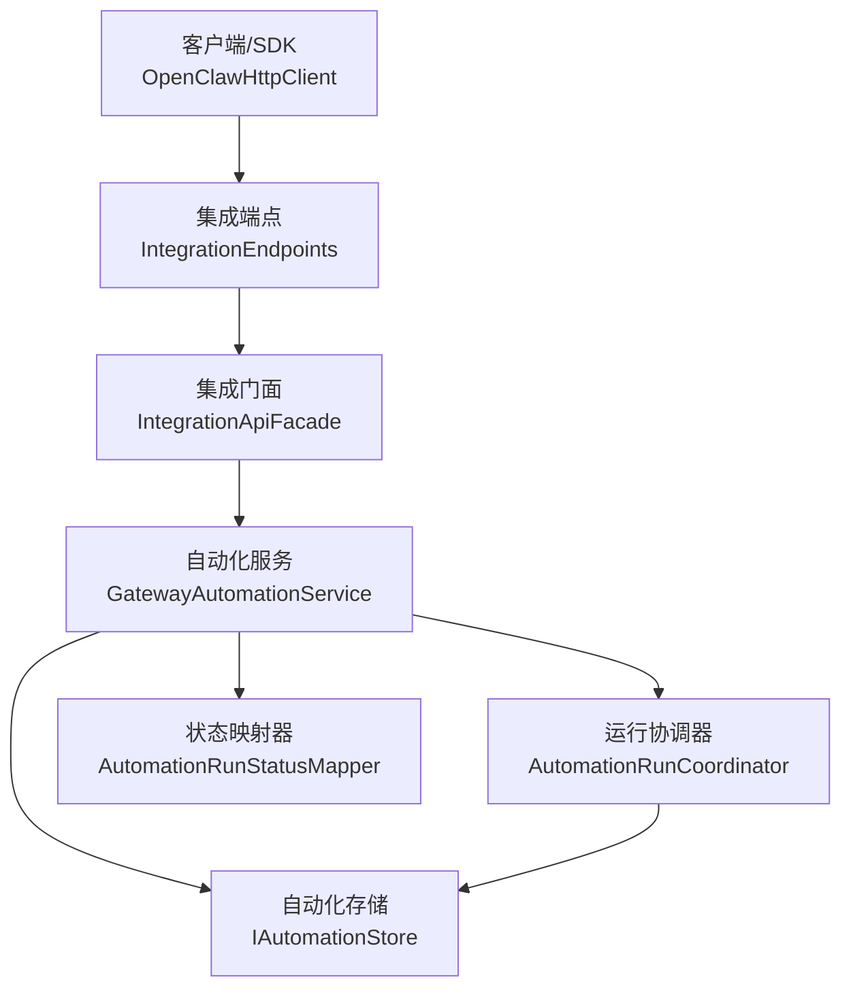
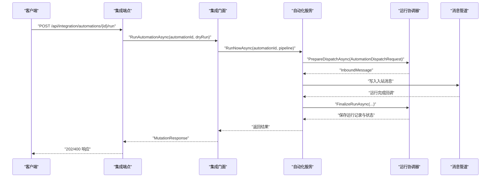
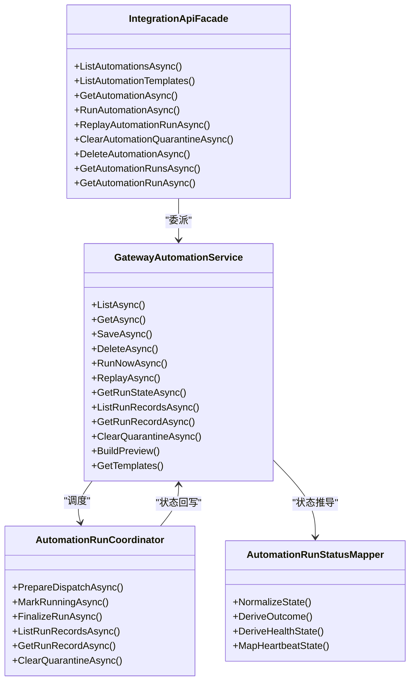
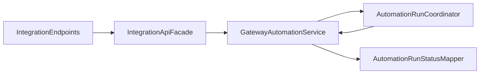

# 自动化管理 API

<cite>
**本文档引用的文件**
- [IntegrationApiModels.cs](file://src/OpenClaw.Core/Models/IntegrationApiModels.cs)
- [AutomationModels.cs](file://src/OpenClaw.Core/Models/AutomationModels.cs)
- [IntegrationEndpoints.cs](file://src/OpenClaw.Gateway/Endpoints/IntegrationEndpoints.cs)
- [AdminEndpoints.Automations.cs](file://src/OpenClaw.Gateway/Endpoints/AdminEndpoints.Automations.cs)
- [IntegrationApiFacade.cs](file://src/OpenClaw.Gateway/Composition/IntegrationApiFacade.cs)
- [GatewayAutomationService.cs](file://src/OpenClaw.Gateway/GatewayAutomationService.cs)
- [AutomationRunCoordinator.cs](file://src/OpenClaw.Gateway/AutomationRunCoordinator.cs)
- [AutomationRunStatusMapper.cs](file://src/OpenClaw.Gateway/AutomationRunStatusMapper.cs)
- [OpenClawHttpClient.cs](file://src/OpenClaw.Client/OpenClawHttpClient.cs)
- [AutomationTool.cs](file://src/OpenClaw.Gateway/Tools/AutomationTool.cs)
</cite>

## 目录
1. [简介](#简介)
2. [项目结构](#项目结构)
3. [核心组件](#核心组件)
4. [架构总览](#架构总览)
5. [详细组件分析](#详细组件分析)
6. [依赖关系分析](#依赖关系分析)
7. [性能考虑](#性能考虑)
8. [故障排除指南](#故障排除指南)
9. [结论](#结论)
10. [附录](#附录)

## 简介
本文件面向自动化管理 API 的使用者与维护者，系统性阐述自动化相关接口的设计与实现，覆盖自动化生命周期管理（查询、模板、详情、执行、回放、隔离清除）、运行历史与状态跟踪、以及在 AI 代理中的应用价值。文档重点解析以下方法族：ListAutomationsAsync、ListAutomationTemplatesAsync、GetAutomationAsync、RunAutomationAsync、DeleteAutomationAsync、GetAutomationRunsAsync、GetAutomationRunAsync、ReplayAutomationRunAsync、ClearAutomationQuarantineAsync，并配套说明 IntegrationAutomationsResponse、AutomationTemplateListResponse、IntegrationAutomationDetailResponse 等数据模型。

## 项目结构
自动化管理 API 在网关层通过端点映射暴露，由门面层统一编排，服务层负责业务逻辑与状态持久化，协调运行协调器完成入站消息派发与运行记录维护。

图表来源
- [IntegrationEndpoints.cs:487-635](file://src/OpenClaw.Gateway/Endpoints/IntegrationEndpoints.cs#L487-L635)
- [IntegrationApiFacade.cs:572-738](file://src/OpenClaw.Gateway/Composition/IntegrationApiFacade.cs#L572-L738)
- [GatewayAutomationService.cs:49-717](file://src/OpenClaw.Gateway/GatewayAutomationService.cs#L49-L717)
- [AutomationRunCoordinator.cs:6-200](file://src/OpenClaw.Gateway/AutomationRunCoordinator.cs#L6-L200)
- [AutomationRunStatusMapper.cs:5-200](file://src/OpenClaw.Gateway/AutomationRunStatusMapper.cs#L5-L200)

章节来源
- [IntegrationEndpoints.cs:487-635](file://src/OpenClaw.Gateway/Endpoints/IntegrationEndpoints.cs#L487-L635)
- [IntegrationApiFacade.cs:572-738](file://src/OpenClaw.Gateway/Composition/IntegrationApiFacade.cs#L572-L738)

## 核心组件
- 集成端点层：提供 /api/integration 与 /api/admin 路由，封装鉴权、参数解析与响应序列化。
- 集成门面层：聚合会话、配置、学习、内存、工具预设、文本转语音、维护运行时等能力，统一对外暴露自动化相关操作。
- 自动化服务层：负责自动化定义的增删改查、运行状态读写、运行记录查询、回放与隔离清除、模板与预览生成、计划任务构建等。
- 运行协调器：负责运行派发、状态机推进、运行记录持久化、心跳与异常处理。
- 状态映射器：规范化与推导生命周期、验证状态、健康状态与信号严重级别。

章节来源
- [IntegrationApiModels.cs:168-192](file://src/OpenClaw.Core/Models/IntegrationApiModels.cs#L168-L192)
- [AutomationModels.cs:57-129](file://src/OpenClaw.Core/Models/AutomationModels.cs#L57-L129)

## 架构总览
自动化管理 API 的调用链路从 HTTP 请求进入，经鉴权与参数校验后，由门面层委派到自动化服务层，服务层通过运行协调器将自动化调度到消息管道，最终落盘运行状态与记录。

图表来源
- [IntegrationEndpoints.cs:565-595](file://src/OpenClaw.Gateway/Endpoints/IntegrationEndpoints.cs#L565-L595)
- [IntegrationApiFacade.cs:639-681](file://src/OpenClaw.Gateway/Composition/IntegrationApiFacade.cs#L639-L681)
- [GatewayAutomationService.cs:214-235](file://src/OpenClaw.Gateway/GatewayAutomationService.cs#L214-L235)
- [AutomationRunCoordinator.cs:26-111](file://src/OpenClaw.Gateway/AutomationRunCoordinator.cs#L26-L111)

## 详细组件分析

### 数据模型
- IntegrationAutomationsResponse：自动化列表响应，包含 Items 列表。
- IntegrationAutomationDetailResponse：自动化详情响应，包含 Automation 与 RunState。
- IntegrationAutomationRunsResponse：运行历史列表响应，包含 AutomationId、RunState 与 Items。
- IntegrationAutomationRunDetailResponse：单次运行详情响应，包含 Automation、RunState 与 Run。
- AutomationTemplateListResponse：模板列表响应，包含 Items。
- AutomationDefinition：自动化定义模型，含 Id、Name、Enabled、Schedule、Prompt、Delivery 等字段。
- AutomationRunState：运行状态模型，含 Outcome、LifecycleState、VerificationStatus、HealthState 等。
- AutomationRunRecord：运行记录模型，含 RunId、TriggerSource、LifecycleState、VerificationStatus、StartedAtUtc 等。
- AutomationTemplate：模板模型，含 Key、Label、Description、Category、SuggestedName、Schedule、Prompt、DeliveryChannelId、Tags、Available 等。

章节来源
- [IntegrationApiModels.cs:168-192](file://src/OpenClaw.Core/Models/IntegrationApiModels.cs#L168-L192)
- [AutomationModels.cs:57-166](file://src/OpenClaw.Core/Models/AutomationModels.cs#L57-L166)

### 方法族详解

#### ListAutomationsAsync
- 功能：列出所有自动化（含遗留任务与托管心跳）。
- 访问路径：GET /api/integration/automations
- 返回：IntegrationAutomationsResponse.Items
- 关键实现：IntegrationApiFacade.ListAutomationsAsync -> GatewayAutomationService.ListAsync

章节来源
- [IntegrationEndpoints.cs:487-496](file://src/OpenClaw.Gateway/Endpoints/IntegrationEndpoints.cs#L487-L496)
- [IntegrationApiFacade.cs:572-576](file://src/OpenClaw.Gateway/Composition/IntegrationApiFacade.cs#L572-L576)
- [GatewayAutomationService.cs:49-67](file://src/OpenClaw.Gateway/GatewayAutomationService.cs#L49-L67)

#### ListAutomationTemplatesAsync
- 功能：获取可用自动化模板列表。
- 访问路径：GET /api/integration/automations/templates
- 返回：AutomationTemplateListResponse.Items
- 关键实现：IntegrationApiFacade.ListAutomationTemplates -> GatewayAutomationService.GetTemplates

章节来源
- [IntegrationEndpoints.cs:498-507](file://src/OpenClaw.Gateway/Endpoints/IntegrationEndpoints.cs#L498-L507)
- [IntegrationApiFacade.cs:633-637](file://src/OpenClaw.Gateway/Composition/IntegrationApiFacade.cs#L633-L637)
- [GatewayAutomationService.cs:399-493](file://src/OpenClaw.Gateway/GatewayAutomationService.cs#L399-L493)

#### GetAutomationAsync
- 功能：获取指定自动化详情及其最新运行状态。
- 访问路径：GET /api/integration/automations/{id}
- 返回：IntegrationAutomationDetailResponse
- 关键实现：IntegrationApiFacade.GetAutomationAsync -> GatewayAutomationService.GetAsync + GetRunStateAsync

章节来源
- [IntegrationEndpoints.cs:509-525](file://src/OpenClaw.Gateway/Endpoints/IntegrationEndpoints.cs#L509-L525)
- [IntegrationApiFacade.cs:609-614](file://src/OpenClaw.Gateway/Composition/IntegrationApiFacade.cs#L609-L614)
- [GatewayAutomationService.cs:69-79](file://src/OpenClaw.Gateway/GatewayAutomationService.cs#L69-L79)

#### RunAutomationAsync
- 功能：触发自动化执行（支持 dry-run 预检）。
- 访问路径：POST /api/integration/automations/{id}/run
- 请求体：AutomationRunRequest { DryRun }
- 返回：MutationResponse
- 关键实现：IntegrationApiFacade.RunAutomationAsync -> GatewayAutomationService.RunNowAsync -> AutomationRunCoordinator.PrepareDispatchAsync

章节来源
- [IntegrationEndpoints.cs:565-595](file://src/OpenClaw.Gateway/Endpoints/IntegrationEndpoints.cs#L565-L595)
- [IntegrationApiFacade.cs:639-681](file://src/OpenClaw.Gateway/Composition/IntegrationApiFacade.cs#L639-L681)
- [GatewayAutomationService.cs:214-235](file://src/OpenClaw.Gateway/GatewayAutomationService.cs#L214-L235)
- [AutomationRunCoordinator.cs:26-111](file://src/OpenClaw.Gateway/AutomationRunCoordinator.cs#L26-L111)

#### DeleteAutomationAsync
- 功能：删除指定自动化。
- 访问路径：DELETE /api/integration/automations/{id}
- 返回：MutationResponse
- 关键实现：IntegrationApiFacade.DeleteAutomationAsync -> GatewayAutomationService.DeleteAsync

章节来源
- [IntegrationEndpoints.cs:623-634](file://src/OpenClaw.Gateway/Endpoints/IntegrationEndpoints.cs#L623-L634)
- [IntegrationApiFacade.cs:712-738](file://src/OpenClaw.Gateway/Composition/IntegrationApiFacade.cs#L712-L738)
- [GatewayAutomationService.cs:157-167](file://src/OpenClaw.Gateway/GatewayAutomationService.cs#L157-L167)

#### GetAutomationRunsAsync
- 功能：获取自动化最近运行记录列表。
- 访问路径：GET /api/integration/automations/{id}/runs
- 返回：IntegrationAutomationRunsResponse
- 关键实现：IntegrationApiFacade.GetAutomationRunsAsync -> GatewayAutomationService.ListRunRecordsAsync

章节来源
- [IntegrationEndpoints.cs:527-545](file://src/OpenClaw.Gateway/Endpoints/IntegrationEndpoints.cs#L527-L545)
- [IntegrationApiFacade.cs:616-622](file://src/OpenClaw.Gateway/Composition/IntegrationApiFacade.cs#L616-L622)
- [GatewayAutomationService.cs:187-190](file://src/OpenClaw.Gateway/GatewayAutomationService.cs#L187-L190)

#### GetAutomationRunAsync
- 功能：获取指定运行详情。
- 访问路径：GET /api/integration/automations/{id}/runs/{runId}
- 返回：IntegrationAutomationRunDetailResponse
- 关键实现：IntegrationApiFacade.GetAutomationRunAsync -> GatewayAutomationService.GetRunRecordAsync

章节来源
- [IntegrationEndpoints.cs:547-563](file://src/OpenClaw.Gateway/Endpoints/IntegrationEndpoints.cs#L547-L563)
- [IntegrationApiFacade.cs:624-631](file://src/OpenClaw.Gateway/Composition/IntegrationApiFacade.cs#L624-L631)
- [GatewayAutomationService.cs:192-195](file://src/OpenClaw.Gateway/GatewayAutomationService.cs#L192-L195)

#### ReplayAutomationRunAsync
- 功能：对指定运行进行回放。
- 访问路径：POST /api/integration/automations/{id}/runs/{runId}/replay
- 返回：MutationResponse
- 关键实现：IntegrationApiFacade.ReplayAutomationRunAsync -> GatewayAutomationService.ReplayAsync

章节来源
- [IntegrationEndpoints.cs:597-608](file://src/OpenClaw.Gateway/Endpoints/IntegrationEndpoints.cs#L597-L608)
- [IntegrationApiFacade.cs:683-696](file://src/OpenClaw.Gateway/Composition/IntegrationApiFacade.cs#L683-L696)
- [GatewayAutomationService.cs:237-259](file://src/OpenClaw.Gateway/GatewayAutomationService.cs#L237-L259)

#### ClearAutomationQuarantineAsync
- 功能：清除自动化隔离状态。
- 访问路径：POST /api/integration/automations/{id}/quarantine/clear
- 返回：MutationResponse
- 关键实现：IntegrationApiFacade.ClearAutomationQuarantineAsync -> GatewayAutomationService.ClearQuarantineAsync

章节来源
- [IntegrationEndpoints.cs:610-621](file://src/OpenClaw.Gateway/Endpoints/IntegrationEndpoints.cs#L610-L621)
- [IntegrationApiFacade.cs:698-710](file://src/OpenClaw.Gateway/Composition/IntegrationApiFacade.cs#L698-L710)
- [GatewayAutomationService.cs:197-198](file://src/OpenClaw.Gateway/GatewayAutomationService.cs#L197-L198)

### 管理端点（Admin）
管理端点提供更丰富的自动化管理能力，如预览、迁移、保存、删除等。典型路径：
- GET /admin/automations
- GET /admin/automations/templates
- POST /admin/automations/preview
- PUT /admin/automations/{id}
- POST /admin/automations/{id}/run
- POST /admin/automations/{id}/runs/{runId}/replay
- POST /admin/automations/{id}/quarantine/clear
- DELETE /admin/automations/{id}

章节来源
- [AdminEndpoints.Automations.cs:39-292](file://src/OpenClaw.Gateway/Endpoints/AdminEndpoints.Automations.cs#L39-L292)

### 类关系图

图表来源
- [IntegrationApiFacade.cs:572-738](file://src/OpenClaw.Gateway/Composition/IntegrationApiFacade.cs#L572-L738)
- [GatewayAutomationService.cs:49-717](file://src/OpenClaw.Gateway/GatewayAutomationService.cs#L49-L717)
- [AutomationRunCoordinator.cs:6-200](file://src/OpenClaw.Gateway/AutomationRunCoordinator.cs#L6-L200)
- [AutomationRunStatusMapper.cs:5-200](file://src/OpenClaw.Gateway/AutomationRunStatusMapper.cs#L5-L200)

## 依赖关系分析
- 端点层依赖门面层；门面层依赖自动化服务；自动化服务依赖运行协调器与状态映射器；运行协调器依赖存储接口以持久化状态与记录。
- 状态映射器根据生命周期、验证状态与隔离状态推导健康状态与信号严重级别，确保状态一致性。
- SDK 客户端通过统一的 URI 构造函数与 JSON 上下文进行请求与响应序列化。

图表来源
- [IntegrationEndpoints.cs:487-635](file://src/OpenClaw.Gateway/Endpoints/IntegrationEndpoints.cs#L487-L635)
- [IntegrationApiFacade.cs:572-738](file://src/OpenClaw.Gateway/Composition/IntegrationApiFacade.cs#L572-L738)
- [GatewayAutomationService.cs:49-717](file://src/OpenClaw.Gateway/GatewayAutomationService.cs#L49-L717)
- [AutomationRunCoordinator.cs:6-200](file://src/OpenClaw.Gateway/AutomationRunCoordinator.cs#L6-L200)
- [AutomationRunStatusMapper.cs:5-200](file://src/OpenClaw.Gateway/AutomationRunStatusMapper.cs#L5-L200)

## 性能考虑
- 运行记录保留策略：运行协调器默认保留固定数量的历史记录，避免无限增长导致的查询与存储压力。
- 隔离阈值：连续失败达到阈值后自动隔离，减少无效重试带来的资源消耗。
- 并发控制：服务层通过并发字典限制同一自动化同时只允许一次运行，避免资源争用。
- 预览与模板：预览接口用于提前校验自动化定义，降低错误配置对运行的影响。

章节来源
- [AutomationRunCoordinator.cs:8-11](file://src/OpenClaw.Gateway/AutomationRunCoordinator.cs#L8-L11)
- [GatewayAutomationService.cs:24-25](file://src/OpenClaw.Gateway/GatewayAutomationService.cs#L24-L25)
- [GatewayAutomationService.cs:495-514](file://src/OpenClaw.Gateway/GatewayAutomationService.cs#L495-L514)

## 故障排除指南
- 自动化未找到：当自动化 ID 不存在时，端点返回 404 或 MutationResponse 中的错误信息。
- 已有运行中：若自动化正在运行，再次触发将返回“already_running”。
- 隔离状态：被隔离的自动化在计划或重试触发时会被跳过，需先清理隔离。
- 回放失败：若运行记录不存在或状态不满足回放条件，将返回无法排队的错误。

章节来源
- [IntegrationEndpoints.cs:565-595](file://src/OpenClaw.Gateway/Endpoints/IntegrationEndpoints.cs#L565-L595)
- [IntegrationApiFacade.cs:639-681](file://src/OpenClaw.Gateway/Composition/IntegrationApiFacade.cs#L639-L681)
- [GatewayAutomationService.cs:214-235](file://src/OpenClaw.Gateway/GatewayAutomationService.cs#L214-L235)
- [AutomationRunCoordinator.cs:26-36](file://src/OpenClaw.Gateway/AutomationRunCoordinator.cs#L26-L36)

## 结论
自动化管理 API 提供了从查询、模板、执行、回放到隔离清除的完整生命周期管理能力，结合运行状态与记录的可视化，使自动化在 AI 代理场景中具备可观察、可治理、可恢复的特性。通过 SDK 与集成端点，用户可以便捷地编排与监控自动化工作流，提升运维效率与稳定性。

## 附录

### 使用示例（基于端点与模型）
- 列出自动化
  - 请求：GET /api/integration/automations
  - 响应：IntegrationAutomationsResponse
- 获取自动化详情
  - 请求：GET /api/integration/automations/{id}
  - 响应：IntegrationAutomationDetailResponse
- 触发执行（支持 dry-run）
  - 请求：POST /api/integration/automations/{id}/run
  - 请求体：AutomationRunRequest { DryRun }
  - 响应：MutationResponse
- 查询运行历史
  - 请求：GET /api/integration/automations/{id}/runs
  - 响应：IntegrationAutomationRunsResponse
- 回放某次运行
  - 请求：POST /api/integration/automations/{id}/runs/{runId}/replay
  - 响应：MutationResponse
- 清除隔离
  - 请求：POST /api/integration/automations/{id}/quarantine/clear
  - 响应：MutationResponse
- 删除自动化
  - 请求：DELETE /api/integration/automations/{id}
  - 响应：MutationResponse

章节来源
- [IntegrationEndpoints.cs:487-635](file://src/OpenClaw.Gateway/Endpoints/IntegrationEndpoints.cs#L487-L635)
- [IntegrationApiModels.cs:168-192](file://src/OpenClaw.Core/Models/IntegrationApiModels.cs#L168-L192)
- [AutomationModels.cs:70-129](file://src/OpenClaw.Core/Models/AutomationModels.cs#L70-L129)

### SDK 调用参考
- 列表：ListAutomationsAsync
- 模板：ListAutomationTemplatesAsync
- 详情：GetAutomationAsync
- 执行：RunAutomationAsync
- 删除：DeleteAutomationAsync
- 历史：GetAutomationRunsAsync
- 单次详情：GetAutomationRunAsync
- 回放：ReplayAutomationRunAsync
- 清除隔离：ClearAutomationQuarantineAsync

章节来源
- [OpenClawHttpClient.cs:753-794](file://src/OpenClaw.Client/OpenClawHttpClient.cs#L753-L794)

### AI 代理中的应用价值
- 可观测性：通过运行状态与记录，实时掌握自动化执行情况与健康度。
- 可治理性：模板与预览帮助规范自动化设计，回放与隔离机制便于问题复盘与修复。
- 可靠性：状态映射与健康评估提供信号预警，配合重试与隔离策略降低风险。
- 自动化编排：统一的端点与 SDK 降低接入成本，支持多渠道交付与多模型适配。