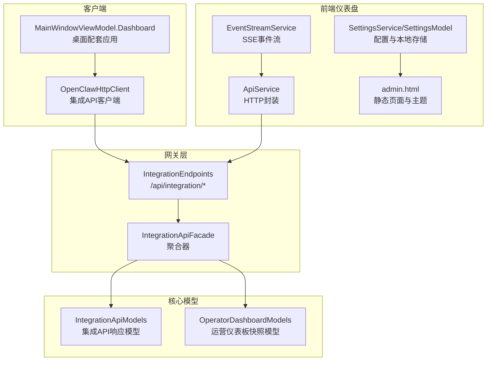
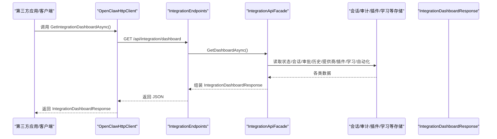
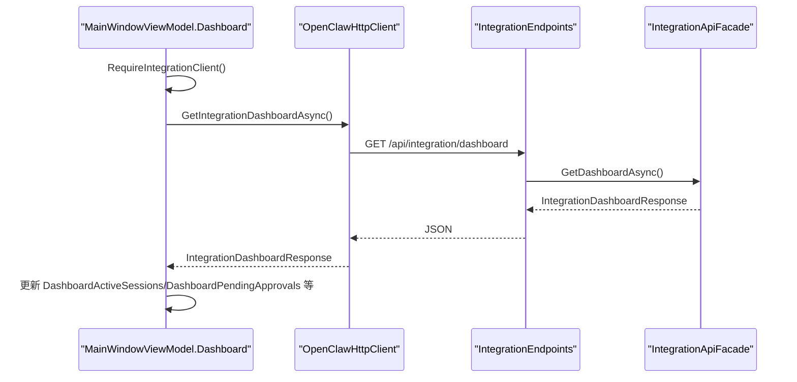
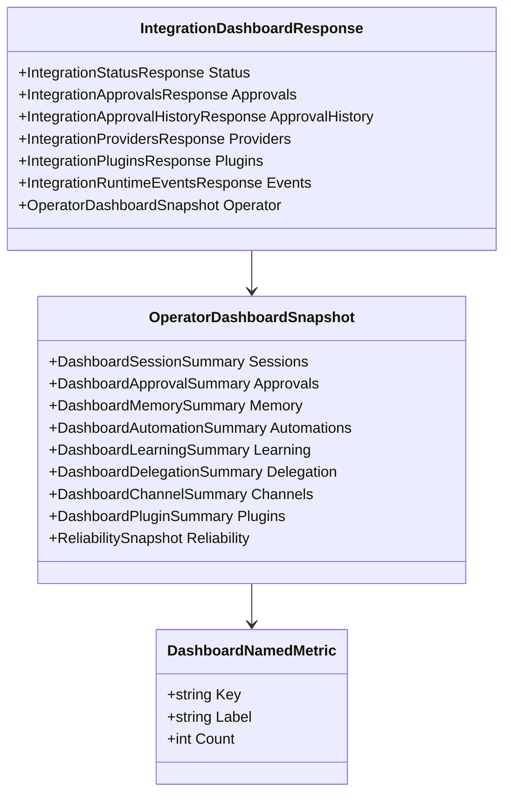
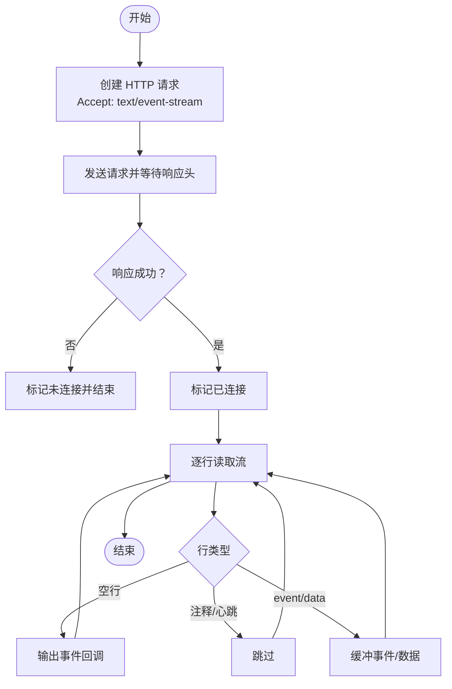
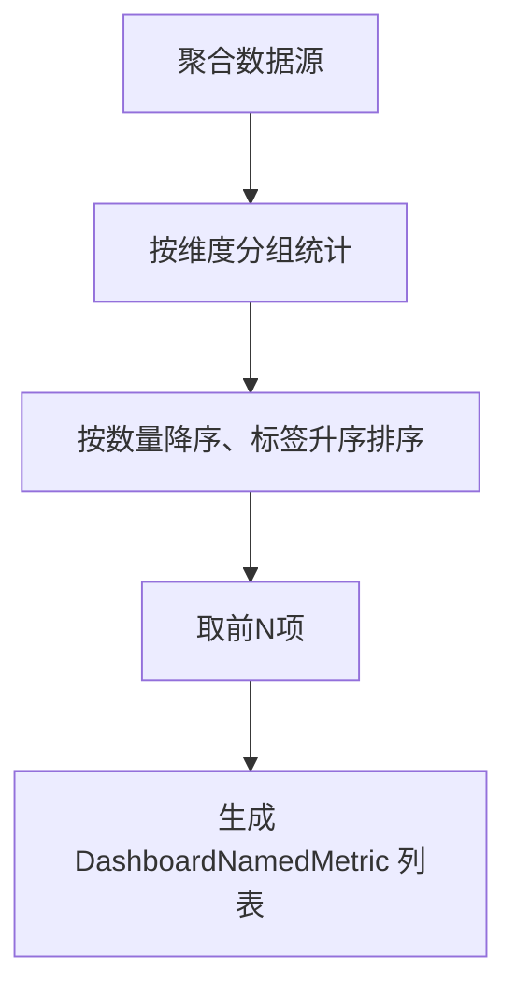
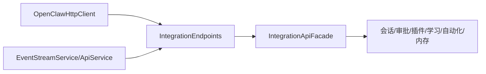

# 仪表板集成

<cite>
**本文档引用的文件**
- [IntegrationEndpoints.cs](file://src/OpenClaw.Gateway/Endpoints/IntegrationEndpoints.cs)
- [IntegrationApiFacade.cs](file://src/OpenClaw.Gateway/Composition/IntegrationApiFacade.cs)
- [IntegrationApiModels.cs](file://src/OpenClaw.Core/Models/IntegrationApiModels.cs)
- [OperatorDashboardModels.cs](file://src/OpenClaw.Core/Models/OperatorDashboardModels.cs)
- [OpenClawHttpClient.cs](file://src/OpenClaw.Client/OpenClawHttpClient.cs)
- [MainWindowViewModel.Dashboard.cs](file://src/OpenClaw.Companion/ViewModels/MainWindowViewModel.Dashboard.cs)
- [EventStreamService.cs](file://src/OpenClaw.Dashboard/Services/EventStreamService.cs)
- [ApiService.cs](file://src/OpenClaw.Dashboard/Services/ApiService.cs)
- [SettingsService.cs](file://src/OpenClaw.Dashboard/Services/SettingsService.cs)
- [SettingsModel.cs](file://src/OpenClaw.Dashboard/Models/SettingsModel.cs)
- [admin.html](file://src/OpenClaw.Gateway/wwwroot/admin.html)
- [GatewayAdminEndpointTests.cs](file://src/OpenClaw.Tests/GatewayAdminEndpointTests.cs)
</cite>

## 目录
1. [简介](#简介)
2. [项目结构](#项目结构)
3. [核心组件](#核心组件)
4. [架构总览](#架构总览)
5. [详细组件分析](#详细组件分析)
6. [依赖关系分析](#依赖关系分析)
7. [性能考虑](#性能考虑)
8. [故障排除指南](#故障排除指南)
9. [结论](#结论)
10. [附录](#附录)

## 简介
本文件面向需要在第三方应用中集成仪表板能力的开发者，系统性阐述 GetIntegrationDashboardAsync 方法的实现与使用方式，涵盖以下方面：
- 仪表板数据结构与字段含义
- 实时更新机制（SSE）与事件流
- 状态监控面板与性能指标展示
- 仪表板集成的配置选项、数据获取流程与错误处理策略
- 在第三方应用中嵌入与定制仪表板视图的最佳实践（权限控制、主题配置、数据过滤）

## 项目结构
仪表板集成涉及网关端路由与后端聚合器、客户端封装、桌面配套应用以及前端仪表盘等多个层次。

**图表来源**
- [IntegrationEndpoints.cs:22-31](file://src/OpenClaw.Gateway/Endpoints/IntegrationEndpoints.cs#L22-L31)
- [IntegrationApiFacade.cs:245-257](file://src/OpenClaw.Gateway/Composition/IntegrationApiFacade.cs#L245-L257)
- [IntegrationApiModels.cs:142-151](file://src/OpenClaw.Core/Models/IntegrationApiModels.cs#L142-L151)
- [OperatorDashboardModels.cs:3-14](file://src/OpenClaw.Core/Models/OperatorDashboardModels.cs#L3-L14)
- [OpenClawHttpClient.cs:104-122](file://src/OpenClaw.Client/OpenClawHttpClient.cs#L104-L122)
- [MainWindowViewModel.Dashboard.cs:48-70](file://src/OpenClaw.Companion/ViewModels/MainWindowViewModel.Dashboard.cs#L48-L70)
- [EventStreamService.cs:18-46](file://src/OpenClaw.Dashboard/Services/EventStreamService.cs#L18-L46)
- [ApiService.cs:42-54](file://src/OpenClaw.Dashboard/Services/ApiService.cs#L42-L54)
- [SettingsService.cs:26-58](file://src/OpenClaw.Dashboard/Services/SettingsService.cs#L26-L58)
- [SettingsModel.cs:3-14](file://src/OpenClaw.Dashboard/Models/SettingsModel.cs#L3-L14)
- [admin.html:1-35](file://src/OpenClaw.Gateway/wwwroot/admin.html#L1-L35)

**章节来源**
- [IntegrationEndpoints.cs:22-31](file://src/OpenClaw.Gateway/Endpoints/IntegrationEndpoints.cs#L22-L31)
- [IntegrationApiFacade.cs:245-257](file://src/OpenClaw.Gateway/Composition/IntegrationApiFacade.cs#L245-L257)
- [IntegrationApiModels.cs:142-151](file://src/OpenClaw.Core/Models/IntegrationApiModels.cs#L142-L151)
- [OperatorDashboardModels.cs:3-14](file://src/OpenClaw.Core/Models/OperatorDashboardModels.cs#L3-L14)

## 核心组件
- 网关端路由：/api/integration/dashboard 提供仪表板聚合数据
- 聚合器：IntegrationApiFacade.GetDashboardAsync 聚合状态、审批、历史、提供商、插件、运行事件与运营快照
- 数据模型：IntegrationDashboardResponse 与 OperatorDashboardSnapshot
- 客户端封装：OpenClawHttpClient 暴露 GetIntegrationDashboardAsync
- 前端仪表盘：EventStreamService 支持SSE事件流；ApiService 封装HTTP请求；SettingsService/SettingsModel 管理配置与主题

**章节来源**
- [IntegrationEndpoints.cs:22-31](file://src/OpenClaw.Gateway/Endpoints/IntegrationEndpoints.cs#L22-L31)
- [IntegrationApiFacade.cs:245-257](file://src/OpenClaw.Gateway/Composition/IntegrationApiFacade.cs#L245-L257)
- [IntegrationApiModels.cs:142-151](file://src/OpenClaw.Core/Models/IntegrationApiModels.cs#L142-L151)
- [OperatorDashboardModels.cs:3-14](file://src/OpenClaw.Core/Models/OperatorDashboardModels.cs#L3-L14)
- [OpenClawHttpClient.cs:104-122](file://src/OpenClaw.Client/OpenClawHttpClient.cs#L104-L122)
- [EventStreamService.cs:18-46](file://src/OpenClaw.Dashboard/Services/EventStreamService.cs#L18-L46)
- [ApiService.cs:42-54](file://src/OpenClaw.Dashboard/Services/ApiService.cs#L42-L54)
- [SettingsService.cs:26-58](file://src/OpenClaw.Dashboard/Services/SettingsService.cs#L26-L58)
- [SettingsModel.cs:3-14](file://src/OpenClaw.Dashboard/Models/SettingsModel.cs#L3-L14)

## 架构总览
仪表板集成采用“网关路由 → 聚合器 → 多源数据聚合”的分层设计，返回统一的 IntegrationDashboardResponse 结构，包含状态、审批、历史、提供商、插件、运行事件与运营快照等子模块。

**图表来源**
- [OpenClawHttpClient.cs:104-122](file://src/OpenClaw.Client/OpenClawHttpClient.cs#L104-L122)
- [IntegrationEndpoints.cs:22-31](file://src/OpenClaw.Gateway/Endpoints/IntegrationEndpoints.cs#L22-L31)
- [IntegrationApiFacade.cs:245-257](file://src/OpenClaw.Gateway/Composition/IntegrationApiFacade.cs#L245-L257)
- [IntegrationApiModels.cs:142-151](file://src/OpenClaw.Core/Models/IntegrationApiModels.cs#L142-L151)

## 详细组件分析

### GetIntegrationDashboardAsync 方法实现与使用
- 路由入口：IntegrationEndpoints 将 /api/integration/dashboard 映射到 GetDashboardAsync，并进行鉴权与消费
- 聚合逻辑：IntegrationApiFacade.GetDashboardAsync 调用多个子聚合方法，组装 IntegrationDashboardResponse
- 客户端封装：OpenClawHttpClient 在构造函数中注册 /api/integration/dashboard URI，并提供 GetIntegrationDashboardAsync 方法
- 桌面配套应用：MainWindowViewModel.Dashboard 中通过 RequireIntegrationClient 获取客户端并调用 GetIntegrationDashboardAsync 更新UI

**图表来源**
- [MainWindowViewModel.Dashboard.cs:48-70](file://src/OpenClaw.Companion/ViewModels/MainWindowViewModel.Dashboard.cs#L48-L70)
- [OpenClawHttpClient.cs:104-122](file://src/OpenClaw.Client/OpenClawHttpClient.cs#L104-L122)
- [IntegrationEndpoints.cs:22-31](file://src/OpenClaw.Gateway/Endpoints/IntegrationEndpoints.cs#L22-L31)
- [IntegrationApiFacade.cs:245-257](file://src/OpenClaw.Gateway/Composition/IntegrationApiFacade.cs#L245-L257)

**章节来源**
- [IntegrationEndpoints.cs:22-31](file://src/OpenClaw.Gateway/Endpoints/IntegrationEndpoints.cs#L22-L31)
- [IntegrationApiFacade.cs:245-257](file://src/OpenClaw.Gateway/Composition/IntegrationApiFacade.cs#L245-L257)
- [OpenClawHttpClient.cs:104-122](file://src/OpenClaw.Client/OpenClawHttpClient.cs#L104-L122)
- [MainWindowViewModel.Dashboard.cs:48-70](file://src/OpenClaw.Companion/ViewModels/MainWindowViewModel.Dashboard.cs#L48-L70)

### 仪表板数据结构
- IntegrationDashboardResponse：顶层聚合响应，包含 Status、Approvals、ApprovalHistory、Providers、Plugins、Events、Operator
- OperatorDashboardSnapshot：运营侧快照，包含 Sessions、Approvals、Memory、Automations、Learning、Delegation、Channels、Plugins、Reliability
- DashboardNamedMetric：命名度量，用于各类统计（如按渠道、状态、信任级别等）
- 其他子模型：IntegrationStatusResponse、IntegrationApprovalsResponse、IntegrationProvidersResponse、IntegrationPluginsResponse、IntegrationRuntimeEventsResponse 等

**图表来源**
- [IntegrationApiModels.cs:142-151](file://src/OpenClaw.Core/Models/IntegrationApiModels.cs#L142-L151)
- [OperatorDashboardModels.cs:3-14](file://src/OpenClaw.Core/Models/OperatorDashboardModels.cs#L3-L14)

**章节来源**
- [IntegrationApiModels.cs:142-151](file://src/OpenClaw.Core/Models/IntegrationApiModels.cs#L142-L151)
- [OperatorDashboardModels.cs:3-14](file://src/OpenClaw.Core/Models/OperatorDashboardModels.cs#L3-L14)

### 实时更新机制与事件流
- SSE事件流：EventStreamService 支持 text/event-stream，从网关拉取实时事件，解析 event/data 行，回调上层处理
- 使用场景：前端仪表盘可订阅运行事件或会话事件，实现无刷新更新
- 注意事项：连接断开需重连；异常吞吐以保证稳定性

**图表来源**
- [EventStreamService.cs:18-123](file://src/OpenClaw.Dashboard/Services/EventStreamService.cs#L18-L123)

**章节来源**
- [EventStreamService.cs:18-123](file://src/OpenClaw.Dashboard/Services/EventStreamService.cs#L18-L123)

### 状态监控面板与性能指标展示
- 状态监控：IntegrationStatusResponse 包含健康状态、运行时状态、指标快照、活动会话数、待审批数等
- 运营快照：OperatorDashboardSnapshot 提供会话、审批、记忆、自动化、学习、委派、通道、插件与可靠性等维度的统计
- 性能指标：通过 BuildMetrics 方法对分组数据排序与裁剪，生成 DashboardNamedMetric 列表，便于前端展示Top N

**图表来源**
- [IntegrationApiFacade.cs:815-827](file://src/OpenClaw.Gateway/Composition/IntegrationApiFacade.cs#L815-L827)

**章节来源**
- [IntegrationApiFacade.cs:815-827](file://src/OpenClaw.Gateway/Composition/IntegrationApiFacade.cs#L815-L827)

### 配置选项与数据过滤
- 客户端配置：OpenClawHttpClient 支持 BaseUrl 与认证令牌；ApiService 支持设置 API Key 与 CSRF Token
- 前端配置：SettingsService 通过 localStorage 存储代理网关地址与 API Key；SettingsModel 定义系统级设置
- 主题配置：admin.html 通过 data-theme 属性支持亮/暗主题切换
- 数据过滤：网关端各接口支持查询参数过滤（如会话列表、审批历史、运行事件等），前端可按需传参

**章节来源**
- [OpenClawHttpClient.cs:91-122](file://src/OpenClaw.Client/OpenClawHttpClient.cs#L91-L122)
- [ApiService.cs:25-54](file://src/OpenClaw.Dashboard/Services/ApiService.cs#L25-L54)
- [SettingsService.cs:26-58](file://src/OpenClaw.Dashboard/Services/SettingsService.cs#L26-L58)
- [SettingsModel.cs:3-14](file://src/OpenClaw.Dashboard/Models/SettingsModel.cs#L3-L14)
- [admin.html:1-35](file://src/OpenClaw.Gateway/wwwroot/admin.html#L1-L35)

### 错误处理策略
- 网关端：路由层对鉴权失败返回失败响应；聚合器内部异常通过结果对象或抛出异常处理
- 客户端：ApiService 对非成功状态返回默认值；EventStreamService 捕获异常并保持连接状态一致性
- 测试验证：GatewayAdminEndpointTests 对 /api/integration/dashboard 返回的关键字段进行断言，确保集成可用性

**章节来源**
- [IntegrationEndpoints.cs:22-31](file://src/OpenClaw.Gateway/Endpoints/IntegrationEndpoints.cs#L22-L31)
- [ApiService.cs:42-54](file://src/OpenClaw.Dashboard/Services/ApiService.cs#L42-L54)
- [EventStreamService.cs:110-118](file://src/OpenClaw.Dashboard/Services/EventStreamService.cs#L110-L118)
- [GatewayAdminEndpointTests.cs:5644-5652](file://src/OpenClaw.Tests/GatewayAdminEndpointTests.cs#L5644-L5652)

## 依赖关系分析
- 网关端路由依赖 IntegrationApiFacade 进行业务聚合
- 聚合器依赖会话管理、审批服务、插件健康、学习服务、自动化服务、内存目录等存储与服务
- 客户端依赖网关端 /api/integration/* 接口
- 前端仪表盘依赖 EventStreamService 与 ApiService

**图表来源**
- [IntegrationEndpoints.cs:18-20](file://src/OpenClaw.Gateway/Endpoints/IntegrationEndpoints.cs#L18-L20)
- [IntegrationApiFacade.cs:26-59](file://src/OpenClaw.Gateway/Composition/IntegrationApiFacade.cs#L26-L59)
- [OpenClawHttpClient.cs:104-122](file://src/OpenClaw.Client/OpenClawHttpClient.cs#L104-L122)
- [EventStreamService.cs:18-46](file://src/OpenClaw.Dashboard/Services/EventStreamService.cs#L18-L46)
- [ApiService.cs:42-54](file://src/OpenClaw.Dashboard/Services/ApiService.cs#L42-L54)

**章节来源**
- [IntegrationEndpoints.cs:18-20](file://src/OpenClaw.Gateway/Endpoints/IntegrationEndpoints.cs#L18-L20)
- [IntegrationApiFacade.cs:26-59](file://src/OpenClaw.Gateway/Composition/IntegrationApiFacade.cs#L26-L59)

## 性能考虑
- 聚合限制：聚合器对 Top N 统计进行裁剪，避免响应过大
- 分页与查询：会话列表、审批历史、运行事件等接口支持分页与时间范围过滤
- SSE 连接：前端应实现断线重连与背压处理，避免阻塞UI
- 缓存与指标：运行时指标快照用于快速渲染状态面板

[本节为通用指导，无需列出具体文件来源]

## 故障排除指南
- 无法访问仪表板：检查鉴权与CSRF配置；确认 /api/integration/dashboard 路由映射
- 响应为空或字段缺失：核对客户端 BaseURL 与 API Key；检查网关日志
- SSE 连接失败：确认 Accept: text/event-stream；检查网络与跨域设置
- 前端主题异常：确认 data-theme 设置与 localStorage 存储

**章节来源**
- [IntegrationEndpoints.cs:22-31](file://src/OpenClaw.Gateway/Endpoints/IntegrationEndpoints.cs#L22-L31)
- [ApiService.cs:106-132](file://src/OpenClaw.Dashboard/Services/ApiService.cs#L106-L132)
- [EventStreamService.cs:29-43](file://src/OpenClaw.Dashboard/Services/EventStreamService.cs#L29-L43)
- [admin.html:14-23](file://src/OpenClaw.Gateway/wwwroot/admin.html#L14-L23)

## 结论
GetIntegrationDashboardAsync 提供了统一的仪表板聚合入口，结合 SSE 实时事件流与灵活的查询过滤，能够满足第三方应用在权限控制、主题配置、数据定制等方面的集成需求。建议在生产环境中配合缓存、限流与断线重连策略，确保稳定与高性能。

[本节为总结性内容，无需列出具体文件来源]

## 附录

### 使用示例（嵌入与定制）
- 在第三方应用中嵌入仪表板视图
  - 初始化 OpenClawHttpClient 并设置 BaseURL 与 API Key
  - 调用 GetIntegrationDashboardAsync 获取聚合数据
  - 将数据映射到自定义 UI 组件（状态卡、图表、表格）
- 权限控制
  - 使用 X-Api-Key 或 Bearer Token 进行鉴权
  - 根据角色控制界面可见性（如 admin/operator）
- 主题配置
  - 通过 data-theme 控制亮/暗主题
  - 本地存储用户偏好（localStorage）
- 数据过滤
  - 会话列表：支持 channelId、senderId、state、starred、tag 等过滤
  - 审批历史：支持 fromUtc/toUtc、toolName 等筛选
  - 运行事件：支持 sessionId、channelId、senderId、component、action 等筛选

**章节来源**
- [OpenClawHttpClient.cs:91-122](file://src/OpenClaw.Client/OpenClawHttpClient.cs#L91-L122)
- [IntegrationEndpoints.cs:158-179](file://src/OpenClaw.Gateway/Endpoints/IntegrationEndpoints.cs#L158-L179)
- [IntegrationEndpoints.cs:56-80](file://src/OpenClaw.Gateway/Endpoints/IntegrationEndpoints.cs#L56-L80)
- [IntegrationEndpoints.cs:636-664](file://src/OpenClaw.Gateway/Endpoints/IntegrationEndpoints.cs#L636-L664)
- [admin.html:14-23](file://src/OpenClaw.Gateway/wwwroot/admin.html#L14-L23)
- [SettingsService.cs:26-58](file://src/OpenClaw.Dashboard/Services/SettingsService.cs#L26-L58)