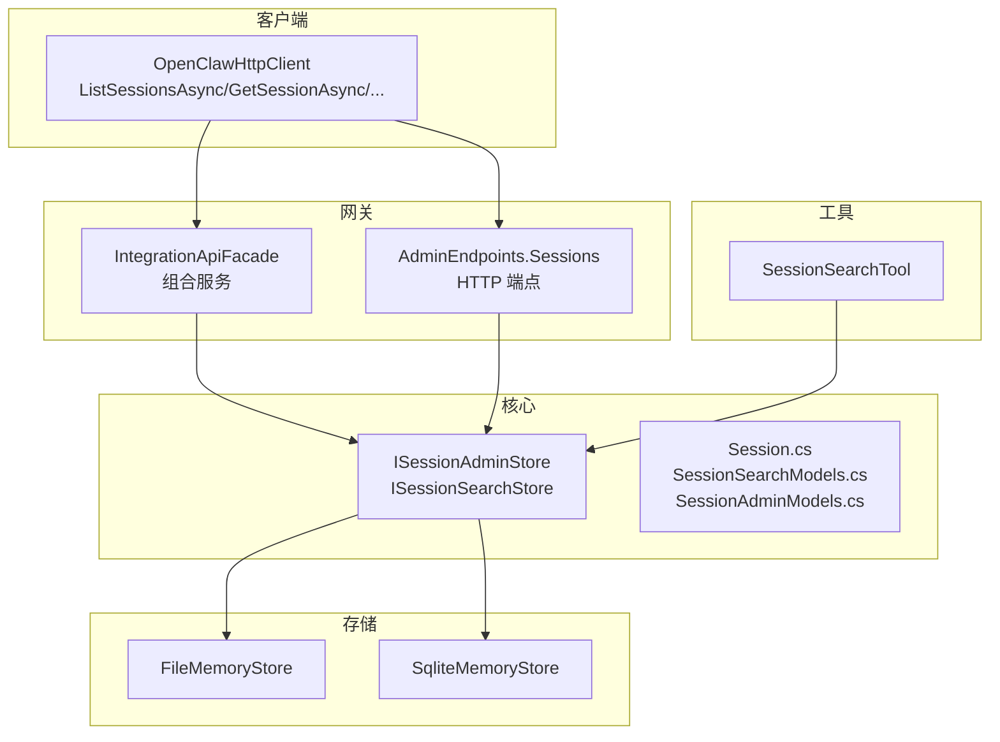
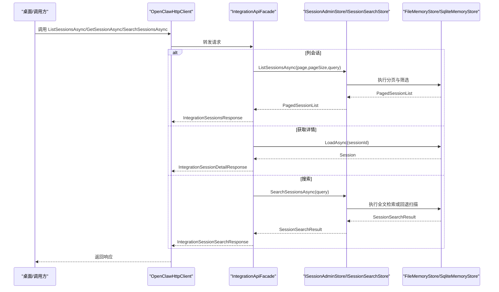
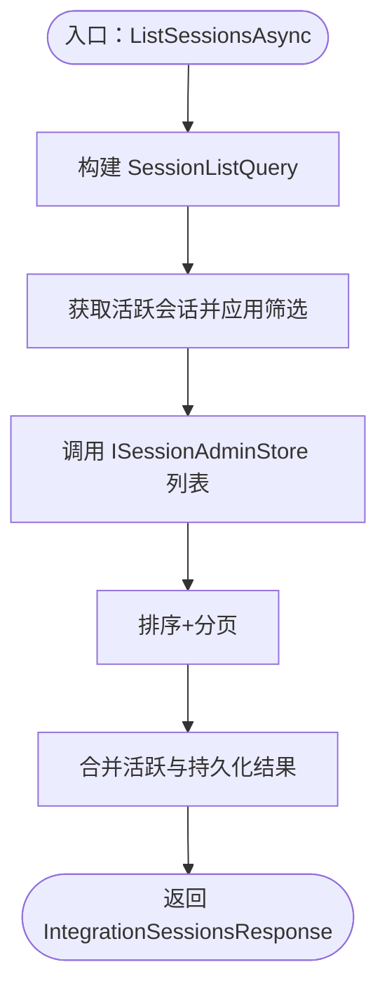
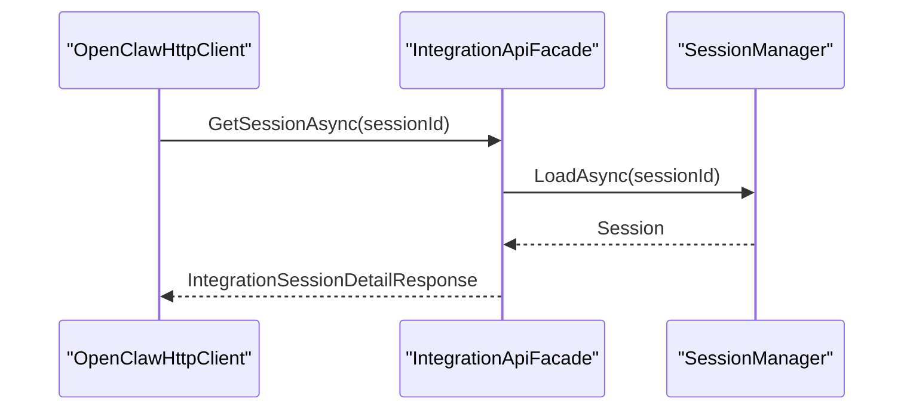
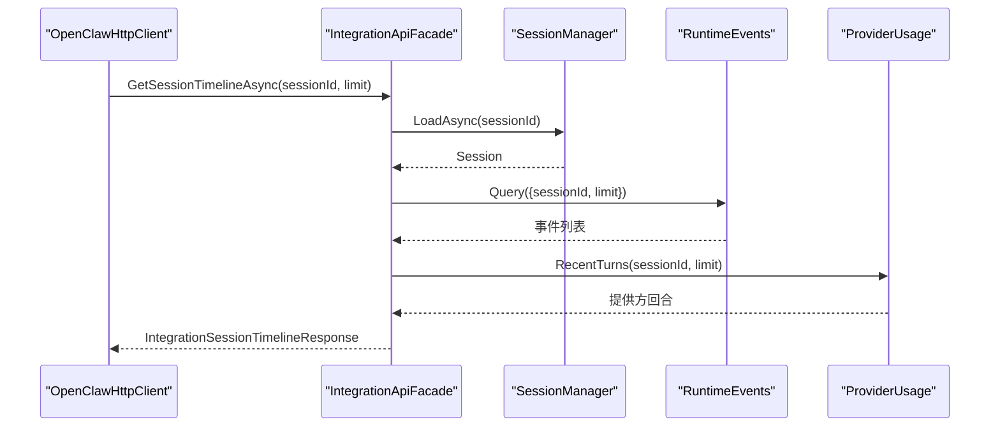
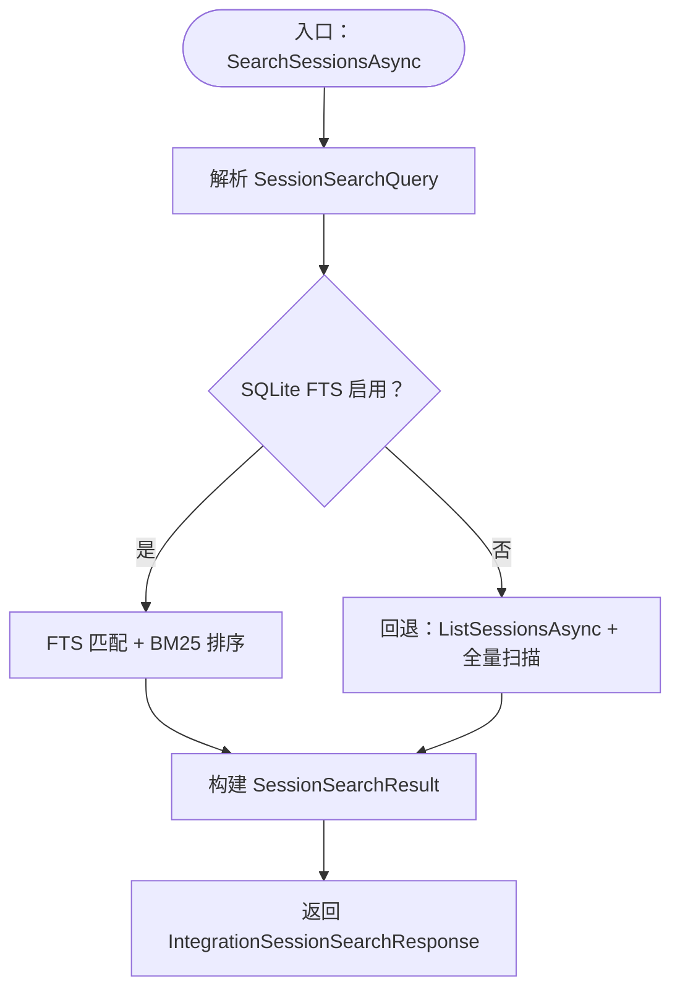
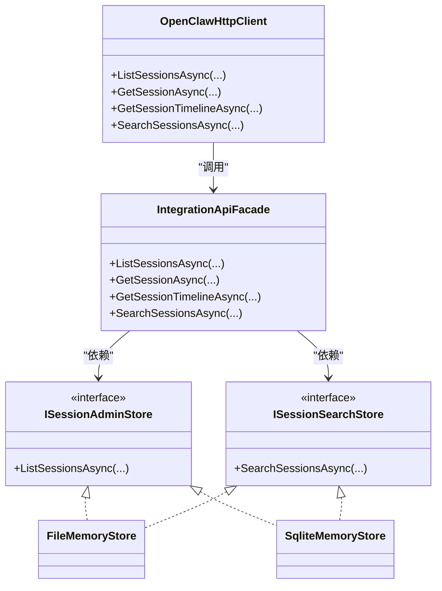

# 会话管理

<cite>
**本文引用的文件**
- [Session.cs](file://src/OpenClaw.Core/Models/Session.cs)
- [SessionSearchModels.cs](file://src/OpenClaw.Core/Models/SessionSearchModels.cs)
- [SessionAdminModels.cs](file://src/OpenClaw.Core/Models/SessionAdminModels.cs)
- [ISessionAdminStore.cs](file://src/OpenClaw.Core/Abstractions/ISessionAdminStore.cs)
- [ISessionSearchStore.cs](file://src/OpenClaw.Core/Abstractions/ISessionSearchStore.cs)
- [IntegrationApiFacade.cs](file://src/OpenClaw.Gateway/Composition/IntegrationApiFacade.cs)
- [AdminEndpoints.Sessions.cs](file://src/OpenClaw.Gateway/Endpoints/AdminEndpoints.Sessions.cs)
- [OpenClawHttpClient.cs](file://src/OpenClaw.Client/OpenClawHttpClient.cs)
- [FileMemoryStore.cs](file://src/OpenClaw.Core/Memory/FileMemoryStore.cs)
- [SqliteMemoryStore.cs](file://src/OpenClaw.Core/Memory/SqliteMemoryStore.cs)
- [SessionSearchTool.cs](file://src/OpenClaw.Gateway/Tools/SessionSearchTool.cs)
- [MainWindowViewModel.Sessions.cs](file://src/OpenClaw.Companion/ViewModels/MainWindowViewModel.Sessions.cs)
- [SessionAdminStoreTests.cs](file://src/OpenClaw.Tests/SessionAdminStoreTests.cs)
</cite>

## 目录
1. [简介](#简介)
2. [项目结构](#项目结构)
3. [核心组件](#核心组件)
4. [架构总览](#架构总览)
5. [详细组件分析](#详细组件分析)
6. [依赖关系分析](#依赖关系分析)
7. [性能考量](#性能考量)
8. [故障排查指南](#故障排查指南)
9. [结论](#结论)
10. [附录：使用示例与最佳实践](#附录使用示例与最佳实践)

## 简介
本技术文档围绕会话管理 API 的核心能力进行系统化说明，重点覆盖以下方法与流程：
- 列出会话：ListSessionsAsync（分页、筛选、活跃与持久化合并）
- 获取会话详情：GetSessionAsync（含分支信息、元数据）
- 查看会话时间线：GetSessionTimelineAsync（运行事件与提供方回合）
- 搜索会话：SearchSessionsAsync（全文检索、片段高亮、相关性排序）

文档将从数据模型、接口契约、存储实现、网关编排到客户端调用逐层展开，并结合测试用例与工具集成点，帮助开发者快速理解并正确使用这些能力。

## 项目结构
围绕会话管理的关键代码分布在如下模块：
- 核心模型与抽象：会话实体、查询模型、接口定义
- 存储实现：文件与 SQLite 内存存储对会话的增删改查与检索
- 网关编排：会话列表、详情、时间线、搜索的组合服务
- 管理端点：HTTP 管理接口，支持分页、筛选、导出
- 客户端：统一 HTTP 客户端封装，暴露上述 API
- 工具集成：会话搜索工具，面向 MCP/插件执行上下文
- 桌面配套：UI 视图模型中对搜索与详情加载的调用

图表来源
- [OpenClawHttpClient.cs:517-543](file://src/OpenClaw.Client/OpenClawHttpClient.cs#L517-L543)
- [IntegrationApiFacade.cs:105-173](file://src/OpenClaw.Gateway/Composition/IntegrationApiFacade.cs#L105-L173)
- [AdminEndpoints.Sessions.cs:40-93](file://src/OpenClaw.Gateway/Endpoints/AdminEndpoints.Sessions.cs#L40-L93)
- [ISessionAdminStore.cs:5-8](file://src/OpenClaw.Core/Abstractions/ISessionAdminStore.cs#L5-L8)
- [ISessionSearchStore.cs:5-8](file://src/OpenClaw.Core/Abstractions/ISessionSearchStore.cs#L5-L8)
- [Session.cs:15-135](file://src/OpenClaw.Core/Models/Session.cs#L15-L135)
- [SessionSearchModels.cs:3-29](file://src/OpenClaw.Core/Models/SessionSearchModels.cs#L3-L29)
- [SessionAdminModels.cs:29-39](file://src/OpenClaw.Core/Models/SessionAdminModels.cs#L29-L39)
- [FileMemoryStore.cs:1076-1156](file://src/OpenClaw.Core/Memory/FileMemoryStore.cs#L1076-L1156)
- [SqliteMemoryStore.cs:1113-1200](file://src/OpenClaw.Core/Memory/SqliteMemoryStore.cs#L1113-L1200)
- [SessionSearchTool.cs:8-71](file://src/OpenClaw.Gateway/Tools/SessionSearchTool.cs#L8-L71)

章节来源
- [OpenClawHttpClient.cs:517-543](file://src/OpenClaw.Client/OpenClawHttpClient.cs#L517-L543)
- [IntegrationApiFacade.cs:105-173](file://src/OpenClaw.Gateway/Composition/IntegrationApiFacade.cs#L105-L173)
- [AdminEndpoints.Sessions.cs:40-93](file://src/OpenClaw.Gateway/Endpoints/AdminEndpoints.Sessions.cs#L40-L93)
- [ISessionAdminStore.cs:5-8](file://src/OpenClaw.Core/Abstractions/ISessionAdminStore.cs#L5-L8)
- [ISessionSearchStore.cs:5-8](file://src/OpenClaw.Core/Abstractions/ISessionSearchStore.cs#L5-L8)
- [Session.cs:15-135](file://src/OpenClaw.Core/Models/Session.cs#L15-L135)
- [SessionSearchModels.cs:3-29](file://src/OpenClaw.Core/Models/SessionSearchModels.cs#L3-L29)
- [SessionAdminModels.cs:29-39](file://src/OpenClaw.Core/Models/SessionAdminModels.cs#L29-L39)
- [FileMemoryStore.cs:1076-1156](file://src/OpenClaw.Core/Memory/FileMemoryStore.cs#L1076-L1156)
- [SqliteMemoryStore.cs:1113-1200](file://src/OpenClaw.Core/Memory/SqliteMemoryStore.cs#L1113-L1200)
- [SessionSearchTool.cs:8-71](file://src/OpenClaw.Gateway/Tools/SessionSearchTool.cs#L8-L71)

## 核心组件
- 会话实体与状态
  - 会话包含标识、通道、发送者、稳定会话绑定、创建/活跃时间、历史轮次、状态、令牌用量、委托元数据等字段；状态枚举包含 Active、Paused、Expired。
- 查询模型
  - 列表查询：SessionListQuery 支持按关键词、通道、发送者、时间范围、状态、星标、标签筛选。
  - 搜索查询：SessionSearchQuery 支持文本、通道、发送者、时间范围、限制条数、片段长度。
  - 搜索结果：SessionSearchResult 包含查询与命中项列表，每项包含会话 ID、通道、发送者、角色、时间戳、片段与分数。
- 接口契约
  - ISessionAdminStore：提供 ListSessionsAsync 分页与筛选能力。
  - ISessionSearchStore：提供 SearchSessionsAsync 全文检索能力。
- 组合服务
  - IntegrationApiFacade：在网关侧聚合“活跃会话 + 持久化会话”，并提供详情与时间线查询。
- 存储实现
  - FileMemoryStore 与 SqliteMemoryStore 均实现上述接口，前者基于文件扫描与内存过滤，后者支持 SQLite FTS 或回退到全量扫描。

章节来源
- [Session.cs:15-135](file://src/OpenClaw.Core/Models/Session.cs#L15-L135)
- [SessionAdminModels.cs:29-39](file://src/OpenClaw.Core/Models/SessionAdminModels.cs#L29-L39)
- [SessionSearchModels.cs:3-29](file://src/OpenClaw.Core/Models/SessionSearchModels.cs#L3-L29)
- [ISessionAdminStore.cs:5-8](file://src/OpenClaw.Core/Abstractions/ISessionAdminStore.cs#L5-L8)
- [ISessionSearchStore.cs:5-8](file://src/OpenClaw.Core/Abstractions/ISessionSearchStore.cs#L5-L8)
- [IntegrationApiFacade.cs:105-173](file://src/OpenClaw.Gateway/Composition/IntegrationApiFacade.cs#L105-L173)
- [FileMemoryStore.cs:1076-1156](file://src/OpenClaw.Core/Memory/FileMemoryStore.cs#L1076-L1156)
- [SqliteMemoryStore.cs:1113-1200](file://src/OpenClaw.Core/Memory/SqliteMemoryStore.cs#L1113-L1200)

## 架构总览
下图展示了从客户端到网关再到存储的完整调用链路，以及搜索工具在运行时的集成方式。

图表来源
- [OpenClawHttpClient.cs:517-543](file://src/OpenClaw.Client/OpenClawHttpClient.cs#L517-L543)
- [IntegrationApiFacade.cs:105-173](file://src/OpenClaw.Gateway/Composition/IntegrationApiFacade.cs#L105-L173)
- [ISessionAdminStore.cs:5-8](file://src/OpenClaw.Core/Abstractions/ISessionAdminStore.cs#L5-L8)
- [ISessionSearchStore.cs:5-8](file://src/OpenClaw.Core/Abstractions/ISessionSearchStore.cs#L5-L8)
- [FileMemoryStore.cs:1076-1156](file://src/OpenClaw.Core/Memory/FileMemoryStore.cs#L1076-L1156)
- [SqliteMemoryStore.cs:1202-1315](file://src/OpenClaw.Core/Memory/SqliteMemoryStore.cs#L1202-L1315)

## 详细组件分析

### ListSessionsAsync：分页与筛选
- 功能要点
  - 支持分页参数 page、pageSize（上限约束）与 SessionListQuery 筛选条件。
  - 网关侧将“活跃会话”与“持久化会话”合并返回，活跃会话标记 IsActive=true。
  - 存储实现（文件/SQLite）分别处理关键词、通道、发送者、时间范围、状态等过滤。
- 关键路径
  - 客户端：OpenClawHttpClient.ListSessionsAsync
  - 网关：IntegrationApiFacade.ListSessionsAsync
  - 存储：FileMemoryStore.ListSessionsAsync、SqliteMemoryStore.ListSessionsAsync
- 性能与限制
  - 分页上限与排序策略由存储层实现，避免一次性加载全部数据。
  - SQLite 可启用 FTS 提升搜索效率，否则采用回退扫描。

图表来源
- [OpenClawHttpClient.cs:517-522](file://src/OpenClaw.Client/OpenClawHttpClient.cs#L517-L522)
- [IntegrationApiFacade.cs:105-142](file://src/OpenClaw.Gateway/Composition/IntegrationApiFacade.cs#L105-L142)
- [FileMemoryStore.cs:1076-1156](file://src/OpenClaw.Core/Memory/FileMemoryStore.cs#L1076-L1156)
- [SqliteMemoryStore.cs:1113-1200](file://src/OpenClaw.Core/Memory/SqliteMemoryStore.cs#L1113-L1200)

章节来源
- [OpenClawHttpClient.cs:517-522](file://src/OpenClaw.Client/OpenClawHttpClient.cs#L517-L522)
- [IntegrationApiFacade.cs:105-142](file://src/OpenClaw.Gateway/Composition/IntegrationApiFacade.cs#L105-L142)
- [FileMemoryStore.cs:1076-1156](file://src/OpenClaw.Core/Memory/FileMemoryStore.cs#L1076-L1156)
- [SqliteMemoryStore.cs:1113-1200](file://src/OpenClaw.Core/Memory/SqliteMemoryStore.cs#L1113-L1200)
- [SessionAdminStoreTests.cs:10-29](file://src/OpenClaw.Tests/SessionAdminStoreTests.cs#L10-L29)

### GetSessionAsync：详情与元数据
- 功能要点
  - 加载指定会话，查询其分支数量与元数据，返回详情响应。
  - 网关侧同时检查会话是否存在与是否处于活跃状态。
- 关键路径
  - 客户端：OpenClawHttpClient.GetSessionAsync
  - 网关：IntegrationApiFacade.GetSessionAsync
  - 存储：SessionManager.LoadAsync（由网关运行时提供）

图表来源
- [OpenClawHttpClient.cs:524-531](file://src/OpenClaw.Client/OpenClawHttpClient.cs#L524-L531)
- [IntegrationApiFacade.cs:144-159](file://src/OpenClaw.Gateway/Composition/IntegrationApiFacade.cs#L144-L159)

章节来源
- [OpenClawHttpClient.cs:524-531](file://src/OpenClaw.Client/OpenClawHttpClient.cs#L524-L531)
- [IntegrationApiFacade.cs:144-159](file://src/OpenClaw.Gateway/Composition/IntegrationApiFacade.cs#L144-L159)

### GetSessionTimelineAsync：时间线与运行事件
- 功能要点
  - 返回会话的时间线视图，包含运行事件与提供方最近回合。
  - 限制最大条目数，避免超大响应。
- 关键路径
  - 客户端：OpenClawHttpClient.GetSessionTimelineAsync
  - 网关：IntegrationApiFacade.GetSessionTimelineAsync
  - 运行时：RuntimeEvents.Query、ProviderUsage.RecentTurns

图表来源
- [OpenClawHttpClient.cs:533-540](file://src/OpenClaw.Client/OpenClawHttpClient.cs#L533-L540)
- [IntegrationApiFacade.cs:161-173](file://src/OpenClaw.Gateway/Composition/IntegrationApiFacade.cs#L161-L173)

章节来源
- [OpenClawHttpClient.cs:533-540](file://src/OpenClaw.Client/OpenClawHttpClient.cs#L533-L540)
- [IntegrationApiFacade.cs:161-173](file://src/OpenClaw.Gateway/Composition/IntegrationApiFacade.cs#L161-L173)

### SearchSessionsAsync：全文检索与片段高亮
- 功能要点
  - 支持文本、通道、发送者、时间范围、限制条数、片段长度。
  - SQLite 启用 FTS 时优先使用匹配查询与 BM25 排序；否则回退到全量扫描并计算相关度分数。
  - 文件存储直接遍历会话历史，匹配内容与工具调用参数。
- 关键路径
  - 客户端：OpenClawHttpClient.SearchSessionsAsync
  - 网关：IntegrationApiFacade.SearchSessionsAsync
  - 存储：SqliteMemoryStore.SearchSessionsAsync、FileMemoryStore.SearchSessionsAsync
  - 工具：SessionSearchTool.ExecuteAsync（MCP/插件执行上下文）

图表来源
- [OpenClawHttpClient.cs:542-543](file://src/OpenClaw.Client/OpenClawHttpClient.cs#L542-L543)
- [IntegrationApiFacade.cs:514-518](file://src/OpenClaw.Gateway/Composition/IntegrationApiFacade.cs#L514-L518)
- [SqliteMemoryStore.cs:1202-1315](file://src/OpenClaw.Core/Memory/SqliteMemoryStore.cs#L1202-L1315)
- [FileMemoryStore.cs:1158-1220](file://src/OpenClaw.Core/Memory/FileMemoryStore.cs#L1158-L1220)
- [SessionSearchTool.cs:36-60](file://src/OpenClaw.Gateway/Tools/SessionSearchTool.cs#L36-L60)

章节来源
- [OpenClawHttpClient.cs:542-543](file://src/OpenClaw.Client/OpenClawHttpClient.cs#L542-L543)
- [IntegrationApiFacade.cs:514-518](file://src/OpenClaw.Gateway/Composition/IntegrationApiFacade.cs#L514-L518)
- [SqliteMemoryStore.cs:1202-1315](file://src/OpenClaw.Core/Memory/SqliteMemoryStore.cs#L1202-L1315)
- [FileMemoryStore.cs:1158-1220](file://src/OpenClaw.Core/Memory/FileMemoryStore.cs#L1158-L1220)
- [SessionSearchTool.cs:36-60](file://src/OpenClaw.Gateway/Tools/SessionSearchTool.cs#L36-L60)

## 依赖关系分析
- 客户端依赖网关组合服务，通过统一 HTTP 客户端访问。
- 网关组合服务依赖会话管理器与存储接口，实现业务编排。
- 存储接口由文件与 SQLite 实现，提供一致的查询语义。
- 管理端点负责参数解析与权限校验，最终委派给组合服务。
- 工具集成通过会话搜索工具在运行时上下文中执行检索。

图表来源
- [OpenClawHttpClient.cs:517-543](file://src/OpenClaw.Client/OpenClawHttpClient.cs#L517-L543)
- [IntegrationApiFacade.cs:105-173](file://src/OpenClaw.Gateway/Composition/IntegrationApiFacade.cs#L105-L173)
- [ISessionAdminStore.cs:5-8](file://src/OpenClaw.Core/Abstractions/ISessionAdminStore.cs#L5-L8)
- [ISessionSearchStore.cs:5-8](file://src/OpenClaw.Core/Abstractions/ISessionSearchStore.cs#L5-L8)
- [FileMemoryStore.cs:1076-1156](file://src/OpenClaw.Core/Memory/FileMemoryStore.cs#L1076-L1156)
- [SqliteMemoryStore.cs:1113-1200](file://src/OpenClaw.Core/Memory/SqliteMemoryStore.cs#L1113-L1200)

章节来源
- [OpenClawHttpClient.cs:517-543](file://src/OpenClaw.Client/OpenClawHttpClient.cs#L517-L543)
- [IntegrationApiFacade.cs:105-173](file://src/OpenClaw.Gateway/Composition/IntegrationApiFacade.cs#L105-L173)
- [ISessionAdminStore.cs:5-8](file://src/OpenClaw.Core/Abstractions/ISessionAdminStore.cs#L5-L8)
- [ISessionSearchStore.cs:5-8](file://src/OpenClaw.Core/Abstractions/ISessionSearchStore.cs#L5-L8)
- [FileMemoryStore.cs:1076-1156](file://src/OpenClaw.Core/Memory/FileMemoryStore.cs#L1076-L1156)
- [SqliteMemoryStore.cs:1113-1200](file://src/OpenClaw.Core/Memory/SqliteMemoryStore.cs#L1113-L1200)

## 性能考量
- 分页与上限
  - 列表与搜索均对条数进行上限控制，避免过大数据集传输。
- SQLite FTS
  - 在 SQLite 启用 FTS 时，使用 MATCH 与 BM25 排序，显著提升检索性能与相关度质量。
- 回退策略
  - 当 FTS 不可用或查询语法异常时，自动回退到全量扫描，保证功能可用性。
- 并发与缓存
  - 文件存储在并发加载时使用缓存实例，减少重复解析与 IO。
- 时间线限制
  - 时间线查询限制最大条数，防止超大响应导致性能问题。

[本节为通用指导，不直接分析具体文件]

## 故障排查指南
- 会话不存在
  - GetSessionAsync 返回空或 404，确认会话 ID 是否正确且会话已持久化。
- 搜索无结果
  - 检查文本是否为空、通道/发送者筛选是否过于严格、时间范围是否合理。
  - 若 SQLite FTS 异常，将触发回退逻辑；可检查数据库完整性与 FTS 配置。
- 列表为空或分页异常
  - 确认筛选条件（如状态、标签、星标）是否导致结果为空。
  - 检查分页参数是否越界或超出上限。
- 工具执行失败
  - SessionSearchTool 需要执行上下文；若仅以普通字符串执行，会返回错误提示。

章节来源
- [IntegrationApiFacade.cs:144-159](file://src/OpenClaw.Gateway/Composition/IntegrationApiFacade.cs#L144-L159)
- [SqliteMemoryStore.cs:1257-1261](file://src/OpenClaw.Core/Memory/SqliteMemoryStore.cs#L1257-L1261)
- [SessionSearchTool.cs:33-34](file://src/OpenClaw.Gateway/Tools/SessionSearchTool.cs#L33-L34)

## 结论
会话管理 API 通过清晰的模型与接口设计，实现了从列表、详情、时间线到全文检索的完整能力闭环。网关组合服务将活跃与持久化会话统一呈现，存储层提供灵活的筛选与检索策略。配合管理端点与客户端封装，开发者可以高效地完成会话查询、详情获取、时间线查看与搜索过滤等常见任务。

[本节为总结性内容，不直接分析具体文件]

## 附录：使用示例与最佳实践
- 查询会话历史
  - 使用 ListSessionsAsync，设置分页与筛选条件（通道、发送者、时间范围、状态、关键词），合并活跃与持久化结果。
  - 示例路径参考：[OpenClawHttpClient.ListSessionsAsync:517-522](file://src/OpenClaw.Client/OpenClawHttpClient.cs#L517-L522)，[IntegrationApiFacade.ListSessionsAsync:105-142](file://src/OpenClaw.Gateway/Composition/IntegrationApiFacade.cs#L105-L142)
- 分析会话行为
  - 使用 GetSessionTimelineAsync 获取运行事件与提供方回合，结合会话详情中的历史轮次与令牌用量进行分析。
  - 示例路径参考：[OpenClawHttpClient.GetSessionTimelineAsync:533-540](file://src/OpenClaw.Client/OpenClawHttpClient.cs#L533-L540)，[IntegrationApiFacade.GetSessionTimelineAsync:161-173](file://src/OpenClaw.Gateway/Composition/IntegrationApiFacade.cs#L161-L173)
- 实现会话搜索
  - 使用 SearchSessionsAsync，传入文本与可选筛选条件，利用 SQLite FTS 获取高相关度命中与片段。
  - 示例路径参考：[OpenClawHttpClient.SearchSessionsAsync:542-543](file://src/OpenClaw.Client/OpenClawHttpClient.cs#L542-L543)，[SqliteMemoryStore.SearchSessionsAsync:1202-1315](file://src/OpenClaw.Core/Memory/SqliteMemoryStore.cs#L1202-L1315)
- UI 中的典型流程
  - 搜索框输入关键词后调用 SearchSessionsAsync，将结果映射为会话摘要；点击某条目后调用 GetSessionAsync 与 GetSessionTimelineAsync 展示详情与时间线。
  - 示例路径参考：[MainWindowViewModel.Sessions.cs:148-180](file://src/OpenClaw.Companion/ViewModels/MainWindowViewModel.Sessions.cs#L148-L180)

章节来源
- [OpenClawHttpClient.cs:517-543](file://src/OpenClaw.Client/OpenClawHttpClient.cs#L517-L543)
- [IntegrationApiFacade.cs:105-173](file://src/OpenClaw.Gateway/Composition/IntegrationApiFacade.cs#L105-L173)
- [SqliteMemoryStore.cs:1202-1315](file://src/OpenClaw.Core/Memory/SqliteMemoryStore.cs#L1202-L1315)
- [MainWindowViewModel.Sessions.cs:148-180](file://src/OpenClaw.Companion/ViewModels/MainWindowViewModel.Sessions.cs#L148-L180)
- [SessionAdminStoreTests.cs:10-29](file://src/OpenClaw.Tests/SessionAdminStoreTests.cs#L10-L29)