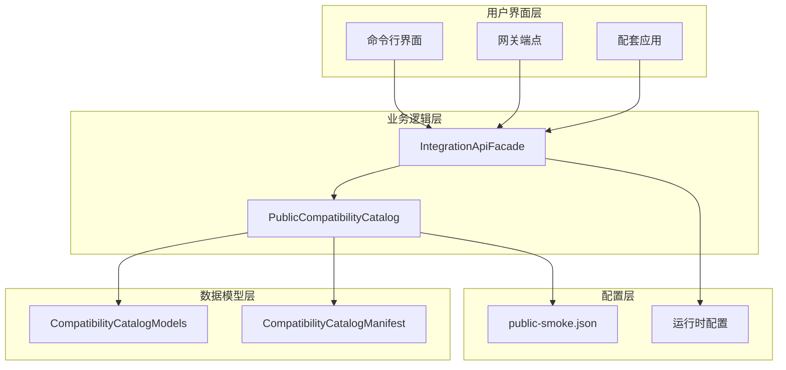
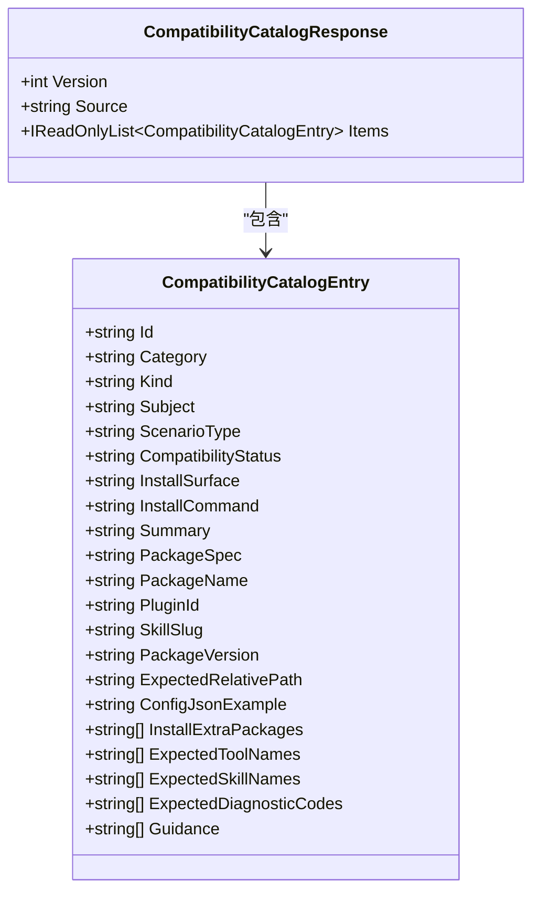
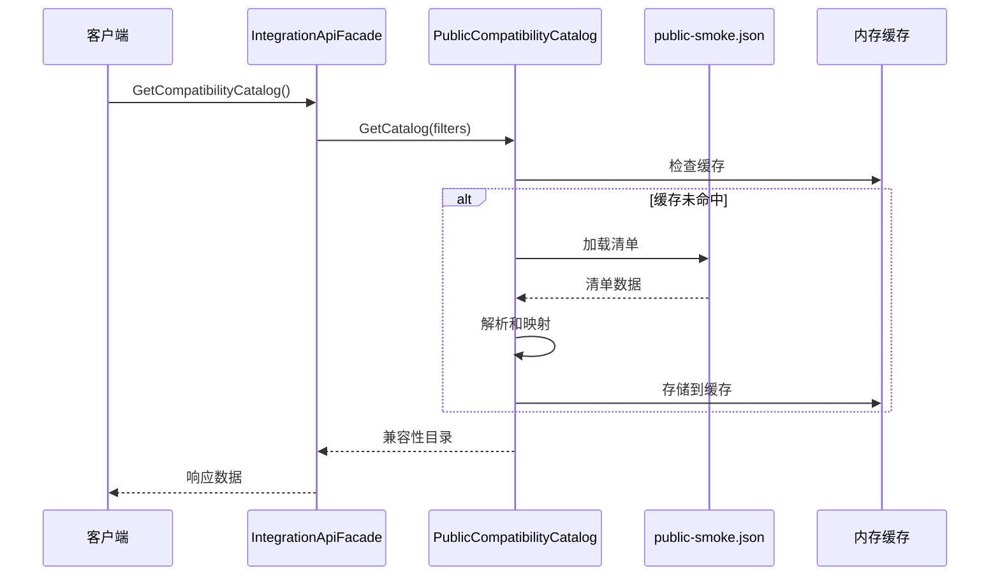
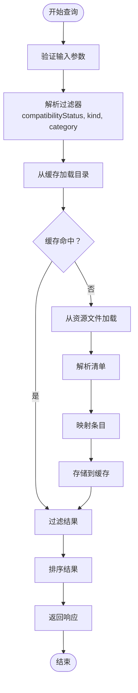
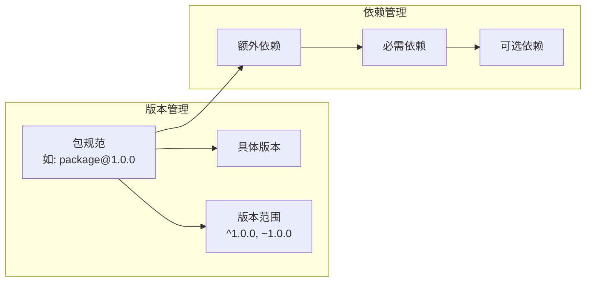
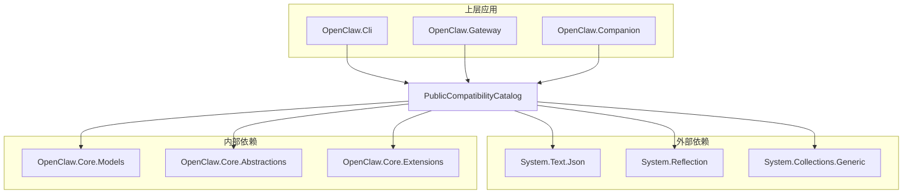
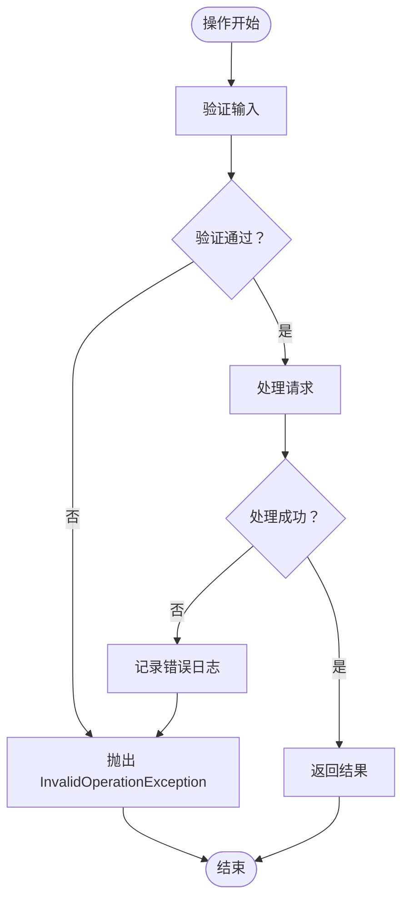

# 兼容性目录

<cite>
**本文档引用的文件**
- [PublicCompatibilityCatalog.cs](file://src/OpenClaw.Core/Compatibility/PublicCompatibilityCatalog.cs)
- [CompatibilityCatalogModels.cs](file://src/OpenClaw.Core/Models/CompatibilityCatalogModels.cs)
- [CompatibilityCommands.cs](file://src/OpenClaw.Cli/CompatibilityCommands.cs)
- [IntegrationApiFacade.cs](file://src/OpenClaw.Gateway/Composition/IntegrationApiFacade.cs)
- [AdminEndpoints.PluginsAndChannels.cs](file://src/OpenClaw.Gateway/Endpoints/AdminEndpoints.PluginsAndChannels.cs)
- [CompatibilityCatalogTests.cs](file://src/OpenClaw.Tests/CompatibilityCatalogTests.cs)
- [PublicCompatibilitySmokeTests.cs](file://src/OpenClaw.Tests/PublicCompatibilitySmokeTests.cs)
- [COMPATIBILITY.md](file://COMPATIBILITY.md)
</cite>

## 目录
1. [简介](#简介)
2. [项目结构](#项目结构)
3. [核心组件](#核心组件)
4. [架构概览](#架构概览)
5. [详细组件分析](#详细组件分析)
6. [依赖关系分析](#依赖关系分析)
7. [性能考虑](#性能考虑)
8. [故障排除指南](#故障排除指南)
9. [结论](#结论)
10. [附录](#附录)

## 简介

兼容性目录是 OpenClaw.NET 生态系统中的核心组件，用于管理和查询插件、技能和工具的兼容性状态。该系统通过一个预定义的"烟雾测试"清单（public-smoke.json）来确保在不同运行模式（AOT 和 JIT）下的一致性和可预测性。

该目录系统提供了以下关键功能：
- **兼容性查询**：基于多种过滤条件查询兼容性场景
- **版本匹配**：验证插件版本与运行时环境的兼容性
- **依赖解析**：自动识别和处理插件依赖关系
- **冲突检测**：识别潜在的工具名称冲突和其他兼容性问题
- **升级路径**：提供从不兼容到兼容的升级指导

## 项目结构

兼容性目录系统由多个层次组成，每个层次都有特定的职责：



**图表来源**
- [IntegrationApiFacade.cs:217-236](file://src/OpenClaw.Gateway/Composition/IntegrationApiFacade.cs#L217-L236)
- [PublicCompatibilityCatalog.cs:8-35](file://src/OpenClaw.Core/Compatibility/PublicCompatibilityCatalog.cs#L8-L35)
- [CompatibilityCatalogModels.cs:3-33](file://src/OpenClaw.Core/Models/CompatibilityCatalogModels.cs#L3-L33)

**章节来源**
- [IntegrationApiFacade.cs:1-800](file://src/OpenClaw.Gateway/Composition/IntegrationApiFacade.cs#L1-L800)
- [PublicCompatibilityCatalog.cs:1-222](file://src/OpenClaw.Core/Compatibility/PublicCompatibilityCatalog.cs#L1-L222)
- [CompatibilityCatalogModels.cs:1-34](file://src/OpenClaw.Core/Models/CompatibilityCatalogModels.cs#L1-L34)

## 核心组件

### PublicCompatibilityCatalog 类

这是兼容性目录的核心实现类，负责加载、解析和查询兼容性清单。

**主要特性**：
- **延迟加载**：使用 Lazy<T> 模式确保只在需要时加载清单
- **内存缓存**：缓存已解析的清单以提高性能
- **动态过滤**：支持按兼容性状态、类型和类别的实时过滤
- **智能排序**：按兼容性状态、主题和标识符排序结果

**关键方法**：
- `GetCatalog()`：获取兼容性目录的主要入口点
- `CreateCatalog()`：从清单创建目录响应
- `MapEntry()`：将清单条目映射到目录条目

### 数据模型

兼容性目录使用强类型的模型来表示数据：



**图表来源**
- [CompatibilityCatalogModels.cs:3-33](file://src/OpenClaw.Core/Models/CompatibilityCatalogModels.cs#L3-L33)

**章节来源**
- [PublicCompatibilityCatalog.cs:8-222](file://src/OpenClaw.Core/Compatibility/PublicCompatibilityCatalog.cs#L8-L222)
- [CompatibilityCatalogModels.cs:1-34](file://src/OpenClaw.Core/Models/CompatibilityCatalogModels.cs#L1-L34)

## 架构概览

兼容性目录系统采用分层架构设计，确保关注点分离和可维护性：



**图表来源**
- [IntegrationApiFacade.cs:217-236](file://src/OpenClaw.Gateway/Composition/IntegrationApiFacade.cs#L217-L236)
- [PublicCompatibilityCatalog.cs:14-35](file://src/OpenClaw.Core/Compatibility/PublicCompatibilityCatalog.cs#L14-L35)

### 运行时模式支持

系统支持三种不同的运行时模式，每种模式对兼容性有不同的要求：

| 运行时模式 | 描述 | 支持的插件表面 | 兼容性要求 |
|-----------|------|---------------|-----------|
| AOT (Ahead-of-Time) | 预编译模式，严格内存限制 | `api.registerTool()`, `api.registerService()` | 最严格的兼容性要求 |
| JIT (Just-in-Time) | 动态编译模式，更宽松的限制 | 所有插件表面 | 支持所有功能 |
| Auto | 自动选择模式 | 根据环境自动选择 | AOT 或 JIT |

**章节来源**
- [COMPATIBILITY.md:5-10](file://COMPATIBILITY.md#L5-L10)

## 详细组件分析

### GetCompatibilityCatalogAsync 方法实现

虽然源代码中显示的是同步方法 `GetCatalog`，但系统设计支持异步操作。以下是完整的实现流程：



**图表来源**
- [PublicCompatibilityCatalog.cs:14-35](file://src/OpenClaw.Core/Compatibility/PublicCompatibilityCatalog.cs#L14-L35)
- [PublicCompatibilityCatalog.cs:40-48](file://src/OpenClaw.Core/Compatibility/PublicCompatibilityCatalog.cs#L40-L48)

### 兼容性级别和状态

系统定义了明确的兼容性级别来描述插件的状态：

| 兼容性状态 | 描述 | 使用场景 |
|-----------|------|---------|
| compatible | 插件完全兼容当前运行时 | 推荐使用的插件 |
| incompatible | 插件与当前运行时不兼容 | 需要升级或替换的插件 |
| unknown | 无法确定兼容性状态 | 新发现的插件或测试用例 |

### 版本范围和依赖约束

系统通过以下机制管理版本和依赖：



**图表来源**
- [PublicCompatibilityCatalog.cs:99-112](file://src/OpenClaw.Core/Compatibility/PublicCompatibilityCatalog.cs#L99-L112)
- [PublicCompatibilityCatalog.cs:203-214](file://src/OpenClaw.Core/Compatibility/PublicCompatibilityCatalog.cs#L203-L214)

### 升级路径规划

系统提供清晰的升级指导：

1. **检查当前状态**：使用兼容性目录查询当前插件状态
2. **识别问题**：分析诊断代码和建议
3. **执行升级**：按照安装命令进行升级
4. **验证结果**：重新查询确认升级成功

**章节来源**
- [CompatibilityCatalogTests.cs:29-38](file://src/OpenClaw.Tests/CompatibilityCatalogTests.cs#L29-L38)

## 依赖关系分析

兼容性目录系统与其他组件的依赖关系如下：



**图表来源**
- [PublicCompatibilityCatalog.cs:1-5](file://src/OpenClaw.Core/Compatibility/PublicCompatibilityCatalog.cs#L1-L5)
- [IntegrationApiFacade.cs:1-8](file://src/OpenClaw.Gateway/Composition/IntegrationApiFacade.cs#L1-L8)

### 错误处理和异常管理

系统实现了完善的错误处理机制：



**图表来源**
- [PublicCompatibilityCatalog.cs:170-189](file://src/OpenClaw.Core/Compatibility/PublicCompatibilityCatalog.cs#L170-L189)

**章节来源**
- [PublicCompatibilityCatalog.cs:170-189](file://src/OpenClaw.Core/Compatibility/PublicCompatibilityCatalog.cs#L170-L189)
- [CompatibilityCatalogTests.cs:41-83](file://src/OpenClaw.Tests/CompatibilityCatalogTests.cs#L41-L83)

## 性能考虑

兼容性目录系统在设计时充分考虑了性能优化：

### 缓存策略
- **延迟初始化**：使用 Lazy<T> 确保只在首次访问时加载
- **内存缓存**：缓存已解析的清单以避免重复解析
- **线程安全**：使用并发安全的数据结构

### 查询优化
- **索引字段**：对常用过滤字段建立索引
- **早期过滤**：在加载阶段就应用过滤条件
- **增量更新**：支持部分更新而不是全量重载

### 内存管理
- **对象池化**：复用临时对象减少 GC 压力
- **流式处理**：大文件使用流式读取避免内存峰值

## 故障排除指南

### 常见问题和解决方案

| 问题类型 | 症状 | 解决方案 |
|---------|------|---------|
| 清单加载失败 | 抛出 InvalidOperationException | 检查 public-smoke.json 是否存在且格式正确 |
| 过滤器无效 | 返回空结果集 | 验证过滤参数的拼写和大小写 |
| 性能问题 | 查询响应缓慢 | 检查缓存是否正常工作，考虑增加索引 |
| 版本冲突 | 插件加载失败 | 按照安装命令升级到兼容版本 |

### 调试技巧

1. **启用详细日志**：查看兼容性目录的加载和查询过程
2. **使用 CLI 工具**：通过命令行接口验证兼容性状态
3. **检查清单完整性**：确保所有必需字段都已正确设置

**章节来源**
- [CompatibilityCatalogTests.cs:41-83](file://src/OpenClaw.Tests/CompatibilityCatalogTests.cs#L41-L83)
- [PublicCompatibilitySmokeTests.cs:87-98](file://src/OpenClaw.Tests/PublicCompatibilitySmokeTests.cs#L87-L98)

## 结论

兼容性目录系统为 OpenClaw.NET 提供了一个强大而灵活的兼容性管理框架。通过预定义的烟雾测试清单和智能的查询机制，系统能够：

- **确保一致性**：在不同运行模式下提供一致的兼容性体验
- **简化集成**：为开发者提供清晰的升级和迁移指导
- **提升可靠性**：通过自动化测试和验证确保系统的稳定性
- **优化性能**：通过缓存和优化的查询机制提供快速响应

该系统的设计充分体现了现代软件架构的最佳实践，为未来的扩展和维护奠定了坚实的基础。

## 附录

### 使用示例

#### 基本查询
```bash
# 列出所有兼容的插件
openclaw compatibility catalog --status compatible

# 按类型过滤
openclaw compatibility catalog --kind npm-plugin

# 获取机器可读输出
openclaw compatibility catalog --json
```

#### 高级查询
```bash
# 组合过滤条件
openclaw compatibility catalog \
  --status compatible \
  --kind clawhub-skill \
  --category pure-skill
```

### API 参考

兼容性目录提供以下主要接口：

- **HTTP API**：`GET /admin/compatibility/catalog`
- **CLI 命令**：`openclaw compatibility catalog`
- **程序化访问**：`PublicCompatibilityCatalog.GetCatalog()`

**章节来源**
- [CompatibilityCommands.cs:92-105](file://src/OpenClaw.Cli/CompatibilityCommands.cs#L92-L105)
- [IntegrationApiFacade.cs:217-236](file://src/OpenClaw.Gateway/Composition/IntegrationApiFacade.cs#L217-L236)