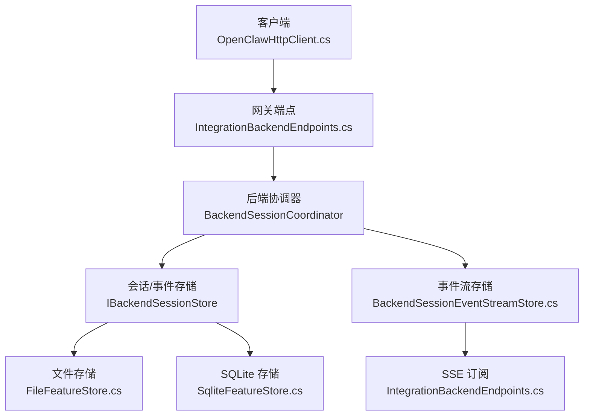
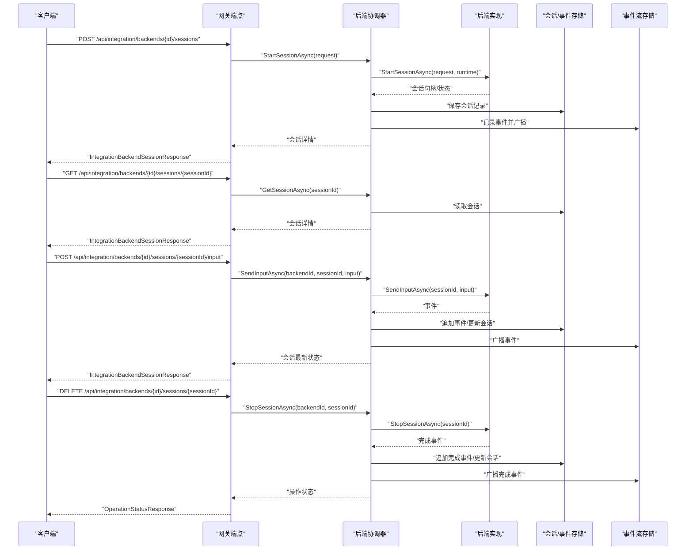
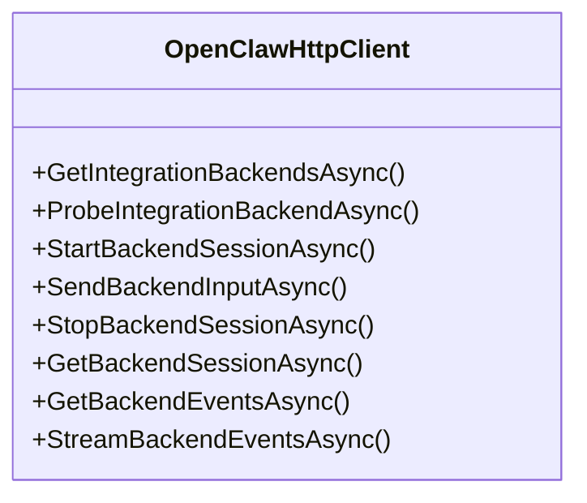
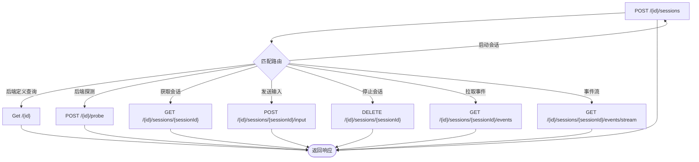
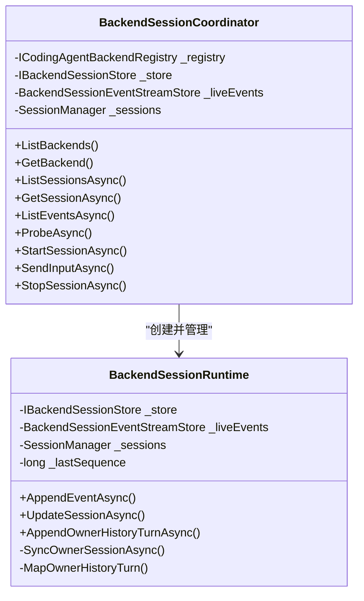
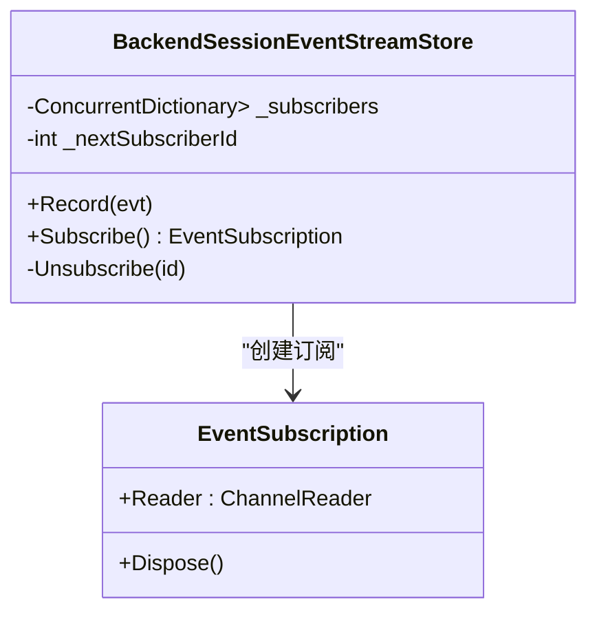
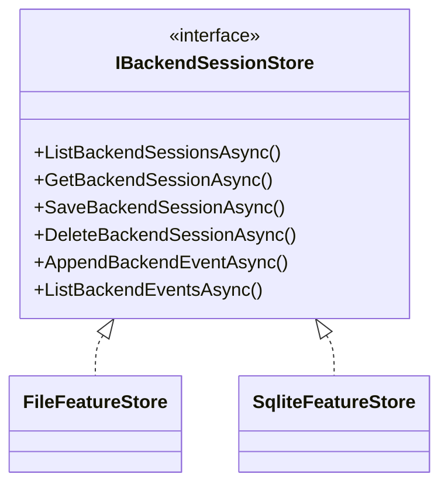
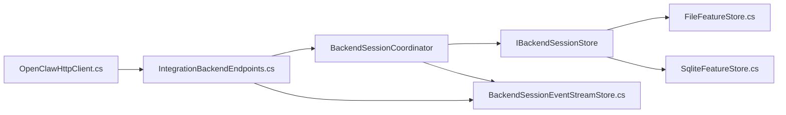

# 后端管理

<cite>
**本文引用的文件**
- [OpenClawHttpClient.cs](file://src/OpenClaw.Client/OpenClawHttpClient.cs)
- [IntegrationBackendEndpoints.cs](file://src/OpenClaw.Gateway/Endpoints/IntegrationBackendEndpoints.cs)
- [BackendSessionServices.cs](file://src/OpenClaw.Gateway/Backends/BackendSessionServices.cs)
- [BackendSessionEventStreamStore.cs](file://src/OpenClaw.Gateway/Backends/BackendSessionEventStreamStore.cs)
- [SqliteFeatureStore.cs](file://src/OpenClaw.Core/Features/SqliteFeatureStore.cs)
- [FileFeatureStore.cs](file://src/OpenClaw.Core/Features/FileFeatureStore.cs)
- [OpenClaw-Session-Management.md](file://docs/OpenClaw-Session-Management.md)
- [Program.cs](file://src/OpenClaw.Cli/Program.cs)
- [GatewayAdminEndpointTests.cs](file://src/OpenClaw.Tests/GatewayAdminEndpointTests.cs)
</cite>

## 目录
1. [简介](#简介)
2. [项目结构](#项目结构)
3. [核心组件](#核心组件)
4. [架构总览](#架构总览)
5. [详细组件分析](#详细组件分析)
6. [依赖关系分析](#依赖关系分析)
7. [性能考量](#性能考量)
8. [故障排查指南](#故障排查指南)
9. [结论](#结论)
10. [附录](#附录)

## 简介
本技术文档聚焦于后端管理 API 的实现与使用，涵盖以下关键方法：
- GetIntegrationBackendsAsync：查询可用的集成后端列表
- GetIntegrationBackendAsync：按 ID 查询单个后端定义
- ProbeIntegrationBackendAsync：探测后端连通性与能力
- StartBackendSessionAsync：启动后端会话
- SendBackendInputAsync：向会话发送输入
- StopBackendSessionAsync：停止后端会话
- GetBackendSessionAsync：获取会话详情
- GetBackendEventsAsync：分页拉取会话事件
- StreamBackendEventsAsync：事件流订阅（SSE）

文档将从系统架构、组件关系、数据流、处理逻辑、集成点、错误处理与性能特性等方面进行深入解析，并提供可操作的使用示例与最佳实践。

## 项目结构
后端管理相关能力分布在以下模块：
- 客户端层：OpenClawHttpClient 提供对后端管理 API 的 HTTP 调用封装
- 网关层：IntegrationBackendEndpoints 定义 REST 接口，路由到 BackendSessionCoordinator
- 协调层：BackendSessionCoordinator 编排后端生命周期、事件存储与会话同步
- 存储层：IBackendSessionStore 的文件与 SQLite 实现，持久化会话与事件
- 事件流：BackendSessionEventStreamStore 提供实时事件订阅（SSE）
- 文档与测试：OpenClaw-Session-Management.md 与测试用例验证事件流与会话生命周期

图表来源
- [OpenClawHttpClient.cs](file://src/OpenClaw.Client/OpenClawHttpClient.cs)
- [IntegrationBackendEndpoints.cs](file://src/OpenClaw.Gateway/Endpoints/IntegrationBackendEndpoints.cs)
- [BackendSessionServices.cs](file://src/OpenClaw.Gateway/Backends/BackendSessionServices.cs)
- [BackendSessionEventStreamStore.cs](file://src/OpenClaw.Gateway/Backends/BackendSessionEventStreamStore.cs)
- [FileFeatureStore.cs](file://src/OpenClaw.Core/Features/FileFeatureStore.cs)
- [SqliteFeatureStore.cs](file://src/OpenClaw.Core/Features/SqliteFeatureStore.cs)

章节来源
- [OpenClawHttpClient.cs](file://src/OpenClaw.Client/OpenClawHttpClient.cs)
- [IntegrationBackendEndpoints.cs](file://src/OpenClaw.Gateway/Endpoints/IntegrationBackendEndpoints.cs)
- [BackendSessionServices.cs](file://src/OpenClaw.Gateway/Backends/BackendSessionServices.cs)
- [BackendSessionEventStreamStore.cs](file://src/OpenClaw.Gateway/Backends/BackendSessionEventStreamStore.cs)
- [FileFeatureStore.cs](file://src/OpenClaw.Core/Features/FileFeatureStore.cs)
- [SqliteFeatureStore.cs](file://src/OpenClaw.Core/Features/SqliteFeatureStore.cs)

## 核心组件
- 客户端 HTTP 客户端：封装后端管理 API 的请求构建与响应解析，支持同步与流式事件订阅
- 网关端点：暴露 REST 接口，负责鉴权、参数校验、调用协调器并返回结果
- 后端协调器：注册表驱动的后端编排器，负责会话创建、输入转发、停止与事件持久化
- 事件流存储：基于通道的事件订阅中心，支持多订阅者与背压控制
- 会话/事件存储：抽象接口的文件与 SQLite 实现，分别用于开发与生产场景

章节来源
- [OpenClawHttpClient.cs](file://src/OpenClaw.Client/OpenClawHttpClient.cs)
- [IntegrationBackendEndpoints.cs](file://src/OpenClaw.Gateway/Endpoints/IntegrationBackendEndpoints.cs)
- [BackendSessionServices.cs](file://src/OpenClaw.Gateway/Backends/BackendSessionServices.cs)
- [BackendSessionEventStreamStore.cs](file://src/OpenClaw.Gateway/Backends/BackendSessionEventStreamStore.cs)
- [FileFeatureStore.cs](file://src/OpenClaw.Core/Features/FileFeatureStore.cs)
- [SqliteFeatureStore.cs](file://src/OpenClaw.Core/Features/SqliteFeatureStore.cs)

## 架构总览
后端管理采用“客户端 → 网关 → 协调器 → 存储/事件流”的分层设计。客户端通过 HTTP 发起请求；网关端点完成鉴权与参数解析；协调器根据后端注册表调用具体后端实现；事件通过事件流存储广播给 SSE 订阅者；会话与事件持久化到文件或 SQLite。

图表来源
- [IntegrationBackendEndpoints.cs](file://src/OpenClaw.Gateway/Endpoints/IntegrationBackendEndpoints.cs)
- [BackendSessionServices.cs](file://src/OpenClaw.Gateway/Backends/BackendSessionServices.cs)
- [OpenClawHttpClient.cs](file://src/OpenClaw.Client/OpenClawHttpClient.cs)

## 详细组件分析

### 客户端 API 封装（OpenClawHttpClient）
- 方法映射：GetIntegrationBackendsAsync、ProbeIntegrationBackendAsync、StartBackendSessionAsync、SendBackendInputAsync、StopBackendSessionAsync、GetBackendSessionAsync、GetBackendEventsAsync、StreamBackendEventsAsync
- 请求构建：基于 URI 模板与 JSON 序列化上下文构造 HTTP 请求
- 响应解析：统一使用 CoreJsonContext 解析响应模型
- 事件流：StreamBackendEventsAsync 以 text/event-stream 方式接收事件，逐行解析 data: 行

图表来源
- [OpenClawHttpClient.cs](file://src/OpenClaw.Client/OpenClawHttpClient.cs)

章节来源
- [OpenClawHttpClient.cs](file://src/OpenClaw.Client/OpenClawHttpClient.cs)

### 网关端点（IntegrationBackendEndpoints）
- 路由与鉴权：统一通过 AuthorizeAndConsume 进行权限校验与令牌消耗
- 会话管理端点：
  - GET /{id}：查询后端定义
  - POST /{id}/probe：探测后端
  - POST /{id}/sessions：启动会话
  - GET /{id}/sessions/{sessionId}：获取会话
  - POST /{id}/sessions/{sessionId}/input：发送输入
  - DELETE /{id}/sessions/{sessionId}：停止会话
  - GET /{id}/sessions/{sessionId}/events：分页拉取事件
  - GET /{id}/sessions/{sessionId}/events/stream：SSE 事件流
- 参数校验与错误处理：对无效 JSON、会话不存在等情况返回标准化错误

图表来源
- [IntegrationBackendEndpoints.cs](file://src/OpenClaw.Gateway/Endpoints/IntegrationBackendEndpoints.cs)

章节来源
- [IntegrationBackendEndpoints.cs](file://src/OpenClaw.Gateway/Endpoints/IntegrationBackendEndpoints.cs)

### 后端协调器（BackendSessionCoordinator）
- 注册表驱动：通过 ICodingAgentBackendRegistry 获取后端实现
- 生命周期编排：
  - StartSessionAsync：生成会话记录、持久化、启动后端会话、更新状态
  - SendInputAsync：将输入转发至后端
  - StopSessionAsync：停止后端会话
  - ProbeAsync：探测后端能力
- 事件与会话同步：BackendSessionRuntime 将后端事件映射为会话历史项并写入所有者会话
- 并发与一致性：使用锁保护序列号与会话状态更新

图表来源
- [BackendSessionServices.cs](file://src/OpenClaw.Gateway/Backends/BackendSessionServices.cs)

章节来源
- [BackendSessionServices.cs](file://src/OpenClaw.Gateway/Backends/BackendSessionServices.cs)

### 事件流存储（BackendSessionEventStreamStore）
- 多订阅者模型：使用并发字典维护订阅者，每个订阅者拥有有界通道
- 背压策略：丢弃最旧事件，保证实时性
- 订阅生命周期：订阅者释放时自动取消订阅

图表来源
- [BackendSessionEventStreamStore.cs](file://src/OpenClaw.Gateway/Backends/BackendSessionEventStreamStore.cs)

章节来源
- [BackendSessionEventStreamStore.cs](file://src/OpenClaw.Gateway/Backends/BackendSessionEventStreamStore.cs)

### 会话/事件存储（IBackendSessionStore）
- 文件实现：FileFeatureStore 以 JSON 文件形式存储会话与事件
- SQLite 实现：SqliteFeatureStore 以关系型数据库持久化，支持高效查询与事务
- 关键操作：会话列表/获取/保存/删除、事件追加与分页查询

图表来源
- [FileFeatureStore.cs](file://src/OpenClaw.Core/Features/FileFeatureStore.cs)
- [SqliteFeatureStore.cs](file://src/OpenClaw.Core/Features/SqliteFeatureStore.cs)

章节来源
- [FileFeatureStore.cs](file://src/OpenClaw.Core/Features/FileFeatureStore.cs)
- [SqliteFeatureStore.cs](file://src/OpenClaw.Core/Features/SqliteFeatureStore.cs)

### 使用示例与最佳实践
- 列出后端并探测
  - 步骤：调用 GetIntegrationBackendsAsync 获取后端列表；对目标后端调用 ProbeIntegrationBackendAsync
  - 参考路径：[Program.cs](file://src/OpenClaw.Cli/Program.cs)
- 启动会话与发送输入
  - 步骤：StartBackendSessionAsync 创建会话；SendBackendInputAsync 发送文本输入；轮询 GetBackendEventsAsync 或使用 StreamBackendEventsAsync 实时监听
  - 参考路径：[Program.cs](file://src/OpenClaw.Cli/Program.cs)
- 停止会话
  - 步骤：StopBackendSessionAsync 结束会话；确认 GetBackendSessionAsync 返回已完成状态
  - 参考路径：[Program.cs](file://src/OpenClaw.Cli/Program.cs)
- 事件流回放与重播
  - 步骤：使用 SSE 事件流接口，设置 afterSequence 与 limit 控制回放范围
  - 参考路径：[IntegrationBackendEndpoints.cs](file://src/OpenClaw.Gateway/Endpoints/IntegrationBackendEndpoints.cs)

章节来源
- [Program.cs](file://src/OpenClaw.Cli/Program.cs)
- [IntegrationBackendEndpoints.cs](file://src/OpenClaw.Gateway/Endpoints/IntegrationBackendEndpoints.cs)

## 依赖关系分析
- 客户端依赖网关端点；网关端点依赖协调器；协调器依赖注册表与存储；事件流存储独立但被网关端点消费
- 存储层可替换：文件与 SQLite 实现满足不同部署场景
- 权限模型：端点通过 AuthorizeAndConsume 统一鉴权，区分只读与变更权限

图表来源
- [OpenClawHttpClient.cs](file://src/OpenClaw.Client/OpenClawHttpClient.cs)
- [IntegrationBackendEndpoints.cs](file://src/OpenClaw.Gateway/Endpoints/IntegrationBackendEndpoints.cs)
- [BackendSessionServices.cs](file://src/OpenClaw.Gateway/Backends/BackendSessionServices.cs)
- [BackendSessionEventStreamStore.cs](file://src/OpenClaw.Gateway/Backends/BackendSessionEventStreamStore.cs)
- [FileFeatureStore.cs](file://src/OpenClaw.Core/Features/FileFeatureStore.cs)
- [SqliteFeatureStore.cs](file://src/OpenClaw.Core/Features/SqliteFeatureStore.cs)

章节来源
- [OpenClawHttpClient.cs](file://src/OpenClaw.Client/OpenClawHttpClient.cs)
- [IntegrationBackendEndpoints.cs](file://src/OpenClaw.Gateway/Endpoints/IntegrationBackendEndpoints.cs)
- [BackendSessionServices.cs](file://src/OpenClaw.Gateway/Backends/BackendSessionServices.cs)
- [BackendSessionEventStreamStore.cs](file://src/OpenClaw.Gateway/Backends/BackendSessionEventStreamStore.cs)
- [FileFeatureStore.cs](file://src/OpenClaw.Core/Features/FileFeatureStore.cs)
- [SqliteFeatureStore.cs](file://src/OpenClaw.Core/Features/SqliteFeatureStore.cs)

## 性能考量
- 事件流背压：有界通道与丢弃最旧策略确保高吞吐下的稳定性
- 会话并发：锁保护事件序列与会话状态更新，避免竞态
- 存储选择：SQLite 更适合生产环境的高并发与复杂查询；文件存储便于本地开发与调试
- SSE 连接：客户端应正确处理断线重连与事件去重

## 故障排查指南
- 会话不存在：当 sessionId 与 backendId 不匹配或会话不存在时，端点返回 404 错误
- 权限不足：未通过 AuthorizeAndConsume 鉴权或缺少 CSRF 令牌时，返回授权失败
- 探测失败：ProbeIntegrationBackendAsync 抛出异常时，端点返回 400 错误与错误信息
- 事件流异常：StreamBackendEventsAsync 在非成功状态码时抛出 HTTP 错误；检查 afterSequence 与 limit 参数

章节来源
- [IntegrationBackendEndpoints.cs](file://src/OpenClaw.Gateway/Endpoints/IntegrationBackendEndpoints.cs)
- [OpenClawHttpClient.cs](file://src/OpenClaw.Client/OpenClawHttpClient.cs)

## 结论
后端管理 API 通过清晰的分层设计与事件驱动机制，提供了完整的后端查询、探测、会话管理与事件流能力。客户端可通过 HTTP 便捷地编排后端生命周期，网关端点统一处理鉴权与路由，协调器与存储层保障可靠性与可扩展性。建议在生产环境中优先采用 SQLite 存储与 SSE 事件流，并结合测试用例验证事件流与会话生命周期。

## 附录
- 会话管理与事件流文档参考：[OpenClaw-Session-Management.md](file://docs/OpenClaw-Session-Management.md)
- 事件流与会话生命周期测试参考：[GatewayAdminEndpointTests.cs](file://src/OpenClaw.Tests/GatewayAdminEndpointTests.cs)