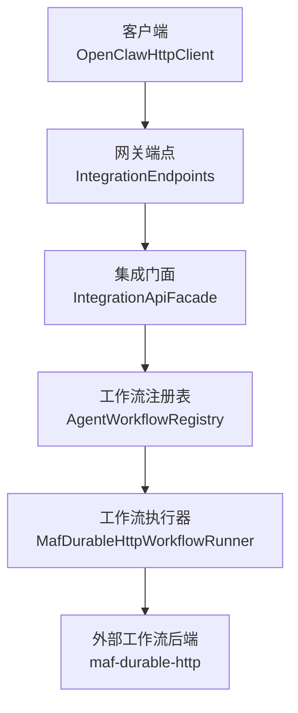
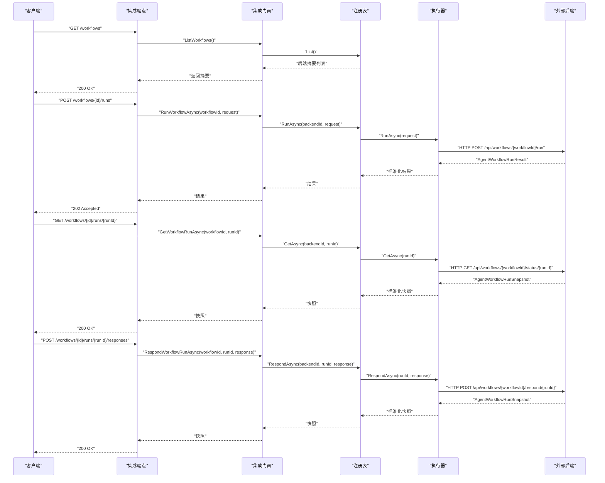
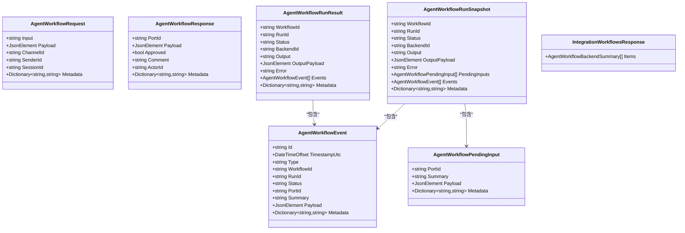
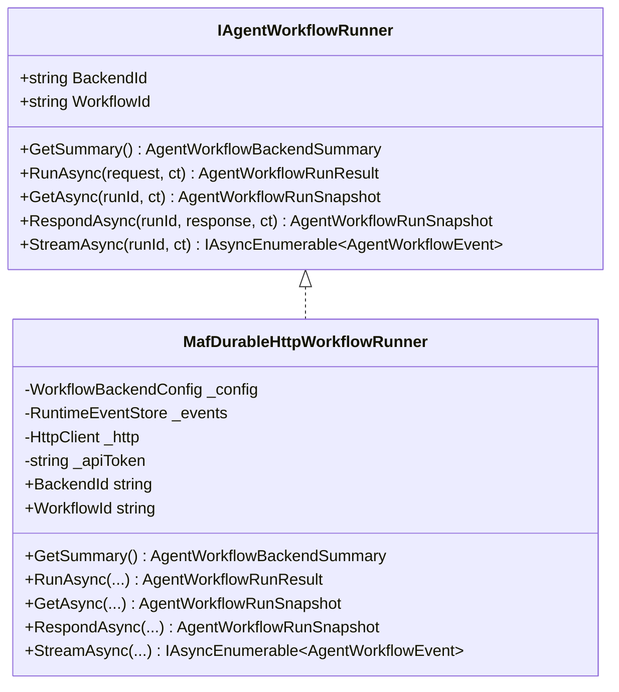
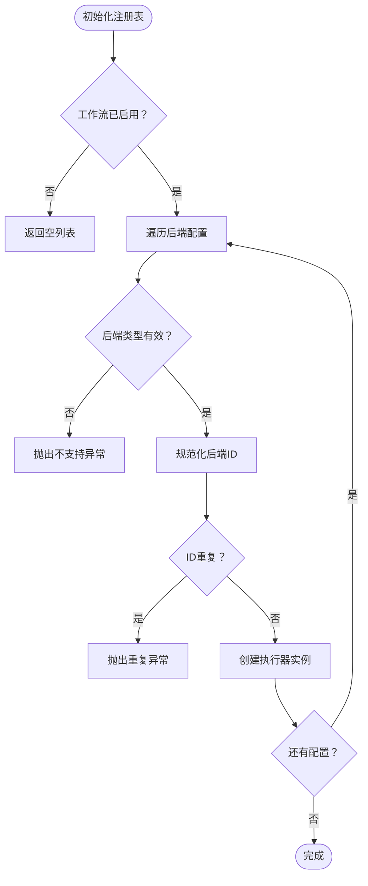
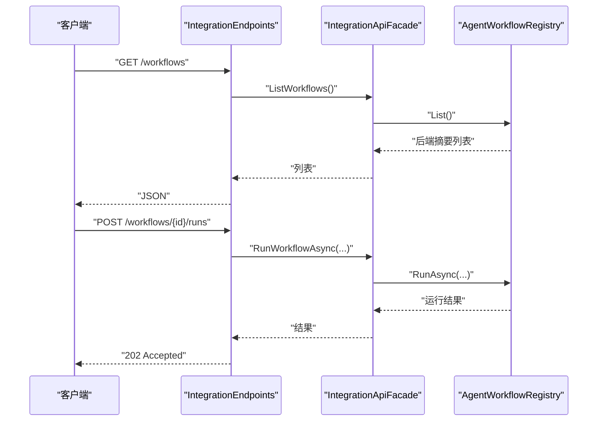
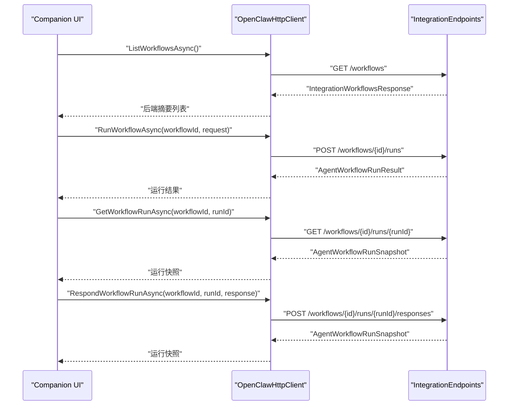
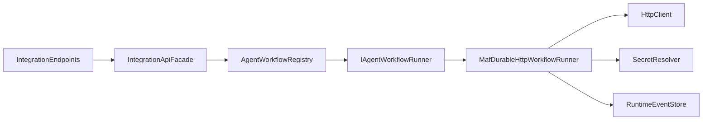

# 工作流管理

<cite>
**本文引用的文件**
- [WorkflowModels.cs](file://src/OpenClaw.Core/Models/WorkflowModels.cs)
- [IAgentWorkflowRunner.cs](file://src/OpenClaw.Core/Abstractions/IAgentWorkflowRunner.cs)
- [AgentWorkflowRegistry.cs](file://src/OpenClaw.Gateway/Workflows/AgentWorkflowRegistry.cs)
- [MafDurableHttpWorkflowRunner.cs](file://src/OpenClaw.Gateway/Workflows/MafDurableHttpWorkflowRunner.cs)
- [IntegrationEndpoints.cs](file://src/OpenClaw.Gateway/Endpoints/IntegrationEndpoints.cs)
- [IntegrationApiFacade.cs](file://src/OpenClaw.Gateway/Composition/IntegrationApiFacade.cs)
- [OpenClawHttpClient.cs](file://src/OpenClaw.Client/OpenClawHttpClient.cs)
- [MainWindowViewModel.Workflows.cs](file://src/OpenClaw.Companion/ViewModels/MainWindowViewModel.Workflows.cs)
- [WorkflowRegistryTests.cs](file://src/OpenClaw.Tests/WorkflowRegistryTests.cs)
- [EmploymentCoachWorkflowPlugin.cs](file://src/OpenClaw.Plugins.EmploymentCoachWorkflow/EmploymentCoachWorkflowPlugin.cs)
- [appsettings.json](file://src/OpenClaw.Gateway/appsettings.json)
</cite>

## 目录
1. [简介](#简介)
2. [项目结构](#项目结构)
3. [核心组件](#核心组件)
4. [架构总览](#架构总览)
5. [详细组件分析](#详细组件分析)
6. [依赖关系分析](#依赖关系分析)
7. [性能考量](#性能考量)
8. [故障排查指南](#故障排查指南)
9. [结论](#结论)
10. [附录](#附录)

## 简介
本技术文档围绕工作流管理 API 的设计与实现展开，重点解释以下方法与流程：
- 列出可用工作流：ListWorkflowsAsync
- 触发工作流执行：RunWorkflowAsync
- 查询运行快照：GetWorkflowRunAsync
- 回应等待输入：RespondWorkflowRunAsync
- 状态流式监听：StreamAsync（通过后端轮询）

文档涵盖工作流定义、执行参数、状态跟踪、错误处理、配置项与使用示例，帮助开发者与运维人员理解并正确使用工作流管理能力。

## 项目结构
工作流管理涉及三层：
- 客户端层：OpenClawHttpClient 提供对集成 API 的调用封装
- 网关层：IntegrationEndpoints 暴露 REST 接口；IntegrationApiFacade 聚合并转发到工作流注册表
- 执行层：AgentWorkflowRegistry 注册与路由工作流后端；MafDurableHttpWorkflowRunner 实现基于 HTTP 的持久化工作流执行

图表来源
- [IntegrationEndpoints.cs:350-432](file://src/OpenClaw.Gateway/Endpoints/IntegrationEndpoints.cs#L350-L432)
- [IntegrationApiFacade.cs:584-607](file://src/OpenClaw.Gateway/Composition/IntegrationApiFacade.cs#L584-L607)
- [AgentWorkflowRegistry.cs:6-90](file://src/OpenClaw.Gateway/Workflows/AgentWorkflowRegistry.cs#L6-L90)
- [MafDurableHttpWorkflowRunner.cs:13-38](file://src/OpenClaw.Gateway/Workflows/MafDurableHttpWorkflowRunner.cs#L13-L38)

章节来源
- [IntegrationEndpoints.cs:350-432](file://src/OpenClaw.Gateway/Endpoints/IntegrationEndpoints.cs#L350-L432)
- [IntegrationApiFacade.cs:584-607](file://src/OpenClaw.Gateway/Composition/IntegrationApiFacade.cs#L584-L607)
- [AgentWorkflowRegistry.cs:6-90](file://src/OpenClaw.Gateway/Workflows/AgentWorkflowRegistry.cs#L6-L90)
- [MafDurableHttpWorkflowRunner.cs:13-38](file://src/OpenClaw.Gateway/Workflows/MafDurableHttpWorkflowRunner.cs#L13-L38)

## 核心组件
- 数据模型与状态
  - 状态常量：排队、运行中、等待输入、完成、失败、取消
  - 后端类型：maf-durable-http
  - 请求/响应/结果/快照/事件/待输入等模型
- 抽象接口
  - IAgentWorkflowRunner：定义后端统一能力（运行、查询、回应、流式事件）
- 注册表与执行器
  - AgentWorkflowRegistry：按后端 ID 路由请求，支持多后端
  - MafDurableHttpWorkflowRunner：HTTP 后端适配器，负责与外部工作流系统通信
- 网关与客户端
  - IntegrationEndpoints：REST 端点
  - IntegrationApiFacade：业务门面
  - OpenClawHttpClient：客户端封装
  - Companion UI：工作流加载、执行、响应的可视化操作

章节来源
- [WorkflowModels.cs:5-119](file://src/OpenClaw.Core/Models/WorkflowModels.cs#L5-L119)
- [IAgentWorkflowRunner.cs:5-28](file://src/OpenClaw.Core/Abstractions/IAgentWorkflowRunner.cs#L5-L28)
- [AgentWorkflowRegistry.cs:6-90](file://src/OpenClaw.Gateway/Workflows/AgentWorkflowRegistry.cs#L6-L90)
- [MafDurableHttpWorkflowRunner.cs:13-318](file://src/OpenClaw.Gateway/Workflows/MafDurableHttpWorkflowRunner.cs#L13-L318)
- [IntegrationEndpoints.cs:350-432](file://src/OpenClaw.Gateway/Endpoints/IntegrationEndpoints.cs#L350-L432)
- [IntegrationApiFacade.cs:584-607](file://src/OpenClaw.Gateway/Composition/IntegrationApiFacade.cs#L584-L607)
- [OpenClawHttpClient.cs:795-821](file://src/OpenClaw.Client/OpenClawHttpClient.cs#L795-L821)
- [MainWindowViewModel.Workflows.cs:43-244](file://src/OpenClaw.Companion/ViewModels/MainWindowViewModel.Workflows.cs#L43-L244)

## 架构总览
下图展示了从客户端到后端的完整调用链路与职责划分：

图表来源
- [IntegrationEndpoints.cs:350-432](file://src/OpenClaw.Gateway/Endpoints/IntegrationEndpoints.cs#L350-L432)
- [IntegrationApiFacade.cs:584-607](file://src/OpenClaw.Gateway/Composition/IntegrationApiFacade.cs#L584-L607)
- [AgentWorkflowRegistry.cs:50-67](file://src/OpenClaw.Gateway/Workflows/AgentWorkflowRegistry.cs#L50-L67)
- [MafDurableHttpWorkflowRunner.cs:54-105](file://src/OpenClaw.Gateway/Workflows/MafDurableHttpWorkflowRunner.cs#L54-L105)

## 详细组件分析

### 组件一：数据模型与状态
- 状态枚举：包含排队、运行中、等待输入、完成、失败、取消
- 后端类型：当前仅支持 maf-durable-http
- 关键模型：
  - 请求：包含输入文本、可选负载、通道/发送者/会话标识、元数据
  - 响应：目标端口、可选负载、审批意见、评论、执行者、元数据
  - 运行结果：包含工作流/后端 ID、运行 ID、状态、输出、错误、事件、元数据
  - 运行快照：在结果基础上增加待输入集合与事件列表
  - 待输入：端口 ID、摘要、负载、元数据
  - 事件：事件 ID、时间戳、类型、关联 ID、摘要、负载、元数据
  - 集成响应：后端摘要列表

图表来源
- [WorkflowModels.cs:47-119](file://src/OpenClaw.Core/Models/WorkflowModels.cs#L47-L119)

章节来源
- [WorkflowModels.cs:5-119](file://src/OpenClaw.Core/Models/WorkflowModels.cs#L5-L119)

### 组件二：抽象接口与执行器
- IAgentWorkflowRunner：统一定义后端能力
  - 获取摘要、运行、查询、回应、事件流
- MafDurableHttpWorkflowRunner：
  - 将内部请求包装为后端元数据
  - 通过 HTTP 与外部工作流系统交互
  - 标准化结果与快照，记录状态变更事件
  - 支持轮询获取事件流，识别终止状态

图表来源
- [IAgentWorkflowRunner.cs:5-28](file://src/OpenClaw.Core/Abstractions/IAgentWorkflowRunner.cs#L5-L28)
- [MafDurableHttpWorkflowRunner.cs:13-318](file://src/OpenClaw.Gateway/Workflows/MafDurableHttpWorkflowRunner.cs#L13-L318)

章节来源
- [IAgentWorkflowRunner.cs:5-28](file://src/OpenClaw.Core/Abstractions/IAgentWorkflowRunner.cs#L5-L28)
- [MafDurableHttpWorkflowRunner.cs:13-318](file://src/OpenClaw.Gateway/Workflows/MafDurableHttpWorkflowRunner.cs#L13-L318)

### 组件三：注册表与路由
- AgentWorkflowRegistry：
  - 依据配置启用后端，校验重复 ID
  - 提供 List/Run/Get/Respond 路由
  - 释放资源时清理执行器

图表来源
- [AgentWorkflowRegistry.cs:17-42](file://src/OpenClaw.Gateway/Workflows/AgentWorkflowRegistry.cs#L17-L42)

章节来源
- [AgentWorkflowRegistry.cs:6-90](file://src/OpenClaw.Gateway/Workflows/AgentWorkflowRegistry.cs#L6-L90)
- [WorkflowRegistryTests.cs:16-99](file://src/OpenClaw.Tests/WorkflowRegistryTests.cs#L16-L99)

### 组件四：网关端点与门面
- IntegrationEndpoints：
  - 暴露 /workflows、/workflows/{id}/runs、/workflows/{id}/runs/{runId}/responses
  - 统一鉴权与错误映射（未找到、后端失败）
- IntegrationApiFacade：
  - 对外提供 ListWorkflows、RunWorkflowAsync、GetWorkflowRunAsync、RespondWorkflowRunAsync

图表来源
- [IntegrationEndpoints.cs:350-366](file://src/OpenClaw.Gateway/Endpoints/IntegrationEndpoints.cs#L350-L366)
- [IntegrationApiFacade.cs:584-594](file://src/OpenClaw.Gateway/Composition/IntegrationApiFacade.cs#L584-L594)

章节来源
- [IntegrationEndpoints.cs:350-432](file://src/OpenClaw.Gateway/Endpoints/IntegrationEndpoints.cs#L350-L432)
- [IntegrationApiFacade.cs:584-607](file://src/OpenClaw.Gateway/Composition/IntegrationApiFacade.cs#L584-L607)

### 组件五：客户端与 UI
- OpenClawHttpClient：
  - 提供 ListWorkflowsAsync、RunWorkflowAsync、GetWorkflowRunAsync、RespondWorkflowRunAsync
- Companion UI：
  - 加载工作流列表、执行工作流、查看运行详情、发送响应

图表来源
- [OpenClawHttpClient.cs:795-821](file://src/OpenClaw.Client/OpenClawHttpClient.cs#L795-L821)
- [MainWindowViewModel.Workflows.cs:43-244](file://src/OpenClaw.Companion/ViewModels/MainWindowViewModel.Workflows.cs#L43-L244)

章节来源
- [OpenClawHttpClient.cs:795-821](file://src/OpenClaw.Client/OpenClawHttpClient.cs#L795-L821)
- [MainWindowViewModel.Workflows.cs:43-244](file://src/OpenClaw.Companion/ViewModels/MainWindowViewModel.Workflows.cs#L43-L244)

## 依赖关系分析
- 组件耦合
  - IntegrationEndpoints 依赖 IntegrationApiFacade
  - IntegrationApiFacade 依赖 AgentWorkflowRegistry
  - AgentWorkflowRegistry 依赖 IAgentWorkflowRunner 实现
  - MafDurableHttpWorkflowRunner 依赖 HttpClient、SecretResolver、RuntimeEventStore
- 外部依赖
  - maf-durable-http 后端（通过 HTTP 与外部系统交互）
- 配置依赖
  - appsettings.json 中的 Workflows 配置段决定后端启用与行为

图表来源
- [IntegrationEndpoints.cs:350-432](file://src/OpenClaw.Gateway/Endpoints/IntegrationEndpoints.cs#L350-L432)
- [IntegrationApiFacade.cs:584-607](file://src/OpenClaw.Gateway/Composition/IntegrationApiFacade.cs#L584-L607)
- [AgentWorkflowRegistry.cs:6-90](file://src/OpenClaw.Gateway/Workflows/AgentWorkflowRegistry.cs#L6-L90)
- [MafDurableHttpWorkflowRunner.cs:13-38](file://src/OpenClaw.Gateway/Workflows/MafDurableHttpWorkflowRunner.cs#L13-L38)

章节来源
- [appsettings.json:147-175](file://src/OpenClaw.Gateway/appsettings.json#L147-L175)

## 性能考量
- 轮询策略
  - 默认轮询间隔为 2 秒，可通过配置调整
  - 终止条件：完成、失败、取消
- 超时设置
  - HTTP 超时默认 120 秒，范围限制在 5–3600 秒
- 并发与资源
  - 执行器在 Dispose 时释放 HttpClient
  - 事件流使用 HashSet 去重，避免重复推送

章节来源
- [MafDurableHttpWorkflowRunner.cs:113-139](file://src/OpenClaw.Gateway/Workflows/MafDurableHttpWorkflowRunner.cs#L113-L139)
- [MafDurableHttpWorkflowRunner.cs:34-37](file://src/OpenClaw.Gateway/Workflows/MafDurableHttpWorkflowRunner.cs#L34-L37)
- [MafDurableHttpWorkflowRunner.cs:142-149](file://src/OpenClaw.Gateway/Workflows/MafDurableHttpWorkflowRunner.cs#L142-L149)

## 故障排查指南
- 常见错误与处理
  - 后端未找到：KeyNotFoundException（注册表路由失败）
  - HTTP 非成功状态：抛出无效操作异常（记录日志并中断）
  - 请求体无效：JSON 解析失败时返回“请求无效”
  - CSRF 保护：响应端点需要 CSRF 校验
- 日志与事件
  - 执行器在状态变化时记录运行事件，便于审计
- 配置检查
  - 确认 appsettings.json 中 Workflows.Enabled 与后端配置有效
  - BaseUrl 必填且需以斜杠结尾
- 测试验证
  - 单元测试覆盖了后端注册、禁用、重复 ID、未知后端等边界情况

章节来源
- [IntegrationEndpoints.cs:358-365](file://src/OpenClaw.Gateway/Endpoints/IntegrationEndpoints.cs#L358-L365)
- [IntegrationEndpoints.cs:396-411](file://src/OpenClaw.Gateway/Endpoints/IntegrationEndpoints.cs#L396-L411)
- [MafDurableHttpWorkflowRunner.cs:186-194](file://src/OpenClaw.Gateway/Workflows/MafDurableHttpWorkflowRunner.cs#L186-L194)
- [WorkflowRegistryTests.cs:67-99](file://src/OpenClaw.Tests/WorkflowRegistryTests.cs#L67-L99)

## 结论
工作流管理 API 通过清晰的分层设计实现了从客户端到外部后端的全链路控制：
- 客户端通过统一的 HTTP 方法进行查询与执行
- 网关端点与门面提供一致的业务入口
- 注册表与执行器解耦不同后端实现
- 状态标准化与事件记录确保可观测性
结合配置与测试，系统具备良好的扩展性与稳定性。

## 附录

### 使用示例

- 列出工作流
  - 步骤：调用 ListWorkflowsAsync 获取后端摘要列表
  - 参考路径：[OpenClawHttpClient.cs:795-797](file://src/OpenClaw.Client/OpenClawHttpClient.cs#L795-L797)、[MainWindowViewModel.Workflows.cs:43-77](file://src/OpenClaw.Companion/ViewModels/MainWindowViewModel.Workflows.cs#L43-L77)
- 触发工作流执行
  - 步骤：构造 AgentWorkflowRequest（含输入、通道、发送者等），调用 RunWorkflowAsync
  - 参考路径：[OpenClawHttpClient.cs:799-807](file://src/OpenClaw.Client/OpenClawHttpClient.cs#L799-L807)、[MainWindowViewModel.Workflows.cs:80-146](file://src/OpenClaw.Companion/ViewModels/MainWindowViewModel.Workflows.cs#L80-L146)
- 查询运行快照
  - 步骤：调用 GetWorkflowRunAsync 获取最新状态与事件
  - 参考路径：[OpenClawHttpClient.cs:809-810](file://src/OpenClaw.Client/OpenClawHttpClient.cs#L809-L810)、[MainWindowViewModel.Workflows.cs:148-183](file://src/OpenClaw.Companion/ViewModels/MainWindowViewModel.Workflows.cs#L148-L183)
- 发送响应（等待输入）
  - 步骤：选择待输入端口，构造 AgentWorkflowResponse 并调用 RespondWorkflowRunAsync
  - 参考路径：[OpenClawHttpClient.cs:812-820](file://src/OpenClaw.Client/OpenClawHttpClient.cs#L812-L820)、[MainWindowViewModel.Workflows.cs:185-244](file://src/OpenClaw.Companion/ViewModels/MainWindowViewModel.Workflows.cs#L185-L244)

### 配置要点
- 启用工作流：Workflows.Enabled = true
- 后端类型：Kind = maf-durable-http
- 必填项：BaseUrl（需以 / 结尾）、WorkflowName（可选）
- 可选项：DisplayName、ApiTokenSecret、PollIntervalSeconds、TimeoutSeconds
- 参考路径：[appsettings.json:147-175](file://src/OpenClaw.Gateway/appsettings.json#L147-L175)

### 插件与扩展
- 就业教练工作流插件：EmploymentCoachWorkflowPlugin（占位实现）
- 参考路径：[EmploymentCoachWorkflowPlugin.cs:5-10](file://src/OpenClaw.Plugins.EmploymentCoachWorkflow/EmploymentCoachWorkflowPlugin.cs#L5-L10)