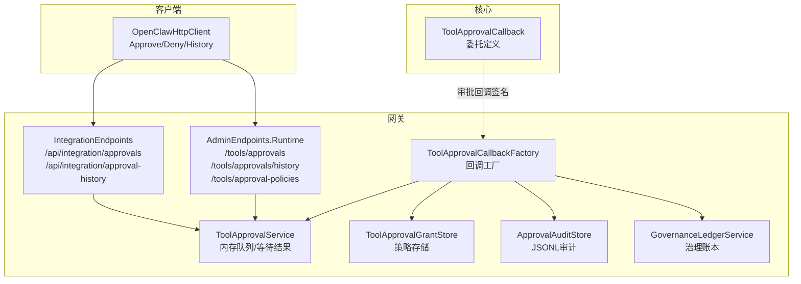
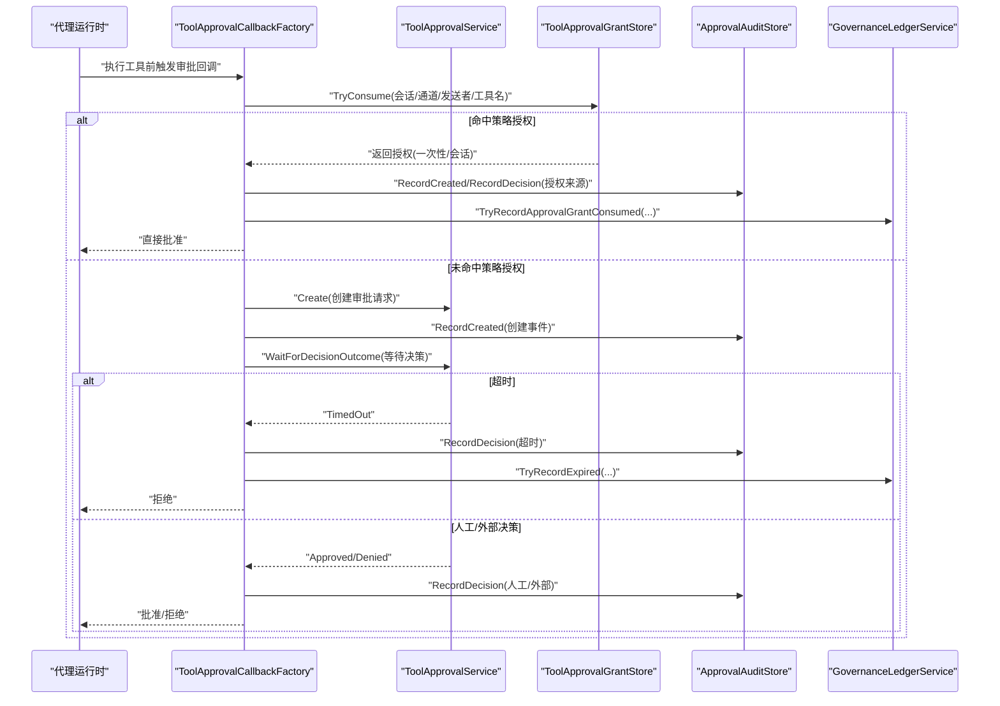
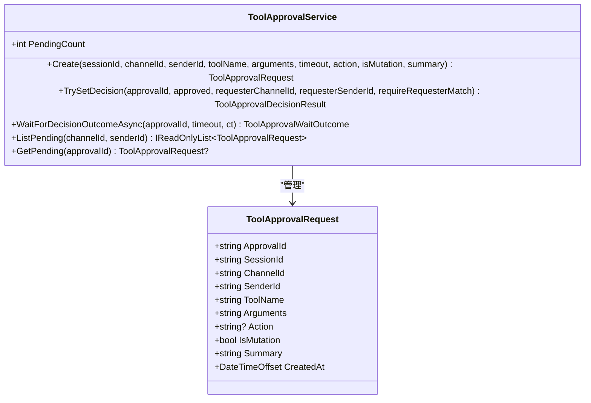
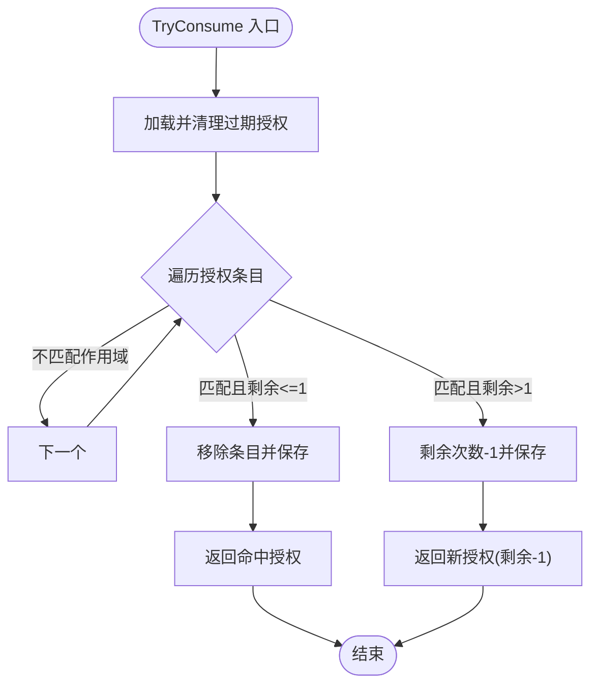
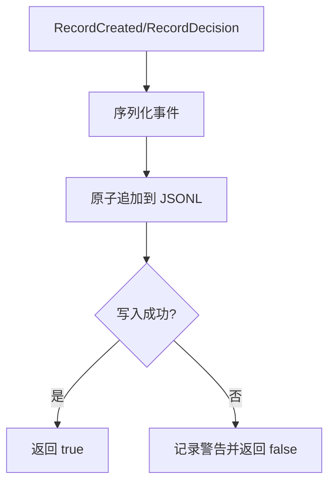
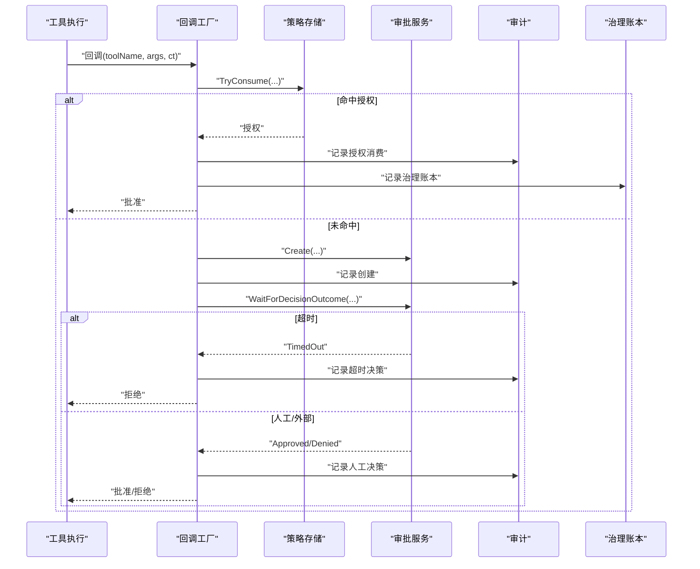
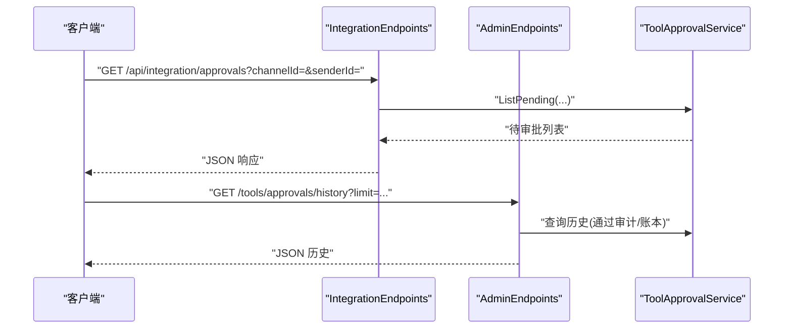
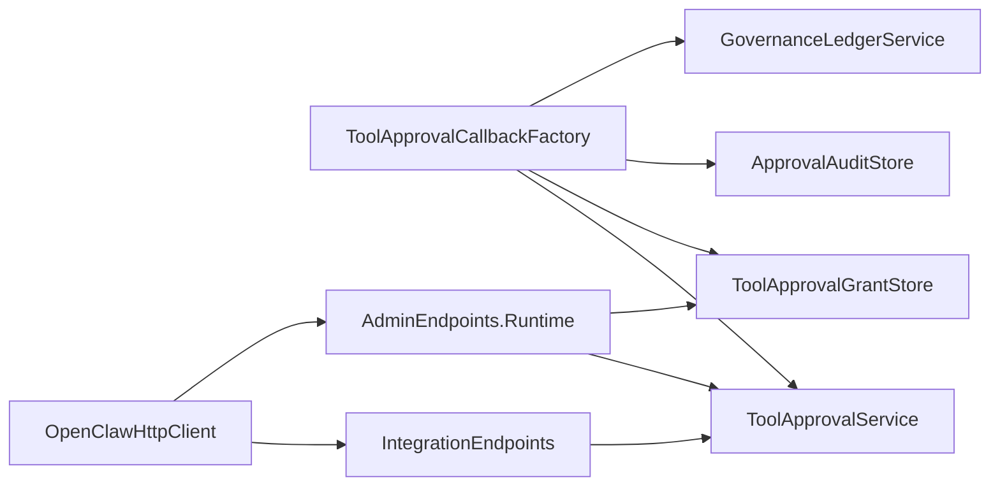

# 工具审批

<cite>
**本文引用的文件**
- [ToolApprovalService.cs](file://src/OpenClaw.Core/Pipeline/ToolApprovalService.cs)
- [ToolApprovalGrantStore.cs](file://src/OpenClaw.Gateway/ToolApprovalGrantStore.cs)
- [ApprovalAuditStore.cs](file://src/OpenClaw.Gateway/ApprovalAuditStore.cs)
- [ToolApprovalCallbackFactory.cs](file://src/OpenClaw.Gateway/ToolApprovalCallbackFactory.cs)
- [IntegrationEndpoints.cs](file://src/OpenClaw.Gateway/Endpoints/IntegrationEndpoints.cs)
- [AdminEndpoints.Runtime.cs](file://src/OpenClaw.Gateway/Endpoints/AdminEndpoints.Runtime.cs)
- [OpenClawHttpClient.cs](file://src/OpenClaw.Client/OpenClawHttpClient.cs)
- [GovernanceLedgerService.cs](file://src/OpenClaw.Gateway/GovernanceLedgerService.cs)
- [AdminObservabilityService.cs](file://src/OpenClaw.Gateway/AdminObservabilityService.cs)
- [ToolGovernanceModels.cs](file://src/OpenClaw.Core/Models/ToolGovernanceModels.cs)
- [ToolApprovalCallback.cs](file://src/OpenClaw.Agent/ToolApprovalCallback.cs)
</cite>

## 目录
1. [简介](#简介)
2. [项目结构](#项目结构)
3. [核心组件](#核心组件)
4. [架构总览](#架构总览)
5. [详细组件分析](#详细组件分析)
6. [依赖关系分析](#依赖关系分析)
7. [性能考量](#性能考量)
8. [故障排查指南](#故障排查指南)
9. [结论](#结论)
10. [附录：使用示例与最佳实践](#附录使用示例与最佳实践)

## 简介
本文件面向“工具审批”能力，围绕以下 API 方法进行深入技术说明与使用指导：
- GetIntegrationApprovalsAsync
- GetIntegrationApprovalHistoryAsync
- ApproveToolRequestAsync
- DenyToolRequestAsync

内容涵盖审批流程、权限控制、历史记录、批量操作、审批状态管理、审批策略配置、审计日志、通知机制等，并提供自动化审批、人工审核、策略定制等场景的实践建议。

## 项目结构
工具审批能力由“核心服务 + 网关端点 + 客户端封装 + 存储与审计 + 治理账本”协同构成，关键模块如下：
- 核心审批服务：内存队列、等待决策、超时处理、待审批列表查询
- 网关端点：对外暴露审批与历史查询、策略增删改查、审批决策
- 审批策略存储：基于 JSON 的可复用审批授权（一次性/会话级）
- 审计与可观测：审批事件写入 JSONL，支持历史查询与生命周期统计
- 治理账本：记录授权来源、作用域、风险级别等治理维度
- 客户端封装：集成客户端对审批 API 的调用封装

图表来源
- [IntegrationEndpoints.cs:42-80](file://src/OpenClaw.Gateway/Endpoints/IntegrationEndpoints.cs#L42-L80)
- [AdminEndpoints.Runtime.cs:39-70](file://src/OpenClaw.Gateway/Endpoints/AdminEndpoints.Runtime.cs#L39-L70)
- [ToolApprovalCallbackFactory.cs:38-153](file://src/OpenClaw.Gateway/ToolApprovalCallbackFactory.cs#L38-L153)
- [ToolApprovalService.cs:49-264](file://src/OpenClaw.Core/Pipeline/ToolApprovalService.cs#L49-L264)
- [ToolApprovalGrantStore.cs:7-164](file://src/OpenClaw.Gateway/ToolApprovalGrantStore.cs#L7-L164)
- [ApprovalAuditStore.cs:7-125](file://src/OpenClaw.Gateway/ApprovalAuditStore.cs#L7-L125)
- [GovernanceLedgerService.cs:174-204](file://src/OpenClaw.Gateway/GovernanceLedgerService.cs#L174-L204)
- [ToolApprovalCallback.cs:1-13](file://src/OpenClaw.Agent/ToolApprovalCallback.cs#L1-L13)

章节来源
- [IntegrationEndpoints.cs:42-80](file://src/OpenClaw.Gateway/Endpoints/IntegrationEndpoints.cs#L42-L80)
- [AdminEndpoints.Runtime.cs:39-70](file://src/OpenClaw.Gateway/Endpoints/AdminEndpoints.Runtime.cs#L39-L70)
- [ToolApprovalService.cs:49-264](file://src/OpenClaw.Core/Pipeline/ToolApprovalService.cs#L49-L264)
- [ToolApprovalGrantStore.cs:7-164](file://src/OpenClaw.Gateway/ToolApprovalGrantStore.cs#L7-L164)
- [ApprovalAuditStore.cs:7-125](file://src/OpenClaw.Gateway/ApprovalAuditStore.cs#L7-L125)
- [GovernanceLedgerService.cs:174-204](file://src/OpenClaw.Gateway/GovernanceLedgerService.cs#L174-L204)
- [ToolApprovalCallback.cs:1-13](file://src/OpenClaw.Agent/ToolApprovalCallback.cs#L1-L13)

## 核心组件
- ToolApprovalService：内存中的审批请求队列，支持创建、等待决策、超时默认拒绝、列出待审批、按通道/发送者过滤
- ToolApprovalGrantStore：持久化的审批策略存储，支持一次性、会话级等作用域，自动过期清理
- ApprovalAuditStore：以 JSONL 记录审批生命周期事件（创建、决策），支持分页与多维查询
- ToolApprovalCallbackFactory：在工具执行前触发审批回调，优先尝试消费策略授权，否则进入等待决策流程
- IntegrationEndpoints/AdminEndpoints：对外提供审批查询、历史查询、策略管理与审批决策接口
- GovernanceLedgerService：将审批行为纳入治理账本，标注来源、作用域、风险等级等
- OpenClawHttpClient：客户端封装 Approve/Deny/History 等 API 调用

章节来源
- [ToolApprovalService.cs:49-264](file://src/OpenClaw.Core/Pipeline/ToolApprovalService.cs#L49-L264)
- [ToolApprovalGrantStore.cs:7-164](file://src/OpenClaw.Gateway/ToolApprovalGrantStore.cs#L7-L164)
- [ApprovalAuditStore.cs:7-125](file://src/OpenClaw.Gateway/ApprovalAuditStore.cs#L7-L125)
- [ToolApprovalCallbackFactory.cs:38-153](file://src/OpenClaw.Gateway/ToolApprovalCallbackFactory.cs#L38-L153)
- [IntegrationEndpoints.cs:42-80](file://src/OpenClaw.Gateway/Endpoints/IntegrationEndpoints.cs#L42-L80)
- [AdminEndpoints.Runtime.cs:39-70](file://src/OpenClaw.Gateway/Endpoints/AdminEndpoints.Runtime.cs#L39-L70)
- [GovernanceLedgerService.cs:174-204](file://src/OpenClaw.Gateway/GovernanceLedgerService.cs#L174-L204)
- [OpenClawHttpClient.cs:371-391](file://src/OpenClaw.Client/OpenClawHttpClient.cs#L371-L391)

## 架构总览
下图展示了从工具执行到审批决策的关键交互路径，以及策略授权与审计、账本的联动：

图表来源
- [ToolApprovalCallbackFactory.cs:38-153](file://src/OpenClaw.Gateway/ToolApprovalCallbackFactory.cs#L38-L153)
- [ToolApprovalService.cs:65-218](file://src/OpenClaw.Core/Pipeline/ToolApprovalService.cs#L65-L218)
- [ToolApprovalGrantStore.cs:63-135](file://src/OpenClaw.Gateway/ToolApprovalGrantStore.cs#L63-L135)
- [ApprovalAuditStore.cs:28-71](file://src/OpenClaw.Gateway/ApprovalAuditStore.cs#L28-L71)
- [GovernanceLedgerService.cs:174-204](file://src/OpenClaw.Gateway/GovernanceLedgerService.cs#L174-L204)

## 详细组件分析

### 组件一：审批服务 ToolApprovalService
- 功能要点
  - 创建审批请求：生成唯一 ID、设置超时时间、记录会话/通道/发送者/工具名/参数摘要等
  - 等待决策：支持超时取消、默认拒绝、并发安全的完成源
  - 列出待审批：支持按通道/发送者过滤，自动清理过期与已完成项
  - 决策记录：支持带请求者匹配的授权校验，避免越权决策
- 关键数据结构
  - ToolApprovalRequest：包含审批 ID、会话 ID、通道 ID、发送者 ID、工具名、参数、是否变更类操作、摘要、创建时间等
  - ToolApprovalWaitOutcome/ToolApprovalDecisionOutcome：封装等待与决策结果
- 性能与并发
  - 使用并发字典维护待审批项，线程安全；超时采用联结取消令牌，避免资源泄漏

图表来源
- [ToolApprovalService.cs:49-264](file://src/OpenClaw.Core/Pipeline/ToolApprovalService.cs#L49-L264)

章节来源
- [ToolApprovalService.cs:49-264](file://src/OpenClaw.Core/Pipeline/ToolApprovalService.cs#L49-L264)

### 组件二：审批策略存储 ToolApprovalGrantStore
- 功能要点
  - 支持一次性、会话级等作用域；命中后自动扣减剩余次数或删除
  - 自动清理过期授权；原子化 JSON 文件写入
  - 提供新增/更新/删除/列举接口
- 作用域语义
  - once：通道+发送者维度一次性授权
  - session：会话维度授权
  - sender_tool_window：通道+发送者维度授权（窗口内多次）

图表来源
- [ToolApprovalGrantStore.cs:63-135](file://src/OpenClaw.Gateway/ToolApprovalGrantStore.cs#L63-L135)

章节来源
- [ToolApprovalGrantStore.cs:7-164](file://src/OpenClaw.Gateway/ToolApprovalGrantStore.cs#L7-L164)

### 组件三：审批审计 ApprovalAuditStore
- 功能要点
  - JSONL 追加写入，支持创建与决策两类事件
  - 查询接口支持通道、发送者、工具名、时间范围限制
  - 参数预览截断，避免日志膨胀
- 事件类型
  - created：记录审批创建
  - decision：记录最终决策（批准/拒绝/超时）及决策来源

图表来源
- [ApprovalAuditStore.cs:28-113](file://src/OpenClaw.Gateway/ApprovalAuditStore.cs#L28-L113)

章节来源
- [ApprovalAuditStore.cs:7-125](file://src/OpenClaw.Gateway/ApprovalAuditStore.cs#L7-L125)

### 组件四：审批回调工厂 ToolApprovalCallbackFactory
- 功能要点
  - 解析工具动作描述，优先尝试消费策略授权
  - 未命中则创建审批请求并等待决策
  - 超时默认拒绝，记录审计与治理账本
  - 可注入 onApprovalRequested 回调用于通知/上报
- 关键流程
  - 授权消费 -> 审计记录 -> 治理账本 -> 返回批准/拒绝

图表来源
- [ToolApprovalCallbackFactory.cs:38-153](file://src/OpenClaw.Gateway/ToolApprovalCallbackFactory.cs#L38-L153)

章节来源
- [ToolApprovalCallbackFactory.cs:38-153](file://src/OpenClaw.Gateway/ToolApprovalCallbackFactory.cs#L38-L153)

### 组件五：网关端点与客户端封装
- 集成端点（IntegrationEndpoints）
  - GET /api/integration/approvals：查询待审批列表（支持 channel/sender 过滤）
  - GET /api/integration/approval-history：查询审批历史（支持 limit/channel/sender/tool/from/to）
- 管理端点（AdminEndpoints.Runtime）
  - GET /tools/approvals、GET /tools/approvals/history：与集成端点类似，但鉴权更严格
  - POST/DELETE /tools/approval-policies：增删改查审批策略
- 客户端封装（OpenClawHttpClient）
  - ApproveToolRequestAsync、DenyToolRequestAsync：向审批端点提交决策
  - GetIntegrationApprovalsAsync、GetIntegrationApprovalHistoryAsync：拉取审批与历史

图表来源
- [IntegrationEndpoints.cs:42-80](file://src/OpenClaw.Gateway/Endpoints/IntegrationEndpoints.cs#L42-L80)
- [AdminEndpoints.Runtime.cs:39-70](file://src/OpenClaw.Gateway/Endpoints/AdminEndpoints.Runtime.cs#L39-L70)
- [OpenClawHttpClient.cs:371-391](file://src/OpenClaw.Client/OpenClawHttpClient.cs#L371-L391)

章节来源
- [IntegrationEndpoints.cs:42-80](file://src/OpenClaw.Gateway/Endpoints/IntegrationEndpoints.cs#L42-L80)
- [AdminEndpoints.Runtime.cs:39-70](file://src/OpenClaw.Gateway/Endpoints/AdminEndpoints.Runtime.cs#L39-L70)
- [OpenClawHttpClient.cs:371-391](file://src/OpenClaw.Client/OpenClawHttpClient.cs#L371-L391)

## 依赖关系分析
- ToolApprovalCallbackFactory 依赖 ToolApprovalService、ToolApprovalGrantStore、ApprovalAuditStore、GovernanceLedgerService
- IntegrationEndpoints/AdminEndpoints 依赖 ToolApprovalService 与 ApprovalAuditStore 查询能力
- OpenClawHttpClient 封装 Approve/Deny/History 请求，供上层集成使用

图表来源
- [ToolApprovalCallbackFactory.cs:38-153](file://src/OpenClaw.Gateway/ToolApprovalCallbackFactory.cs#L38-L153)
- [IntegrationEndpoints.cs:42-80](file://src/OpenClaw.Gateway/Endpoints/IntegrationEndpoints.cs#L42-L80)
- [AdminEndpoints.Runtime.cs:39-70](file://src/OpenClaw.Gateway/Endpoints/AdminEndpoints.Runtime.cs#L39-L70)
- [OpenClawHttpClient.cs:371-391](file://src/OpenClaw.Client/OpenClawHttpClient.cs#L371-L391)

章节来源
- [ToolApprovalCallbackFactory.cs:38-153](file://src/OpenClaw.Gateway/ToolApprovalCallbackFactory.cs#L38-L153)
- [IntegrationEndpoints.cs:42-80](file://src/OpenClaw.Gateway/Endpoints/IntegrationEndpoints.cs#L42-L80)
- [AdminEndpoints.Runtime.cs:39-70](file://src/OpenClaw.Gateway/Endpoints/AdminEndpoints.Runtime.cs#L39-L70)
- [OpenClawHttpClient.cs:371-391](file://src/OpenClaw.Client/OpenClawHttpClient.cs#L371-L391)

## 性能考量
- 内存队列与并发
  - ToolApprovalService 使用并发字典与任务完成源，避免锁竞争；超时采用联结取消令牌，减少阻塞
- 存储与 IO
  - 审批策略与审计均采用原子写入与 JSONL 追加，降低锁粒度；审计查询通过“最近 N 条”扫描，限制单次读取规模
- 作用域与缓存
  - ToolApprovalGrantStore 对已加载列表做缓存，命中后减少磁盘 IO；过期条目在读取时清理，保持列表整洁
- 批量与限流
  - 历史查询支持 limit 上限（如 500），避免一次性读取过大；客户端/网关端点对参数进行范围约束

[本节为通用性能讨论，无需列出具体文件来源]

## 故障排查指南
- 无待审批返回
  - 检查 ToolApprovalService.ListPending 是否被正确调用，确认 channel/sender 过滤条件
  - 章节来源
    - [ToolApprovalService.cs:220-249](file://src/OpenClaw.Core/Pipeline/ToolApprovalService.cs#L220-L249)
- 决策超时
  - 确认 ToolApprovalCallbackFactory 中的超时配置是否合理；超时将记录为拒绝并写入审计
  - 章节来源
    - [ToolApprovalCallbackFactory.cs:125-143](file://src/OpenClaw.Gateway/ToolApprovalCallbackFactory.cs#L125-L143)
- 授权未生效
  - 检查 ToolApprovalGrantStore 的作用域与有效期；确认 TryConsume 的匹配条件（通道/发送者/工具名/会话）
  - 章节来源
    - [ToolApprovalGrantStore.cs:63-135](file://src/OpenClaw.Gateway/ToolApprovalGrantStore.cs#L63-L135)
- 审计缺失
  - 确认 ApprovalAuditStore 的文件路径与权限；检查 JSONL 写入是否成功
  - 章节来源
    - [ApprovalAuditStore.cs:103-113](file://src/OpenClaw.Gateway/ApprovalAuditStore.cs#L103-L113)
- 治理账本异常
  - 检查 GovernanceLedgerService 的记录逻辑与异常日志
  - 章节来源
    - [GovernanceLedgerService.cs:174-176](file://src/OpenClaw.Gateway/GovernanceLedgerService.cs#L174-L176)

## 结论
工具审批体系以“策略授权优先、人工/外部决策兜底、完整审计与治理账本”为核心设计，既满足高风险场景的强管控，也支持低风险场景的快速放行。通过清晰的端点划分与客户端封装，便于集成与扩展。

[本节为总结性内容，无需列出具体文件来源]

## 附录：使用示例与最佳实践

### 场景一：自动化审批（基于策略授权）
- 配置策略
  - 使用管理端点 POST /tools/approval-policies 新增策略，选择作用域（如 session 或 once），设定有效期与剩余次数
  - 章节来源
    - [AdminEndpoints.Runtime.cs:305-345](file://src/OpenClaw.Gateway/Endpoints/AdminEndpoints.Runtime.cs#L305-L345)
- 执行流程
  - 工具执行前触发回调工厂；若命中策略授权，则直接批准并记录审计与治理账本
  - 章节来源
    - [ToolApprovalCallbackFactory.cs:42-66](file://src/OpenClaw.Gateway/ToolApprovalCallbackFactory.cs#L42-L66)
    - [ApprovalAuditStore.cs:28-71](file://src/OpenClaw.Gateway/ApprovalAuditStore.cs#L28-L71)
    - [GovernanceLedgerService.cs:178-204](file://src/OpenClaw.Gateway/GovernanceLedgerService.cs#L178-L204)

### 场景二：人工审核流程
- 查询待审批
  - 通过集成端点 GET /api/integration/approvals 获取当前待审批列表
  - 章节来源
    - [IntegrationEndpoints.cs:42-54](file://src/OpenClaw.Gateway/Endpoints/IntegrationEndpoints.cs#L42-L54)
- 提交决策
  - 使用客户端 ApproveToolRequestAsync 或 DenyToolRequestAsync 提交决策
  - 章节来源
    - [OpenClawHttpClient.cs:371-378](file://src/OpenClaw.Client/OpenClawHttpClient.cs#L371-L378)
- 审计与可观测
  - 通过 GET /api/integration/approval-history 查询历史，结合 AdminObservabilityService 的生命周期统计进行分析
  - 章节来源
    - [IntegrationEndpoints.cs:56-80](file://src/OpenClaw.Gateway/Endpoints/IntegrationEndpoints.cs#L56-L80)
    - [AdminObservabilityService.cs:966-996](file://src/OpenClaw.Gateway/AdminObservabilityService.cs#L966-L996)

### 场景三：审批策略定制
- 作用域选择
  - once：适合一次性高风险工具调用
  - session：适合会话内的多次低风险工具调用
  - sender_tool_window：适合特定发送者对特定工具的临时授权
  - 章节来源
    - [ToolApprovalGrantStore.cs:84-96](file://src/OpenClaw.Gateway/ToolApprovalGrantStore.cs#L84-L96)
- 风险与治理
  - 结合治理模型（风险等级、只读、网络访问、文件系统访问等）制定策略
  - 章节来源
    - [ToolGovernanceModels.cs:15-78](file://src/OpenClaw.Core/Models/ToolGovernanceModels.cs#L15-L78)

### 场景四：批量操作与批量策略
- 批量查询待审批
  - 在集成端点 /api/integration/approvals 支持 channel/sender 过滤，便于批量筛选
  - 章节来源
    - [IntegrationEndpoints.cs:42-54](file://src/OpenClaw.Gateway/Endpoints/IntegrationEndpoints.cs#L42-L54)
- 批量策略管理
  - 通过管理端点 /tools/approval-policies 的增删改查接口进行批量策略导入/导出与调整
  - 章节来源
    - [AdminEndpoints.Runtime.cs:305-364](file://src/OpenClaw.Gateway/Endpoints/AdminEndpoints.Runtime.cs#L305-L364)

### API 使用清单
- 获取待审批列表
  - 集成端点：GET /api/integration/approvals?channelId=&senderId=
  - 管理端点：GET /tools/approvals?channelId=&senderId=
  - 章节来源
    - [IntegrationEndpoints.cs:42-54](file://src/OpenClaw.Gateway/Endpoints/IntegrationEndpoints.cs#L42-L54)
    - [AdminEndpoints.Runtime.cs:39-51](file://src/OpenClaw.Gateway/Endpoints/AdminEndpoints.Runtime.cs#L39-L51)
- 获取审批历史
  - 集成端点：GET /api/integration/approval-history?limit=&channelId=&senderId=&toolName=&fromUtc=&toUtc=
  - 管理端点：GET /tools/approvals/history?limit=&channelId=&senderId=&toolName=&fromUtc=&toUtc=
  - 章节来源
    - [IntegrationEndpoints.cs:56-80](file://src/OpenClaw.Gateway/Endpoints/IntegrationEndpoints.cs#L56-L80)
    - [AdminEndpoints.Runtime.cs:53-70](file://src/OpenClaw.Gateway/Endpoints/AdminEndpoints.Runtime.cs#L53-L70)
- 提交审批决策
  - 客户端封装：ApproveToolRequestAsync(approvalId)、DenyToolRequestAsync(approvalId)
  - 章节来源
    - [OpenClawHttpClient.cs:371-378](file://src/OpenClaw.Client/OpenClawHttpClient.cs#L371-L378)