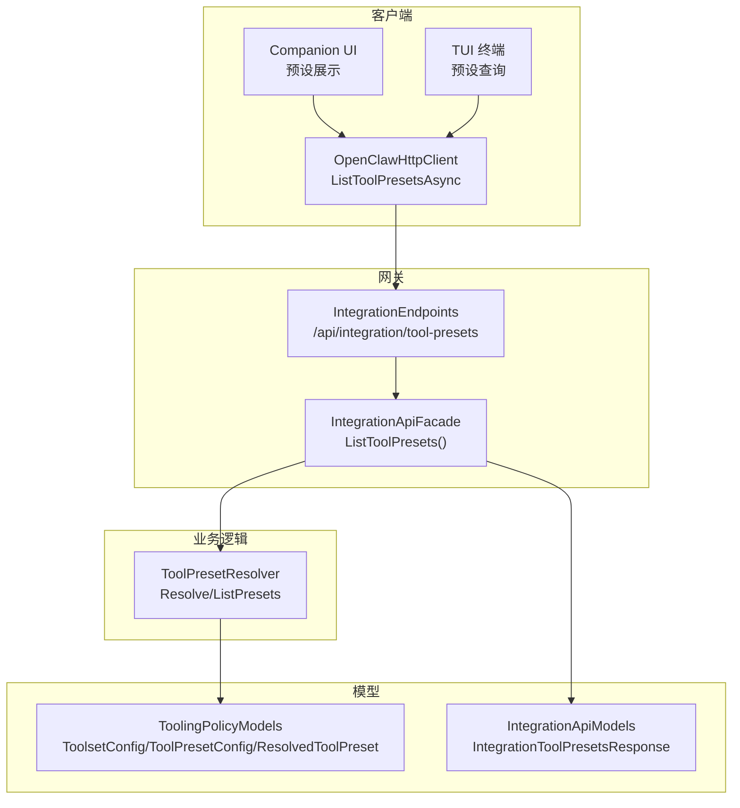
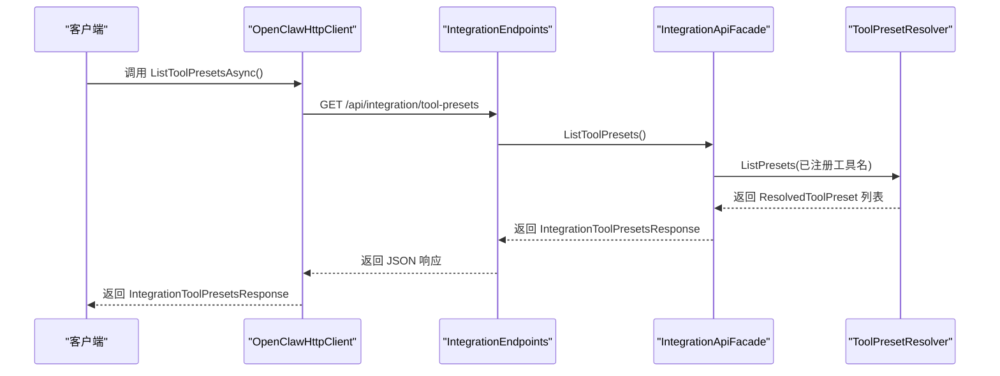
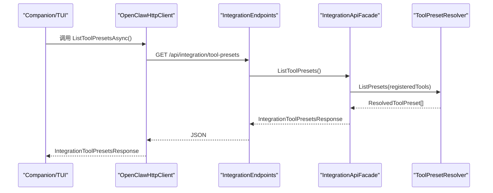
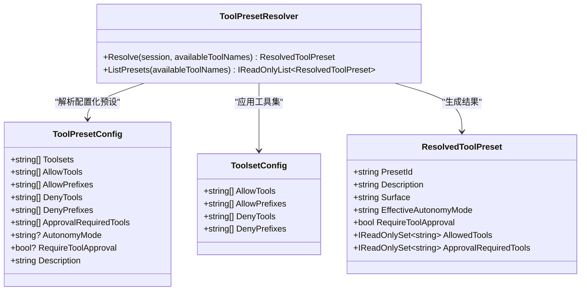
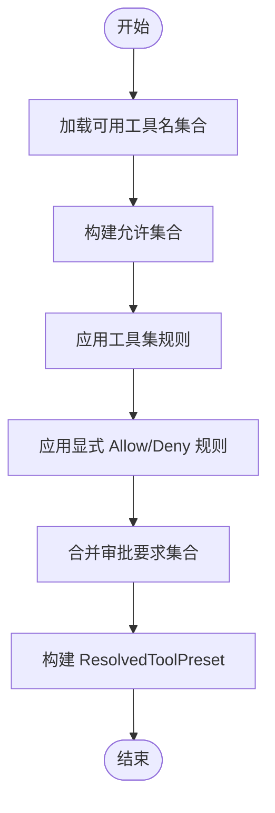
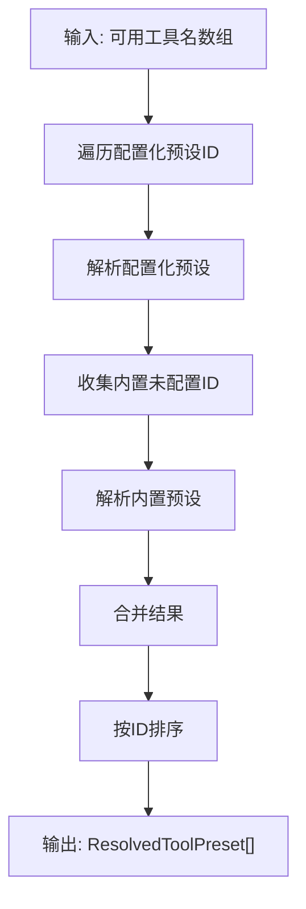
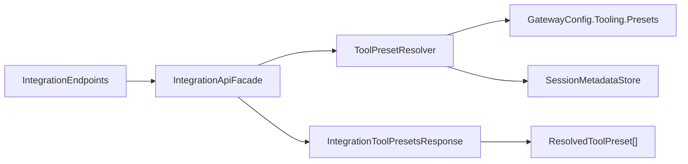

# 工具预设管理

<cite>
**本文档引用的文件**
- [ToolPresetResolver.cs](file://src/OpenClaw.Gateway/ToolPresetResolver.cs)
- [IToolPresetResolver.cs](file://src/OpenClaw.Core/Abstractions/IToolPresetResolver.cs)
- [IntegrationEndpoints.cs](file://src/OpenClaw.Gateway/Endpoints/IntegrationEndpoints.cs)
- [IntegrationApiFacade.cs](file://src/OpenClaw.Gateway/Composition/IntegrationApiFacade.cs)
- [OpenClawHttpClient.cs](file://src/OpenClaw.Client/OpenClawHttpClient.cs)
- [ToolingPolicyModels.cs](file://src/OpenClaw.Core/Models/ToolingPolicyModels.cs)
- [IntegrationApiModels.cs](file://src/OpenClaw.Core/Models/IntegrationApiModels.cs)
- [MainWindowViewModel.Providers.cs](file://src/OpenClaw.Companion/ViewModels/MainWindowViewModel.Providers.cs)
- [TerminalUi.cs](file://src/OpenClaw.Tui/TerminalUi.cs)
</cite>

## 目录
1. [简介](#简介)
2. [项目结构](#项目结构)
3. [核心组件](#核心组件)
4. [架构总览](#架构总览)
5. [详细组件分析](#详细组件分析)
6. [依赖关系分析](#依赖关系分析)
7. [性能考虑](#性能考虑)
8. [故障排除指南](#故障排除指南)
9. [结论](#结论)
10. [附录](#附录)

## 简介
本文件面向工具预设管理 API 的技术文档，重点围绕 ListToolPresetsAsync 方法的实现与使用进行深入解析。内容涵盖：
- 工具预设查询流程与数据模型
- 预设类型（内置与配置化）与继承关系
- 参数配置（允许/拒绝工具、前缀匹配、审批要求）
- 版本控制与兼容性策略
- 实际使用示例：创建与管理工具预设、应用预设配置、实现预设共享

该能力通过网关集成端点暴露，客户端可通过 HTTP 客户端调用，返回可用工具预设列表及其生效规则。

## 项目结构
工具预设管理涉及以下关键模块：
- 网关端点层：负责路由与授权校验，将请求转发至门面层
- 门面层：封装业务逻辑，调用预设解析器生成预设结果
- 预设解析器：根据配置与内置规则计算可用工具集合
- 模型层：定义工具集、预设配置与响应模型
- 客户端层：提供 ListToolPresetsAsync 方法供上层应用调用

图表来源
- [IntegrationEndpoints.cs:303-312](file://src/OpenClaw.Gateway/Endpoints/IntegrationEndpoints.cs#L303-L312)
- [IntegrationApiFacade.cs:578-582](file://src/OpenClaw.Gateway/Composition/IntegrationApiFacade.cs#L578-L582)
- [ToolPresetResolver.cs:68-101](file://src/OpenClaw.Gateway/ToolPresetResolver.cs#L68-L101)
- [ToolingPolicyModels.cs:3-45](file://src/OpenClaw.Core/Models/ToolingPolicyModels.cs#L3-L45)
- [IntegrationApiModels.cs:199-202](file://src/OpenClaw.Core/Models/IntegrationApiModels.cs#L199-L202)

章节来源
- [IntegrationEndpoints.cs:303-312](file://src/OpenClaw.Gateway/Endpoints/IntegrationEndpoints.cs#L303-L312)
- [IntegrationApiFacade.cs:578-582](file://src/OpenClaw.Gateway/Composition/IntegrationApiFacade.cs#L578-L582)
- [ToolPresetResolver.cs:68-101](file://src/OpenClaw.Gateway/ToolPresetResolver.cs#L68-L101)

## 核心组件
- 接口 IToolPresetResolver：定义解析与列出预设的能力
- ToolPresetResolver：具体实现，支持内置预设与配置化预设
- IntegrationEndpoints：/api/integration/tool-presets 端点
- IntegrationApiFacade：门面层，调用解析器并返回响应
- OpenClawHttpClient：客户端封装，提供 ListToolPresetsAsync
- 模型：ToolsetConfig、ToolPresetConfig、ResolvedToolPreset、IntegrationToolPresetsResponse

章节来源
- [IToolPresetResolver.cs:5-9](file://src/OpenClaw.Core/Abstractions/IToolPresetResolver.cs#L5-L9)
- [ToolPresetResolver.cs:6-101](file://src/OpenClaw.Gateway/ToolPresetResolver.cs#L6-L101)
- [IntegrationEndpoints.cs:303-312](file://src/OpenClaw.Gateway/Endpoints/IntegrationEndpoints.cs#L303-L312)
- [IntegrationApiFacade.cs:578-582](file://src/OpenClaw.Gateway/Composition/IntegrationApiFacade.cs#L578-L582)
- [OpenClawHttpClient.cs:547-549](file://src/OpenClaw.Client/OpenClawHttpClient.cs#L547-L549)
- [ToolingPolicyModels.cs:3-45](file://src/OpenClaw.Core/Models/ToolingPolicyModels.cs#L3-L45)
- [IntegrationApiModels.cs:199-202](file://src/OpenClaw.Core/Models/IntegrationApiModels.cs#L199-L202)

## 架构总览
下图展示了从客户端到网关再到业务逻辑的完整调用链路：

图表来源
- [OpenClawHttpClient.cs:547-549](file://src/OpenClaw.Client/OpenClawHttpClient.cs#L547-L549)
- [IntegrationEndpoints.cs:303-312](file://src/OpenClaw.Gateway/Endpoints/IntegrationEndpoints.cs#L303-L312)
- [IntegrationApiFacade.cs:578-582](file://src/OpenClaw.Gateway/Composition/IntegrationApiFacade.cs#L578-L582)
- [ToolPresetResolver.cs:90-101](file://src/OpenClaw.Gateway/ToolPresetResolver.cs#L90-L101)

## 详细组件分析

### ListToolPresetsAsync 方法实现与使用
- 客户端调用：OpenClawHttpClient 提供 ListToolPresetsAsync，内部通过 GET 请求访问 /api/integration/tool-presets
- 网关端点：IntegrationEndpoints 将请求映射到 ListToolPresets，并返回 IntegrationToolPresetsResponse
- 门面层：IntegrationApiFacade 调用 ToolPresetResolver.ListPresets，传入当前运行时已注册的工具名称集合
- 解析器：ToolPresetResolver 计算所有可用预设（包含配置化与内置），并按预设 ID 排序返回

图表来源
- [OpenClawHttpClient.cs:547-549](file://src/OpenClaw.Client/OpenClawHttpClient.cs#L547-L549)
- [IntegrationEndpoints.cs:303-312](file://src/OpenClaw.Gateway/Endpoints/IntegrationEndpoints.cs#L303-L312)
- [IntegrationApiFacade.cs:578-582](file://src/OpenClaw.Gateway/Composition/IntegrationApiFacade.cs#L578-L582)
- [ToolPresetResolver.cs:90-101](file://src/OpenClaw.Gateway/ToolPresetResolver.cs#L90-L101)

章节来源
- [OpenClawHttpClient.cs:547-549](file://src/OpenClaw.Client/OpenClawHttpClient.cs#L547-L549)
- [IntegrationEndpoints.cs:303-312](file://src/OpenClaw.Gateway/Endpoints/IntegrationEndpoints.cs#L303-L312)
- [IntegrationApiFacade.cs:578-582](file://src/OpenClaw.Gateway/Composition/IntegrationApiFacade.cs#L578-L582)
- [MainWindowViewModel.Providers.cs:38-38](file://src/OpenClaw.Companion/ViewModels/MainWindowViewModel.Providers.cs#L38-L38)
- [TerminalUi.cs:246-246](file://src/OpenClaw.Tui/TerminalUi.cs#L246-L246)

### 预设类型与继承关系
- 内置预设：由 ToolPresetResolver 内部维护，覆盖常见场景如 web、telegram、automation、readonly、full、coding、messaging、minimal 等
- 配置化预设：来自 GatewayConfig.Tooling.Presets，可组合多个 ToolsetConfig 或直接声明 Allow/Deny 规则
- 继承与合并：配置化预设可引用内置或自定义 Toolset；最终允许集合通过集合交并运算得到

图表来源
- [ToolPresetResolver.cs:48-101](file://src/OpenClaw.Gateway/ToolPresetResolver.cs#L48-L101)
- [ToolingPolicyModels.cs:11-45](file://src/OpenClaw.Core/Models/ToolingPolicyModels.cs#L11-L45)

章节来源
- [ToolPresetResolver.cs:48-101](file://src/OpenClaw.Gateway/ToolPresetResolver.cs#L48-L101)
- [ToolingPolicyModels.cs:11-45](file://src/OpenClaw.Core/Models/ToolingPolicyModels.cs#L11-L45)

### 参数配置与规则引擎
- 工具集（ToolsetConfig）：支持 AllowTools、AllowPrefixes、DenyTools、DenyPrefixes
- 预设配置（ToolPresetConfig）：在工具集基础上叠加 Allow/Deny 规则，可指定审批必需要求与自治模式
- 决策流程：先取工具集交集，再应用显式 Allow/Deny，最后合并审批要求集合

图表来源
- [ToolPresetResolver.cs:155-219](file://src/OpenClaw.Gateway/ToolPresetResolver.cs#L155-L219)

章节来源
- [ToolPresetResolver.cs:155-219](file://src/OpenClaw.Gateway/ToolPresetResolver.cs#L155-L219)

### 预设查询算法细节
- 列表生成：遍历配置化预设 ID，逐一解析；对未被配置化的内置 ID（如 web、telegram 等）单独解析
- 排序：按预设 ID 字典序排序，便于 UI 展示与选择
- 表面绑定：根据会话渠道推断表面（surface），用于默认预设选择与描述

图表来源
- [ToolPresetResolver.cs:90-101](file://src/OpenClaw.Gateway/ToolPresetResolver.cs#L90-L101)

章节来源
- [ToolPresetResolver.cs:90-101](file://src/OpenClaw.Gateway/ToolPresetResolver.cs#L90-L101)

### 使用示例

- 在 Companion UI 中展示预设
  - 通过客户端调用 ListToolPresetsAsync 获取预设列表，转换为 UI 行模型进行展示
  - 示例路径参考：[MainWindowViewModel.Providers.cs:38-38](file://src/OpenClaw.Companion/ViewModels/MainWindowViewModel.Providers.cs#L38-L38)

- 在 TUI 终端中查询预设
  - 终端程序调用 ListToolPresetsAsync 并打印可用预设信息
  - 示例路径参考：[TerminalUi.cs:246-246](file://src/OpenClaw.Tui/TerminalUi.cs#L246-L246)

- 在自动化脚本中批量获取预设
  - 通过 OpenClawHttpClient.ListToolPresetsAsync 获取 IntegrationToolPresetsResponse，解析 Items 中的每个 ResolvedToolPreset
  - 示例路径参考：[OpenClawHttpClient.cs:547-549](file://src/OpenClaw.Client/OpenClawHttpClient.cs#L547-L549)

章节来源
- [MainWindowViewModel.Providers.cs:38-38](file://src/OpenClaw.Companion/ViewModels/MainWindowViewModel.Providers.cs#L38-L38)
- [TerminalUi.cs:246-246](file://src/OpenClaw.Tui/TerminalUi.cs#L246-L246)
- [OpenClawHttpClient.cs:547-549](file://src/OpenClaw.Client/OpenClawHttpClient.cs#L547-L549)

## 依赖关系分析
- 网关端点依赖门面层，门面层依赖预设解析器
- 预设解析器依赖配置模型与会话元数据存储
- 客户端依赖 JSON 序列化上下文以正确反序列化响应

图表来源
- [IntegrationEndpoints.cs:303-312](file://src/OpenClaw.Gateway/Endpoints/IntegrationEndpoints.cs#L303-L312)
- [IntegrationApiFacade.cs:578-582](file://src/OpenClaw.Gateway/Composition/IntegrationApiFacade.cs#L578-L582)
- [ToolPresetResolver.cs:59-66](file://src/OpenClaw.Gateway/ToolPresetResolver.cs#L59-L66)
- [IntegrationApiModels.cs:199-202](file://src/OpenClaw.Core/Models/IntegrationApiModels.cs#L199-L202)

章节来源
- [IntegrationEndpoints.cs:303-312](file://src/OpenClaw.Gateway/Endpoints/IntegrationEndpoints.cs#L303-L312)
- [IntegrationApiFacade.cs:578-582](file://src/OpenClaw.Gateway/Composition/IntegrationApiFacade.cs#L578-L582)
- [ToolPresetResolver.cs:59-66](file://src/OpenClaw.Gateway/ToolPresetResolver.cs#L59-L66)
- [IntegrationApiModels.cs:199-202](file://src/OpenClaw.Core/Models/IntegrationApiModels.cs#L199-L202)

## 性能考虑
- 预设计算复杂度：主要为集合操作（交并差），与工具数量线性相关
- 缓存建议：若工具集稳定，可在门面层缓存解析结果，减少重复计算
- 分页与过滤：当前端点返回全量预设；如工具集规模较大，可考虑在服务端增加分页或过滤参数

## 故障排除指南
- 401/403 授权失败：确认请求头携带有效认证信息，端点需 integration.read 权限
- 400 请求参数错误：检查请求是否符合 JSON 格式规范
- 预设为空：确认运行时已注册工具名集合非空，或配置中存在有效的 Toolset/ToolPreset
- UI 不显示预设：检查客户端是否正确调用 ListToolPresetsAsync 并完成数据绑定

章节来源
- [IntegrationEndpoints.cs:303-312](file://src/OpenClaw.Gateway/Endpoints/IntegrationEndpoints.cs#L303-L312)

## 结论
ListToolPresetsAsync 提供了统一的工具预设查询入口，结合配置化与内置预设机制，能够灵活适配不同渠道与场景。通过清晰的模型与接口设计，开发者可以便捷地创建、管理与共享工具预设，同时保证安全与可控的工具使用边界。

## 附录

### 数据模型速查
- ToolsetConfig：定义工具集的允许/拒绝规则
- ToolPresetConfig：定义预设的工具集引用与显式规则
- ResolvedToolPreset：最终解析出的预设结果，包含生效工具集合与审批要求
- IntegrationToolPresetsResponse：API 响应容器，包含预设列表

章节来源
- [ToolingPolicyModels.cs:3-45](file://src/OpenClaw.Core/Models/ToolingPolicyModels.cs#L3-L45)
- [IntegrationApiModels.cs:199-202](file://src/OpenClaw.Core/Models/IntegrationApiModels.cs#L199-L202)